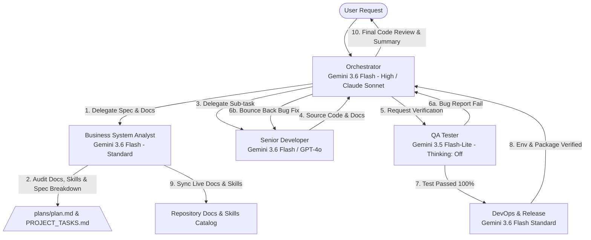

# AI SDLC Multi-Agent Architecture & Model Allocation Policy
> **Project:** HoroConsultant  
> **Target Framework:** Antigravity CLI AI SDLC System  
> **Goal:** Maximum Quality & Architecture Security with Optimal Token Cost Efficiency

---

## 📌 Model Strategy & Cost Efficiency Matrix

To achieve maximum performance at minimum token expenditure, the system utilizes a high-reasoning model for orchestration and architecture planning, while delegating high-volume code writing, testing, and deployment operations to standard or light models.

### 🎯 Multi-Model Quota Optimization Tiering

| Agent Identifier | Role | Primary Baseline (Gemini-First) | Quota-Enhanced Alternative (Claude / GPT) | Thinking Effort | Token Cost Profile | Primary Focus |
| :--- | :--- | :--- | :--- | :--- | :--- | :--- |
| **`orchestrator`** | Master Orchestrator (The Brain) | `Gemini 3.6 Flash` | `Claude Sonnet 3.7 / 4.6` | **High** | High (Strategic) | Requirements Analysis, Architecture Blueprinting, Spec Breakdown, Delegation, Final Code Review Gateway |
| **`business_analyst`** | Business System Analyst (The Spec & Skill Architect) | `Gemini 3.6 Flash` | `Claude Sonnet 3.5` / `GPT-4o` | **Standard** | Mid (Analysis) | Requirements Analysis, Spec Breakdown, Live Docs Watchdog (PROJECT_TASKS.md, plans/plan.md), Agent Skill Governance |
| **`developer`** | Senior Developer (The Hands) | `Gemini 3.6 Flash` (Standard) / `Gemini 3.5 Flash-Lite` | `Claude Sonnet 3.5` / `GPT-4o` | **Standard / Off** | Mid-Low (Execution) | Full-Stack Coding, Inline Documentation, Bug Fixes based on QA reports |
| **`qa_tester`** | QA Tester (The Guard) | `Gemini 3.5 Flash-Lite` | `GPT-4o-mini` / `Gemini 3.5 Flash-Lite` | **Off** | Lowest (Audit) | Test Case Generation, `pytest` Test Execution, Pessimistic Bug/Vulnerability Identification |
| **`devops`** | DevOps & Release (The Bridge) | `Gemini 3.6 Flash` (Standard) | `GPT-4o` / `Gemini 3.6 Flash` | **Standard** | Mid (Infrastructure) | Environment Verification (.env, Docker), CLI/Shell Command Approval, Packaging & Release Readiness |
| **`code_reviewer`** | Code Reviewer & Safety Auditor | `Gemini 3.6 Flash` | `Claude Sonnet 3.5` | **Standard** | Mid (Audit) | Pre-Deployment Audit (`READY_FOR_PROD`), Secret Leakage Scanning, Governance Mandates Check |
| **Domain Masters** | Metaphysics & Astro Experts | `Gemini 3.6 Flash` (Textual Reasoning) / `Gemini 3.5 Flash-Lite` (Engines) | `Claude Sonnet 3.5` (Metaphysics) / `GPT-4o` (Math) | **Standard / Off** | Low-Mid (Domain) | Canonical Text Verification, Engine Output Interpretation, Cross-Domain Consensus |

---

## 🧰 Modular Skills Catalog for SDLC / AI SDLC

1. **`sdlc-aisdlc-workflow`**: Full 5-phase AI SDLC lifecycle guide (Planning, Dev, QA, DevOps, Post-Deploy E2E).
2. **`qa-e2e-testing`**: Pytest suite, Playwright E2E screenshots, and 22-button UI regression suite commands.
3. **`devops-deployment`**: Doppler secret sync, Hugging Face Spaces publishing, Docker compose, and secret leakage scanning.
4. **`kaggle-manager`**: Kaggle GPU Fine-Tuning notebook automation (`--status`, `--push`, `--pull`).
5. **`bazi-calculator`**: Deterministic 4-Pillars, True Solar Time & Five Elements calculation skill.
6. **`rag-search`**: Local FAISS vector search across 3,132 ingested metaphysical text chunks.
7. **`bsa-doc-skill-management`**: Business System Analysis, live documentation audit, and agent skill governance skill.

---

## 🔄 Agent Execution Flow & Collaboration Protocol

---

## ⚡ Token Cost Efficiency Rules & Dynamic Failover

1. **Gemini-First Production Standard**: Gemini 3.6 Flash and 3.5 Flash-Lite serve as the core zero-downtime workhorse models due to 2M token context windows, high execution speed, and token cost savings.
2. **Claude & GPT Hybrid Routing**:
   - Use **Claude Sonnet** when deep architectural synthesis or resolving complex domain paradoxes is required.
   - Use **GPT-4o / O3-mini** when validating strict JSON/Pydantic schemas, OpenAPI specs, or fast logic verification.
3. **Automatic API Overload & Quota Failover**: If Claude or GPT API models hit rate-limits, quota limits, or overload status, system automatically fails over to `Gemini 3.6 Flash` (High Reasoning) without halting development workflows.
4. **Log Trimming Rule**: QA and DevOps agents MUST parse and filter log outputs (using `Gemini 3.5 Flash-Lite`) to pass concise, relevant error snippets to Developer and Orchestrator rather than dumping raw log contexts.

---

## 🛡️ Core Rules & Safeguards

1. **Strict Delegation**: The Orchestrator does not write substantial code directly unless emergency intervention is required.
2. **Deterministic Execution**: Developer and QA agents must strictly follow specs provided by Orchestrator without altering architectural blueprints.
3. **Pure ASCII Logging Guard**: Subprocess outputs must strictly use ASCII tags (`[OK]`, `[ERROR]`, `[WARNING]`, `[INFO]`) to avoid UTF-8 surrogate crashes.
4. **Package Locks**: All Python scripts must respect locked versions in `.agent_rules.md` (`transformers==4.44.2`, `peft==0.12.0`, etc.).
5. **No Blind Command Execution**: Shell commands must be verified and executed through DevOps or inline approval rules.
6. **Pre-Development Kaggle Sync**: Before starting any development or modifying code, agents MUST run `python3 scripts/kaggle_notebook_manager.py --status` (and `--pull` if updated) to verify and sync the latest Kaggle kernel status/outputs.
7. **Locked Kaggle Accelerator Stage**: `project/kaggle_kernel/kernel-metadata.json` accelerator settings (such as `"machine_shape": "NvidiaTeslaT4"`) are permanently preserved and locked. Agents MUST NEVER modify, overwrite, or toggle `kernel-metadata.json` accelerator fields.
8. **Centralized Secrets & Lessons Learned Audit**: Agents MUST enforce the 2-Tier Priority Secrets Policy (`.agents/rules/06-secrets-policy.md`) and consult `.agents/LESSONS_LEARNED.md` before performing MLOps or architectural changes.
9. **Documentation & Skill Up-to-date Mandate**: The Business System Analyst (`business_analyst`) MUST audit and keep all repo documentation (`PROJECT_TASKS.md`, `README.md`, `HOWTO.md`, `plans/plan.md`) and `.agents/skills/` definitions fully updated and aligned with actual implementation code.