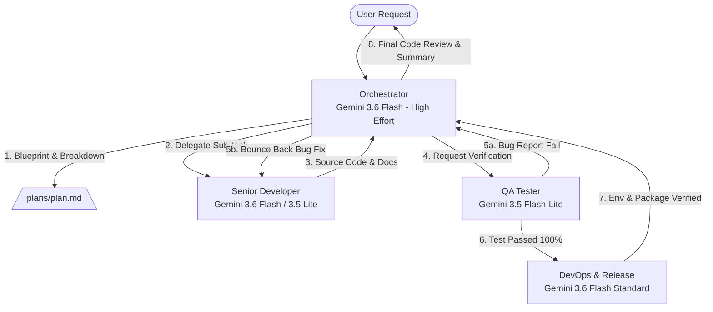

# AI SDLC Multi-Agent Architecture & Model Allocation Policy
> **Project:** HoroConsultant  
> **Target Framework:** Antigravity CLI AI SDLC System  
> **Goal:** Maximum Quality & Architecture Security with Optimal Token Cost Efficiency

---

## 📌 Model Strategy & Cost Efficiency Matrix

To achieve maximum performance at minimum token expenditure, the system utilizes a high-reasoning model only for orchestration and architecture planning, while delegating high-volume code writing, testing, and deployment operations to standard or light models.

| Agent Identifier | Role | Model Selection | Thinking Effort | Token Cost Profile | Primary Focus |
| :--- | :--- | :--- | :--- | :--- | :--- |
| **`orchestrator`** | Master Orchestrator (The Brain) | `Gemini 3.6 Flash` | **High** | High (Strategic) | Requirements Analysis, Architecture Blueprinting, Spec Breakdown, Delegation, Final Code Review Gateway |
| **`developer`** | Senior Developer (The Hands) | `Gemini 3.6 Flash` (Standard) / `Gemini 3.5 Flash-Lite` | **Standard / Off** | Mid-Low (Execution) | Full-Stack Coding, Inline Documentation, Bug Fixes based on QA reports |
| **`qa_tester`** | QA Tester (The Guard) | `Gemini 3.5 Flash-Lite` | **Off** | Lowest (Audit) | Test Case Generation, `pytest` Test Execution, Pessimistic Bug/Vulnerability Identification |
| **`devops`** | DevOps & Release (The Bridge) | `Gemini 3.6 Flash` (Standard) | **Standard** | Mid (Infrastructure) | Environment Verification (.env, Docker), CLI/Shell Command Approval, Packaging & Release Readiness |

---

## 🔄 Agent Execution Flow & Collaboration Protocol

---

## 🛡️ Core Rules & Safeguards

1. **Strict Delegation**: The Orchestrator does not write substantial code directly unless emergency intervention is required.
2. **Deterministic Execution**: Developer and QA agents must strictly follow specs provided by Orchestrator without altering architectural blueprints.
3. **Pure ASCII Logging Guard**: Subprocess outputs must strictly use ASCII tags (`[OK]`, `[ERROR]`, `[WARNING]`, `[INFO]`) to avoid UTF-8 surrogate crashes.
4. **Package Locks**: All Python scripts must respect locked versions in `.agent_rules.md` (`transformers==4.44.2`, `peft==0.12.0`, etc.).
5. **No Blind Command Execution**: Shell commands must be verified and executed through DevOps or inline approval rules.
6. **Pre-Development Kaggle Sync**: Before starting any development or modifying code, agents MUST run `python3 scripts/kaggle_notebook_manager.py --status` (and `--pull` if updated) to verify and sync the latest Kaggle kernel status/outputs.
7. **Locked Kaggle Accelerator Stage**: `project/kaggle_kernel/kernel-metadata.json` accelerator settings (such as `"machine_shape": "NvidiaTeslaT4"`) are permanently preserved and locked. Agents MUST NEVER modify, overwrite, or toggle `kernel-metadata.json` accelerator fields.