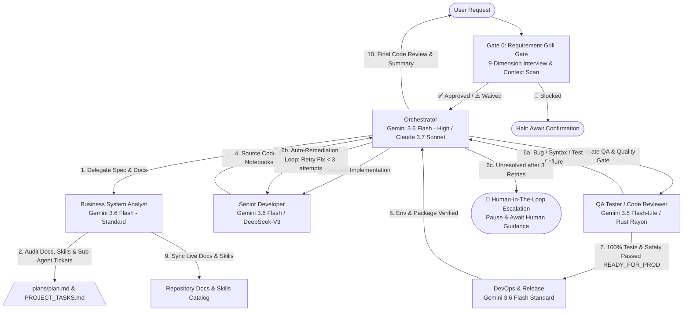

# AI SDLC Multi-Agent Architecture & Model Allocation Policy
> **Project:** HoroConsultant  
> **Target Framework:** Antigravity CLI AI SDLC System  
> **Goal:** Maximum Quality & Architecture Security with Optimal Token Cost Efficiency

---

## 📌 Model Strategy & Cost Efficiency Matrix

To achieve maximum performance at minimum token expenditure, the system utilizes a high-reasoning model for orchestration and architecture planning, while delegating high-volume code writing, testing, and deployment operations to standard or light models.

### 🎯 Multi-Model Quota Optimization Tiering

| Agent Identifier | Role | Assigned Model | Reasoning Effort | Token Cost Profile | Primary Focus |
| :--- | :--- | :--- | :--- | :--- | :--- |
| **`orchestrator` / `default` / `hermes`** | Coordination & autonomous execution | `gpt-5.6-sol` (default hint) | **Medium root; adaptive child floor** | High (Strategic) | Requirements, architecture, delegation, complex recovery |
| **`business_analyst`** | Business System Analyst | `gpt-5.6-terra` | **Medium** | Mid (Analysis) | Specifications, dependency analysis, documentation governance |
| **`developer`** | Senior Developer | `gpt-5.6-luna` | **Medium** | Low-Mid (Execution) | Bounded rank-0/rank-1 reversible development; adaptive escalation for higher ranks |
| **`qa_tester`** | QA Tester | `gpt-5.4-mini` | **Medium** | Low (Verification) | Test design, failure triage, concise evidence extraction |
| **`devops` / `code_reviewer`** | Release & safety gates | `gpt-5.3-codex-spark` | **High** | Mid-High (Safety) | Infrastructure, security review, deployment and rollback decisions |
| **Interpretive domain masters** | Canonical metaphysics reasoning | `gpt-5.6-terra` | **High** | Mid-High (Domain) | Textual interpretation, contradictory evidence, consensus |
| **Deterministic domain masters** | Calculation-led metaphysics | `gpt-5.4-mini` | **Medium** | Low (Domain) | Tool-grounded calculations and structured result checks |

---

## 🧰 Modular Skills Catalog for SDLC / AI SDLC

1. **`requirement-grill-gate`**: Powers BSA-owned `/grill-me` with context auto-scan, one-question-at-a-time 9-dimension intake, fail-closed `APPROVED` / `WAIVED` / `BLOCKED` decisions, measurable stop conditions, and scoped GRILL REPORT output before planning or implementation.
2. **`sdlc-aisdlc-workflow`**: AI SDLC governance from planning through implementation, QA, release, and post-deploy verification.
3. **`qa-e2e-testing`**: Pytest, API/UI contract, and Playwright E2E regression matrix for production validation.
4. **`ai-inference-verifier`**: Verify interpretation output is real model inference, not static template fallback.
5. **`devops-deployment`**: Deploy hygiene workflows: secret sync, container checks, and production publish/audit.
6. **`bazi-calculator`**: Compute BaZi 4-Pillars with true solar time and five-elements analysis.
7. **`rag-search`**: Retrieve ranked metaphysics passages from FAISS index with configured embeddings.
8. **`bsa-doc-skill-management`**: Own requirements decomposition, live docs sync, quota/account handoff, and skill-governance operations.
9. **`metaphysical-domain-engine`**: Cross-train and route metaphysical queries among Zi Wei, Qi Men, Da Liu Ren, I Ching, feng shui, and astrology specialists.
10. **`orchestrator-delegation`**: Coordinate maximum useful safe parallel work with fail-closed eligibility, ownership, evidence, and HITL escalation.
11. **`web-color-design`**: Color systems, Five Elements palettes, WCAG contrast validation, dark mode, and CSS design tokens for HoroConsultant UI. Used by `ux_ui_designer`.
12. **`ui-visual-auditor`**: Multi-viewport screenshot capture, DOM overlap detection, and layout distortion auditing. Used by `ui_visual_tester`.
13. **`hf-static-release-verification`**: Fail-closed HF Static release gate for payload, health, exact `release_source_commit` identity, source metadata digest/revision, source-ancestry proof, required assets, publisher regression, and five-viewport evidence. `packaging_commit` is evidence-only; legacy fallbacks and overrides are forbidden. Primary owner: `devops`; verification owners: `qa_tester`, `ui_visual_tester`, and `code_reviewer`; dispatch owner: `orchestrator`.
14. **`multi-account-agent-orchestration`**: Route bounded work across Codex/AGY/Hermes accounts with non-secret quota evidence, retry limits, ownership isolation, HITL closure, and process-backed execution through required explicitly selected aliases. Result Contract v2 binds a provider-native `ExecutionReceipt` to a schema-validated `WorkResult` and fails closed; read-only lanes additionally require an approved runtime config plus an explicit read-only role or validated sandbox override. The root/current session is orchestrator-only; child lanes alone may use terminal CLI workarounds, and any one-off root-action waiver needs current, recorded user authorization.
15. **`adaptive-model-effort-routing`**: Classify lane scope, complexity, risk, ambiguity, evidence, and quota into a versioned fail-closed `DispatchDecision`; Rule 18 owns policy, capability catalog, floors, receipt binding, and HITL behavior.
16. **`anti-cognitive-decay`**: Governs bounded context preservation across runtimes without authority drift.
17. **`agile-governance`**: Govern canonical 6-state Agile lifecycle (`TODO`, `READY`, `DOING`, `BLOCKED`, `NEEDS_HITL`, `DONE`), broker admission, capacity truth (theoretical vs policy-admitted vs runtime-proven), fail-closed DoR/DoD gates, one-editor-per-resource ownership, and capacity exception emission.

### Claude Code Governance Map

- **Level 1 Hooks**: `.claude/settings.json` routes Bash calls through `.agents/hooks/pre_tool_check.py` and `.agents/hooks/post_tool_audit.py` for hard command controls.
- **Level 2 Rules**: `.claude/rules/*.md` and `.agents/rules/*.md` provide path-aware guidance, including Rule 11 delegation, Rule 12 Claude Code three-level governance, Rule 13 ecosystem sync, Rule 14 specialist decomposition, Rule 18 adaptive routing, Rule 20 context handoff (`20-context-handoff.md`), Rule 21 agile governance (`21-agile-governance.md`), and Rule 22 plan completion and release notes (`22-plan-completion-and-release-notes.md`).
- **Level 3 Global Context**: `CLAUDE.md` remains the short baseline context and links to the detailed governance files.
- **Quota Handoff Guard**: `/status` or runtime quota below 10% routes through `scripts/agent_quota_status_guard.py`; agents must update `PROJECT_TASKS.md` `TICKET-META-008` and `plans/plan.md` before continuing broad work.

### Specialist Decomposition Policy (Rule 14)

When any skill, agent, rule, hook, or governance document grows too large or requires deep specialist coverage, **create a new dedicated single-responsibility file** rather than expanding the existing one. Hard limits:
- Skill `description`: ≤ 100 chars
- SKILL.md body: ≤ 300 lines
- Agent `system_prompt`: ≤ 50 lines (one primary role)
- `.agents/rules/*.md`: ≤ 80 lines per concern
- `.claude/rules/*.md`: ≤ 40 lines per concern
- Hook script: ≤ 150 lines

See `.agents/rules/14-specialist-decomposition-mandate.md` and `.claude/rules/specialist-decomposition.md` for the full policy and enforcement checklist.

### Disabled / Retired Skills

1. **`kaggle-manager`**: Disabled. Retained for reference only; not linked to any active agent flow.


---

## 🔄 Agent Execution Flow & Collaboration Protocol (Auto-Remediation & HITL Loop)



---

## ⚡ Model Routing Rules

1. **Adaptive routing**: Rule 18 selects each child lane from a versioned `DispatchDecision`; static role values are default hints, not runtime proof. The root effort is `medium` after the owner-confirmed planning gate, while child lanes independently retain their validated floor.
2. **Coding and release control**: Use `gpt-5.6-luna` at medium effort for bounded rank-0/rank-1 reversible development. Adaptive routing escalates rank 2 to `gpt-5.6-terra` at high effort and rank 3 to `gpt-5.6-sol` at high effort. Static role metadata is routing intent and never runtime proof. Preserve `gpt-5.3-codex` at high effort for DevOps and code-review release, infrastructure, rollback, and safety gates.
3. **Bounded high-volume work**: Use `gpt-5.4-mini` at medium effort for QA triage and deterministic, tool-grounded calculation roles. Escalate unresolved contradictions instead of increasing task scope.
4. **Balanced analysis**: Use `gpt-5.6-terra` for specification analysis and interpretive domain work. Escalate only materially ambiguous or high-impact decisions to `gpt-5.6-sol`.
5. **Validation over assumptions**: Benchmark any later model or effort change against representative tasks before adopting it. QA and DevOps must trim logs before escalation.

---

## 🛡️ Core Rules & Safeguards

1. **Orchestrator-Only Delegation**: The root/current session may only decompose, dispatch, monitor, collect evidence, resolve conflicts, request HITL, and decide gates. It MUST NOT directly edit implementation, run implementation/QA commands, stage, commit, push, deploy, publish, or claim child work. Only a fresh explicit user waiver for one recorded action/target, with reason and stop condition in the active ticket and plan, permits an exception; it is not a standing approval.
2. **Deterministic Execution**: Developer and QA agents must strictly follow specs provided by Orchestrator without altering architectural blueprints.
3. **Pure ASCII Logging Guard**: Subprocess outputs must strictly use ASCII tags (`[OK]`, `[ERROR]`, `[WARNING]`, `[INFO]`) to avoid UTF-8 surrogate crashes.
4. **Package Locks**: All Python scripts must respect locked versions in `.agent_rules.md` (`transformers==4.44.2`, `peft==0.12.0`, etc.).
5. **No Blind Command Execution**: Shell commands must be verified and executed through DevOps or inline approval rules.
6. **Pre-Development Kaggle Sync**: Before starting any development or modifying code, agents MUST run `python3 scripts/kaggle_notebook_manager.py --status` (and `--pull` if updated) to verify and sync the latest Kaggle kernel status/outputs.
7. **Locked Kaggle Accelerator Stage**: `project/kaggle_kernel/kernel-metadata.json` accelerator settings (such as `"machine_shape": "NvidiaTeslaT4"`) are permanently preserved and locked. Agents MUST NEVER modify, overwrite, or toggle `kernel-metadata.json` accelerator fields.
8. **Centralized Secrets & Lessons Learned Audit**: Agents MUST enforce the 2-Tier Priority Secrets Policy (`.agents/rules/06-secrets-policy.md`) and consult `.agents/LESSONS_LEARNED.md` before performing MLOps or architectural changes.
9. **Documentation, Agent Matrix & Skill Up-to-date Mandate**: The Business System Analyst (`business_analyst`) MUST continuously audit and keep all repository documentation ([`README.md`](file:///Users/kimlenglim/Project/HoroConsultant/README.md), [`HOWTO.md`](file:///Users/kimlenglim/Project/HoroConsultant/HOWTO.md), [`PROJECT_TASKS.md`](file:///Users/kimlenglim/Project/HoroConsultant/PROJECT_TASKS.md), [`plans/plan.md`](file:///Users/kimlenglim/Project/HoroConsultant/plans/plan.md)), `.agents/skills/`, and Native Agent Definitions (`.antigravity/agents/*.agent` & `.agents/agents/`) 100% updated and synchronized via `python3 scripts/sync_sdlc_agents.py --check`.
10. **Migration Dead-Code Cleanup Mandate**: During every module or feature migration (e.g., Python to Rust or architecture refactoring), agents MUST clean up deprecated code, dead code, unused functions, and redundant fallback loops in the source codebase. Leaving legacy dead code behind is strictly forbidden.
11. **Mandatory Post-Goal CI/CD to Prod & E2E / Regression Verification Mandate**: Every time a task or goal is completed ("goal has been done"), agents MUST execute Phase 5 CI/CD deployment to production (git push / Hugging Face Spaces publishing) and run complete E2E & UI button regression testing (`python3 scripts/run_button_regression.py`, `python3 scripts/run_e2e_screenshots.py`, `pytest`) without exception.
12. **Quota Exhaustion Handoff Mandate**: When `/status` or runtime quota status shows less than 10% remaining, agents MUST stop broad work, summarize current state, update `PROJECT_TASKS.md` `TICKET-META-008` and the `plans/plan.md` account migration section, then run `python3 scripts/agent_quota_status_guard.py --remaining-percent <percent> --enforce` and a secret scan. Never write secret values into handoff docs.
13. **AI Agent Ecosystem Always-Sync Mandate**: After any change to agent definitions, skills, rules, hooks, or routing config, agents MUST run `python3 scripts/sync_ai_agent_ecosystem.py --check`. Use `--sync` after intentional changes. See `.agents/rules/13-ai-agent-ecosystem-sync.md`.
14. **Specialist Decomposition Mandate**: When any skill, agent, rule, hook, or governance doc grows too long or requires deep specialist knowledge, agents MUST create a new dedicated single-responsibility file rather than expanding the existing one. Hard limits: skill `description` ≤ 100 chars, SKILL.md ≤ 300 lines, agent `system_prompt` ≤ 50 lines, rule file ≤ 80 lines per concern, Claude rule ≤ 40 lines per concern, hook script ≤ 150 lines. See `.agents/rules/14-specialist-decomposition-mandate.md`.
15. **HF Static Fail-Closed Release Mandate**: Apply `.agents/rules/16-hf-static-release-verification.md` and `.agents/skills/hf-static-release-verification/SKILL.md` to every HF Static release or release-affecting frontend change. Publisher tests, payload dry-run, SDK-aware health, exact live version/assets using immutable `release_source_commit`, five canonical viewport artifacts, focused regression, safety review, and ecosystem sync MUST all pass before `READY_FOR_PROD`. Committed source metadata and its path, SHA-256 digest, and source revision prove the source identity; evidence proves it is an ancestor of the later evidence-only `packaging_commit`. No legacy fallback and no environment, CLI default, runtime `HEAD`, or external override is allowed. Missing or indeterminate evidence is a failure; only a named manual reviewer sign-off tied to the current artifact and timestamp can resolve an automated indeterminate. `orchestrator` dispatches; `developer`, `devops`, `ui_visual_tester`, and `qa_tester` execute owned gates; `code_reviewer` issues the safety verdict; `business_analyst` synchronizes governance.
16. **Plan Completion, Archival & Release Notes Mandate**: Whenever all milestones or tickets in an active plan or sprint are executed and verified DONE, agents MUST archive completed planning artifacts from `plans/` to `plans/archive/YYYY-MM-DD-<sprint-or-release>/`, maintain `/plans/` containing only active/upcoming specifications, and compile/publish `ReleaseNotes.md` containing Executive Summary, Architectural Deliverables, Verification Matrix, Milestone Rollup (100% DONE), Live Production Endpoints, and Archived Plans list. Governed by `business_analyst` and `orchestrator`. See `.agents/rules/22-plan-completion-and-release-notes.md`.


---

## 🌐 Antigravity CLI Native Agent Matrix

| Agent Identifier | Role | Model Strategy | Primary Antigravity Spec (`.antigravity/agents/`) | Workspace CLI Spec (`.agents/agents/`) | Governance Lead |
| :--- | :--- | :--- | :--- | :--- | :--- |
| **`orchestrator` / `default` / `hermes`** | Coordination & execution | `gpt-5.6-sol` | `orchestrator.agent` / `default.agent` | `orchestrator/agent.md` | Master Brain |
| **`business_analyst`** | Business System Analyst | `gpt-5.6-terra` | `business-analyst.agent` | `business_analyst/agent.md` | **Doc & Skill Watchdog** |
| **`developer`** | Senior Full-Stack Developer | `gpt-5.6-luna` (medium; adaptive Terra/Sol escalation) | `developer.agent` | `developer/agent.md` | Code Writing |
| **`qa_tester`** | QA Tester & Verification Guard | `gpt-5.4-mini` | `qa-tester.agent` | `qa_tester/agent.md` | Test Execution Guard |
| **`devops`** | DevOps & Release Agent | `gpt-5.3-codex-spark` | `devops.agent` | `devops/agent.md` | Release & Deploy |
| **`code_reviewer`** | Pre-Deployment Safety Auditor | `gpt-5.3-codex-spark` | `code-reviewer.agent` | `code_reviewer/agent.md` | Safety Audit |
| **`ux_ui_designer`** | UX/UI Designer & Color Architect | `gpt-5.6-terra` | `ux-ui-designer.agent` | `ux_ui_designer/agent.md` | Color & Design System |
| **`ui_visual_tester`** | UI Visual Tester & Layout Auditor | `gpt-5.4-mini` | `ui-visual-tester.agent` | `ui_visual_tester/agent.md` | Visual Layout QA |
| **Interpretive / deterministic domain masters** | Metaphysics Experts | `gpt-5.6-terra` / `gpt-5.4-mini` | `[domain]-master.agent` | `[domain_master]/agent.md` | Domain Analysis |

---

## 🤖 Codex Compatibility Layer

The Antigravity definitions remain the cross-framework source. Codex uses the same role prompts through generated native subagent files in [`.codex/agents/`](../.codex/agents/).

1. Synchronize Antigravity and workspace definitions as usual:
   ```bash
   python3 scripts/sync_sdlc_agents.py --sync
   ```
2. Generate the Codex target from the resulting `.agents/agents/*/agent.json` files:
   ```bash
   python3 scripts/sync_codex_agents.py --sync
   ```
3. Validate both targets without writing:
   ```bash
   python3 scripts/sync_sdlc_agents.py --check --use-python
   python3 scripts/sync_codex_agents.py --check
   ```

Do not hand-edit `.codex/agents/*.toml`; their headers identify the legacy source file. Legacy provider model names are retained only for Antigravity compatibility. Codex roles inherit the active Codex model.

---

## 🚀 Approach C: Multi-Agent Parity & Concurrency Governance Matrix

The **Approach C** record remains `IN_REVIEW`: its historical failed design
review recorded C/H/M/L `1/5/1/0`; the `PARITY-001` design is rejected and
`PARITY-002..006` are `BLOCKED`. It is not an active cross-provider parity
implementation.
- **Feature Flags (`.agents/config/full_capacity_guard.v2.json`)**: `enable_agy_parity`, `enable_module_level_source_isolation`, `enable_granular_lane_roles` (all default `false`).
- **Module Path Isolation**: Proposed only; it grants no concurrent source-editing authority.
- **Cryptographic Token Anchor**: Local structural evidence grants no AGY eligibility. Every native `spawn_agent` remains under the owner gate.
- **Operational Status**: flags are `false`; `543/545` with two token failures
  and the 5/11 drift are superseded historical failed-candidate evidence.
  `DSG-009` is `DONE — LOCAL FAIL-CLOSED RE-FREEZE / QA + SECURITY PASS;
  RUNTIME NOT_PROVEN`, based on guard QA `552`, integrated safe mocked QA `823`,
  PromptCommand QA `275` plus adversarial `33`, named security `761` at
  C/H/M/L `0/0/0/0`, green sync/check, and a `1,967`-file/`0`-leak secret scan.
  `DSG-009A/B` remain `BLOCKED`; no local result grants runtime or AGY
  eligibility.
