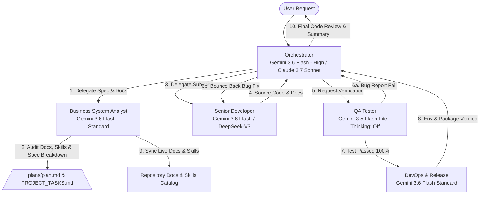

# AI SDLC Multi-Agent Architecture & Model Allocation Policy
> **Project:** HoroConsultant  
> **Target Framework:** Antigravity CLI AI SDLC System  
> **Goal:** Maximum Quality & Architecture Security with Optimal Token Cost Efficiency

---

## 📌 Model Strategy & Cost Efficiency Matrix

To achieve maximum performance at minimum token expenditure, the system utilizes a high-reasoning model for orchestration and architecture planning, while delegating high-volume code writing, testing, and deployment operations to standard or light models.

### 🎯 Multi-Model Quota Optimization Tiering

| Agent Identifier | Role | Primary Baseline (CODEX_PRO Prox5) | Quota-Enhanced Alternative (Claude / GPT) | Thinking Effort | Token Cost Profile | Primary Focus |
| :--- | :--- | :--- | :--- | :--- | :--- | :--- |
| **`orchestrator`** | Master Orchestrator (The Brain) | `Claude 3.7 Sonnet` / `o3-mini` (prox5) | `Gemini 3.6 Flash` (High) | **High** | High (Strategic) | Requirements Analysis, Architecture Blueprinting, Spec Breakdown, Delegation, Final Code Review Gateway |
| **`business_analyst`** | Business System Analyst (The Spec & Skill Architect) | `o3-mini` / `Claude 3.5 Sonnet` (prox5) | `Gemini 3.6 Flash` | **Standard** | Mid (Analysis) | Requirements Analysis, Spec Breakdown, Live Docs Watchdog (PROJECT_TASKS.md, plans/plan.md), Agent Skill Governance |
| **`developer`** | Senior Developer (The Hands) | `DeepSeek-V3` / `DeepSeek-R1` (prox5) | `Gemini 3.6 Flash` (Standard) / `Gemini 3.5 Flash-Lite` | **Standard / Off** | Mid-Low (Execution) | Full-Stack Coding, Inline Documentation, Bug Fixes based on QA reports |
| **`qa_tester`** | QA Tester (The Guard) | `GPT-4o-mini` / `Gemini 3.5 Flash-Lite` (prox5) | `Gemini 3.5 Flash-Lite` | **Off** | Lowest (Audit) | Test Case Generation, `pytest` Test Execution, Pessimistic Bug/Vulnerability Identification |
| **`devops`** | DevOps & Release (The Bridge) | `GPT-4o-mini` / `Gemini 3.6 Flash` (prox5) | `Gemini 3.6 Flash` (Standard) | **Standard** | Mid (Infrastructure) | Environment Verification (.env, Docker), CLI/Shell Command Approval, Packaging & Release Readiness |
| **`code_reviewer`** | Code Reviewer & Safety Auditor | `DeepSeek-R1` / `Claude 3.5 Sonnet` (prox5) | `Gemini 3.6 Flash` | **Standard** | Mid (Audit) | Pre-Deployment Audit (`READY_FOR_PROD`), Secret Leakage Scanning, Governance Mandates Check |
| **Domain Masters** | Metaphysics & Astro Experts | `Claude 3.5 Sonnet` / `DeepSeek-R1` (prox5) | `Gemini 3.6 Flash` (Textual Reasoning) / `Gemini 3.5 Flash-Lite` (Engines) | **Standard / Off** | Low-Mid (Domain) | Canonical Text Verification, Engine Output Interpretation, Cross-Domain Consensus |

---

## 🧰 Modular Skills Catalog for SDLC / AI SDLC

1. **`sdlc-aisdlc-workflow`**: Full 5-phase AI SDLC lifecycle guide (Planning, Dev, QA, DevOps, Post-Deploy E2E).
2. **`qa-e2e-testing`**: Pytest suite, Playwright E2E screenshots, and 22-button UI regression suite commands.
3. **`ai-inference-verifier`**: Real AI model vs Fallback/Template inspection & semantic entropy verification skill for QA agent.
4. **`devops-deployment`**: Doppler secret sync, Hugging Face Spaces publishing, Docker compose, and secret leakage scanning.
5. **`kaggle-manager`**: Kaggle GPU Fine-Tuning notebook automation (`--status`, `--push`, `--pull`).
6. **`bazi-calculator`**: Deterministic 4-Pillars, True Solar Time & Five Elements calculation skill.
7. **`rag-search`**: Local FAISS vector search across 3,132 ingested metaphysical text chunks.
8. **`bsa-doc-skill-management`**: Business System Analysis, live documentation audit, and agent skill governance skill.

---

## 🔄 Agent Execution Flow & Collaboration Protocol



---

## ⚡ Token Cost Efficiency Rules & Dynamic Failover

1. **OpenAI Codex / Prox5 Primary Standard (Development Environment)**: `CODEX_PRO` API (`CODEX_PRO_BASE_URL` or `OPENAI_BASE_URL`) serves as the Primary Baseline for local development routing across `Claude 3.7 Sonnet`, `DeepSeek-V3/R1`, `o3-mini`, and `GPT-4o`.
2. **Gemini-First Dynamic Failover Standard**: Gemini 3.6 Flash and 3.5 Flash-Lite serve as zero-downtime workhorse failover models due to 2M token context windows, high execution speed, and token cost savings.
   - **Orchestration & Specs**: Use **Claude 3.7 Sonnet** / **o3-mini** for deep architectural planning, spec breakdown, and complex domain synthesis.
   - **Precision Code Synthesis**: Use **DeepSeek-V3** / **DeepSeek-R1** for high-precision code writing, PyO3 bindings, and static pre-commit code audit.
   - **Fast Audit & Regression**: Use **GPT-4o-mini** / **Gemini 3.5 Flash-Lite** for log parsing and quick assertion verification.
3. **Automatic API Overload & Quota Failover**: If Claude, DeepSeek, or OpenAI proxy models hit rate-limits, quota limits, or overload status during development, system automatically fails over to `Gemini 3.6 Flash` (High Reasoning) without halting development workflows.
4. **Log Trimming Rule**: QA and DevOps agents MUST parse and filter log outputs (using `Gemini 3.5 Flash-Lite`) to pass concise, relevant error snippets to Developer and Orchestrator rather than dumping raw log contexts.

---

## 🛡️ Core Rules & Safeguards

1. **Strict Delegation**: The Orchestrator does not write substantial code directly unless emergency intervention is required.
2. **Deterministic Execution**: Developer and QA agents must strictly follow specs provided by Orchestrator without altering architectural blueprints.
3. **Pure ASCII Logging Guard**: Subprocess outputs must strictly use ASCII tags (`[OK]`, `[ERROR]`, `[WARNING]`, `[INFO]`) to avoid UTF-8 surrogate crashes.
4. **Package Locks**: All Python scripts must respect locked versions in `.agent_rules.md` (`transformers==4.44.2`, `peft==0.12.0`, etc.).
5. **No Blind Command Execution**: Shell commands must be verified and executed through DevOps or inline approval rules.
6. **Pre-Development Kaggle Sync**: Before starting any development or modifying code, agents MUST run `python3 scripts/kaggle_notebook_manager.py --status` (and `--pull` if updated) to verify and sync the latest Kaggle kernel status/outputs.
7. **Locked Kaggle Accelerator Stage**: `project/kaggle_kernel/kernel-metadata.json` accelerator settings (such as `"machine_shape": "NvidiaTeslaT4"`) are permanently preserved and locked. Agents MUST NEVER modify, overwrite, or toggle `kernel-metadata.json` accelerator fields.
8. **Centralized Secrets & Lessons Learned Audit**: Agents MUST enforce the 2-Tier Priority Secrets Policy (`.agents/rules/06-secrets-policy.md`) and consult `.agents/LESSONS_LEARNED.md` before performing MLOps or architectural changes.
9. **Documentation, Agent Matrix & Skill Up-to-date Mandate**: The Business System Analyst (`business_analyst`) MUST continuously audit and keep all repository documentation ([`README.md`](file:///Users/kimlenglim/Project/HoroConsultant/README.md), [`HOWTO.md`](file:///Users/kimlenglim/Project/HoroConsultant/HOWTO.md), [`PROJECT_TASKS.md`](file:///Users/kimlenglim/Project/HoroConsultant/PROJECT_TASKS.md), [`plans/plan.md`](file:///Users/kimlenglim/Project/HoroConsultant/plans/plan.md)), `.agents/skills/`, and Native Agent Definitions (`.antigravity/agents/*.agent` & `.agents/agents/`) 100% updated and synchronized via `python3 scripts/sync_sdlc_agents.py --check`.
10. **Migration Dead-Code Cleanup Mandate**: During every module or feature migration (e.g., Python to Rust or architecture refactoring), agents MUST clean up deprecated code, dead code, unused functions, and redundant fallback loops in the source codebase. Leaving legacy dead code behind is strictly forbidden.
11. **Mandatory Post-Goal CI/CD to Prod & E2E / Regression Verification Mandate**: Every time a task or goal is completed ("goal has been done"), agents MUST execute Phase 5 CI/CD deployment to production (git push / Hugging Face Spaces publishing) and run complete E2E & UI button regression testing (`python3 scripts/run_button_regression.py`, `python3 scripts/run_e2e_screenshots.py`, `pytest`) without exception.


---

## 🌐 Antigravity CLI Native Agent Matrix

| Agent Identifier | Role | Model Strategy | Primary Antigravity Spec (`.antigravity/agents/`) | Workspace CLI Spec (`.agents/agents/`) | Governance Lead |
| :--- | :--- | :--- | :--- | :--- | :--- |
| **`orchestrator` / `default`** | Master Orchestrator | `Gemini 3.6 Flash (High)` | `orchestrator.agent` / `default.agent` | `orchestrator/agent.md` | Master Brain |
| **`business_analyst`** | Business System Analyst | `Gemini 3.6 Flash` | `business-analyst.agent` | `business_analyst/agent.md` | **Doc & Skill Watchdog** |
| **`developer`** | Senior Full-Stack Developer | `Gemini 3.6 Flash` | `developer.agent` | `developer/agent.md` | Code Writing |
| **`qa_tester`** | QA Tester & Verification Guard | `Gemini 3.5 Flash-Lite` | `qa-tester.agent` | `qa_tester/agent.md` | Test Execution Guard |
| **`devops`** | DevOps & Release Agent | `Gemini 3.6 Flash` | `devops.agent` | `devops/agent.md` | Release & Deploy |
| **`code_reviewer`** | Pre-Deployment Safety Auditor | `Gemini 3.6 Flash` | `code-reviewer.agent` | `code_reviewer/agent.md` | Safety Audit |
| **8 Domain Masters** | Metaphysics Experts | `Gemini 3.6 Flash` | `[domain]-master.agent` | `[domain_master]/agent.md` | Domain Analysis |

---

## 🤖 Codex Compatibility Layer

The Antigravity definitions remain the cross-framework source. Codex uses the same role prompts through generated native subagent files in [`.codex/agents/`](../.codex/agents/).

1. Synchronize Antigravity and workspace definitions as usual:
   ```bash
   python3 scripts/sync_sdlc_agents.py --sync
   ```
2. Generate the Codex target from the resulting `.agents/agents/*/agent.json` files:
   ```bash
   python3 scripts/sync_codex_agents.py --sync
   ```
3. Validate both targets without writing:
   ```bash
   python3 scripts/sync_sdlc_agents.py --check --use-python
   python3 scripts/sync_codex_agents.py --check
   ```

Do not hand-edit `.codex/agents/*.toml`; their headers identify the legacy source file. Legacy provider model names are retained only for Antigravity compatibility. Codex roles inherit the active Codex model.
