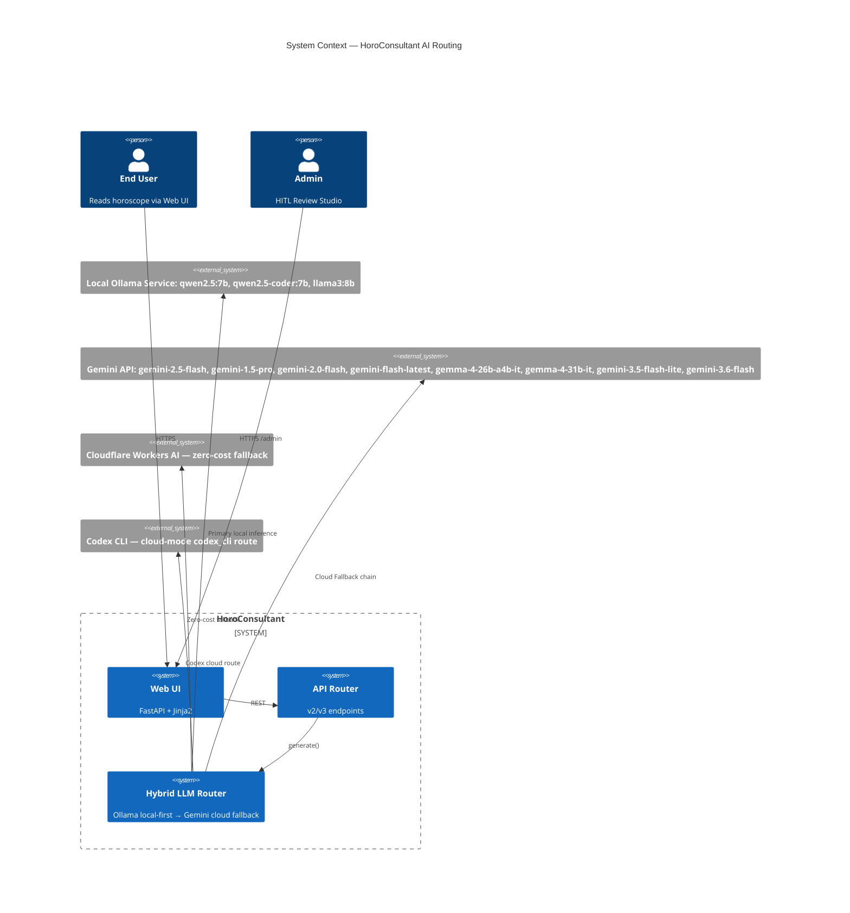
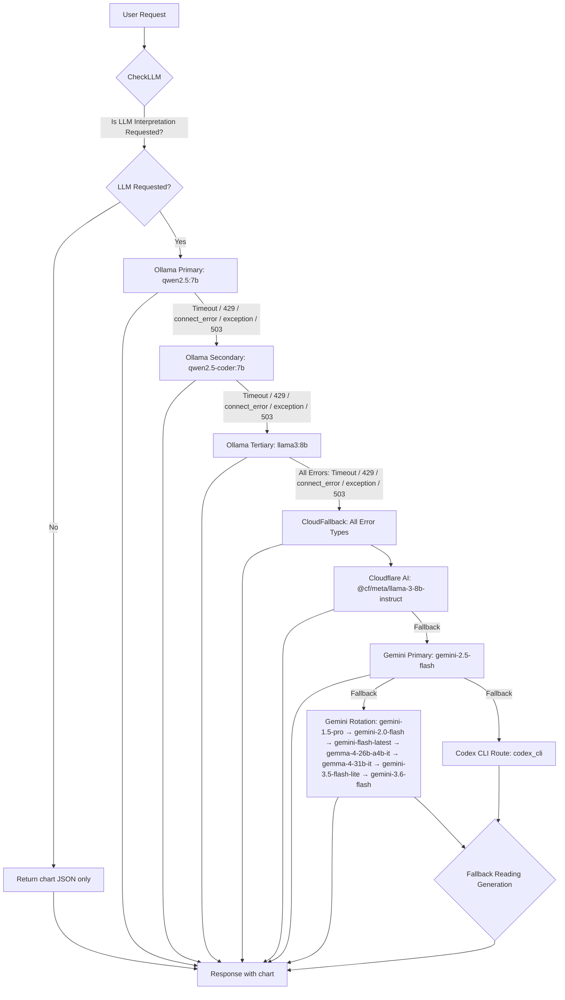
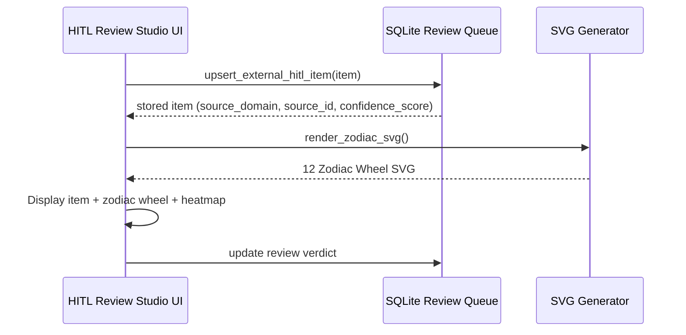

# 🌌 HoroConsultant — Computational Metaphysics & AI Fine-Tuning Pipeline

> **Project:** HoroConsultant — High-Precision 16-Domain Computational Metaphysics Engine
> (BaZi, ZiWei, QiMen, LiuRen, IChing, XuanKong, ZeJi, ThaiVedic, Western, Numerology,
> TaiYi, LiuYao, MeiHua, SanHe, QiZheng, MianXiang), True Solar Time Engine,
> Multi-Agent Gemini & Local Ollama Hybrid Routing, API v2/v3 Router, FAISS Classical Vault RAG,
> Rust Fast Math Acceleration, and HITL Review Studio.

---

> 🚨 **GOVERNANCE MANDATE FOR DEVELOPERS & AI AGENTS (กฎการดูแลรักษาโปรเจกต์):**  
> **หากมีการเปลี่ยนแปลง โครงสร้าง สถาปัตยกรรม API Endpoint หรือฟีเจอร์ใดๆ ในโปรเจกต์นี้ นักพัฒนาและ AI Agents ทุกคน จะต้องทำการอัปเดตเอกสาร `README.md` และ `HOWTO.md` ให้เป็นปัจจุบันเสมอ** เพื่อรักษาความถูกต้อง ความแม่นยำ และความต่อเนื่องของการพัฒนาระบบ

> 📘 **คู่มือการใช้งานระบบสำหรับผู้ใช้และแพลตฟอร์มต่างๆ:**  
> สำหรับวิธีใช้งานเว็บไซต์สำหรับ End-User, การใช้งาน Admin Panel, HITL Review Studio และคู่มือการรันบนแพลตฟอร์มต่างๆ (Docker, Ollama, Kaggle GPU, MCP Server) โปรดอ่านเพิ่มเติมได้ที่ [**`HOWTO.md` (คู่มือการใช้งาน HoroConsultant Manual)**](HOWTO.md)

---

## 📖 Table of Contents

- [Project Overview](#-project-overview)
- [Quick Start](#-quick-start)
- [Documentation Index](#-documentation-index)
- [Architecture Overview](#-architecture-overview)
- [16 Metaphysical Disciplines](#️-16-metaphysical-disciplines-overview)
- [Testing & QA](#-testing--quality-assurance)
- [MCP Server Integration](#-model-context-protocol-mcp-server-integration)
- [Production Architecture](#-canonical-production-architecture)
- [Governance Rules](#-governance-rule-checklist-for-developers)
- [License](#-license)

---

## 🔭 Project Overview

HoroConsultant is an enterprise-grade **Computational Metaphysics Engine** combining deterministic astronomical algorithms (True Solar Time, NOAA Spencer 1971, Swiss Ephemeris) with a **Local-First Hybrid Multi-Agent AI System** (Ollama Qwen2.5:7b + FAISS RAG + Gemini Cloud Validator).

### Core Technology Stack

| Layer | Technology |
|---|---|
| **Core Engine** | Python 3.12 (Pure Python math, Rust PyO3 core bindings) |
| **Web & API** | FastAPI, Uvicorn, HTML5/CSS3 (Glassmorphism Dark UI) |
| **Vector DB & RAG** | FAISS Index (dim=768) + `nomic-embed-text:latest` (3,132 vectors) |
| **Local LLM** | Ollama (`qwen2.5:7b`, `qwen2.5-coder:7b`, `llama3:8b`) / MLX QLoRA 4-bit |
| **Cloud LLM** | Gemini 2.0 Flash (Dual Key rotation fallback & Prediction Validator) |
| **Cloud Fine-Tuning** | Kaggle GPU Automation, HuggingFace Hub |
| **Multi-Agent** | Claude Code, OpenAI Codex, Gemini AGY, Hermes, thClaws CLI |

### Key Features

- **16 Metaphysical Disciplines** with dedicated math engines and SVG vector generators
- **True Solar Time Engine** with Equation of Time correction
- **Hybrid LLM Router** — Ollama local-first with Gemini cloud fallback
- **FAISS RAG** — 3,132 classical metaphysics vector chunks
- **HITL Review Studio** — Human-in-the-loop fine-tuning pipeline
- **MCP Server** — Model Context Protocol for AGY subagent integration
- **Multi-Agent Governance** — 6-lane concurrency architecture with fail-closed isolation

### Local Model Tiers

| Tier | Variable | Default Model | Purpose |
|------|----------|---------------|---------|
| Primary | `OLLAMA_PRIMARY_MODEL` | `qwen2.5:7b` | Best for BaZi/Thai/Chinese interpretation |
| Secondary | `OLLAMA_SECONDARY_MODEL` | `qwen2.5-coder:7b` | Capable fallback for code and analysis |
| Tertiary | `OLLAMA_TERTIARY_MODEL` | `llama3:8b` | English fallback for general queries |

### Cloud Model Rotation (Gemini Fallback Chain)

| Priority | Variable | Default Model |
|----------|----------|---------------|
| 1 | `PRIMARY_MODEL` | `gemini-2.5-flash` |
| 2 | `SECONDARY_MODEL` | `gemini-1.5-pro` |
| 3 | `TERTIARY_MODEL` | `gemini-2.0-flash` |
| 4 | Rotation | `gemini-flash-latest` |
| 5 | Rotation | `gemma-4-26b-a4b-it` |
| 6 | Rotation | `gemma-4-31b-it` |
| 7 | Rotation | `gemini-3.5-flash-lite` |
| 8 | Rotation | `gemini-3.6-flash` |

---


## ⚡ Quick Start

### 1. Requirements & Prerequisites

- Python 3.12+
- Node.js & npm (optional, for Playwright visual tests)
- Local Ollama (`qwen2.5:7b` installed via `ollama pull qwen2.5:7b`)

### 2. Environment Setup

```bash
git clone https://github.com/pphothidaen/HoroConsultant.git
cd HoroConsultant
cp .env.example .env

# Install Python dependencies
pip install -r requirements.txt
```

### 3. Run FastAPI Application

```bash
# Start dev server on http://localhost:8000
python3 -m uvicorn project.main:app --reload --port 8000
```

### 4. Access Endpoints

| Endpoint | URL |
|---|---|
| **Main Dashboard** | `http://localhost:8000/` |
| **Admin Panel** | `http://localhost:8000/admin` |
| **HITL Review Studio** | `http://localhost:8000/hitl-studio` |
| **Swagger Docs** | `http://localhost:8000/docs` |
| **Prometheus Metrics** | `http://localhost:8000/metrics` |
| **Health Check** | `http://localhost:8000/api/health` |

### 5. Essential Commands

```bash
# Run full test suite
python3 -m pytest project/tests -v

# Sync AI agent ecosystem
python3 scripts/sync_ai_agent_ecosystem.py --sync

# Run MCP Server
python3 project/mcp_server.py

# Pre-deployment code review
python3 project/core/code_reviewer.py --review
```

---

## 📚 Documentation Index

All technical documentation lives in the [`docs/`](docs/) directory. Below is a complete pointer reference to every document, organized by category.

### 📋 Summary & Guidelines

| Document | Description |
|---|---|
| [`docs/SUMMARY.md`](docs/SUMMARY.md) | GitBook sidebar navigation index — master document listing |
| [`docs/repository-guidelines.md`](docs/repository-guidelines.md) | Repository documentation rules, file placement, GitBook integration |

### 🏛️ Architecture & Design

| Document | Description |
|---|---|
| [`docs/c4_hermes_9router_architecture.md`](docs/c4_hermes_9router_architecture.md) | C4 Model architecture — Hermes & 9router integration (Level 1-4 diagrams) |
| [`docs/architecture/DESIGN_SPEC_MULTI_AGENT_PARITY.md`](docs/architecture/DESIGN_SPEC_MULTI_AGENT_PARITY.md) | Multi-Agent Parity design specification (Approach C, feature-flagged) |
| [`docs/architecture/agy-terminal-supervisor.md`](docs/architecture/agy-terminal-supervisor.md) | AGY terminal supervisor — proposed execution boundary (design-only) |
| [`docs/architecture/external-dispatch-platform-contract.md`](docs/architecture/external-dispatch-platform-contract.md) | External dispatch platform evidence contract — Spark safety, release gates, circuit breakers |

### 🤖 Multi-Agent Control Plane (C0 Architecture)

| Document | Description |
|---|---|
| [`docs/architecture/multiagent-control-plane/README.md`](docs/architecture/multiagent-control-plane/README.md) | C0 architecture freeze — master index for MAREF-000..057 refactor |
| [`docs/architecture/multiagent-control-plane/adr-001-canonical-authority.md`](docs/architecture/multiagent-control-plane/adr-001-canonical-authority.md) | ADR-001 — Canonical authority and persistence stores |
| [`docs/architecture/multiagent-control-plane/adr-002-transition-and-lease.md`](docs/architecture/multiagent-control-plane/adr-002-transition-and-lease.md) | ADR-002 — Transitions, attempts, leases, and fencing |
| [`docs/architecture/multiagent-control-plane/adr-003-transports-and-openai-websocket.md`](docs/architecture/multiagent-control-plane/adr-003-transports-and-openai-websocket.md) | ADR-003 — REST/SSE and provider WebSocket boundaries |
| [`docs/architecture/multiagent-control-plane/adr-004-session-scoped-approval.md`](docs/architecture/multiagent-control-plane/adr-004-session-scoped-approval.md) | ADR-004 — Session-scoped parent and child grants |
| [`docs/architecture/multiagent-control-plane/adr-005-event-ledger-boundary.md`](docs/architecture/multiagent-control-plane/adr-005-event-ledger-boundary.md) | ADR-005 — Frozen v3 ledger reuse boundary |
| [`docs/architecture/multiagent-control-plane/adr-006-hitl-effect-saga.md`](docs/architecture/multiagent-control-plane/adr-006-hitl-effect-saga.md) | ADR-006 — HITL governance and effect Saga |
| [`docs/architecture/multiagent-control-plane/adr-007-compatibility-and-migration.md`](docs/architecture/multiagent-control-plane/adr-007-compatibility-and-migration.md) | ADR-007 — Legacy compatibility and migration |
| [`docs/architecture/multiagent-control-plane/adr-008-service-boundary.md`](docs/architecture/multiagent-control-plane/adr-008-service-boundary.md) | ADR-008 — Service and deployment boundary |
| [`docs/architecture/multiagent-control-plane/adr-cap-001-control-agent-plane.md`](docs/architecture/multiagent-control-plane/adr-cap-001-control-agent-plane.md) | ADR-CAP-001 — Authority plane and read/notification plane |
| [`docs/architecture/multiagent-control-plane/contracts/lifecycle-v1.md`](docs/architecture/multiagent-control-plane/contracts/lifecycle-v1.md) | Lifecycle Contract v1 — normative state machine for control plane |
| [`docs/architecture/multiagent-control-plane/sprint-dag.md`](docs/architecture/multiagent-control-plane/sprint-dag.md) | Checkpoint DAG and scheduling gate for C0 release |
| [`docs/architecture/multiagent-control-plane/platform-capability-matrix.md`](docs/architecture/multiagent-control-plane/platform-capability-matrix.md) | Active-platform capability matrix |
| [`docs/architecture/multiagent-control-plane/grill-report.md`](docs/architecture/multiagent-control-plane/grill-report.md) | Requirement Grill report for C0 intake |
| [`docs/architecture/multiagent-control-plane/tickets/c0.md`](docs/architecture/multiagent-control-plane/tickets/c0.md) | Ticket C0 — documentation freeze evidence |
| [`docs/architecture/multiagent-control-plane/tickets/c1.md`](docs/architecture/multiagent-control-plane/tickets/c1.md) | Ticket C1 — canonical authority implementation |
| [`docs/architecture/multiagent-control-plane/tickets/c2.md`](docs/architecture/multiagent-control-plane/tickets/c2.md) | Ticket C2 — transition and lease implementation |
| [`docs/architecture/multiagent-control-plane/tickets/c3.md`](docs/architecture/multiagent-control-plane/tickets/c3.md) | Ticket C3 — transport and WebSocket implementation |
| [`docs/architecture/multiagent-control-plane/tickets/c4.md`](docs/architecture/multiagent-control-plane/tickets/c4.md) | Ticket C4 — session-scoped approval implementation |
| [`docs/architecture/multiagent-control-plane/tickets/c5.md`](docs/architecture/multiagent-control-plane/tickets/c5.md) | Ticket C5 — event ledger boundary implementation |

### 📡 API & Protocols

| Document | Description |
|---|---|
| [`docs/v3_api_specification.md`](docs/v3_api_specification.md) | v3.0 OpenAPI 3.1 specification — REST API + gRPC Proto3 architecture |

### 🔍 Audit & Quality

| Document | Description |
|---|---|
| [`docs/audit_discrepancies.md`](docs/audit_discrepancies.md) | Documentation vs implementation discrepancy audit (model names, endpoints) |

### 📋 Jira Integration

| Document | Description |
|---|---|
| [`docs/jira_sync_protocol.md`](docs/jira_sync_protocol.md) | Jira sync protocol — parallel markdown + Atlassian Cloud tracking |
| [`docs/jira/capacity_tracking.md`](docs/jira/capacity_tracking.md) | AI agent effort tracking via labels (effort-N workaround) |
| [`docs/jira/dashboard_config.md`](docs/jira/dashboard_config.md) | Jira dashboard config — HoroConsultant Audit Monitor (KAN-38) |

### 🚀 Release & Deployment

| Document | Description |
|---|---|
| [`docs/RELEASE_NOTES.md`](docs/RELEASE_NOTES.md) | Release notes — v3 visual-integrity production release history |
| [`docs/RELEASE_HANDOFF_CHECKLIST.md`](docs/RELEASE_HANDOFF_CHECKLIST.md) | Release handoff checklist — fail-closed production gate verification |
| [`docs/RELEASE_ROLLBACK_RUNBOOK.md`](docs/RELEASE_ROLLBACK_RUNBOOK.md) | Release and rollback runbook — emergency circuit breakers, evidence ledger |
| [`docs/branch_migration_action_priority_runbook.md`](docs/branch_migration_action_priority_runbook.md) | Branch migration action priority runbook |

### 🤖 AI Agent Governance

| Document | Description |
|---|---|
| [`docs/AI_AGENT_ECOSYSTEM_SYNC.md`](docs/AI_AGENT_ECOSYSTEM_SYNC.md) | AI agent ecosystem sync — Claude, Codex, AGY, Hermes, thClaws coordination |
| [`docs/CLAUDE_CODE_COMMAND_GOVERNANCE.md`](docs/CLAUDE_CODE_COMMAND_GOVERNANCE.md) | Claude Code command governance and sub-agent delegation |
| [`docs/HITL_OPERATING_GUIDE.md`](docs/HITL_OPERATING_GUIDE.md) | Human-in-the-Loop operating guide — review queue, production gate |

### 📜 Contracts

| Document | Description |
|---|---|
| [`docs/contracts/agy_bucket_admission_v1.md`](docs/contracts/agy_bucket_admission_v1.md) | AGY Bucket Admission v1 — test-first HITL approval protocol |
| [`docs/contracts/inter_root_dispatch_contract.md`](docs/contracts/inter_root_dispatch_contract.md) | Inter-root RootA → RootB dispatch contract — wire boundary |

### 🔧 Templates & Patterns

| Document | Description |
|---|---|
| [`docs/templates/MULTIAGENT_PROMPT_COMMAND.md`](docs/templates/MULTIAGENT_PROMPT_COMMAND.md) | Reusable multi-agent PromptCommand template — ownership-scoped routing |

### 📊 Strategy & Tradeoffs

| Document | Description |
|---|---|
| [`docs/kaggle_hybrid_tradeoff_matrix.md`](docs/kaggle_hybrid_tradeoff_matrix.md) | Kaggle hybrid strategy tradeoff matrix — production path vs research-only |
| [`docs/lessons_learned_v3_visual_integrity_2026-08-24.md`](docs/lessons_learned_v3_visual_integrity_2026-08-24.md) | v3.0 production visual integrity lessons learned |

### 📝 Superpowers — Plans

| Document | Description |
|---|---|
| [`docs/superpowers/plans/2026-09-05-atomic-dynamic-cross-provider-context-registry-resolver.md`](docs/superpowers/plans/2026-09-05-atomic-dynamic-cross-provider-context-registry-resolver.md) | Atomic dynamic cross-provider context registry resolver plan |
| [`docs/superpowers/plans/2026-09-04-horo-lite-consensus-reading.md`](docs/superpowers/plans/2026-09-04-horo-lite-consensus-reading.md) | Horo Lite consensus reading plan |
| [`docs/superpowers/plans/2026-09-05-atomic-dynamic-cross-provider-context.md`](docs/superpowers/plans/2026-09-05-atomic-dynamic-cross-provider-context.md) | Atomic dynamic cross-provider context plan |
| [`docs/superpowers/plans/2026-08-09-codex-agent-compatibility.md`](docs/superpowers/plans/2026-08-09-codex-agent-compatibility.md) | Codex agent compatibility plan |
| [`docs/superpowers/plans/2026-09-05-atomic-dynamic-cross-provider-context-provider-runtime.md`](docs/superpowers/plans/2026-09-05-atomic-dynamic-cross-provider-context-provider-runtime.md) | Cross-provider context provider runtime plan |
| [`docs/superpowers/plans/2026-09-05-atomic-dynamic-cross-provider-context-skill-migration.md`](docs/superpowers/plans/2026-09-05-atomic-dynamic-cross-provider-context-skill-migration.md) | Cross-provider context skill migration plan |
| [`docs/superpowers/plans/2026-08-09-default-orchestrator-router.md`](docs/superpowers/plans/2026-08-09-default-orchestrator-router.md) | Default orchestrator router plan |
| [`docs/superpowers/plans/2026-09-05-codex-remote-plugin-budget.md`](docs/superpowers/plans/2026-09-05-codex-remote-plugin-budget.md) | Codex remote plugin budget plan |
| [`docs/superpowers/plans/2026-08-10-rust-first-azure-v1.md`](docs/superpowers/plans/2026-08-10-rust-first-azure-v1.md) | Rust-first Azure v1 plan |
| [`docs/superpowers/plans/2026-09-05-release-qa-remediation-triage.md`](docs/superpowers/plans/2026-09-05-release-qa-remediation-triage.md) | Release QA remediation triage plan |

### 📝 Superpowers — Specs

| Document | Description |
|---|---|
| [`docs/superpowers/specs/2026-09-05-release-qa-remediation-design.md`](docs/superpowers/specs/2026-09-05-release-qa-remediation-design.md) | Release QA remediation design spec |
| [`docs/superpowers/specs/2026-08-09-codex-agent-compatibility-design.md`](docs/superpowers/specs/2026-08-09-codex-agent-compatibility-design.md) | Codex agent compatibility design spec |
| [`docs/superpowers/specs/2026-09-05-atomic-dynamic-cross-provider-context-design.md`](docs/superpowers/specs/2026-09-05-atomic-dynamic-cross-provider-context-design.md) | Cross-provider context design spec |
| [`docs/superpowers/specs/2026-08-10-rust-first-azure-v1-design.md`](docs/superpowers/specs/2026-08-10-rust-first-azure-v1-design.md) | Rust-first Azure v1 design spec |
| [`docs/superpowers/specs/2026-08-09-default-orchestrator-router-design.md`](docs/superpowers/specs/2026-08-09-default-orchestrator-router-design.md) | Default orchestrator router design spec |

---

## 🏛️ Architecture Overview

### C4 Model Summary

HoroConsultant follows the C4 Model for software architecture visualization:

- **Level 1 (System Context):** End-users, admins, and external AI services interact with the engine
- **Level 2 (Containers):** Web UI, FastAPI server, Rust core, FAISS RAG, JSON data stores
- **Level 3 (Components):** Astrology router, 16 discipline engines, SVG generator, hybrid LLM router
- **Level 4 (Code & Data Flow):** Calculation pipelines, multi-agent audit sequences, HITL review loops

> 📖 **Full diagrams:** [`docs/c4_hermes_9router_architecture.md`](docs/c4_hermes_9router_architecture.md)

### Multi-Agent Control Plane

The C0 architecture freeze governs the MAREF-000..057 refactor with 9 ADRs, lifecycle contracts, and a checkpoint DAG.

> 📖 **Control plane docs:** [`docs/architecture/multiagent-control-plane/README.md`](docs/architecture/multiagent-control-plane/README.md)

### C4 Context Diagram (Mermaid)



### Ollama Local-First Routing Flowchart



### Gemini Cloud Fallback Rotation Chain

```mermaid
flowchart LR
    A[Gemini API Request] --> B[gemini-2.5-flash]
    B -->|Error| C[gemini-1.5-pro]
    C -->|Error| D[gemini-2.0-flash]
    D -->|Error| E[gemini-flash-latest]
    E -->|Error| F[gemma-4-26b-a4b-it]
    F -->|Error| G[gemma-4-31b-it]
    G -->|Error| H[gemini-3.5-flash-lite]
    H -->|Error| I[gemini-3.6-flash]
    I -->|All Failed| J[Codex CLI Route: codex_cli]
    J -->|Fallback| K[Fallback Reading Generation]
```



### LLM Decision Point in interpret_bazi

```mermaid
flowchart TD
    A[interpret_bazi Request] --> B{Is LLM Interpretation Requested?}
    B -->|No — chart_only mode| C[Return BaZi chart JSON]
    B -->|Yes| D[router.generate with full pipeline]
    D --> E{Ollama Available?}
    E -->|Yes| F[Use local qwen2.5:7b]
    E -->|No| G[Cloud Fallback Chain]
    G --> H[Gemini / Cloudflare / Codex CLI]
    F --> I[Parse Response]
    H --> I
    I --> J{Response Valid?}
    J -->|Yes| K[Return interpretation]
    J -->|No — empty/error| L[_generate_fallback_reading()]
    L --> M[Return fallback reading]
    C --> N[Response]
    K --> N
    M --> N
```

### HITL Review Studio Sequence



---


## ☯️ 16 Metaphysical Disciplines Overview

The system implements 16 canonical computational metaphysics disciplines, each with dedicated math engines and high-aesthetic SVG vector diagram generators:

1. **BaZi (四柱命理):** Four Pillars of Destiny, True Solar Time adjustment, Heavenly Stems, Earthly Branches, Hidden Stems, and Five Elements Percentage Scores.
2. **Zi Wei Dou Shu (紫微斗數):** 12 Palaces (Ming Gong, Shen Gong), 14 Main Stars, and Si Hua Mutators (化祿, 化權, 化科, 化忌).
3. **Qi Men Dun Jia (奇門遁甲):** 4-Plate Grid (Yang/Yin Dun 18 Ju, Nine Stars, Eight Doors, Eight Spirits).
4. **Da Liu Ren (大六壬):** 3 Transmissions (初傳, 中傳, 末傳), 4 Lessons, and 12 Heavenly Generals.
5. **I Ching & Liu Yao (易經六爻):** Primary & Transformed Hexagrams, 6 Lines, 6 Animals, and 5 Relatives setup.
6. **Xuan Kong Flying Stars (玄空風水):** Period 9 9-Grid Flying Stars (Base Star, Sitting Star, Facing Star).
7. **Ze Ji Date Selection (擇吉คำนวณฤกษ์):** 12 Duty Officers (建除十二神), Day Clash analysis, and Activity Suitability matrix.
8. **Thai Suriyayart & Vedic (โหราศาสตร์ไทย & ภารตวิทยา):** Thai Suriyayart 10 Lagna, Maha Thaksa 8 Angels, 27 Vedic Nakshatras & Vimshottari Dasha.
9. **Western Tropical & Uranian (โหราศาสตร์สากล & ยูเรเนียน):** Tropical Planetary Longitudes, 8 Uranian Transneptunian Planets (TNPs), and Midpoint Formulas.
10. **Numerology & Satta-Lek (สัตตเลข 7 ฐาน & เลขศาสตร์):** Satta-Lek 7-Base 4-Row Matrix & Chaldean Numerology Scoring.

---

## 🧪 Testing & Quality Assurance

```bash
# Full test suite (93 unit/integration/button regression tests)
python3 -m pytest project/tests -v

# Run UI Button Regression suite specifically
python3 -m pytest project/tests/test_button_regression.py -v

# Playwright E2E Visual Screenshot Suite
python3 -m playwright install
python3 scripts/run_e2e_screenshots.py
```

> 📖 **Audit report:** [`docs/audit_discrepancies.md`](docs/audit_discrepancies.md)

---

## 🔌 Model Context Protocol (MCP) Server Integration

The system exposes all metaphysics tools as an **MCP Server** for integration with **AGY Subagents** and **thClaws (Rust Agent Harness)**.

```bash
# Start MCP Server via Stdin/Stdout
python3 project/mcp_server.py
```

### Exposed MCP Tools:
- `bazi_calculate`: Returns structured 4 Pillars JSON & Five Elements percentages.
- `render_bazi_svg`: Generates BaZi SVG chart and saves to `project/static/charts/bazi_chart.svg`.
- `render_zodiac_svg`: Generates 12 Zodiac Wheel SVG and saves to `project/static/charts/zodiac_wheel.svg`.
- `rag_search`: Searches 3,132 FAISS vector chunks from classical texts.

---

## 🌐 Canonical Production Architecture

Production uses two fail-closed targets:

1. **Vercel UI and lightweight gateway** — `https://horo-consultant-psi.vercel.app`
2. **Hugging Face Docker backend** — `pphothidaen/horoconsultant-core-backend`

> 📖 **Release docs:** [`docs/RELEASE_HANDOFF_CHECKLIST.md`](docs/RELEASE_HANDOFF_CHECKLIST.md) · [`docs/RELEASE_ROLLBACK_RUNBOOK.md`](docs/RELEASE_ROLLBACK_RUNBOOK.md) · [`docs/RELEASE_NOTES.md`](docs/RELEASE_NOTES.md)

---

## 🔒 Fail-Fast Triage CLI (POSIX-only)

The `scripts/fail_fast_triage.py` script is a **POSIX-only** tool that uses `os.killpg` for process group termination. It will fail closed on unsupported platforms before any subprocess execution.

```bash
# Verify PR test provenance (immutable base/head)
python3 scripts/test_provenance_guard.py verify-pr --base origin/main --head HEAD

# Run fail-fast triage
python3 scripts/fail_fast_triage.py --skip-remote
```

**Operational contract:**
- `test_provenance_guard.py verify-pr` uses `git rev-parse origin/main` (immutable base) and `git rev-parse head` (immutable head)
- Arguments `--base` and `--head` specify the comparison range
- POSIX-only: uses `os.killpg` for descendant process tree cleanup
- Unsupported platforms fail closed before subprocess execution

---

## 📝 Governance Rule Checklist for Developers

When making changes to this codebase:
- [ ] Maintain deterministic math verification in `project/core/` before calling LLMs.
- [ ] **ALWAYS update this `README.md` document to accurately reflect any new architecture, route changes, or newly added metaphysical engines.**
- [ ] **ALWAYS update the Central Atomic Ticket Registry [`ATOMIC_TICKET.md`](ATOMIC_TICKET.md) with new tickets, status changes, and completion evidence.**
- [ ] **ALWAYS update [`docs/INDEX.md`](docs/INDEX.md) when adding, removing, or renaming documentation files.**

---

## 📋 Central Atomic Ticket Registry

The **single source of truth for all project tasks, tickets, sprint tracking, and operational handoff** is:

👉 **[`ATOMIC_TICKET.md`](ATOMIC_TICKET.md)** — Atomic Ticket Registry & Status Board

---

## 📄 License

Proprietary — All rights reserved.
