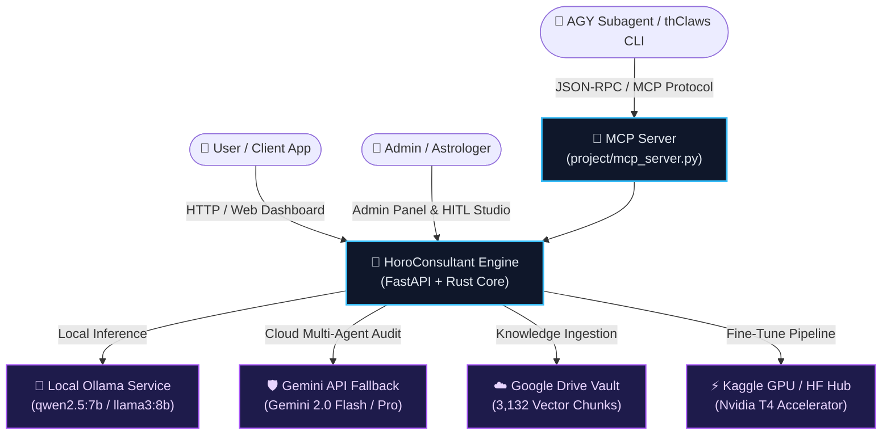
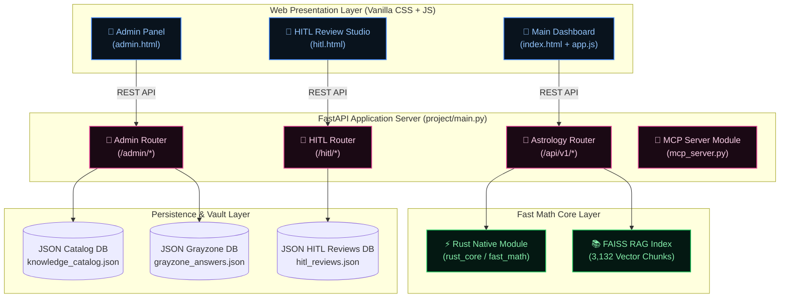
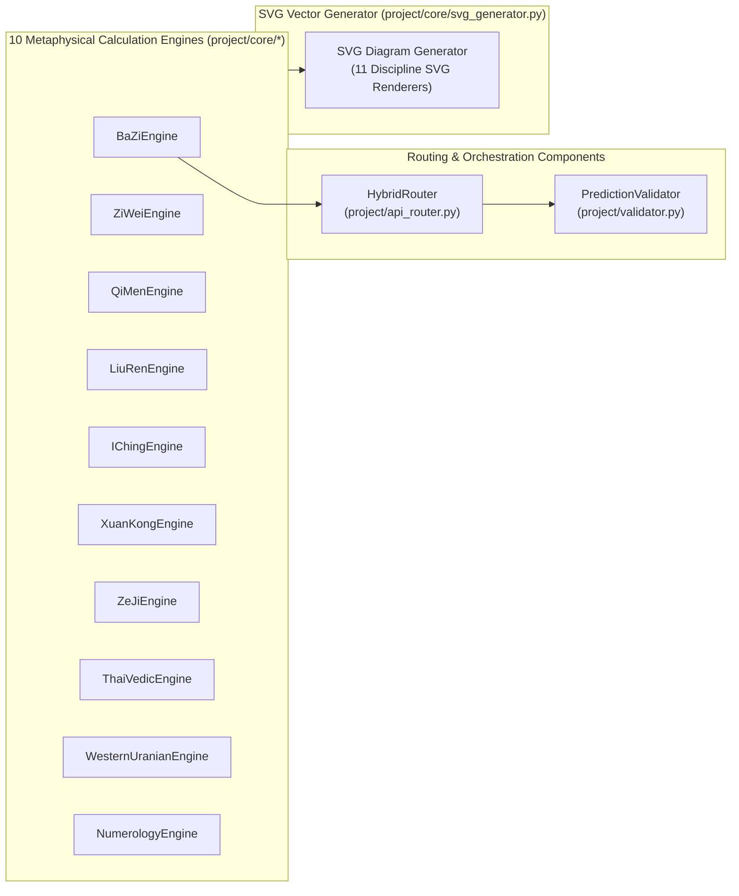
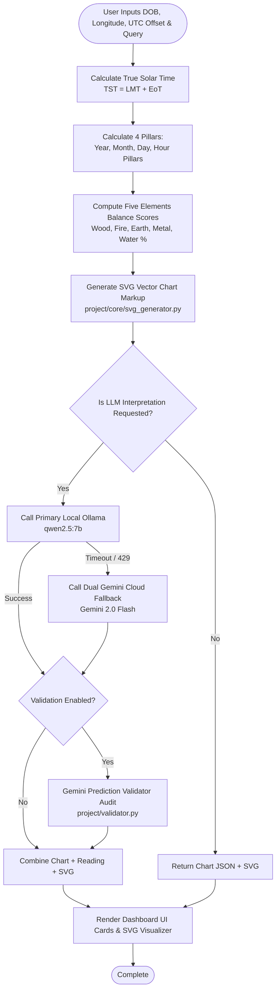
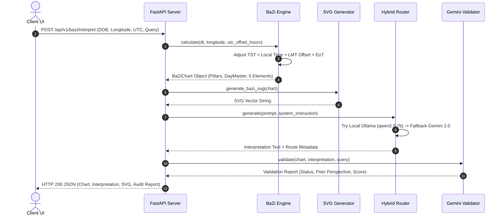
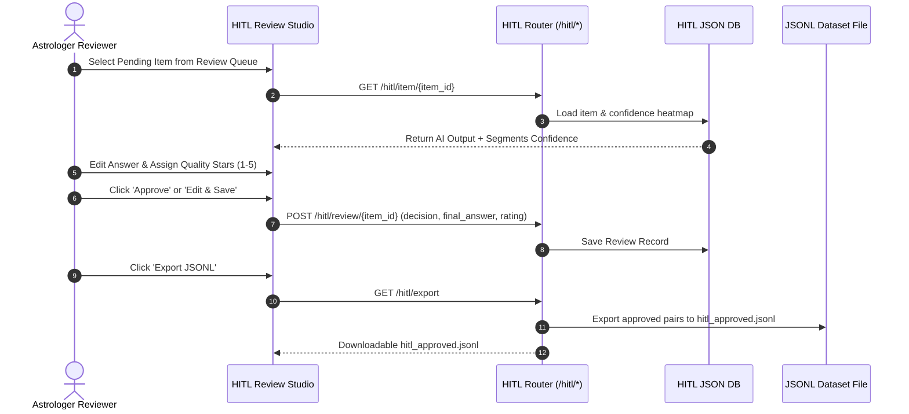

# 🌌 Computational Metaphysics Engine — Developer Architecture & Integration Guide

> **Project:** HoroConsultant — High-Precision 16-Domain Computational Metaphysics Engine (BaZi, ZiWei, QiMen, LiuRen, IChing, XuanKong, ZeJi, ThaiVedic, Western, Numerology, TaiYi, LiuYao, MeiHua, SanHe, QiZheng, MianXiang), True Solar Time Engine, Multi-Agent Gemini & Local Ollama Hybrid Routing, API v2 Router, FAISS Classical Vault RAG, Rust Fast Math Acceleration, and HITL Review Studio.


---

> 🚨 **GOVERNANCE MANDATE FOR DEVELOPERS & AI AGENTS (กฎการดูแลรักษาโปรเจกต์):**  
> **หากมีการเปลี่ยนแปลง โครงสร้าง สถาปัตยกรรม API Endpoint หรือฟีเจอร์ใดๆ ในโปรเจกต์นี้ นักพัฒนาและ AI Agents ทุกคน จะต้องทำการอัปเดตเอกสาร [`README.md`](file:///Users/kimlenglim/Project/HoroConsultant/README.md) และคู่มือ [`HOWTO.md`](file:///Users/kimlenglim/Project/HoroConsultant/HOWTO.md) นี้ให้เป็นปัจจุบันเสมอ** เพื่อรักษาความถูกต้อง ความแม่นยำ และความต่อเนื่องของการพัฒนาระบบ

> 📘 **คู่มือการใช้งานระบบสำหรับผู้ใช้และแพลตฟอร์มต่างๆ:**  
> สำหรับวิธีใช้งานเว็บไซต์สำหรับ End-User, การใช้งาน Admin Panel, HITL Review Studio และคู่มือการรันบนแพลตฟอร์มต่างๆ (Docker, Ollama, Kaggle GPU, MCP Server) โปรดอ่านเพิ่มเติมได้ที่ [**`HOWTO.md` (คู่มือการใช้งาน HoroConsultant Manual)**](file:///Users/kimlenglim/Project/HoroConsultant/HOWTO.md)

---

## 🤖 Codex Agent Compatibility

The legacy Antigravity agent definitions remain intact in `.antigravity/` and `.agents/`. Codex discovers the existing `.agents/skills/` natively; its 16 custom subagents are generated into `.codex/agents/` from `.agents/agents/*/agent.json`.

```bash
# After changing legacy agent definitions
python3 scripts/sync_sdlc_agents.py --sync
python3 scripts/sync_codex_agents.py --sync

# Read-only verification
python3 scripts/sync_sdlc_agents.py --check --use-python
python3 scripts/sync_codex_agents.py --check
```

Do not hand-edit `.codex/agents/*.toml`. Each file preserves the legacy role prompt but makes Codex inherit the active model rather than copying provider-specific model names.

---

## Test-First Git Provenance

Every feature or bug-fix ticket must freeze its black-box contract before
source coding. Commit tests and `plans/test_provenance/<ticket>-<sequence>.json`
first, record the red test or negative control, and use that commit SHA in each
later source commit:

```text
Test-Baseline: <full-baseline-commit-sha>
```

Verify the history before review:

```bash
python3 scripts/test_provenance_guard.py verify \
  --manifest plans/test_provenance/<manifest>.json \
  --baseline <full-baseline-commit-sha> \
  --head HEAD --include-worktree

python3 project/core/code_reviewer.py --review --use-python \
  --ticket <ticket-id> \
  --test-baseline <full-baseline-commit-sha> \
  --test-manifest plans/test_provenance/<manifest>.json
```

The local pre-commit hook is read-only. Required CI remains authoritative
because `--no-verify` can bypass a local hook. Work reconstructed after coding
must retain the label `NON_TDD_RECONSTRUCTED` and cannot be claimed as verified
test-first history.

## Impact-Based Gate Selection

Effective immediately, every work lane must emit a versioned
`GateImpactDecision` before verification begins. The decision records the base
and head revisions, a deterministic diff digest, changed paths, contracts,
dependencies and deployment surfaces, the gates to `RUN`, and the gates that
are `NOT_APPLICABLE` with a reason, plus the policy version and reviewer or
owner.

Run only gates that are directly or transitively affected. A full suite is not
required merely because it appears on a traditional checklist. Unknown impact,
a stale or missing impact map, or a change that crosses security, shared
infrastructure, or release boundaries fails closed to the broader applicable
set. `NOT_APPLICABLE` can never bypass test provenance for changed source,
relevant security checks, reviewer evidence, or post-deploy identity and health
checks for a deployment surface that changed.

The current release uses a manual, evidence-backed `GateImpactDecision` while
the deterministic selector and versioned impact map remain
`DEFERRED_NEXT_PHASE` until the current production post-deploy gate is green.
This policy changes gate selection, not release authority: production
publication can still be triggered only from `main`.

## Lesson 20 Release Triage Status

`scripts/fail_fast_triage.py` is a bounded diagnostic operator tool, not an
auto-remediator or a release approval. It can stop on the first failure or
collect all selected probes, and it supports human-readable ASCII and bounded,
versioned JSON output. See the detailed safe-use contract in
[`HOWTO.md`](HOWTO.md#311-fail-fast-root-cause-diagnostic-cli-scriptsfail_fast_triagepy).

Current evidence is explicitly not `READY_FOR_PROD`:

- Baseline `84b1dcf` is `DONE` and permanently
  `NON_TDD_RECONSTRUCTED`; it is not verified test-first history.
- Source `ca7fdec` is review-blocked. Mode-only follow-up `f1ed5ee` has local
  evidence of 822 passing tests, but it inherits the reconstructed-history
  limitation. Safety follow-up baseline ticket 034 is `IN_PROGRESS`.
- HF publisher baseline `65e7335` and source `1dfb7ba` are locally `DONE`, and
  the HF review is `READY_FOR_INTEGRATION`. The live HF release identity remains
  stale or malformed, so the release stays blocked.

An HTTP 200 response proves availability only. The candidate identity must
match the committed closed-schema metadata on Vercel and HF, and HF health must
report the same version and commit. Until deployment converges, scheduled
production monitoring can correctly repeat `[ERROR] Production path verification
failed`; that result is an identity blocker, not evidence that a non-`main`
branch should be allowed to publish.

### PR Verification & Triage Operational Contract

Diagnostics and PR provenance verification follow strict operational contracts:
- Execution is **POSIX-only** using `os.killpg` for bounded process group management. Unsupported platforms fail closed before subprocess execution.
- PR provenance verification runs the `test_provenance_guard.py verify-pr` command against immutable git commit SHAs resolved via `git rev-parse origin/main` and `git rev-parse HEAD`.
- PR verification command syntax:
```bash
python3 scripts/test_provenance_guard.py verify-pr \
  --base "$(git rev-parse origin/main)" \
  --head "$(git rev-parse HEAD)"
```

---

## 🏛️ C4 Software Architecture Levels

### Level 1: System Context Diagram (บริบทระบบภายนอก)

Describes how end-users, expert astrologers, and external AI services interact with the **HoroConsultant Computational Metaphysics Engine**.



#### PlantUML Specification (Level 1 System Context):
```plantuml
@startuml C4_Level1_Context
!include https://raw.githubusercontent.com/plantuml-stdlib/C4-PlantUML/master/C4_Context.puml

Person(user, "User / Client", "Interacts with astrology calculator & dashboards.")
Person(admin, "Admin / Astrologer", "Reviews AI outputs, manages knowledge catalog.")
System(horo, "HoroConsultant Engine", "Computational Metaphysics & Multi-Agent Calculation Engine.")

System_Ext(ollama, "Local Ollama LLM", "qwen2.5:7b local inference.")
System_Ext(gemini, "Gemini API", "Gemini 2.0 Multi-Agent Auditor & Fallback.")
System_Ext(gdrive, "Google Drive Vault", "Obsidian classical text storage.")
System_Ext(kaggle, "Kaggle GPU Hub", "Fine-tuning & LoRA training.")

Rel(user, horo, "Uses", "HTTPS / Web Dashboard")
Rel(admin, horo, "Reviews & Manages", "HTTPS / HITL & Admin UI")
Rel(horo, ollama, "Infers Locally", "HTTP API")
Rel(horo, gemini, "Validates & Audits", "HTTPS API")
Rel(horo, gdrive, "Syncs Vault", "GDrive API")
Rel(horo, kaggle, "Triggers Fine-Tune", "Kaggle CLI")
@enduml
```

---

### Level 2: Container Diagram (ตู้คอนเทนเนอร์และโครงสร้างระบบ)

Details the internal runtime containers, database layers, background schedulers, and static assets.



#### PlantUML Specification (Level 2 Containers):
```plantuml
@startuml C4_Level2_Containers
!include https://raw.githubusercontent.com/plantuml-stdlib/C4-PlantUML/master/C4_Container.puml

Container(web_ui, "Web Dashboard", "HTML5/Vanilla CSS/JS", "Main calculation dashboard & SVG visualizer.")
Container(admin_ui, "Admin & HITL UI", "HTML5/Vanilla CSS/JS", "Knowledge management & HITL review studio.")
Container(fastapi_app, "FastAPI App Server", "Python 3.12/FastAPI", "Serves REST APIs, routing, and background tasks.")
Container(rust_math, "Rust Core Engine", "Rust / PyO3", "Accelerates True Solar Time & Ephemeris math.")
ContainerDb(faiss_db, "FAISS Vector Store", "FAISS / Nomic Embed", "Stores 3,132 classical metaphysics vector chunks.")
ContainerDb(json_dbs, "Data Store Vault", "JSON DB Files", "Catalog, grayzone answers, and HITL review dataset.")

Rel(web_ui, fastapi_app, "API Calls", "HTTP / REST")
Rel(admin_ui, fastapi_app, "API Calls", "HTTP / REST")
Rel(fastapi_app, rust_math, "Calls native bindings", "C-ABI / PyO3")
Rel(fastapi_app, faiss_db, "Searches embeddings", "In-Memory Vector Search")
Rel(fastapi_app, json_dbs, "Reads/Writes JSON", "File I/O")
@enduml
```

---

### Level 3: Component Diagram (ส่วนประกอบภายในเซิร์ฟเวอร์)

Detailed structural component view of `astrology_router`, calculation engines, SVG diagram generators, and LLM Routers.



#### PlantUML Specification (Level 3 Components):
```plantuml
@startuml C4_Level3_Components
!include https://raw.githubusercontent.com/plantuml-stdlib/C4-PlantUML/master/C4_Component.puml

Container_Boundary(api_boundary, "FastAPI Core Services") {
    Component(astro_router, "Astrology Router", "FastAPI APIRouter", "Handles calculation & interpretation endpoints.")
    Component(bazi_comp, "BaZi Engine", "Python Core Module", "Calculates TST, 4 Pillars, and 5 Elements scores.")
    Component(ziwei_comp, "Zi Wei Engine", "Python Core Module", "Calculates 12 Palaces, Stars, and Si Hua mutators.")
    Component(qimen_comp, "Qi Men Engine", "Python Core Module", "Calculates 4-Plate grid (Stars, Doors, Spirits).")
    Component(svg_comp, "SVG Generator", "svg_generator.py", "Generates high-aesthetic SVG vector charts.")
    Component(hybrid_router, "Hybrid Router", "api_router.py", "Executes Ollama -> Gemini fallback chain.")
}

Rel(astro_router, bazi_comp, "Invokes calculation")
Rel(astro_router, ziwei_comp, "Invokes calculation")
Rel(astro_router, qimen_comp, "Invokes calculation")
Rel(bazi_comp, svg_comp, "Requests SVG markup")
Rel(ziwei_comp, svg_comp, "Requests SVG markup")
Rel(astro_router, hybrid_router, "Requests LLM interpretation")
@enduml
```

---

### Level 4: Code & Data Flow Diagrams (การไหลของข้อมูลและอัลกอริทึม)

#### Flowchart 1: Main Chart Calculation & Multi-Agent Audit Data Flow



#### Sequence Diagram 1: BaZi True Solar Time & AI Interpretation Sequence



#### Sequence Diagram 2: HITL Review Studio Fine-Tuning Pipeline Loop



---

## ☯️ 10 Metaphysical Disciplines Overview

The system implements 10 canonical computational metaphysics disciplines, each with dedicated math engines and high-aesthetic SVG vector diagram generators:

1. **BaZi (四柱命理):** Four Pillars of Destiny, True Solar Time adjustment, Heavenly Stems, Earthly Branches, Hidden Stems, and Five Elements Percentage Scores.
2. **Zi Wei Dou Shu (紫微斗數):** 12 Palaces (Ming Gong, Shen Gong), 14 Main Stars, and Si Hua Mutators (化祿, 化權, 化科, 化忌).
3. **Qi Men Dun Jia (奇門遁甲):** 4-Plate Grid (Yang/Yin Dun 18 Ju, Nine Stars, Eight Doors, Eight Spirits).
4. **Da Liu Ren (大六壬):** 3 Transmissions (初傳, 中傳, 末傳), 4 Lessons, and 12 Heavenly Generals.
5. **I Ching & Liu Yao (易經六爻):** Primary & Transformed Hexagrams, 6 Lines, 6 Animals, and 5 Relatives setup.
6. **Xuan Kong Flying Stars (玄空風水):** Period 9 9-Grid Flying Stars (Base Star, Sitting Star, Facing Star).
7. **Ze Ji Date Selection (擇吉คำนวณฤกษ์):** 12 Duty Officers (建除十二神), Day Clash analysis, and Activity Suitability matrix.
8. **Thai Suriyayart & Vedic (โหราศาสตร์ไทย & ภารตวิทยา):** Thai Suriyayart 10 Lagna, Maha Thaksa 8 Angels, 27 Vedic Nakshatras & Vimshottari Dasha.
9. **Western Tropical & Uranian (โหราศาสตร์สากล & ยูเรเนียน):** Tropical Planetary Longitudes, 8 Uranian Transneptunian Planets (TNPs), and Midpoint Formulas.
10. **Numerology & Satta-Lek (สัตตเลข 7 ฐาน & เลขศาสตร์):** Satta-Lek 7-Base 4-Row Matrix & Chaldean Numerology Scoring.

---

## ⚡ Quick Start & Development Setup

### 1. Requirements & Prerequisites
- Python 3.12+
- Node.js & npm (optional, for Playwright visual tests)
- Local Ollama (`qwen2.5:7b` installed via `ollama pull qwen2.5:7b`)

### 2. Environment Setup

```bash
git clone https://github.com/pphothidaen/HoroConsultant.git
cd HoroConsultant
cp .env.example .env

# Install Python dependencies
pip install -r requirements.txt
```

### 3. Run FastAPI Application

```bash
# Start dev server on http://localhost:8000
python3 -m uvicorn project.main:app --reload --port 8000
```

Access Interactive UI Dashboards & Metrics:
- **Main Dashboard:** `http://localhost:8000/`
- **Admin Panel:** `http://localhost:8000/admin` (Authorized Emails: `pansakorn@gmail.com`, `kimlenglim.work@gmail.com`)
- **HITL Review Studio:** `http://localhost:8000/hitl-studio`
- **Interactive Swagger Docs:** `http://localhost:8000/docs`
- **Prometheus Metrics Endpoint:** `http://localhost:8000/metrics`
- **Synthetic Monitoring Health Alias:** `http://localhost:8000/api/health`

---

## 🧪 Testing & Quality Assurance

### Run Pytest Test Suite

```bash
# Full test suite (93 unit/integration/button regression tests)
python3 -m pytest project/tests -v

# Run UI Button Regression suite specifically
python3 -m pytest project/tests/test_button_regression.py -v
```

### Run Playwright E2E Visual Screenshot Suite

```bash
# Installs playwright binaries and executes E2E screen captures
python3 -m playwright install
python3 scripts/run_e2e_screenshots.py
```

Captured screenshots are saved in `project/tests/screenshots/`.

---

## 🔌 Model Context Protocol (MCP) Server Integration

The system exposes all metaphysics tools as an **MCP Server** for integration with **AGY Subagents** and **thClaws (Rust Agent Harness)**.

```bash
# Start MCP Server via Stdin/Stdout
python3 project/mcp_server.py
```

### Exposed MCP Tools:
- `bazi_calculate`: Returns structured 4 Pillars JSON & Five Elements percentages.
- `render_bazi_svg`: Generates BaZi SVG chart and saves to `project/static/charts/bazi_chart.svg`.
- `render_zodiac_svg`: Generates 12 Zodiac Wheel SVG and saves to `project/static/charts/zodiac_wheel.svg`.
- `rag_search`: Searches 3,132 FAISS vector chunks from classical classical texts.

---

## 🌐 Canonical Production Architecture

Production uses two fail-closed targets:

1. **Vercel UI and lightweight gateway** —
   `https://horo-consultant-psi.vercel.app`. The project must define the
   non-secret production config
   `HF_BACKEND_URL=https://pphothidaen-horoconsultant-core-backend.hf.space`.
   The gateway rejects a missing or non-canonical origin with HTTP 503; it does
   not substitute a local/static calculation.
2. **Hugging Face Docker backend** —
   `pphothidaen/horoconsultant-core-backend` (`sdk: docker`) runs FastAPI,
   PyO3/Rust math, FAISS/RAG, and the canonical calculation APIs.

Static deployment to the backend Space, public Azure, and Fly are retired
release lanes. Local development remains available at `http://localhost:8000`.

```bash
# Immutable Docker payload audit; no upload
python3 scripts/publish_space_hf.py \
  --space-id pphothidaen/horoconsultant-core-backend \
  --sdk docker \
  --dry-run

# Read-only live Docker health and exact release identity
python3 scripts/publish_space_hf.py \
  --space-id pphothidaen/horoconsultant-core-backend \
  --sdk docker \
  --check-health
python3 scripts/publish_space_hf.py \
  --space-id pphothidaen/horoconsultant-core-backend \
  --sdk docker \
  --verify-version

# Five canonical Vercel UI viewports
python3 scripts/run_visual_layout_audit.py \
  --url https://horo-consultant-psi.vercel.app \
  --scenario v3-consensus \
  --no-server
```

The release is fail-closed: publisher/governance tests, Docker payload dry-run,
secret scan, code review, exact backend health/version, production API E2E,
Vercel version consistency, five-viewport visual audit, and
`scripts/sync_ai_agent_ecosystem.py --check` must all pass before a full
`READY_FOR_PROD` claim. A healthy HTTP status does not substitute for exact
version evidence.

---

## 📝 Governance Rule Checklist for Developers

When making changes to this codebase:
- [ ] Maintain deterministic math verification in `project/core/` before calling LLMs.
- - [ ] **ALWAYS update this `README.md` document to accurately reflect any new architecture, route changes, or newly added metaphysical engines.**
- [ ] **ALWAYS update the Central Kanban Board [`PROJECT_TASKS.md`](PROJECT_TASKS.md) with new tickets, status changes, and completion evidence — this file is the single source of truth for all project work tracking.**

---

## 📋 Central Kanban Board

The **single source of truth for all project tasks, tickets, sprint tracking, and operational handoff** is:

👉 **[`PROJECT_TASKS.md`](PROJECT_TASKS.md)** — Kanban Task Board & Ticket Registry

This file contains:
- **TASK BOARD (KANBAN)** — Done/Doing/TODO column overview
- **Ticket Table** — All tickets with ID, assigned agent, summary, status, and dependencies
- **Ticket Detail Sections** — Full detailed instructions and acceptance criteria per ticket
- **Quick-Start Commands** — Essential dev/CI commands for the next engineer or AI assistant

All new work, bug fixes, feature requests, and operational items **must** be tracked here. Do not create separate task lists, kanban boards, or tracking files elsewhere in the repo — keep everything centralized in `PROJECT_TASKS.md`.
