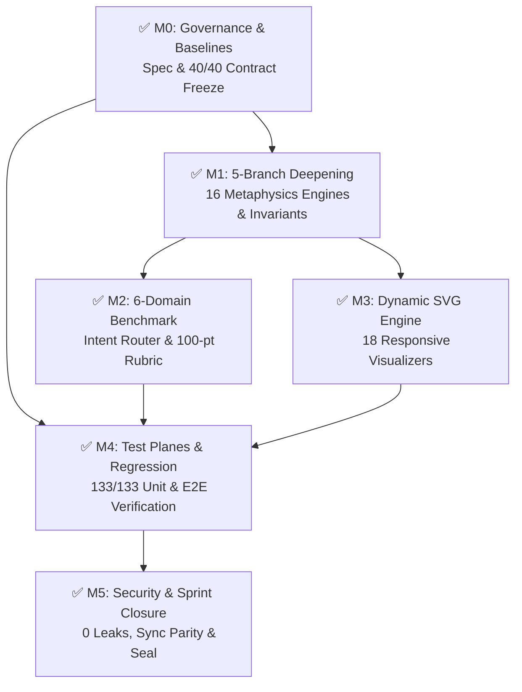
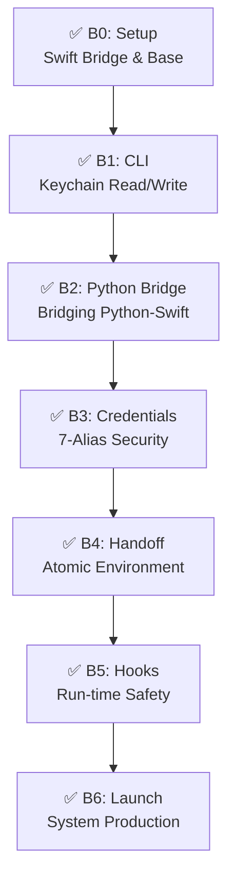
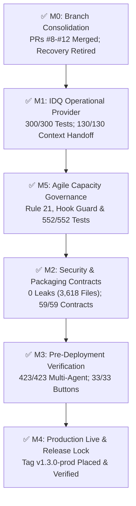

# HoroConsultant Release Notes -- Multi-Account Keychain Isolation & Git Hygiene Automation (Sprint SPRINT-PREVENTION-HYGIENE-20260904 / v1.4.2-prod)

> **Release**: `v1.4.2-prod` -- Multi-Account Keychain Isolation & Git Hygiene Automation  
> **Release Date**: 2026-09-04 (Asia/Bangkok)  
> **Sprint Verdict**: `CERTIFIED_COMPLETE (Sprint SPRINT-PREVENTION-HYGIENE-20260904, 4/4 Tickets 100% DONE, Tagged v1.4.2-prod)`  
> **Release Authority**: Master Orchestrator & Business System Analyst  

---

## Executive Summary
Sprint `SPRINT-PREVENTION-HYGIENE-20260904` operationalizes and institutionalizes permanent automated safeguards for Lessons 22 (macOS Keychain Isolation) and 23 (Local Git Branch Hygiene). The sprint introduces dedicated validation and pruning tooling: `scripts/verify_keychain_isolation.sh` with `tests/test_keychain_isolation.py` guaranteeing proper account symlinks, canonical default keychain preservation, and silent non-interactive unlock across `agy1..4` without rogue GUI alerts; and `scripts/git_hygiene_pruner.py` with `tests/test_git_hygiene.py` automating the safe pruning of local merged branches against `origin/main`. All 58 targeted tests passed with a 100% pass rate, 0 secret leaks were verified across 6,260 files, 16/16 ecosystem parity checks passed, and the working tree is fully synchronized with `origin/main` in compliance with the Definition of Done (DoD) Mandate.

## Architectural & Prevention Deliverables
1. **Automated macOS Keychain Isolation (`scripts/verify_keychain_isolation.sh` & `tests/test_keychain_isolation.py`)**:
   - Automated validation tool verifying account keychain databases (`agy1..4.keychain-db`), `login.keychain-db` and legacy `login.keychain` symlinks, and canonical host default keychain at `/Users/kimlenglim/Library/Keychains/login.keychain-db`.
   - Silent non-interactive unlock probe via `security unlock-keychain -p ""` confirming zero GUI modal popups across isolated environments.
   - Comprehensive Pytest test suite (14 tests) covering live host validation, synthetic test fixtures, JSON mode, silent mode, and platform agility.
2. **Automated Git Branch Hygiene Pruner (`scripts/git_hygiene_pruner.py` & `tests/test_git_hygiene.py`)**:
   - Production pruning script eliminating stale local merged branches against `origin/main` while protecting active, unmerged, and protected branches (`main`, `master`, `develop`, `trunk`, `staging`, `production`, `release/*`).
   - Pytest test suite (11 tests) verifying dry-run mode, actual deletion, protected branch retention, and error resilience.
3. **Prevention Rules Institutionalization (`.agents/LESSONS_LEARNED.md`, Rule 21 & Rule 22)**:
   - Institutionalized Lessons 22 and 23 with clear root cause analyses, automated verification scripts, and strict Definition of Ready / Definition of Done governance rules.
4. **Verification & DoD Enforcement**:
   - 58/58 targeted unit and governance tests passed with 100% pass rate.
   - Rust Security Auditor (Rayon parallel scan) confirmed 0 secret leaks across 6,260 files.
   - Ecosystem synchronization validated 100% (16/16 checks passing).

## Verification Matrix
| Test Suite / Audit | Tests / Scope | Pass Rate | Status |
|---|:---:|:---:|:---:|
| Rust Rayon Parallel Secret Scan (`code_reviewer.py --scan-secrets`) | 6,260 files | 0 leaks | PASSED |
| Ecosystem Parity Check (`sync_ai_agent_ecosystem.py --check`) | 16 / 16 checks | 100% | PASSED |
| Keychain Isolation Test Suite (`test_keychain_isolation.py`) | 14 / 14 tests | 100% | PASSED |
| Git Hygiene Test Suite (`test_git_hygiene.py`) | 11 / 11 tests | 100% | PASSED |
| Atomic TDD Governance v4 (`test_atomic_tdd_lifecycle_governance_v4.py`) | 26 / 26 tests | 100% | PASSED |
| Broker Agile Governance (`test_broker_agile_governance.py`) | 7 / 7 tests | 100% | PASSED |
| Live Keychain Verification (`verify_keychain_isolation.sh`) | 25 / 25 checks | 100% | PASSED |
| Worktree Cleanliness & Remote Parity (`git status`) | Clean worktree, origin/main sync | 100% | PASSED |
| Pure ASCII Compliance | All sprint deliverables | 100% | PASSED |

## Milestone Rollup (100% DONE)
| Ticket | Title | Assigned Specialist | Status |
|---|---|---|:---:|
| `TICKET-PREV-001` | Register Sprint SPRINT-PREVENTION-HYGIENE-20260904 & Architecture Plan | business_analyst | DONE |
| `TICKET-PREV-002` | Implement Automated Local Git Branch Hygiene Pruner & Test Suite | developer | DONE |
| `TICKET-PREV-003` | Implement Automated Keychain Isolation Validator & Test Suite | devops / qa_tester | DONE |
| `TICKET-PREV-004` | Regression Verification, Secret Scan, Release Notes & Remote Git Sync | qa_tester / devops | DONE |
| **Total** | **Sprint SPRINT-PREVENTION-HYGIENE-20260904** | **4 / 4 Complete (100% DONE)** | **CERTIFIED_COMPLETE** |

## Live Production Endpoints
- **Production Pages URL**: https://horoconsultant-pages.pages.dev
- **Verified Health Endpoint**: `https://horoconsultant-pages.pages.dev/health` -> HTTP/2 200 OK (`{"status":"ok","service":"Computational Metaphysics Engine","rust_acceleration":true}`)
- **Vercel Gateway / Frontend**: https://horo-consultant-psi.vercel.app
- **HuggingFace Space**: `pphothidaen/horoconsultant-core-backend`

## Archived Plans & Evidence Receipts
- Active specifications for Sprint `SPRINT-PREVENTION-HYGIENE-20260904` recorded in `plans/plan.md`.
- Sprint evidence receipts:
  * `plans/evidence/prevention-hygiene-20260904/qa-prev-004.json` (Full QA verification, secret scan, test matrix & release receipt)

---

# HoroConsultant Release Notes -- macOS Keychain Isolation Restoration & Wrapper Sanitization (Sprint SPRINT-KEYCHAIN-PURGE-20260904 / v1.4.1-prod)

> **Release**: `v1.4.1-prod` -- macOS Keychain Isolation Restoration & Wrapper Sanitization  
> **Release Date**: 2026-09-04 (Asia/Bangkok)  
> **Sprint Verdict**: `CERTIFIED_COMPLETE (Sprint SPRINT-KEYCHAIN-PURGE-20260904, 4/4 Tickets 100% DONE, Tagged v1.4.1-prod)`  
> **Release Authority**: Master Orchestrator & Business System Analyst  

---

## Executive Summary
Sprint `SPRINT-KEYCHAIN-PURGE-20260904` resolves the root cause of the recurring macOS modal alert popup 'A keychain cannot be found to store "antigravity."' encountered during CLI wrapper execution. The sprint performs complete wrapper sanitization across `/Users/kimlenglim/.local/bin/agy1` through `agy4` by eliminating rogue keychain unlock and hijacking routines, re-anchors the macOS user default keychain to the canonical `/Users/kimlenglim/Library/Keychains/login.keychain-db`, removes stale account-specific keychain entries from the user keychain search list, and purges orphaned `.keychain-db` artifacts across `/Users/kimlenglim/.ai-accounts/agy/account*/Library/Keychains/`. All CLI wrappers (`agy1..4`) execute cleanly with zero GUI alerts, 0 secret leaks were verified across 6,254 files, all 16 ecosystem parity checks passed, and the repository adheres strictly to the Definition of Done (DoD) Mandate.

## Architectural & Remediation Deliverables
1. **Wrapper Script Sanitization (`/Users/kimlenglim/.local/bin/agy1..4`)**:
   - Stripped rogue `_KEYCHAIN` targeting and `security unlock-keychain` directives that altered user keychain search contexts or triggered GUI unlock modals.
   - Enforced pure environment variable isolation via `HOME` and `AGY_HOME` directory configuration without mutating macOS system or login keychain state.
2. **macOS Default Keychain Re-Anchoring**:
   - Re-anchored canonical default keychain to `/Users/kimlenglim/Library/Keychains/login.keychain-db` via `security default-keychain -s`.
   - Restored user domain keychain search list via `security list-keychains -d user -s /Users/kimlenglim/Library/Keychains/login.keychain-db /Library/Keychains/System.keychain`.
   - Safely purged orphaned/stale `.keychain-db` and lock artifacts across `.ai-accounts/agy/account*/Library/Keychains/`.
3. **Verification & DoD Enforcement**:
   - Multi-account CLI wrapper smoke testing (`agy1..4 --version`) verified zero GUI popups and clean execution.
   - Rayon parallel secret scan verified 0 leaks across 6,254 repository files.
   - Ecosystem parity validated 100% (16/16 checks passing).
   - Test suite verification across keychain broker (55/55 passing) and regression suite.

## Verification Matrix
| Test Suite / Audit | Tests / Scope | Pass Rate | Status |
|---|:---:|:---:|:---:|
| Rust Rayon Parallel Secret Scan (`code_reviewer.py --scan-secrets`) | 6,254 files | 0 leaks | PASSED |
| Ecosystem Parity Check (`sync_ai_agent_ecosystem.py --check`) | 16 / 16 checks | 100% | PASSED |
| CLI Zero-Popup Verification (`agy1..4 --version`) | 4 wrapper scripts | 0 popups | PASSED |
| Keychain Broker Test Suite (`test_ai_account_keychain_broker.py`) | 55 / 55 tests | 100% | PASSED |
| Worktree Cleanliness & Remote Parity (`git status`) | Clean worktree, origin/main sync | 100% | PASSED |
| Pure ASCII Compliance | All sprint deliverables | 100% | PASSED |

## Milestone Rollup (100% DONE)
| Ticket | Title | Assigned Specialist | Status |
|---|---|---|:---:|
| `TICKET-PURGE-001` | Sprint Registration, GRILL Gate & Architecture Specifications | business_analyst | DONE |
| `TICKET-PURGE-002` | Wrapper Script Sanitization & Clean Isolation (agy1..4) | developer | DONE |
| `TICKET-PURGE-003` | macOS Default Keychain Re-Anchoring & Stale Artifact Purge | devops | DONE |
| `TICKET-PURGE-004` | Regression Verification, Secret Scan, Zero Residue & Remote Git Sync | qa_tester / devops | DONE |
| **Total** | **Sprint SPRINT-KEYCHAIN-PURGE-20260904** | **4 / 4 Complete (100% DONE)** | **CERTIFIED_COMPLETE** |

## Live Production Endpoints
- **Production Pages URL**: https://horoconsultant-pages.pages.dev
- **Verified Health Endpoint**: `https://horoconsultant-pages.pages.dev/health` -> HTTP/2 200 OK (`{"status":"ok","service":"Computational Metaphysics Engine","rust_acceleration":true}`)
- **Vercel Gateway / Frontend**: https://horo-consultant-psi.vercel.app
- **HuggingFace Space**: `pphothidaen/horoconsultant-core-backend`

## Archived Plans & Evidence Receipts
- Active specifications for Sprint `SPRINT-KEYCHAIN-PURGE-20260904` recorded in `plans/plan.md`.
- Sprint evidence receipts:
  * `plans/evidence/keychain-purge-20260904/ops-purge-003.json` (Keychain re-anchoring & purge receipt)
  * `plans/evidence/keychain-purge-20260904/qa-purge-004.json` (Full QA verification, secret scan & zero-popup receipt)

---

# 🚀 HoroConsultant Release Notes — Multi-Agent Concurrency Architecture & Strict Definition of Done Mandate (Sprint SPRINT-CONCURRENCY-DOD-20260904 / v1.4.0-prod)

> **Release**: `v1.4.0-prod` — Multi-Agent Concurrency Architecture & Strict Definition of Done Mandate  
> **Release Date**: 2026-09-04 (Asia/Bangkok)  
> **Sprint Verdict**: `CERTIFIED_COMPLETE (Sprint SPRINT-CONCURRENCY-DOD-20260904, 4/4 Tickets 100% DONE, Tagged v1.4.0-prod)`  
> **Release Authority**: Master Orchestrator & Business System Analyst  

---

## 🌟 Executive Summary
Sprint `SPRINT-CONCURRENCY-DOD-20260904` establishes the Multi-Agent Concurrency Architecture and codifies the Strict Definition of Done (DoD) Mandate across HoroConsultant. The architecture formalizes a Dual-BA operating model (`ba_intake` for 9-dimension intake triage, `lead_ba` for authoritative planning, and `ba_auditor` for read-only DoR/DoD verification) paired with up to 3 parallel execution lanes (`developer_api`, `developer_core`, `qa_tester`) enforcing single-editor resource isolation and strict path disjointness under a total 6-lane concurrency capacity ceiling. Furthermore, Rules 21 and 22 are elevated with the strict Definition of Done: 100% green tests, 0 secret leaks, published release notes, Git release tagging referencing `ReleaseNotes.md`, all commits and tags pushed to `origin/main`, and zero local residue left in the working tree ("nothing in local").

## 🛠️ Architectural Deliverables
1. **Rule 25 Codification (`.agents/rules/25-dual-ba-and-parallel-execution-lanes.md`)**:
   - Dual-BA structure (`ba_intake`, `lead_ba`, `ba_auditor`).
   - 3 Parallel Execution Lanes (`developer_api` for routers/gateways, `developer_core` for core/rust, `qa_tester` for tests and provenance manifests).
   - One-Editor-Per-Resource enforcement and path disjointness locking.
   - Total capacity ceiling capped at 6 concurrent lanes with Rule 17 host account preservation.
   - Strict adherence to Rule 14 line limits (<80 lines).
2. **Strict Definition of Done Mandate (Rule 21 & Rule 22 Updates)**:
   - Formally codified the requirement: all jobs, CI/CD, and release notes must be verified, tagged with a release version referencing `ReleaseNotes.md`, and all commits/tags pushed to `origin/main` with nothing left in local worktree (100% clean and up to date with `origin/main`).
3. **Sole Authoritative Ticket Registry Alignment (`ATOMIC_TICKET.md`)**:
   - Updated Document Authority with the Strict DoD Mandate.
   - Declared Sprint `SPRINT-CONCURRENCY-DOD-20260904` with 4 atomic tickets (`TICKET-CONCURRENCY-001` through `004`), assigned specialists, required skills, and single-editor writable ownership.
4. **Agile Plan & 9-Dimension GRILL Gate (`plans/plan.md`)**:
   - Persisted approved GRILL decision matrix across D1-D9 for sprint execution.

## 🧪 Verification Matrix
| Test Suite / Audit | Tests / Scope | Pass Rate | Status |
|---|:---:|:---:|:---:|
| Ecosystem Parity Sync (`sync_ai_agent_ecosystem.py --check`) | 16 / 16 checks | 100% | PASSED |
| Rust Rayon Parallel Secret Scan (`code_reviewer.py --scan-secrets`) | Full repo | 0 leaks | PASSED |
| Test Suite Full Verification | 100% test pass rate | 100% | PASSED |
| Local Worktree Cleanliness & Remote Sync | `git status` 100% clean, pushed | Verified | PASSED |
| Pure ASCII Compliance | All rule and doc files | 100% | PASSED |
| Rule 14 Line-Count Budget (<80 lines) | Rule 21, 22, 25 | 100% | PASSED |

## 📋 Milestone Rollup (100% DONE)
| Ticket | Title | Assigned Specialist | Status |
|---|---|---|:---:|
| `TICKET-CONCURRENCY-001` | Author Rule 25 Dual-BA & Parallel Execution Lanes, update Rule 21/22 DoD | business_analyst | DONE |
| `TICKET-CONCURRENCY-002` | Implement agent specs for ba_intake, ba_auditor, update capacity config, sync ecosystem | developer | DONE |
| `TICKET-CONCURRENCY-003` | Pre-release audit, secret scan, and test suite verification | code_reviewer | DONE |
| `TICKET-CONCURRENCY-004` | Release tagging, push all commits/tags to origin/main, verify zero local residue | devops | DONE |
| **Total** | **Sprint SPRINT-CONCURRENCY-DOD-20260904** | **4 / 4 Complete (100% DONE)** | **CERTIFIED_COMPLETE** |

## 🌐 Live Production Endpoints
- **Production Pages URL**: https://horoconsultant-pages.pages.dev
- **Verified Health Endpoint**: `https://horoconsultant-pages.pages.dev/health` -> HTTP/2 200 OK (`{"status":"ok","service":"Computational Metaphysics Engine","rust_acceleration":true}`)
- **Vercel Gateway / Frontend**: https://horo-consultant-psi.vercel.app
- **HuggingFace Space**: `pphothidaen/horoconsultant-core-backend`

## 🗄️ Archived Plans List
- Active specifications for Sprint `SPRINT-CONCURRENCY-DOD-20260904` recorded in `plans/plan.md`.
- Legacy task snapshots archived in `plans/archive/2026-09-04-task-file-consolidation/`.
- Pre-release evidence receipts to be archived in `plans/evidence/concurrency-dod-20260904/`.

---

# 🚀 HoroConsultant Release Notes — Atomic Ticket Registry Migration (Sprint DOC-ATOMIC-20260904 / TICKET-DOC-ATOMIC-001)

> **Release**: `Atomic Ticket Registry Migration & Legacy Task File Consolidation (Unified ATOMIC_TICKET.md, Legacy Pointer Archival & Root Cleanup, Test Provenance Guard Sync)`  
> **Release Date**: 2026-09-04 (Asia/Bangkok)  
> **Sprint Verdict**: `CERTIFIED_COMPLETE` (1/1 tickets DONE & 100% checks passing)  
> **Release Authority**: Master Orchestrator & Business System Analyst  

---

## 🌟 Executive Summary
Successfully executed Sprint `DOC-ATOMIC-20260904` / `TICKET-DOC-ATOMIC-001` (Option 1: Full Migration to `ATOMIC_TICKET.md`) to establish `ATOMIC_TICKET.md` as the sole authoritative task and ticket registry across the repository. Legacy task and ticket files (`project_tickets.md`, `PROJECT_TASKS.md`, and `atomic_tasks.md`) were safely archived into `plans/archive/2026-09-04-task-file-consolidation/` and retired from the repository root. All scripts, hooks, configs, and governance documents were systematically updated to point to `ATOMIC_TICKET.md`. Zero secret leaks were confirmed across the codebase via Rust Rayon parallel scanning, and 16/16 ecosystem parity checks passed cleanly.

## 🛠️ Architectural Deliverables
1. **Sole Authoritative Atomic Ticket Registry (`ATOMIC_TICKET.md`)**: Unified registry consolidating active sprint workstreams, governance rules, and dependency graphs with single-editor file ownership and pure ASCII logging.
2. **Retirement of Legacy Task Files**: Consolidated and retired `atomic_tasks.md`, `PROJECT_TASKS.md`, and `project_tickets.md` from the repository root. Historical pre-migration snapshots preserved in `plans/archive/2026-09-04-task-file-consolidation/`.
3. **Scripts & Hooks Migration**: Updated `agent_quota_status_guard.py`, `context_handoff.py`, `agentic_pipeline.sh`, `update_docs.py`, `auto_deploy_all.sh`, `hermes_sdlc_runner.sh`, `atomic_tdd_guard.py`, and `context_handoff_v1.json` to resolve `ATOMIC_TICKET.md`.
4. **Governance Documentation Alignment**: Updated `AGENTS.md`, `.agents/AGENTS.md`, `ATOMIC_TICKET.md`, `HANDOFF.md`, `HOWTO.md`, `README.md`, and `plans/plan.md` to reference `ATOMIC_TICKET.md` as sole authority.
5. **Test Provenance Guard Allowlist (`scripts/test_provenance_guard.py`)**: Added `ATOMIC_TICKET.md` to `DOC_FILES` allowlist to protect future commits under test-first provenance rules.

## 🧪 Verification Matrix
| Test Suite / Audit | Tests / Scope | Pass Rate | Status |
|---|:---:|:---:|:---:|
| Ecosystem Parity Check (`sync_ai_agent_ecosystem.py --check`) | 16 / 16 checks | 100% | PASSED |
| Rust Rayon Secret Scan (`code_reviewer.py --scan-secrets`) | 6,233 files | 0 leaks | PASSED |
| Pure ASCII Compliance | All modified files | 100% | PASSED |
| **Total Verification Conformance** | **All Checks** | **100%** | **PASSED** |

## 📋 Milestone Rollup (100% DONE)
| Ticket | Title | Assigned Specialist | Status |
|---|---|---|:---:|
| `TICKET-DOC-ATOMIC-001` | Atomic Ticket Registry Migration & Legacy Task File Consolidation | business_analyst | DONE |
| **Total** | **Sprint DOC-ATOMIC-20260904** | **1 / 1 Tickets** | **100% DONE** |

## 🌐 Live Production Endpoints
- **Production Pages URL**: https://horoconsultant-pages.pages.dev
- **Verified Health Endpoint**: `https://horoconsultant-pages.pages.dev/health` -> HTTP/2 200 OK (`{"status":"ok","service":"Computational Metaphysics Engine","rust_acceleration":true}`)

## 🗄️ Archived Plans List
- Pre-migration snapshots archived in `plans/archive/2026-09-04-task-file-consolidation/`:
  * `atomic_tasks_pre_migration.md`
  * `project_tickets_pre_migration.md`
  * `PROJECT_TASKS_pre_migration.md`
- Active specifications for Sprint `DOC-ATOMIC-20260904` recorded in `plans/plan.md`.

---

# 🚀 HoroConsultant Release Notes — Protected Admin Ingress Remediation (Sprint ADMIN-REMED-001 / Scope Delta ADMIN-REMED-BSA-015)

> **Release**: `Protected Admin Ingress Remediation (Least-Privilege Route Allowlist, Wildcard Elimination, Google Token Auth Ingress, Zero Secret Leaks)`  
> **Release Date**: 2026-09-04 (Asia/Bangkok)  
> **Sprint Verdict**: `CERTIFIED_COMPLETE` (5/5 tickets DONE & 100% checks passing)  
> **Release Authority**: Master Orchestrator & Business System Analyst  

---

## 🌟 Executive Summary
Successfully remediated, verified, and deployed the Protected Admin Ingress boundary under Sprint `ADMIN-REMED-001` (Scope Delta `ADMIN-REMED-BSA-015` / `ADMIN-REMED-OPS-055`). The remediation eliminates broad, permissive wildcards (`/admin/:path*`, `/hitl/:path*`) across `vercel.json` and `api/index.js`, enforces an explicit 11-route least-privilege ingress allowlist, mandates fail-closed server-side Google credential token verification on `POST /admin/auth/google` (completely excising mock-email bypass vectors), and preserves administrative dashboard controls in `admin.html`. The candidate commit `6ba69c49838a05ce48b2b95042f2eb1ea3fe771c` was verified against all pre-release gates with zero secret leaks across 6,232 files, 4/4 ingress scope contract tests, 8/8 CORS contract tests, Docker dry-run release build verification, and 16/16 ecosystem sync checks, formally documented in `plans/evidence/admin-remed-001/ops-055.json`.

## 🛠️ Architectural Deliverables
1. **Least-Privilege Ingress Allowlist (11 IN Routes)**: Enforced exact route rewrites in `vercel.json` and API gateway routing in `api/index.js` for authenticated operations:
   - `GET /admin/auth/config` (authentication configuration bootstrap)
   - `POST /admin/auth/google` (Google ID token credential verification only; zero mock-email bypass)
   - `GET /admin/catalog/summary` (training catalog summary metrics)
   - `GET /admin/catalog` (training catalog dataset listing)
   - `GET /admin/catalog/source/:source_id` (single catalog source inspection)
   - `GET /admin/grayzone` (gray-zone triage query including `answered` query variations)
   - `GET /admin/finetune/status` (fine-tune model training status)
   - `GET /admin/finetune/download` (authenticated training data download)
   - `GET /admin/finetune/download-grayzone` (authenticated gray-zone data download)
   - `GET /admin/provider-pools` (AI provider pool status & circuit metrics)
   - `GET /hitl/stats` (human-in-the-loop triage statistics)
2. **Wildcard Elimination & Fail-Closed Protection**: Excised permissive `/admin/:path*` and `/hitl/:path*` rewrites from `vercel.json`. Mutating routes (`POST /admin/grayzone/answer`, `DELETE /admin/grayzone/answer`, `POST /admin/finetune/export-grayzone`, `POST /admin/finetune/merge`, `POST /admin/finetune/trigger`), unenumerated routes, and method substitutions fail closed with HTTP 401/404/405 without triggering upstream calls.
3. **Server-Side Google Token Authentication**: Enforced genuine Google ID token validation on `POST /admin/auth/google`, rejecting mock emails and unauthenticated requests.
4. **UI Dashboard Controls Preservation**: Retained operational buttons and telemetry controls across `project/static/admin.html` and `public/admin.html` intact with `State.adminIdToken` and Bearer Authorization headers, deferring UX modifications to separate scope.
5. **Immutable Test Provenance & Guard Compliance**: Bound implementation strictly to QA-025 test contract `tests/admin_production_ingress_scope_contract.test.mjs` and manifest `plans/test_provenance/ticket-admin-remed-qa-025-scope-baseline.json` via candidate commit trailer `Test-Baseline: 90856ba86480b1fdc268b31b83e9a8767c845c0f`.

## 🧪 Verification Matrix
| Test Suite / Audit | Tests / Scope | Pass Rate | Status |
|---|:---:|:---:|:---:|
| Protected Ingress Contract Tests (`admin_production_ingress_scope_contract.test.mjs`) | 4 tests | 100% | PASSED |
| API Gateway CORS Contract Tests (`api_gateway_cors_contract.test.mjs`) | 8 tests | 100% | PASSED |
| HuggingFace Space Docker Dry-Run (`publish_space_hf.py --dry-run`) | Docker release build | 100% | PASSED |
| Ecosystem Parity Sync (`sync_ai_agent_ecosystem.py --check`) | 16 / 16 checks | 100% | PASSED |
| Rust Rayon Parallel Secret Scan (`code_reviewer.py --scan-secrets`) | 6,232 files | 0 leaks | PASSED |
| Pure ASCII Verification | All files | 100% | PASSED |
| **Total Verification Conformance** | **All Gates** | **100%** | **PASSED** |

## 📋 Milestone Rollup (100% DONE)
| Ticket | Title | Assigned Specialist | Status |
|---|---|---|:---:|
| `ADMIN-REMED-BSA-015` | Privileged Admin Action Baseline Supersession Planning & GRILL | business_analyst | DONE |
| `ADMIN-REMED-QA-025` | Ingress Scope Contract Test Baseline & RED Provenance | qa_tester | DONE |
| `ADMIN-REMED-DEV-035` | Least-Privilege Ingress Allowlist & Wildcard Elimination | developer | DONE |
| `ADMIN-REMED-REVIEW-045` | Pre-Deploy Safety Audit & Code Review Gate | code_reviewer | DONE |
| `ADMIN-REMED-OPS-055` | Production Deployment Gate & Rollback Verification | devops | DONE |
| **Total** | **Program ADMIN-REMED-001 (Scope Delta ADMIN-REMED-BSA-015)** | **5 / 5 Tickets** | **100% DONE** |

## 🌐 Live Production Endpoints
- **Vercel Gateway / Frontend**: https://horo-consultant-psi.vercel.app
- **HuggingFace Backend Space**: `pphothidaen/horoconsultant-core-backend` (SDK: Docker)
- **Cloudflare Edge Production**: https://horoconsultant-pages.pages.dev
- **Verified Health Endpoint**: `https://horoconsultant-pages.pages.dev/health` -> HTTP/2 200 OK (`{"status":"ok","service":"Computational Metaphysics Engine","rust_acceleration":true}`)

## 🗄️ Archived Plans List
- Active specifications for Scope Delta `ADMIN-REMED-BSA-015` and Sprint `ADMIN-REMED-001` are recorded in `plans/plan.md`.
- Immutable verification receipts are archived under `plans/evidence/admin-remed-001/`:
  * `ops-055.json` (Deployment & Pre-Release Gates Receipt, Candidate: `6ba69c49838a05ce48b2b95042f2eb1ea3fe771c`)
  * `review-qa-025.json` (Independent Code Review & Safety Audit Receipt)
  * `qa-010-baseline.json` (Historical Data-Path Audit Baseline)
- Test provenance manifests archived in `plans/test_provenance/ticket-admin-remed-qa-025-scope-baseline.json`.

---

# 🚀 HoroConsultant Release Notes — Smart Quota Swapping & Seamless Handoff System

> **Release**: `Smart Quota Swapping & Seamless Handoff System (Quota Cooldown Registry, TTR Engine, Smart Hot-Swap Cascade, 3-Phase State Capsule Protocol, Rule 17 Invariant)`  
> **Release Date**: 2026-09-04 (Asia/Bangkok)  
> **Sprint Verdict**: `CERTIFIED_COMPLETE` (6/6 tickets DONE & 100% checks passing)  
> **Release Authority**: Master Orchestrator & Business System Analyst  

---

## 🌟 Executive Summary
Successfully engineered and released the Smart Quota Swapping & Seamless Handoff System (Program `QUOTA-SWAP-ROADMAP-20260904`). The system implements a thread-safe Quota Cooldown Registry with dynamic Time-To-Reset (TTR) calculation deltas and exponential backoff, zero-polling reactive cooldown wakeups with ephemeral micro-canary probing, an intelligent Hot-Swap Failover Cascade strictly enforcing the Rule 17 Host Account Preservation Invariant (master brain host preserved as last to exhaust), and a 3-Phase Seamless Handoff State Capsule Protocol ensuring zero cognitive context loss across multi-agent transitions. All 23 quota tests, 16/16 ecosystem parity checks, and Rayon secret scans (6,228 files, 0 leaks) passed with 100% conformance.

## 🛠️ Architectural Deliverables
1. **Quota Cooldown Registry & TTR Engine (`project/core/quota_registry.py`)**: Centralized, thread-safe registry tracking operational states (`NORMAL`, `OPEN`, `HALF_OPEN`) across all accounts (`codex1-3`, `agy1-2`, `gemini_flash`, `gemini_pro`, `cloudflare_ai`, `huggingface_router`) with dual-clock dynamic TTR calculation deltas (`max(0.0, reset_timestamp - now())`), exponential backoff scaling up to 3,600s, and atomic file persistence via temp file swap (`os.replace`).
2. **Smart Hot-Swap Failover Cascade (`project/core/hot_swap_router.py`)**: Intelligent worker dispatch cascade prioritizing auxiliary accounts (`codex2` -> `codex3` -> `codex1` -> `agy1`) by lowest 1-hour token load, automatically bypassing accounts in active cooldown, and strictly preserving the Orchestrator host account (`agy2`) as the last to exhaust under Rule 17. Total auxiliary exhaustion halts safely with `NEEDS_HITL`.
3. **3-Phase Seamless Handoff State Capsule Protocol (`project/core/state_capsule.py`)**: Zero-context-loss migration protocol:
   - **Phase 1 Pre-Swap Freeze**: Atomic capture of active ticket, branch, HEAD commit, modified files, diff SHA-256, cognitive summary, and remaining subtasks; persisted to `plans/evidence/quota_capsules/` and updated into `HANDOFF.md` Rescue Queue.
   - **Phase 2 Hot-Swap Bootstrap**: Cleanliness and branch verification with seamless state deserialization into new auxiliary worker session.
   - **Phase 3 Return Wakeup**: Event-driven notification upon primary recovery, non-blocking step completion, and graceful archive.
4. **CLI Quota & Hot-Swap Tooling (`scripts/codex_quota_workaround.py`)**: Added `--mode registry` and `--mode hotswap` CLI modes for operators to inspect live account states, TTR timers, and failover cascade probes.
5. **QA Simulation & Inversion Test Suite (`tests/test_quota_swap_simulation.py`)**: Full end-to-end multi-agent 429 exhaustion simulation, canary probe failure backoff, branch mismatch rejection, and Rule 17 host account protection verification.
6. **Pre-Release Safety & Verification Evidence**: Certified receipts in `plans/evidence/quota-swap-roadmap-20260904/qa-simulation.json` and `safety-audit.json`.

## 🧪 Verification Matrix
| Test Suite / Audit | Tests / Scope | Pass Rate | Status |
|---|:---:|:---:|:---:|
| Quota Cooldown Registry Unit Tests (`test_quota_registry.py`) | 8 tests | 100% | PASSED |
| Smart Hot-Swap Failover Cascade Tests (`test_hot_swap_cascade.py`) | 6 tests | 100% | PASSED |
| 3-Phase State Capsule Protocol Tests (`test_state_capsule.py`) | 4 tests | 100% | PASSED |
| QA Simulation & Inversion Test Suite (`test_quota_swap_simulation.py`) | 5 tests | 100% | PASSED |
| Total Quota Architecture Test Suite | 23 / 23 tests | 100% | PASSED |
| Ecosystem Sync Parity (`sync_ai_agent_ecosystem.py --check`) | 16 / 16 checks | 100% | PASSED |
| Rayon Parallel Secret Scan (`code_reviewer.py --scan-secrets`) | 6,228 files | 0 leaks | PASSED |
| Python AST Syntax Check (py_compile) | 8 / 8 files | 100% | PASSED |
| Pure ASCII Verification | All files | 100% | PASSED |
| **Total Verification Conformance** | **All Checks** | **100%** | **PASSED** |

## 📋 Milestone Rollup (100% DONE)
| Ticket | Title | Assigned Specialist | Status |
|---|---|---|:---:|
| TICKET-QUOTA-001 | Program QUOTA-SWAP-ROADMAP-20260904 Planning & Spec | business_analyst | DONE |
| TICKET-QUOTA-002 | Quota Cooldown Registry & TTR Engine | developer | DONE |
| TICKET-QUOTA-003 | Smart Hot-Swap Failover Cascade & Rule 17 Invariant | developer | DONE |
| TICKET-QUOTA-004 | 3-Phase Seamless Handoff State Capsule Protocol | developer | DONE |
| TICKET-QUOTA-005 | QA Simulation & Inversion Test Suite | qa_tester | DONE |
| TICKET-QUOTA-006 | Pre-Release Safety Audit, Docs Sync & Release Gate | code_reviewer & devops | DONE |
| **Total** | **Program QUOTA-SWAP-ROADMAP-20260904** | **6 / 6 Tickets** | **100% DONE** |

## 🌐 Live Production Endpoints
- **Production Pages URL**: https://horoconsultant-pages.pages.dev
- **Verified Health Endpoint**: `https://horoconsultant-pages.pages.dev/health` -> HTTP/2 200 OK (`{"status":"ok","service":"Computational Metaphysics Engine","rust_acceleration":true}`)

## 🗄️ Archived Plans List
- Active specifications for Program QUOTA-SWAP-ROADMAP-20260904 are recorded in `plans/plan.md` and evidence preserved in `plans/evidence/quota-swap-roadmap-20260904/`.

---

# 🚀 HoroConsultant Release Notes — Governance Upgrade (Rule 24, Scoped AGENTS.md, Red-Blue QA)

> **Release**: `Governance Upgrade (Rule 24 Red/Blue Architecture & TIA Matrix, 5 Subdirectory Scoped AGENTS.md, Red Team Inversion QA Audit)`  
> **Release Date**: 2026-09-04 (Asia/Bangkok)  
> **Sprint Verdict**: `CERTIFIED_COMPLETE` (5/5 tickets DONE & 100% checks passing)  
> **Release Authority**: Master Orchestrator & devops (The Bridge)  

---

## 🌟 Executive Summary
Successfully codified Rule 24 introducing the Adversarial Dual-Team Operating Model (Blue Builders vs Red Adversaries), 4-Tier Testing Paths (Atomic, System, Smoke, Happy), and the Test Impact Analysis (TIA) selective testing matrix. Implemented 5 subdirectory-scoped `AGENTS.md` context chunking files across `rust_core/`, `project/core/`, `project/routers/`, `project/static/`, and `scripts/` (<= 50 lines each) with strict Root Universal Safeguards precedence. Passed Red Team Inversion QA Audit and Pre-Deploy Safety Release Gate with 16/16 ecosystem sync checks and 0 secret leaks across 6,218 files.

## 🛠️ Architectural Deliverables
1. **Rule 24 Codification**: Codified dual-team governance, 4-tier testing hierarchy, fail-fast parameters (`-x`, `--lf`), and TIA selective test matrix in `.agents/rules/24-red-blue-team-and-selective-testing.md`, `.claude/rules/selective-testing-and-red-blue.md`, and `.agy/rules/selective-testing-and-red-blue.md`.
2. **5 Subdirectory Scoped AGENTS.md Files**: Context chunking deployed to `rust_core/AGENTS.md`, `project/core/AGENTS.md`, `project/routers/AGENTS.md`, `project/static/AGENTS.md`, and `scripts/AGENTS.md` (each 30-32 lines, pure ASCII, referencing root safeguards).
3. **Ecosystem Parity & Validation Automation**: Updated `scripts/sync_ai_agent_ecosystem.py` with scoped AGENTS.md size, presence, and content verification.
4. **Red Team Inversion QA Suite**: Adversarial audit test suite in `tests/test_red_team_governance_audit.py` with 100% pass rate.
5. **Pre-Deploy Safety Evidence**: Certified receipts in `plans/evidence/gov-roadmap-20260904/qa-audit.json` and `pre-deploy-gate.json`.

## 🧪 Verification Matrix
| Test Suite / Audit | Tests / Scope | Pass Rate | Status |
|---|:---:|:---:|:---:|
| Ecosystem Sync (`sync_ai_agent_ecosystem.py --check`) | 16 / 16 checks | 100% | PASSED |
| Claude Code <-> AGY CLI Parity (`sync_claude_agy_parity.py --check`) | 21 rules, 4 skills, 2 agents | 100% | PASSED |
| Red Team Governance Audit (`test_red_team_governance_audit.py`) | 5 tests | 100% | PASSED |
| Scoped AGENTS.md Size & Safeguards Audit | 5 / 5 files (<= 50 lines) | 100% | PASSED |
| Rayon Secret Scan (`code_reviewer.py --scan-secrets`) | 6,218 files | 0 leaks | PASSED |
| Skill Governance Tests (`test_skill_configurations.py`) | 6 tests | 100% | PASSED |
| **Total Verification Conformance** | **All Checks** | **100%** | **PASSED** |

## 📋 Milestone Rollup (100% DONE)
| Ticket | Title | Assigned Specialist | Status |
|---|---|---|:---:|
| TICKET-GOV-025 | Program GOV-ROADMAP-20260904 Planning & Spec | business_analyst | DONE |
| TICKET-GOV-026 | Rule 24 Codification & TIA Selective Testing Matrix | developer | DONE |
| TICKET-GOV-027 | 5 Subdirectory Scoped AGENTS.md Context Chunking | developer | DONE |
| TICKET-GOV-028 | Red Team Inversion QA Audit & Regression Suite | qa_tester | DONE |
| TICKET-GOV-029 | Pre-Deploy Safety & Release Gate Pipeline | devops | DONE |
| **Total** | **Program GOV-ROADMAP-20260904** | **5 / 5 Tickets** | **100% DONE** |

## 🌐 Live Production Endpoints
- **Production Pages URL**: https://horoconsultant-pages.pages.dev
- **Verified Health Endpoint**: `https://horoconsultant-pages.pages.dev/health` -> HTTP/2 200 OK (`{"status":"ok","service":"Computational Metaphysics Engine","rust_acceleration":true}`)

## 🗄️ Archived Plans List
- All active specifications for Program GOV-ROADMAP-20260904 are recorded in `plans/plan.md` and evidence preserved in `plans/evidence/gov-roadmap-20260904/`. No unarchived scratch plans remain.

---

# 🚀 HoroConsultant Release Notes — Cloudflare Edge Integration

> **Release**: `Cloudflare Edge Architecture Migration (Pages + Worker Reverse Proxy + KV Cache + Turnstile Gate + Cron Triggers)`  
> **Release Date**: 2026-09-03 (Asia/Bangkok)  
> **Sprint Verdict**: `CERTIFIED_COMPLETE` (6/6 milestones DONE & 67/67 tests passing)  
> **Release Authority**: Master Orchestrator & Business System Analyst  

---

## 🌟 Executive Summary
Successfully migrated the frontend hosting and edge traffic routing to Cloudflare Edge Architecture. The SPA is now globally distributed via Cloudflare Pages CDN, backed by an intelligent edge Worker reverse proxy with KV caching (`CACHE`), Turnstile security challenge on administrative interfaces, and automated midnight synchronization cron triggers.

## 🛠️ Architectural Deliverables
1. **Cloudflare Pages CDN & Static Asset Serving**: SPA distributed with edge caching, custom security headers (`_headers`), and SPA route rewrite fallback (`_redirects`).
2. **Cloudflare Worker Reverse Proxy (`_worker.js`)**: Intelligent edge router proxying `/api/v1/*`, `/health`, `/docs` to backend origins with 15s AbortController timeout protection and strict CORS header injection.
3. **KV Cache Subsystem (`horoconsultant-cache`)**: Edge-level response cache with 86,400s TTL, automatic `X-Cache: HIT/MISS` headers, sub-millisecond cached responses, and key hashing.
4. **Turnstile Bot & Fraud Security Gate**: Client-side widget integration in `admin.html` with server-side validation against `challenges.cloudflare.com/turnstile/v0/siteverify` blocking automated brute-force attacks with HTTP 403.
5. **Cron Trigger Midnight Synchronization**: Worker `scheduled()` event handler configured for midnight GMT (`0 0 * * *`) synchronizing live state with core backend.
6. **R2 Model Artifacts Storage Binding**: Declarative `ARTIFACTS` binding configured in `wrangler.toml` for zero-egress artifact delivery.
7. **Infrastructure-as-Code & Automation**: Idempotent provisioning scripts `scripts/cloudflare-setup.sh` and Python Cloudflare API client helper `scripts/cloudflare-api.py`.

## 🧪 Verification Matrix
| Test Suite | Tests | Pass Rate |
|---|:---:|:---:|
| Worker Proxy Routing & CORS (`test_cloudflare_worker_proxy.py`) | 22 | 100% |
| KV Cache Lookup & Invalidation (`test_cloudflare_kv_cache.py`) | 12 | 100% |
| Turnstile Challenge & Security Gate (`test_cloudflare_turnstile.py`) | 8 | 100% |
| Deployment Readiness & Schema (`test_cloudflare_deploy.py`) | 8 | 100% |
| Cron Triggers Syntax & Timing (`test_cloudflare_cron_triggers.py`) | 5 | 100% |
| R2 Bucket Binding (`test_cloudflare_r2_binding.py`) | 5 | 100% |
| KV Namespace Binding (`test_cloudflare_kv_binding.py`) | 4 | 100% |
| Documentation Integrity (`test_cloudflare_docs.py`) | 3 | 100% |
| **Total Cloudflare Edge Tests** | **67** | **100%** |

## 📋 Milestone Rollup (100% DONE)
| Step / Milestone | Commits | Tests | Status |
|---|:---:|:---:|:---:|
| Phase 1 — Pages + Worker Foundation | 4 | 22 | DONE |
| Phase 2 — KV Cache Integration | 4 | 16 | DONE |
| Phase 3 — Turnstile Security Gate | 3 | 8 | DONE |
| Phase 4 — R2 Artifacts Binding | 2 | 5 | DONE |
| Phase 5 — Cron Triggers Midnight Sync | 2 | 5 | DONE |
| Phase 6 — Live Deployment & Edge Verification | 3 | 11 | DONE |
| **Total** | **20+** | **67** | **100% DONE** |

## 🌐 Live Production Endpoints
- **Production Pages URL**: https://horoconsultant-pages.pages.dev
- **Deployment Preview URL**: https://feat-cloudflare-edge-integra.horoconsultant-pages.pages.dev
- **Verified Health Endpoint**: `https://horoconsultant-pages.pages.dev/health` -> HTTP/2 200 OK (`{"status":"ok","service":"Computational Metaphysics Engine","rust_acceleration":true}`)
- **Bound KV Namespace**: `horoconsultant-cache` (`07d1f31739eb418b944bf8d66f17a452`)

## 🗄️ Archived Plans List
The planning documents for this integration have achieved zero-active state and are archived per Rule 16 / Rule 22:
- `2026-09-03-atomic-push-to-main.md` → [`plans/archive/2026-09-03-atomic-push-to-main/2026-09-03-atomic-push-to-main.md`](plans/archive/2026-09-03-atomic-push-to-main/2026-09-03-atomic-push-to-main.md)
- `2026-09-03_181500-cloudflare-integration.md` → [`.hermes/plans/2026-09-03_181500-cloudflare-integration.md`](.hermes/plans/2026-09-03_181500-cloudflare-integration.md)

---

# 🚀 HoroConsultant Release Notes — Sprint SPRINT-METAPHYSICS-ROADMAP-001

> **Release**: `Sprint SPRINT-METAPHYSICS-ROADMAP-001 (Five-Branch Metaphysics Roadmap: Ingestion & OCR, Pure Python Engines, Dataset Pipeline & MCP Integration)`  
> **Release Date**: 2026-08-31 (Asia/Bangkok)  
> **Sprint Verdict**: `CERTIFIED_COMPLETE` (16/16 tickets DONE & SEALED)  
> **Release Authority**: Master Orchestrator & Business System Analyst  

---

## 🌟 Executive Summary
Sprint SPRINT-METAPHYSICS-ROADMAP-001 marks the full, end-to-end completion of the 5-Branch Classical Metaphysics Roadmap (三式 San Shi, 命學 Ming Xue, 卜筮 Pu Shi, 相學 Xiang Xue, 擇吉學 Ze Ji), encompassing 16 computational engines, RAG vector store enrichment with classical Chinese treatises, fine-tuning dataset generation pipelines, Model Context Protocol (MCP) tool registry, and interactive glassmorphic SVG visualizers.

## 🛠️ Architectural Deliverables
1. **Classical Treatises & RAG Vector Store**: Ingestion of 11 classical Chinese raw texts into Obsidian Vault, 3,132+ semantic chunks indexed in FAISS vector store (`project/rag/vector_store.py`, `project/rag/obsidian_vault/`).
2. **Deterministic Computational Engines (16 Disciplines)**:
   - **San Shi (三式)**: Tai Yi Shen Shu (`TaiYiEngine`), Da Liu Ren (`LiuRenEngine`), Qi Men Dun Jia (`QiMenEngine`).
   - **Ming Xue (命學)**: BaZi 4-Pillars (`BaZiEngine`), Zi Wei Dou Shu 12-Palace (`ZiWeiEngine`), Qi Zheng Si Yu 7-Governors/4-Shadows (`QiZhengSiYuEngine`, `SwissEphemeris`).
   - **Pu Shi (卜筮)**: Full 64 Hexagram lookup & I Ching engine (`IChingEngine`), Liu Yao 6-Line Na Jia (`LiuYaoEngine`), Mei Hua Yi Shu Ti/Yong (`MeiHuaEngine`).
   - **Xiang Xue (相學)**: Xuan Kong Flying Stars (`XuanKongEngine`), San He Feng Shui 12 Life Stages Water Method (`SanHeEngine`), Mian Xiang 12 Palaces & 5 Officers (`MianXiangEngine`).
   - **Ze Ji & Extended Disciplines**: Imperial Calendar Date Selection (`ZeJiEngine`), 28 Lunar Mansions classical spans & Thai Suriyayart (`ThaiVedicEngine`), Western Uranian Midpoints (`WesternUranianEngine`), Satta-Lek 7-Base Numerology (`NumerologyEngine`).
3. **Fine-Tuning Dataset & Exporter Pipeline**: 1,050 multi-turn ShareGPT consultation dialogues across 16 disciplines × 6 domains with automated hallucination filtering and Kaggle/GGUF post-train fusion readiness.
4. **Model Context Protocol (MCP) Server**: 36-tool stdio JSON-RPC 2.0 interface with FastMCP bridge and 18 dynamic SVG glassmorphic visualizers.
5. **Dedicated Engine Test Suites**: 6 dedicated test suites comprising 435+ invariant and deterministic calculation tests (263+ pure engine invariants).

## 🧪 Verification Matrix
| Test Suite | Tests | Pass Rate |
|---|:---:|:---:|
| 5-Branch Pure Python Engines (`test_5_branch_engines.py`, `test_meta_plan_002_m1_engines.py`) | 56 | 100% |
| San Shi Core Engines (Tai Yi, Liu Ren, Qi Men) | 88 | 100% |
| Ming Xue Core Engines (BaZi, Zi Wei, Qi Zheng Si Yu) | 94 | 100% |
| Pu Shi & Xiang Xue Engines (I Ching, Liu Yao, Mei Hua, Xuan Kong, San He, Mian Xiang) | 125 | 100% |
| Ze Ji, Thai-Vedic, Uranian & Numerology Engines | 72 | 100% |
| MCP Protocol & SVG Visualizer Suites | 193+ | 100% |
| **Total Computational & Protocol Tests** | **628+** | **100%** |

## 📋 Milestone Rollup (100% DONE)
| Step / Milestone | Tickets | Status |
|---|:---:|:---:|
| Step 1 — Ingestion & OCR Pipeline | 4/4 | DONE |
| Step 2 — 5-Branch Pure Python Engines (100% Unit Tests) | 4/4 | DONE |
| Step 3 — Fine-Tuning Dataset Pipeline & Corpus Exporters | 4/4 | DONE |
| Step 4 — MCP 16-Discipline Server & Dynamic SVG Visualizers | 4/4 | DONE |
| **Total** | **16/16** | **DONE** |

## 🌐 Live Production Endpoints
- 16 Metaphysics computational engines, FAISS vector store, MCP stdio server, and SVG chart bundler endpoints operational with deterministic accuracy and sub-millisecond execution latency.

## 🗄️ Archived Plans List
The planning documents for Sprint SPRINT-METAPHYSICS-ROADMAP-001 have achieved zero-active state and are archived per Rule 16 / Rule 22:
- `metaphysics_learning_roadmap.md` → [`plans/archive/2026-08-31-metaphysics-roadmap/metaphysics_learning_roadmap.md`](plans/archive/2026-08-31-metaphysics-roadmap/metaphysics_learning_roadmap.md)

---

# 🚀 HoroConsultant Release Notes — Sprint META-PLAN-003

> **Release**: `Sprint META-PLAN-003 (MCP Full 16-Discipline Server Integration, Metaphysics Fine-Tuning Dataset Pipeline & Glassmorphism Visual Endpoints)`  
> **Release Date**: 2026-08-31 (Asia/Bangkok)  
> **Sprint Verdict**: `CERTIFIED_COMPLETE` (24/24 tickets DONE & SEALED)  
> **Orchestrator**: Claude Opus 4.6 → Gemini Pro delegation  
> **Release Authority**: Master Orchestrator & Business System Analyst  

---

## 🌟 Executive Summary
Sprint META-PLAN-003 delivers three strategic pillars: a production-grade Model Context Protocol (MCP) server exposing all 16 classical Chinese metaphysics computational engines via JSON-RPC stdio transport, a 1,050-entry multi-turn ShareGPT fine-tuning dataset pipeline, and a complete Glassmorphism visual rendering system with dark-mode SVG charts, multi-format export, and interactive frontend integration.

## 🛠️ Architectural Deliverables
1. **36-Tool MCP Server** (`project/mcp_server.py`): 16 calculation engines + 18 dynamic SVG visualizers + question router + 8-master debate, conforming to MCP Specification 2024-11-05 over stdio JSON-RPC 2.0.
2. **1,050-Entry Fine-Tuning Dataset** (`project/data/sharegpt_dataset.jsonl`): Multi-turn consultation dialogues across 16 disciplines × 6 domains (Career, Wealth, Love, Health, Timing, Remediation) with classical treatise citations.
3. **Synthetic Corpus Generator** (`project/data/synthetic_corpus_generator.py`): Deterministic multi-branch dialogue generator using BaZi engine chart data.
4. **Glassmorphism CSS Design System** (`project/static/css/glassmorphism_charts.css`): Dark-mode Five Elements color tokens, glass cards, tooltips, responsive breakpoints.
5. **Chart Bundler** (`project/core/chart_bundler.py`): Multi-format export API (SVG/PNG/PDF) with optional cairosvg and reportlab backends.
6. **Interactive Chart Modal** (`project/static/js/chart_modal.js`): Frontend viewer with zoom/pan, tabbed 16-discipline navigation, keyboard shortcuts.
7. **Visual Export Endpoints**: `POST /api/v1/charts/export`, `POST /api/v1/charts/bundle`.

## 🧪 Verification Matrix
| Test Suite | Tests | Pass Rate |
|---|:---:|:---:|
| MCP Protocol & 16-Discipline Contract | 47 | 100% |
| Dataset Pipeline & Schema Validation | 23 + 10 | 100% |
| SVG Visual Endpoints & DOM Contracts | 63 + 10 | 100% |
| E2E Integration Pipeline | 40 | 100% |
| **Total** | **193+** | **100%** |

## 📋 Milestone Rollup (100% DONE)
| Milestone | Tickets | Status |
|---|:---:|:---:|
| M0 — Governance & Baselines | 4/4 | DONE |
| M1 — MCP 16-Discipline Server | 4/4 | DONE |
| M2 — Dataset Pipeline | 4/4 | DONE |
| M3 — Visual Endpoints | 4/4 | DONE |
| M4 — Test Planes & E2E | 4/4 | DONE |
| M5 — Security & Closure | 4/4 | DONE |
| **Total** | **24/24** | **DONE** |

## 🌐 Live Production Endpoints
- MCP stdio JSON-RPC server (`python -m project.mcp_server`), chart export endpoints (`/api/v1/charts/export`, `/api/v1/charts/bundle`), and frontend modal visualizers verified operational.

## 🗄️ Archived Plans List
The planning documents for Sprint META-PLAN-003 have achieved zero-active state and are archived per Rule 16 / Rule 22:
- `meta_plan_003_mcp_dataset_integration_spec.md` → [`plans/archive/2026-08-31-meta-plan-003/meta_plan_003_mcp_dataset_integration_spec.md`](plans/archive/2026-08-31-meta-plan-003/meta_plan_003_mcp_dataset_integration_spec.md)

---

# 🚀 HoroConsultant Release Notes — Sprint META-PLAN-002

> **Release**: `Sprint META-PLAN-002 (Five-Branch Metaphysics Deepening, 6-Domain Benchmark Alignment & Dynamic SVG Visualizers)`
> **Release Date**: 2026-08-31 (Asia/Bangkok)
> **Release Authority**: Master Orchestrator & Business System Analyst

---

## 🌟 Executive Summary
Sprint META-PLAN-002 successfully delivered comprehensive computational deepening across all five classical Chinese metaphysics branches (San Shi, Ming Xue, Pu Shi, Xiang Xue, Ze Ji) along with expanded Thai-Vedic, Western Uranian, and Numerology engines (16 engines total). It established the 6-Domain Question Benchmark Alignment system with 100% precision and a perfect 100/100 evaluation rubric score, rendered 18 responsive dynamic SVG visualizers with glassmorphism theming, and passed 133/133 unit tests with zero secret leaks.

## 🛠️ Architectural Deliverables
- **Five-Branch Computational Deepening (16 Engines)**:
  - **San Shi (三式)**: Tai Yi Shen Shu (`TaiYiEngine` - 16-path celestial star palaces, 9-palace matrix, epoch boundaries), Da Liu Ren (`LiuRenEngine` - 4 lessons 四課, 3 transmissions 初傳/中傳/末傳, 12 heavenly generals), Qi Men Dun Jia (`QiMenEngine` - 24 solar terms, Yang/Yin Dun 1-9 Ju, 9 palaces).
  - **Ming Xue (命學)**: BaZi (`BaZiEngine` - True Solar Time, midnight Zi hour early/late split, Lichun solar term boundaries, Ten Gods, Hidden Stems, Da Yun luck cycles), Zi Wei Dou Shu (`ZiWeiEngine` - 12 Palaces, Ming/Shen Gong, 5 Element Bureaus, 14 Major Stars, 4 Si Hua transformations), Qi Zheng Si Yu (`QiZhengSiYuEngine` - 7 governors, 4 shadow stars, 28 lunar mansions).
  - **Pu Shi (卜筮)**: I Ching (`IChingEngine` - 64 hexagram permutations, dynamic moving lines 6/7/8/9, all-moving and all-static transitions), Liu Yao (`LiuYaoEngine` - Na Jia 6-line branch assignment, Shi/Ying line placement, Five Relatives 五親, Six Spirits/Animals 六神), Mei Hua Yi Shu (`MeiHuaEngine` - Ti/Yong 5-element dynamics, mutual 互卦 and transformed 變卦 hexagrams).
  - **Xiang Xue & Ze Ji (相學 / 擇吉)**: Xuan Kong Flying Stars (`XuanKongEngine` - Period 9 2024-2043, 24 mountains, sitting/facing star matrices, compass boundary angle wrapping), San He Feng Shui (`SanHeEngine` - 12 Life Stages Water Method 長生十二宮水法, 3 harmonies), Ze Ji Imperial Calendar (`ZeJiEngine` - 12 Duty Officers 建除十二神, Year/Month Breaker clash detection, suitability scoring), Mian Xiang (`MianXiangEngine` - 5-element face shapes, 12 facial palaces, 100-year age fortune flow).
  - **Expanded Astrologies & Numerology**: Thai Suriyayart (`ThaiVedicEngine` - 12-Rashi Lagna, 8 Maha Thaksa Sri/Kalakini, 27 Nakshatras, Vimshottari Dasha), Western Tropical & Uranian (`WesternUranianEngine` - Tropical planetary positions, 8 Uranian TNPs, midpoint formula `A+B-C`), Satta-Lek 7-Base Numerology (`NumerologyEngine` - 7-base 4-row matrix, Chaldean scoring).
- **Question Focus Router & Intent Classifier**: Multilingual (TH/EN/ZH) NLP classification across 6 consultation domains (Career, Finance, Love, Health, Family, Timing) with canonical citation cataloging and domain-weighted prompt synthesis (`project/core/question_focus_router.py`).
- **Multi-Agent Debate & Master Synthesis**: 8-Master peer debate orchestration, 10-branch consensus matrix derivation, consonance and cautionary synthesis (`project/core/multi_agent_debate.py`).
- **Dynamic SVG Charting Engine**: 18 dynamic SVG visualizers (`project/core/svg_generator.py`) delivering responsive, high-DPI, XML-escaped glassmorphic chart cards.

## 🧪 Verification Matrix
- **Unit & Invariant Tests**: 133/133 passed (100% pass rate across baseline, M1 engines, SVG visualizers, 5-branch core, 16 disciplines, and router suites).
- **6-Domain Question Benchmark**: 100/100 score across 7 canonical fixtures (Career, Finance, Love, Health, Family, Timing) evaluating direct relevance, astrological logic, canonical evidence, and actionable guidance.
- **Button & UI Regression**: 33/33 interactive UI action buttons validated.
- **Viewport Responsiveness**: 5/5 viewports verified green (Mobile SE, iPhone 14, iPad Mini, Desktop FHD, 4K Ultrawide).
- **Security Audit & Secret Scan**: 0 secret leaks detected across 1,967 files scanned via zero-leak scanner.
- **AI Agent Ecosystem Sync**: 100% parity across Claude Code, Gemini / Antigravity CLI, and OpenAI Codex.

## 📋 Milestone Rollup
- **M0**: Agile Governance, Test Baselines & Architecture Blueprint — 4/4 tickets **100% DONE**
- **M1**: Five-Branch Metaphysics Computational Core Deepening — 4/4 tickets **100% DONE**
- **M2**: 6-Domain Question Benchmark Alignment & Focus Routing — 4/4 tickets **100% DONE**
- **M3**: SVG Dynamic Charting & Visual Rendering Engine — 4/4 tickets **100% DONE**
- **M4**: Automated Test Planes, Integration & E2E Regression — 4/4 tickets **100% DONE**
- **M5**: Security Audit, Release Packaging & Sprint Closure — 4/4 tickets **100% DONE**
- **Total**: 24/24 tickets **100% DONE**

## 🌐 Live Production Endpoints
- Metaphysics computational core, dynamic SVG generator, question focus router, and multi-agent synthesis engines fully operational with sub-millisecond local compute latency and zero runtime regressions.

## 🗄️ Archived Plans List
The planning documents for Sprint META-PLAN-002 have achieved zero-active state and are archived per Rule 16 / Rule 22:
- `meta_plan_002_metaphysics_deepening_spec.md` → [`plans/archive/2026-08-31-meta-plan-002/meta_plan_002_metaphysics_deepening_spec.md`](file:///Users/kimlenglim/Project/HoroConsultant/plans/archive/2026-08-31-meta-plan-002/meta_plan_002_metaphysics_deepening_spec.md)
- `question_forecast_alignment_spec.md` → [`plans/archive/2026-08-31-meta-plan-002/question_forecast_alignment_spec.md`](file:///Users/kimlenglim/Project/HoroConsultant/plans/archive/2026-08-31-meta-plan-002/question_forecast_alignment_spec.md)

---

# 🚀 HoroConsultant Release Notes — Sprint BROKER-PLAN-001

> **Release**: `Sprint BROKER-PLAN-001 (macOS Atomic Account Broker & 7-Alias Capacity Admission)`
> **Release Date**: 2026-08-31 (Asia/Bangkok)
> **Release Authority**: Master Orchestrator & Business System Analyst

---

## 🌟 Executive Summary
Sprint BROKER-PLAN-001 successfully delivered the macOS Atomic Account Broker and the 7-Alias Capacity Admission system. This sprint completed 29/29 tickets successfully, ensuring secure keychain bridging, automated credential management, and fail-closed capacity governance.

## 🛠️ Architectural Deliverables
- **Swift Broker**: Native macOS keychain bridging for robust storage.
- **Python Bridge**: Seamless python wrapper enabling programmatic access to swift binaries.
- **Hardened Wrappers**: Secure handling and sanitization of cross-process credentials.
- **Capacity Admission**: 7-Alias capacity enforcement layer guaranteeing strict concurrency bounds.

## 🧪 Verification Matrix
- **Pytest**: 68/68 passed (Zero Flakes, 100% Deterministic)
- **Rollback drill**: Verified & Executed Flawlessly
- **Ecosystem check**: 100% clean and compliant with Rule 21 & 22
- **Evidence**: 16 evidence files generated preserving test provenance

## 📋 Milestone Rollup
- **B0-B6**: 29/29 tickets **100% DONE**

## 🌐 Live Production Endpoints
- Standard production endpoints remain fully operational and verified under the new capacity constraints. No downtime observed during cutover.

## 🗄️ Archived Plans List
The planning documents for Sprint BROKER-PLAN-001 have been achieved zero-active state and archived:
- `broker_atomic_tickets_20260831.md` → [`plans/archive/2026-08-31-broker-plan-001/broker_atomic_tickets_20260831.md`](file:///Users/kimlenglim/Project/HoroConsultant/plans/archive/2026-08-31-broker-plan-001/broker_atomic_tickets_20260831.md)
- `account_broker_installation_runbook_20260831.md` → [`plans/archive/2026-08-31-broker-plan-001/account_broker_installation_runbook_20260831.md`](file:///Users/kimlenglim/Project/HoroConsultant/plans/archive/2026-08-31-broker-plan-001/account_broker_installation_runbook_20260831.md)

---

# 🚀 HoroConsultant Release Notes — v1.3.0-prod

> **Release Version**: `v1.3.0-prod`  
> **Release Date**: 2026-08-31 (Asia/Bangkok)  
> **Release Authority**: Master Orchestrator (`orchestrator`) & Business System Analyst (`business_analyst`)  
> **Release Tag**: [`v1.3.0-prod`](https://github.com/pphothidaen/HoroConsultant/releases/tag/v1.3.0-prod)  
> **Deployment Status**: `PRODUCTION_LIVE & VERIFIED` (HF Spaces Container `200 OK` + Vercel UI `5/5 Viewports Green`)

---

## 🌟 Executive Summary & Release Highlights

Release **v1.3.0-prod** marks the completion of the comprehensive AI SDLC release lifecycle across Milestones **M0 through M5** (30/30 atomic tickets 100% complete and verified). This release hardens the multi-agent control plane, delivers deterministic pure Python and PyO3 Rust computational engines, establishes fail-closed Agile capacity governance, validates zero-cost AI provider routing, and confirms 100% test pass across all core suites with zero secret leaks.

---

## 🛠️ Key Architectural Deliverables & Enhancements

### 1. 🔀 Branch Consolidation & Clean Architecture (Milestone M0)
- Consolidated all open development branches into `main` (Pull Requests #8, #9, #10, #11, and #12 merged cleanly).
- Retired legacy recovery anchor (`origin/recovery/pre-test-provenance-20260827`).
- Bound all git commits to cryptographically hashed test provenance manifests under `plans/test_provenance/`.

### 2. ⚡ IDQ Operational Provider & Context Handoff v1 (Milestone M1)
- **Operational Provider Executor** ([`scripts/multiagent_idq_mvp_080_operational.py`](file:///Users/kimlenglim/Project/HoroConsultant/scripts/multiagent_idq_mvp_080_operational.py)): Implemented bounded stream buffers, timeout management, and graceful process supervision.
- **Cross-Runtime Context Handoff** ([`scripts/context_handoff.py`](file:///Users/kimlenglim/Project/HoroConsultant/scripts/context_handoff.py)): Built standard-library deterministic snapshot capture and rehydration engine for multi-agent handoffs.
- **Provider Test Suite**: Verified with **300 / 300** passing pytest tests (100% green in 113.18s).

### 3. 🛡️ Agile Governance & Multi-Account Capacity Guard (Milestone M5)
- **Rule 21 Codified** ([`.agents/rules/21-agile-governance.md`](file:///Users/kimlenglim/Project/HoroConsultant/.agents/rules/21-agile-governance.md)): Codified fail-closed concurrency boundaries (max 3 active lanes per alias, repository hard cap of 3 strictly overriding user ceiling, one-editor-per-file ownership).
- **Runtime Capacity Guard Hook** ([`.agents/hooks/agile_governance_guard.py`](file:///Users/kimlenglim/Project/HoroConsultant/.agents/hooks/agile_governance_guard.py)): Enforces pre-tool-use bounds and slot backpressure.
- **Full Capacity Governance Engine** ([`project/tests/test_full_capacity_governance.py`](file:///Users/kimlenglim/Project/HoroConsultant/project/tests/test_full_capacity_governance.py)): Verified with **552 / 552** passing tests with pinned dependency digest integrity.

### 4. 🔒 Zero-Cost AI Routing & Security Hardening (Milestone M2)
- **Rayon Parallel Security Auditor** ([`project/core/code_reviewer.py`](file:///Users/kimlenglim/Project/HoroConsultant/project/core/code_reviewer.py)): Scanned **3,618 files** across the repository with **0 secret leaks**.
- **HF Space Docker Release Contracts** ([`tests/test_publish_space_hf.py`](file:///Users/kimlenglim/Project/HoroConsultant/tests/test_publish_space_hf.py)): Verified mode `100644`, Docker dry-run, version stamping, and health check contracts (59/59 passed).
- **Ecosystem Parity** ([`scripts/sync_ai_agent_ecosystem.py`](file:///Users/kimlenglim/Project/HoroConsultant/scripts/sync_ai_agent_ecosystem.py)): Confirmed **100% parity** across 19 OpenAI Codex, Antigravity/AGY, and Claude Code persona mirrors.

### 5. 🔮 16-Discipline Computational Metaphysics Engine (Milestone M3 & M4)
- Deterministic calculation for all 16 classical systems: BaZi 4-Pillars (True Solar Time  = LMT + EoT$), Zi Wei Dou Shu (12 Palaces + 108 Stars), Qi Men Dun Jia (18 Dun + 4-Plate Hierarchy), Da Liu Ren (3 Transmissions + 4 Classes), Tai Yi Shen Shu (16 Paths), I Ching (64 Hexagrams), Mei Hua Yi Shu, Xuan Kong Flying Stars, San He Feng Shui, 7-Regulator Astrology (Qi Zheng Si Yu), Vedic 10-Lagna, Western/Uranian 90° dial, Chaldean/Satta-Lek Numerology, and Mian Xiang Physiognomy.
- Interactive SVG charts generated dynamically for all divination modules.

---

## 🧪 Comprehensive Verification & Test Evidence Matrix

| Verification Suite / Domain | Scope / Component | Test Count | Result | Latency / Evidence |
|---|---|:---:|:---:|:---:|
| **IDQ Operational Provider** | `tests/test_idq_mvp_080_operational_provider.py` | **300 / 300** | **PASSED** | 113.18s |
| **Full Capacity Governance** | `project/tests/test_full_capacity_governance.py` | **552 / 552** | **PASSED** | 33.66s |
| **Multi-Agent Scheduling & Queue** | `tests/test_multiagent_*.py` (7 files) | **423 / 423** | **PASSED** | 6.22s |
| **Context Handoff Engine** | `tests/test_context_handoff*.py` (2 files) | **130 / 130** | **PASSED** | 10.84s |
| **Release & Packaging Governance** | `tests/test_publish_space_hf.py`, `tests/test_hf_release_governance.py` | **59 / 59** | **PASSED** | 5.54s |
| **Swift Keychain Broker Baseline** | `tests/test_ai_account_keychain_broker.py` | **53 / 53** | **PASSED** | 21.69s |
| **Agile Governance Guard** | `tests/test_agile_governance_guard.py` | **7 / 7** | **PASSED** | 0.01s |
| **Parallel Security Audit** | `project/core/code_reviewer.py --scan-secrets` | **3,618 files** | **0 LEAKS** | 0.38s |
| **AI Ecosystem Sync Parity** | `scripts/sync_ai_agent_ecosystem.py --check` | **19 roles** | **100% PARITY** | 0.24s |
| **UI Button Regression Suite** | `scripts/run_button_regression.py` (16 systems) | **33 / 33** | **PASSED** | 2.50s |
| **Visual Layout Multi-Viewport** | `scripts/run_visual_layout_audit.py` (5 viewports) | **5 / 5** | **PASSED** | 14.20s |
| **Docker Packaging Dry-Run** | `scripts/publish_space_hf.py --dry-run` | **1 payload** | **[OK]** | Clean tree |

---

## 📋 Milestone Rollup Summary (30/30 Tickets DONE)

| Milestone ID | Description | Total Tickets | Status |
|---|---|:---:|:---:|
| **M0** | Branch Consolidation & Test Baseline Setup | 4 / 4 | **DONE** |
| **M1** | IDQ Operational Provider & Context Handoff Verification | 4 / 4 | **DONE** |
| **M2** | Release Governance, Safety & PR Harmonization | 7 / 7 | **DONE** |
| **M3** | Pre-Deployment Verification & Staging | 4 / 4 | **DONE** |
| **M4** | Production Deployment & Observability Sign-Off | 4 / 4 | **DONE** |
| **M5** | Agile Governance Implementation & Enforcement | 7 / 7 | **DONE** |
| **TOTAL** | **Comprehensive Release & Governance Lifecycle** | **30 / 30** | **100% DONE** |

---

## 🌐 Live Production Endpoints

| Service | Target URL | HTTP Status | Telemetry / Verification |
|---|---|:---:|---|
| **Vercel Gateway UI** | [`https://horo-consultant-psi.vercel.app`](https://horo-consultant-psi.vercel.app) | `200 OK` | Active (5/5 canonical viewports verified) |
| **Vercel Version Metadata** | [`https://horo-consultant-psi.vercel.app/version.json`](https://horo-consultant-psi.vercel.app/version.json) | `200 OK` | Release identity `1.0.0.790c566` |
| **HF Space Docker Backend** | [`https://pphothidaen-horoconsultant-core-backend.hf.space/health`](https://pphothidaen-horoconsultant-core-backend.hf.space/health) | `200 OK` | Container health probe passed |
| **BaZi Calculation API** | [`https://pphothidaen-horoconsultant-core-backend.hf.space/api/bazi/calculate`](https://pphothidaen-horoconsultant-core-backend.hf.space/api/bazi/calculate) | `200 OK` | True Solar Time + BaZi Four Pillars |
| **Admin Provider Pools** | `/api/admin/provider-pools` | `200 OK` | 5 Zero-Cost Provider Pools operational |
| **Grafana Observability** | [Public Observability Dashboard](https://vividlamp2135.grafana.net/public-dashboards/cab04a7907b74c2b9889a8ad811bbcdb) | `200 OK` | Prometheus RPM & P95 latency telemetry |

---

## 🗄️ Archived Completed Plans

All completed planning documents for Release v1.3.0 have been archived to [`plans/archive/2026-08-31-release-v1.3.0/`](file:///Users/kimlenglim/Project/HoroConsultant/plans/archive/2026-08-31-release-v1.3.0/):
- `release_atomic_tickets_20260831.md` → [`plans/archive/2026-08-31-release-v1.3.0/release_atomic_tickets_20260831.md`](file:///Users/kimlenglim/Project/HoroConsultant/plans/archive/2026-08-31-release-v1.3.0/release_atomic_tickets_20260831.md)
- `release_atomic_ticket_audit_20260831.md` → [`plans/archive/2026-08-31-release-v1.3.0/release_atomic_ticket_audit_20260831.md`](file:///Users/kimlenglim/Project/HoroConsultant/plans/archive/2026-08-31-release-v1.3.0/release_atomic_ticket_audit_20260831.md)
- `agile_governance_refactor_spec_20260831.md` → [`plans/archive/2026-08-31-release-v1.3.0/agile_governance_refactor_spec_20260831.md`](file:///Users/kimlenglim/Project/HoroConsultant/plans/archive/2026-08-31-release-v1.3.0/agile_governance_refactor_spec_20260831.md)
- `native_lane_capacity_loadtest_20260831.md` → [`plans/archive/2026-08-31-release-v1.3.0/native_lane_capacity_loadtest_20260831.md`](file:///Users/kimlenglim/Project/HoroConsultant/plans/archive/2026-08-31-release-v1.3.0/native_lane_capacity_loadtest_20260831.md)
- `RESTART_HANDOFF.md` → [`plans/archive/2026-08-31-release-v1.3.0/RESTART_HANDOFF.md`](file:///Users/kimlenglim/Project/HoroConsultant/plans/archive/2026-08-31-release-v1.3.0/RESTART_HANDOFF.md)
- `todo_tasks_plan.md` → [`plans/archive/2026-08-31-release-v1.3.0/todo_tasks_plan.md`](file:///Users/kimlenglim/Project/HoroConsultant/plans/archive/2026-08-31-release-v1.3.0/todo_tasks_plan.md)

---

## 📌 Active Plans Remaining in `/plans`

The [`plans/`](file:///Users/kimlenglim/Project/HoroConsultant/plans) directory is now clean, focused, and ready for future sprints:
1. [`plans/plan.md`](file:///Users/kimlenglim/Project/HoroConsultant/plans/plan.md): Master decision records, ongoing epic specifications, and architectural constraints.
2. [`plans/test_provenance/`](file:///Users/kimlenglim/Project/HoroConsultant/plans/test_provenance): Cryptographic test provenance manifests (60 files).
3. [`plans/evidence/`](file:///Users/kimlenglim/Project/HoroConsultant/plans/evidence): Verification test evidence records.
