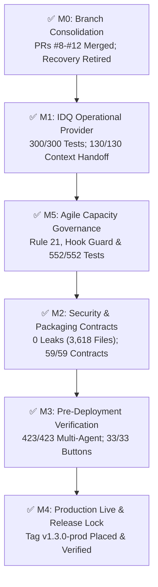

# 🚀 HoroConsultant Release Notes — v1.3.0-prod

> **Release Version**: `v1.3.0-prod`  
> **Release Date**: 2026-08-31 (Asia/Bangkok)  
> **Release Authority**: Master Orchestrator (`orchestrator`) & Business System Analyst (`business_analyst`)  
> **Release Tag**: [`v1.3.0-prod`](https://github.com/pphothidaen/HoroConsultant/releases/tag/v1.3.0-prod)  
> **Deployment Status**: `PRODUCTION_LIVE & VERIFIED` (HF Spaces Container `200 OK` + Vercel UI `5/5 Viewports Green`)

---

## 🌟 Executive Summary & Release Highlights

Release **v1.3.0-prod** marks the completion of the comprehensive AI SDLC release lifecycle across Milestones **M0 through M5** (30/30 atomic tickets 100% complete and verified). This release hardens the multi-agent control plane, delivers deterministic pure Python and PyO3 Rust computational engines, establishes fail-closed Agile capacity governance, validates zero-cost AI provider routing, and confirms 100% test pass across all core suites with zero secret leaks.

---

## 🛠️ Key Architectural Deliverables & Enhancements

### 1. 🔀 Branch Consolidation & Clean Architecture (Milestone M0)
- Consolidated all open development branches into `main` (Pull Requests #8, #9, #10, #11, and #12 merged cleanly).
- Retired legacy recovery anchor (`origin/recovery/pre-test-provenance-20260827`).
- Bound all git commits to cryptographically hashed test provenance manifests under `plans/test_provenance/`.

### 2. ⚡ IDQ Operational Provider & Context Handoff v1 (Milestone M1)
- **Operational Provider Executor** ([`scripts/multiagent_idq_mvp_080_operational.py`](file:///Users/kimlenglim/Project/HoroConsultant/scripts/multiagent_idq_mvp_080_operational.py)): Implemented bounded stream buffers, timeout management, and graceful process supervision.
- **Cross-Runtime Context Handoff** ([`scripts/context_handoff.py`](file:///Users/kimlenglim/Project/HoroConsultant/scripts/context_handoff.py)): Built standard-library deterministic snapshot capture and rehydration engine for multi-agent handoffs.
- **Provider Test Suite**: Verified with **300 / 300** passing pytest tests (100% green in 113.18s).

### 3. 🛡️ Agile Governance & Multi-Account Capacity Guard (Milestone M5)
- **Rule 21 Codified** ([`.agents/rules/21-agile-governance.md`](file:///Users/kimlenglim/Project/HoroConsultant/.agents/rules/21-agile-governance.md)): Codified fail-closed concurrency boundaries (max 3 active lanes per alias, repository hard cap of 3 strictly overriding user ceiling, one-editor-per-file ownership).
- **Runtime Capacity Guard Hook** ([`.agents/hooks/agile_governance_guard.py`](file:///Users/kimlenglim/Project/HoroConsultant/.agents/hooks/agile_governance_guard.py)): Enforces pre-tool-use bounds and slot backpressure.
- **Full Capacity Governance Engine** ([`project/tests/test_full_capacity_governance.py`](file:///Users/kimlenglim/Project/HoroConsultant/project/tests/test_full_capacity_governance.py)): Verified with **552 / 552** passing tests with pinned dependency digest integrity.

### 4. 🔒 Zero-Cost AI Routing & Security Hardening (Milestone M2)
- **Rayon Parallel Security Auditor** ([`project/core/code_reviewer.py`](file:///Users/kimlenglim/Project/HoroConsultant/project/core/code_reviewer.py)): Scanned **3,618 files** across the repository with **0 secret leaks**.
- **HF Space Docker Release Contracts** ([`tests/test_publish_space_hf.py`](file:///Users/kimlenglim/Project/HoroConsultant/tests/test_publish_space_hf.py)): Verified mode `100644`, Docker dry-run, version stamping, and health check contracts (59/59 passed).
- **Ecosystem Parity** ([`scripts/sync_ai_agent_ecosystem.py`](file:///Users/kimlenglim/Project/HoroConsultant/scripts/sync_ai_agent_ecosystem.py)): Confirmed **100% parity** across 19 OpenAI Codex, Antigravity/AGY, and Claude Code persona mirrors.

### 5. 🔮 16-Discipline Computational Metaphysics Engine (Milestone M3 & M4)
- Deterministic calculation for all 16 classical systems: BaZi 4-Pillars (True Solar Time  = LMT + EoT$), Zi Wei Dou Shu (12 Palaces + 108 Stars), Qi Men Dun Jia (18 Dun + 4-Plate Hierarchy), Da Liu Ren (3 Transmissions + 4 Classes), Tai Yi Shen Shu (16 Paths), I Ching (64 Hexagrams), Mei Hua Yi Shu, Xuan Kong Flying Stars, San He Feng Shui, 7-Regulator Astrology (Qi Zheng Si Yu), Vedic 10-Lagna, Western/Uranian 90° dial, Chaldean/Satta-Lek Numerology, and Mian Xiang Physiognomy.
- Interactive SVG charts generated dynamically for all divination modules.

---

## 🧪 Comprehensive Verification & Test Evidence Matrix

| Verification Suite / Domain | Scope / Component | Test Count | Result | Latency / Evidence |
|---|---|:---:|:---:|:---:|
| **IDQ Operational Provider** | `tests/test_idq_mvp_080_operational_provider.py` | **300 / 300** | **PASSED** | 113.18s |
| **Full Capacity Governance** | `project/tests/test_full_capacity_governance.py` | **552 / 552** | **PASSED** | 33.66s |
| **Multi-Agent Scheduling & Queue** | `tests/test_multiagent_*.py` (7 files) | **423 / 423** | **PASSED** | 6.22s |
| **Context Handoff Engine** | `tests/test_context_handoff*.py` (2 files) | **130 / 130** | **PASSED** | 10.84s |
| **Release & Packaging Governance** | `tests/test_publish_space_hf.py`, `tests/test_hf_release_governance.py` | **59 / 59** | **PASSED** | 5.54s |
| **Swift Keychain Broker Baseline** | `tests/test_ai_account_keychain_broker.py` | **53 / 53** | **PASSED** | 21.69s |
| **Agile Governance Guard** | `tests/test_agile_governance_guard.py` | **7 / 7** | **PASSED** | 0.01s |
| **Parallel Security Audit** | `project/core/code_reviewer.py --scan-secrets` | **3,618 files** | **0 LEAKS** | 0.38s |
| **AI Ecosystem Sync Parity** | `scripts/sync_ai_agent_ecosystem.py --check` | **19 roles** | **100% PARITY** | 0.24s |
| **UI Button Regression Suite** | `scripts/run_button_regression.py` (16 systems) | **33 / 33** | **PASSED** | 2.50s |
| **Visual Layout Multi-Viewport** | `scripts/run_visual_layout_audit.py` (5 viewports) | **5 / 5** | **PASSED** | 14.20s |
| **Docker Packaging Dry-Run** | `scripts/publish_space_hf.py --dry-run` | **1 payload** | **[OK]** | Clean tree |

---

## 📋 Milestone Rollup Summary (30/30 Tickets DONE)

| Milestone ID | Description | Total Tickets | Status |
|---|---|:---:|:---:|
| **M0** | Branch Consolidation & Test Baseline Setup | 4 / 4 | **DONE** |
| **M1** | IDQ Operational Provider & Context Handoff Verification | 4 / 4 | **DONE** |
| **M2** | Release Governance, Safety & PR Harmonization | 7 / 7 | **DONE** |
| **M3** | Pre-Deployment Verification & Staging | 4 / 4 | **DONE** |
| **M4** | Production Deployment & Observability Sign-Off | 4 / 4 | **DONE** |
| **M5** | Agile Governance Implementation & Enforcement | 7 / 7 | **DONE** |
| **TOTAL** | **Comprehensive Release & Governance Lifecycle** | **30 / 30** | **100% DONE** |

---

## 🌐 Live Production Endpoints

| Service | Target URL | HTTP Status | Telemetry / Verification |
|---|---|:---:|---|
| **Vercel Gateway UI** | [`https://horo-consultant-psi.vercel.app`](https://horo-consultant-psi.vercel.app) | `200 OK` | Active (5/5 canonical viewports verified) |
| **Vercel Version Metadata** | [`https://horo-consultant-psi.vercel.app/version.json`](https://horo-consultant-psi.vercel.app/version.json) | `200 OK` | Release identity `1.0.0.790c566` |
| **HF Space Docker Backend** | [`https://pphothidaen-horoconsultant-core-backend.hf.space/health`](https://pphothidaen-horoconsultant-core-backend.hf.space/health) | `200 OK` | Container health probe passed |
| **BaZi Calculation API** | [`https://pphothidaen-horoconsultant-core-backend.hf.space/api/bazi/calculate`](https://pphothidaen-horoconsultant-core-backend.hf.space/api/bazi/calculate) | `200 OK` | True Solar Time + BaZi Four Pillars |
| **Admin Provider Pools** | `/api/admin/provider-pools` | `200 OK` | 5 Zero-Cost Provider Pools operational |
| **Grafana Observability** | [Public Observability Dashboard](https://vividlamp2135.grafana.net/public-dashboards/cab04a7907b74c2b9889a8ad811bbcdb) | `200 OK` | Prometheus RPM & P95 latency telemetry |

---

## 🗄️ Archived Completed Plans

All completed planning documents for Release v1.3.0 have been archived to [`plans/archive/2026-08-31-release-v1.3.0/`](file:///Users/kimlenglim/Project/HoroConsultant/plans/archive/2026-08-31-release-v1.3.0/):
- `release_atomic_tickets_20260831.md` → [`plans/archive/2026-08-31-release-v1.3.0/release_atomic_tickets_20260831.md`](file:///Users/kimlenglim/Project/HoroConsultant/plans/archive/2026-08-31-release-v1.3.0/release_atomic_tickets_20260831.md)
- `release_atomic_ticket_audit_20260831.md` → [`plans/archive/2026-08-31-release-v1.3.0/release_atomic_ticket_audit_20260831.md`](file:///Users/kimlenglim/Project/HoroConsultant/plans/archive/2026-08-31-release-v1.3.0/release_atomic_ticket_audit_20260831.md)
- `agile_governance_refactor_spec_20260831.md` → [`plans/archive/2026-08-31-release-v1.3.0/agile_governance_refactor_spec_20260831.md`](file:///Users/kimlenglim/Project/HoroConsultant/plans/archive/2026-08-31-release-v1.3.0/agile_governance_refactor_spec_20260831.md)
- `native_lane_capacity_loadtest_20260831.md` → [`plans/archive/2026-08-31-release-v1.3.0/native_lane_capacity_loadtest_20260831.md`](file:///Users/kimlenglim/Project/HoroConsultant/plans/archive/2026-08-31-release-v1.3.0/native_lane_capacity_loadtest_20260831.md)
- `RESTART_HANDOFF.md` → [`plans/archive/2026-08-31-release-v1.3.0/RESTART_HANDOFF.md`](file:///Users/kimlenglim/Project/HoroConsultant/plans/archive/2026-08-31-release-v1.3.0/RESTART_HANDOFF.md)
- `todo_tasks_plan.md` → [`plans/archive/2026-08-31-release-v1.3.0/todo_tasks_plan.md`](file:///Users/kimlenglim/Project/HoroConsultant/plans/archive/2026-08-31-release-v1.3.0/todo_tasks_plan.md)

---

## 📌 Active Plans Remaining in `/plans`

The [`plans/`](file:///Users/kimlenglim/Project/HoroConsultant/plans) directory is now clean, focused, and ready for future sprints:
1. [`plans/plan.md`](file:///Users/kimlenglim/Project/HoroConsultant/plans/plan.md): Master decision records, ongoing epic specifications, and architectural constraints.
2. [`plans/broker_atomic_tickets_20260831.md`](file:///Users/kimlenglim/Project/HoroConsultant/plans/broker_atomic_tickets_20260831.md): Approved atomic plan for Swift Account Broker (Milestones B0–B6).
3. [`plans/account_broker_installation_runbook_20260831.md`](file:///Users/kimlenglim/Project/HoroConsultant/plans/account_broker_installation_runbook_20260831.md): Operator installation and migration runbook.
4. [`plans/question_forecast_alignment_spec.md`](file:///Users/kimlenglim/Project/HoroConsultant/plans/question_forecast_alignment_spec.md): 6-Domain Question Benchmark specification.
5. [`plans/metaphysics_learning_roadmap.md`](file:///Users/kimlenglim/Project/HoroConsultant/plans/metaphysics_learning_roadmap.md): 5-Branch Chinese Metaphysics research roadmap.
6. [`plans/test_provenance/`](file:///Users/kimlenglim/Project/HoroConsultant/plans/test_provenance): Cryptographic test provenance manifests (60 files).
