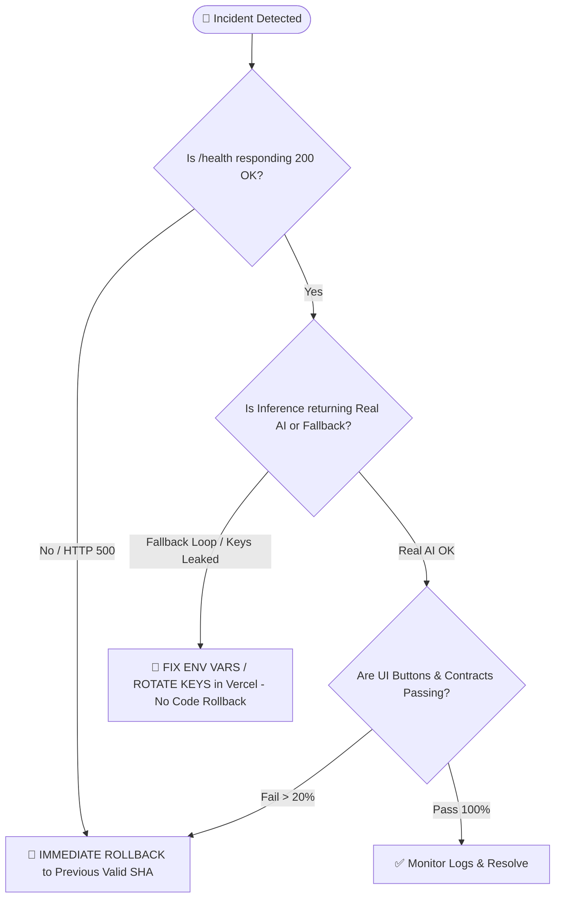

# 🛡️ HoroConsultant — Production Release Rollback & Incident Recovery Runbook
> **Version:** 1.0.0  
> **Target Platforms:** Vercel Edge Gateway, Hugging Face Spaces Core Engine, Fly.io, Azure  
> **Owner:** DevOps & Release Agent (`devops`) / Master Orchestrator (`orchestrator`)

---

## 📌 1. Incident Severity Classification

| Severity Level | Definition | Impact Criteria | SLA / Response Target |
| :--- | :--- | :--- | :--- |
| **P1 — CRITICAL** | Full Outage / Broken Gateway | `GET /health` fails (!= 200), CORS broken, or 100% requests dropping to `HTTP 500`/`HTTP 502` | **Immediate (< 5 mins)** |
| **P2 — MAJOR** | Inference Fallback & High Latency | `POST /api/v1/bazi/interpret` continuously falling back to `fallback_template` or latency > 10,000ms | **< 15 mins** |
| **P3 — MINOR** | Edge Feature / Cosmetic Glitch | Single discipline calculation error with other 14 disciplines functional | **< 2 hours** |

---

## ⚖️ 2. Rollback vs. No-Rollback Decision Matrix



### ✅ When to ROLLBACK (Immediate Action):
1. **Critical Gateway Crash**: Vercel returns `FUNCTION_INVOCATION_FAILED` (HTTP 500) or missing CORS headers.
2. **Regression Failure**: `python3 scripts/run_vercel_prod_curl_regression.py` fails 2 consecutive runs (< 3/3).
3. **Severe Regression in Core Math**: Pytest tests fail in production build.

### ⚠️ When NOT to Rollback (Fix Forward):
1. **Expired or Blocked API Key (HTTP 403 / 429)**: Do not roll back code; update the API keys in Vercel Dashboard or Doppler.
2. **Transient Network Hiccup**: Retry with `--retries 2` before deciding to revert.

---

## 🕹️ 3. Step-by-Step Rollback Playbooks

### 🅰️ Playbook A: Vercel Edge Gateway Rollback (Fastest: < 30 seconds)

1. **List Recent Deployments & Find Stable Commit SHA:**
   ```bash
   npx vercel ls --scope pphothidaen
   ```
2. **Execute Instant Rollback to Prior Verified Deployment:**
   ```bash
   npx vercel rollback <DEPLOYMENT_ID_OR_URL> --yes
   ```
3. **Verify Restored Endpoint Health:**
   ```bash
   python3 scripts/run_vercel_prod_curl_regression.py --url https://horo-consultant-psi.vercel.app --use-python
   ```

---

### 🅱️ Playbook B: Git Revert & Auto-Deploy (Standard: < 2 mins)

1. **Revert Recent Commit on `main` branch:**
   ```bash
   git log -n 5 --oneline
   git revert <BAD_COMMIT_SHA> -m 1 --no-edit
   git push origin main
   ```
2. **Monitor GitHub Actions CI/CD Pipeline:**
   ```bash
   python3 scripts/sync_sdlc_agents.py --check --use-python
   python3 scripts/sync_codex_agents.py --check
   ```

---

### 🅲 Playbook C: Hugging Face Spaces Rollback

1. **Republish Stable Payload to Hugging Face Spaces:**
   ```bash
   python3 scripts/publish_space_hf.py
   ```
2. **Verify Live Space URL:**
   - URL: `https://huggingface.co/spaces/pphothidaen/horoconsultant-core-backend`
   - Static Web Demo: `https://pphothidaen-horoconsultant-core-backend.static.hf.space/index.html`

---

## 👥 4. Ownership & Escalation Matrix

| Role | Agent / Identifier | Primary Responsibility |
| :--- | :--- | :--- |
| **Incident Commander** | `orchestrator` | Overall incident triaging, decision approval, post-mortem sign-off |
| **Infra & DevOps Lead** | `devops` | Vercel / HF Spaces rollback execution, Docker deployment health |
| **Inference & Backend Lead**| `developer` | LLM router debugging, key rotation, error boundary isolation |
| **QA Verification Guard** | `qa_tester` | Running curl regression suite, button contract verification |
| **Documentation Watchdog** | `business_analyst`| Incident log audit, updating PROJECT_TASKS.md and plan.md |

---

## 🔍 5. Verification & Post-Recovery Health Checklist

Following any recovery or rollback action, execute the complete verification chain:

```bash
# 1. Production Gateway Health & Inference Header Audit
python3 scripts/run_vercel_prod_curl_regression.py --url https://horo-consultant-psi.vercel.app --use-python

# 2. UI Button & Contract Regression Suite
python3 scripts/run_button_regression.py

# 3. Security & Pre-Deployment Audit
python3 project/core/code_reviewer.py --review

# 4. Agent & Codex Synchronization Parity Check
python3 scripts/sync_sdlc_agents.py --check --use-python
python3 scripts/sync_codex_agents.py --check
```
