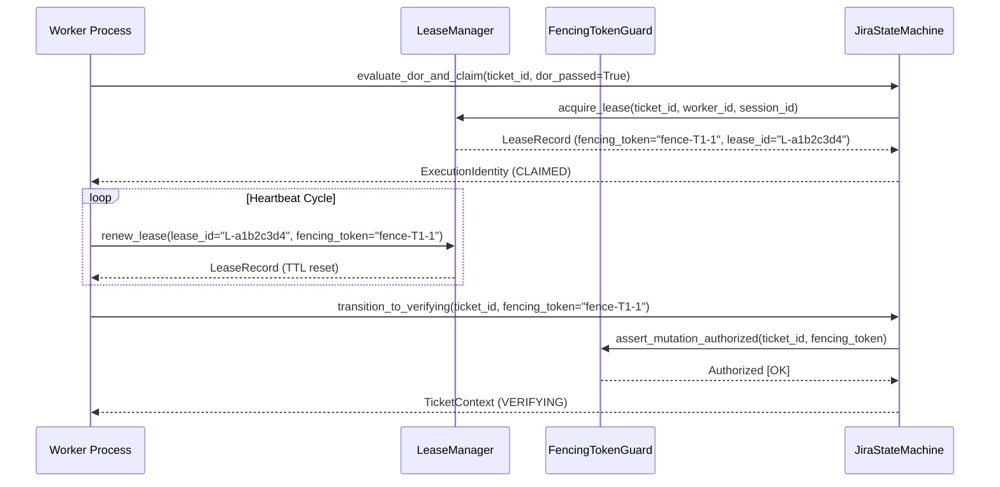

# Autonomous Worker Platform Architecture

Status: APPROVED & VERIFIED (Sprint K Deliverable). 57/57 Test Suites PASS.

## Executive Overview

The Autonomous Worker Platform is an event-driven, decoupled worker execution infrastructure designed for autonomous agent task execution linked directly to Jira ticket workflows. It provides thread-safe, distributed lease locking, monotonic fencing token state guards, risk-tiered policy gates, decoupled terminal session execution engines (`herdr` and `tmux`), and fail-closed cryptographic evidence validation.

The system ensures strict multi-worker safety, preventing split-brain execution, duplicate task execution, or state corruption from partitioned or delayed worker processes.

---

## System Invariants & Guarantees

The architecture enforces five core system invariants:

| Invariant | System Guarantee | Owning Component |
| :--- | :--- | :--- |
| **`INVARIANT-01`** | **Single Active Execution Lease**: Exactly one active worker process may hold execution rights for a given Jira ticket at any point in time. | `LeaseManager` |
| **`INVARIANT-02`** | **Monotonic Fencing Token Guard**: State mutations are strictly rejected unless authorized by the active lease's current monotonic fencing token. | `FencingTokenGuard` |
| **`INVARIANT-03`** | **Risk-Tiered Execution Gate**: HIGH and PROD risk tickets require verified approvals, test evidence, or Human-in-the-Loop (HITL) gate clearance before execution. | `RiskTierGate` |
| **`INVARIANT-04`** | **Decoupled Runtime Isolation**: Core business state machines and Jira workflows have zero knowledge of process execution mechanics (`herdr`, `tmux`, or CLI primitives). | `RuntimeBackend` abstraction |
| **`INVARIANT-05`** | **Evidence Validation & Traceability**: Transition to terminal `DONE` state requires schema-validated, tamper-evident evidence output signed with execution identity context. | `EvidenceValidator` |

---

## Architectural Workflow & Data Flow

```mermaid
flowchart TD
    Webhook["Jira Webhook / Event"] --> Dedup["WebhookDedup\n(SHA-256 Idempotency Check)"]
    Dedup -->|Valid Event| StateMachine["JiraStateMachine\n(TODO -> DOR_CHECK)"]
    StateMachine --> RiskGate["RiskTierGate\n(LOW / MEDIUM / HIGH / PROD)"]
    
    RiskGate -->|Approved & DoR Passed| LeaseMgr["LeaseManager\n(Acquire Lease + Fencing Token)"]
    RiskGate -->|Denied / Untrusted| BlockedState["State: BLOCKED"]
    
    LeaseMgr -->|Execution Identity| RuntimeSelector["RuntimeSelector\n(Host Capability Audit)"]
    
    RuntimeSelector -->|Primary (macOS)| Herdr["HerdrRuntimeBackend\n(Native Session Engine)"]
    RuntimeSelector -->|Fallback| Tmux["TmuxRuntimeBackend\n(Tmux Pane Isolator)"]
    
    Herdr & Tmux --> WorkerExec["Worker Execution\n(Bounded Output Buffer)"]
    
    WorkerExec --> FencingGuard["FencingTokenGuard\n(Assert Token Monotonicity)"]
    FencingGuard --> StateVerifying["State: VERIFYING"]
    
    StateVerifying --> Validator["EvidenceValidator\n(Payload & Result Assertions)"]
    
    Validator -->|PASS| DoneState["State: DONE\n(Lease Released)"]
    Validator -->|FAIL| BlockedState
```

---

## Core Components & Component Specifications

### 1. Renewable Lease Manager (`project/core/lease_manager.py`)
`LeaseManager` handles atomic lease acquisition, heartbeat renewal, and lease expiration to satisfy `INVARIANT-01`.

- **Atomic Acquisition**: `acquire_lease(ticket_id, worker_id, session_id, ttl_seconds)` returns a `LeaseRecord` containing `lease_id`, `execution_id`, `fencing_token`, and `expires_at`. Rejects acquisition if an active lease already exists.
- **Monotonic Fencing Counter**: Each acquisition increments a ticket-specific monotonic counter `next_fence` (e.g., `fence-KAN-101-1`, `fence-KAN-101-2`), ensuring token ordering across retries.
- **Heartbeat Renewal**: `renew_lease(lease_id, fencing_token, ttl_seconds)` extends `expires_at` for active leases. Requires matching active `fencing_token`.
- **Lease States**: `ACTIVE`, `EXPIRED`, `RELEASED`, `FENCED`.



### 2. Monotonic Fencing Token Guard (`project/core/fencing_token_guard.py`)
`FencingTokenGuard` validates state mutations to prevent zombie or network-partitioned worker processes from modifying state after lease expiry or revocation (`INVARIANT-02`).

- **Validation Contract**: `assert_mutation_authorized(ticket_id, fencing_token, mutation_name)`:
  1. Checks if a lease exists for `ticket_id`.
  2. Asserts lease `state == ACTIVE`.
  3. Asserts current timestamp `< expires_at`.
  4. Asserts active lease `fencing_token == attempted fencing_token`.
- Raises `StaleFencingTokenError` on any mismatch or expiration.

### 3. Jira Event-Driven State Machine (`project/core/jira_state_machine.py`)
Implements the canonical ticket execution lifecycle:

$$\text{TODO} \longrightarrow \text{DOR\_CHECK} \longrightarrow \text{CLAIMED} \longrightarrow \text{IN\_PROGRESS} \longrightarrow \text{VERIFYING} \longrightarrow \text{DONE / BLOCKED}$$

- **`DOR_CHECK` Gate**: Evaluates Definition of Ready. If passed, claims lease and advances state to `CLAIMED`. If failed, transitions directly to `BLOCKED`.
- **`IN_PROGRESS` Boundary**: Advanced when process spawn is initiated with valid fencing token authorization.
- **`VERIFYING` Boundary**: Advanced upon worker task completion with valid fencing token authorization.
- **`DONE` Finalization**: Triggers `EvidenceValidator`. On validation success, releases lease and sets state to `DONE`. On validation failure, transitions state to `BLOCKED` with detailed error payload.

### 4. Risk Tier Gate (`project/core/risk_tier_gate.py`)
Classifies ticket risk based on impact labels, touched components, and deployment scope to enforce policy boundaries (`INVARIANT-03`):

- **Risk Levels**:
  - `LOW`: Standard reversible logic, tests, or documentation.
  - `MEDIUM`: Standard API router or core module changes.
  - `HIGH`: Security, authentication, database schemas, or payment integrations (Requires test evidence + mandatory code review).
  - `PROD`: Production deployment, release tags, infrastructure changes (Requires explicit HITL clearance).

### 5. Decoupled Worker Runtime Engine (`project/core/worker_runtime.py`)
Abstract interface defining the worker process execution boundary (`INVARIANT-04`).

```python
class RuntimeBackend(ABC):
    @property
    def name(self) -> str: ...
    def detect(self) -> bool: ...
    def health(self) -> RuntimeHealth: ...
    def spawn(self, request: SpawnRequest) -> ProcessStatus: ...
    def attach(self, identity: ExecutionIdentity) -> ProcessStatus: ...
    def send(self, identity: ExecutionIdentity, input_data: str) -> None: ...
    def read(self, identity: ExecutionIdentity, lines: int = 30) -> str: ...
    def status(self, identity: ExecutionIdentity) -> ProcessStatus: ...
    def terminate(self, identity: ExecutionIdentity, grace_seconds: float = 2.0) -> bool: ...
```

- **`HerdrRuntimeBackend` (`project/core/runtime_herdr.py`)**: Primary process engine on macOS. Interacts with `herdr` CLI tool, supporting daemonized execution, output ring buffers, and process group isolation.
- **`TmuxRuntimeBackend` (`project/core/runtime_tmux.py`)**: Secondary fallback engine using isolated `tmux` windows/panes with bounded capture buffers.
- **`RuntimeSelector` (`project/core/runtime_selector.py`)**: Evaluates host capabilities and selects the preferred available backend (`herdr` -> `tmux` -> raise error).

### 6. Reconciler Daemon (`project/core/reconciler.py`)
Background reconciliation process designed to heal stalled or orphaned executions:
- Detects expired leases without active heartbeats and marks them as `EXPIRED` or `FENCED`.
- Checks process liveness against runtime backend PIDs; marks dead worker executions as `BLOCKED`.
- Reclaims stranded ticket contexts to prevent persistent deadlock.

### 7. Webhook Deduplication Engine (`project/core/webhook_dedup.py`)
Provides idempotent event intake for incoming webhooks:
- Computes SHA-256 signatures over event payloads (`event_id`, `issue_key`, `timestamp`, `changelog`).
- Retains a sliding TTL cache to drop duplicated delivery attempts within configurable time windows.

### 8. Evidence Validator & Identity Schema (`project/core/evidence_validator.py`, `execution_identity.py`)
Enforces `INVARIANT-05` before marking tasks `DONE`:
- **`ExecutionIdentity`**: Immutable composite tuple binding (`execution_id`, `ticket_id`, `attempt`, `lease_id`, `fencing_token`, `session_id`, `worker_id`).
- **`EvidenceValidator`**: Verifies evidence schema structure, test exit codes, git commit SHAs, and non-empty stdout/stderr summary telemetry.

---

## Test Verification Matrix

The platform is backed by 14 comprehensive unit, integration, and end-to-end matrix test suites (57/57 tests passing):

| Test Suite File | Tested Component / Feature | Test Count | Status |
| :--- | :--- | :---: | :---: |
| `tests/test_lease_manager.py` | Atomic Lease Acquisition & Heartbeat Renewal | 4 | PASS |
| `tests/test_fencing_token_guard.py` | Monotonic Token Guard & Stale Token Prevention | 2 | PASS |
| `tests/test_jira_state_machine.py` | Full Ticket Lifecycle State Machine (TODO -> DONE) | 3 | PASS |
| `tests/test_risk_tier_gate.py` | Risk Level Classification & HITL Gate Assertion | 4 | PASS |
| `tests/test_runtime_selector.py` | Runtime Auto-Detection & Fallback Logic | 5 | PASS |
| `tests/test_runtime_herdr.py` | Herdr Backend Process Management | 5 | PASS |
| `tests/test_runtime_tmux.py` | Tmux Backend Process Management & Pane Capture | 5 | PASS |
| `tests/test_reconciler.py` | Reconciler Expired Lease & Zombie Task Cleanup | 3 | PASS |
| `tests/test_webhook_dedup.py` | Idempotent Webhook Signature Deduplication | 3 | PASS |
| `tests/test_execution_identity.py` | Execution Identity Binding & Serialization | 5 | PASS |
| `tests/test_evidence_schema.py` | Evidence Schema Payload Validation | 6 | PASS |
| `tests/test_worker_evidence_validator.py` | Evidence Validator Rule Assertions | 6 | PASS |
| `tests/test_jira_sanitizer.py` | Jira Payload Sanitization & Injection Defense | 3 | PASS |
| `tests/test_autonomous_e2e_matrix.py` | Full Autonomous Worker Platform E2E Integration | 3 | PASS |
| **Total** | **Sprint K Autonomous Worker Platform** | **57** | **100% PASS** |

---

## File Structure Reference

```
project/core/
├── worker_runtime.py          # Abstract RuntimeBackend interface & data classes
├── lease_manager.py           # In-memory LeaseManager with TTL & monotonic fencing
├── fencing_token_guard.py     # FencingTokenGuard state mutation authorization
├── jira_state_machine.py      # JiraStateMachine canonical ticket workflow
├── risk_tier_gate.py          # RiskTierGate policy enforcement
├── runtime_selector.py        # RuntimeSelector backend auto-detection
├── runtime_herdr.py           # Herdr process management implementation
├── runtime_tmux.py            # Tmux session management implementation
├── reconciler.py              # Reconciler background cleanup daemon
├── webhook_dedup.py           # Webhook signature deduplication engine
├── evidence_validator.py      # Evidence payload & result validator
├── evidence_models.py         # Structured evidence Pydantic models
├── execution_identity.py      # Immutable ExecutionIdentity tuple & errors
└── jira_sanitizer.py          # Jira text sanitization & safe parsing
```

---

## Operational Runbook & Usage Example

```python
from project.core.lease_manager import LeaseManager
from project.core.jira_state_machine import JiraStateMachine
from project.core.runtime_selector import RuntimeSelector
from project.core.worker_runtime import SpawnRequest

# 1. Initialize core system components
lease_manager = LeaseManager(default_ttl_seconds=900.0)
state_machine = JiraStateMachine(lease_manager=lease_manager)
runtime_selector = RuntimeSelector()

# 2. Select best execution backend (Herdr or Tmux)
backend = runtime_selector.get_backend()
health = backend.health()

# 3. Evaluate DoR and acquire lease
ticket_id = "KAN-101"
context = state_machine.transition_to_dor_check(ticket_id)
claimed_context = state_machine.evaluate_dor_and_claim(
    ticket_id=ticket_id,
    dor_passed=True,
    worker_id="worker-01",
    session_id="session-xyz",
)

# 4. Spawn process bound to execution identity
identity = claimed_context.identity
state_machine.transition_to_in_progress(ticket_id, identity.fencing_token)

spawn_req = SpawnRequest(
    identity=identity,
    command=["pytest", "tests/test_bazi.py"],
    cwd="/Users/kimlenglim/Project/HoroConsultant",
)
process_status = backend.spawn(spawn_req)

# 5. Transition to verifying and finalize with evidence payload
state_machine.transition_to_verifying(ticket_id, identity.fencing_token)
evidence_payload = {
    "execution_identity": identity.to_dict(),
    "test_summary": {"total": 10, "passed": 10, "failed": 0},
    "exit_code": 0,
    "git_commit": "a1b2c3d4e5f6",
}
final_context, validation = state_machine.finalize_verification(
    ticket_id=ticket_id,
    fencing_token=identity.fencing_token,
    evidence_payload=evidence_payload,
)

assert final_context.current_state.value == "DONE"
```
