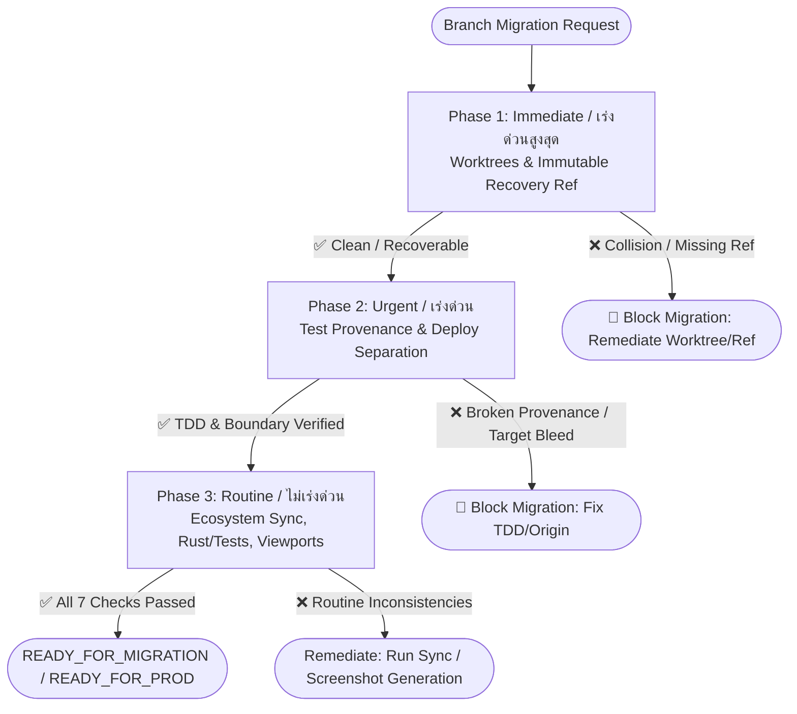

# Branch Migration Action Priority Runbook

> **Project:** HoroConsultant  
> **Tooling:** `scripts/branch_migration_action_priority_guard.py`  
> **Owners:** `orchestrator` (decision), `devops` (release/migration), `qa_tester` (verification), `code_reviewer` (audit)  
> **Schema:** `branch-migration-action-priority-report-v1`

---

## 1. Executive Summary & Philosophy

During complex branch migrations, multi-agent refactoring, and release candidates across HoroConsultant, changes must be audited according to **Action Priority Tiering** (3 Phases) to prevent:
1. Worktree state corruption and lost uncommitted work across parallel subagent workspaces.
2. Loss of provenance or recovery points (`recovery/pre-test-provenance-20260827`).
3. Accidental deployment bleed or contamination between Vercel static gateway and HF Docker backend.
4. Silent desynchronization of AI agent prompts, skills, and model routing policies.

The `branch_migration_action_priority_guard.py` CLI provides fail-closed verification across these three operational phases.

---

## 2. Action Priority Phases & Risk Matrix

| Phase | Thai Classification | Urgency | Risk Level | Primary Focus | Checks Included |
| :--- | :--- | :--- | :--- | :--- | :--- |
| **Phase 1** | **เร่งด่วนสูงสุด (Immediate)** | **P0** | **CRITICAL** | Workspace Isolation & Recovery Ref | `check_worktrees`, `check_immutable_recovery_refs` |
| **Phase 2** | **เร่งด่วน (Urgent)** | **P1** | **HIGH** | TDD Provenance & Deployment Boundary | `check_test_provenance`, `check_production_deployment_guards` |
| **Phase 3** | **ไม่เร่งด่วน (Routine)** | **P2** | **MEDIUM** | Ecosystem Parity & Visual Assurance | `check_ai_ecosystem_sync`, `check_rust_wheel_and_tests`, `check_viewport_artifacts` |

---

## 3. Detailed Phase Specifications



### 3.1 Phase 1: Immediate / เร่งด่วนสูงสุด (P0 — Critical)

#### 1. `check_worktrees`
- **Objective:** Inspect all active worktrees (`git worktree list --porcelain`), classify temporary vs main worktrees, check for uncommitted changes (`dirty`), and detect branch collisions.
- **Fail Condition:**
  - Multiple worktrees active on the same branch reference (Branch Collision).
  - Uncommitted changes in worktrees when running in `--strict` mode.
- **Audit Mode Behavior:** Emits `[WARNING]` and reports dirty worktree paths and modified file counts.

#### 2. `check_immutable_recovery_refs`
- **Objective:** Optional verification of target immutable recovery references when specified via `--target-ref` or configuration.
- **Historical Context:** Originally tracked `recovery/pre-test-provenance-20260827` (`chore(recovery): preserve pre-gate mixed worktree [NON_TDD_RECONSTRUCTED]`).
- **Retirement & Deletion Status:** Formally retired in `TICKET-RETIRE-RECOVERY-ANCHOR-001` via PR #9. The CI workflow dependencies and contract requirements were removed, and the remote branch `recovery/pre-test-provenance-20260827` was deleted from origin. When no recovery target is configured, this check defaults to `NONE (Retired)` and returns `PASSED`.
- **Fail Condition:**
  - Specified target recovery ref cannot be resolved in local or remote git refs.
  - Commit message for specified target does not match expected text.

---

### 3.2 Phase 2: Urgent / เร่งด่วน (P1 — High)

#### 1. `check_test_provenance`
- **Objective:** Verify TDD baseline provenance across `plans/test_provenance/*.json` and ensure `scripts/test_provenance_guard.py` is present and functional.
- **Fail Condition:**
  - Missing `plans/test_provenance/` directory or zero manifest files.
  - Corrupt or schema-violating JSON manifests (missing `ticket_id` or `baseline_parent`).

#### 2. `check_production_deployment_guards`
- **Objective:** Enforce complete separation between the frontend static gateway on Vercel and the core backend on Hugging Face Spaces.
- **Verification Points:**
  - `api/index.js`: `CANONICAL_HF_BACKEND_ORIGIN` must equal `"https://pphothidaen-horoconsultant-core-backend.hf.space"`.
  - `scripts/publish_space_hf.py`: `CANONICAL_SPACE_ID` must equal `"pphothidaen/horoconsultant-core-backend"` and `CANONICAL_SDK` must equal `"docker"`.
  - Containerization files: `Dockerfile` or `Dockerfile.hf` present.
  - Release manifest schema: `project/schemas/release-manifest-v1.schema.json` present.
- **Fail Condition:** Any deviation or unvetted backend origin in gateway or publisher configurations.

---

### 3.3 Phase 3: Routine / ไม่เร่งด่วน (P2 — Routine)

#### 1. `check_ai_ecosystem_sync`
- **Objective:** Ensure all 5 AI agent platform definitions (Claude Code, OpenAI Codex, AGY/Gemini, Hermes, thClaws) and skills are synchronized.
- **Command:** `python3 scripts/sync_ai_agent_ecosystem.py --check`.
- **Fail Condition:** Exit code != 0 from sync check script.

#### 2. `check_rust_wheel_and_tests`
- **Objective:** Verify Rust core acceleration readiness and explicit development fallback configuration (`HORO_ALLOW_PYTHON_FALLBACK=1` or `fast_math.py`), along with test discovery across `tests/` and `project/tests/`.
- **Fail Condition:** Missing core math engine or zero discoverable test files.

#### 3. `check_viewport_artifacts`
- **Objective:** Verify visual layout assurance across all 5 canonical viewports:
  1. `mobile_375x667` (Mobile Compact / iPhone SE)
  2. `tablet_768x1024` (Tablet Portrait / iPad)
  3. `laptop_1280x800` (Laptop Standard / 16:10)
  4. `desktop_1440x900` (Desktop Standard / MacBook Pro)
  5. `desktop_1920x1080` (Desktop FHD / 1080p Widescreen)
- **Artifacts:**
  - `project/tests/multi_viewport_visual_audit_receipt.json`
  - `project/tests/screenshots/canonical_viewports/*.png`
- **Fail Condition:** Missing audit receipt or missing screenshots for any of the 5 viewports.

---

## 4. Standard Operating Procedure (SOP)

### Step 1: Pre-Migration Health Audit
Run an audit across all phases without modifying repository state:
```bash
python3 scripts/branch_migration_action_priority_guard.py --check
```

### Step 2: Phase-Specific Verification
To isolate and verify individual priority tiers:
```bash
# Phase 1: Immediate / เร่งด่วนสูงสุด
python3 scripts/branch_migration_action_priority_guard.py --phase immediate

# Phase 2: Urgent / เร่งด่วน
python3 scripts/branch_migration_action_priority_guard.py --phase urgent

# Phase 3: Routine / ไม่เร่งด่วน
python3 scripts/branch_migration_action_priority_guard.py --phase routine
```

### Step 3: Strict Gating for CI / Pre-Merge
Run fail-closed gate with structured JSON artifact generation:
```bash
python3 scripts/branch_migration_action_priority_guard.py --strict --json-output project/tests/artifacts/action_priority_receipt.json
```

---

## 5. Remediation Runbook

### Case A: Dirty or Colliding Worktrees Detected (`WORKTREE_BRANCH_COLLISION` / `DIRTY_WORKTREES_DETECTED`)
1. List all active worktrees:
   ```bash
   git worktree list
   ```
2. Navigate to dirty worktrees and either commit changes or stash them:
   ```bash
   cd <worktree-path>
   git status
   git stash -u
   ```
3. Prune stale or unneeded temporary worktrees:
   ```bash
   git worktree prune
   git worktree remove /path/to/stale-worktree --force
   ```

### Case B: Missing Immutable Recovery Ref (`MISSING_IMMUTABLE_RECOVERY_REF`)
*Note: Recovery branch `recovery/pre-test-provenance-20260827` has been formally retired and deleted.*
If a specific recovery reference is required for a new historical migration:
1. Fetch latest recovery references from origin or specified remote tag:
   ```bash
   git fetch origin <target-recovery-ref>:<target-recovery-ref>
   ```
2. Verify commit SHA and message:
   ```bash
   git log -1 <target-recovery-ref>
   ```

### Case C: AI Agent Ecosystem Desynchronized (`AI_ECOSYSTEM_SYNC_FAILED`)
1. Re-synchronize agent configurations and Codex/Claude parity:
   ```bash
   python3 scripts/sync_ai_agent_ecosystem.py --sync
   ```
2. Run validation check:
   ```bash
   python3 scripts/sync_ai_agent_ecosystem.py --check
   ```

### Case D: Missing Canonical Viewport Artifacts (`MISSING_VIEWPORT_SCREENSHOTS`)
1. Re-run multi-viewport screenshot auditor:
   ```bash
   python3 scripts/audit_canonical_5_viewports.py
   ```
2. Check that all 30 PNG assets exist in `project/tests/screenshots/canonical_viewports/`.

---

## 6. Incident Escalation Matrix (HITL)

| Failure Category | Primary Owner | Escalation Trigger | Resolution Path |
| :--- | :--- | :--- | :--- |
| Worktree Collision / State Loss | `devops` | Multiple agents conflicting on branch | Discard temporary worktrees or rebase feature branch |
| Recovery Ref Tampering | `code_reviewer` | Missing or modified recovery ref | Restore branch from immutable remote tag/ref |
| Deployment Origin Contamination | `devops` | Unvetted URL in `api/index.js` | Revert origin to `CANONICAL_HF_ORIGIN` |
| Test Provenance Violation | `qa_tester` | Missing manifest or broken DAG | Reconstruct manifest in `plans/test_provenance/` |
| Ecosystem Parity Disruption | `business_analyst` | Modified agent prompt without sync | Run `sync_ai_agent_ecosystem.py --sync` and commit |

---

## 7. Verification Checklist Before Sign-off

- [x] Phase 1: `check_worktrees` inspected active worktrees; zero collisions found.
- [x] Phase 1: `check_immutable_recovery_refs` verified (formally retired & deleted via PR #9).
- [x] Phase 2: `check_test_provenance` verified manifests and guard script.
- [x] Phase 2: `check_production_deployment_guards` verified HF Docker space & Vercel gateway separation.
- [x] Phase 3: `check_ai_ecosystem_sync` validated 100% sync across Claude/Codex/AGY platforms.
- [x] Phase 3: `check_rust_wheel_and_tests` verified test discovery and Python fallback readiness.
- [x] Phase 3: `check_viewport_artifacts` verified 5 canonical viewports (30 screenshots, audit receipt).
- [x] Pytest suite `tests/test_branch_migration_action_priority_guard.py` passing (20/20 tests).
