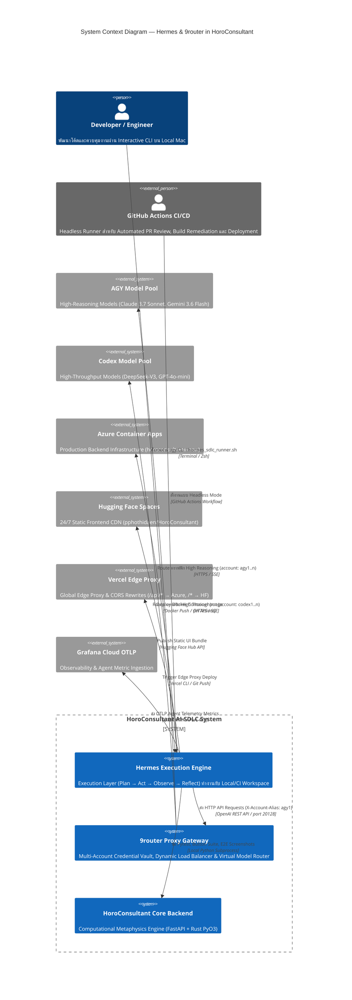

# C4 Model Architecture Document — Hermes & 9router Integration
> **Project:** HoroConsultant  
> **Version:** 1.0.0 | **Last Updated:** 2026-08-14  
> **Target Framework:** Hybrid Cloud-First Architecture (Local Mac + GitHub Actions + Azure Container Apps + HF Spaces + Vercel)

---

## 🗺️ 1. Level 1: System Context Diagram (ระดับบริบทระบบ)

ระดับสูงสุดแสดงให้เห็นขอบเขตของระบบ (System Boundary), ผู้ใช้งาน (Actors), และระบบภายนอก (External Systems) ที่เกี่ยวข้องกับ **Hermes Agent** และ **9router Proxy Gateway**



---

## 📦 2. Level 2: Container Diagram (ระดับคอนเทนเนอร์และบริการ)

แสดงความสัมพันธ์ระหว่าง Containers / Services หลักภายในระบบ

```mermaid
C4Container
    title Container Diagram — Component Services & Communication Boundaries

    Container_Boundary(c1, "Developer / CI Client Environment") {
        Container(hermes_cli, "Hermes Agent CLI", "Python / agy CLI", "ตัวขับเคลื่อน Plan→Act→Observe→Reflect loop อ่าน/เขียนไฟล์ใน Workspace")
        Container(sdlc_runner, "Hermes SDLC Runner", "Bash (hermes_sdlc_runner.sh)", "Dispatcher จัดการ phase: dev, qa, deploy, sync")
        Container(parity_engine, "Gemini-Sonnet Parity Engine", "Python (hermes_model_parity.py)", "ยกระดับ Gemini 3.6 Flash (medium) ให้มีคุณภาพระดับ Claude Sonnet 4.6 (high)")
        Container(telemetry, "Hermes Telemetry Exporter", "Python (hermes_telemetry.py)", "เก็บรวบรวม OTLP metrics (token, latency, account_alias)")
    }

    Container_Boundary(c2, "Routing & Gateway Infrastructure") {
        Container(nine_router_proxy, "9router Local Proxy", "Go / Node.js Proxy (Port 20128)", "จัดการ Multi-Account Vault (agy1, agy2, codex1) และสลับ Account เมื่อติด 429")
        Container(codex_proxy, "CODEX_PRO Fallback Gateway", "HTTPS Proxy Endpoint", "Fallback Priority 3 เมื่อ 9router ปิดอยู่")
    }

    Container_Boundary(c3, "Production Cloud Infrastructure") {
        Container(azure_app, "Azure Container App", "Docker Container (pansakorn/horoconsult:latest)", "Python 3.11 + FastAPI + Rust PyO3 Core (< 1ms calculation engine)")
        Container(hf_static, "HF Spaces Static CDN", "Static HTML5 / JS Bundle", "โฮสต์หน้าเว็บ index.html, admin.html, hitl.html แบบ 24/7 Zero CPU Quota")
        Container(vercel_proxy, "Vercel Edge Gateway", "Node.js Serverless Rewrites", "ทำ SSL Termination และ Forward /api/* → Azure, /* → HF Spaces")
    }

    Rel(hermes_cli, sdlc_runner, "เรียกใช้งาน Phase Tasks", "Subprocess")
    Rel(hermes_cli, parity_engine, "ใชัยกระดับคุณภาพเมื่อรันบน Gemini", "Internal Module")
    Rel(parity_engine, nine_router_proxy, "ส่ง API Request + Header X-Account-Alias: agy1", "HTTP / Port 20128")
    Rel(nine_router_proxy, codex_proxy, "Fallback กรณี 9router 5xx/down", "HTTP / Fallback Chain")
    Rel(sdlc_runner, azure_app, "Deploy backend ผ่าน Docker Build & Push", "azure_deploy.yml")
    Rel(sdlc_runner, hf_static, "Publish static frontend", "publish_space_hf.py")
    Rel(sdlc_runner, vercel_proxy, "Deploy edge proxy rules", "vercel.json")
    Rel(telemetry, grafana, "ส่ง metrics hermes.loop.tokens, account_alias", "OTLP HTTP")
```

---

## 🧩 3. Level 3: Component Diagram (ระดับองค์ประกอบภายใน)

รายละเอียดองค์ประกอบภายในของ **Hermes Execution Engine** และ **Gemini-Sonnet Parity Engine**

```mermaid
C4Component
    title Component Diagram — Internal Structure of Hermes & Parity Engine

    Container_Boundary(hermes_boundary, "Hermes Execution Core") {
        Component(agentic_loop, "Plan-Act-Observe-Reflect Loop", "Core Engine", "วนลูปปรับแต่งโค้ดได้สูงสุด 3 รอบต่อ Task ก่อนส่งต่อ Orchestrator")
        Component(routing_resolver, "Routing Priority Resolver", "resolve_router()", "ถอดรหัส Priority 1: ROUTER_BASE_URL → Priority 2: 9router → Priority 3: CODEX_PRO → Priority 4: Gemini Direct")
        Component(account_vault, "Account Alias Selector", "NINE_ROUTER_ACCOUNT_ALIAS", "ส่งผ่าน X-Account-Alias: agy1 เพื่อระบุ Account Pool ใน 9router")
    }

    Container_Boundary(parity_boundary, "Gemini-Sonnet Parity Engine (hermes_model_parity.py)") {
        Component(thinking_scaffold, "Explicit Thinking Scaffold", "Mechanism 1", "บังคับสร้าง <thinking> block: UNDERSTAND → DECOMPOSE → RISK-CHECK → PLAN")
        Component(self_critique, "Self-Critique Loop", "Mechanism 2", "ตรวจสอบผลลัพธ์ตัวเอง 1-2 รอบ (หยุดทันทีเมื่อพบ LGTM ช่วยประหยัด Token)")
        Component(context_optimizer, "Context Window Optimizer", "Mechanism 3", "ควบคุม Sliding Window 900K char ไม่ให้ Context หลุดหลอน")
        Component(temp_calibrator, "Temperature Calibrator", "Mechanism 4", "กำหนด Sampling Parameters เฉพาะ Task (coding: 0.10, orchestration: 0.15, qa: 0.05)")
        Component(reasoning_template, "Structured Reasoning Template", "Mechanism 5", "ฉีด System Prompt Prefix ตามประเภทงาน (orchestration, coding, qa, devops, domain)")
    }

    Rel(agentic_loop, routing_resolver, "ร้องขอ Resolved LLM Endpoint", "Internal Call")
    Rel(routing_resolver, account_vault, "อ่านค่า Account Alias (default: agy1)", "Env Read")
    Rel(routing_resolver, parity_boundary, "เปิดใช้เมื่อโมเดลปลายทางคือ Gemini", "Wrapper Injection")
    Rel(parity_boundary, thinking_scaffold, "บังคับกระบวนการคิด", "System Prompt Prefix")
    Rel(parity_boundary, self_critique, "ยิงกลับไปตรวจสอบซ้ำ", "Dual-Pass Loop")
    Rel(parity_boundary, context_optimizer, "ตัดแต่งข้อความก่อนส่ง API", "String Trimming")
    Rel(parity_boundary, temp_calibrator, "ปรับแต่ง Temp/Top_P/Top_K", "Config Injection")
```

---

## 💻 4. Level 4: Code / Class Level Diagram (ระดับคลาสและฟังก์ชัน)

สถาปัตยกรรมระดับชั้นโค้ดและการเรียกใช้ฟังก์ชันสำคัญใน `scripts/hermes_model_parity.py` และ `scripts/hermes_sdlc_runner.sh`

```
┌────────────────────────────────────────────────────────────────────────────────────────┐
│                        GeminiParityClient (Python Class)                              │
├────────────────────────────────────────────────────────────────────────────────────────┤
│ - api_key       : str (GOOGLE_AI_STUDIO_API_KEY)                                      │
│ - model         : str (gemini-2.0-flash / gemini-3.6-flash)                             │
│ - task_type     : Literal["orchestration", "coding", "qa", "devops", "domain"]         │
│ - account_alias : str (default: "agy1")                                                │
│ - profile       : dict (sampling parameters & thinking depth)                          │
├────────────────────────────────────────────────────────────────────────────────────────┤
│ + chat(messages, system_prompt, task_type) -> dict                                     │
│     ├── compress_context(messages, max_chars=900000)                                  │
│     ├── _build_system_prompt(base_system) -> injects TASK_PROFILES[task_type]         │
│     ├── _gemini_request(...) -> attaches header X-Account-Alias: agy1                 │
│     ├── _extract_thinking(raw) -> extracts <thinking>...</thinking>                   │
│     ├── _strip_thinking_block(raw) -> cleans response for output                        │
│     └── Self-Critique Loop (1-2 rounds, returns early if "LGTM")                        │
└───────────────────────────────────────────┬────────────────────────────────────────────┘
                                            │ Wraps into OpenAI format
                                            ▼
┌────────────────────────────────────────────────────────────────────────────────────────┐
│                    GeminiParityOpenAIWrapper (OpenAI Adapter Class)                    │
├────────────────────────────────────────────────────────────────────────────────────────┤
│ + create(model, messages, system) -> dict                                              │
│     └── Returns OpenAI-compatible JSON envelope with choice[0].message.content         │
│         and _parity_meta (thinking_log, latency_ms, critique_applied)                  │
└────────────────────────────────────────────────────────────────────────────────────────┘
```

### Routing Function Logic (`scripts/hermes_sdlc_runner.sh:resolve_router`)

```bash
resolve_router() {
    ACCOUNT_ALIAS="${ROUTER_ACCOUNT_ALIAS:-${NINE_ROUTER_ACCOUNT_ALIAS:-agy1}}"

    # Priority 1: Cloud/CI Override
    if [ -n "${ROUTER_BASE_URL:-}" ]; then
        export OPENAI_BASE_URL="$ROUTER_BASE_URL"
        export OPENAI_API_KEY="${NINE_ROUTER_API_KEY:-dummy}"
        export HTTP_HEADER_X_ACCOUNT_ALIAS="$ACCOUNT_ALIAS"
        return 0
    fi

    # Priority 2: Local 9router Gateway (port 20128)
    if curl -sf --max-time 3 "http://localhost:20128/health" > /dev/null 2>&1; then
        export OPENAI_BASE_URL="http://localhost:20128/v1"
        export OPENAI_API_KEY="${NINE_ROUTER_API_KEY:-dummy}"
        export HTTP_HEADER_X_ACCOUNT_ALIAS="$ACCOUNT_ALIAS"
        return 0
    fi

    # Priority 3: CODEX_PRO Endpoint Fallback
    if [ -n "${CODEX_PRO_BASE_URL:-}" ]; then
        export OPENAI_BASE_URL="$CODEX_PRO_BASE_URL"
        export OPENAI_API_KEY="$CODEX_PRO"
        return 0
    fi

    # Priority 4: Gemini Direct (Last Resort)
    export GOOGLE_AI_STUDIO_API_KEY="..."
}
```

---

## 📑 5. สรุปตารางเปรียบเทียบการใช้งานในแต่ละ C4 Layer สำหรับการวางแผน (Usage Plan Matrix)

| C4 Layer | สิ่งที่มีอยู่แล้ว (Current Implementation) | การสลับ Account (`agy1`..`n`) | การใช้ Gemini Parity Mode | ข้อแนะนำสำหรับการใช้งานและขยายระบบในอนาคต |
|---|---|---|---|---|
| **L1 System Context** | Hermes CLI + 9router + Multi-Cloud (Azure/HF/Vercel) | ระบุ `account: agy1` ใน 9router Credential Vault | ทำงานอัตโนมัติเมื่อ LLM Target คือ Gemini | เมื่อต้องการสลับไปใช้บัญชีอื่น (เช่น `agy2` หรือ `codex1`) ให้เปลี่ยนเฉพาะ env var `ROUTER_ACCOUNT_ALIAS` |
| **L2 Container Layer** | `hermes_sdlc_runner.sh` + `azure_deploy.yml` + `publish_space_hf.py` | ส่ง Header `X-Account-Alias: agy1` ผ่าน HTTP Proxy | ดึง Config จาก `.agents/config/gemini_parity.yaml` | รัน `bash scripts/hermes_sdlc_runner.sh qa` ใน GitHub Actions เพื่อรัน Headless CI Test |
| **L3 Component Layer** | Loop Plan→Act→Observe→Reflect (สูงสุด 3 retries) | สลับ Account Pool โดยไม่ต้องแก้โค้ด Agent | บังคับ 5 Mechanisms (Scaffold, Critique, Window, Temp, Template) | หากพบว่า Gemini ทำงานช้าใน task บางประเภท สามารถปรับ `self_critique_rounds` เป็น 0 ใน `gemini_parity.yaml` ได้ |
| **L4 Code / Class Layer** | `GeminiParityClient` + `hermes_telemetry.py` | `ACCOUNT_ALIAS` ถูกบันทึกเข้า OTLP Metrics ส่ง Grafana Cloud | `detect_task_type()` คัดแยกประเภทงานอัตโนมัติจาก Message Keywords | ใช้ `python3 scripts/hermes_model_parity.py --show-prompt` ตรวจสอบ Prompt Prefix ก่อนรันงานจริง |

---

## 🎯 สรุปคำแนะนำสำหรับการวางแผนใช้งาน (Actionable Planning Takeaways)

1. **เมื่อสลับบัญชีใน 9router**:
   - ไม่ต้องแก้ไขโค้ดใดๆ เพียงแค่ตั้งค่า `NINE_ROUTER_ACCOUNT_ALIAS=agy1` (หรือ `agy2`, `codex1`) ใน `.env` หรือส่งเป็น Secret ใน CI/CD ระบบจะแนบ HTTP Header `X-Account-Alias` ให้โดยอัตโนมัติ

2. **เมื่อทำงานใน Local Mac (Interactive Developer Mode)**:
   - รันผ่าน `agy --agent hermes "<task>"` หรือใช้ `bash scripts/hermes_sdlc_runner.sh dev` ระบบจะต่อเข้า 9router ที่ `localhost:20128` โดยอัตโนมัติ

3. **เมื่อทำงานใน GitHub Actions (Headless CI Mode)**:
   - Pipeline `.github/workflows/azure_deploy.yml` และ `.github/workflows/ci.yml` จะอ่านค่า `ROUTER_BASE_URL` และ `ROUTER_ACCOUNT_ALIAS` จาก GitHub Secrets เพื่อรันงานอัตโนมัติ

4. **การรับประกันคุณภาพด้วย Parity Mode**:
   - ไม่ว่าจะเลือกสลับไปใช้ **Gemini 3.6 Flash** หรือ **Claude 3.7 Sonnet** ตัว Parity Engine จะช่วยให้ผลลัพธ์ของโค้ด การวิเคราะห์ และการทดสอบมีคุณภาพสูงในระดับเดียวกัน (Sonnet-Grade Quality)
