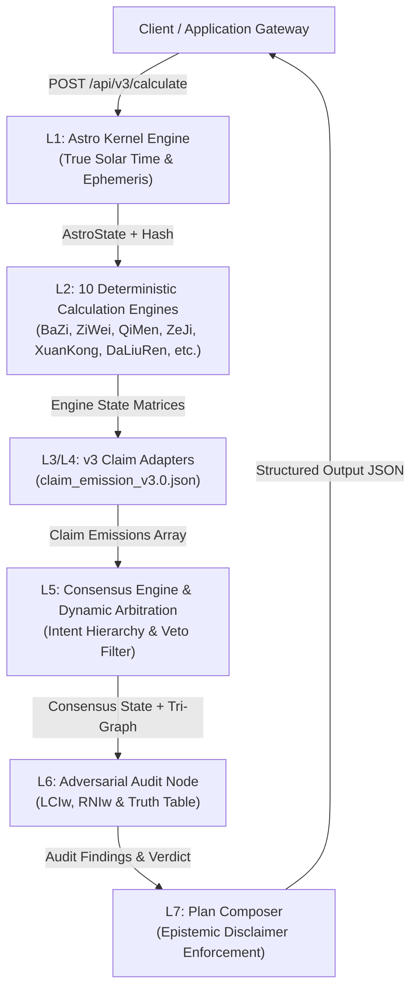
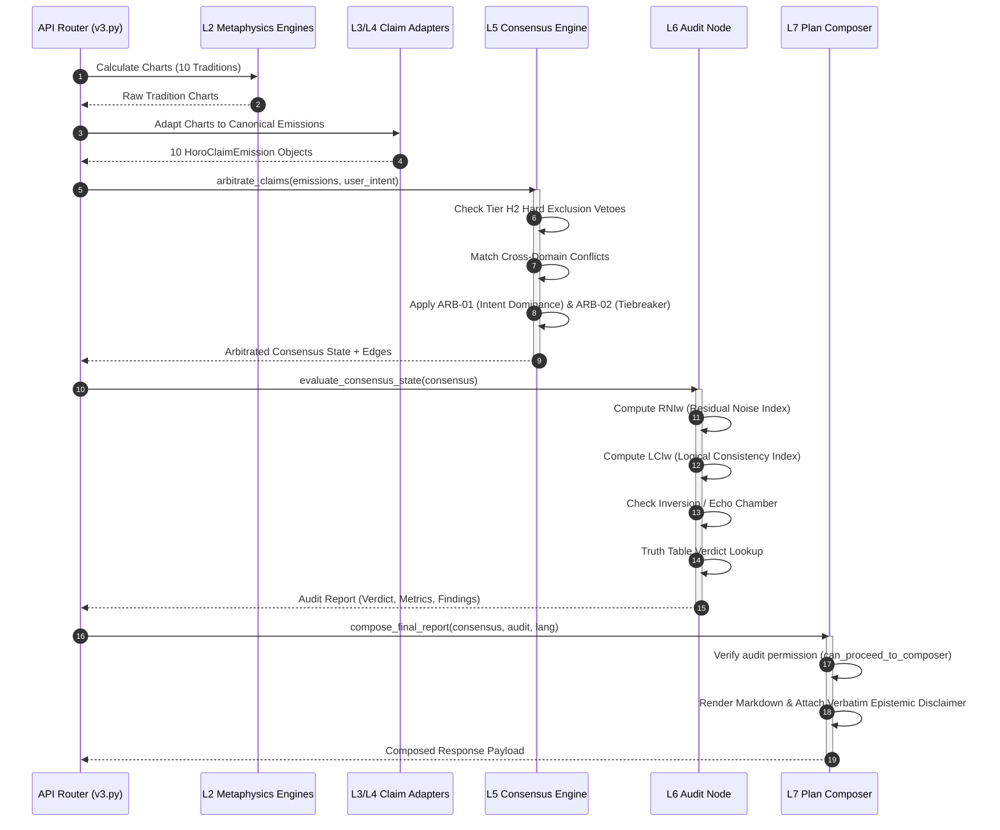

# 📘 Horo Architecture v3.0 — OpenAPI 3.1 & Technical Architecture Specification
> **Protocol**: HTTP/1.1 & HTTP/2 REST API + gRPC Proto3  
> **Base URL**: `/api/v3`  
> **OpenAPI Version**: 3.1.0  
> **Specification Status**: Stable (Production Standard)  
> **Implementation Target**: [project/routers/v3.py](file:///Users/kimlenglim/Project/HoroConsultant/project/routers/v3.py)

---

## 1. 🏛️ Technical Architecture Overview

Horo Architecture v3.0 is a deterministic, multi-disciplinary computational metaphysics platform engineered around mathematical immutability, epistemic trace provenance, and strict domain firewalling.

### 1.1 The 7-Stage Epistemic Derivation Chain (L1–L7)

Every consultation traverses seven rigorously isolated layers to ensure reproducibility, auditability, and epistemological compliance:

1. **L1 — Astro Kernel Engine ([`astro_kernel_service.proto`](file:///Users/kimlenglim/Project/HoroConsultant/TDD-HORO-v3.0/01_DATA_CONTRACTS/proto/astro_kernel_service.proto))**: Calculates true solar time, equation of time, Julian day ephemeris, and planetary coordinates.
2. **L2 — Deterministic Tradition Engines ([`project/core`](file:///Users/kimlenglim/Project/HoroConsultant/project/core))**: Executes 10 isolated metaphysics calculation engines (BaZi, ZiWei, QiMen, ZeJi, XuanKong, DaLiuRen, LiuYao, TaiYi, QiZheng, MianXiang).
3. **L3/L4 — Claim Adapters & Domain Firewalls ([`project/core/v3_engine_adapter.py`](file:///Users/kimlenglim/Project/HoroConsultant/project/core/v3_engine_adapter.py))**: Normalizes engine outputs into structured atomic interpretive claims conforming to [claim_emission_v3.0.json](file:///Users/kimlenglim/Project/HoroConsultant/TDD-HORO-v3.0/01_DATA_CONTRACTS/schemas/claim_emission_v3.0.json).
4. **L5 — Multi-Agent Consensus & Dynamic Arbitration ([`runtimes/consensus_engine.py`](file:///Users/kimlenglim/Project/HoroConsultant/TDD-HORO-v3.0/05_AGENT_PROMPTS_AND_RUNTIMES/runtimes/consensus_engine.py))**: Evaluates Tier H2 hard exclusion vetoes, applies intent-based priority hierarchies (`ARB-01`), and resolves cross-domain contradictions with confidence vector tiebreaking (`ARB-02`).
5. **L6 — Adversarial Audit Node ([`runtimes/audit_node.py`](file:///Users/kimlenglim/Project/HoroConsultant/TDD-HORO-v3.0/05_AGENT_PROMPTS_AND_RUNTIMES/runtimes/audit_node.py))**: Quality gate calculating Weighted Logical Consistency Index ($\text{LCI}_w$) and Weighted Residual Noise Index ($\text{RNI}_w$), detecting echo chambers and false provenance.
6. **L7 — Plan Composer Node ([`runtimes/plan_composer.py`](file:///Users/kimlenglim/Project/HoroConsultant/TDD-HORO-v3.0/05_AGENT_PROMPTS_AND_RUNTIMES/runtimes/plan_composer.py))**: Synthesizes effective claims into structured markdown advisory and enforces the mandatory Epistemic Disclaimer verbatim.
7. **L0/Client — Gateway Response**: Returns verified report with comprehensive cryptographic and audit metadata.



---

### 1.2 Cryptographic Merkle DAG Provenance

Implemented in [`rust_core/src/v3_merkle_dag.rs`](file:///Users/kimlenglim/Project/HoroConsultant/rust_core/src/v3_merkle_dag.rs), every computation node produces a deterministic cryptographic SHA-256 hash:

$$\text{Hash}_{\text{node}} = \text{SHA-256}\left(\text{Payload}_{\text{RFC8785}} \mathbin{\Vert} \text{"||"} \mathbin{\Vert} \text{Concat}(\text{Sorted}(\text{ParentHashes}))\right)$$

* For root nodes ($L_1$), parent material is the canonical sentinel `"ROOT_NODE"`.
* Guarantees strict acyclicity via graph reachability inspection and tamper-evident derivation histories.

---

### 1.3 Tri-Graph Ontology

Structured per [`TDD-HORO-v3.0/01_DATA_CONTRACTS/schemas/tri_graph_node_edge.json`](file:///Users/kimlenglim/Project/HoroConsultant/TDD-HORO-v3.0/01_DATA_CONTRACTS/schemas/tri_graph_node_edge.json):

1. **Derivation DAG ($\mathcal{G}_{\text{deriv}}$)**: Strictly acyclic, immutable record of computational dependencies ($L_1 \to L_7$).
2. **Semantic Property Graph ($\mathcal{G}_{\text{sem}}$)**: Dynamic graph permitting cycles, representing logical relations (`supports`, `contradicts`, `qualifies`, `supersedes`).
3. **Execution Event Ledger ($\mathcal{L}_{\text{event}}$)**: Append-only ledger recording FSM transitions and audit events with chained SHA-256 hashes.

---

## 2. ⚡ Sequence Diagram: Consensus & Arbitration



---

## 3. 📡 REST API Endpoint Contracts

### 3.1 `POST /api/v3/calculate`

Executes the full multi-tradition computation, claim adaptation, consensus arbitration, adversarial audit, and final report composition.

* **Method**: `POST`
* **Route**: `/api/v3/calculate`
* **Content-Type**: `application/json`

#### Request Body Schema
```json
{
  "$schema": "http://json-schema.org/draft-07/schema#",
  "type": "object",
  "required": ["birth_datetime", "latitude", "longitude"],
  "properties": {
    "birth_datetime": {
      "description": "ISO 8601 string or numeric Unix timestamp",
      "oneOf": [
        {"type": "string", "format": "date-time"},
        {"type": "number"}
      ]
    },
    "latitude": {
      "type": "number",
      "minimum": -90.0,
      "maximum": 90.0,
      "description": "Geographic latitude in decimal degrees"
    },
    "longitude": {
      "type": "number",
      "minimum": -180.0,
      "maximum": 180.0,
      "description": "Geographic longitude in decimal degrees"
    },
    "tz_offset": {
      "type": "number",
      "default": 7.0,
      "description": "Timezone offset in hours from UTC"
    },
    "user_intent": {
      "type": "string",
      "enum": [
        "STRATEGIC_TIMING_ACTION",
        "NATAL_CHARACTER_PATH",
        "SPATIAL_LOCATION_OFFICE",
        "TACTICAL_DIVINATION_EVENT",
        "HEALTH_VITALITY",
        "RELATIONSHIP_SYNASTRY"
      ],
      "default": "STRATEGIC_TIMING_ACTION",
      "description": "Consultation intent configuring L5 arbitration hierarchy"
    },
    "language": {
      "type": "string",
      "enum": ["th", "en"],
      "default": "th",
      "description": "Target language for rendered report markdown"
    }
  }
}
```

#### Sample Request Payload
```json
{
  "birth_datetime": "1990-05-15T14:30:00",
  "latitude": 13.7563,
  "longitude": 100.493,
  "tz_offset": 7.0,
  "user_intent": "STRATEGIC_TIMING_ACTION",
  "language": "th"
}
```

#### Sample Response Payload (`200 OK`)
```json
{
  "session_id": "f81d4fae-7dec-11d0-a765-00a0c91e6bf6",
  "status": "COMPLETED",
  "has_epistemic_disclaimer": true,
  "effective_claims_count": 10,
  "excluded_vetoes_count": 0,
  "audit_verdict": "AUDIT_PASS",
  "lciw": 1.0,
  "rniw": 0.0,
  "audit_metrics": {
    "lciw": 1.0,
    "rniw": 0.0,
    "lciw_passed": true,
    "rniw_passed": true
  },
  "audit_findings": {
    "ungrounded_claims_count": 0,
    "echo_chamber_detected": false,
    "false_provenance_detected": false,
    "unresolved_h2_detected": false,
    "warnings": [],
    "notes": "All quality thresholds met. Verified for final composition."
  },
  "report_markdown": "# 📜 รายงานการประมวลผลเชิงภววิทยา HoroConsultant v3.0\n> **Intent Focus**: `STRATEGIC_TIMING_ACTION` | **Audit Status**: `AUDIT_PASS` | **LCIw**: `1.0` | **RNIw**: `0.0`\n\n---\n\n## 1. บทสังเคราะห์ความสอดคล้องเชิงบูรณาการ (Consensus Synthesis)\n- **[ming_xue_bazi]** The Day Master Geng-Metal is assessed as Strong... (อ้างอิง: 《滴天髓》, กฎ `BAZI-STRENGTH-001`)\n...\n\n### ⚖️ พันธสัญญาญาณวิทยาและการปฏิเสธการรับรอง (Epistemic Disclaimer)\n> *ผลการวิเคราะห์นี้เกิดขึ้นจากการประมวลผลตรรกะตามกฎของสำนักวิชาที่เลือก (Tradition-Rule Validity) และความสอดคล้องของแบบจำลอง (Interpretive Consistency) เท่านั้น ไม่ถือเป็นการรับรองผลสัมฤทธิ์ในอนาคตเชิงประจักษ์ (Predictive Validity is Explicitly Disclaimed)*\n\n<!-- HORO_V3_EMISSION_VERIFIED -->",
  "emissions": [
    {
      "node_id": "@Horo_BaZi_Node",
      "tradition_domain": "ming_xue_bazi",
      "session_id": "f81d4fae-7dec-11d0-a765-00a0c91e6bf6",
      "emitted_at_utc": "2026-08-24T12:30:00Z",
      "input_state_hash": "a1b2c3d4e5f60718293a4b5c6d7e8f90a1b2c3d4e5f60718293a4b5c6d7e8f90",
      "claims": [
        {
          "claim_id": "c1d2e3f4-0000-4000-8000-000000000001",
          "materiality_weight": 0.9,
          "claim_type": "natal_structure",
          "statement": "Day Master is strong Geng Metal supported by Month Branch Shen.",
          "confidence_vector": {
            "calculation_integrity": 1.0,
            "rule_match_strength": 1.0,
            "source_support": 1.0,
            "interpretation_stability": 0.9,
            "cross_agent_agreement": 0.0
          },
          "epistemic_trace": {
            "source_corpus": "滴天髓",
            "locator": "卷一·论日主强弱",
            "applied_rule_id": "BAZI-STRENGTH-001",
            "derived_from_calc_hash": "a1b2c3d4e5f60718293a4b5c6d7e8f90a1b2c3d4e5f60718293a4b5c6d7e8f90"
          }
        }
      ]
    }
  ],
  "charts": {
    "bazi": { "pillars": { "year": { "stem": {"char": "庚"}, "branch": {"char": "午"} } } }
  }
}
```

#### HTTP Error Status Codes
| HTTP Status | Reason | Cause |
|---|---|---|
| `400 Bad Request` | `Invalid birth_datetime; use ISO 8601 or Unix timestamp` | Malformed datetime or out-of-range numeric timestamp |
| `422 Unprocessable Entity` | `Cannot compose report: Audit failed with verdict 'AUDIT_FAIL_ESCALATE'` | L6 Audit failed quality gate; composition blocked |
| `500 Internal Server Error` | `Engine calculation failure` | Unhandled runtime exception in underlying tradition engine |

---

### 3.2 `GET /api/v3/health`

Returns service health status, engine version, and list of all 10 active computational tradition domains.

* **Method**: `GET`
* **Route**: `/api/v3/health`

#### Sample Response Payload (`200 OK`)
```json
{
  "status": "HEALTHY",
  "version": "3.0.0",
  "active_domains": [
    "BaZi",
    "ZiWei",
    "QiMen",
    "ZeJi",
    "XuanKong",
    "DaLiuRen",
    "LiuYao",
    "TaiYi",
    "QiZheng",
    "MianXiang"
  ]
}
```

---

### 3.3 `GET /api/v3/schema`

Serves the canonical JSON Schema Draft-07 specification for [`claim_emission_v3.0.json`](file:///Users/kimlenglim/Project/HoroConsultant/TDD-HORO-v3.0/01_DATA_CONTRACTS/schemas/claim_emission_v3.0.json).

* **Method**: `GET`
* **Route**: `/api/v3/schema`

#### Sample Response Payload (`200 OK`)
```json
{
  "$schema": "http://json-schema.org/draft-07/schema#",
  "$id": "https://horo-engine.org/schemas/claim-emission-v3.0.json",
  "$schema_version": "3.0.0",
  "title": "HoroClaimEmission",
  "type": "object",
  "required": ["node_id", "tradition_domain", "claims"],
  "properties": {
    "node_id": { "type": "string", "pattern": "^@Horo_[A-Za-z]+_Node$" },
    "tradition_domain": { "type": "string" },
    "claims": { "type": "array", "items": { "$ref": "#/definitions/AtomicClaim" } }
  }
}
```

#### HTTP Error Status Codes
| HTTP Status | Reason | Cause |
|---|---|---|
| `500 Internal Server Error` | `v3 claim schema is unavailable` | Schema file missing on disk or corrupted JSON |

---

### 3.4 `POST /api/v3/audit`

Direct adversarial verification endpoint allowing external systems or test planes to evaluate arbitrary sets of claim emissions without executing chart calculations.

* **Method**: `POST`
* **Route**: `/api/v3/audit`
* **Content-Type**: `application/json`

#### Request Body Schema
```json
{
  "type": "object",
  "properties": {
    "emissions": {
      "type": "array",
      "items": {
        "$ref": "https://horo-engine.org/schemas/claim-emission-v3.0.json"
      }
    }
  }
}
```

#### Sample Response Payload (`200 OK`)
```json
{
  "verdict": "AUDIT_PASS",
  "metrics": {
    "lciw": 1.0,
    "rniw": 0.0,
    "lciw_passed": true,
    "rniw_passed": true
  },
  "findings": {
    "ungrounded_claims_count": 0,
    "echo_chamber_detected": false,
    "false_provenance_detected": false,
    "unresolved_h2_detected": false,
    "warnings": [],
    "notes": "All quality thresholds met. Verified for final composition."
  }
}
```

---

## 4. ⚖️ Epistemic Disclaimer Mandate

Every consultation response generated by Horo v3.0 strictly and verifiably embeds the mandatory disclaimer:

> **TH**: *"ผลการวิเคราะห์นี้เกิดขึ้นจากการประมวลผลตรรกะตามกฎของสำนักวิชาที่เลือก (Tradition-Rule Validity) และความสอดคล้องของแบบจำลอง (Interpretive Consistency) เท่านั้น ไม่ถือเป็นการรับรองผลสัมฤทธิ์ในอนาคตเชิงประจักษ์ (Predictive Validity is Explicitly Disclaimed)"*
>
> **EN**: *"This analytical report is generated solely through rule-based deduction according to canonical metaphysics traditions (Tradition-Rule Validity) and model consistency (Interpretive Consistency). It does not constitute empirical guarantees of future life outcomes (Predictive Validity is Explicitly Disclaimed)."*

---

## 5. 🔗 Codebase Cross-References

| Component | Source File | Contract / Schema |
|---|---|---|
| HTTP REST Router | [`project/routers/v3.py`](file:///Users/kimlenglim/Project/HoroConsultant/project/routers/v3.py) | OpenAPI 3.1 Spec |
| Engine Adapter Layer | [`project/core/v3_engine_adapter.py`](file:///Users/kimlenglim/Project/HoroConsultant/project/core/v3_engine_adapter.py) | L3/L4 Claim Adapter |
| Claim Emission Schema | [`TDD-HORO-v3.0/01_DATA_CONTRACTS/schemas/claim_emission_v3.0.json`](file:///Users/kimlenglim/Project/HoroConsultant/TDD-HORO-v3.0/01_DATA_CONTRACTS/schemas/claim_emission_v3.0.json) | JSON Schema Draft-07 |
| Tri-Graph Schema | [`TDD-HORO-v3.0/01_DATA_CONTRACTS/schemas/tri_graph_node_edge.json`](file:///Users/kimlenglim/Project/HoroConsultant/TDD-HORO-v3.0/01_DATA_CONTRACTS/schemas/tri_graph_node_edge.json) | JSON Schema Draft-07 |
| Consensus Engine (L5) | [`TDD-HORO-v3.0/05_AGENT_PROMPTS_AND_RUNTIMES/runtimes/consensus_engine.py`](file:///Users/kimlenglim/Project/HoroConsultant/TDD-HORO-v3.0/05_AGENT_PROMPTS_AND_RUNTIMES/runtimes/consensus_engine.py) | Dynamic Arbitration |
| Audit Node (L6) | [`TDD-HORO-v3.0/05_AGENT_PROMPTS_AND_RUNTIMES/runtimes/audit_node.py`](file:///Users/kimlenglim/Project/HoroConsultant/TDD-HORO-v3.0/05_AGENT_PROMPTS_AND_RUNTIMES/runtimes/audit_node.py) | Truth Table & Metrics |
| Plan Composer (L7) | [`TDD-HORO-v3.0/05_AGENT_PROMPTS_AND_RUNTIMES/runtimes/plan_composer.py`](file:///Users/kimlenglim/Project/HoroConsultant/TDD-HORO-v3.0/05_AGENT_PROMPTS_AND_RUNTIMES/runtimes/plan_composer.py) | Epistemic Disclaimer |
| Merkle DAG Core (Rust) | [`rust_core/src/v3_merkle_dag.rs`](file:///Users/kimlenglim/Project/HoroConsultant/rust_core/src/v3_merkle_dag.rs) | SHA-256 Provenance |
| Contract Tests | [`project/tests/test_v3_router.py`](file:///Users/kimlenglim/Project/HoroConsultant/project/tests/test_v3_router.py) | Pytest Test Client |

