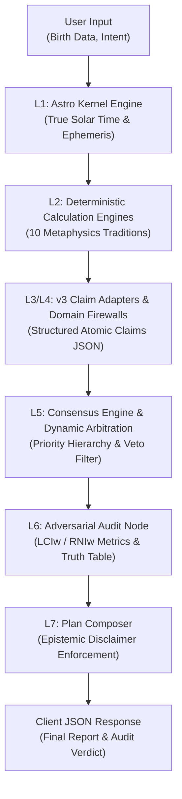

# 📘 Horo Architecture v3.0 — Technical API Specification
> **Protocol**: HTTP/1.1 & HTTP/2 REST API + gRPC Proto3  
> **Base URL**: `/api/v3`  
> **Version**: 3.0.0 (Production Stable)

---

## 🏛️ Architecture Overview

The Horo Architecture v3.0 computational metaphysics engine follows a **7-Stage Epistemic Derivation Chain (L1–L7)** ensuring mathematical immutability, epistemic trace provenance, and strict domain firewalling:



---

## 🔌 API Endpoints Summary

### 1. `POST /api/v3/calculate`
Executes end-to-end multi-disciplinary calculation, claim emission, consensus arbitration, adversarial audit, and plan composition.

- **Request Body**:
  ```json
  {
    "birth_datetime": "1990-05-15T14:30:00",
    "latitude": 13.7563,
    "longitude": 100.493,
    "tz_offset": 7.0,
    "user_intent": "STRATEGIC_TIMING_ACTION",
    "language": "th"
  }
  ```
- **Response**: `200 OK`
  - `status`: `"COMPLETED"`
  - `has_epistemic_disclaimer`: `true`
  - `report_markdown`: Composed interpretation with mandatory epistemic disclaimer
  - `audit_metrics`: `{"lciw": 1.0, "rniw": 0.0}`
  - `emissions`: Array of 10 structured domain claim emissions

### 2. `GET /api/v3/health`
Returns the operational health and active tradition domains.

- **Response**: `200 OK`
  ```json
  {
    "status": "HEALTHY",
    "version": "3.0.0",
    "active_domains": [
      "BaZi", "ZiWei", "QiMen", "ZeJi", "XuanKong",
      "DaLiuRen", "LiuYao", "TaiYi", "QiZheng", "MianXiang"
    ]
  }
  ```

### 3. `GET /api/v3/schema`
Returns the JSON Schema Draft-07 specification for `claim_emission_v3.0.json`.

### 4. `POST /api/v3/audit`
Runs the Adversarial Audit Node on an arbitrary array of claim emissions.

---

## 🛡️ Epistemic Disclaimer Mandate
Every consultation response generated by Horo v3.0 strictly includes the legal and epistemological disclaimer:
> *"Predictive Validity is Explicitly Disclaimed: The insights provided are computed based on classical metaphysical rule systems and do not constitute deterministic or factual forecasts."*
