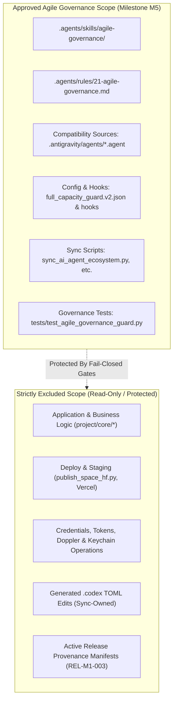
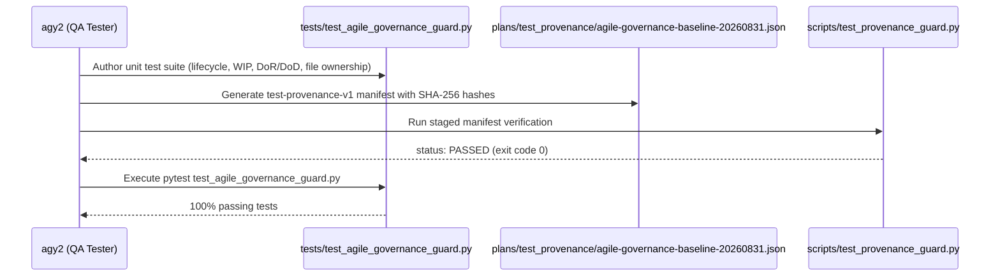

# Agile Governance Refactor Specification (Milestone M5)

**Document ID**: `SPEC-AGILE-001`  
**Timestamp**: `2026-08-31T09:25:06+07:00` (Asia/Bangkok)  
**Governance Standard**: Fail-Closed Release Governance v2 / Rule 11 / Rule 17 / Rule 18 / Rule 19A / Rule 20 / Agile Governance v1  
**Author / Lane**: `agy2` (Gemini 3.7 Flash High)  
**Status**: `READY_TO_VALIDATE`

---

## 1. DispatchDecision v1

```text
DispatchDecision v1: scope=2 complexity=2 risk=2 ambiguity=1 evidence=2; quality floor high; selected agy2 / Gemini 3.7 Flash (High); quota healthy; work_mode read_only_design; policy adaptive-model-effort-routing v1; root-high state user-authorized architecture audit; status READY_TO_VALIDATE.
```

---

## 2. Quota Telemetry & Runtime Wrapper Facts

### 2.1 Governed Alias Inventory & Provider Isolation Axiom
- **Executable Wrappers Present**: `agy1`, `agy2`, `agy3`, `codex1`, `codex2`, `codex3`.
- **Live-Verified Quota Eligibility**:
  - **`agy1` (Account 1)**: Gemini Weekly 66%, Five-Hour Window 86%, Claude/GPT 100% (State: **HEALTHY**).
  - **`agy2` (Account 2)**: Gemini Weekly 87%, Five-Hour Window 97%, Claude/GPT 100% (State: **HEALTHY**).
- **Unverified Aliases**: `agy3`, `codex1`, `codex2`, `codex3` status is **UNKNOWN** in the current active session. Under fail-closed governance, UNKNOWN quota prevents broad autonomous dispatch; only verified eligible aliases (`agy1`, `agy2`) may be scheduled for active implementation lanes.
- **Provider Isolation Axiom**: Each account alias represents a strictly isolated quota pool and independent operating session. Identical quota percentages never imply shared identity, and telemetry from one pool cannot be used to infer capacity in another. Quota pools must never be aggregated or averaged across accounts.

### 2.2 Concurrency Limits & Repository Hard Caps
- **User Preference Ceiling**: 4 concurrent lanes.
- **Repository Hard Limit**: **3 concurrent lanes** (`max_workers = 3` per alias, repository hard cap 3).
- **Precedence Rule**: Fail-closed. Repository hard cap of 3 strictly overrides user ceiling of 4 across all dispatch decisions and capacity guards.
- **Lane Ownership Principle**: Strict one-editor-per-file rule. Every active lane owns a mutually disjoint set of writable paths.

---

## 3. Approved Scope Inventory & Excluded Boundaries



### 3.1 Target Files in Approved Scope
1. **Agent Skills (`.agents/skills/`)**:
   - [NEW] `.agents/skills/agile-governance/SKILL.md` (Canonical Agile governance skill package)
   - [NEW] `.agents/skills/agile-governance/evals/evals.json` (Skill evaluation suite)
   - `.agents/AGENTS.md` (Catalog registration of `agile-governance` skill)
2. **Repository Rules (`.agents/rules/`)**:
   - [NEW] `.agents/rules/21-agile-governance.md` (Formal Agile lifecycle, WIP limits, DoR/DoD, one-editor-per-file)
   - `.agents/rules/19-agy-capacity-governance.md` & `19-zero-cost-ai-governance.md` (Numbering reconciliation)
3. **Compatibility-Source Agent Definitions**:
   - `.antigravity/agents/orchestrator.agent`
   - `.antigravity/agents/business-analyst.agent` (`business_analyst.agent`)
   - `.antigravity/agents/developer.agent`
   - `.antigravity/agents/qa-tester.agent` (`qa_tester.agent`)
   - `.antigravity/agents/devops.agent`
   - `.antigravity/agents/code-reviewer.agent` (`code_reviewer.agent`)
   - Primary downstream mirrors: `.agents/agents/*/agent.md` and `.agents/agents/*/agent.json`
4. **Governance Config & Hooks**:
   - `.agents/config/full_capacity_guard.v2.json` (Feature flags & capacity settings)
   - `.agents/hooks/full_capacity_guard.py` (Stage A structural validator - preserve integrity via smallest safe extraction)
   - `scripts/multiagent_capacity.py` (Filesystem-backed S3 capacity lease manager)
5. **Ecosystem Synchronization Scripts**:
   - `scripts/sync_ai_agent_ecosystem.py` (Master umbrella ecosystem validation gate)
   - `scripts/sync_sdlc_agents.py` (Antigravity YAML to markdown/JSON synchronizer)
   - `scripts/sync_claude_agy_parity.py` (Claude Code <-> AGY CLI parity synchronizer)
   - `scripts/sync_codex_agents.py` (Read-only converter from `.agents/agents/*/agent.json` to `.codex/agents/*.toml`)
6. **Governance Test Suite**:
   - [NEW] `tests/test_agile_governance_guard.py` (Unit & contract tests for Agile governance rules)
   - `tests/test_multiagent_capacity.py` (Capacity lease and worker concurrency tests)
   - `tests/test_test_provenance_ecosystem_sync.py` (Ecosystem synchronizer test suite)

### 3.2 Explicitly Excluded Scope
- **Application Core**: `project/core/*` (Bazi, Qi Men, Astro engines, FastAPI routers, database models).
- **Deployment & Production Infrastructure**: `publish_space_hf.py`, `run_vercel_prod_curl_regression.py`, production Hugging Face Spaces, Vercel deployments, Grafana exporters.
- **Credentials & Secrets**: Keychain unlock, Doppler secrets synchronization, API keys, tokens (`GH_TOKEN`, `HF_TOKEN`, `VERCEL_TOKEN`), AWS credentials.
- **Generated Target Edits**: `.codex/agents/*.toml` must never be modified manually; they are generated strictly by `sync_codex_agents.py`.
- **Preceding Provenance Manifests**: `plans/test_provenance/idq-mvp-080-context-oracle-correction-20260831.json` and `plans/test_provenance/merge-all-branches-20260831.json` (owned exclusively by `REL-M1-003`).

---

## 4. Reusable Agile Lessons Derived from Session

```text
┌────────────────────────────────────────────────────────────────────────────────────────┐
│                        CORE REUSABLE AGILE LESSONS MATRIX                              │
├──────────────────────────┬─────────────────────────────────────────────────────────────┤
│ Lesson Principle         │ Concrete Architectural Enforcement                          │
├──────────────────────────┼─────────────────────────────────────────────────────────────┤
│ 1. Atomic Tickets        │ Exactly one bounded objective, explicit writable paths,     │
│                          │ verified stop conditions, and XS-XL sizing per ticket.      │
├──────────────────────────┼─────────────────────────────────────────────────────────────┤
│ 2. Explicit Lifecycle    │ Strictly 6 states: TODO, READY, DOING, BLOCKED, NEEDS_HITL, │
│                          │ DONE. Zero phantom progress or unverified closures.         │
├──────────────────────────┼─────────────────────────────────────────────────────────────┤
│ 3. One Editor Per File   │ Exclusive write ownership per active ticket. Parallel lanes │
│                          │ modifying the same file are rejected fail-closed.           │
├──────────────────────────┼─────────────────────────────────────────────────────────────┤
│ 4. Dependencies & Gates  │ Downstream tickets remain BLOCKED until predecessor tickets │
│                          │ commit code and pass cryptographic verification.            │
├──────────────────────────┼─────────────────────────────────────────────────────────────┤
│ 5. Definition of Ready   │ Quota verified, dependencies DONE, single editor assigned,  │
│    (DoR)                 │ zero blockers, unambiguous acceptance criteria.             │
├──────────────────────────┼─────────────────────────────────────────────────────────────┤
│ 6. Definition of Done    │ Cryptographic stdout/commit proof, 0 secret leaks, 100%     │
│    (DoD)                 │ tests pass, git diff check clean, sync scripts pass.        │
├──────────────────────────┼─────────────────────────────────────────────────────────────┤
│ 7. Evidence-Bound Close  │ Status cannot change to DONE based on prose claims;         │
│                          │ verifiable git log, SHA-256, or test receipt required.      │
├──────────────────────────┼─────────────────────────────────────────────────────────────┤
│ 8. Per-Alias WIP Limit   │ Max 3 concurrent active lanes per account alias (agy1,      │
│                          │ agy2). Repo hard limit 3 overrides user ceiling 4.          │
├──────────────────────────┼─────────────────────────────────────────────────────────────┤
│ 9. Admission vs Execution│ Capacity lease proves admission only, not execution. Typed  │
│                          │ WorkResult and provider receipts prove execution.           │
├──────────────────────────┼─────────────────────────────────────────────────────────────┤
│ 10. Quota-Isolated Pools │ Each account alias is an independent quota pool. Zero       │
│                          │ cross-account aggregation, averaging, or assumptions.       │
├──────────────────────────┼─────────────────────────────────────────────────────────────┤
│ 11. No Keychain Fallback │ Fail closed on keychain/auth failure; never fallback to     │
│                          │ dummy credentials, insecure mocks, or unverified paths.     │
├──────────────────────────┼─────────────────────────────────────────────────────────────┤
│ 12. Timeout/Backpressure │ Bounded execution windows (effective 300s, normative 600s), │
│                          │ graceful FIFO queuing, typed S3/S4/S5 pressure states.      │
├──────────────────────────┼─────────────────────────────────────────────────────────────┤
│ 13. Milestone Rollups    │ Quantitative rollup matrices (Total, Done, Ready, Doing,    │
│                          │ Blocked, Remaining) reconciling holistic release progress.  │
├──────────────────────────┼─────────────────────────────────────────────────────────────┤
│ 14. Process-Deviation    │ Out-of-boundary tool calls recorded as deviations; outputs  │
│     Accounting           │ captured as child observations; status gated strictly.      │
├──────────────────────────┼─────────────────────────────────────────────────────────────┤
│ 15. Evidence Reconcile   │ Source-of-truth board artifacts cross-verified to eliminate │
│                          │ inconsistencies and preserve historical anchors.            │
└──────────────────────────┴─────────────────────────────────────────────────────────────┘
```

---

## 5. Skill-Creator Principles & Architectural Invariants

1. **No Ephemeral Session State in Rules or Skills**:
   - Permanent rules and skill files MUST NOT hardcode transient session state such as live quota percentages (e.g., `66%`, `87%`), specific Git commit SHAs (e.g., `0a4c13d`), or transient test counts (e.g., `300 passed`).
   - Rules and skills codify invariants, verification algorithms, schema constraints, and lifecycle transitions.
2. **Single Source of Truth & Zero Duplication**:
   - Canonical definitions reside in `.agents/rules/` and `.agents/skills/`.
   - Platform mirrors (`.claude/rules/`, `.agy/rules/`, `.antigravity/skills/`, `.codex/agents/`) are strictly generated and validated by sync scripts.
3. **Progressive Disclosure**:
   - Root context files (`AGENTS.md`, `CLAUDE.md`, `AGY.md`) maintain high-level navigational context and skill registries.
   - Granular execution rules and domain-specific schemas are loaded dynamically based on path triggers (`paths: ...`) or specialist agent activation.
4. **Preservation of Fail-Closed Security & Release Boundaries**:
   - All secret scanning, pre-tool safety guards, test provenance verifiers, and human-in-the-loop (HITL) gates remain strictly fail-closed. No optimization may bypass pre-commit or pre-release checks.

---

## 6. Contradictions & Oversized Artifacts Analysis

### 6.1 `full_capacity_guard.py` (3,146 Lines) Audit & Smallest Safe Extraction
- **Current State**:
  - `full_capacity_guard.py` is a monolithic Stage A structural validator (3,146 lines) enforcing strict JSON schema matching, SQLite lifecycle ledgers, and hardcoded dependency pin digests in `EXPECTED_DEPENDENCY_PINS`.
  - Hardcoded digests pin `scripts/multiagent_prompt_command.py`, `scripts/multiagent_ticket_scheduler.py`, `.agents/config/multiagent_model_policy.yaml`, `.agents/schemas/full-capacity-governance-v2.schema.json`, and `.agents/schemas/multiagent-dispatch-decision-v1.schema.json`.
- **Architectural Risk**:
  - A wholesale rewrite of `full_capacity_guard.py` carries extreme regression risk: SHA-256 cascade failures, potential security bypasses, breakage of existing capacity tests (`test_multiagent_capacity.py`, etc.), and ledger corruption.
- **Recommended Smallest Safe Extraction**:
  1. **Preserve `full_capacity_guard.py` Core Structure**: Retain the existing Stage A validator as an immutable structural gate.
  2. **Feature Flag Activation**: Use the existing `feature_flags` object in `.agents/config/full_capacity_guard.v2.json` (`enable_agy_parity`, `enable_module_level_source_isolation`, `enable_granular_lane_roles`) for modular expansion without mutating core validation algorithms.
  3. **Decoupled Agile Governance Guard**: Implement Agile-specific checks (e.g., ticket lifecycle transitions, DoR/DoD verification, one-editor-per-file enforcement) in a dedicated lightweight test and guard module (`tests/test_agile_governance_guard.py` and `scripts/agile_governance_guard.py`) rather than bloating `full_capacity_guard.py`.
  4. **Controlled Digest Updates**: When pinned dependencies are intentionally modified, compute and update SHA-256 pins in a dedicated atomic ticket with cryptographic verification.

### 6.2 Rule 19 Numbering Collision Resolution
- **Current State**: `.agents/rules/` contains both `19-agy-capacity-governance.md` (Rule 19A: S3 Capacity Governance) and `19-zero-cost-ai-governance.md` (Rule 19B: Zero-Cost AI Pipelines).
- **Resolution**:
  - Preserve `19-agy-capacity-governance.md` as Rule 19 (Capacity & Cost Governance).
  - Codify Agile Governance formally as **Rule 21** (`21-agile-governance.md`), eliminating numbering ambiguity.

---

## 7. Disjoint Implementation Tickets Plan (Milestone M5)

```text
M5 Agile Governance Refactor Progression:
GOV-M5-001 (Spec) ──► GOV-M5-002 (Test Baseline) ──► GOV-M5-003 (Rules & Skills)
                             │                                 │
                             ▼                                 ▼
                      GOV-M5-004 (Agent Personas) ◄────────────┘
                             │
                             ▼
                      GOV-M5-005 (Config & Guard)
                             │
                             ▼
                      GOV-M5-006 (Ecosystem Sync)
                             │
                             ▼
                      GOV-M5-007 (E2E Verification)
                             │
                             ▼
                      GOV-M5-008 (HITL Closure)
```

### Ticket `GOV-M5-001` [CURRENT]
- **Milestone**: M5
- **Status**: `DONE` (upon spec completion)
- **Severity**: CRITICAL
- **Effort**: S
- **Owner**: `agy2 / business_analyst`
- **Writable Ownership**: `plans/agile_governance_refactor_spec_20260831.md`
- **Dependencies**: None
- **Objective**: Deliver minimal, implementation-ready Agile governance refactor architecture and ticket specification.
- **Acceptance Criteria**: Single spec file authored, covering all required sections, adhering to fail-closed boundaries, and passing `git diff --check`.
- **Evidence Artifact**: `plans/agile_governance_refactor_spec_20260831.md`.

---

### Ticket `GOV-M5-002`
- **Milestone**: M5
- **Status**: `READY`
- **Severity**: HIGH
- **Effort**: S
- **Owner**: `agy2 / qa_tester`
- **Writable Ownership**:
  - `plans/test_provenance/agile-governance-baseline-20260831.json`
  - `tests/test_agile_governance_guard.py`
- **Dependencies**: `GOV-M5-001`
- **Objective**: Establish QA-owned test-only baseline and provenance manifest for Agile governance rules, concurrency limits, and one-editor-per-file assertions.
- **Acceptance Criteria**:
  1. Provenance manifest created adhering to `test-provenance-v1` schema with exact SHA-256 digests.
  2. `tests/test_agile_governance_guard.py` implemented with tests for lifecycle states, WIP limits, DoR/DoD, and one-editor-per-file.
  3. `python3 scripts/test_provenance_guard.py staged` passes exit 0.
- **Evidence Artifact**: Manifest file and clean test run output.

---

### Ticket `GOV-M5-003`
- **Milestone**: M5
- **Status**: `BLOCKED`
- **Severity**: HIGH
- **Effort**: M
- **Owner**: `agy1 / developer`
- **Writable Ownership**:
  - `.agents/rules/21-agile-governance.md`
  - `.agents/skills/agile-governance/SKILL.md`
  - `.agents/skills/agile-governance/evals/evals.json`
  - `.agents/AGENTS.md`
- **Dependencies**: `GOV-M5-002`
- **Objective**: Implement canonical Rule 21 and Agile governance skill package.
- **Acceptance Criteria**:
  1. `.agents/rules/21-agile-governance.md` created with YAML frontmatter, defining 6 lifecycle states, max 3 WIP per alias, DoR/DoD, and one-editor-per-file.
  2. `.agents/skills/agile-governance/SKILL.md` created (description <= 100 chars, gotchas included).
  3. Evals created in `evals/evals.json` and skill registered in `.agents/AGENTS.md`.
- **Evidence Artifact**: Committed rule and skill files passing syntax verification.

---

### Ticket `GOV-M5-004`
- **Milestone**: M5
- **Status**: `BLOCKED`
- **Severity**: MEDIUM
- **Effort**: S
- **Owner**: `agy2 / developer`
- **Writable Ownership**:
  - `.antigravity/agents/orchestrator.agent`
  - `.antigravity/agents/business-analyst.agent`
  - `.antigravity/agents/developer.agent`
  - `.antigravity/agents/qa-tester.agent`
  - `.antigravity/agents/devops.agent`
  - `.antigravity/agents/code-reviewer.agent`
- **Dependencies**: `GOV-M5-003`
- **Objective**: Update compatibility-source agent persona definitions to reference Agile governance standards and role boundaries.
- **Acceptance Criteria**:
  1. All 6 primary Antigravity `.agent` YAML files updated with Agile governance role responsibilities.
  2. Tools arrays include `agile-governance` where appropriate.
  3. `python3 scripts/sync_sdlc_agents.py --sync` executes cleanly.
- **Evidence Artifact**: Synced agent YAML and JSON files.

---

### Ticket `GOV-M5-005`
- **Milestone**: M5
- **Status**: `BLOCKED`
- **Severity**: HIGH
- **Effort**: M
- **Owner**: `agy1 / devops`
- **Writable Ownership**:
  - `.agents/config/full_capacity_guard.v2.json`
  - `scripts/multiagent_capacity.py`
- **Dependencies**: `GOV-M5-004`
- **Objective**: Align capacity configuration and runtime lease manager with max 3 active lanes per alias and strict disjoint file ownership validation.
- **Acceptance Criteria**:
  1. Configuration validated against schema with max 3 lanes enforced.
  2. `scripts/multiagent_capacity.py` rejects >3 workers per alias or conflicting file ownership.
  3. Unit tests pass 100%.
- **Evidence Artifact**: Passing pytest output on capacity tests.

---

### Ticket `GOV-M5-006`
- **Milestone**: M5
- **Status**: `BLOCKED`
- **Severity**: MEDIUM
- **Effort**: S
- **Owner**: `agy2 / developer`
- **Writable Ownership**:
  - `scripts/sync_ai_agent_ecosystem.py`
  - `scripts/sync_claude_agy_parity.py`
  - `.claude/rules/21-agile-governance.md`
  - `.agy/rules/21-agile-governance.md`
- **Dependencies**: `GOV-M5-005`
- **Objective**: Update synchronizers and generate platform mirrors for Claude Code, AGY CLI, and Codex.
- **Acceptance Criteria**:
  1. `python3 scripts/sync_claude_agy_parity.py --sync` generates valid mirrors.
  2. `python3 scripts/sync_ai_agent_ecosystem.py --check` exits 0 with all checks `[OK]`.
- **Evidence Artifact**: Clean terminal output of ecosystem sync check.

---

### Ticket `GOV-M5-007`
- **Milestone**: M5
- **Status**: `BLOCKED`
- **Severity**: HIGH
- **Effort**: S
- **Owner**: `agy2 / qa_tester`
- **Writable Ownership**: `tests/test_governance_boundaries.py`
- **Dependencies**: `GOV-M5-006`
- **Objective**: Perform independent QA verification of the complete Agile governance suite across all platform mirrors.
- **Acceptance Criteria**:
  1. 100% pass on boundary tests: concurrency limit rejection at 4, one-editor-per-file collision detection, lifecycle state gating.
  2. `python3 project/core/code_reviewer.py --scan-secrets` reports 0 leaks.
- **Evidence Artifact**: Pytest execution receipt and secret scanner report.

---

### Ticket `GOV-M5-008`
- **Milestone**: M5
- **Status**: `BLOCKED` (NEEDS_HITL)
- **Severity**: MEDIUM
- **Effort**: XS
- **Owner**: `orchestrator / hitl_reviewer`
- **Writable Ownership**:
  - `HANDOFF.md`
  - `plans/release_atomic_tickets_20260831.md`
- **Dependencies**: `GOV-M5-007`
- **Objective**: Formal human-in-the-loop sign-off, board reconciliation, and milestone closure.
- **Acceptance Criteria**:
  1. All M5 tickets verified DONE with cryptographic proof.
  2. `plans/release_atomic_tickets_20260831.md` updated with final rollup state.
  3. `HANDOFF.md` updated with sign-off receipt.
- **Evidence Artifact**: Updated master ticket board and handoff artifact.

---

## 8. QA-Owned Test-Only Baseline & Provenance Plan



### 8.1 Provenance Manifest Specification
- **Target Path**: `plans/test_provenance/agile-governance-baseline-20260831.json`
- **Schema Version**: `test-provenance-v1`
- **Tracked Test Suites**:
  - `tests/test_agile_governance_guard.py`
  - `tests/test_multiagent_capacity.py`
- **Baseline Parent**: HEAD commit SHA at time of execution.
- **Verification Commands**:
  ```bash
  python3 scripts/test_provenance_guard.py staged
  python3 scripts/test_provenance_guard.py verify-pr --base origin/main --head HEAD
  ```

---

## 9. Acceptance Tests & Safety Gates

### 9.1 Acceptance Test Coverage Matrix
1. **Lifecycle Transition Gate**: Assert that tickets cannot move directly from `TODO` to `DONE` without transitioning through `READY` and `DOING` with verifiable evidence.
2. **Concurrency Hard Cap Gate**: Assert that dispatch requests exceeding 3 active workers per alias are rejected fail-closed with `OVER_CAPACITY`.
3. **Disjoint Ownership Gate**: Assert that concurrent dispatch requests attempting to write to the same file path raise `OWNERSHIP_CONFLICT` and block the second lane.
4. **Documentation Lane Boundary Gate**: Assert that lanes assigned `work_mode: write_docs` or `read_only_design` are strictly restricted to `git status` and `git diff` validation and cannot trigger test runners, credential access, or deployments.

### 9.2 Quality & Reviewer Gates
- **Gate 1 (Ecosystem Parity)**: `python3 scripts/sync_ai_agent_ecosystem.py --check` -> All checks `[OK]`.
- **Gate 2 (Secret Scanner)**: `python3 project/core/code_reviewer.py --scan-secrets` -> 0 leaks across repository files.
- **Gate 3 (Provenance Guard)**: `python3 scripts/test_provenance_guard.py staged` -> `status: PASSED`.
- **Gate 4 (HITL Reviewer Sign-Off)**: Human reviewer verification required before remote push or milestone completion.

---

## 10. Summary & Next Action Recommendation

The Agile Governance Refactor Specification establishes a robust, fail-closed framework derived directly from empirical session lessons while preserving existing security boundaries and avoiding high-risk monolithic rewrites.

Upon review, proceed with active implementation starting with **`GOV-M5-002`** (QA-owned test baseline and provenance manifest creation by `agy2 / qa_tester`).
