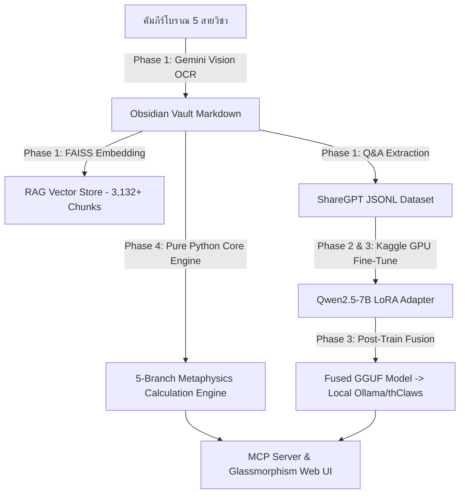

# ☯️ Roadmap การเรียนรู้ คำนวณ และสกัดคัมภีร์โหราศาสตร์จีน 5 สายวิชา (五術 Metaphysics Roadmap)
> **โปรเจกต์:** HoroConsultant (Computational Metaphysics Engine)  
> **เป้าหมาย:** สกัดคัมภีร์โบราณ พัฒนาโมดูลคำนวณคณิตศาสตร์บริสุทธิ์ และขยาย RAG/Fine-Tuning Dataset ให้ครอบคลุม 5 สายวิชาหลัก
> **Current disposition (2026-08-21):** Implementation scope is evidenced as complete through `TICKET-META-002`/`003`; release closure remains tracked by `TICKET-META-005`/`006` in [`PROJECT_TASKS.md`](../PROJECT_TASKS.md). Do not infer a production-release claim from this roadmap alone.

---

## 📌 สรุปสถาปัตยกรรมและแผนการดำเนินงาน 4 ระยะ (4-Phase Architecture)



---

## 📚 1. สายซานซื่อ (三式 — Three Cosmic Styles: ยุทธศาสตร์และโครงสร้างจักรวาล)

### 1.1 วิชาไท่อิก (Tai Yi Shen Shu — 太乙神數)
* **คัมภีร์หลัก**: 《太乙金鏡式經》 (ไท่อิกกิมเก็งเซ็กเก็ง)
* **แกนการคำนวณ**:
  * คำนวณปีสะสม (太乙積年) และตำแหน่งจานฟ้า-จานดิน (天地盤)
  * สกัดตำแหน่งดวงดาว Tai Yi 16 พาธ และผัง 8 ทิศยุทธศาสตร์
* **โมดูลที่ต้องสร้าง**: `project/core/tai_yi_engine.py`

### 1.2 วิชาไต่ลักหยิ่ม (Da Liu Ren — 大六壬)
* **คัมภีร์หลัก**: 《六壬大全》 (ลักหยิ่มตั่วช่วง), 《六壬指南》 (ลักหยิ่มจี้หน่ำ)
* **แกนการคำนวณ**:
  * คำนวณจานลักหยิ่ม 12 กิ่งดิน (月將加時)
  * สร้างผัง 3 ประตู (三傳) และ 4 ลักษณ์ (四課)
  * คำนวณเทพปกป้อง 12 องค์ (十二天將 - 青龍, 朱雀, 勾陳 ฯลฯ)
* **โมดูลที่ต้องสร้าง**: `project/core/liu_ren_engine.py`

### 1.3 วิชาคี้มึ้งตุ่งกะ (Qi Men Dun Jia — 奇門遁甲)
* **คัมภีร์หลัก**: 《煙波釣叟歌》 (ยันปอเตี่ยวโซ่วเกอ), 《奇門遁甲大全》 (คี้มึ้งตุ่งกะตั่วช่วง)
* **แกนการคำนวณ**:
  * คำนวณฤดูกาล 24 จี๋กี่ (節氣) และฤกษ์ หยิน-หยาง 18 คอร์ด (陰陽十八局)
  * วางผัง 4 ชั้น: จานดิน (地盤), จานฟ้า (天盤 - 九星), จานประตู (門盤 - 八門), จานเทพ (神盤 - 八神)
* **โมดูลที่ต้องสร้าง**: `project/core/qi_men_engine.py`

---

## 命 2. สายมิ่งเสวีย (命學 — Destiny Analysis: ถอดรหัสชะตาชีวิต)

### 2.1 วิชาปาจื้อ (BaZi — 八字)
* **คัมภีร์หลัก**: 《淵海子平》 (เอียนไฮ้จื่อเผิง), 《滴天髓》 (เต็กเทียนซุ่ย), 《三命通會》 (ซำเม่งทงเอ๊ย)
* **แกนการคำนวณ** *(มีอยู่ในโปรเจกต์แล้ว - ปรับปรุงต่อ)*:
  * True Solar Time ($TST = LMT + EoT$) + Probabilistic 12-Scenario Midnight Matrix
  * Hidden Stems (藏干), คะแนนกำลัง 5 ธาตุ, และปฏิกิริยา ฮะ-ชง-เฮ้ง-ผ่าย-ฮ้าย (合沖刑破害)
* **โมดูลปัจจุบัน**: `project/core/bazi_engine.py`

### 2.2 วิชาจื่อเว่ยโต่วซู่ (Zi Wei Dou Shu — 紫微斗數)
* **คัมภีร์หลัก**: 《紫微斗數全書》 (จื่อเว่ยโต่วซู่ฉวนซู - จี่มุ้ยตั่วช่วง)
* **แกนการคำนวณ**:
  * คำนวณจันทรคติจีน (Lunar Calendar) และยามเกิด
  * วางผัง 12 ภพ (十二宮 - 命宮, 兄弟, 夫妻, 財帛 ฯลฯ) และตั้งธาตุเจ้าภพ (五行局)
  * คำนวณตำแหน่งดาวหลัก 14 ดวง (紫微, 天機, 太陽, 武曲 ฯลฯ) และดาวแปลงพลัง 4 สาร (四化 - 化祿, 化權, 化科, 化忌)
* **โมดูลที่ต้องสร้าง**: `project/core/zi_wei_engine.py`

### 2.3 วิชาดาว 7 ตัว 4 พลัง (Qi Zheng Si Yu — 七政四餘)
* **คัมภีร์หลัก**: 《果老星宗》 (กั่วเหลาซิงจง)
* **แกนการคำนวณ**:
  * คำนวณตำแหน่งดาวเคราะห์จริง 7 ดวง (อาทิตย์, จันทร์, พุธ, ศุกร์, อังคาร, พฤหัส, เสาร์) ด้วย **Swiss Ephemeris (PyEphem)**
  * คำนวณเงาดาว 4 พลัง (ราหู, เกตุ, ลัคนาเงา, รัศมี) และตำแหน่ง 28 กลุ่มดาวนักษัตร (二十八宿)
* **โมดูลปัจจุบัน**: `project/core/swiss_ephemeris.py` *(ขยายผลต่อ)*

---

## 卜 3. สายปู่ซื่อ (卜筮 — Divination & I Ching: การทำนายและเสี่ยงทาย)

### 3.1 วิชาอี้จิง (Zhou Yi — 周易 / I Ching)
* **คัมภีร์หลัก**: 《易經》 (อี้จิง - คัมภีร์เปลี่ยนเล่ม)
* **แกนการคำนวณ**:
  * อัลกอริทึมคำนวณกิ่งต้นไม้ยึด 50 ต้น (เหยา 6 เส้น) และม้วนเหรียญ หยิน-หยาง
  * ถอดรหัส 64 กว้าหลัก (六十四卦) และคำพยากรณ์เหมาผาย (卦辭/爻辭)
* **โมดูลที่ต้องสร้าง**: `project/core/iching_engine.py`

### 3.2 วิชาลิ่วเหยา (Liu Yao — 六爻)
* **คัมภีร์หลัก**: 《卜筮正宗》 (ปู่ซื่อเจิ้งจง), 《增刪卜易》 (เซิงซานปู่ยี่)
* **แกนการคำนวณ**:
  * บรรจุพฤกษ์กิ่งฟ้ากิ่งดินลงในเหยา 6 เส้น (納甲地支)
  * ตั้งญาติ 5 ประการ (五親 - 父母, 兄弟, 子孫, 妻財, 官鬼) และ 6 เทพสัตว์เสือเขียว (六神 - 青龍, 朱雀 ฯลฯ)
  * ประเมินกำลังยาม วัน เดือน (日月建) และเหยาเปลี่ยน (動爻/變卦)
* **โมดูลที่ต้องสร้าง**: `project/core/liu_yao_engine.py`

### 3.3 วิชาเหมยฮวาอี้ซู่ (Mei Hua Yi Shu — 梅花易數)
* **คัมภีร์หลัก**: 《梅花易數》 (เหมยฮวาอี้ซู่ - ดอกเหมยพยากรณ์)
* **แกนการคำนวณ**:
  * คำนวณกว้าจาก ตัวเลข เวลา ตัวอักษร ทิศทาง หรือปรากฏการณ์รอบตัว
  * แบ่งเป็น กว้าหลัก (體卦/用卦) และคำนวณปฏิสัมพันธ์ธาตุ 5 ประการ (生克制化)
* **โมดูลที่ต้องสร้าง**: `project/core/mei_hua_engine.py`

---

## 相 4. สายเสี่ยงเสวีย (相學 — Physiognomy & Feng Shui: ศาสตร์แห่งนิมิตและชัยภูมิ)

### 4.1 วิชาฮวงจุ้ยเสวียนคง (Xuan Kong Flying Stars — 玄空風水)
* **คัมภีร์หลัก**: 《青囊奧語》 (ชิงหนางอ้าวหยู่), 《沈氏玄空學》 (สิ่มสีเสวียนคงเสวีย)
* **แกนการคำนวณ**:
  * คำนวณองศาทิศทาง 24 เสามังกร (二十四山) ด้วยเข็มทิศพิกัดดิจิทัล
  * คำนวณผังดาวบินยุค 9 (九運 - 2024-2043) ดาวหางฟ้า (向星) และดาวหางดิน (山星)
* **โมดูลที่ต้องสร้าง**: `project/core/xuan_kong_engine.py`

### 4.2 วิชาฮวงจุ้ยซานเหอ (San He Feng Shui — 三合風水)
* **คัมภีร์หลัก**: 《地理五訣》 (ตี้ลี่อู่เจวี๋ย - 5 กฎแห่งภูมิศาสตร์)
* **แกนการคำนวณ**:
  * คำนวณสายน้ำไหลเข้า-ออก 12 สภาวะกำเนิด-ดับ (十二長生水法)
  * ปรับทิศทางมังกร ทิศทางน้ำ และทิศทางเตียง/ประตู ตามหลัก 3 สมพงษ์ (三合局)
* **โมดูลที่ต้องสร้าง**: `project/core/san_he_engine.py`

### 4.3 วิชาโหงวเฮ้ง (Mian Xiang — 麻衣神相)
* **คัมภีร์หลัก**: 《麻衣神相》 (หม่าอีเสินเซียง - คัมภีร์หม่าอี)
* **แกนการคำนวณ**:
  * สกัดวิเคราะห์รูปหน้า 12 วัง (十二宮) และ 5 ขุนนาง (五官)
  * ใช้ **Gemini Vision OCR & Multimodal API** อ่านภาพใบหน้า วิเคราะห์จุดไฝ ริ้วรอย และสีหน้า (氣色)
* **โมดูลที่ต้องสร้าง**: `scripts/mian_xiang_vision.py`

---

## 择 5. สายเจ๋อจี๋เสวีย (擇吉學 — Date Selection: ศาสตร์แห่งการคำนวณฤกษ์ยาม)

### 5.1 วิชาฤกษ์ยามหลวง (Imperial Calendar Date Selection)
* **คัมภีร์หลัก**: 《協紀辨方書》 (เสี่ยจี้เปี้ยนฝางซู - คัมภีร์คำนวณฤกษ์ยามหลวงราชวงศ์ชิง)
* **แกนการคำนวณ**:
  * คำนวณเทพมงคล (吉神) และทวยเทพพิฆาต (凶神) ประจำวัน/ยาม
  * คำนวณฤกษ์สร้างบ้าน แต่งงาน ออกเดินทาง เปิดกิจการ ห้ามชนปีเกิด (建除十二神 / 歲破 / 暗沖)
* **โมดูลที่ต้องสร้าง**: `project/core/ze_ji_engine.py`

---

## 🗺️ แผนการดำเนินงานและสกัดคัมภีร์ (Roadmap Action Plan)

```
┌──────────────────────────────────────────────────────────────────────────────────┐
│ Step 1: Ingestion & OCR Pipeline (สกัดไฟล์คัมภีร์ลง Obsidian Vault)                  │
│   • ใช้ scripts/ocr_pdf_gemini.py แปลงภาพหน้าคัมภีร์จีน/ไทย เป็น Markdown                 │
│   • รัน python3 project/rag/ingest_vault.py --export-finetune สร้าง Vector DB & Dataset  │
├──────────────────────────────────────────────────────────────────────────────────┤
│ Step 2: Pure Python Calculation Core Implementation                              │
│   • พัฒนาโมดูลคณิตศาสตร์บริสุทธิ์ใน project/core/ (Zi Wei, Qi Men, Xuan Kong, ฯลฯ)     │
│   • เขียน Pytest Unit Tests ครอบคลุม 100% ( deterministic calculation test)        │
├──────────────────────────────────────────────────────────────────────────────────┤
│ Step 3: Dataset Build & Kaggle Fine-Tuning Pipeline                               │
│   • รวม Q&A คู่คำถาม-คำตอบลงใน project/rag/datasets/train.jsonl                      │
│   • รัน python3 scripts/kaggle_notebook_manager.py --push เทรนโมเดลบน Kaggle GPU       │
│   • รัน python3 scripts/post_train_fuse.py แปลงเป็น GGUF 4-bit ลง Ollama/thClaws     │
├──────────────────────────────────────────────────────────────────────────────────┤
│ Step 4: MCP Integration & Web UI Visualizer                                      │
│   • เพิ่ม MCP Tools ใน project/mcp_server.py (เช่น calculate_ziwei, calculate_qimen)  │
│   • อัปเดต Glassmorphism Dashboard แสดงผลผังดวง 5 สายวิชาอย่างสวยงาม                    │
└──────────────────────────────────────────────────────────────────────────────────┘
```
