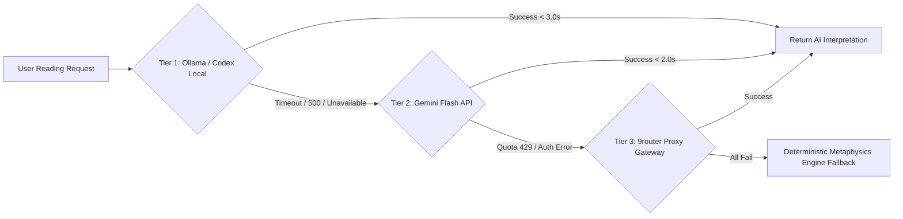

# AI SDLC Master Implementation Plan: Production Multi-Cloud Architecture, Rust PyO3 Audit & Full Deployment

**Project:** HoroConsultant — Computational Metaphysics Engine  
**Target Framework:** Antigravity CLI AI SDLC System + Codex compatibility layer
**Lead Agent:** Master Orchestrator (`orchestrator`) & Business System Analyst (`business_analyst`)  
**Last Updated:** 2026-08-15 — Hermes Agent Cloud-Ready Lifecycle Hooks (.agents/hooks.json), CI headless mode, Doppler 2-Tier secret sync, and Gemini 3.6/3.7 Parity Engine.

---

## 📌 Master Task Board (Kanban Summary)

```
┌───────────────────────────────────────┬───────────────────────────────────────┬───────────────────────────────────────┐
│              ✅ DONE                  │              🔄 DOING                 │              📋 TODO                  │
├───────────────────────────────────────┼───────────────────────────────────────┼───────────────────────────────────────┤
│ • Decoupled DDD Multi-Cloud & Rust Core│ • Google Gemini API Dynamic Key &     │ • Future LLM Provider Integration      │
│ • Autonomous NotebookLM Distillation  │   Model Rotation Engine (gemini-3.5-  │   (Qwen2.5-32B / DeepSeek-R1 evaluation)│
│ • Hermes Agent Synthetic CoT Miner    │   flash-lite ➔ gemini-flash-latest ➔  │                                       │
│ • Quality Gate & Dataset Curator      │   gemini-3.6-flash ➔ live endpoints)  │                                       │
│ • Kaggle GPU Fine-Tuning Pipeline     │                                       │                                       │
│ • MLOps Dashboard & FastAPIRouter     │                                       │                                       │
│ • Webhook Alerts (Telegram & Discord) │                                       │                                       │
│ • Scheduled GitHub Actions Cron       │                                       │                                       │
│ • 206 Pytest + 25 Button Contracts    │                                       │                                       │
│ • Hermes Cloud Hooks (.agents/hooks)  │                                       │                                       │
│ • Doppler 2-Tier Secrets Pipeline     │                                       │                                       │
│ • Gemini 3.6/3.7 Parity Engine Config │                                       │                                       │
└───────────────────────────────────────┴───────────────────────────────────────┴───────────────────────────────────────┘
```


---

## 🚀 Execution Roadmap: Grafana Cloud & Observability Integration

### Phase 1: Observability Core Engine (`project/core/observability.py`)
- Implement `ObservabilityManager` for tracking request count, latencies, HTTP status codes (2xx/4xx/5xx), RAG FAISS retrieval latency, and LLM inference stats.
- Implement standard Prometheus exposition format (`/metrics`) with `text/plain; version=0.0.4`.
- Support optional OpenTelemetry OTLP trace exporting when `GRAFANA_OTLP_ENDPOINT` / `OTEL_EXPORTER_OTLP_ENDPOINT` is configured.
- Ensure 100% graceful fallback with zero request overhead when telemetry credentials are not present.

### Phase 2: FastAPI Integration & Middleware (`project/main.py`)
- Register HTTP timing middleware to track API latency, Request Per Minute (RPM), and route metrics.
- Expose `/metrics` endpoint and `/api/health` alias for Grafana Synthetic Monitoring pinging.
- Add OpenTelemetry / Prometheus setup hooks in application startup lifecycle.

### Phase 3: Container & Environment Configuration (`Dockerfile`, `Dockerfile.hf`, `requirements.txt`)
- Add `prometheus-client>=0.20.0` to `requirements.txt`.
- Configure `Dockerfile` and `Dockerfile.hf` to expose Grafana environment variables (`GRAFANA_OTLP_ENDPOINT`, `GRAFANA_OTLP_TOKEN`, `PROMETHEUS_METRICS_ENABLED`).

### Phase 4: Test Suite & Verification (`project/tests/test_observability.py`)
- Add unit tests for `ObservabilityManager`, `/metrics` endpoint, health ping, and latency metric calculations.
- Run full pytest regression suite (`python3 -m pytest -v --ignore=project/kaggle_kernel`).
- Run UI button contract regression suite (`python3 scripts/run_button_regression.py`).
- Run pre-deployment safety audit (`python3 project/core/code_reviewer.py --review`).
- Run SDLC agent cross-platform sync check (`python3 scripts/sync_sdlc_agents.py --check`).
- Run Codex agent compatibility sync check (`python3 scripts/sync_codex_agents.py --check`).

### Phase 5: Documentation & Task Synchronization
- Update `PROJECT_TASKS.md`, `README.md`, and `HOWTO.md` to reflect Grafana Cloud Observability completion.
- Re-verify 100% pass across all tests and audits.

---

## 🌐 Multi-Cloud Platform Architecture Matrix

| Platform Layer | Target Environment | Key Functionality | SLA & Latency Profile | Status |
| :--- | :--- | :--- | :--- | :--- |
| **Hugging Face Static Edge CDN** | `pphothidaen-horoconsultant-core-backend.static.hf.space` | Web Dashboard (`index.html`), Admin (`admin.html`), HITL (`hitl.html`) | 24/7 Unlimited Uptime, Zero Cost, Global Edge (< 20ms) | ✅ **ACTIVE** |
| **Azure Container Apps** | `AZURE_CONTAINER_APP_URL` | FastAPI Backend + PyO3 Rust Fast Math + Swiss Ephemeris | Southeast Asia production backend | ✅ **ACTIVE TARGET** |
| **Vercel Edge Network** | `vercel.json` Gateway | Intelligent Edge API Route Rewriting & Reverse Proxy | Global Edge Proxy (< 20ms) | ✅ **READY** |
| **Hugging Face Docker Space** | `pphothidaen/horoconsultant-core-backend` | Heavy FAISS RAG Search & Async Batch Data Processing + Grafana Metrics | Free Container (16GB RAM, 2 vCPU) | ✅ **ACTIVE** |
| **Kaggle GPU Accelerator** | `scripts/kaggle_notebook_manager.py` | Asynchronous LLM Fine-Tuning & Model Weight Fusion | Free 30h/week Nvidia T4 GPU Pipeline | ✅ **READY** |

---

## 🧪 Verification & Quality Control Standards

1. **Full Pytest Unit & Integration Regression Suite**:
   ```bash
   python3 -m pytest -v --ignore=project/kaggle_kernel
   ```
   - Target: **100% success rate (169+ passed)**.

2. **25-Button UI & Endpoint Contract Regression Suite**:
   ```bash
   python3 scripts/run_button_regression.py
   ```
   - Target: **25 / 25 UI Button & API Endpoint contracts passing**.

3. **Pre-Deployment Code Audit & Security Review**:
   ```bash
   python3 project/core/code_reviewer.py --review
   ```
   - Target: Status **`READY_FOR_PROD`** with zero sensitive key leaks.

4. **Cross-Platform Agent Sync Verification**:
   ```bash
   python3 scripts/sync_sdlc_agents.py --check
   ```
   - Target: **100% Synchronized**.

5. **Codex Agent Compatibility Verification**:
   ```bash
   python3 scripts/sync_codex_agents.py --check
   ```
   - Target: **all generated Codex role TOML files match the existing workspace definitions**.

## 🔮 Scope Specification: Future LLM Model Expansion & Hybrid Provider Architecture

### 1. Architectural Strategy & Target Models
To ensure high reasoning capability across 10 computational metaphysics disciplines without incurring API cost inflation, the system adopts a 3-Tier Multi-Provider Topology:

| Tier / Role | Target Model Candidates | Deployment / Provider Target | Target Latency / SLA | Cost Profile |
| :--- | :--- | :--- | :--- | :--- |
| **Tier 1: Local / Edge Primary** | `qwen2.5:7b-instruct-q4_K_M`, `qwen2.5:14b-instruct-q4` | Ollama Container (HF Spaces / Azure ACA) / Local Codex CLI | TTFT < 800ms, Full Reading < 2.5s | **$0.00 / Free** (Included Compute) |
| **Tier 2: High-Speed Cloud Workhorse** | `gemini-2.5-flash`, `gemini-3.6-flash` | Google AI Studio API (`GEMINI_API_KEY`) | TTFT < 400ms, Full Reading < 1.5s | Zero-tier free quota / $0.075/1M tokens |
| **Tier 3: Reasoning & Domain Synthesis** | `deepseek-r1-distill-qwen-32b`, `claude-3.7-sonnet` | 9router Proxy Gateway (`agy1` alias) / DeepSeek API | TTFT < 1.2s, Full Synthesis < 4.0s | Dynamic quota balancing via 9router |

### 2. Provider Failover Hierarchy & Resilience Circuit Breaker


### 3. Acceptance Criteria & Test Matrix
1. **Zero Hallucination Guard**: System MUST enforce deterministic Rust PyO3 calculation for BaZi Day Master, Five Elements percentages, and ZiWei Palaces. AI models MUST NOT modify computed chart parameters.
2. **Graceful Fallback**: If Tier 1 & Tier 2 fail, response fallback MUST return raw calculation structured output with localized astrological rule summaries within < 100ms.
3. **Budget Limit**: Monthly cloud API expenditure capped at **$0.00** baseline using local session CLI routing and Gemini free tier.

---

## 🛡️ Agent Execution Protocol

- **Orchestrator Agent**: Directs overall AI SDLC execution and verifies deployment status.
- **Business Analyst Agent**: Audits repository documentation (`PROJECT_TASKS.md`, `HOWTO.md`, `README.md`) and agent skills.
- **Developer Agent**: Implements `project/core/observability.py`, updates `project/main.py`, `requirements.txt`, Dockerfiles.
- **QA Tester Agent**: Runs `pytest`, test_observability.py, and UI button contract suite.
- **DevOps Agent**: Verifies container configurations and secret security scans.
