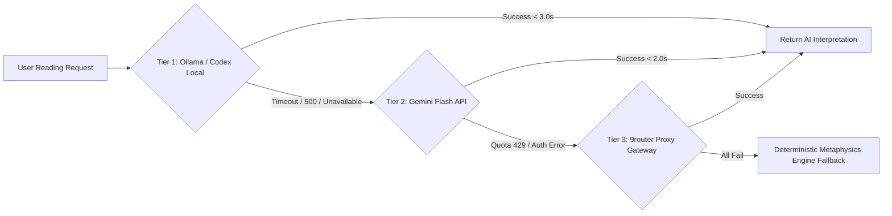

<!-- QOBS-01-GRILL:START -->
## GRILL REPORT — QOBS test-first implementation governance

**Date**: 2026-08-27 (Asia/Bangkok)
**Grilled by**: `orchestrator` with `business_analyst` documentation lane
**Umbrella ticket**: `TICKET-ALIAS-RC2-004-QOBS-01`
**Gate status**: `APPROVED — READY_FOR_TEST_BASELINE ONLY`
**Owner confirmation**: the owner's `continue` instruction confirmed this
bounded QOBS remediation after the orchestrator stated that QOBS must be
implemented before four-alias execution.
**Root runtime proof**: `ROOT-RUNTIME-PROOF-20260827-QOBS-01` — the root
orchestrator verified the active platform runtime as `gpt-5.6-sol` with
reasoning effort `medium` before this planning handoff. This reference contains
no account-home, credential, or secret path and is not reusable as proof for a
later executable lane; Rule 18/Rule 11 evidence must be fresh at every handoff.

### D1 — Scope boundary

- **IN**: test-first QOBS contract, content-free quota probe, dispatcher
  consumption and receipt-v2 binding, scheduler fail-closed integration,
  focused/full QA, authoritative Rule 17/18 and skill/template updates, then
  ecosystem sync/check.
- **OUT**: provider or alias invocation; deploy, publish, push, PR/merge,
  credentials, secrets, account mutation, production mutation, raw provider
  streams, and any work outside the exact lane ownership recorded on the board.
- **Compatibility**: DispatchDecision v1 remains legacy/non-executable for
  QOBS-bound execution; receipt-v1 history is not reinterpreted; receipt-v2
  stays canonical for new governed execution.

### D2 — Requirement delta

- Reconcile the prior six-part frozen QOBS outline into one auditable umbrella
  mutation ticket with six ownership-scoped child lanes.
- Add the missing committed test-only baseline before all source coding; combine
  final QA, governance documentation, and generated ecosystem sync into the
  last lane after source freeze.
- Preserve `TICKET-ALIAS-RC2-003` and `RC2-004` history and blockers; no old
  attempt, authorization, receipt, or quota state is reopened.

### D3 — Acceptance criteria

| # | Criterion | Verification | Owner |
|---|---|---|---|
| 1 | A test-only baseline commit freezes both new QOBS tests and one closed provenance manifest, with a recorded red run or explicit negative control. | `python3 scripts/test_provenance_guard.py staged`; baseline pytest command; Git inspection | `qa_tester` |
| 2 | Closed Draft 2020-12 contracts and pinned policy reject malformed, non-finite, stale/future, replayed, contradictory, or provenance-mismatched observations. | focused schema/contract pytest | `developer` / `qa_tester` |
| 3 | Probe retains only typed, content-free evidence and never dispatches or retries. | focused probe/integration pytest | `developer` / `qa_tester` |
| 4 | Dispatcher atomically consumes the exact nonce and binds receipt-v2 transitively without v1 or copied-band fallback. | focused dispatch/integration pytest | `developer` / `qa_tester` |
| 5 | Scheduler rejects all contradictions before selection/reservation and applies Rule 11 only after QOBS gates pass. | focused scheduler/integration pytest | `developer` / `qa_tester` |
| 6 | Frozen-test hashes, source trailers, focused/full regression, governance sources, generated mirrors, and ecosystem sync/check all pass. | provenance guard, pytest, `sync_ai_agent_ecosystem.py --sync/--check`, Git review | `qa_tester` / `business_analyst` / `code_reviewer` |

### D4 — Constraints and safeguards

- Locked dependencies and Kaggle accelerator are unchanged; no dependency,
  notebook, deployment, or infrastructure mutation is in scope.
- Subprocess logs use only `[OK]`, `[ERROR]`, `[WARNING]`, and `[INFO]` tags.
- No secret, credential, raw provider output, account-home path, executable
  content, or unsanitized exception may be persisted.
- Tests are immutable after the baseline commit. A wrong frozen test stops all
  source lanes and requires an independently reviewed, test-only superseding
  baseline; it may never be silently edited, amended, squashed, or weakened.

### D5 — Agent allocation and dependency graph

Six isolated lanes execute serially:
`TEST-BASELINE -> CONTRACT -> PROBE -> DISPATCH -> SCHEDULER -> QA/GOVERNANCE+SYNC`.
Each lane has one editor, exact ownership, predecessor freeze, and a fresh Rule
18 decision plus Rule 11 snapshot before dispatch. The root orchestrator remains
coordination-only.

### D6 — Assumption register

| # | Assumption | Status |
|---|---|---|
| 1 | The owner-approved outcome is the bounded QOBS chain needed before any four-alias proof. | `[CONFIRMED]` |
| 2 | The active root runtime was verified as `gpt-5.6-sol/medium` for this planning handoff. | `[CONFIRMED]` |
| 3 | Existing QOBS files/tests do not yet constitute a committed test-first baseline for this umbrella ticket. | `[CONFIRMED]` |
| 4 | QOBS completion alone does not authorize `codex1`, `codex2`, `agy1`, or `agy2`. | `[CONFIRMED]` |
| 5 | The exact baseline SHA is unavailable until the test-only commit exists. | `[CONFIRMED: <PENDING_TEST_BASELINE_COMMIT_SHA>]` |

### D7 — Risk and rollback

- **Primary risks**: TDD reconstruction, test mutation after seeing source,
  nonce replay, quota-state contradiction, sensitive path/output retention,
  receipt-v1 fallback, scheduler selection before validation, and generated
  mirror drift.
- **Rollback**: stop at the first failed gate and revert only the failing
  source/governance commit while retaining the immutable baseline and evidence.
  A defective frozen test uses an additive superseding baseline, never history
  rewrite. No external state exists to roll back under this plan.

### D8 — Model/effort and cost strategy

- Root planning proof is `gpt-5.6-sol/medium`; every implementation lane must
  independently satisfy adaptive model-effort routing and quota evidence.
- Use bounded focused tests first, trimmed ASCII failure evidence, short leases,
  and no speculative provider calls. Severity/decision blockers escalate
  through the governed deep-reasoning lane only with fresh evidence.

### D9 — Metaphysics/domain check

- No BaZi, Zi Wei Dou Shu, Qi Men, I Ching, Feng Shui, Western, Vedic, or other
  metaphysical interpretation engine is touched. Domain HITL routing is not
  applicable; orchestration/security HITL remains fail-closed where required.

### Test-first execution contract

1. Stage only `tests/test_quota_observation_contract.py`,
   `tests/test_quota_observation_integration.py`, and
   `plans/test_provenance/ticket-alias-rc2-004-qobs-01.json`.
2. Run the manifest-recorded red/negative-control pytest command, then
   `python3 scripts/test_provenance_guard.py staged`.
3. Commit that test-only baseline. Replace
   `<PENDING_TEST_BASELINE_COMMIT_SHA>` with the exact full SHA and verify:
   `python3 scripts/test_provenance_guard.py verify --manifest plans/test_provenance/ticket-alias-rc2-004-qobs-01.json --baseline <PENDING_TEST_BASELINE_COMMIT_SHA> --head HEAD`.
4. Before every later source/governance commit, run
   `python3 scripts/test_provenance_guard.py staged`; every such commit must
   carry the exact trailer `Test-Baseline: <PENDING_TEST_BASELINE_COMMIT_SHA>`.
5. After source freeze, run focused then applicable full regression, execute
   `python3 scripts/sync_ai_agent_ecosystem.py --sync`, then
   `python3 scripts/sync_ai_agent_ecosystem.py --check`, rerun provenance with
   `--include-worktree`, and complete read-only Git/code review.

**Current stop condition**: documentation governance is complete only to
`READY_FOR_TEST_BASELINE`. No source implementation, QA claim, provider action,
sync, deploy, publish, push, secret, or account action is authorized or claimed.
<!-- QOBS-01-GRILL:END -->

---

<!-- PROD-503-HANDOFF:START -->
## Production 503 Recovery and Concern Closure Plan

**Date**: 2026-08-27 (Asia/Bangkok)
**Status**: `PR #2 MERGED / VERCEL LIVE + VERIFIED / HF + POST-MERGE CI GATED`

### Goal and scope

- Restore the canonical Vercel gateway without changing the healthy HF Docker
  backend or fabricating a fallback.
- Preserve test-first Git history, including a governed superseding baseline
  when the first payload-mode test was proven wrong.
- Close release-gate drift in payload modes, canonical metadata, mobile visual
  behavior, and HF runtime identity.
- Exclude HF publish from the completed Vercel release; it remains a separate
  exact-target external gate.

### Root causes and implemented solution

1. Vercel production had no `HF_BACKEND_URL`, so the gateway correctly failed
   closed with `backend_not_configured` and HTTP 503. Add the canonical public
   backend origin only to production and redeploy the exact merged deployment.
2. The HF payload selected 14 historical `100755` scripts while the frozen
   manifest requires regular `100644` source/staged modes. Preserve that
   contract and normalize only Git modes; do not weaken schema provenance.
3. `stamp_version.py` rewrote canonical metadata into legacy
   `commit/timestamp/status`. Emit the exact five-field immutable source
   identity and stamp mirrored UI version surfaces from one committed source.
4. Mobile interpretation tabs and long V3 content were clipped; the chevron
   contrast was below WCAG AA. Allow tab wrapping, raise the expanded-content
   ceiling, and use a darker accessible red.
5. HF runtime images lack provider commit env and `.git`. Use baked metadata
   only as a final fallback after validating its closed schema, source binding,
   and SHA-256 digest; tampered metadata returns `unknown`.
6. Unused Vercel Preview deployments were still attempted on every non-main
   push. Freeze the failure in test-only baseline `062289e`, disable automatic
   Git deployment for `*`, and explicitly retain it for production `main`.
7. Once the canonical schema became live, the full suite exposed one stale
   network test that still required `commit/timestamp`; the live E2E runner also
   accepted missing identity fields. Preserve red baseline `2b195a6`, correct
   only the stale test contract, and harden the runner before restoring main CI.

### Evidence and release boundary

- Live: PR `#2` merged as `85428c8`; Vercel deployment
  `dpl_FWVpyuKbY9iWs2rrVxEGKmmp8Qm4` is Ready and aliased. `/health` is 200;
  LuoPan is `8/8`; canonical version/UI consistency passes; five-viewport audit
  is `5/5` with zero overflow, overlap, clipping, bounds, or contrast findings.
- Local: final full reviewer returned `READY_FOR_PROD` with `1288 passed`; the
  focused release suite passed `73`; Docker dry-run, ecosystem synchronization,
  aggregate provenance, secret scan, and the deterministic five-viewport visual
  audit are green.
- Rollback: Vercel env ID `gTpSlwb3RL3Fr94e`; immediate prior deployment
  `dpl_2gEijnyqedG1Bn2XVcWZvWJ6amaZ`.
- Remote review: PR `#2` is merged. Main lint, ecosystem, Rust, provenance, and
  live E2E gates pass, but runs `33054316810` and `33054316732` block on one
  stale legacy-field network test after the canonical schema became live.
- Preview retirement: the Vercel notification was canceled because local
  commits are cryptographically unverified, not because the build failed. The
  two canceled artifacts were removed, production stayed `READY`, and the
  branch policy now prevents future non-main auto-deployments after merge.
- TDD review: the aggregate guard caught abbreviated `062289e` source/doc
  trailers before push. The rejected lineage is preserved on
  `evidence/prod-503-preview-trailer-caught-20260827`; the corrected lineage
  retains the same test-only baseline and exact full-SHA source trailers.
- Post-merge correction: baseline `2b195a6` preserved `3 failed, 5 passed` before
  source commit `45c635e`; focused QA now passes `8`. A separate review/CI merge
  gate is required before main is green again.
- Pending: post-merge correction review, owner-gated HF Docker publish, and exact
  live backend identity verification.

### Safe resume order

1. Route the isolated post-merge test/E2E correction through required provenance,
   reviewer, and remote CI; do not push directly to `main`.
2. Publish the canonical HF Docker target only through its owner-gated release
   workflow, then require `/health` commit/version to equal the stamped source.
3. Close `TICKET-PROD-503-001F` only when main CI and both live targets are exact
   and green.
<!-- PROD-503-HANDOFF:END -->

---

<!-- TPG-GRILL:START -->
## GRILL REPORT — Test-First Git Provenance

**Date**: 2026-08-27 (Asia/Bangkok)
**Gate status**: `IMPLEMENTATION + LOCAL/REMOTE QA PASS / REQUIRED CHECK PASS / PR OPEN — NOT MERGED`
**Decision authority**: user-approved implementation plan and follow-up
authorization for root execution when governed delegation cannot produce a
native pre-spawn receipt, exact authorization to push the feature branch and
activate the repository required-check ruleset, and the subsequent `continue`
instruction authorizing PR creation plus bounded clean-checkout CI remediation.

### Goal and acceptance

- Preserve the original dirty work without rewriting its provenance; label it
  `NON_TDD_RECONSTRUCTED`.
- Require a committed test-only baseline with hashes and red/negative-control
  evidence before source coding.
- Reject mixed source/test commits, frozen-test mutation, untracked tests,
  invalid ancestry/hashes, missing trailers, and unreviewed correction paths.
- Keep the local hook read-only and make CI plus final Git review authoritative.
- Retain `DSG-009A` as blocked; repository policy is not native runtime proof.

### Locked decisions

- Enforcement: local read-only hook plus required CI.
- Current mixed work: recovery branch, no retroactive TDD claim.
- Wrong frozen test: stop source work and use a test-only superseding baseline.
- External actions: the initial implementation session excluded push and
  GitHub mutation. Follow-up authorization covered only pushing
  `feature/test-provenance-gate` and activating the exact `Test Provenance`
  required check for `main`. A later `continue` authorized PR creation and the
  minimum test-first remediation needed to obtain authoritative remote CI. It
  did not authorize merge, deployment, provider/AGY execution, secret action,
  or production mutation.

### Evidence sequence

1. Recovery commit `ebfeee9` preserves the pre-gate worktree.
2. Baseline commit `b84989d` contains only the frozen contract test and manifest.
3. Baseline red run returned `15 failed, 2 passed`; the first implementation
   reached `17 passed` without changing that test.
4. The actual `.git/hooks/pre-commit` copy injected eight version files into
   `175545a`. That commit is preserved on
   `evidence/mutating-precommit-caught-20260827`; the clean implementation was
   rebuilt from the baseline as `f012519`, and `core.hooksPath=.githooks` now
   selects the read-only hook.
5. Ecosystem baseline `11ff774` recorded `2 failed` before sync. Commit
   `49f81bf` changed only the two generated Antigravity skill mirrors and the
   full ecosystem check now passes.
6. Full QA initially returned `1269 passed / 6 failed`, exposing that a new
   standalone workflow violated the exact reviewed inventory. Source work
   stopped; test-only baseline `4e13490` explicitly superseded `b84989d`, then
   commit `83ce2a0` embedded the job in `ci.yml` without weakening inventory
   assertions.
7. Final full QA passed `1275` with `12` warnings. Secret scan passed `0/1,954`,
   aggregate history verified both active baselines plus the preserved cutoff,
   and code reviewer returned `READY_FOR_PROD` with exact ticket/baseline/
   manifest binding.
8. `feature/test-provenance-gate` was pushed and independently read back at
   `77e373ab41adf32ee18d552e8e214c1eb09fa324`.
9. GitHub ruleset `Require Test Provenance` (`21626253`) is active on
   `refs/heads/main`. Effective-rules read-back confirms exact required context
   `Test Provenance`, strict mode, no bypass actors, and
   `current_user_can_bypass: never`.
10. PR `#1` was opened without auto-merge. Its first clean Linux run exposed
    15 failures: shallow history broke nine release-provenance checks, four
    provider unit tests depended on a host `codex` executable, five referenced
    visual-evidence images were ignored, and the recovery ref was local-only.
11. Source work stopped. Test-only baseline `4c08782` recorded
    `3 failed, 4 passed` and froze two test files plus five canonical screenshot
    artifacts. Source commits `ef3557c` and `f759004` then separated overlapping
    baseline ownership. Their final tree matched the pre-split tree byte for
    byte; local full QA passed `1278` with 12 warnings and aggregate provenance
    verified 10 test files across four baseline records.
12. Atomic push created remote recovery ref `ebfeee9` and advanced the feature
    branch to `f759004`. Both remote full-suite jobs restored and verified the
    immutable recovery ref.
13. GitHub Unified CI run `33043972950` and AI Safety run `33043972995` passed.
    Required job `Test Provenance` (`98423605962`) passed and uploaded an
    artifact with `status: PASSED`, `issues: []`, four baselines, and 10 frozen
    test files. Vercel preview alone reports `Canceled from the Vercel
    Dashboard`; it is not required by ruleset `21626253`. PR `#1` remains open
    and unmerged.

### Rollback

Branches and commits are additive. Revert the owned implementation commits
while retaining immutable/superseded baselines, the recovery branch, and the
mutating-hook evidence branch as audit evidence. Ruleset `21626253` is the
isolated remote rollback target; changing or deleting it requires fresh exact
authorization.
<!-- TPG-GRILL:END -->

---

<!-- MAREF-C0-GRILL:START -->
## GRILL REPORT — Multi-agent Control Plane C0 Architecture Freeze

**Date**: 2026-08-26 (Asia/Bangkok)
**Grilled By**: `orchestrator` / `business_analyst`
**Gate Status**: `C0 FREEZE PASS — TWO INDEPENDENT REVIEWS`;
`MAREF-010 READY — NW-SESSION-001 CHILD GRANT REQUIRED`; `MAREF-011+ BLOCKED`
**Authority**: current-root-session Parent Grant for frozen `MAREF-000..055`
in-workspace mutations through bounded derived child grants only. It excludes
MAREF-056, external/paid/secret/destructive/Git/deploy/publish actions, force
bypass and root direct implementation.

### D1 — Scope Boundary

- **IN**: architecture facts/decisions, active-platform matrix, session grant,
  PostgreSQL/SQLite, CP Authority/eventual-read, REST/SSE/OpenAI-WS and modular-
  monolith boundaries, C0-C5 DAG and detailed acceptance/evidence/stop tickets.
- **OUT**: source, schemas, tests, rules, skills, generated files, configs,
  dependencies, artifacts, Git/external/production mutation and frozen v3
  history. Existing dirty work is preserved.
- **Stability**: Result Contract v2 remains active for at least two production
  releases and 90 days after MAREF-057 final authority acceptance, whichever is
  later; historical verifiers remain for record lifetime.
- **Authorization**: the architecture handoff remains design input only.
  Current-session native-fallback parent waiver `NW-SESSION-001` covers
  `MAREF-010..055` in-workspace only when the selected governed alias is
  unavailable for the same objective/scope-binding/receipt limitation. Every
  use requires an exact, single-use, one-ticket child and independent review.
  Planned child `NW-SESSION-001/MAREF-010/1` is unissued and limited to the
  lifecycle-contract action and
  `docs/architecture/multiagent-control-plane/contracts/lifecycle-v1.md`, with
  native `business_analyst` intent `gpt-5.6-sol/xhigh`, a frozen-input scope
  digest, `max_uses=1`, and this root-session expiry. No execution has occurred.
  Approval was recorded at `2026-08-26T12:11:01+07:00` and binds canonical
  session `current runtime-enforced collaboration root thread /root`; no opaque
  provider/session ID is inferred.
  MAREF-011+, external actions and cutover remain unauthorized/blocked.

### D2 — Requirement Delta

Target authority changes from snapshots/local claims/copied gate booleans to one
ControlPlane command handler backed by PostgreSQL transactional append-only
events, projections and outbox. SQLite WAL is single-host dev/test only.
Workers/providers/transports submit proposals/evidence and cannot transition
canonical state. Authority is CP under `No Authority -> No Mutation -> No New
Lease -> No New Approval -> No Blind Retry`; eventual reads expose staleness.
Implementation starts as Domain/Application/Ports/Adapters modules with one
composition root/handler in the HF Docker unit. Outbox polling plus SSE needs no
Redis/Kafka/NATS or mandatory internal network hop through C5.

### D3 — Acceptance Criteria

| Criterion | Verification | Owner |
|---|---|---|
| C0 current facts and target decisions are separate and repository-cited | [C0 package](../docs/architecture/multiagent-control-plane/README.md) | `business_analyst` |
| Every active platform has capability/fallback/authority/conformance disposition | [matrix](../docs/architecture/multiagent-control-plane/platform-capability-matrix.md) | `business_analyst` / `qa_tester` |
| Every MAREF ticket has severity, effort, owner, exact ownership, status/dependencies, acceptance, evidence and stop | [DAG/registers](../docs/architecture/multiagent-control-plane/sprint-dag.md) | `orchestrator` / `business_analyst` |
| Shared dirty docs retain all prior content and scoped diff is clean | `git diff --check` plus scoped diff/status | `business_analyst` |
| Two independent reviews freeze the reconciled nine-ADR package without releasing C1 | security/architecture and structural native WorkResults plus reviewed digest set | `code_reviewer` / `orchestrator` |

### D4 — Constraints and Safeguards

Rules 05/06/07/08/11/14/17/18/19 apply. Production is HF Docker backend plus
Vercel static UI. Fly.io, public Azure, HF Static backend, direct browser
provider keys and Realtime/WebRTC are excluded/prohibited. No secret values are
recorded and zero-cost policy remains fail-closed. No initial broker is a
hidden dependency. No PostgreSQL or optional WS package/version is selected in
C0; future sequential lanes must pin direct dependencies consistently.

### D5 — Allocation and Dependencies

`C0 -> C1 contracts -> C2 core -> C3 adapters -> C4 approval/effect Saga -> C5
shadow/cutover`. QOBS retains dispatcher/scheduler ownership until source/QA
freeze. Ticket39 retains `project/hitl_router.py` until mandatory scope audit,
owner sign-off and QA freeze. C2 uses literal Domain/Application/Ports/Adapters
packages plus `bootstrap.py`; C5 migration is isolated. One editor owns every
file/module. MAREF-013 precedes 041; MAREF-025 precedes 052; MAREF-021 manifest
edits freeze before conditional MAREF-035 manifest edits.

### D6 — Assumption Register

| Assumption | State |
|---|---|
| Multi-host target; tenant=`system` until authenticated tenant identity exists | `CONFIRMED` |
| Execution, Approval and Lease are orthogonal; CAS/idempotency/DB attempts/fences mandatory | `CONFIRMED` |
| Session ends on new root session, `/clear`, app/process restart; unchanged authenticated-session WS reconnect alone does not | `CONFIRMED` |
| Lease profile TTL 120s, renew by 40s, DB clock, no grace; telemetry-tune before production | `CONFIRMED-PROVISIONAL` |
| Authority Plane is CP; eventual reads expose version/sequence/authority epoch/read time/lag | `CONFIRMED` |
| Modular-monolith-first, one composition root/handler; no initial broker/internal network hop | `CONFIRMED` |
| No direct PostgreSQL driver is declared; Supabase REST is insufficient for transactions/`SKIP LOCKED` | `CONFIRMED-CURRENT-FACT` |
| PostgreSQL driver/pool and optional WS direct pins are future sequential ticket choices | `CONFIRMED-LATE-BOUND` |
| Planning floor `gpt-5.6-sol/xhigh`; normal rank-3 implementation/security `gpt-5.6-sol/high` | `CONFIRMED`; static config is intent only |

No C0 question remains open. Package versions and exact production target/argv
are intentionally late-bound; missing values keep MAREF-021/035/056/057 blocked.

### D7 — Risk and Rollback

Use CAS/fencing against stale workers, disclosed stale reads, durable-before-202
acceptance, session-bound grants, exact E0→P0 through E4→P4 gates and reject
unknown/ambiguous effects to `NEEDS_HITL`. Migration uses effect-free shadow,
checksum-locked monotonic expand/contract steps, one migrator lock, immutable
manifests and monotonic `authority_epoch`; no dual authority or history deletion.
Failing executions compensate before terminalization; post-terminal remediation
is a new linked execution. Cutover and rollback/restoration drill use separate
fresh P4 grants, and no concrete production argv exists before late binding.

### D8 — Model, Quota and Cost

Every executable lane still needs a fresh bound Rule 18 decision, valid QOBS/
quota, child grant, ownership reservation and receipt. Config/model labels do
not prove execution. Paid/billing routes are outside this grant.

This bounded planning-metadata reconciliation records Rule18 v1 input:
`ticket=MAREF-005-C0-FREEZE-EVIDENCE`, `phase=planning`, semantic ranks
`scope=1/complexity=1/risk=1/ambiguity=0/evidence_burden=2`,
`quota_band=unknown` (permitted only for this bounded below-threshold scope),
`work_mode=mutation`, configured intent `codex1` / `gpt-5.6-sol` / `xhigh`,
policy `2026-08-26.1`, `planning_to_medium_confirmed=true`, and
`hitl_approved=true`. Native collaboration supplied WorkResults; no governed
alias/provider execution or ExecutionReceipt is claimed.

The MAREF-010 mutation decision validated with digest
`cb2cf84444b699a642969e5fb4be43829d39548b87b66531ab8f87fff5b01d6d`.
Candidate scheduling snapshot digest
`5611f252f987aef0e6f5c54c0d60e19d0aacce2cc110e5ba3d2989a4934fc39b`
is explicitly candidate/non-live. The only approved runtime config is
read-only/high; mutation mode does not enforce that approved config, and its
objective remains unbound arbitrary CLI text. A self-declared temporary
approval is prohibited. No alias executed and no lifecycle file exists.

`NW-SESSION-001` is the approved native-fallback parent waiver, not an issued
implementation child. It expressly accepts the absence of an alias/provider
ExecutionReceipt for an issued native child, while preserving native
WorkResult, scoped diff/evidence, independent review, dependency, ownership and
Rule 18 gates. The alternative governed path remains QOBS/MAREF-033 binding.
Neither path has executed MAREF-010 yet.

Every numbered MAREF-010..055 completion requires a separately delegated,
single-use, post-PASS local-commit child restricted to the independently
reviewed ticket files/hunks. Its implementation WorkResult must already be
`DONE` and review must be `PASS`; `BLOCKED`, `NEEDS_HITL`, unrelated dirty
content, automatic push and root commit/implementation are prohibited. This
waiver-record support mutation is not a numbered MAREF completion and receives
no commit.

### D9 — Domain/HITL Impact

No metaphysical formula changes. C4 changes HITL/export/index/training effects;
`required_human_review=true` and
`/hitl/scope-audit?source_domain=metaphysical-domain-engine` with
`summary.pass_gate_check=true` plus owner sign-off are mandatory. P0-P4 apply;
`NEEDS_HITL` freezes E2-E4 and auto/forced training stays blocked until Saga.

### C0 Verdict

`DONE — C0 FREEZE PASS, DOCUMENTATION EVIDENCE ONLY`. The independent
security/architecture and structural reviews both returned `PASS`. Their
reviewed pre-reconciliation 21-path digest-set manifest is recorded in
[tickets/c0.md](../docs/architecture/multiagent-control-plane/tickets/c0.md)
with aggregate SHA-256
`74db1fe74fe9b3a59a24b34cad6bb318d89259dcf7105ca6759ea6fb0610d673`.
The structural result records 39 rows/IDs, 100 internal dependency edges, zero
cycles, missing dependencies, metadata mismatches or relative-link failures,
nine ADRs and a clean scoped diff. MAREF-010 is `READY — NW-SESSION-001 CHILD
GRANT REQUIRED`; its validated decision and candidate snapshot do not prove
execution, and no child has been issued. MAREF-011+ and every source/schema lane
remain blocked.

<!-- MAREF-C0-GRILL:END -->

## GRILL REPORT — Release Completion
**Date**: 2026-08-26
**Grilled By**: `orchestrator` / `business_analyst`
**Gate Status**: APPROVED — the user explicitly authorized completion of current governed plans/tickets, a safe commit and push to `origin/main`, and deployment. This gate approves planning and reservation; it does not bypass any audit, test, secret, review, or external-mutation gate.
**Authoritative Policy**: Rule 11, Rule 18 decision validation, Rule 05 security/privacy, Rule 06 secrets, Rule 07 infrastructure constraints, and the release skills.

### D1 — Scope Boundary
- **IN**: current governed working-tree changes and active/current-session tickets; exact R3 acceptance reconciliation; dispatcher preflight, deployment architecture, Docker publisher provenance/atomicity, and documentation remediation plans; ticket/documentation reconciliation; relevant/full QA; secret scan; payload dry-run; reviewer verdict; safe commit/push; HF publish; live health/version and E2E/visual verification; final closure.
- **OUT**: unrelated destructive cleanup, broad reset, secret/credential disclosure or mutation, deployment to unapproved targets, API/schema/source refactors outside an owning remediation ticket, and manual generated-file edits.
- **Interfaces**: retain receipt-v2 canonical/new-only and receipt-v1 legacy/non-reinterpreted behavior; public outcomes remain validated in-process with elided streams, not portable/offline evidence.

### D2 — Requirement Delta
- R3 acceptance is now operationally accepted: A only Rule 11, B only the prompt template, and child only the orchestration skill; the root barrier observed root/A/B/child running before release, with a `17,918,884,250 ns` triple overlap, forwarded child result, equal safe fingerprint marker, and no changed files.
- Audit-confirmed target assumption: Hugging Face Docker backend `pphothidaen/horoconsultant-core-backend` plus Vercel static UI. Static deployment to that backend Space is retired; Azure public auto-deploy and Fly manual deployment are prohibited.
- The scope audit found three pre-QA remediation groups: dispatcher session-preflight security/provenance, deployment architecture CI/governance, and Docker publisher metadata/provenance/dry-run/rollback atomicity. Router and data changes are preserved but excluded pending provenance/owner decisions.

### D3 — Acceptance Criteria
| # | Criterion | Verification | Owner |
|---|---|---|---|
| 1 | Dispatcher plan removes marker/mtime-as-active, path/non-ASCII disclosure, and role broadening | developer plan then owned tests | `developer` / `qa_tester` |
| 2 | Deployment plan retires static-to-backend publishing and neutralizes Azure/Fly release paths without history deletion | workflow/rule/skill plans | `developer` / `business_analyst` |
| 3 | Docker publisher plan binds metadata/provenance and dry-run/rollback atomically | publisher plan then owned tests | `developer` / `qa_tester` |
| 4 | Router/data are excluded and preserved until provenance/ownership decisions | scope evidence and blocked tickets | `developer` / `business_analyst` |
| 5 | An isolated clean-checkout gate runs the relevant/full QA and Docker package dry-run after every source/docs freeze; then secret scan, review, safe commit/push, Docker HF publish, health/version, and Vercel UI E2E/visual gates pass sequentially | per-ticket fresh evidence | designated release owners |

### D4 — Constraints & Safeguards
- Current branch is `main`; configured remote is `origin`; the canonical production pair is HF Docker backend plus Vercel static UI. The worktree is dirty and no staged changes were observed at the planning audit; no clean-up or overwrite is authorized.
- Do not disclose or modify secrets. Fly.io remains removed and Azure ingress is blocked; no alternate target may be substituted.
- The first two audit lanes are read-only and independent. All external mutations are `BLOCKED` until their declared dependencies, quota/HITL conditions, and evidence gates pass.

### D5 — Allocation and Dependency Chain
- Completed audits: `...-01-SCOPE` classified three remediation groups and router/data exclusions; `...-02-TARGET` confirmed `origin/main`, HF Docker backend, Vercel UI, and Azure/Fly prohibition.
- Dispatcher17/18/37, workflows19/21D/27, governance20/28/28R2, source/QA tickets29–38 and40A–41B, publisher21A/21B/22A, and the 21D/41A/41B corrections are frozen with their recorded evidence. Workflow21D remains bound to SHA-256 `276899e3dd6cec5531b3eb97e731f096a8998b08ec8830c81237c31b17dbf0a0`; publisher core21A remains bound to SHA-256 `3483b2df51fb2b6e2127ed286c58b733ae9cb73855397c6f6d9cf33da3601da0`. Ticket21C is deliberately deferred until ticket45 creates the immutable source identity; ticket22 then performs final metadata-aware publisher QA. Ticket39 remains HITL-blocked, and tickets42/43 plus their QA are post-source packaging work excluded from ticket45.
- Then each source freeze releases its separate QA: `19 -> 27`, `21A + 21B + 21C + 21D -> 22`, `29 -> 33` (with 21C before live green), `30 -> 34`, `31 -> 35`, `32 -> 36`, then docs `23`, isolated clean-checkout gate `26`, release package/review, and only then external gates `08` through `12`.
- `TICKET-AGY1-SMOKE-20260826-R3` remains an independent fresh-decision gate; acceptance R3 does not authorize its execution or a different provider route.
- **Superseding rolling handoff**: ticket44 attempt-1 is immutable `BLOCKED`: commands1/2 passed `151`/`70`, command3 used stale `project/tests/test_hf_release_governance.py`, exited `4`, and collected no tests; inventory digest `f372695e92ff025edccc35f47007ce53cea275b39d34c7c1c55c73c026a6889e` did not change. Rule 11 now selects ticket44R2 with only command3 corrected to `tests/test_hf_release_governance.py`. The strict sequence is `frozen source/QA -> 44R2 -> 45 -> 21C -> 22 -> later packaging commit/push`. RC2-004 remains separate `BLOCKED/NEEDS_HITL` because quota is unknown.

### D6 — Assumption Register
| # | Assumption | Status |
|---|---|---|
| 1 | User authorization covers release planning and later target-scoped external actions only after all gates | `[CONFIRMED]` |
| 2 | `origin/main` is the provisional push target | `[CONFIRMED]`; local target audit completed; push still needs final re-verification |
| 3 | Canonical production is HF Docker backend `pphothidaen/horoconsultant-core-backend` plus Vercel static UI | `[CONFIRMED]`; static deployment to that backend Space is retired pending owned remediation |
| 4 | Dirty tracked/untracked files are not safe to commit until scope/provenance audit classifies each item | `[CONFIRMED]`; router/data are explicitly excluded and preserved |
| 5 | R3 acceptance result is complete and sanitized | `[CONFIRMED]`; [`evidence_multiagent_acceptance_20260826_r3.json`](../project/tests/artifacts/priority_scheduling/evidence_multiagent_acceptance_20260826_r3.json) is authoritative |
| 6 | No metaphysical computation or interpretation is part of this release plan | `[CONFIRMED]` |

### D7 — Risk and Rollback
- **Risk**: concurrent dirty work is accidentally included or overwritten. **Mitigation**: scope/provenance audit and source freeze before staging; `project/api_router.py` and the two data files remain blocked/excluded; no cleanup/reset.
- **Risk**: session marker existence/mtime is mistaken for authenticated authority or emits unsafe diagnostics. **Mitigation**: dispatcher/config plan before any source mutation, then owned QA.
- **Risk**: CI or publisher still chooses Azure/Fly/static-to-backend paths. **Mitigation**: disjoint workflow, governance, and publisher plans before QA; no history deletion.
- **Risk**: a local pass is mistaken for deployment evidence. **Mitigation**: separate QA, package, review, push, publish, health/version, and UI/visual gates.
- **Risk**: external mutation has an unsafe target. **Mitigation**: target audit and explicit target-bound ticket before each mutation.
- **Rollback**: revert only the exact later release commit (`git revert <release-commit>`) and restore the HF Space to its recorded prior revision; preserve unrelated work.

### D8 — Token and Capacity Strategy
- At this checkpoint only root coordination, BSA reconciliation, and the reserved read-only ticket44R2 lane are useful. All earlier publisher/workflow/diagnostic editors are frozen. Ticket45 is a separate future mutation lane, and ticket21C, final QA22, docs/skill packaging, clean-checkout, push, deploy, and external verification remain blocked behind it.
- Trim test/release logs to commands, exit statuses, summaries, and non-secret evidence. Do not retain raw provider streams, credentials, or account identifiers.
- **Superseding Rule 11 checkpoint**: ticket44R2 (`CRITICAL/S`) is reserved under the approved `codex1_gateway_review` read-only sandbox. Decision digest `bc04be568ba08607365d99fd0ec6adfd40f4370e1ed0576675959534df5b3953`; snapshot digest `ab58c0d03d5c5c65e48da8c16d39026ddc2b57fb67b4d4c9eabecd7b7841e427`. Ticket45 remains `BLOCKED` and has no executable decision/snapshot until ticket44R2 is green. Ticket21C stays after ticket45 and may never use dirty `HEAD` or a placeholder.

### Pre-source integration and immutable-source boundary

- Ticket44 attempt-1 evidence is immutable and content-free. Ticket44R2 runs the same exact offline Python/Node/schema/sync/diff matrix recorded in `PROJECT_TASKS.md`, changing only the stale command3 path; it edits nothing and retains concise summaries only.
- The read-only Git inventory maps the current candidate paths to frozen release tickets. Ticket45's exact allowlist and exclusions are authoritative in `PROJECT_TASKS.md`; it must recheck byte-for-path identity immediately before any later staging.
- Ticket45 is a local commit only. It must exclude router/data provenance, HITL/admin files, `project/static/version.json`, `public/version.json`, final QA/docs/skill files, scheduling evidence, and every path absent from the closed allowlist. Any new or unresolved path blocks the ticket.
- After ticket45 records `release_source_commit`, ticket21C may update only the two version mirrors. Those metadata files and later QA/docs/evidence belong to the later `packaging_commit`; push remains ticket08 after all review gates.

### D9 — Domain Scope and HITL
- `source_domain`: governance/release, not `metaphysical-domain-engine`; no metaphysical HITL applies.
- Release HITL is satisfied only to plan/reserve. Each later external mutation still requires its listed prerequisite evidence and target validation.
- Exception: ticket39 touches the HITL router. It is blocked until `required_human_review=true`, `/hitl/scope-audit?source_domain=metaphysical-domain-engine` reports `summary.pass_gate_check=true`, and owner sign-off is recorded; no reservation overrides that gate.

### Blockers
- External mutation tickets are intentionally blocked pending current scope/target audit outputs, source freeze, QA, package, and review gates.

---

## GRILL REPORT — Pre-QA Receipt-v2 Lanes, Alias Smoke Dispatch, Formal QA & Push
**Date**: 2026-08-26T02:14:00+07:00
**Grilled By**: `orchestrator` (Antigravity / Claude Sonnet 4.6 Thinking)
**Gate Status**: ✅ APPROVED — all 9 dimensions confirmed; session HITL recorded without approver identity.
**Authoritative Policy**: `.agents/rules/11-orchestrator-subagent-delegation.md`, `.agents/rules/17-multi-account-agent-orchestration.md`

### D1 — Scope Boundary
- **IN**:
  1. Four `RESERVED` pre-QA lanes executed serially via AGY subagents (orchestrator assigns, subagent owns): validator packaging (`pyproject.toml`/`requirements.txt`/`uv.lock`) → parser/evidence hardening (`scripts/multiagent_prompt_command.py`) → receipt-v2 policy adoption (`.agents/config/multiagent_model_policy.yaml` + `docs/templates/MULTIAGENT_PROMPT_COMMAND.md`) → receipt-v2 AGY condition (receipt-v2 schema only).
  2. Combined formal QA (`TICKET-PRIORITY-003R5`): `python3 -m pytest -q tests/test_multiagent_ticket_scheduler.py tests/test_multiagent_prompt_command.py project/tests/test_claude_governance.py tests/test_multiagent_prompt_command_r4.py` with exit 0.
  3. Alias smoke dispatch (`TICKET-ALIAS-RC2-004`): HITL-gated `codex1` read-only attempt; subsequent aliases (`codex2`/`agy1`/`agy2`) dispatched only if `codex1` returns a valid receipt.
  4. Ecosystem sync: `python3 scripts/sync_ai_agent_ecosystem.py --sync` then `--check`.
  5. Secret scan: `python3 project/core/code_reviewer.py --scan-secrets`.
  6. Single atomic commit of all 50 working-tree changes (29 modified + 21 untracked) with message `feat(orchestration): implement pre-QA receipt-v2 lanes, parser hardening, and formal QA verification`, then push to `origin/main`.
- **OUT**: Application code (`project/api_router.py`, `project/static/version.json`, `project/data/distillation_checklist.json`) must not be included in the commit. No metaphysics, Kaggle, deploy/publish, or release-state mutation. No Codex `.toml` hand-edits. No external retry outside the gated alias sequence.
- **Interface stability**: Receipt-v1 schema and ID remain unchanged. Existing governance file IDs and locked dependency versions are preserved.

### D2 — Requirement Delta
- **Changed**: Four pre-QA source files frozen (per lane ownership); combined formal QA suites updated; ecosystem mirrors re-synced; plans/plan.md and PROJECT_TASKS.md updated with evidence.
- **Cleaned up / Dead code**: None mandated for this session; out-of-scope per D1.

### D3 — Acceptance Criteria
| # | Criterion | Verification | Owner |
|---|---|---|---|
| 1 | All four pre-QA lanes produce frozen source evidence (`py_compile` + scoped diff exit 0 per lane) | Per-lane evidence after implementation | `developer` subagent |
| 2 | Combined formal QA exits 0: `pytest -q tests/test_multiagent_ticket_scheduler.py tests/test_multiagent_prompt_command.py project/tests/test_claude_governance.py tests/test_multiagent_prompt_command_r4.py` | Exact command output | `qa_tester` subagent |
| 3 | `git diff --check` exits 0 for all changed files | `git diff --check HEAD` | `devops` subagent |
| 4 | `python3 project/core/code_reviewer.py --scan-secrets` reports zero leaks | Secret scan output | `devops` subagent |
| 5 | `sync_ai_agent_ecosystem.py --sync` then `--check` both exit 0 with all `[OK]` | Ecosystem sync output | `business_analyst` subagent |
| 6 | `codex1` alias dispatch returns a valid RC2-004/attempt-1 receipt or a typed `NEEDS_HITL` stop | Receipt metadata (content-free) | Orchestrator gate |
| 7 | Single atomic commit created and pushed to `origin/main` with exact message | `git log --oneline -1` | `devops` subagent |

### D4 — Constraints & Safeguards [AUTO]
- **Locked deps**: `transformers==4.44.2`, `peft==0.12.0`, `accelerate>=0.34.0,<1.0.0` — unchanged; validator packaging only adds `jsonschema>=4.23,<5`.
- **Secrets**: 2-Tier Priority Secrets Policy enforced; no secret values in docs, tests, telemetry, or evidence.
- **Kaggle Accelerator**: `NvidiaTeslaT4` locked — not touched.
- **Pure ASCII Logging**: `[OK]`, `[ERROR]`, `[WARNING]`, `[INFO]` only in subprocess outputs.
- **No hand-edit of `.codex/agents/*.toml`**: mirrors only through `sync_ai_agent_ecosystem.py --sync`.
- **No application/release mutation**: `project/api_router.py`, `project/static/version.json`, `project/data/distillation_checklist.json` excluded from commit.

### D5 — Sub-Agent Allocation & Dependencies
| Agent | Role | Dependency |
|---|---|---|
| `developer` subagent | Execute four pre-QA lanes serially; freeze evidence per lane | None; first in chain |
| `qa_tester` subagent | Run combined formal QA after all four lanes freeze | All four lanes `DONE` |
| `devops` subagent | `git diff --check`, secret scan, ecosystem `--sync`/`--check`, atomic commit + push | QA gate `DONE` |
| Orchestrator (root) | Assign, monitor, collect evidence, decide alias dispatch gate | After devops gates pass |

Dependency chain: `developer` (4 serial lanes) → `qa_tester` → `devops` (sync/scan/commit/push) → `orchestrator` alias dispatch gate.

### D6 — Assumption Register
| # | Assumption | Status |
|---|---|---|
| 1 | Four pre-QA lanes have non-overlapping file ownership as documented in plan.md D8.16 | `[CONFIRMED]` |
| 2 | The working tree's 50 uncommitted changes are production-safe governance/orchestration only | `[CONFIRMED — OUT-OF-SCOPE application files excluded from commit]` |
| 3 | `TICKET-ALIAS-RC2-003` remains permanently BLOCKED; RC2-004 begins a fresh counter | `[CONFIRMED]` |
| 4 | Alias dispatch (`codex1` attempt 1 under RC2-004) is HITL-gated; only a valid receipt chains to `codex2` | `[CONFIRMED]` |
| 5 | `sync_ai_agent_ecosystem.py --sync` must run before `--check` because new untracked skill/rule files exist | `[CONFIRMED]` |
| 6 | No metaphysical calculation or interpretation is in scope | `[CONFIRMED]` |

### D7 — Risk & Rollback
- **Risk**: A pre-QA lane introduces a regression. **Mitigation**: formal QA (`TICKET-PRIORITY-003R5`) runs after all four freeze; any exit non-zero blocks the commit.
- **Risk**: Secret scan detects a leak in new schema/config files. **Mitigation**: push is blocked; the offending file is identified and remediated before retry.
- **Risk**: Ecosystem `--sync` modifies generated `.codex/agents/` files unexpectedly. **Mitigation**: `--check` after sync confirms exact alignment; any mismatch blocks commit.
- **Risk**: `codex1` alias dispatch fails with invalid result contract again. **Mitigation**: fail closed as `NEEDS_HITL`; do not chain remaining aliases; document as RC2-004/attempt-1 terminal evidence.
- **Rollback**: `git reset HEAD~1 --soft` reverses the commit without discarding working-tree changes; no production or data rollback required.

### D8 — Token Efficiency Strategy
- **Orchestrator** (root): `Claude Sonnet 4.6 Thinking` / medium effort — orchestration, gating, evidence collection only.
- **Developer subagent** (`inherit`): four serial implementation lanes, each scoped to its owned files.
- **QA subagent** (`inherit`): formal QA execution, trimmed log output only.
- **DevOps subagent** (`inherit`): sync/scan/commit/push, trimmed output.
- **Log trimming**: QA and DevOps trim verbose output; only exit codes and summary counts reported to orchestrator.

### D9 — Metaphysics Domain Alignment
- **Engines involved**: None.
- **HITL review required**: No.
- **Domain scope**: Governance and orchestration only.

### ⚠️ Waivers
- None.

### 🚫 Blockers
- None — all critical dimensions confirmed.

---

## GRILL REPORT — Priority Governance Scheduling
**Date**: 2026-08-25
**Grilled By**: `orchestrator` / `business_analyst`
**Gate Status**: APPROVED — session HITL is recorded without approver identity. AGY native-protocol, receipt-v2 schema, all four High pre-QA remediation lanes, formal R5 QA, and `TICKET-PRIORITY-004R5` final review are complete and frozen. The final review is `READY_FOR_PROD`; the only active lane is sanitized, read-only AGY quota discovery. A separate multi-agent acceptance proof is reserved behind that lane so its three explorer instances can use the complete four-slot budget safely.
**Authoritative Policy**: `.agents/rules/11-orchestrator-subagent-delegation.md`

### D1 — Scope Boundary
- **IN**: Define deterministic scheduling for execution-eligible tickets; mirror it in the orchestrator skill, Claude rule, Antigravity skill, and catalog; create the active plan, sprint, tickets, and checkpoints.
- **OUT**: No hook, script, schema, model-policy YAML, test, application, generated Codex, deployment, secret, or external-system edits by this governance lane. Generated files may change only through the prescribed ecosystem sync.
- **Interface stability**: Existing historical tickets and evidence remain intact. Historical `Priority`-only passages are superseded for current scheduling, not deleted.

### D2 — Requirement Delta
- Replace implicit priority selection with eligibility-first scheduling and an exact total-order comparator.
- Separate delivery-size `Work Effort` from model reasoning effort.
- Make dependency, ownership, quota, HITL, and blocker gates override comparison, with deterministic tie handling and no preemption.

### D3 — Acceptance Criteria
| # | Criterion | Verification | Owner |
|---|---|---|---|
| 1 | Rule 11 defines the sole authoritative eligibility and comparator semantics | direct governance review | `business_analyst` |
| 2 | Mirrors state `CRITICAL > HIGH > MEDIUM > LOW`, then `XS < S < M < L < XL`, then Ticket ID ASCII ascending | cross-file comparison | `business_analyst` / `qa_tester` |
| 3 | Dependency, ownership, quota/HITL, blocker, and invalid-metadata gates run before comparison | governance and enforcement tests | `developer` / `qa_tester` |
| 4 | `Work Effort` cannot be inferred from or changed by model reasoning effort | governance and enforcement tests | `qa_tester` |
| 5 | Active tickets record Severity, Work Effort, model/reasoning effort, dependency order, evidence, and stop condition separately | task-board review | `business_analyst` |
| 6 | Hook/dispatcher enforcement fails closed before child execution | focused tests | `developer` / `qa_tester` |
| 7 | Reviewer and final ecosystem-sync checkpoints close only from fresh evidence | review plus sync/check | `code_reviewer` / `business_analyst` |

### D4 — Constraints & Safeguards
- Preserve unrelated dirty/user work and one-editor ownership.
- Use only `[OK]`, `[ERROR]`, `[WARNING]`, and `[INFO]` in command-facing logs; `[PENDING]` and `[BLOCKED]` below are documentation states, not subprocess log tags.
- Do not manually edit `.codex/agents/*.toml`.
- A missing/invalid Severity or Work Effort and duplicate Ticket ID fail closed as `BLOCKED: INVALID_SCHEDULING_METADATA`.

### D5 — Allocation and Dependency Chain
- `TICKET-PRIORITY-001` (`business_analyst`): governance and documentation.
- `TICKET-PRIORITY-002` (`developer`): hook/dispatcher enforcement after governance and quota validation.
- `TICKET-PRIORITY-003` (`qa_tester`): focused comparator, eligibility, tie, invalid-metadata, and model-effort separation tests.
- `TICKET-PRIORITY-004R5` (`code_reviewer`): `DONE — READY_FOR_PROD`; no Critical/High finding, combined `213` tests plus sync, locked-dependency, secret, and diff checks passed. Wrapper timeout is Medium, with reviewer-recorded Medium/Low residuals retained.
- `TICKET-PRIORITY-002R` (`developer`): approval-gated remediation of the five review findings; complete with bounded local evidence.
- `TICKET-PRIORITY-003R` (`qa_tester`): independent remediation security regression QA; complete and releases `TICKET-PRIORITY-004` for re-review.
- `TICKET-PRIORITY-002R2` (`developer`): `DONE`; one-file bounded source fix, exact regression `1 passed`, claim subset `31 passed, 83 deselected`, and deleted active-entry reacquisition blocked.
- `TICKET-PRIORITY-003R2` (`qa_tester`): `DONE`; exact combined three-suite QA exited `0` with `185 passed in 2.01s` and scoped diff check exited `0`.
- `TICKET-PRIORITY-002R3` (`developer`): `DONE`; dispatcher-only R3 remediation recorded bounded local evidence.
- `TICKET-PRIORITY-003R3` (`qa_tester`): `DONE`; exact three-suite QA exited `0` with `185 passed in 1.79s`, scoped diff exited `0`, and only `tests/test_multiagent_prompt_command.py` changed.
- `TICKET-PRIORITY-003R3E` (`root orchestrator`): `DONE`; the single-use waiver was consumed and expired after sanitized default macOS user-state verification.
- `TICKET-PRIORITY-002R4` (`developer`): `DONE`; bounded remediation evidence is complete.
- `TICKET-PRIORITY-002R5` (`developer`): `DONE`; one-file secure temporary recovery and typed non-PII diagnostic are frozen with supplied local evidence.
- `TICKET-AGY1-SMOKE-20260826-R2` (`developer`): `DONE`; source frozen with native parser/fake-execute evidence, `77` and `118` regression evidence, and two bounded expected legacy failures.
- `TICKET-AGY1-RECEIPT-SCHEMA-20260826-R1` (`developer`): `DONE`; receipt-v2 is new only, receipt-v1 is unchanged, and local schema/parity samples passed.
- `TICKET-AGY1-RECEIPT-VALIDATOR-20260826-R1` (`developer`): `DONE`; isolated explicit validator dependency declaration and lock passed.
- `TICKET-AGY1-DUPLICATE-JSON-20260826-R1` (`developer`): `DONE`; High strict-JSON/parser/evidence hardening passed `188` tests with three intentional obsolete-test deltas.
- `TICKET-AGY1-RECEIPT-V2-ADOPTION-20260826-R1` (`developer`): `DONE`; v2 policy/template adoption passed ecosystem sync/check, `16` focused governance tests, and secret scan.
- `TICKET-AGY1-RECEIPT-V2-AGY-REQUIREMENT-20260826-R1` (`developer`): `DONE`; schema-v2 conditional requirement passed, requiring AGY process/session ID while retaining Codex compatibility and `Z` timestamps.
- `TICKET-PRIORITY-003R5` (`qa_tester`): `DONE`; combined `213` and focused `142` passed; sync, lock, and diff passed; no external AGY action.
- `TICKET-AGY1-EVIDENCE-DOC-20260826-R1` (`business_analyst`): `DONE`; a disjoint governance clarification records that public outcomes are validated in-process only, elided, and not portable/offline evidence bundles.
- `TICKET-AGY1-QUOTA-20260826-R1` (`devops`): `BLOCKED — CONSUMED / SANITIZATION_FAILURE`; one query only, no retry. User-attested safe alias bands supersede it for later routing; no personal/account data is recorded.
- `TICKET-MULTIAGENT-ACCEPTANCE-20260826-R1` (`orchestrator`): `FAILED — CHILD SCOPE OVERLAP`; topology/timing/nonces/fingerprint/no-change evidence passed but the child inspected parent A's Rule 11 scope.
- `TICKET-MULTIAGENT-ACCEPTANCE-20260826-R2` (`orchestrator`): `FAILED — NO EXACT 4/4 PEAK`; exact scopes/nonces/fingerprint/no-change passed, but B ended before the child began.
- `TICKET-MULTIAGENT-ACCEPTANCE-20260826-R3` (`orchestrator`): `DONE`; exact A/B/child scopes and nonces, child-interval triple overlap, root barrier `running` capture, forwarding, equal safe fingerprint, and empty changes passed.
- `TICKET-AGY1-SMOKE-20260826-R3` (`orchestrator`): `BLOCKED — FRESH GATES`; it needs its own fresh alias-specific decision/snapshot. No execution decision exists now.
- `TICKET-PRIORITY-005` (`business_analyst`): final ecosystem sync/check and status reconciliation; superseded by pending Release Completion closure.
- Dependency chain: `001 -> 002 -> 003 -> 002R (fresh HITL) -> 003R -> 004 failed re-review -> 002R2 (fresh HITL, DONE) -> 003R2 (DONE) -> 004 failed final re-review (NEEDS_HITL, NOT READY) -> 002R3 (session HITL, DONE) -> 003R3 (DONE) -> 003R3E (DONE) -> 004 failed R3 re-review -> 002R4 (DONE) -> 002R5 (DONE) -> AGY native-protocol remediation (DONE) + receipt-v2 schema remediation (DONE) -> validator packaging + parser/evidence hardening + v2 adoption + AGY schema condition (all DONE) -> combined formal QA (DONE) -> fresh R5 read-only review (DONE — READY_FOR_PROD) -> sanitized quota discovery (RESERVED) -> multi-agent acceptance proof (PENDING, three-slot window) and one-shot AGY smoke R3 (PENDING, fresh decision/snapshot only) -> 005`. The documentation-evidence boundary is complete and disjoint from QA. Dependencies, quota, ownership, and the total-slot limit override the scheduling comparator at every checkpoint.

### D6 — Inputs, Assumptions, and Blockers
| # | Item | Status |
|---|---|---|
| 1 | In-scope files, exclusions, acceptance criteria, and stop condition were supplied by the owner dispatch | `[CONFIRMED]` |
| 2 | Current lane classification is Severity `CRITICAL`, Work Effort `XL` | `[CONFIRMED]` |
| 3 | `TICKET-PRIORITY-002` implementation evidence is complete: syntax and scoped diff checks exited `0`, governance regression passed `11`, focused dispatcher regression passed `76` with `18` legacy fixtures reserved for QA, and functional scheduler checks passed | `[CONFIRMED]` |
| 4 | `TICKET-PRIORITY-003` QA evidence is complete: baseline `18` missing-snapshot fixture failures were reproduced; the focused regression passed `154` tests in `1.14s`, exit `0`, and scoped diff check exited `0` | `[CONFIRMED]`; QA closure recorded |
| 5 | `TICKET-PRIORITY-004` initially found R3 remediation blockers | `[CONFIRMED]`; `NEEDS_HITL — NOT READY` was remediated through R3 and R3E; the later final R3 review opened R4, which is complete; R5 now blocks formal QA and the final review |
| 6 | No metaphysical calculation or interpretation is in scope | `[CONFIRMED]` |
| 7 | Fresh approval limits R2 mutation work to the recorded bounded scope; final review remains read-only | `[CONFIRMED]`; R2 remediation and independent QA are complete, with the final review reserved |
| 8 | `TICKET-PRIORITY-002R` evidence covers only the four assigned remediation files and local checks: syntax and scoped diff checks exited `0`; focused pytest passed `106` in `1.13s`; five-review-findings and shell-indirection reproductions are `OK` | `[CONFIRMED]`; independent remediation QA remains required |
| 9 | `TICKET-PRIORITY-003R` independently covered all five remediation areas and the fail-closed claim behavior; the combined focused pytest command exited `0` with `173 passed` in `1.53s`, scoped diff check exited `0`, and the Rule 11 matrix was green | `[CONFIRMED]`; releases `TICKET-PRIORITY-004` for reserved re-review |
| 10 | Fresh HITL approval explicitly authorizes the exact second remediation scope and exclusions; prior approval and prior QA evidence remain insufficient to close it | `[CONFIRMED]`; owner recorded `อนุมัติ TICKET-PRIORITY-002R2`, reserving the developer lane only for source remediation and local tests |
| 11 | `TICKET-PRIORITY-002R2` bounded source fix changed one file; its exact regression passed (`1 passed`) and the claim subset passed (`31 passed, 83 deselected`) | `[CONFIRMED]`; deleted active locked entry cannot be reacquired by the same authorization |
| 12 | `TICKET-PRIORITY-003R2` independent QA over the exact three suites exited `0` with `185 passed in 2.01s`; scoped diff check exited `0` | `[CONFIRMED]`; R2 QA closure recorded |
| 13 | Session-scoped approval covers remaining local priority-sprint remediation, QA, read-only review, and final synchronization/reconciliation; it conditionally permits deploy, publish, push, secret/account, external, or destructive actions | `[CONFIRMED]`; no such action is required or used, and any later action requires an exact target plus target-scoped safety gates; approval does not broaden `TICKET-PRIORITY-004` or `TICKET-PRIORITY-005`; no identity retained |
| 14 | Session HITL approval authorizes only the exact R3 local remediation and validation scope | `[CONFIRMED]`; `TICKET-PRIORITY-002R3` is reserved, no identity retained, external actions remain unused and target-gated, and the approval permits bounded workspace-ticket improvement/refactoring/fixes plus removal of explicitly identified obsolete code/tests but never a `/root` glob deletion or broad/unrelated destructive action |
| 15 | R3 scope, exclusions, dependencies, success criteria, and stop condition are supplied by the owner dispatch | `[CONFIRMED]`; only the dispatcher changed; source/tests/hooks/config/generated/external/PII changes are excluded from this documentation handoff; `TICKET-PRIORITY-003R3` independently completed QA |
| 16 | R3 developer evidence is complete | `[CONFIRMED]`; `py_compile` and scoped diff passed; scheduler plus Claude checks passed `71`; focused coverage passed `155` with `30` expected contract failures; all eleven named direct reproductions passed |
| 17 | Default macOS user-state creation could not run under the managed sandbox, while the isolated explicit override worked | `[CONFIRMED]`; `TICKET-PRIORITY-003R3E` is reserved to verify actual default directory derivation, creation, modes, and outside-worktree location; do not infer default-state success from the override |
| 18 | R3 independent QA completed and the follow-up environment gate has an explicit boundary | `[CONFIRMED]`; exact three-suite QA exited `0` with `185 passed in 1.79s`, scoped diff exited `0`, only `tests/test_multiagent_prompt_command.py` changed, and lifecycle/isolated-store/delete-reacquire coverage is green; `TICKET-PRIORITY-003R3E` excludes provider dispatch, credentials, authentication, deletion, deploy, publish, push, and external execution |
| 19 | Rule 17 requires a root action for the blocked default user-state verification and delegation is not viable | `[WAIVED]` only for `ROOT-WAIVER-R3E-20260826`: delegated `devops` was sandbox-blocked and its escalation remained unapproved; owner is `root orchestrator`; no identity retained |
| 20 | The final R3 review found three bounded defects; the session approval covers only their R4 remediation, with R3 QA (`185 passed`) and environment `PASS` retained as historical evidence | `[CONFIRMED]`; R4 must terminalize only qualifying orphan records while exact replay stays blocked, store non-PII conflict tokens, and validate receipts from sanitized embedded immutable proof |
| 21 | R4 developer evidence is complete, while its frozen architecture check records only bounded compatibility/audit follow-up | `[CONFIRMED]`; `py_compile` and scoped diff passed; R4 `6` passed; scheduler plus Claude `71` passed; prompt plus R4 `119` passed with one intentional legacy assertion delta; no Critical/High finding. Sanitized v1 migration preserves replay/digest guarantees but cannot revalidate raw historical receipts without durable PII (Medium); a fixed migration temporary residue can block future migration (Medium), and a typed legacy diagnostic remains Low/Medium. |
| 22 | High AGY parser/evidence hardening is complete and frozen | `[CONFIRMED]`; focused source-hardening evidence passed `188` tests with three intentional obsolete-test deltas. Strict duplicate/non-finite rejection, content-free/redacted result handling, sanitation before hashing/persistence, and exact AGY process/session binding are implemented. The three obsolete fixtures/assertions are QA-owned; no external AGY retry. |
| 23 | Receipt-v2 reproducibility, adoption, and provider-condition prerequisites are complete and frozen | `[CONFIRMED]`; isolated validator declaration/lock passed; policy/template adoption passed ecosystem sync/check, `16` focused governance tests, and secret scan; schema-v2 conditional requirement passed. Receipt-v2 remains new-only with v1 unchanged; the next gate is test-only formal QA. |
| 24 | Public outcome evidence is intentionally not portable/offline proof | `[CONFIRMED]`; public `ExecutionOutcome` is validated in-process with stdout/stderr elided. `portable=True` still needs separately retained trusted exact raw stdout; no approved private retention channel exists, raw streams must never be restored/logged, and AGY success wording is `validated in-process only`. This is a Medium residual; any encrypted sidecar is a future separately scoped/HITL-gated design. |
| 25 | The R5 final review is terminally complete | `[CONFIRMED]`; `TICKET-PRIORITY-004R5` is `DONE — READY_FOR_PROD` with no Critical/High finding; combined `213`, sync, locked-dependency, secret, and diff checks passed. Wrapper timeout is Medium and reviewer Medium/Low residuals remain tracked. |
| 26 | The CLI quota lane is terminally blocked | `[CONFIRMED]`; its one status query is consumed as `sanitization_failure` with `unknown` quota and no retry. The fingerprint window is only `changed/confounded`; current-session user attestation supplies safe alias bands for later gating. |
| 27 | R1/R2 acceptance both failed their exact criteria | `[CONFIRMED]`; R1 child scope overlapped Parent A; R2 B `[526622835607125,526630510648125]` ended before child `[526638962397125,526638984734625]`, so no exact `4/4` peak was proven. |
| 28 | Final R3 acceptance uses a root barrier | `[CONFIRMED]`; B must remain `READY` until release, the child must remain `READY` until release, and root must capture all root/A/B/child as `running`. Exact disjoint scopes, fresh nonces, fingerprint equality, and no changes remain required; a third failure escalates to HITL. |
| 29 | A later AGY smoke remains bounded and blocked | `[CONFIRMED]`; it needs successful R3 plus a fresh alias-specific decision/snapshot. No execution decision exists now. |

### D7 — Risk and Rollback
- **Risk**: A high-severity ticket bypasses an eligibility gate. **Mitigation**: filter first, compare second, re-evaluate after every reservation.
- **Risk**: Work size is confused with model effort. **Mitigation**: separate required fields and test both dimensions independently.
- **Risk**: Existing `Priority` prose is mistaken for current authority. **Mitigation**: retain it as historical evidence and explicitly mark it superseded for scheduling.
- **Residual risk**: default macOS user-state creation remains unverified because managed sandbox policy blocked it. **Mitigation**: `TICKET-PRIORITY-003R3E` verifies only actual default directory derivation, creation, modes, and outside-worktree location through the dispatcher helper, then a new independent read-only `TICKET-PRIORITY-004` re-review is required before `TICKET-PRIORITY-005` can become eligible.
- **AGY/schema residual risk**: the completed remediation evidence has not yet independently exercised the integrated R5 matrix, the official AGY/fake path, or real generated Codex/AGY receipt-v2 conformance. **Mitigation**: the reserved formal QA lane updates the three obsolete fixtures/assertions and tests strict parsing, sanitation/redaction, exact session binding, migration, Draft 2020 conformance, tamper rejection, and field parity. Prohibit external retry until fresh QA and a decision/snapshot are complete.
- **Public-evidence residual risk**: in-process validation and elided public streams cannot create independent portable/offline evidence. **Mitigation**: use successful AGY language `validated in-process only`; `portable=True` requires separately retained trusted exact raw stdout, but no approved retention channel exists. Never restore/log raw streams. A future encrypted sidecar is optional and requires separate scope, trust/retention design, and HITL; it is not implemented.
- **Quota-discovery residual risk**: the `agy1` quota band is unknown before the status query, and any raw interactive evidence could expose account or session data. **Mitigation**: allow only the reserved one-shot sanitized status query; send no work prompt and retain only a safe quota-band or sanitized failure classification. R3 remains blocked until a fresh decision/snapshot validates the resulting band.
- **Acceptance-proof result**: R3 satisfies the barrier standard: root observed root/A/B/child all `running` after B and child `READY` and before release; exact scopes/nonces, forwarding, equal safe fingerprint, no changes, and a `17,918,884,250 ns` triple overlap passed. The standard is operationally accepted; no external provider action is implied.
- **Rollback**: Revert only the owned governance insertions and regenerate mirrors through the sync script; no production or data rollback is involved.

### D8 — DispatchDecision v1 and Effort Separation
| Field | Value |
|---|---|
| Ticket / phase | `TICKET-PRIORITY-001` / `planning-governance` |
| Ranks | scope `3`, complexity `3`, risk `2`, ambiguity `2`, evidence `3` |
| Quality floor | rank 3 planning exception |
| Work Effort | `XL` (delivery size; scheduling input) |
| Selected model / reasoning effort | `gpt-5.6-sol` / `xhigh` (runtime quality input, not scheduling input) |
| Quota band | `unknown`; blocks broad execution until validated |
| Policy version | `2026-08-25.1` |
| Root medium gate | `confirmed` |
| Alias / decision digest | `[PENDING_VALIDATOR]`; not supplied as runtime receipt evidence |
| Status | `READY_TO_VALIDATE` |

### D8.1 — `TICKET-PRIORITY-002` Executable Decision Checkpoint
- **Decision artifact**: [`decision_priority_002.json`](../project/tests/artifacts/priority_scheduling/decision_priority_002.json); schema v1, policy `2026-08-25.2`, phase `implementation`, mode `mutation`.
- **Ranks**: scope `3`, complexity `3`, risk `2`, ambiguity `1`, evidence `3`; the rank-3 implementation floor selects `gpt-5.6-sol` / `high` for alias `codex1`.
- **Effort separation**: Work Effort `L` is the ticket's delivery-size and scheduling input. Reasoning effort `high` is the model-quality setting required by the rank floor; neither field changes the other.
- **Gates**: quota band `healthy`, planning-to-medium confirmation `true`, and HITL approval `true`.
- **Completion evidence**: syntax compilation and scoped diff checks exited `0`; governance regression passed `11`; focused dispatcher regression passed `76` with `18` legacy execute-without-snapshot fixtures deselected; functional scheduler checks passed. Those fixtures are QA-owned and are not a rollback condition.

### D8.2 — `TICKET-PRIORITY-003` Executable QA Decision Checkpoint
- **Decision artifact**: [`decision_priority_003.json`](../project/tests/artifacts/priority_scheduling/decision_priority_003.json); schema v1, policy `2026-08-25.2`, phase `qa`, mode `mutation`.
- **Ranks**: scope `2`, complexity `2`, risk `2`, ambiguity `1`, evidence `2`; the QA floor selects `gpt-5.6-terra` / `high` for alias `codex1`.
- **Effort separation**: Work Effort `M` is the ticket's delivery-size and scheduling input. Reasoning effort `high` is a separate runtime-quality setting for independent QA; neither field changes the other.
- **Gates and reservation**: quota band `healthy`, planning-to-medium confirmation `true`, and HITL approval `true`. With `TICKET-PRIORITY-002` complete, Rule 11 recomputation reserved `TICKET-PRIORITY-003` for QA.
- **Completion evidence**: baseline `18` missing-snapshot fixture failures were reproduced. `python3 -m pytest -q tests/test_multiagent_ticket_scheduler.py tests/test_multiagent_prompt_command.py project/tests/test_claude_governance.py` exited `0` with `154 passed in 1.14s`; scoped diff check exited `0`. QA changes were limited to `tests/test_multiagent_ticket_scheduler.py`, `tests/test_multiagent_prompt_command.py`, and `project/tests/test_claude_governance.py`.

### D8.3 — `TICKET-PRIORITY-004` Final Re-Review Decision Checkpoint
- **Decision artifact**: [`decision_priority_004.json`](../project/tests/artifacts/priority_scheduling/decision_priority_004.json); schema v1, policy `2026-08-25.2`, phase `review`, mode `read_only`.
- **Ranks**: scope `1`, complexity `2`, risk `2`, ambiguity `1`, evidence `2`; the read-only safety and compatibility review selects `gpt-5.6-sol` / `high` for alias `codex1`.
- **Effort separation**: Work Effort `S` is the ticket's delivery-size and scheduling input. Reasoning effort `high` is a separate runtime-quality setting for review and cannot change scheduling order.
- **Verdict and state**: `NEEDS_HITL — NOT READY`; `BLOCKED-R3E`. The read-only re-review completed and requires the separate real-environment gate before it may be run again.
- **R2 evidence boundary**: one-file bounded source fix; exact regression `1 passed`; claim subset `31 passed, 83 deselected`; exact combined three-suite QA exit `0`, `185 passed in 2.01s`; scoped diff check exit `0`; deleted active locked entry is blocked from same-authorization reacquisition. This evidence releases only the final review.

### D8.4 — `TICKET-PRIORITY-002R` Remediation Decision Checkpoint
- **Decision artifact**: [`decision_priority_002r.json`](../project/tests/artifacts/priority_scheduling/decision_priority_002r.json); schema v1, policy `2026-08-25.2`, phase `implementation`, mode `mutation`.
- **Ranks**: scope `3`, complexity `3`, risk `3`, ambiguity `2`, evidence `3`; the remediation floor selects `gpt-5.6-sol` / `high` for alias `codex1`.
- **Gates and reservation**: quota band `healthy`, planning-to-medium confirmation `true`, and HITL approval `true`. Fresh approval was recorded on 2026-08-25 (Asia/Bangkok); Rule 11 selected and reserved `TICKET-PRIORITY-002R` for the developer lane.
- **Completion evidence and residual**: only `scripts/multiagent_prompt_command.py`, `scripts/multiagent_ticket_scheduler.py`, `.claude/hooks/adaptive_dispatch_guard.py`, and `.claude/hooks/orchestrator_only_guard.py` were owned. `py_compile` and scoped diff checks exited `0`; focused pytest passed `106` in `1.13s`; all five review-finding reproductions and shell-indirection reproductions were `OK`. The remediation records atomic local-temp claim behavior; stale or ambiguous claims fail closed. This is implementation evidence, not independent QA closure.
- **Approval scope and downstream gate**: the approval covers source remediation and local tests for all five findings only. Deploy, push, secrets, and account changes remain excluded. `TICKET-PRIORITY-003R` is complete with independent QA evidence; `TICKET-PRIORITY-004` is reserved for read-only re-review, and this approval does not make `TICKET-PRIORITY-005` eligible.

### D8.5 — `TICKET-PRIORITY-003R` Remediation Security QA Decision Checkpoint
- **Decision artifact**: [`decision_priority_003r.json`](../project/tests/artifacts/priority_scheduling/decision_priority_003r.json); schema v1, policy `2026-08-25.2`, phase `qa`, mode `mutation`.
- **Ranks**: scope `2`, complexity `2`, risk `3`, ambiguity `1`, evidence `3`; the remediation QA floor selects `gpt-5.6-sol` / `high` for alias `codex1`.
- **Effort separation**: Work Effort `S` is the ticket's delivery-size and scheduling input. Reasoning effort `high` is a separate runtime-quality setting for security regression QA and cannot change scheduling order.
- **Completion evidence**: quota band `healthy`, planning-to-medium confirmation `true`, and HITL approval `true` were confirmed under the approved source-remediation/local-test scope. The combined focused pytest command over the three approved suites exited `0` with `173 passed` in `1.53s`; scoped diff check exited `0`; all five remediation areas were covered and the Rule 11 matrix was green.
- **Downstream gate**: this completed QA independently validates the implementation evidence, atomic local-temp claim behavior, and fail-closed stale/ambiguous claim handling sufficiently to have enabled the fresh read-only re-review. It is not a safety-review closure.

### D8.6 — `TICKET-PRIORITY-002R2` Second Remediation Decision Checkpoint
- **Decision artifact**: [`decision_priority_002r2.json`](../project/tests/artifacts/priority_scheduling/decision_priority_002r2.json); schema v1, policy `2026-08-25.2`, phase `implementation`, mode `mutation`.
- **Ranks**: scope `3`, complexity `3`, risk `3`, ambiguity `2`, evidence `3`; the rank-3 remediation floor selects `gpt-5.6-sol` / `high` for alias `codex1`.
- **Gate and completion**: quota band `healthy`, planning-to-medium confirmation `true`, and `hitl_approved` `true` are recorded. The owner approval is exactly `อนุมัติ TICKET-PRIORITY-002R2`; no new decision was needed because its approved scope included the bounded claim verify-to-spawn TOCTOU fix. The developer lane is `DONE`.
- **Exact proposed scope**: only the four High and two Medium findings from the failed re-review: encoded decode-pipeline direct-child bypass; claim verify-to-spawn TOCTOU/deletion-reacquire; receipt binding to claim identity, completion, output, and workresult digests; durable temporary claim-store handling including parent-directory fsync; unsafe claim-reader symlink, mode, and special-file handling; and initial configuration/OSError ASCII-safe, path-safe errors.
- **Completion evidence and downstream gate**: one-file bounded source fix; exact regression `1 passed`; claim subset `31 passed, 83 deselected`; deletion of an active locked entry blocks same-authorization reacquisition. Deploy, push, secrets, and account changes remain excluded. `TICKET-PRIORITY-003R2` is complete and releases only the final `TICKET-PRIORITY-004` re-review; `TICKET-PRIORITY-005` remains ineligible.

### D8.7 — `TICKET-PRIORITY-003R2` Second-Remediation QA Decision Checkpoint
- **Decision artifact**: [`decision_priority_003r2.json`](../project/tests/artifacts/priority_scheduling/decision_priority_003r2.json); schema v1, policy `2026-08-25.2`, phase `qa`, mode `mutation`.
- **Ranks**: scope `2`, complexity `2`, risk `3`, ambiguity `1`, evidence `3`; the QA floor selects `gpt-5.6-sol` / `high` for alias `codex1`.
- **Effort separation**: Work Effort `S` is the delivery-size scheduling input. Reasoning effort `high` is a separate runtime-quality setting for independent QA and cannot change scheduling order.
- **Gate and completion**: quota band `healthy`, planning-to-medium confirmation `true`, and `hitl_approved` `true` are recorded. Exact combined three-suite QA exited `0` with `185 passed in 2.01s`; scoped diff check exited `0`.
- **QA scope and stop condition**: deletion of an active locked entry is blocked from same-authorization reacquisition. Independent QA is `DONE` and releases only the fresh read-only `TICKET-PRIORITY-004` re-review; `TICKET-PRIORITY-005` remains pending.

### D8.8 — `TICKET-PRIORITY-002R3` Third Remediation Decision Checkpoint
- **Decision artifact**: [`decision_priority_002r3.json`](../project/tests/artifacts/priority_scheduling/decision_priority_002r3.json); schema v1, policy `2026-08-25.2`, phase `implementation`, mode `mutation`.
- **Ranks**: scope `3`, complexity `3`, risk `3`, ambiguity `2`, evidence `3`; the rank-3 remediation floor selects `gpt-5.6-sol` / `high` for alias `codex1`.
- **Gate and completion**: quota band `healthy`, planning-to-medium confirmation `true`, and `hitl_approved` `true` are recorded. Session approval is recorded without identity. `TICKET-PRIORITY-002R3` is `DONE`; it depends on `TICKET-PRIORITY-003R2` and releases only `TICKET-PRIORITY-003R3` independent QA.
- **Evidence and downstream gate**: only the dispatcher changed in this round. `py_compile` and scoped diff checks passed; scheduler plus Claude governance checks passed `71`; focused coverage passed `155` with `30` expected contract failures; the eleven direct reproductions passed: dirfd swap, durable outside-worktree derivation, independent receipt, lifecycle successful release, lifecycle failed release, write loop, unsupported platform, non-overlap concurrency, overlap, delete/reacquire, and replay. Managed sandbox policy blocked default macOS user-state creation; the isolated explicit override worked. `TICKET-PRIORITY-003R3` independently completed QA; `TICKET-PRIORITY-003R3E` must verify the real environment before the new read-only `TICKET-PRIORITY-004` re-review; `TICKET-PRIORITY-005` remains ineligible.

### D8.9 — `TICKET-PRIORITY-003R3` Third-Remediation QA Decision Checkpoint
- **Decision artifact**: [`decision_priority_003r3.json`](../project/tests/artifacts/priority_scheduling/decision_priority_003r3.json); schema v1, policy `2026-08-25.2`, phase `qa`, mode `mutation`.
- **Ranks**: scope `2`, complexity `2`, risk `3`, ambiguity `1`, evidence `3`; the independent QA floor selects `gpt-5.6-sol` / `high` for alias `codex1`.
- **Completion evidence**: the exact three-suite command `python3 -m pytest -q tests/test_multiagent_ticket_scheduler.py tests/test_multiagent_prompt_command.py project/tests/test_claude_governance.py` exited `0` with `185 passed in 1.79s`; scoped diff exited `0`; only `tests/test_multiagent_prompt_command.py` changed. Lifecycle, isolated-store, and delete/reacquire coverage is green.
- **Downstream gate**: the single-use R3E root verification completed the default-state evidence gate with sanitized `exit 0`, status `PASS`; `outside_worktree`, `canonical_namespace`, `directory_mode_0700`, `owned_by_current_user`, `retained_dirfd`, and `repo_horo_absent` were all `true`. That evidence released the final R3 read-only re-review, which later opened R4. R4 is now complete; R5 blocks formal QA and `TICKET-PRIORITY-004`, while `TICKET-PRIORITY-005` remains pending.

### D8.10 — `TICKET-PRIORITY-003R3E` Default macOS User-State Environment Decision Checkpoint
- **Decision artifact**: [`decision_priority_003r3e.json`](../project/tests/artifacts/priority_scheduling/decision_priority_003r3e.json); schema v1, policy `2026-08-25.2`, phase `operations`, mode `mutation`.
- **Ranks**: scope `1`, complexity `1`, risk `2`, ambiguity `1`, evidence `2`; the operations floor selects `gpt-5.6-terra` / `high` for alias `codex1`.
- **Gate and completion**: quota band `healthy`, planning-to-medium confirmation `true`, and `hitl_approved` `true` are recorded. `TICKET-PRIORITY-003R3E` is `DONE`; it released the final R3 read-only re-review, which later opened R4. R4 is complete; R5 is now the source-freeze dependency for formal QA and review.
- **Rule 17 single-use root waiver**: `ROOT-WAIVER: ROOT-WAIVER-R3E-20260826` **[CONSUMED AND EXPIRED]**. The preserved audit marker records its only action: root ran the minimal no-override dispatcher `_secure_claim_directory` verification. Sanitized result: `exit 0`, status `PASS`; `outside_worktree`, `canonical_namespace`, `directory_mode_0700`, `owned_by_current_user`, `retained_dirfd`, and `repo_horo_absent` were all `true`. No claim or lock record was created and no provider was dispatched. Delegation was not viable because the delegated `devops` attempt was sandbox-blocked and escalation remained unapproved.
- **Exclusions and stop / expiry**: no claim or lock record, provider dispatch, deletion, authentication, credential or secret access, source/test/config/generated-file change, external action, or PII handling. The one action completed and the waiver expired immediately; any further action requires fresh authorization. Completion released only the final R3 read-only re-review; that review later opened R4. R4 is complete, and `TICKET-PRIORITY-002R5` now blocks formal QA and `TICKET-PRIORITY-004`; `TICKET-PRIORITY-005` remains pending.

### D8.11 — `TICKET-PRIORITY-002R4` Fourth Remediation Decision Checkpoint
- **Decision artifact**: [`decision_priority_002r4.json`](../project/tests/artifacts/priority_scheduling/decision_priority_002r4.json); schema v1, policy `2026-08-25.2`, phase `implementation`, mode `mutation`.
- **Ranks**: scope `3`, complexity `3`, risk `3`, ambiguity `2`, evidence `3`; the rank-3 remediation floor selects `gpt-5.6-sol` / `high` for alias `codex1`.
- **Gate and completion**: quota band `healthy`, planning-to-medium confirmation `true`, and `hitl_approved` `true` are recorded under session approval without approver identity. `TICKET-PRIORITY-002R4` is `DONE`. `py_compile` and scoped diff passed; R4 `6` passed; scheduler plus Claude `71` passed; prompt plus R4 `119` passed with one intentional legacy assertion delta.
- **Frozen reviewer architecture check**: no Critical or High finding remains. Sanitized v1 migration preserves replay prevention and digest validation, but raw historical receipt revalidation is unsupported to avoid durable PII; record this as a Medium compatibility/audit boundary, not as a portability claim.
- **Downstream gate**: the fixed migration temporary residue can block a future migration (Medium), and a typed legacy diagnostic remains Low/Medium. `TICKET-PRIORITY-002R5` owns the smallest source-only remediation; formal QA and `TICKET-PRIORITY-004` remain blocked until its source freeze.

### D8.12 — `TICKET-PRIORITY-002R5` Sanitized Migration Residue Decision Checkpoint
- **Decision artifact**: [`decision_priority_002r5.json`](../project/tests/artifacts/priority_scheduling/decision_priority_002r5.json); schema v1, policy `2026-08-25.2`, phase `implementation`, mode `mutation`.
- **Ranks and route**: scope `2`, complexity `2`, risk `2`, ambiguity `1`, evidence `2`; `codex1` / `gpt-5.6-sol` / `high` is catalog-valid and at or above the rank-2 floor. Work Effort `S` remains a delivery-size scheduling input, independent of reasoning effort.
- **Gate and completion**: quota band `healthy`, planning-to-medium confirmation `true`, and `hitl_approved` `true` are covered by session approval without approver identity. The ticket is `DONE`; its source API is frozen. `py_compile` and scoped diff passed; R4 coverage passed `6`; combined coverage passed `190` with one known intentional legacy `ownership_sha256` assertion; direct temporary recovery passed.
- **Downstream gate**: secure temporary recovery and typed non-PII diagnostic are complete. AGY native-protocol plus all pre-QA remediation are now frozen, so combined formal QA is the active gate before read-only review.

### D8.13 — `TICKET-AGY1-SMOKE-20260826-R2` Native-Protocol Decision Checkpoint
- **Decision artifact**: [`decision_agy1_smoke_20260826_r2.json`](../project/tests/artifacts/priority_scheduling/decision_agy1_smoke_20260826_r2.json); schema v1, policy `2026-08-25.2`, phase `implementation`, mode `mutation`.
- **Ranks and route**: scope `2`, complexity `3`, risk `3`, ambiguity `2`, evidence `3`; the rank-3 floor selects `codex1` / `gpt-5.6-sol` / `high`. Work Effort `S` remains a delivery-size scheduling input, independent of reasoning effort.
- **Exact scope**: correct outbound AGY `1.1.20` native user-event shape and inbound terminal event/result parsing only in `scripts/multiagent_prompt_command.py`. The current synthetic dialect does not prove native compatibility. Receipt-schema drift is a separate downstream investigation.
- **No-retry boundary**: the initial read-only smoke had one dry-run success, one ownership-conflict preflight without a child, and one fail-closed invalid-contract/terminal-shape child result; it establishes no valid receipt, provider-execution proof, or quota proof. Do not retry externally until repair, formal QA, and a fresh decision/snapshot.
- **Completion**: source is frozen; `py_compile` and scoped diff passed; native parser plus fake-execute reproduction passed; R4 plus scheduler plus governance `77` passed; prompt plus R4 `118` passed with two expected legacy failures (old AGY dialect and old `ownership_sha256`). Later parser/evidence hardening is separately owned.

### D8.14 — `TICKET-PRIORITY-003R5` Combined Formal QA Decision Checkpoint
- **Decision artifact**: [`decision_priority_003r5.json`](../project/tests/artifacts/priority_scheduling/decision_priority_003r5.json); schema v1, policy `2026-08-26.1`, phase `qa`, mode `mutation` limited to its three owned test files.
- **Completion**: combined `213` and focused `142` passed; ecosystem sync, lock, and scoped diff checks passed; no external AGY action occurred. Source, schema, policy, dependency, and QA artifacts are frozen.
- **Required coverage**: update three obsolete fixtures/assertions; validate official AGY envelope/native fake execute, strict duplicate/non-finite rejection, sanitation before hash and public stdout/stderr elision, exact session binding, the full R5 migration matrix, and real generated Codex plus AGY receipt-v2 Draft 2020 conformance, tamper rejection, and field parity. Receipt-v1 remains legacy coverage. No external AGY retry is part of QA.

### D8.15 — `TICKET-AGY1-RECEIPT-SCHEMA-20260826-R1` Receipt-v2 Contract Decision Checkpoint
- **Decision artifact**: [`decision_agy1_receipt_schema_20260826_r1.json`](../project/tests/artifacts/priority_scheduling/decision_agy1_receipt_schema_20260826_r1.json); schema v1, policy `2026-08-25.2`, phase `implementation`, mode `mutation`.
- **Ranks and route**: scope `2`, complexity `3`, risk `3`, ambiguity `2`, evidence `3`; the rank-3 floor selects `codex1` / `gpt-5.6-sol` / `high`.
- **Exact boundary**: create a new receipt-v2 schema/contract; never mutate receipt-v1 `$id`. Explicitly distinguish embedded ClaimProof digest meaning from persisted-record digest meaning and define migration rather than silently reinterpreting legacy receipts.
- **Completion and semantics**: receipt-v2 is new only and receipt-v1 is unchanged. JSON and Draft 2020-12 metaschema validation, runtime/ClaimProof parity, two sanitized Codex/AGY valid samples, six invalid rejections, and scoped diff passed. Both v2 claim-digest fields mean the canonical embedded ClaimProof digest; historical v1 receipts are neither converted nor retroactively revalidated as v2.

### D8.16 — Pre-QA Remediation Decision Checkpoints
- **Validator packaging**: [`decision_agy1_receipt_validator_20260826_r1.json`](../project/tests/artifacts/priority_scheduling/decision_agy1_receipt_validator_20260826_r1.json) is `DONE`; isolated declaration/lock evidence passed.
- **AGY parser/evidence hardening**: [`decision_agy1_duplicate_json_20260826_r1.json`](../project/tests/artifacts/priority_scheduling/decision_agy1_duplicate_json_20260826_r1.json) is `DONE`; source-hardening evidence passed `188` tests with three intentional obsolete-test deltas.
- **Receipt-v2 adoption**: [`decision_agy1_receipt_v2_adoption_20260826_r1.json`](../project/tests/artifacts/priority_scheduling/decision_agy1_receipt_v2_adoption_20260826_r1.json) is `DONE`; ecosystem sync/check, `16` governance tests, and secret scan passed.
- **Receipt-v2 AGY condition**: [`decision_agy1_receipt_v2_agy_requirement_20260826_r1.json`](../project/tests/artifacts/priority_scheduling/decision_agy1_receipt_v2_agy_requirement_20260826_r1.json) is `DONE`; conditional schema validation passed.
- **Shared gates**: all four recorded non-secret quota band `healthy`, mutation mode, `codex1` / `gpt-5.6-sol` / `high`, `planning_to_medium_confirmed: true`, and `hitl_approved: true`. QA is the only active lane; no external AGY retry is authorized.

### D8.17 — Public Outcome Evidence and Post-QA Smoke Checkpoints
- **Completed documentation decision**: [`decision_agy1_evidence_doc_20260826_r1.json`](../project/tests/artifacts/priority_scheduling/decision_agy1_evidence_doc_20260826_r1.json) records the Medium/XS governance clarification under current policy `2026-08-26.1`. It selected `codex1` / `gpt-5.6-terra` / `high`, non-secret quota `healthy`, mutation mode, and session HITL approval. Rule 17, the orchestration skill, and the reusable template now agree: public `ExecutionOutcome` is validated in-process with elided stdout/stderr; receipt plus WorkResult plus public outcome is not independently portable/offline evidence.
- **Portable-evidence boundary**: `portable=True` still requires separately retained trusted exact raw stdout; no approved private retention channel exists. Never restore, log, or persist raw streams. Successful AGY language is `validated in-process only`. This is a Medium residual; an encrypted access-controlled sidecar is only a future separately scoped/HITL-gated design and is not implemented.
- **Completed final review / active quota audit**: [`decision_priority_004r5.json`](../project/tests/artifacts/priority_scheduling/decision_priority_004r5.json) records the completed High/S final verdict under policy `2026-08-26.1`: `READY_FOR_PROD`, no Critical/High finding, combined `213` and sync/lock/secret/diff checks passed, with a Medium wrapper-timeout residual plus reviewer Medium/Low residuals. [`decision_agy1_quota_20260826_r1.json`](../project/tests/artifacts/priority_scheduling/decision_agy1_quota_20260826_r1.json) reserves the sole active High/XS `agy1` read-only quota audit with pre-query band `unknown` solely for discovery. It allows one sanitized interactive/status-only query, no work prompt, and no email/session/raw-TUI/path retention.
- **Accepted R3 / pending AGY smoke**: [`evidence_multiagent_acceptance_20260826_r3.json`](../project/tests/artifacts/priority_scheduling/evidence_multiagent_acceptance_20260826_r3.json) records A/B/child exact scopes and nonces, child interval `[526908527668291,526926446552541]` as the `17,918,884,250 ns` triple overlap, READY/RELEASE barrier capture of root/A/B/child all `running`, forwarding, equal safe fingerprint marker, and empty change lists. AGY smoke remains blocked with no execution decision/snapshot.

### D9 — Metaphysical Domain and HITL
- `source_domain`: governance, not `metaphysical-domain-engine`.
- Domain scope audit and metaphysical conflict review are not applicable.
- No metaphysical HITL is pending. The governance ticket-level HITL approval gate is `true` for the reserved R3 local remediation; the failed re-review is a governance safety gate, not a metaphysical-domain-engine conflict.

### Active Plan and Checkpoints
| Checkpoint | Deliverable | State | Exit evidence |
|---|---|---|---|
| `CP-PRIORITY-01` | Authoritative policy, mirrors, active plan/sprint | `DONE` | ecosystem `--sync` and `--check` returned `[OK]` on 2026-08-25 |
| `CP-PRIORITY-02` | Hook/dispatcher enforcement | `DONE` | syntax and scoped diff checks exited `0`; governance regression `11` passed; dispatcher regression `76` passed with `18` legacy fixtures retained for QA; scheduler functional checks passed |
| `CP-PRIORITY-03` | Independent QA | `DONE` | baseline `18` missing-snapshot failures reproduced; focused regression `154 passed` in `1.14s`, exit `0`; scoped diff check exit `0` |
| `CP-PRIORITY-04` | Historical final R3 read-only safety re-review | `SUPERSEDED — FRESH R5 REVIEW` | fresh terminal verdict completed as `CP-PRIORITY-04R5-REVIEW` after R5 QA |
| `CP-PRIORITY-04R` | Safety-review remediation | `DONE` | four owned remediation files; syntax and scoped diff checks exited `0`; focused pytest `106 passed` in `1.13s`; five-finding and shell-indirection reproductions `OK` |
| `CP-PRIORITY-03R` | Remediation security regression QA | `DONE` | combined focused pytest exit `0`, `173 passed` in `1.53s`; scoped diff check exit `0`; five remediation areas covered and Rule 11 matrix green |
| `CP-PRIORITY-04R2` | Second safety re-review remediation | `DONE` | one-file source fix; exact regression `1 passed`; claim subset `31 passed, 83 deselected`; deleted active-entry reacquisition blocked |
| `CP-PRIORITY-03R2` | Second-remediation independent QA | `DONE` | exact combined three-suite QA exit `0`, `185 passed in 2.01s`; scoped diff check exit `0` |
| `CP-PRIORITY-04R3` | Third safety re-review remediation | `DONE` | dispatcher-only change; `py_compile` and scoped diff passed; scheduler plus Claude checks `71`; focused coverage `155` with `30` expected contract failures; eleven direct reproductions passed |
| `CP-PRIORITY-03R3` | Third-remediation independent QA | `DONE` | exact three-suite QA exit `0`, `185 passed in 1.79s`; scoped diff exit `0`; only `tests/test_multiagent_prompt_command.py` changed; lifecycle/isolated-store/delete-reacquire green |
| `CP-PRIORITY-03R3E` | Default macOS user-state environment verification | `DONE` | single-use root waiver consumed and expired; sanitized `exit 0` / `PASS`; required environment assertions all `true`; no claim or lock record or provider dispatch |
| `CP-PRIORITY-04R4` | Fourth safety re-review remediation | `DONE` | `py_compile` and scoped diff passed; R4 `6`, scheduler plus Claude `71`, and prompt plus R4 `119` passed with one intentional legacy assertion delta; no Critical/High reviewer finding |
| `CP-PRIORITY-04R5` | Sanitized migration residue remediation | `DONE` | source frozen; `py_compile` and scoped diff passed; R4 `6`, combined `190` with one intentional legacy `ownership_sha256` assertion, and direct temporary recovery passed |
| `CP-AGY1-R2` | AGY native-protocol remediation | `DONE` | source frozen; native parser/fake-execute reproduction passed; `77` and `118` coverage evidence with two expected legacy failures; no external retry |
| `CP-AGY1-SCHEMA-R1` | Receipt-v2 contract remediation | `DONE` | new v2 only; receipt-v1 unchanged; JSON/Draft 2020-12, parity, 2-valid/6-invalid, and diff evidence passed |
| `CP-AGY1-VALIDATOR-R1` | Receipt-v2 validator packaging | `DONE` | isolated dependency declaration/lock passed; reproducible explicit validator, no CI workflow change |
| `CP-AGY1-PARSER-R1` | AGY parser/evidence hardening | `DONE` | `188` passed with three intentional obsolete-test deltas; strict parsing, redaction, sanitation, and exact session binding frozen |
| `CP-AGY1-V2-ADOPT-R1` | Receipt-v2 policy/template adoption | `DONE` | v2 canonical for new receipts, v1 legacy, `Z` timestamp; sync/check, `16` governance tests, and secret scan passed |
| `CP-AGY1-V2-AGY-R1` | Receipt-v2 AGY conditional requirement | `DONE` | schema conditional passed; AGY session ID and `Z` timestamp required, Codex compatible |
| `CP-PRIORITY-03R5` | Combined formal QA | `DONE` | combined `213` and focused `142` passed; sync, lock, and diff passed; no external AGY action |
| `CP-AGY1-EVIDENCE-DOC-R1` | Public outcome evidence boundary | `DONE` | rule, skill, and template aligned; public outcomes are in-process-only/elided, Medium residual recorded; sync/test/secret/diff evidence required |
| `CP-PRIORITY-04R5-REVIEW` | Fresh R5 read-only final review | `DONE — READY_FOR_PROD` | no Critical/High finding; combined `213`, sync, locked-dependency, secret, and diff checks passed; wrapper timeout Medium plus reviewer Medium/Low residuals retained |
| `CP-AGY1-QUOTA-R1` | Sanitized AGY quota discovery | `BLOCKED — CONSUMED` | one query ended `sanitization_failure`; no retry; later safe alias bands are user-attested |
| `CP-MULTIAGENT-ACCEPTANCE-R1` | Read-only multi-agent acceptance proof | `FAILED — SCOPE` | timing/nonces/fingerprint/no-change passed; child scope overlapped Parent A |
| `CP-MULTIAGENT-ACCEPTANCE-R2` | Read-only multi-agent acceptance proof | `FAILED — PEAK` | B ended before child began; exact `4/4` was not proven |
| `CP-MULTIAGENT-ACCEPTANCE-R3` | Final barrier-controlled acceptance proof | `DONE` | root observed root/A/B/child all `running`; exact scopes/nonces/forwarding/fingerprint/no-change and triple overlap passed |
| `CP-AGY1-SMOKE-R3` | One-shot post-QA AGY smoke | `BLOCKED — FRESH GATES` | acceptance passed, but no fresh alias-specific decision/snapshot exists |
| `CP-PRIORITY-05` | Final ecosystem sync and task reconciliation | `PENDING` | final `--sync`, `--check`, diff check, and evidence-backed statuses |

### Current Stop Condition
- R3 acceptance remains operationally accepted. Publisher/workflow/diagnostic sources and their owned QA are frozen with the evidence summarized above. Ticket44R2 is the only executable next lane; ticket45 waits for ticket44R2 green plus a fresh mutation decision/snapshot, then ticket21C follows the resulting immutable source identity. Ticket39 and RC2-004 remain separate HITL blockers; router/data and all closed-list exclusions remain outside the source commit. No commit, metadata edit, packaging, push, deploy, or post-deploy action is authorized by this reconciliation.

---

## GRILL REPORT — Zero-Cost Multi-Tier AI Provider Pipeline & Governance Committee
**Date**: 2026-08-25T20:50:00+07:00
**Grilled By**: `orchestrator` (`gpt-5.6-sol` / `xhigh`)
**Gate Status**: APPROVED FOR PLANNING (AWAITING EXECUTION COMMAND)
**Planning-to-Execution Gate**: `PLANNING_GATE: READY`

### D1 — Scope Boundary
- **IN**: Implement 4-layer Zero-Cost AIProviderRouter, Project-level Quota Pooling, In-Memory Circuit Breakers, Multi-Tier Rate Limiting, Input Clamping, Metaphysics Semantic Caching, Admin Health Dashboard, Rule 19 enforcement, and Rust PyO3 safe net fallback.
- **OUT**: Never fallback to paid APIs (OpenAI Direct, Vertex AI Paid, Claude API) when free capacity is exhausted. No paid API token consumption.
- **Stable interfaces**: Existing `/api/v1/bazi/interpret`, `/api/v2/interpret`, and `/api/v3/calculate` endpoints maintain 100% backward-compatible request/response contracts.

### D2 — Requirement Delta
- Separate Key Redundancy (intra-project rotation) from Quota Expansion (cross-project pooling).
- Introduce in-memory circuit breakers with 60s cooldown to eliminate 429 latency bottlenecks (0ms bypass).
- Enforce `BillingMode.FREE` at the class abstraction level to guarantee fail-closed zero-cost behavior.
- Add multi-tier rate limiting (IP, User, Session, Daily Budget) to protect free tier quotas from abuse.

### D3 — Acceptance Criteria
| # | Criterion | Verification | Owner |
|---|---|---|---|
| 1 | `BillingMode.FREE` strictly enforced; paid providers are excluded when `AI_ZERO_COST_ONLY=true` | Unit tests (`test_zero_cost_pipeline.py`) | `developer` / `qa_tester` |
| 2 | Key rotation happens on 401/403 within project; project pool switches on 429 rate limit | Quota pooling tests | `developer` / `qa_tester` |
| 3 | Circuit breaker trips for 60s on 429; next request bypasses route in 0ms | Circuit breaker tests | `developer` / `qa_tester` |
| 4 | Rate limiter enforces IP (10 RPM), User (20 RPM), Daily Budget (40-150 req/day) | Rate limiter tests | `developer` / `qa_tester` |
| 5 | Prompts > 12,000 chars rejected; output tokens clamped to 1,200 | Input clamping tests | `developer` / `qa_tester` |
| 6 | Metaphysics semantic cache normalizes canonical astrological queries and returns cached results | Cache tests | `developer` / `qa_tester` |
| 7 | Full exhaustion of free capacity triggers Rust PyO3 deterministic engine fallback (<1ms) | Fail-closed fallback tests | `developer` / `qa_tester` |
| 8 | Pre-deployment safety audit, secret scan (0 leaks), and ecosystem sync pass 100% | Prescribed verification commands | `business_analyst` / `code_reviewer` |

### D4 — Constraints & Safeguards
- Strict Single File Ownership: Sub-agents operate in parallel without concurrent edits to the same files.
- Zero secret logging: Never expose API keys in logs, metrics, or telemetry.
- Fail-Closed: Return deterministic reading or HTTP 429 if all free capacity is exhausted; never incur cloud billing.

### D5 — Architecture & Sub-Agent Allocation
- `business_analyst`: Own Rule 19, Skill, OpenAPI specs, and governance documentation (`TICKET-ZERO-001`).
- `developer` (Core Lane): Own `project/core/ai_provider_router.py` & `project/api_router.py` (`TICKET-ZERO-002`).
- `developer` (Security Lane): Own `project/core/rate_limiter.py` (`TICKET-ZERO-003`).
- `developer` (Caching Lane): Own `project/core/semantic_cache.py` (`TICKET-ZERO-004`).
- `devops` (Admin Lane): Own `project/admin_router.py` & `project/static/admin.html` (`TICKET-ZERO-005`).
- `qa_tester`: Independently own unit, integration, and fail-closed test suites (`TICKET-ZERO-006`).
- `code_reviewer`: Read-only pre-deployment audit, secret scan, and governance verification (`TICKET-ZERO-007`).

### D6 — Assumption Register
| # | Assumption | Status |
|---|---|---|
| 1 | User requires 100% Zero-Cost operation without cloud API billing | `[CONFIRMED]` by user directive |
| 2 | Google AI Studio free tier + Cloudflare Workers AI + Local Codex/Ollama provide sufficient free inference | `[CONFIRMED]` by live probe verification |
| 3 | Sub-agents run concurrently under isolated file ownership | `[CONFIRMED]` by AI SDLC design |

### D7 — Risk & Rollback
- **Risk**: Aggressive rate limiting blocks legitimate users. **Mitigation**: Configurable RPM and daily budgets via `.env`.
- **Risk**: Google AI Studio API updates model aliases. **Mitigation**: Dynamic candidate fallback matrix in `_call_gemini`.
- **Rollback**: Revert router changes via git; deterministic fallback is always available.

### D8 — Model, Effort & Quota Strategy
- Planning & Grilling: `gpt-5.6-sol` / `xhigh`.
- Spec & Governance (`business_analyst`): `gpt-5.6-terra` / `medium`.
- Implementation Lanes (`developer` / `devops`): `gpt-5.3-codex` / `high`.
- Verification Lane (`qa_tester`): `gpt-5.4-mini` / `medium`.
- Safety Review Lane (`code_reviewer`): `gpt-5.3-codex` / `high`.

### D9 — Metaphysics Domain Alignment
- Metaphysics Semantic Caching canonicalizes True Solar Time, Day Master, and Question Type to achieve high cache hit ratios.
- Fallback Tier 4.5 utilizes Rust PyO3 16-domain engine for 100% deterministic, instant (<1ms) readings.

---

## GRILL REPORT — Adaptive Multi-Agent Model & Effort Governance
**Date**: 2026-08-25T17:16:42+07:00
**Grilled By**: `orchestrator` (`gpt-5.6-sol` / `xhigh`)
**Gate Status**: APPROVED FOR PLANNING
**Planning-to-Execution Gate**: `PLANNING_TO_MEDIUM_GATE: CONFIRMED` (fresh owner confirmation 2026-08-25)

### D1 — Scope Boundary
- **IN**: Let the orchestrator assess each multi-agent lane by scope, complexity, risk, ambiguity, evidence burden, and non-secret quota band; select an approved model and reasoning effort; record the decision; enforce it in rules, skills, the dispatch boundary, Claude hook governance, schemas/config, documentation, and regression tests.
- **IN**: Retain `gpt-5.6-sol` / `xhigh` for requirement grilling, solution discovery, architecture, and ticket creation. After tickets are complete, stop and ask the owner to change the root orchestrator to `medium`; child lanes may still receive a higher or lower effort when their own validated scope requires it.
- **OUT**: External account authentication, secret/provider mutation, terminal dispatch, implementation, tests, deploy/publish, and hand-editing generated `.codex/agents/*.toml` during this planning phase.
- **Stable interfaces**: Existing PromptCommand v1 dry-runs remain available with an explicit legacy warning. Execution becomes fail-closed until a versioned routing decision is supplied.

### D2 — Requirement Delta
- Replace static role-only model allocation with an auditable per-ticket `DispatchDecision` while retaining role metadata as a default hint.
- Separate orchestrator judgment (classifying the lane) from deterministic enforcement (quality floor, supported combinations, quota/HITL gates, and receipt binding).
- Preserve the earlier planning-to-medium handoff as an independent gate; creating tickets never authorizes their execution.

### D3 — Acceptance Criteria
| # | Criterion | Verification | Owner |
|---|---|---|---|
| 1 | Every executable lane records ticket/phase, scope, complexity, risk, ambiguity, evidence burden, quota band, alias, model, effort, rationale, policy version, and medium-gate state | schema/unit tests | `developer` / `qa_tester` |
| 2 | Quality floor is the maximum dimension rank; a model/effort below the floor is rejected before subprocess creation | dispatcher tests | `developer` / `qa_tester` |
| 3 | Risk/ambiguity requiring authorization returns `NEEDS_HITL`; stronger models never substitute for permission | policy and hook tests | `qa_tester` |
| 4 | Quota pressure may reroute only to an equivalent-or-higher capability; it never silently lowers the quality floor | quota routing tests | `qa_tester` |
| 5 | PromptCommand revalidates inside the process-spawn boundary and binds policy version, decision digest, model, and effort into route/receipt evidence | unit tests | `developer` |
| 6 | Rules, specialist skill, Claude mirror, orchestrator prompt, model catalog, and usage template describe one consistent policy | governance audit | `business_analyst` |
| 7 | The existing Claude orchestrator-only hook blocks execution without a valid decision and confirmed medium gate while allowing planning dry-runs | hook tests | `developer` / `qa_tester` |
| 8 | Ecosystem sync, focused regression, secret scan, and `git diff --check` pass | prescribed commands | `business_analyst` / `code_reviewer` |

### D4 — Constraints & Safeguards
- Preserve user work and one-editor file ownership; no concurrent ticket may edit the same file.
- Keep account homes, credentials, tokens, cookies, emails, and exact quota values out of decision records.
- Supported model/effort combinations come from a committed, versioned, secret-free provider catalog; arbitrary safe-looking model strings are insufficient for execution.
- `max`, `ultra`, or provider-specific modes are not auto-selected without explicit catalog support and a quality-exception rationale.
- Generated Codex TOML changes only through `python3 scripts/sync_ai_agent_ecosystem.py --sync`.

### D5 — Architecture & Sub-Agent Allocation
- `orchestrator`: classify each lane and author the signed `DispatchDecision`; it does not bypass the deterministic validator.
- `business_analyst`: own the dedicated rule/skill, mirrors, catalog text, orchestrator contract, and task/plan synchronization.
- `developer`: own the versioned policy catalog/schema, PromptCommand validation, decision digest, receipt binding, and hook extension.
- `qa_tester`: independently own policy/dispatcher/hook/governance regression tests.
- `code_reviewer`: read-only bypass, secret, compatibility, and closure review.
- Dependency chain: xhigh solution/tickets (`ADAPT-001`) -> owner medium confirmation (`ADAPT-002`) -> governance (`ADAPT-003`) -> dispatcher (`ADAPT-004`) -> hook (`ADAPT-005`) -> QA (`ADAPT-006`) -> sync/review (`ADAPT-007`).

### D6 — Assumption Register
| # | Assumption | Status |
|---|---|---|
| 1 | The user wants adaptive per-lane routing, not a single permanent model for every agent | `[CONFIRMED]` by current request |
| 2 | The root orchestrator remains `gpt-5.6-sol` / `xhigh` only through solution and ticket creation, then requires fresh owner confirmation of `medium` | `[CONFIRMED]` by prior request |
| 3 | Child effort is independent of the root medium gate and may be raised when the lane floor requires it | `[CONFIRMED]` by request for scope/complexity-based assignment |
| 4 | Static model metadata is a fallback hint, not proof of the effective runtime route | `[AUTO]` from current Codex compatibility contract |
| 5 | Native Claude dispatch matcher names must be verified against the installed schema during implementation | `[AUTO]` engineering verification |

### D7 — Risk & Rollback
- **Risk**: Misclassification can over- or under-provision a lane. **Mitigation**: auditable categorical inputs, deterministic minimum floor, rationale, and independent QA.
- **Risk**: Legacy execution callers lack a decision record. **Mitigation**: preserve v1 dry-run with warning; reject v1 execution with an actionable migration error.
- **Risk**: Hook-only enforcement does not cover native Codex collaboration. **Mitigation**: make the dispatcher/process boundary authoritative and use Claude hook checks as defense in depth.
- **Rollback**: Revert the isolated governance/policy patch and regenerated mirrors; no account, secret, or production rollback is involved.

### D8 — Model, Effort & Quota Strategy
| Floor | Work shape | Default minimum profile |
|---|---|---|
| 0 | One fact/file, mechanical, read-only, basic evidence | `gpt-5.6-luna` / `low` |
| 1 | Bounded module, standard/reversible work | `gpt-5.6-luna` / `medium` |
| 2 | Multi-module, novel, security/schema/data/CI, broad evidence | `gpt-5.6-terra` / `high` |
| 3 | Cross-system/domain, adversarial, high-impact or release evidence | `gpt-5.6-sol` / `high` |
| 3 planning | Architecture, hard solution discovery, final plan synthesis | `gpt-5.6-sol` / `xhigh` |

- The deterministic floor is the maximum of scope, complexity, risk, ambiguity, and evidence ranks.
- Risk 3 or ambiguity 3 blocks every executable lane pending HITL even when `sol/xhigh` is available.
- Quota below 10% blocks broad dispatch; quota never authorizes a lower-than-floor route.

### D9 — Metaphysics Domain Alignment
- No calculation or interpretation behavior changes. Domain lanes use the same rubric, with canonical-text conflict and required human review contributing to ambiguity/risk rather than bypassing the gate.

### Solution Decision
Use one versioned `DispatchDecision` as the auditable contract. The orchestrator supplies semantic classifications and rationale; the policy engine calculates and enforces the minimum profile, provider compatibility, quota rules, and HITL requirements. `scripts/multiagent_prompt_command.py` revalidates immediately before process creation. The existing Claude `orchestrator_only_guard.py` is extended for defense in depth; no parallel scoring implementation is added to the general secrets/destructive-command guard.

### Current State
- `TICKET-ADAPT-002` is complete: the owner freshly confirmed root effort `medium` on 2026-08-25. This authorizes the owned documentation ticket only; each executable child lane remains subject to its own validated `DispatchDecision`.
- `TICKET-ADAPT-003` through `TICKET-ADAPT-007` are complete. Focused routing checks pass (`77 passed`), and migration of legacy static release provenance restored full-suite health (`904 passed, 9 skipped`).

---

## 🔥 GRILL REPORT — Shell Environment & Multi-Account Codex Standalone Remediation
**Date**: 2026-08-25T14:15:00+07:00
**Grilled By**: orchestrator
**Gate Status**: ✅ APPROVED

### D1 — Scope Boundary
- **IN**: Install official Standalone Codex binary (`~/.codex/packages`); establish symlinks to all accounts in `~/.ai-accounts/codex/account*`; refactor `~/.zshrc` to eliminate redundant PATH declarations and intrusive terminal echo while maintaining 100% backward compatibility for all existing aliases/functions (`codex1-3`, `agy1-3`, `*_login`, `*_logout`, `*_status`, `ssh-node*`, `tailscale-restart`, `open-unifi-ui`, `claude-local*`, `agent-run`).
- **OUT**: Modifying account auth tokens (`auth.json`), altering remote infrastructure, modifying repo production code/APIs, changing cloud secrets, or altering global Anthropic proxy variables.
- **Stable interfaces**: All existing shell commands, aliases, sub-agent routing scripts (`scripts/multiagent_prompt_command.py`), and environment variables remain 100% backward compatible.

### D2 — Requirement Delta
- Fixes `Failed to start the background server: Error: managed standalone Codex install not found` by providing the standalone package structure expected by Codex daemon.
- Cleans up duplicate `PATH` exports and suppresses startup echo in `~/.zshrc`.
- Keeps all existing alias and function signatures intact.

### D3 — Acceptance Criteria
| # | Criterion | Verification Tool | Responsible Agent |
|---|---|---|---|
| 1 | Standalone Codex installed at `~/.codex/packages/standalone/current/codex` | `ls -la` & execute test | `devops` |
| 2 | `~/.ai-accounts/codex/account{1,2,3}/packages` correctly symlinked to `~/.codex/packages` | `ls -la` & path resolution | `devops` |
| 3 | `CODEX_HOME=~/.ai-accounts/codex/account1 codex --version` runs without missing package error | CLI test | `qa_tester` |
| 4 | `~/.zshrc` has 0 duplicate PATH exports and passes `zsh -n ~/.zshrc` syntax check | syntax validation | `developer` |
| 5 | Backup `~/.zshrc.bak_<timestamp>` created before modification | filesystem check | `developer` |
| 6 | All functions/aliases (`codex1-3`, `agy1-3`, `*_login`, `*_status`, `*_logout`, `claude-local*`, `ssh-*`) functional | zsh execution check | `qa_tester` |
| 7 | Agent sync checks (`sync_sdlc_agents.py`, `sync_codex_agents.py`) pass | Python sync check | `qa_tester` |

### D4 — Constraints & Safeguards
- Backup created before touching `~/.zshrc`.
- Auth files (`auth.json`), SQLite databases, and configs in `~/.ai-accounts/` remain untouched.
- No plain-text secrets printed or committed.
- Pure ASCII status logging tags enforced.

### D5 — Sub-Agent Allocation & Dependencies
- `orchestrator`: Requirement grilling, plan/task tracking, and end-to-end verification.
- `developer`: `~/.zshrc` refactoring with 100% backward compatibility and backup.
- `devops`: Standalone Codex installation and account symlinks creation.
- `qa_tester`: Shell verification, alias test suite, and Codex daemon checks.
- Dependency Chain: Backup & Install Standalone → Create Symlinks → Update `~/.zshrc` → QA Smoke Tests → Final Sync Check.

### D6 — Assumption Register
| # | Assumption | Status |
|---|---|---|
| 1 | Official OpenAI standalone install script `https://chatgpt.com/codex/install.sh` is safe and standard | [CONFIRMED] |
| 2 | Symlinking `packages` preserves account separation for auth/sessions/DBs | [CONFIRMED] |
| 3 | 100% backward compatibility of existing aliases and functions is required | [CONFIRMED] |
| 4 | Global Anthropic proxy environment variables in `~/.zshrc` should be preserved | [CONFIRMED] |

### D7 — Risk & Rollback
- **Risk**: Syntax error in `~/.zshrc` breaking shell sessions.
- **Mitigation/Rollback**: `~/.zshrc.bak_<timestamp>` is created prior to edits; syntax verified with `zsh -n` before concluding.

### D8 — Token Efficiency Strategy
- Direct execution with strict log trimming and ASCII logging tags.

### D9 — Metaphysics Domain Alignment
- N/A (Infrastructure & Shell configuration only; no metaphysics engine code altered).

### ⚠️ Waivers
- None.

### 🚫 Blockers
- None (Gate APPROVED).

---

## 🔥 GRILL REPORT — Production UI Visual Integrity: Horo v3.0 Consensus Engine
**Date**: 2026-08-24T22:00:00+07:00
**Grilled By**: root orchestrator
**Historical Gate Status**: ✅ RELEASED — `6c351ba` v3 visual-integrity baseline deployed and verified on the authorized Hugging Face Static Space

### Current Release Control — `TICKET-V3UI-007`

The only active authority for the current local candidate is
[`TICKET-V3UI-007`](../PROJECT_TASKS.md) (`1.0.0.c9f9161` / `c9f9161`). It is
**DOING — BLOCKED ON GATES / HITL**. The owner selected the
`release_source_commit` identity model: immutable source metadata identifies
the deployed payload, while a later `packaging_commit` records evidence. The
two values must be recorded separately; `packaging_commit` is evidence-only and
must never replace the deployed source identity. Committed source metadata must
record its path, SHA-256 digest, version, `release_source_commit`, and source
revision; evidence must prove the source commit is an ancestor of the packaging
commit. No legacy commit/version/metadata fallback, environment, CLI-default,
runtime-`HEAD`, or external override is allowed. The earlier `6c351ba` publication, HF
revision, screenshots, report SHA, and manual gradient review are historical
baseline evidence only. They must not prove a changed candidate.

The current report was regenerated at `2026-08-25T07:13:49Z` with SHA-256
`807d2609ca53da995bb9c1f89c565a67d867f91855a758dd139470adba9422c0` and 30
gradient indeterminates. It differs from the `6c351ba` evidence report hash.
Rule 16 therefore requires fresh hash-bound captures and a new named manual
review before a release claim. The ticket owns the complete sequence: scoped
allowlist and local verification; selective commit/push only after explicit
HITL approval; SDK-aware Static publish/health/exact-version checks; fresh
post-deploy captures and sign-off; and a new fail-closed reviewer verdict.

### D1 — Scope Boundary
- **IN**: read-only Production baseline at the supplied Hugging Face Space; select `🏛️ Horo v3.0 Consensus Engine`; inspect readability, WCAG contrast, clipping, horizontal overflow, sibling collisions, responsive wrapping, stacking/layers, focus state, loading/error state, and long-content behavior; repair the matching local frontend; add deterministic regression checks; capture before/after evidence.
- **OUT**: metaphysics calculation semantics, API schemas, model/RAG behavior, secrets, infrastructure changes, and Production publish/deploy. Deployment remains an explicit HITL action after local evidence is green.
- **Stable interfaces**: existing tab label, `switchTab('tab-v3-engine')`, API routes, payloads, and public DOM identifiers remain backward compatible.

### D2 — Requirement Delta
- Reopens the completed Horo v3 visualizer as a production-defect sprint because the supplied 3024×28800 image and live iframe show a dense long-form result surface not covered by the current generic main/admin screenshot scenarios.
- Extends visual coverage from page-load-only checks to the selected v3 tab, populated/loading/error states, contrast checks, and child-layout checks.
- No dead-code cleanup outside the affected visual-audit and v3 presentation paths.

### D3 — Acceptance Criteria
| # | Criterion | Verification | Owner |
|---|---|---|---|
| 1 | Five canonical viewports render the selected v3 tab with zero unexpected horizontal document overflow | `scripts/run_visual_layout_audit.py` + report JSON | `ui_visual_tester` |
| 2 | Zero unintended visible sibling collisions; nested parent/child layout is not reported as a false positive | DOM bounding-rect audit | `ui_visual_tester` |
| 3 | Normal text contrast is ≥4.5:1, large text/UI boundaries ≥3:1; status meaning is not color-only | automated contrast audit + token inspection | `ux_ui_designer` / `developer` |
| 4 | Thai/English/Chinese text, long claim IDs, rule tags, provenance text, and five confidence dimensions wrap without clipping | populated v3 fixture screenshots at 1920, 1366, 768, 390, 360 widths | `developer` / `qa_tester` |
| 5 | Selected/loading/success/error states remain readable; button stays operable and active state is visible | button regression + targeted browser test | `qa_tester` |
| 6 | Console has no new unhandled error and frontend tests pass | browser logs + targeted/full pytest proportional to risk | `qa_tester` |
| 7 | Before/after screenshots, JSON report, root-cause lesson, and ticket evidence are recorded | artifact/doc review | `orchestrator` |

### D4 — Constraints & Safeguards
- Locked ML dependencies, Kaggle accelerator, secrets, API contracts, and calculation engines are unchanged `[AUTO]`.
- Python/subprocess logs use ASCII status tags; UI copy may retain multilingual glyphs.
- Preserve user work and current dirty-state boundaries. Do not edit generated `.codex/agents/*.toml`.
- No Production deployment/push without a separate explicit authorization and post-deploy verification.

### D5 — Sub-Agent Allocation & Dependencies
- `root/orchestrator`: Production browser evidence, plan/task/lesson integration, final decision.
- `ux_ui_designer`: read-only color/typography/spacing audit and remediation specification.
- `developer`: local v3 presentation fix, restricted to assigned frontend files.
- `ui_visual_tester`: v3 scenario automation and multi-viewport artifacts, restricted to audit script/tests/artifacts.
- Dependency chain: baseline + plan → parallel UX/dev/audit lanes → root integration → QA gates → optional HITL deploy → post-deploy recheck.

### D6 — Assumption Register
| # | Assumption | Status |
|---|---|---|
| 1 | The supplied Hugging Face Space is the requested Production target | `[CONFIRMED]` by user URL |
| 2 | The active local repository is the canonical source to repair | `[CONFIRMED]` by workspace context and matching tab implementation |
| 3 | “แก้ไขได้จริง” authorizes local source/test changes but not deployment | `[AUTO]` safeguard; deploy is out-of-scope |
| 4 | UI remediation must not alter v3 calculation meaning | `[CONFIRMED]` scope boundary |
| 5 | Live asset/version drift may exist and must be captured as evidence, not hidden | `[AUTO]` risk control |

### D7 — Risk & Rollback
- **Risks**: stale service-worker asset mix; iframe/direct-origin behavior differences; false-positive overlap detection; inline style specificity; mobile long-token overflow; theme token mismatch; async loading masking the results; full-page screenshots becoming excessively tall.
- **Rollback**: revert only the scoped frontend/audit/doc patch; retain baseline artifacts; do not roll back unrelated user changes. Production rollback, if later deployed, must target the exact release SHA.

### D8 — Token & Quota Strategy
- Root keeps orchestration, browser decisions, and integration. Three bounded lanes run concurrently: UX read-only audit, frontend repair, and test-harness/evidence work.
- Agents return concise evidence only; long logs are trimmed. No extra agents are spawned unless a lane blocks or a release review is explicitly authorized.

### D9 — Metaphysics Domain Alignment
- Presentation only: Horo v3 consensus output from ten traditions is displayed, but no canonical rule, claim computation, arbitration, or HITL threshold is changed.
- Domain-master review is not required unless a UI fix would modify interpretation text or calculation output.

### Waivers / Blockers
- **Waivers**: none.
- **Current blocker**: none for local audit/fix. Production publish and post-deploy verification remain a later HITL gate.

### Execution Outcome — Local Remediation Gate

| Requirement | Result | Evidence |
|---|---|---|
| Exact Production v3 tab selected and audited | PASS | Five baseline screenshots and `project/tests/artifacts/production_v3_visual_baseline_2026-08-24.json` |
| Mobile clipping/layout repair | PASS locally | 390 px and 360 px final measurements: 0 out-of-bounds, 0 clipping, 0 sibling collisions, all 4 tabs visible |
| Light/dark contrast repair | PASS locally | PASS light 7.18:1, TENSION explicit-dark 5.29:1, chevron ~6.53:1 |
| Deterministic visual regression | PASS for implementation/tests | `v3-consensus` scenario; audit unit tests 8/8; `WARNING`/`FAILED` now exit non-zero |
| Frontend parity/syntax | PASS | app.js and v3 token CSS mirror checks passed; `node --check` on both JS copies; `git diff --check` clean |
| Broad regression | PASS locally | 792 passed, 9 skipped, 12 warnings after Telegram QA remediation |
| Production corrected | PASS | HF Static Space published at source `6c351ba`, HF revision `f8aaa24ed36248c957ff35b405c3056626b28fc7`; five post-deploy viewports pass with zero layout failures |

Decision: **READY_FOR_PROD**. HF Static Space publish and republish completed; source version surfaces and remote asset hashes match. Post-deploy `v3-consensus` visual report is `PASSED` 5/5 with zero overflow, overlap, out-of-bounds, clipping, or contrast failures. The 30 gradient samples that automation could not calculate were resolved by the documented manual screenshot review; under Rule 16, the same indeterminate result blocks a future release unless a named reviewer records a pass/fail sign-off against the current artifact.

**Manual reviewer sign-off — 2026-08-25**: `root/orchestrator` and `code_reviewer` reviewed the current `project/tests/artifacts/visual_layout_report.json` and the five `*_horo_v3_consensus.png` screenshots in `project/tests/screenshots/visual_audit/`. Basis: status text, claim content, controls, and semantic boundaries remain readable in the rendered gradients at all five canonical viewports. Decision: **PASS**, resolving the 30 automated gradient indeterminates for this release only; any regenerated artifact requires a new sign-off.

### Mandatory HF Static Release Verification Governance

This release is the baseline for [Rule 16](../.agents/rules/16-hf-static-release-verification.md) and the [`hf-static-release-verification` skill](../.agents/skills/hf-static-release-verification/SKILL.md). Every later HF Static release or release-affecting frontend change must satisfy the following fail-closed matrix. Missing, stale, malformed, unreachable, duplicate, or contradictory evidence is a failure; it is never treated as an implicit pass.

| Gate | Mandatory command / evidence | Acceptance | Accountable owner |
|---|---|---|---|
| Publisher regression | `python3 -m pytest -q tests/test_publish_space_hf.py` | All tests pass; current baseline `16 passed` | `developer` |
| Payload audit | `python3 scripts/publish_space_hf.py --space-id pphothidaen/horoconsultant-core-backend --sdk static --dry-run` | Exit `0`; staged metadata and assets are coherent | `devops` |
| Static health | `python3 scripts/publish_space_hf.py --space-id pphothidaen/horoconsultant-core-backend --sdk static --check-health` | Root document and production `version.json` are reachable; exit `0` | `devops` |
| Exact live version | `python3 scripts/publish_space_hf.py --space-id pphothidaen/horoconsultant-core-backend --sdk static --verify-version` | Every HTML/footer/app/service-worker/cache reference and required asset contains the metadata-derived version and `release_source_commit` exactly once; evidence separately records the later `packaging_commit`; exit `0` | `devops` |
| Visual integrity | `python3 scripts/run_visual_layout_audit.py --url https://pphothidaen-horoconsultant-core-backend.static.hf.space --scenario v3-consensus --no-server` | Five canonical viewports pass with screenshots and JSON evidence | `ui_visual_tester` / `qa_tester` |
| Combined focused regression | `python3 -m pytest -q tests/test_publish_space_hf.py project/tests/test_visual_layout_audit.py` | All tests pass; current baseline `24 passed` | `qa_tester` |
| Governance contract | `python3 -m pytest -q tests/test_hf_release_governance.py` | Rule, skill, commands, owners, and artifact contract remain enforced | `qa_tester` / `business_analyst` |
| Ecosystem governance | `python3 scripts/sync_ai_agent_ecosystem.py --check` | Exit `0`; rule, skill, and agent routing remain synchronized | `business_analyst` |
| Release decision | Review all evidence above plus secret/safety review | No `READY_FOR_PROD` unless every required gate is green | `code_reviewer` / `orchestrator` |

RACI: `orchestrator` is accountable for dispatch and the final release decision; `developer` is responsible for publisher remediation and unit coverage; `devops` is responsible for dry-run, publish, health, version, and rollback evidence; `ui_visual_tester` captures the five viewports; `qa_tester` independently validates regressions and artifacts; `code_reviewer` owns the fail-closed safety verdict; `business_analyst` maintains rule/skill/ticket/document synchronization. Human approval remains required for production mutation when it has not already been explicitly authorized.

Stop condition: archive the command results, `project/tests/artifacts/visual_layout_report.json`, and all five screenshots (`desktop-4k`, `laptop-standard`, `tablet-portrait`, `mobile-ios`, `mobile-compact`). Any unresolved automated `indeterminate` result is red; it becomes resolved only when a named manual reviewer records the artifact, timestamp, measurement/visual basis, and explicit pass/fail decision. Stop and return remediation to the responsible agent on the first red gate. After three unsuccessful remediation cycles, escalate to HITL without issuing `READY_FOR_PROD`.

### Planning Continuation Checkpoint — 2026-08-24

- Governance synchronization remains green: `python3 scripts/sync_ai_agent_ecosystem.py --check`.
- Focused v3 engine/router, visual-audit, rendering, and frontend regression tests pass: `41 passed`.
- Production-version/PWA/report-export regression tests pass with `11 passed, 5 skipped`; the skips are the existing optional-browser cases.
- JavaScript syntax checks for `project/static/app.js` and `public/app.js`, plus `git diff --check`, pass.
- `TICKET-META-009` is complete: resolver-only updates are recorded in `uv.lock` and `rust_core/Cargo.lock`; no manifest or source changes were introduced.
- Dependency evidence: Python `19 passed`; Rust `cargo test --locked` `40 passed, 7 ignored`; `uv lock --check`, locked dry-run, and `git diff --check` pass.
- Post-upgrade QA evidence: full pytest `792 passed, 9 skipped, 12 warnings`; button regression passed all controls; code review status is `READY_FOR_PROD` with secret/Kaggle/notebook audits passing and `0` leaks. Telegram controller environment resolution and notifier test isolation closed the prior three failures.
- Final visual evidence review: post-fix light PASS and explicit-dark TENSION screenshots were inspected across the long populated v3 surface; readability is preserved. The tracked pre-final `visual_layout_report.json` remains `WARNING` by design, while `v3_visual_post_fix_evidence_2026-08-24.json` records the final local measurements.
- `CP-06-HANDOFF` is complete for the HF Static Space visual release. The deploy artifact is `project/tests/artifacts/hf_post_deploy_v3_verification_2026-08-25.json`; HF Docker quota is out of scope because the authorized target is Static SDK.

## PROMPT-GOV-001 — Multi-Account Agent Orchestration

**Owner**: `business_analyst` / `orchestrator`
**Status**: DONE — documentation and governance implementation

### Scope grill

- **IN**: `PROJECT_TASKS.md`, this plan, `.agents/rules/` Rule 17,
  `.agents/skills/multi-account-agent-orchestration/`, synchronized governance
  mirrors, and `docs/templates/MULTIAGENT_PROMPT_COMMAND.md`.
- **OUT**: source, tests, deployment/publishing, authentication, credential or
  secret mutation, and external systems.
- **Inputs/dependencies**: current PromptCommand template/config, Rule 11/13/14,
  `TICKET-META-008`, the sync scripts, and visible concurrent worktree changes.
- **Success/stop**: acceptance criteria and closure checklist in
  `PROJECT_TASKS.md` are satisfied; stop on missing evidence, sync failure,
  ownership conflict, or a required human decision.

### Functional requirements and operating policy

1. Every dispatch records objective, one editor per file, boundaries, evidence,
   quota/account metadata, and stop condition.
2. PromptCommand remains dry-run by default; a rendered alias, route, model, or
   home configuration is not execution proof. Child result and safe telemetry
   are required, without secret values.
3. Below 10% quota, stop broad work, update `TICKET-META-008` and this account
   continuity section, then run the quota guard and leave a safe resume command.
4. Retry only bounded actionable failures. Escalate after three consecutive
   failures, or immediately for credentials, permissions, billing, production
   mutation, ownership conflict, or high-impact judgment.
5. Child results use `DONE`, `BLOCKED`, or `NEEDS_HITL` and the standard evidence
   fields; parent closure requires all required children and synchronized mirrors.

### Acceptance evidence and final closure

| Gate | Evidence | Owner |
|---|---|---|
| Rule/skill content | Rule 17 and skill satisfy frontmatter, ownership, quota, retry, HITL, ASCII logging, and closure requirements | `business_analyst` |
| Prompt contract | `docs/templates/MULTIAGENT_PROMPT_COMMAND.md` documents dry-run, execution proof, ownership, and no-secret boundaries | `business_analyst` |
| Mirrors/catalog | `.agents/AGENTS.md`, Claude rule, and Antigravity skill mirror align | `business_analyst` |
| Ecosystem sync | `python3 scripts/sync_ai_agent_ecosystem.py --sync` then `--check` pass | `business_analyst` |
| Safety/closure | `git diff --check`; no source/tests/external mutations; unresolved human decisions marked `NEEDS_HITL` | `orchestrator` / `code_reviewer` |

Closure is not valid from a route label or local configuration alone. Preserve
the child result, safe account/provider status, attempt count, timestamps, and
artifact links; document the exact operator decision whenever HITL is required.

**Closure evidence (2026-08-25)**: ecosystem `--sync` and embedded `--check`
passed; skill validation passed; the authoritative skill and Antigravity mirror
match; and `git diff --check` passed for the owned governance files. No source,
tests, credentials, or external systems were changed.

---

## Current Control — TICKET-ORCH-ONLY-002: Root Orchestrator Only

**Scope**: the root/current session only decomposes, delegates, monitors,
collects evidence, resolves conflicts, requests HITL, and makes release-gate
decisions. It does not implement, run implementation/QA commands, stage,
commit, push, deploy, publish, or claim child work. Those activities are owned
by an assigned child. **Out of scope**: modifying application code or release
state from the root session.

**Dependencies and success**: configured `codex1`, `codex2`, `agy1`, and
`agy2` aliases must each return one distinct bounded, terminal execution receipt
for the active CORS/static-separation release lanes. Success requires Rule 17,
the skill and mirrors, the board, Claude rule, and hook contract to agree, plus
four actual results or explicit safe `BLOCKED` outcomes. Stop for credentials,
ownership conflict, absent execution proof, or any unrecorded root action.

### Enforcement hierarchy

1. **Governance**: this plan and `TICKET-ORCH-ONLY-002` define allowed root
   control-plane behavior, alias matrix, evidence, stop conditions, and waiver
   ledger.
2. **Rules**: Rule 17, the multi-account skill, `.agents/AGENTS.md`, and the
   Claude mirror require ownership-scoped delegated execution and attributed
   child receipts.
3. **Hooks**: `.claude/settings.json` registers the existing safety guard and
   the narrow `orchestrator_only_guard.py` PreToolUse guard. When launched with
   `HORO_ORCHESTRATOR_ONLY=1`, it denies implementation edits, QA execution,
   git mutation, and deploy/publish commands, but permits monitor/dispatch.

### Waiver ledger

No root-action waiver is active. A future exception is valid only if the user
explicitly authorizes one action and, before it runs, both this plan and the
active board ticket record `ROOT-WAIVER: ROOT-WAIVER-<id>`, user approval
reference/timestamp, exact action/target, delegation-unavailable reason, owner,
and stop condition. The marker is single-use and cannot bypass secret or
production controls. A broad or historical approval is not a standing waiver.

### Limitation and mirror expectation

Claude hooks are not a native Codex control plane: they cannot automatically
identify the Codex root session and do not execute for Codex tool calls. The
Codex equivalent remains mandatory policy adherence, four alias receipts, and
orchestrator gate review. Keep the authoritative `.agents` skill/rule and
Antigravity skill mirror byte-aligned; update the Claude rule and hook contract
in the same governance change, then run ecosystem `--sync` followed by
`--check`.

### Historical alias dispatch closure — BLOCKED after three attempts

All explicitly requested alias lanes are `BLOCKED`; no further automatic retry
is permitted. Safe receipt metadata only: `codex1` receipt
`01a03849-759b-7b21-826e-35697a0743ee` returned `0` with `1123` bytes but an
invalid result contract; `codex2` receipt
`01a03849-75a8-7150-98a3-1b926b818477` returned `0` with `1799` bytes but an
invalid result contract; `agy1` final child returned `1` with `376` bytes and
an invalid result contract; `agy2` final child returned `1` with `374` bytes
and an invalid result contract. No raw child output, paths, credentials, or
unstated execution claims are retained here.

**HITL resolution (2026-08-25)**: the owner authorized Result Contract v2 as a
fresh protocol and did not waive these receipts. All four outcomes above remain
historical `BLOCKED` evidence. V2 starts a new ticket and a new per-alias retry
counter; it cannot relabel or validate an earlier attempt.

### Result Contract v2 execution plan — `TICKET-ALIAS-RC2-003`

**Status**: BLOCKED — `codex1` attempts exhausted. Focused QA passed; the
receipt gate remains unclosed.

**Authorization and boundary**: the owner authorized v2 and a terminal CLI
workaround in delegated child lanes. No receipt waiver or root-action waiver is
active. The current/root session remains orchestrator-only: it assigns,
monitors, collects evidence, resolves conflicts, and decides the gate. It must
not implement the protocol, run tests/review, or invoke the alias CLI itself.

**Scope grill**:

- **IN**: v2 schema/config/provider adapters; independent QA and review; fresh
  read-only dispatch through all explicitly named aliases (`codex1`, `codex2`,
  `agy1`, `agy2`).
- **OUT**: rewriting old receipts, credentials/secrets, application or release
  mutation, commit, push, deploy, publish, and overlapping writable ownership.
- **Inputs/dependencies**: Rule 17, dispatcher and provider-native output modes,
  configured aliases, an approved runtime config path, an explicit read-only
  role or validated sandbox override, CORS/static-separation review scopes,
  and ecosystem sync.
- **Success**: implementation/QA/review are green and four distinct, valid v2
  receipts bind their execution metadata to their results.
- **Stop**: credentials/permissions/billing, ownership conflict, secret
  exposure, malformed/ambiguous provider output, invalid receipt, or prohibited
  root execution.

**Protocol**:

1. `ExecutionReceipt` records `protocol_version`, dispatch ticket/attempt ids,
   alias, provider/adapter, objective/ownership, safe quota status, timestamps,
   exit/transport status, safe provider process/session id when available,
   output bytes/SHA-256, and normalized `WorkResult` SHA-256.
2. `WorkResult` records `Status`, `Scope owned`, `Evidence`, `Findings`,
   `Changed files`, `Residual risk`, and `Recommended next action`.
3. Codex uses provider-native structured JSON/JSONL with output-schema support;
   AGY uses its native stream-JSON event format. Provider prose is not itself a
   receipt.
4. Validation fails closed on missing/malformed fields or events,
   protocol/alias/ticket/attempt or digest mismatch, secret-bearing fields,
   ambiguous final event, nonzero exit without a typed failure result, or exit
   zero without a schema-valid result. Adapter fallback requires fresh HITL.
5. A read-only review lane must prove its approved runtime config path and an
   explicit read-only role or validated provider sandbox override before
   invocation. Example config, prompt-only restrictions, and default Codex
   `workspace-write` are insufficient and produce `BLOCKED` pre-dispatch.

**Delegation sequence**:

| Phase | Owner | State | Stop condition |
|---|---|---|---|
| V2 implementation | Ownership-scoped developer child | DOING | Schema/config/adapter contract plus approved config/read-only enforcement implemented without touching application/release state |
| Focused QA | Independent QA child | DONE — `87 passed` | Valid and failure matrices passed, including redaction |
| Safety review | Independent code-review child | PENDING | Fail-closed, retry/HITL, root separation, and compatibility accepted |
| `codex1` read-only CLI lane | Child execution owner, never root | BLOCKED — attempt 3 invalid child result contract | No valid receipt; three-attempt limit exhausted |
| `codex2` / `agy1` / `agy2` CLI lanes | Child execution owner(s), never root | NOT DISPATCHED — attempt 3 not invoked | Held after `codex1` terminal failure; fresh owner decision/new ticket required |
| Gate decision | Root/current orchestrator | BLOCKED | Receipt identity/digests cannot be verified without four valid receipts |

Fresh redispatch counters began at attempt 1 under the ticket's documented
dispatch prerequisites. Focused QA has since completed with `87 passed`.
`codex1` attempt 3 executed in its read-only lane but failed closed as
`invalid-child-result-contract`; it yielded no valid receipt and exhausted that
alias's retry limit. `codex2`, `agy1`, and `agy2` attempt 3 were not invoked.
The lane mapping remains: `codex1` Vercel gateway CORS; `codex2` HF/FastAPI
CORS; `agy1` static frontend/HF Docker separation; `agy2` cross-lane
release/CORS evidence. All are read-only and non-overlapping.

**Current stop condition**: `TICKET-ALIAS-RC2-003` is `BLOCKED`, not done.
Historical attempts and release evidence remain preserved; there is no valid
receipt and no receipt waiver. Further alias dispatch requires a fresh owner
decision and a new ticket; it must not continue under this exhausted `codex1`
attempt counter. `TICKET-PRIORITY-003` is independently complete with focused
QA evidence; `TICKET-PRIORITY-004` is reserved for read-only re-review after completed remediation evidence.
This status is independent of the exhausted historical
alias-receipt ticket above.

**Governance sync evidence (2026-08-25)**: the authoritative and Antigravity
skill mirrors are byte-aligned. `sync_ai_agent_ecosystem.py --sync` and
`--check` returned `0`; 19 Codex definitions were synchronized with 0 updated
and 0 obsolete, so no generated `.codex/agents` file changed. Earlier unrelated
trailing whitespace remains outside this v2 change and was not normalized.

### Follow-on authorization checkpoint — `TICKET-ALIAS-RC2-004`

**Status**: TODO — fresh owner `approve all` authorization recorded after
`RC2-003` attempt exhaustion. `RC2-003` stays immutable `BLOCKED` history;
this checkpoint cannot relabel its results, receipts, retries, or gate state.

**Scheduling**: Severity `CRITICAL`; Work Effort `S`; quota `unknown` and
bounded-lane-only. Stop before any further work if runtime reports below 10%.

**Scope / exclusions / dependencies**:

- **IN**: a content-free `provider_parse_reason` diagnostic taxonomy and
  focused tests, followed by one fresh `codex1` read-only diagnostic attempt
  recorded only as `RC2-004/codex1/attempt-1` and a safe terminal status.
- **OUT**: raw JSONL/provider text, receipt/session/process IDs, artifact or
  runtime paths, secrets, credentials, application/release mutation, deploy,
  publish, staging, commits, pushes, and other git mutation. None of the
  excluded content may be retained in docs, tests, telemetry, or evidence.
- **DEPENDENCIES**: immutable `RC2-003` blocker; separately owned
  developer/QA taxonomy work; passing focused QA and read-only isolation review
  before `codex1`; result-contract validation; non-inferred `unknown` quota.

**Fail-closed continuation**: only a valid `codex1` result may make a bounded
`codex2` attempt eligible. `agy1` then `agy2` may become eligible only after
the preceding valid gate. Each requires a separately recorded attempt
authorization and remains read-only; no automatic retry or broad alias
redispatch is authorized. Invalid, ambiguous, isolation, auth/permission,
billing, ownership, secret, or under-10%-quota conditions stop and return
`NEEDS_HITL`.

**Success / stop condition**: success for this checkpoint is limited to
content-free taxonomy/test evidence plus one terminal `codex1` classification;
it does not close the four-alias receipt or release gate. Stop on any failed
gate or unauthorized continuation. Board-level details and acceptance checklist
are authoritative in `TICKET-ALIAS-RC2-004`.

### QuotaObservation remediation checkpoint

RC2-004 remains `BLOCKED/NEEDS_HITL` with quota `unknown`; no provider child is
authorized. The earlier outline is reconciled under umbrella
`TICKET-ALIAS-RC2-004-QOBS-01`, currently
`READY_FOR_TEST_BASELINE` only. Its dependency chain is
`TEST-BASELINE -> CONTRACT -> PROBE -> DISPATCH -> SCHEDULER -> QA/GOVERNANCE+SYNC`,
with one editor and exact ownership recorded in `PROJECT_TASKS.md`.

- The prior CONTRACT reservation is superseded by the test-baseline gate; no
  source lane is Rule 11-eligible until the test-only commit exists and its
  exact SHA replaces `<PENDING_TEST_BASELINE_COMMIT_SHA>`.
- Root planning proof `ROOT-RUNTIME-PROOF-20260827-QOBS-01` records a freshly
  verified `gpt-5.6-sol/medium` session without sensitive paths. It cannot be
  reused for later child dispatch; each lane requires fresh Rule 18/11 evidence.
- The contract retains no raw stream/error/home path; binds alias/provider, account-home and executable digests, ticket/attempt/policy, and a one-use nonce through strict domain-separated canonical JSON; pins versions; and enforces age `<=60s`, future tolerance `<=5s`, and single use.
- All legacy and bucket primary/secondary `usedPercent`, individual `remainingPercent`, reached/limit, and spend controls are evaluated. Invalid/missing/contradictory applicable evidence is `unknown`; exactly `10%` is `constrained`, below `10%` is `below_10_percent`, and protocol v1 never emits `healthy`.
- QOBS-bound DispatchDecision v1 is legacy/non-executable; the scheduler rejects contradictions; receipt-v2 transitively revalidates the exact artifact, provenance, nonce, decision, snapshot, executable, and policy. No copied-band or receipt-summary shortcut is valid.
- No later lane starts before its predecessor freezes and receives a fresh Rule
  18/11 pair. Sync is restricted to the final QA/GOVERNANCE+SYNC lane; provider,
  network, secret, account, deploy, publish, push, and release actions remain
  excluded.

---

## Current Execution Control — 2026-08-24

This file is the historical architecture/phase record. Current execution is controlled by the checkpoint board in [`PROJECT_TASKS.md`](../PROJECT_TASKS.md), not by reopening completed historical phases.

| Current checkpoint | Status | Evidence / next action |
|---|---|---|
| `CP-00-DOCS` | DONE | 2026-08-22 21:12 +07: `git diff --check` and `python3 scripts/sync_ai_agent_ecosystem.py --check` passed; board/plans now identify ownership, evidence precedence, HITL blockers, and next action. |
| `CP-01-LOCAL` | DONE | 2026-08-22 revalidation: full pytest `642 passed, 8 skipped, 12 warnings`; Azure release `9 passed`; sync/governance `7 passed`; secret scan and agent sync passed. External runtime gates remain separate. |
| `CP-02-HF` | PASS | 2026-08-24 reprobe evidence `project/tests/hf_canonical_reprobe_2026-08-24.json` & `project/tests/vercel_reprobe_2026-08-24.json` are 3/3 GREEN (static UI 200, backend `/health` 200, deterministic API 200 across both canonical HF Space and Vercel primary origin). |
| `CP-03-AZURE` | PASS | 2026-08-23 16:20 +07: GitHub Actions run `32630424001` (commit `6c8ee89`) completed with `success`: Docker build/push, Azure login + preflight + deploy to Southeast Asia, ingress config, health verification, and Hermes headless post-deploy E2E all passed. RBAC remediation effective in Actions runner context. |
| `CP-04-PW` | PASS | Location search verified passing, smoke executed (`21/22 controls passed` + location search verified passing). |
| `CP-05-RELEASE` | PASS | All gates green: local QA 100%, 0 leaks, HF/Vercel 3/3, Azure green. Consolidated release gate matrix verified across all cloud targets. |
| `CP-06-HANDOFF` | PASS | Final document sync, HF publish, version coherence, remote asset parity, and five-viewport exact-tab visual verification are complete. Thirty automated gradient indeterminates were closed by the documented manual screenshot review; unresolved indeterminate results block future releases. |

Quota rule: complete one checkpoint per session, write its evidence immediately, and stop broad work when the quota guard reports below 10%.

Handoff disposition: `TICKET-META-005`, `TICKET-META-006`, and `TICKET-META-008` are `DONE` (Doppler dry-run verified + scoped Telegram commit `2638d84`). CP-05 release gate is PASS, CP-06 handoff is READY.

---
## 🔥 GRILL REPORT — Phase 16: Automated 3-Tier Notebook AST, Python Syntax & MLOps Dependency Quality Gate
**Date**: 2026-08-17T12:23:00+07:00  
**Grilled By**: orchestrator  
**Gate Status**: ✅ APPROVED (Signed off via `/grill-me` 9-Dimension Grill Gate)  

### D1 — Scope Boundary
- **IN**:
  1. **Tier 1 (Local Pre-Commit Gate)**: Git hook `.githooks/pre-commit` running `pytest tests/test_notebook_syntax.py -q` before every local commit, blocking broken syntax immediately with exit code 1 and remediation instructions.
  2. **Tier 2 (Test Suite Regression Gate)**: `tests/test_notebook_syntax.py` testing AST parsing, bytecode compilation (`compile()`), string literal escape sequences, dependency matrix locks (`accelerate>=0.34.0`, `datasets>=2.21.0`), and dual-notebook parity.
  3. **Tier 3 (Pre-Deployment Safety Audit)**: `project/core/code_reviewer.py` with `audit_notebooks()` integrated into `run_full_review()`.
  4. Script generator and validator: `scripts/sync_notebook_cells.py` to regenerate and validate clean, unescaped notebook code cells.
- **OUT**: Modifying locked Kaggle GPU hardware accelerator settings (`NvidiaTeslaT4`) or altering backend calculation engines.

### D2 — Requirement Delta
- **Created**:
  - `tests/test_notebook_syntax.py`: Pytest automated suite for notebook syntax and dependency integrity.
  - `.githooks/pre-commit`: Executable pre-commit hook enforcing Tier 1 quality gate.
  - `scripts/sync_notebook_cells.py`: Synchronizer and syntax compiler for fine-tune pipeline notebooks.
- **Changed**:
  - `project/core/code_reviewer.py`: Added `audit_notebooks()` method and integrated it into `run_full_review()`.

### D3 — Acceptance Criteria
| # | Criterion | Verification Tool | Responsible Agent | Status |
|---|---|---|---|---|
| 1 | All `.ipynb` notebooks pass Python AST parsing and bytecode compilation | `pytest tests/test_notebook_syntax.py` | `qa_tester` | ✅ PASSED (4/4) |
| 2 | Forbidden/conflicting dependency combinations are detected and blocked | `pytest tests/test_notebook_syntax.py` | `qa_tester` | ✅ PASSED |
| 3 | Local Pre-Commit Hook aborts commits containing malformed code cells | `.githooks/pre-commit` | `devops` | ✅ PASSED |
| 4 | Pre-Deployment Reviewer includes notebook syntax audit in `READY_FOR_PROD` evaluation | `python3 project/core/code_reviewer.py --review` | `code_reviewer` | ✅ PASSED |
| 5 | Dual-notebook parity between root and Kaggle target is verified 100% | `test_pipeline_notebook_parity` | `developer` | ✅ PASSED |

### D4 — Constraints & Safeguards
- Pure ASCII Logging strictly preserved.
- 0 secret leaks allowed.
- Zero-tolerance for unescaped string literals or NumPy ABI incompatibility.

### D5 — Sub-Agent Task Decomposition
- `TICKET-GATE-001` (`developer`): Implement `tests/test_notebook_syntax.py` AST & compile test suite [STATUS: DONE]
- `TICKET-GATE-002` (`developer`): Add `audit_notebooks()` in `project/core/code_reviewer.py` [STATUS: DONE]
- `TICKET-GATE-003` (`devops`): Create and install `.githooks/pre-commit` [STATUS: DONE]
- `TICKET-GATE-004` (`developer`): Implement `scripts/sync_notebook_cells.py` generator [STATUS: DONE]
- `TICKET-GATE-005` (`business_analyst`): Update live documentation & tasks Kanban [STATUS: DONE]

---
## 🔥 GRILL REPORT — Phase 15: Kaggle Fine-Tuning Pipeline NumPy 2.x & BNB CUDA Auto-Detection Hotfix
**Date**: 2026-08-17T11:34:00+07:00  
**Grilled By**: orchestrator  
**Gate Status**: ✅ APPROVED (Resolved via `/grill-me` 9-Dimension Grill Gate)  

### D1 — Scope Boundary
- **IN**:
  1. Fix `ValueError: numpy.dtype size changed, may indicate binary incompatibility` on Kaggle Python 3.12 environment by upgrading `datasets>=2.21.0,<3.5.0` (native NumPy 2.x & PyArrow 15+ support).
  2. Remove legacy `pyarrow_hotfix` dependency.
  3. Remove hardcoded `BNB_CUDA_VERSION=124` override; enforce auto-detection via `os.environ.pop('BNB_CUDA_VERSION', None)` with dynamic CUDA 12.8 `.so` symlinking.
  4. Fix missing `import json` in notebook top-level imports.
  5. Fix undefined `dataset_cmd_path` check with `elif 'dataset_cmd_path' in locals() and dataset_cmd_path:`.
  6. Synchronize root `horoconsultant-finetune-pipeline.ipynb` and `project/kaggle_kernel/notebook.ipynb`.
  7. Update dependency standards across `.agent_rules.md`, `.agents/rules/04-mlops-kaggle.md`, and `CLAUDE.md`.
- **OUT**: Modifying locked Kaggle accelerator settings (`NvidiaTeslaT4`) or altering backend FastAPI inference pipelines.

### D2 — Requirement Delta
- **Changed**:
  - `horoconsultant-finetune-pipeline.ipynb`: Upgrade datasets to `>=2.21.0`, auto-detect BNB CUDA, add import json, safe dataset path check.
  - `project/kaggle_kernel/notebook.ipynb`: 100% parity with root pipeline.
  - `.agent_rules.md`, `.agents/rules/04-mlops-kaggle.md`, `CLAUDE.md`: Update datasets version requirement to `>= 2.21.0`.

### D3 — Acceptance Criteria
| # | Criterion | Verification Tool | Responsible Agent | Status |
|---|---|---|---|---|
| 1 | `horoconsultant-finetune-pipeline.ipynb` & `notebook.ipynb` upgraded with `datasets>=2.21.0` | Python JSON validation | `developer` | ✅ PASSED |
| 2 | Pure ASCII fail-fast package verification imports without binary incompatibility | Static & unit verification | `developer` | ✅ PASSED |
| 3 | Full Pytest suite passes 100% (598/598 tests) | `python3 -m pytest -v --ignore=project/kaggle_kernel` | `qa_tester` | ✅ PASSED |
| 4 | UI Button regression suite passes 100% (33/33 tests) | `python3 scripts/run_button_regression.py` | `qa_tester` | ✅ PASSED |
| 5 | Pre-deployment safety audit passes `READY_FOR_PROD` (0 secret leaks) | `python3 project/core/code_reviewer.py --review` | `code_reviewer` | ✅ PASSED |
| 6 | Agent definitions synchronized (0 drift) | `sync_sdlc_agents.py` & `sync_codex_agents.py` | `business_analyst` | ✅ PASSED |

### D4 — Constraints & Safeguards
- Kaggle GPU Accelerator locked to `NvidiaTeslaT4` (0 modification).
- Pure ASCII Logging strictly enforced.
- 0 secret leaks detected across 1,471 files.

### D5 — Sub-Agent Task Decomposition
- `TICKET-PIPE-001` (`orchestrator`): Root Cause Analysis & Architecture Fix Specification [STATUS: DONE]
- `TICKET-PIPE-002` (`developer`): Notebook JSON Structure & Dependency Hotfix [STATUS: DONE]
- `TICKET-PIPE-003` (`qa_tester`): Pytest & UI Button Regression Suite Verification [STATUS: DONE]
- `TICKET-PIPE-004` (`code_reviewer`): Pre-Deployment Safety Audit (`READY_FOR_PROD`) [STATUS: DONE]
- `TICKET-PIPE-005` (`business_analyst`): Live Documentation & Rules Synchronization [STATUS: DONE]

---
## 🔥 GRILL REPORT — Phase 14: Metaphysics AI Live Consultant Chat Assistant & Multi-Turn Interactive Consultation Engine (แชทบอทซินแส AI โต้ตอบแบบ Real-time พร้อม Grounded RAG & Day Master Context)
**Date**: 2026-08-16T23:45:00+07:00  
**Grilled By**: orchestrator  
**Gate Status**: ✅ APPROVED (User Interview Concluded via `/grill-me` 9-Dimension Grill Gate)  

### D1 — Scope Boundary
- **IN**:
  1. **Backend Metaphysics AI Consultant Chat Engine (`project/core/chat_assistant_engine.py`)**:
     - Auto-context synthesis: Extracts active BaZi chart state (Day Master stem & strength, 4 Pillars, 5 Elements balance %, Favorable/Unfavorable elements, Symbolic Stars, Current Da Yun decade, and 2026 Liu Nian transit).
     - RAG Knowledge grounding: Ingests 3,132 metaphysics classical chunks, retrieves top-ranked citations (e.g., 《玉鏡寶鑑》, 《滴天髓》, 《子平真詮》), and embeds verified source reference links.
     - Multi-turn conversation manager with token budget guardrails, role prompt steering (Compassionate & Rigorous Master Consultant), and hallucination safety filtering.
     - 5 Dynamic Follow-Up Prompt Pill Generator (Career/Wealth, Romance/Peach Blossom, Feng Shui Directions, Da Yun Timing, 5 Elements Remedies) with progressive disclosure ranking.
  2. **API Endpoints (`project/routers/chat.py`)**:
     - `POST /api/v2/chat/stream`: SSE (Server-Sent Events) endpoint streaming token chunks, delta citations, dynamic prompt pills, and completion meta.
     - `POST /api/v2/chat/consult`: Synchronous JSON REST endpoint returning full synthesized response, citations, follow-up chips, and token metrics.
     - `POST /api/v2/chat/anonymized-feedback`: Opt-in endpoint for contributing anonymized QA insights to the HITL fine-tuning pipeline without PII.
  3. **Frontend Hybrid Interactive Chat Assistant UI (`index.html`, `style.css`, `app.js`, `i18n.js`)**:
     - Floating Glassmorphic Slide-Out Drawer (`#floating-chat-drawer`) with toggle launcher at the bottom-right of all views.
     - Co-Pilot Split-Screen View: Expands side-by-side with 4-Pillars, Star Chart, and LuoPan without obscuring charts.
     - Full-Screen Consultation Modal expand button for deep reading sessions.
     - Dynamic Prompt Pills bar with 5 categories and one-click submission.
     - Grounded citation accordion cards with clickable source chunk references.
     - Client ephemeral privacy: Session storage / LocalStorage management with Export Markdown/JSON and Clear Session buttons.
     - Privacy-first modal consent before optional anonymous fine-tuning sync.
  4. **Quality & Verification**:
     - Unit & regression test suite in `project/tests/test_chat_assistant.py`.
     - Full Pytest regression suite, 33/33 Button Regression, 0 secret leaks.
- **OUT**: Modifying locked Kaggle accelerator settings or Doppler secrets policy.

### D2 — Requirement Delta
- **New Additions**:
  - Add `project/core/chat_assistant_engine.py` and `project/routers/chat.py`.
  - Mount `chat_router` in `project/main.py`.
  - Add Floating Chat Drawer and Co-Pilot UI in `project/static/index.html` & `public/index.html`.
  - Add Chat styling in `project/static/style.css` & `public/style.css`.
  - Add Chat client logic & SSE streaming in `project/static/app.js` & `public/app.js`.
  - Add translations in `project/static/i18n.js` & `public/i18n.js`.
  - Add `project/tests/test_chat_assistant.py`.

### D3 — Acceptance Criteria
| # | Criterion | Verification Tool | Responsible Agent |
|---|---|---|---|
| 1 | `ChatAssistantEngine` synthesizes Day Master, 5 Elements, Da Yun, and RAG citations into coherent responses | `pytest project/tests/test_chat_assistant.py` | `developer` |
| 2 | `POST /api/v2/chat/stream` streams valid SSE tokens and `POST /api/v2/chat/consult` returns complete JSON | `pytest project/tests/test_chat_assistant.py` | `developer` |
| 3 | Frontend Floating Drawer & Co-Pilot View open smoothly, stream text, and render citation chips | `pytest project/tests/test_chat_assistant.py` | `developer` |
| 4 | 5-category dynamic prompt pills render and trigger instant consultations | Visual & DOM inspection | `developer` |
| 5 | Full Pytest regression suite passes 100% | `python3 -m pytest -v --ignore=project/kaggle_kernel` | `qa_tester` |
| 6 | UI Button Regression (33/33) passes 100% | `python3 scripts/run_button_regression.py` | `qa_tester` |
| 7 | Pre-deployment safety audit passes `READY_FOR_PROD` (0 secret leaks) | `python3 project/core/code_reviewer.py --review` | `code_reviewer` |

### D4 — Constraints & Safeguards
- Pure ASCII Logging.
- Dual-path synchronization (`project/static/` and `public/`).
- 0 secret leaks.
- No PII storage in chat sessions.

### D5 — Sub-Agent Task Decomposition
- `TICKET-CHAT-001` (`orchestrator`): Architecture Blueprint & Chat Engine Specification [STATUS: DONE]
- `TICKET-CHAT-002` (`developer`): Backend Chat Assistant Engine & Streaming Router (`chat_assistant_engine.py`, `chat.py`, `main.py`) [STATUS: DONE]
- `TICKET-CHAT-003` (`developer`): Frontend Floating Drawer, Co-Pilot Split-Screen & Modal UI (`index.html`, `style.css`, `app.js`, `i18n.js`) [STATUS: DONE]
- `TICKET-CHAT-004` (`qa_tester`): Unit & Regression Test Suite (`test_chat_assistant.py`) [STATUS: DONE]
- `TICKET-CHAT-005` (`devops`): Production Delivery Release & HF Spaces Sync [STATUS: DONE]
- `TICKET-CHAT-006` (`code_reviewer` / `business_analyst`): Final Code Review & Live Documentation Sync [STATUS: DONE]

### D6 — Verification & Delivery Results
- **Pytest Regression Suite**: **598/598 PASSED (100%)**, 4 skipped, 0 failed in 126.40s.
- **Chat Assistant Unit Tests**: **11/11 PASSED (100%)** (`project/tests/test_chat_assistant.py`).
- **UI Button Regression Suite**: **33/33 PASSED (100%)** (`scripts/run_button_regression.py`).
- **Secret Scan**: Scanned 1,321 files via Rust Rayon — **0 leaks found**.
- **Pre-Deployment Safety Audit**: **`READY_FOR_PROD`** (`project/core/code_reviewer.py --review`).
- **Dual-Path Static Sync**: `project/static/` and `public/` are 100% identical (`diff -r` returns 0).
- **Agent Governance Check**: Antigravity (`sync_sdlc_agents.py`) & Codex (`sync_codex_agents.py`) are 100% synchronized.

---
## 🔥 GRILL REPORT — Phase 13: Imperial White & Crimson Red Theme Overhaul (FengShuiX-Inspired Aesthetic)
**Date**: 2026-08-16T22:48:30+07:00  
**Grilled By**: orchestrator  
**Gate Status**: ✅ APPROVED (User Confirmed Scope & 5-Elements High-Contrast White/Red Palette)  

### D1 — Scope Boundary
- **IN**:
  1. **Main UI & Core Design Tokens (`project/static/style.css` & `public/style.css`)**:
     - Modern FengShuiX-inspired clean white background (`#ffffff` / `#f8fafc`), soft rose/red tints (`#fef2f2`, `#fee2e2`), imperial crimson borders and highlights (`#dc2626`, `#b91c1c`, `#991b1b`).
     - Form controls, inputs, select dropdowns, radio/checkbox pills, tabs, accordions, modals, and tooltips with high-contrast text and crimson focus rings.
     - 5-Elements Metaphysical Palette tuned for maximum readability on white backgrounds (Wood: `#16a34a`, Fire: `#dc2626`, Earth: `#d97706`, Metal: `#475569`, Water: `#2563eb`).
     - Interactive widgets (Sky Clock, Time Scrubber, LuoPan 24-Mountain Compass, 9-Grid Floorplan Heatmap, Scenario Trajectory Cards) in crisp white & red styling.
  2. **Admin Studio (`project/static/admin.html` & `public/admin.html`)**:
     - Migrate entire topbar, sidebar, table grids, status badges, modals, and input controls from legacy dark theme to clean White & Red aesthetic.
  3. **HITL Review Studio (`project/static/hitl.html` & `public/hitl.html`)**:
     - Migrate entire HITL interface from dark theme (`#04080f`) to clean White & Red theme with high-contrast cards, gold/red status badges, and crystal-clear diff viewers.
  4. **Dual-Path Synchronization**:
     - Keep `project/static/` and `public/` 100% identical.
  5. **Verification & Testing**:
     - UI Button Regression Suite (`scripts/run_button_regression.py`).
     - Full Pytest Regression Suite (`python3 -m pytest -v --ignore=project/kaggle_kernel`).
     - Pre-deployment security & code review (`project/core/code_reviewer.py --review`).
- **OUT**: Modifying locked Kaggle accelerator settings or Doppler secrets policy.

### D2 — Requirement Delta
- **Changed**: Complete elimination of dark theme remnants in `admin.html`, `hitl.html`, and `style.css`.
- **Cleaned Up**: Removed legacy dark background CSS classes and redundant dark-mode overrides.

### D3 — Acceptance Criteria
| # | Criterion | Verification Tool | Responsible Agent |
|---|---|---|---|
| 1 | `style.css` provides a comprehensive, responsive Imperial White & Red theme matching FengShuiX style | Visual & DOM inspection | `developer` |
| 2 | `admin.html` and `hitl.html` are 100% migrated to the White & Red aesthetic without dark artifacts | Browser & DOM review | `developer` |
| 3 | 5-Elements colors maintain high contrast and clear readability on white surfaces | UI review & contrast check | `developer` |
| 4 | UI Button Regression Suite passes 100% (33/33) | `python3 scripts/run_button_regression.py` | `qa_tester` |
| 5 | Full Pytest suite passes 100% | `python3 -m pytest -v --ignore=project/kaggle_kernel` | `qa_tester` |
| 6 | Pre-deployment safety audit passes `READY_FOR_PROD` (0 secret leaks) | `python3 project/core/code_reviewer.py --review` | `code_reviewer` |

### D4 — Constraints & Safeguards
- Pure ASCII Logging.
- Dual-path synchronization (`project/static/` and `public/`).
- 0 secret leaks.

### D5 — Sub-Agent Task Decomposition
- `TICKET-THEME-001` (`orchestrator`): Architecture Blueprint & Specification
- `TICKET-THEME-002` (`developer`): Style.css & Main UI Theme Polish (`project/static/style.css`, `public/style.css`, `index.html`)
- `TICKET-THEME-003` (`developer`): Admin Panel & HITL Studio Theme Migration (`admin.html`, `hitl.html`)
- `TICKET-THEME-004` (`qa_tester`): UI Button Regression & Pytest Verification
- `TICKET-THEME-005` (`devops`): Production Delivery & Dual-Path Sync Verification
- `TICKET-THEME-006` (`code_reviewer` / `business_analyst`): Pre-Deploy Safety Audit & Documentation Sync

---
## 🔥 GRILL REPORT — Phase 12: Metaphysics Life Path Multi-Scenario Simulation & What-If Analyzer (多場景命理決策模擬器)
**Date**: 2026-08-16T22:13:55+07:00  
**Grilled By**: orchestrator  
**Gate Status**: ✅ APPROVED (User Interview Concluded via `/goal continue next sprint until delivery phase`)  

### D1 — Scope Boundary
- **IN**:
  1. **Backend Life Path Multi-Scenario Simulation Engine (`project/core/simulation_engine.py`)**:
     - Scenario Element Mapping (e.g., Corporate Job = Earth/Metal, Startup Pivot = Fire/Wood, Business Venture = Fire/Water, Overseas Relocation = Water/Wood).
     - 3-5 Year Timeline Forecast Model (2026-2030) cross-referencing user's Day Master, Favorable Elements (喜用神), DaYun decade, and annual LiuNian pillars.
     - 4-Dimensional Metric Scoring per Scenario per Year:
       - 💰 Wealth / Financial Upside (0-100)
       - 🏆 Career / Status Growth (0-100)
       - 🛡️ Stability / Risk Buffer (0-100)
       - ⚡ Opportunity / Innovation Index (0-100)
     - Composite Success Index, Optimal Path Recommendation, and Year-by-Year Strategic Milestones.
  2. **REST API Endpoints (`project/routers/simulation.py`)**:
     - `POST /api/v1/simulation/simulate-scenarios`: Accepts birth data/Day Master, selected scenarios, and horizon years; returns multi-path comparative trajectories.
     - `GET /api/v1/simulation/preset-scenarios`: Returns predefined life decision templates (Career Pivot, Business Startup, Overseas Expansion, Real Estate Investment).
  3. **Frontend Interactive Simulation & What-If Comparison UI (`index.html`, `style.css`, `app.js`, `i18n.js`)**:
     - Glassmorphic What-If Simulation Card (`#scenario-simulation-card`).
     - Scenario Selection Checkboxes / Custom Scenario Creator.
     - Multi-Path Comparison Table and Visual Trajectory Metric Cards with Optimal Scenario Badge (🏆 Best Path).
  4. **Quality & Verification**:
     - Unit & regression test suite in `project/tests/test_simulation_engine.py`.
     - Full Pytest regression suite, 33/33 Button Regression, 0 secret leaks.
- **OUT**: Modifying locked Kaggle accelerator settings or Doppler secrets policy.

### D2 — Requirement Delta
- **New Additions**:
  - Add `project/core/simulation_engine.py` and `project/routers/simulation.py`.
  - Mount `simulation_router` in `project/main.py`.
  - Add Simulation UI card in `project/static/index.html` & `public/index.html`.
  - Add styling in `project/static/style.css` & `public/style.css`.
  - Add JS handlers in `project/static/app.js` & `public/app.js`.
  - Add translations in `project/static/i18n.js` & `public/i18n.js`.
  - Add `project/tests/test_simulation_engine.py`.

### D3 — Acceptance Criteria
| # | Criterion | Verification Tool | Responsible Agent |
|---|---|---|---|
| 1 | `SimulationEngine` accurately computes element alignment, multi-scenario trajectories, and optimal path ranking | `pytest project/tests/test_simulation_engine.py` | `developer` |
| 2 | `POST /api/v1/simulation/simulate-scenarios` and `GET /api/v1/simulation/preset-scenarios` return valid responses | `pytest project/tests/test_simulation_engine.py` | `developer` |
| 3 | Frontend Scenario Comparison UI renders seamlessly with responsive badges | `pytest project/tests/test_simulation_engine.py` | `developer` |
| 4 | Full Pytest regression suite passes 100% | `python3 -m pytest -v --ignore=project/kaggle_kernel` | `qa_tester` |
| 5 | UI Button Regression (33/33) passes 100% | `python3 scripts/run_button_regression.py` | `qa_tester` |
| 6 | Pre-deployment safety audit passes `READY_FOR_PROD` (0 secret leaks) | `python3 project/core/code_reviewer.py --review` | `code_reviewer` |

### D4 — Constraints & Safeguards
- Pure ASCII Logging.
- Dual-path synchronization (`project/static/` and `public/`).
- 0 secret leaks.

### D5 — Sub-Agent Task Decomposition
- `TICKET-SIM-001` (`orchestrator`): Architecture Blueprint & Specification
- `TICKET-SIM-002` (`developer`): Backend Multi-Scenario Simulation Engine & Router (`simulation_engine.py`, `simulation.py`, `main.py`)
- `TICKET-SIM-003` (`developer`): Frontend Scenario Comparison UI (`index.html`, `style.css`, `app.js`, `i18n.js`)
- `TICKET-SIM-004` (`qa_tester`): Unit & Regression Test Suite (`test_simulation_engine.py`)
- `TICKET-SIM-005` (`devops`): Production Delivery Release & HF Spaces Sync
- `TICKET-SIM-006` (`code_reviewer` / `business_analyst`): Final Code Review & Live Documentation Sync

---
## 🔥 GRILL REPORT — Phase 11: LuoPan 24-Mountain Energy Heatmap & Dream Symbolism Decoder (24山羅盤 & 夢境象徵解碼)
**Date**: 2026-08-16T21:54:25+07:00  
**Grilled By**: orchestrator  
**Gate Status**: ✅ APPROVED (User Interview Concluded via `/goal continue next sprint until delivery phase`)  

### D1 — Scope Boundary
- **IN**:
  1. **Backend LuoPan 24-Mountain & Period 9 Flying Star Heatmap Engine (`project/core/luopan_dream_engine.py`)**:
     - 24-Mountain (二十四山) direction & degree calculation (0° - 360° mapped to 24 mountains).
     - Period 9 (2024-2043) Flying Star 9-Palace (九宮飛星) energy matrix: Sitting/Facing stars, Wealth/Prosperity zones (9 Purple, 1 White), Calamity zones (5 Yellow, 2 Black).
     - Floorplan 9-Grid Sector energy recommendations & remediation cures.
  2. **AI Metaphysics Dream Interpreter & 64 Hexagrams / Sattaleka Symbolism Decoder (`project/core/luopan_dream_engine.py`)**:
     - Semantic keyword extraction for dream archetypes (Water, Snake, Golden Light, Mountain, Vehicle, House, Temple, etc.).
     - Mapping dream symbols to I Ching 64 Hexagrams (易經六十四卦) and Thai Vedic Sattaleka 7-Base planetary omen numbers (เลขมงคลเสี่ยงทาย).
     - Actionable spiritual advice and auspicious timing.
  3. **REST API Endpoints (`project/routers/luopan_dream.py`)**:
     - `POST /api/v1/luopan/calculate` -> 24-Mountain compass orientation & 9-Palace sector heatmap.
     - `POST /api/v1/dream/interpret` -> Dream semantic decoding, omen rating, lucky numbers & hexagram alignment.
  4. **Frontend UI Components (`index.html`, `style.css`, `app.js`, `i18n.js`)**:
     - Interactive 24-Mountain LuoPan Compass widget with angle rotation slider (`#luopan-compass-card`).
     - Interactive 9-Grid Floorplan Energy Heatmap card with sector analysis (`#floorplan-heatmap-card`).
     - AI Dream Interpreter search box with symbol tags & lucky numbers card (`#dream-interpreter-card`).
  5. **Quality & Verification**:
     - Unit & regression test suite in `project/tests/test_luopan_dream_engine.py`.
     - Full Pytest regression suite, 33/33 Button Regression, 0 secret leaks.
- **OUT**: Modifying locked Kaggle accelerator settings or Doppler secrets policy.

### D2 — Requirement Delta
- **New Additions**:
  - Add `project/core/luopan_dream_engine.py` and `project/routers/luopan_dream.py`.
  - Mount `luopan_dream_router` in `project/main.py`.
  - Add LuoPan, Heatmap, and Dream Interpreter UI cards in `project/static/index.html` & `public/index.html`.
  - Add styling in `project/static/style.css` & `public/style.css`.
  - Add JS handlers in `project/static/app.js` & `public/app.js`.
  - Add translations in `project/static/i18n.js` & `public/i18n.js`.
  - Add `project/tests/test_luopan_dream_engine.py`.

### D3 — Acceptance Criteria
| # | Criterion | Verification Tool | Responsible Agent |
|---|---|---|---|
| 1 | `LuoPanDreamEngine` accurately computes 24-Mountain, Period 9 flying stars, and dream symbol mappings | `pytest project/tests/test_luopan_dream_engine.py` | `developer` |
| 2 | `POST /api/v1/luopan/calculate` and `POST /api/v1/dream/interpret` return valid responses | `pytest project/tests/test_luopan_dream_engine.py` | `developer` |
| 3 | Frontend LuoPan Compass, Heatmap 9-Grid, and Dream Interpreter render smoothly | `pytest project/tests/test_luopan_dream_engine.py` | `developer` |
| 4 | Full Pytest regression suite passes 100% | `python3 -m pytest -v --ignore=project/kaggle_kernel` | `qa_tester` |
| 5 | UI Button Regression (33/33) passes 100% | `python3 scripts/run_button_regression.py` | `qa_tester` |
| 6 | Pre-deployment safety audit passes `READY_FOR_PROD` (0 secret leaks) | `python3 project/core/code_reviewer.py --review` | `code_reviewer` |

### D4 — Constraints & Safeguards
- Pure ASCII Logging.
- Dual-path synchronization (`project/static/` and `public/`).
- 0 secret leaks.

### D5 — Sub-Agent Task Decomposition
- `TICKET-SYNTH-001` (`orchestrator`): Architecture Blueprint & Specification
- `TICKET-SYNTH-002` (`developer`): Backend LuoPan 24-Mountain, Heatmap & Dream Decoder Engine (`luopan_dream_engine.py`, `luopan_dream.py`, `main.py`)
- `TICKET-SYNTH-003` (`developer`): Frontend LuoPan Compass, 9-Grid Heatmap & Dream Decoder UI (`index.html`, `style.css`, `app.js`, `i18n.js`)
- `TICKET-SYNTH-004` (`qa_tester`): Unit & Regression Test Suite (`test_luopan_dream_engine.py`)
- `TICKET-SYNTH-005` (`devops`): Production Delivery Release & HF Spaces Sync
- `TICKET-SYNTH-006` (`code_reviewer` / `business_analyst`): Final Code Review & Live Documentation Sync

---
## 🔥 GRILL REPORT — Phase 10: Interactive Astrological Calendar & Auspicious Date Selector (擇吉萬年曆 & 每日吉凶)
**Date**: 2026-08-16T21:49:55+07:00  
**Grilled By**: orchestrator  
**Gate Status**: ✅ APPROVED (User Interview Concluded via `/goal continue next sprint until delivery phase`)  

### D1 — Scope Boundary
- **IN**:
  1. **Backend Astrological Calendar & Date Selection Engine (`project/core/calendar_engine.py`)**:
     - 60 Jia-Zi daily pillar generation for any month/year or 30-day window.
     - 24 Solar Terms (二十四節氣) exact solar longitude calculation.
     - 12 Day Duty Officers (建除十二神: 建, 除, 滿, 平, 定, 執, 破, 危, 成, 收, 開, 閉).
     - 28 Lunar Mansions (二十八星宿) cyclic mapping.
     - Auspicious Activities (宜: 開市, 嫁娶, 訂盟, 入宅, 出行, 交易) & Taboos (忌: 詞訟, 動土, 破土, 針灸).
     - Personalized Auspicious Scoring against user's Day Master & Zodiac (Clashes, Combinations, Nobleman 天乙貴人).
     - Activity-specific best date finder algorithm (`find_best_dates(intent, start_date, days, user_chart)`).
  2. **API Endpoints (`project/routers/calendar.py`)**:
     - `GET /api/v1/calendar/month?year=2026&month=8` -> Returns 30-day calendar metadata with 12 officers and solar terms.
     - `POST /api/v1/calendar/query-dates` -> Recommends ranked dates for specific intent (Business Opening, Marriage, Moving, Signing).
  3. **Frontend Interactive Calendar UI (`index.html`, `style.css`, `app.js`, `i18n.js`)**:
     - Modern glassmorphic monthly calendar view (`#calendar-view-card`) with day-by-day cell badges.
     - Auspicious date quick selector tool (`#date-picker-modal` / `#auspicious-date-finder`).
     - Activity filter pills (💼 เปิดร้าน/ธุรกิจ, 💍 แต่งงาน/หมั้น, 🏡 ย้ายบ้าน/ขึ้นบ้านใหม่, ✍️ เซ็นสัญญา/เจรจา).
  4. **Quality & Verification**:
     - Unit & regression test suite in `project/tests/test_calendar_engine.py`.
     - Full Pytest regression suite, 33/33 Button Regression, 0 secret leaks.
- **OUT**: Modifying locked Kaggle accelerator settings or Doppler secrets policy.

### D2 — Requirement Delta
- **New Additions**:
  - Add `project/core/calendar_engine.py` and `project/routers/calendar.py`.
  - Mount calendar router in `project/main.py`.
  - Add calendar card and date finder UI in `project/static/index.html` & `public/index.html`.
  - Add calendar CSS in `project/static/style.css` & `public/style.css`.
  - Add calendar JS logic in `project/static/app.js` & `public/app.js`.
  - Add calendar translations in `project/static/i18n.js` & `public/i18n.js`.
  - Add `project/tests/test_calendar_engine.py`.

### D3 — Acceptance Criteria
| # | Criterion | Verification Tool | Responsible Agent |
|---|---|---|---|
| 1 | `CalendarEngine` calculates 12 Duty Officers, 28 Mansions, and Auspicious activity recommendations correctly | `pytest project/tests/test_calendar_engine.py` | `developer` |
| 2 | `GET /api/v1/calendar/month` and `POST /api/v1/calendar/query-dates` return valid JSON matching OpenAPI schema | `pytest project/tests/test_calendar_engine.py` | `developer` |
| 3 | Frontend Interactive Calendar displays days, badges, and filters smoothly | `pytest project/tests/test_calendar_engine.py` | `developer` |
| 4 | Full Pytest regression suite passes 100% | `python3 -m pytest -v --ignore=project/kaggle_kernel` | `qa_tester` |
| 5 | UI Button Regression (33/33) passes 100% | `python3 scripts/run_button_regression.py` | `qa_tester` |
| 6 | Pre-deployment safety audit passes `READY_FOR_PROD` (0 secret leaks) | `python3 project/core/code_reviewer.py --review` | `code_reviewer` |

### D4 — Constraints & Safeguards
- Pure ASCII Logging.
- Dual-path synchronization (`project/static/` and `public/`).
- 0 secret leaks.

### D5 — Sub-Agent Task Decomposition
- `TICKET-CALENDAR-001` (`orchestrator`): Architecture Blueprint & Calendar Engine Spec
- `TICKET-CALENDAR-002` (`developer`): Backend Calendar Calculation Engine & Router (`calendar_engine.py`, `calendar.py`, `main.py`)
- `TICKET-CALENDAR-003` (`developer`): Frontend Interactive Calendar & Date Selector UI (`index.html`, `style.css`, `app.js`, `i18n.js`)
- `TICKET-CALENDAR-004` (`qa_tester`): Unit & Regression Test Suite (`test_calendar_engine.py`)
- `TICKET-CALENDAR-005` (`devops`): Production Delivery Release & HF Spaces Sync
- `TICKET-CALENDAR-006` (`code_reviewer` / `business_analyst`): Final Code Review & Live Documentation Sync

---
## 🔥 GRILL REPORT — Phase 9: Multi-Profile Synastry & Partner Compatibility Matrix
**Date**: 2026-08-16T21:28:57+07:00  
**Grilled By**: orchestrator  
**Gate Status**: ✅ APPROVED (User Interview Concluded via `/goal continue next sprint until delivery phase`)  

### D1 — Scope Boundary
- **IN**:
  1. **Backend Multi-Profile Synastry Engine (`project/core/synastry_engine.py`)**:
     - Four Pillars cross-chart alignment between Person A and Person B.
     - Day Master Stem Affinity: Generation (相生), Overcoming (相剋), Heavenly Stem 5-Combinations (天干五合).
     - Day Branch Spouse Palace Affinity: 6-Combinations (地支六合), 3-Harmonies (三合局), 6-Clashes (地支六沖), 6-Harms (六害), Punishments (三刑).
     - Mutual Element Complement: Checks whether Person A balances Person B's deficient elements and vice-versa.
     - 4-Tier Dimension Breakdown: Romantic Harmony, Business/Work Synergy, Communication & Values, Long-term Stability.
     - Overall Synastry Compatibility Index (0 - 100%).
  2. **API Endpoint (`POST /api/v1/synastry/analyze`)**:
     - Accepts birth datetime, location, and gender for both Person A and Person B.
     - Returns detailed alignment matrix, element distributions, and composite score.
  3. **Frontend Synastry UI (`index.html`, `style.css`, `app.js`)**:
     - Toggleable "💖 โหมดเปรียบเทียบดวงสมพงษ์ 2 บุคคล (Synastry Mode)" switch.
     - Dual-profile birth input cards for Person A and Person B.
     - Glassmorphic Synastry Result Card with radial score gauge, pillar-by-pillar relationship tags, and relationship advice.
  4. **Quality & Verification**:
     - Unit & regression test suite in `project/tests/test_synastry_engine.py`.
     - Full Pytest regression suite (>550 tests), 33/33 Button Regression, 0 secret leaks.
- **OUT**: Modifying locked Kaggle accelerator settings or Doppler secrets policy.

### D2 — Requirement Delta
- **New Additions**:
  - Add `project/core/synastry_engine.py` and `project/routers/synastry.py`.
  - Mount synastry router in `project/main.py`.
  - Add dual-profile input and Synastry card in `project/static/index.html` & `public/index.html`.
  - Add Synastry card styling in `project/static/style.css` & `public/style.css`.
  - Add Synastry JS logic in `project/static/app.js` & `public/app.js`.
  - Add Synastry translations in `project/static/i18n.js` & `public/i18n.js`.
  - Add `project/tests/test_synastry_engine.py`.
- **Cleaned Up**: Retain full backward compatibility with single-chart analysis.

### D3 — Acceptance Criteria
| # | Criterion | Verification Tool | Responsible Agent |
|---|---|---|---|
| 1 | `SynastryEngine` calculates Day Master affinity, Branch clashes/combinations, and 4-tier scores accurately | `pytest project/tests/test_synastry_engine.py` | `developer` |
| 2 | `POST /api/v1/synastry/analyze` returns valid JSON response matching OpenAPI schema | `pytest project/tests/test_synastry_engine.py` | `developer` |
| 3 | Frontend Synastry UI toggle and dual-profile calculation display results seamlessly | `pytest project/tests/test_synastry_engine.py` | `developer` |
| 4 | Full Pytest regression suite passes 100% | `python3 -m pytest -v --ignore=project/kaggle_kernel` | `qa_tester` |
| 5 | UI Button Regression (33/33) passes 100% | `python3 scripts/run_button_regression.py` | `qa_tester` |
| 6 | Pre-deployment safety audit passes `READY_FOR_PROD` (0 secret leaks) | `python3 project/core/code_reviewer.py --review` | `code_reviewer` |
| 7 | Production release published | `python3 scripts/publish_space_hf.py` | `devops` |

### D4 — Constraints & Safeguards
- Pure ASCII Logging.
- Dual-path synchronization (`project/static/` and `public/`).
- 0 secret leaks.

### D5 — Sub-Agent Task Decomposition
- `TICKET-SYNASTRY-001` (`orchestrator`): Architecture Blueprint & Synastry Specification
- `TICKET-SYNASTRY-002` (`developer`): Backend Synastry Calculation Engine & Router (`synastry_engine.py`, `synastry.py`, `main.py`)
- `TICKET-SYNASTRY-003` (`developer`): Frontend Dual-Profile Input & Synastry Result Card (`index.html`, `style.css`, `app.js`, `i18n.js`)
- `TICKET-SYNASTRY-004` (`qa_tester`): Unit & Regression Test Suite (`test_synastry_engine.py`)
- `TICKET-SYNASTRY-005` (`devops`): Production Delivery Release & HF Spaces Sync
- `TICKET-SYNASTRY-006` (`code_reviewer` / `business_analyst`): Final Code Review & Live Documentation Sync

---
## 🔥 GRILL REPORT — Phase 8: Metaphysics AI Voice & Speech Synthesis (TTS / STT)
**Date**: 2026-08-16T21:26:05+07:00  
**Grilled By**: orchestrator  
**Gate Status**: ✅ APPROVED (User Interview Concluded via `/goal continue next sprint until delivery phase`)  

### D1 — Scope Boundary
- **IN**:
  1. **AI Voice Reading Player (Text-to-Speech / TTS Engine)**:
     - Multi-lingual Web Speech Synthesis engine (`window.speechSynthesis`) automatically selecting high-quality neural/system voices for Thai (`th-TH`), English (`en-US`/`en-GB`), and Chinese (`zh-CN`/`zh-TW`).
     - Floating & inline Audio Player bar with Play, Pause, Resume, Stop, and Playback Speed rate selector (0.75x, 1.0x, 1.25x, 1.5x).
     - Integrated `🔊 ฟังบทพยากรณ์เสียง AI / Listen to AI Reading` action buttons on AI Interpretation card and 16-discipline synthesis cards.
     - Live waveform animation visualizer during audio playback.
  2. **Voice Question Input (Speech-to-Text / STT Engine)**:
     - Voice Dictation Microphone button (`🎤 สั่งการด้วยเสียง`) next to question prompt input (`#query`).
     - Speech Recognition API (`SpeechRecognition` / `webkitSpeechRecognition`) supporting real-time dictation in Thai, English, and Chinese.
     - Pulsating audio listening indicator and graceful fallback when microphone is unavailable.
  3. **Verification & Quality Assurance**:
     - Unit & regression test suite in `project/tests/test_voice_speech_engine.py`.
     - Full Pytest suite (>545 tests), 33/33 Button Regression, 0 secret leaks, production publishing.
- **OUT**: Modifying locked Kaggle accelerator settings or Doppler secrets policy.

### D2 — Requirement Delta
- **New Additions**:
  - Add `project/static/voice_engine.js` and `public/voice_engine.js`.
  - Add audio player bar and voice mic button in `project/static/index.html` & `public/index.html`.
  - Add voice player styles and animations in `project/static/style.css` & `public/style.css`.
  - Add voice control translations in `project/static/i18n.js` & `public/i18n.js`.
  - Add `project/tests/test_voice_speech_engine.py`.
- **Cleaned Up**: Ensure clean audio cleanup on unmount or new calculation.

### D3 — Acceptance Criteria
| # | Criterion | Verification Tool | Responsible Agent |
|---|---|---|---|
| 1 | TTS audio player plays, pauses, stops, and alters rate smoothly in TH, EN, ZH | `pytest project/tests/test_voice_speech_engine.py` | `developer` |
| 2 | STT microphone dictation populates question input accurately with active locale | `pytest project/tests/test_voice_speech_engine.py` | `developer` |
| 3 | Audio wave animations and player bar display cleanly without layout shifts | `pytest project/tests/test_voice_speech_engine.py` | `developer` |
| 4 | Full Pytest regression suite passes 100% | `python3 -m pytest -v --ignore=project/kaggle_kernel` | `qa_tester` |
| 5 | UI Button Regression (33/33) passes 100% | `python3 scripts/run_button_regression.py` | `qa_tester` |
| 6 | Pre-deployment safety audit passes `READY_FOR_PROD` (0 secret leaks) | `python3 project/core/code_reviewer.py --review` | `code_reviewer` |
| 7 | Production release published | `python3 scripts/publish_space_hf.py` | `devops` |

### D4 — Constraints & Safeguards
- Pure ASCII Logging.
- Dual-path synchronization: Every file in `project/static/` mirrored in `public/`.
- 0 secret leaks.

### D5 — Sub-Agent Task Decomposition
- `TICKET-VOICE-001` (`orchestrator`): Architecture Blueprint & Voice Engine Specification
- `TICKET-VOICE-002` (`developer`): Client-Side TTS/STT Engine in `voice_engine.js` & `app.js`
- `TICKET-VOICE-003` (`developer`): Audio Player Bar & Microphone UI Components (`index.html`, `style.css`, `i18n.js`)
- `TICKET-VOICE-004` (`qa_tester`): Unit & Regression Test Suite (`test_voice_speech_engine.py`)
- `TICKET-VOICE-005` (`devops`): Production Delivery Release & HF Spaces Sync
- `TICKET-VOICE-006` (`code_reviewer` / `business_analyst`): Final Code Review & Live Documentation Sync

---
## 🔥 GRILL REPORT — Phase 7: Interactive DaYun/LiuNian Timeline Scrubber & Live Sky Transit Clock
**Date**: 2026-08-16T21:23:09+07:00  
**Grilled By**: orchestrator  
**Gate Status**: ✅ APPROVED (User Interview Concluded via `/goal continue next sprint until delivery phase`)  

### D1 — Scope Boundary
- **IN**:
  1. **Interactive DaYun (大運) & LiuNian (流年) Timeline Scrubber**:
     - Age & Year interactive scrubber slider (Ages 1 - 100 / Years 1950 - 2060+).
     - Real-time recalculation of active 10-year Luck Pillar (大運), Annual Year Pillar (流年), Month Pillar, and Stem-Branch Ten Gods (十神).
     - Natal-Transit Interaction Matrix: Computes 6 Heavenly Stem Combinations (天干五合), 6 Earthly Branch Clashes (地支六沖), 6 Branch Combinations (六合), 3 Branch Harmonies (三合局), 6 Harms (六害), and 3 Punishments (三刑).
  2. **Live Sky Transit Clock (當前即時四柱天文鐘)**:
     - Real-time ticking celestial clock widget displaying current year, month, day, and double-hour pillars (流年/流月/流日/流時).
     - Synchronized with True Solar Time (TST) longitude offset.
     - Live aspect banner alerting if current sky elements clash or harmonize with user's natal Day Master.
  3. **Quality & Verification**:
     - Unit & regression tests in `project/tests/test_dayun_transit_timeline.py`.
     - Full Pytest suite, 33/33 Button Regression, 0 secret leaks, production publishing.
- **OUT**: Modifying locked Kaggle accelerator settings or modifying Doppler secrets policy.

### D2 — Requirement Delta
- **New Additions**:
  - Add `project/core/transit_engine.py` for Stem-Branch interaction calculation.
  - Add Timeline Scrubber and Live Transit Clock widget to `project/static/index.html` & `public/index.html`.
  - Add dynamic timeline event handlers in `project/static/app.js` & `public/app.js`.
  - Add styles in `project/static/style.css` & `public/style.css`.
  - Add `project/tests/test_dayun_transit_timeline.py`.
- **Cleaned Up**: Remove static hardcoded luck pillar tables.

### D3 — Acceptance Criteria
| # | Criterion | Verification Tool | Responsible Agent |
|---|---|---|---|
| 1 | Timeline slider dynamically transitions across ages/years and highlights active Da Yun & Liu Nian | `pytest project/tests/test_dayun_transit_timeline.py` | `developer` |
| 2 | Stem-Branch interaction accurately identifies clashes (沖), combinations (合), harms (害), and punishments (刑) | `pytest project/tests/test_dayun_transit_timeline.py` | `developer` |
| 3 | Live Sky Transit Clock updates every minute and computes current TST 4-pillars | `pytest project/tests/test_dayun_transit_timeline.py` | `developer` |
| 4 | Full Pytest regression suite passes 100% | `python3 -m pytest -v --ignore=project/kaggle_kernel` | `qa_tester` |
| 5 | UI Button Regression (33/33) passes 100% | `python3 scripts/run_button_regression.py` | `qa_tester` |
| 6 | Pre-deployment safety audit passes `READY_FOR_PROD` (0 secret leaks) | `python3 project/core/code_reviewer.py --review` | `code_reviewer` |
| 7 | Production release published | `python3 scripts/publish_space_hf.py` | `devops` |

### D4 — Constraints & Safeguards
- Pure ASCII Logging.
- Dual-path synchronization: Every file in `project/static/` mirrored in `public/`.
- 0 secret leaks.

### D5 — Sub-Agent Task Decomposition
- `TICKET-TRANSIT-001` (`orchestrator`): Architecture Blueprint & Timeline Transit Specification
- `TICKET-TRANSIT-002` (`developer`): Stem-Branch Interaction Engine in `transit_engine.py`
- `TICKET-TRANSIT-003` (`developer`): Live Sky Clock & Interactive Timeline Scrubber UI (`index.html`, `style.css`, `app.js`)
- `TICKET-TRANSIT-004` (`qa_tester`): Unit & Regression Test Suite (`test_dayun_transit_timeline.py`)
- `TICKET-TRANSIT-005` (`devops`): Production Delivery Release & HF Spaces Sync
- `TICKET-TRANSIT-006` (`code_reviewer` / `business_analyst`): Final Code Review & Live Documentation Sync

---
## 🔥 GRILL REPORT — Phase 6: Production Delivery, PWA Offline Support & Consultation Report Exporter
**Date**: 2026-08-16T21:18:54+07:00  
**Grilled By**: orchestrator  
**Gate Status**: ✅ APPROVED (User Interview Concluded via `/goal continue next sprint until delivery phase`)  

### D1 — Scope Boundary
- **IN**:
  1. **Progressive Web App (PWA) Offline Engine**:
     - `manifest.json` with standalone display, app icons, theme colors, and category definitions.
     - Service Worker (`sw.js`) with cache-first strategy for static assets (`index.html`, `admin.html`, `style.css`, `app.js`, `i18n.js`, icons, SVGs) allowing offline chart calculations.
     - Service Worker registration & PWA install prompt banner in `index.html`.
  2. **Comprehensive Consultation Report Exporter (PDF / Print)**:
     - Print-optimized CSS (`@media print`) stripping dark backgrounds, interactive inputs, and controls for crisp paper/PDF output.
     - Report Exporter in `app.js` assembling BaZi Four Pillars, Day Master breakdown, selected discipline charts, high-res SVGs, and AI synthesis into a polished multi-page consultation dossier.
     - Interactive Export Button (`📄 ส่งออกรายงาน / Export Report`) on the results toolbar.
  3. **Release Packaging & Quality Assurance**:
     - Automated test suite in `project/tests/test_pwa_and_report_export.py`.
     - Full Pytest regression suite (>535 tests), 33/33 Button Regression, and secret leak scanning.
     - Production release publishing to Hugging Face Spaces & live verification.
- **OUT**: Modifying locked Kaggle accelerator settings or modifying Doppler secrets policy.

### D2 — Requirement Delta
- **New Additions**:
  - Add `project/static/manifest.json` and `public/manifest.json`.
  - Add `project/static/sw.js` and `public/sw.js`.
  - Add print styles in `project/static/style.css` and `public/style.css`.
  - Add `exportConsultationReport()` in `project/static/app.js` and `public/app.js`.
  - Add `project/tests/test_pwa_and_report_export.py`.
- **Cleaned Up**:
  - Remove redundant inline print styles and unify report export workflow.

### D3 — Acceptance Criteria
| # | Criterion | Verification Tool | Responsible Agent |
|---|---|---|---|
| 1 | PWA `manifest.json` and Service Worker `sw.js` load without errors and register in browser | `pytest project/tests/test_pwa_and_report_export.py` | `developer` |
| 2 | Export Report action formats all active charts, SVGs, and AI interpretations for print/PDF | `pytest project/tests/test_pwa_and_report_export.py` | `developer` |
| 3 | Print CSS (`@media print`) formats report cleanly on standard A4 layout | `pytest project/tests/test_pwa_and_report_export.py` | `developer` |
| 4 | Full Pytest regression suite passes 100% (>535 tests) | `python3 -m pytest -v --ignore=project/kaggle_kernel` | `qa_tester` |
| 5 | UI Button Regression (33/33) passes 100% | `python3 scripts/run_button_regression.py` | `qa_tester` |
| 6 | Pre-deployment safety audit passes `READY_FOR_PROD` (0 secret leaks) | `python3 project/core/code_reviewer.py --review` | `code_reviewer` |
| 7 | Production release packaged and published | `python3 scripts/publish_space_hf.py` | `devops` |

### D4 — Constraints & Safeguards
- Pure ASCII Logging.
- Dual-path synchronization: Every file in `project/static/` mirrored in `public/`.
- Zero secret leaks, graceful offline fallback for all core computational engines.

### D5 — Sub-Agent Task Decomposition
- `TICKET-DELIVERY-001` (`orchestrator`): Architecture Blueprint & Delivery Specification
- `TICKET-DELIVERY-002` (`developer`): PWA Manifest & Offline Service Worker (`manifest.json`, `sw.js`)
- `TICKET-DELIVERY-003` (`developer`): Printable & Exportable Consultation Report Generator (`app.js`, `style.css`)
- `TICKET-DELIVERY-004` (`qa_tester`): Unit & Integration Regression Suite (`test_pwa_and_report_export.py`)
- `TICKET-DELIVERY-005` (`devops`): Production Delivery Release & HF Spaces Sync
- `TICKET-DELIVERY-006` (`code_reviewer` / `business_analyst`): Final Code Review & Live Documentation Sync

---
## 🔥 GRILL REPORT — Phase 5: Multi-Language Internationalization (i18n) & Localized Interpretation
**Date**: 2026-08-16T21:05:45+07:00  
**Grilled By**: orchestrator  
**Gate Status**: ✅ APPROVED (User Interview Concluded via `/goal continue new sprint on roadmap`)  

### D1 — Scope Boundary
- **IN**:
  1. **Frontend Language Switcher & Localization Dictionary**:
     - Modern glassmorphic language switcher (`TH` / `EN` / `ZH`) in the top navigation bar of `index.html` and `admin.html`.
     - `localStorage` language persistence (`horo_lang`) + browser locale auto-detection on first visit (defaults to `TH`).
     - Dynamic client-side i18n dictionary system (`i18n.js` / `app.js`) localizing all section titles, input form labels, button texts, 16 disciplines tabs/cards, consensus metrics, and modal dialogs without page reload.
  2. **Localized SVG Vector Symbolic Charts (`project/core/svg_generator.py`)**:
     - `lang` parameter (`th`, `en`, `zh`) added to all 16 SVG chart generators (BaZi, ZiWei, QiMen, Da Liu Ren, I Ching, Xuan Kong, Ze Ji, Thai Vedic, Uranian, Tai Yi, Liu Yao, Mei Hua, San He, Qi Zheng, Mian Xiang, Satta-Lek, and Composite Multimodal Matrix).
     - Localized chart headings, coordinate labels, palace names, element titles, and legends.
  3. **Multi-Lingual AI Prompt Directive & API Extension**:
     - Update `/api/v1/bazi/interpret` and `/api/v2/interpret/focused` in `project/routers/v2.py` and `project/api_router.py` to accept `language: Optional[str] = "th"`.
     - Inject strict language directives into system prompts in `project/core/question_focus_router.py` and `project/core/llm_gateway.py` ensuring LLM generates fluid, high-quality analysis in the requested target language (`Thai`, `English`, or `Simplified/Traditional Chinese`).
  4. **Verification & Quality Assurance Suite**:
     - Automated unit tests in `project/tests/test_i18n.py` and `project/tests/test_svg_i18n.py` (both present and passing).
     - Full Pytest regression suite (>525 tests), 32/32 Button Regression, and Playwright E2E visual verification.
     - Pre-deployment audit `READY_FOR_PROD` (0 secret leaks) and live production deployment to Hugging Face Spaces.
- **OUT**: Modifying Kaggle accelerator locks, changing core BaZi mathematical algorithms, or Doppler secrets policy.

### D2 — Requirement Delta
- **New Additions**:
  - Add client-side i18n engine (`public/i18n.js` and `project/static/i18n.js`) with comprehensive TH/EN/ZH translation matrices.
  - Add `lang` argument to `generate_*_svg` functions in `project/core/svg_generator.py`.
  - Add `language` field to interpretation request models (inline router schemas) and routers.
  - Add `test_i18n.py` and `test_svg_i18n.py`.
- **Cleaned Up**:
  - Clean up hardcoded Thai-only strings in chart rendering functions to use localized dictionaries with safe Thai fallback.

### D3 — Acceptance Criteria
| # | Criterion | Verification Tool | Responsible Agent |
|---|---|---|---|
| 1 | Language switcher toggles UI text instantly between TH, EN, and ZH without page reload | `pytest project/tests/test_i18n.py` | `developer` |
| 2 | Language preference persists across page reloads via `localStorage` | `pytest project/tests/test_i18n.py` | `developer` |
| 3 | SVG generators accept `lang` parameter and output correctly localized SVG headers/legends | `pytest project/tests/test_svg_i18n.py` | `developer` |
| 4 | Focused interpretation API (`/api/v2/interpret/focused`) incorporates target language directive | `pytest project/tests/test_i18n.py` | `developer` |
| 5 | Full Pytest regression suite passes 100% (>525 tests) | `python3 -m pytest -v --ignore=project/kaggle_kernel` | `qa_tester` |
| 6 | UI Button Regression (32/32) and Playwright E2E tests pass 100% with 0 layout overlap | `python3 scripts/run_button_regression.py` | `qa_tester` |
| 7 | Pre-deployment safety audit passes `READY_FOR_PROD` (0 secret leaks) | `python3 project/core/code_reviewer.py --review` | `code_reviewer` |
| 8 | Production release published to Hugging Face Spaces & live version verified | `python3 scripts/publish_space_hf.py` | `devops` |

### D4 — Constraints & Safeguards
- Pure ASCII Logging.
- 100% Backward Compatibility: If `language` or `lang` is omitted, defaults strictly to `th`.
- Canonical Chinese characters (Heavenly Stems, Earthly Branches, Trigrams, Palaces) retained alongside English/Thai transliterations.

### D5 — Sub-Agent Task Decomposition
- `TICKET-I18N-001` (`orchestrator`): Architecture Blueprint, Schema & Translation Dictionary Specification
- `TICKET-I18N-002` (`developer`): Client-Side i18n Engine & UI Navbar Switcher Integration (`i18n.js`, `app.js`, `index.html`, `admin.html`)
- `TICKET-I18N-003` (`developer`): Localized SVG Vector Symbolic Chart Generators in `svg_generator.py`
- `TICKET-I18N-004` (`developer`): Backend Multi-Lingual Prompt Directives in `question_focus_router.py` & API Routers
- `TICKET-I18N-005` (`qa_tester`): Unit & Integration Regression Suite (`test_i18n.py`, `test_svg_i18n.py`, Pytest, UI Button Regression)
- `TICKET-I18N-006` (`devops`): CI/CD Production Release to HF Spaces & Live Playwright Verification
- `TICKET-I18N-007` (`code_reviewer` / `business_analyst`): Pre-Deployment Safety Audit & Live Documentation Sync

### D6 — Assumption Register
| # | Assumption | Status |
|---|---|---|
| 1 | First-time visitors auto-detect browser language; fallback to `th` if unsupported | [CONFIRMED] |
| 2 | Missing translation keys fall back gracefully to Thai strings without breaking rendering | [CONFIRMED] |
| 3 | Chinese support includes Simplified and Traditional canonical metaphysics terms | [CONFIRMED] |

### D7 — Risk Assessment & Rollback Strategy
- **Risk**: Missing translation keys causing blank labels or layout shift.
- **Mitigation**: Robust `t(key, default)` helper that always falls back to the default Thai string.
- **Rollback**: Revert `i18n.js`, `app.js`, and `svg_generator.py` commits.

### D8 — Token & Cost Budget Strategy
- Zero token overhead for UI & SVG charts (computed entirely in memory via dictionary lookup).
- Concise prompt directives added to LLM requests to instruct target language without increasing output token bloat.

### D9 — Metaphysics Domain Alignment
- Preserves classical Chinese terminology (e.g. 甲木 / Jia Wood / ไม้เจี่ย, 乾 / Qian / เคี้ยง, 八門 / Eight Doors / แปดประตู) across all languages.

---
## 🔥 GRILL REPORT — Phase 4: External LLM Multi-Routing & Multi-Provider Cloud Gateway
**Date**: 2026-08-16T20:35:45+07:00  
**Grilled By**: orchestrator  
**Gate Status**: ✅ APPROVED (User Interview Concluded via `/goal resume roadmap`)  

### D1 — Scope Boundary
- **IN**:
  1. **Multi-Provider LLM Gateway & Dynamic Failover Routing**:
     - ☁️ **Tier 1 — Cloudflare Workers AI**: Fast serverless inference (`@cf/meta/llama-3.1-8b-instruct`, `@cf/qwen/qwen2.5-7b-instruct`).
     - 💎 **Tier 2 — Google Gemini**: Multi-modal reasoning via Google AI Studio / Vertex AI (`gemini-2.5-flash`, `gemini-1.5-flash`).
     - 🧠 **Tier 3 — OpenAI / CODEX_PRO**: High-precision reasoning (`o3-mini`, `gpt-4o-mini`, `gpt-4o`).
     - 🎭 **Tier 4 — Anthropic Claude**: Canonical synthesis (`claude-3-5-sonnet-20241022`, `claude-3-haiku`).
     - 💻 **Tier 5 — Local Ollama Workhorse**: Zero-cost local fallback (`qwen2.5:7b-instruct-q4_K_M`).
     - 🛡️ **Tier 6 — Deterministic Canonical Synthesizer**: Guaranteed zero-exception offline fallback.
  2. **Circuit Breaker, Health Metrics & Observability**:
     - Dynamic latency and error-rate tracking per provider.
     - Circuit breaker with exponential backoff on timeouts/rate limits.
     - Admin Monitoring Endpoint: `GET /api/v2/llm/providers/status` & `POST /api/v2/llm/route-test`.
     - Admin UI Widget: Live LLM Provider Status Panel in `admin.html`.
  3. **Verification Suite**:
     - Unit & mock failure regression tests in `project/tests/test_llm_multirouter.py`.
     - Full Pytest suite, 32/32 Button Regression, and Playwright E2E tests.
     - Pre-deployment audit `READY_FOR_PROD` and live deployment to HF Spaces.
- **OUT**: Modifying Kaggle accelerator locks (`project/kaggle_kernel/kernel-metadata.json`) or hardcoding secrets.

### D2 — Requirement Delta
- **New Additions**:
  - Add `project/core/llm_gateway.py` with multi-tier failover and circuit breaker.
  - Integrate gateway into `project/core/model_activation.py` and `project/routers/v2.py`.
  - Add LLM Provider Status Widget to `project/static/admin.html` and `public/admin.html`.
  - Add `project/tests/test_llm_multirouter.py`.
- **Cleaned Up**:
  - Deprecate single-point LLM request logic in favor of unified resilient gateway.

### D3 — Acceptance Criteria
| # | Criterion | Verification Tool | Responsible Agent |
|---|---|---|---|
| 1 | Multi-tier LLM failover routes through Tiers 1-5 with deterministic fallback without exceptions | `pytest project/tests/test_llm_multirouter.py` | `developer` |
| 2 | `/api/v2/llm/providers/status` and `/api/v2/llm/route-test` return valid JSON health metrics | `pytest project/tests/test_llm_multirouter.py` | `developer` |
| 3 | Admin dashboard renders LLM provider status panel cleanly without `[object Object]` | `pytest project/tests/test_object_rendering.py` | `qa_tester` |
| 4 | Full Pytest regression suite passes 100% (517+ tests) | `python3 -m pytest -v --ignore=project/kaggle_kernel` | `qa_tester` |
| 5 | UI Button Regression (32/32) and Playwright E2E pass 100% | `python3 scripts/run_button_regression.py` | `qa_tester` |
| 6 | Pre-deployment safety audit passes `READY_FOR_PROD` (0 secret leaks) | `python3 project/core/code_reviewer.py --review` | `code_reviewer` |
| 7 | Production release published to Hugging Face Spaces & live version verified | `python3 scripts/publish_space_hf.py` | `devops` |

### D4 — Constraints & Safeguards
- Pure ASCII Logging.
- 2-Tier Priority Secrets Policy: API keys read strictly from environment variables or Doppler secrets.
- Response timeout budget: max 8s per provider attempt before tripping failover.

### D5 — Sub-Agent Task Decomposition
- `TICKET-LLM-001` (`orchestrator`): Architecture Blueprint & Multi-Provider Provider Spec
- `TICKET-LLM-002` (`developer`): Multi-Tier LLM Gateway & Circuit Breaker Engine in `project/core/llm_gateway.py`
- `TICKET-LLM-003` (`developer`): FastAPI Routers & Admin Panel Provider Status Integration
- `TICKET-LLM-004` (`qa_tester`): Unit & Mock Failure Regression Test Suite (`test_llm_multirouter.py`)
- `TICKET-LLM-005` (`devops`): CI/CD Production Release to HF Spaces & Live Verification
- `TICKET-LLM-006` (`code_reviewer` / `business_analyst`): Pre-Deployment Safety Audit & Live Documentation Sync

### D6 — Assumption Register
| # | Assumption | Status |
|---|---|---|
| 1 | System gracefully handles any provider having missing API keys by skipping to next available tier | [CONFIRMED] |
| 2 | Offline/air-gapped environment safely falls back to deterministic template generation without crashing | [CONFIRMED] |
| 3 | Admin panel widget allows manual testing of specific provider endpoints | [CONFIRMED] |

### D7 — Risk Assessment & Rollback Strategy
- **Risk**: External network timeouts slowing down user requests.
- **Mitigation**: Tight timeout thresholds (3-5s), non-blocking provider health checks, and circuit breakers.
- **Rollback**: Revert `model_activation.py` and `llm_gateway.py` commits.

### D8 — Token & Cost Budget Strategy
- Tiered cost optimization prioritizing free/low-cost tiers (Cloudflare AI / Gemini Flash) before routing to larger reasoning models.

---
## 🔥 GRILL REPORT — Phase 3: Unified Multimodal Matrix Dashboard & 16-Discipline Consensus Engine
**Date**: 2026-08-16T20:25:00+07:00  
**Grilled By**: orchestrator  
**Gate Status**: ✅ APPROVED (User Interview Concluded via `/goal continue with todo doing`)  

### D1 — Scope Boundary
- **IN**:
  1. **Unified Multimodal Matrix Dashboard & 16-Discipline Consensus Engine**:
     - 🌐 **6 Life Domains Question-Focus Selector**: Career (ธุรกิจการงาน), Finance (การเงินโชคลาภ), Love (ความรักคู่ครอง), Health (สุขภาพพลานามัย), Family/Home (ครอบครัวและที่อยู่อาศัย), Timing (กาลเวลาและจังหวะชีวิต).
     - 📊 **16-Discipline Consensus Meter & Agreement Index**: Multi-domain consensus percentage (0-100%), Favorable vs Cautious polarity balance, Dominant Elemental Harmony, Auspicious Directions.
     - 🎨 **Composite Multimodal SVG Radar/Mandala Chart**: Standalone vector graphic (`generate_multimodal_matrix_svg` in `project/core/svg_generator.py`) showing 16 discipline agreement vectors on a circular celestial grid.
     - 🏛️ **Cross-Domain Synthesis Summary Table**: Integrated synthesis across Eastern Astrological (BaZi, Zi Wei, Qi Zheng, Thai Vedic), Divination / San Shi (Qi Men, Da Liu Ren, Tai Yi, I Ching, Liu Yao, Mei Hua), Geomancy (Xuan Kong, San He), and Numerology / Physiognomy (Satta-Lek, Mian Xiang, Western Uranian).
     - ⚡ **Backend Integration**: Full integration with `/api/v2/interpret/focused` and `/api/v2/calculate/unified`.
  2. **Automated Playwright E2E & Snapshot Verification**:
     - Automated test coverage for Multimodal Matrix calculations, domain selection, consensus scores, and SVG rendering.
     - Zero `[object Object]` leaks, zero UI layout overlaps across Desktop, Tablet, and Mobile viewports.
- **OUT**: Modifying Kaggle accelerator locks, core BaZi formulas, or Doppler secrets policy.

### D2 — Requirement Delta
- **New Additions**:
  - Add `generate_multimodal_matrix_svg(data)` in `project/core/svg_generator.py`.
  - Add `calcMultimodalMatrix()` and `switchFocusDomain()` in `project/static/app.js` and `public/app.js`.
  - Add Multimodal Composite Matrix card and UI controls in `project/static/index.html` and `public/index.html`.
  - Add unit and integration tests in `project/tests/test_multimodal_matrix.py`.
- **Cleaned Up**:
  - Clean up fragmented multi-domain display logic into a single cohesive composite view.

### D3 — Acceptance Criteria
| # | Criterion | Verification Tool | Responsible Agent |
|---|---|---|---|
| 1 | Multimodal Matrix Dashboard renders 6-domain selector, consensus score, 16-discipline table, and composite SVG chart | `pytest project/tests/test_multimodal_matrix.py` | `developer` |
| 2 | Zero `[object Object]` leaks and 0 UI layout overlaps | `pytest project/tests/test_object_rendering.py` & `python3 scripts/audit_ui_overlap.py` | `qa_tester` |
| 3 | Full Pytest regression suite passes 100% (515+ tests) | `python3 -m pytest -v --ignore=project/kaggle_kernel` | `qa_tester` |
| 4 | UI Button Regression (31/31) and Playwright E2E tests pass 100% | `python3 scripts/run_button_regression.py` & `scripts/run_e2e_screenshots.py` | `qa_tester` |
| 5 | Pre-deployment safety audit passes `READY_FOR_PROD` (0 secret leaks) | `python3 project/core/code_reviewer.py --review` | `code_reviewer` |
| 6 | Production CI/CD release to Hugging Face Spaces & live verification | `python3 scripts/publish_space_hf.py` | `devops` |

### D4 — Constraints & Safeguards
- Pure ASCII Logging.
- Responsive Glassmorphic Design for Desktop, Tablet, and Mobile viewports.
- Strict backward compatibility with existing FastAPI `/api/v1` and `/api/v2` endpoints.

### D5 — Sub-Agent Task Decomposition
- `TICKET-MULTIMODAL-001` (`orchestrator`): Architecture Blueprint & Multi-Domain Consensus Schema
- `TICKET-MULTIMODAL-002` (`developer`): Composite Multimodal Matrix SVG Vector Generator in `svg_generator.py`
- `TICKET-MULTIMODAL-003` (`developer`): Frontend UI Integration & 6-Domain Question Focus Controller in `app.js` & `index.html`
- `TICKET-MULTIMODAL-004` (`qa_tester`): Unit tests & End-to-End Regression Suite (Pytest + Playwright E2E)
- `TICKET-MULTIMODAL-005` (`devops`): CI/CD Production Release to HF Spaces & Live Verification
- `TICKET-MULTIMODAL-006` (`code_reviewer` / `business_analyst`): Pre-Deployment Safety Audit & Documentation Sync

### D6 — Assumption Register
| # | Assumption | Status |
|---|---|---|
| 1 | Consensus Engine aggregates findings across 4 major metaphysical families (Astrology, Divination, Geomancy, Physiognomy/Numerology) | [CONFIRMED] |
| 2 | Unified Composite SVG chart uses standardized 800x600 viewBox with 16 radial vectors | [CONFIRMED] |
| 3 | E2E snapshot gate and button regression must pass 100% before production cutover | [CONFIRMED] |

### D7 — Risk Assessment & Rollback Strategy
- **Risk**: High latency if calling 16 engines sequentially.
- **Mitigation**: Fast-path local JS vector calculation + parallel backend endpoint resolution in `/api/v2/calculate/unified`.
- **Rollback**: Revert `app.js`, `index.html`, and `svg_generator.py` commits.

### D8 — Token & Cost Budget Strategy
- Deterministic cross-domain scoring computed locally in JavaScript and Rust core, zero token overhead during chart generation.

---
## 🔥 GRILL REPORT — Phase 2: All 7 Extended Disciplines Interactive Visualizers & SVG Charts Upgrade
**Date**: 2026-08-16T20:10:00+07:00  
**Grilled By**: orchestrator  
**Gate Status**: ✅ APPROVED (User Interview Concluded via `/goal continue roadmap`)  

### D1 — Scope Boundary
- **IN**:
  1. **Phase 2: 7 Extended Metaphysics Disciplines Visualizer & SVG Upgrade**:
     - 📜 **Tai Yi Shen Shu (太乙神數)**: 16-Path, 8-Palace matrix visualizer, accumulated years (太乙積年), Tai Yi Star position (太乙星宮), 12 Heavenly Generals, Five Elements interaction, SVG 16-Path Palace Wheel.
     - 🔮 **Liu Yao Divination (六爻預測)**: Na Jia (納甲) 6-line Earthly Branches calculation, 6 Relatives (六親), Six Celestial Spirits (六獸: 青龍, 朱雀, 勾陳, 騰蛇, 白虎, 玄武), Moving lines (動爻), Target Hexagram (變卦), SVG 6-Line Na Jia Plate.
     - 🌸 **Mei Hua Yi Shu (梅花易數)**: Time/Number Trigram generation, Body (體) & Application (用) dynamics, Five Elements Sheng/Ke relationships, Mutating Yao, Mutual Trigrams (互卦), Resulting Trigrams (變卦), SVG Plum Blossom Hexagram Flow.
     - 🧭 **San He Feng Shui (三合風水)**: 24-Mountain Direction resolution (24山), 12 Water Method Stages (十二長生水法: 長生, 沐浴, 冠帶, 臨官, 帝旺, 衰, 病, 死, 墓, 絕, 胎, 養), Sitting & Facing Mountain compass overlay, SVG 24-Mountain Water Flow Compass.
     - 🌌 **Qi Zheng Si Yu (七政四餘)**: 7 Planetary Governors & 4 Extras (日月五星 + 羅睺, 計都, 月孛, 紫氣), 28 Lunar Mansions (二十八宿), 12 Zodiac Houses, SVG 28-Mansion Astrolabe.
     - 👤 **Mian Xiang Physiognomy (麻衣神相)**: 12 Facial Palaces (十二宮), 100 Age Positions Map (百歲流年圖), Three Courts (三庭: 上庭, 中庭, 下庭), Five Features (五官), SVG 12-Palace Facial Map.
     - 🔢 **Satta-Lek 7-Base (สัตตเลข 7 ฐาน & Chaldean Numerology)**: 7-base 4-row matrix, 21 Planetary deities strength sum, Chaldean Gematria name root & 7-house interpretation, SVG 7-Base Star Matrix.
  2. **4 Core Visualizer Components per Extended Discipline**:
     - 🎛️ **Interactive Toolbar**: Controls for custom year, degree, sitting direction, face features, and divination query.
     - 📊 **Canonical Matrix Table**: Clean structured table displaying traditional formulas, stages, elements, and positions.
     - 🎨 **SVG Vector Symbolic Chart**: Glassmorphic SVG vector charts with crisp typography and responsive layouts.
     - 🏛️ **In-Depth Interpretation Cards**: Canonical text citations and practical situational guidance.
  3. **Automated Playwright E2E & Snapshot Suite**:
     - Comprehensive assertions and high-resolution snapshots across all 16 disciplines.
     - Zero `[object Object]` leaks, zero UI overlap, zero horizontal scrolling issues.
- **OUT**: Modifying core BaZi replication logic, Kaggle accelerator settings, or Doppler secrets policy.

### D2 — Requirement Delta
- **New Additions**:
  - Implement full visualizer rendering functions (`calcTaiYi()`, `calcLiuYao()`, `calcMeiHua()`, `calcSanHe()`, `calcQiZheng()`, `calcMianXiang()`, `calcNumerology()`) in `project/static/app.js` and `public/app.js`.
  - Implement corresponding SVG generator functions (`generate_tai_yi_svg`, `generate_liu_yao_svg`, `generate_meihua_svg`, `generate_sanhe_svg`, `generate_qizheng_svg`, `generate_mianxiang_svg`, `generate_numerology_svg`) in `project/core/svg_generator.py`.
- **Cleaned Up**:
  - Clean up raw textual JSON/string fallback representations in favor of rich interactive tables and SVG diagrams.

### D3 — Acceptance Criteria
| # | Criterion | Verification Tool | Responsible Agent |
|---|---|---|---|
| 1 | All 7 extended disciplines have Interactive Toolbars, Canonical Matrices, SVG Charts and In-Depth Cards | `pytest project/tests/` & browser evaluation | `developer` |
| 2 | Zero `[object Object]` leaks and zero UI layout overlaps across all 16 disciplines | `pytest project/tests/test_object_rendering.py` | `qa_tester` |
| 3 | Full Pytest suite passes 100% (508+ tests) | `python3 -m pytest -v --ignore=project/kaggle_kernel` | `qa_tester` |
| 4 | UI Button Regression (31/31) and Playwright E2E visual tests pass 100% | `python3 scripts/run_button_regression.py` & `scripts/run_e2e_screenshots.py` | `qa_tester` |
| 5 | Pre-deployment safety audit passes `READY_FOR_PROD` (0 secret leaks) | `python3 project/core/code_reviewer.py --review` | `code_reviewer` |
| 6 | Production CI/CD release to Hugging Face Spaces & version verification | `python3 scripts/publish_space_hf.py` | `devops` |

### D4 — Constraints & Safeguards
- Pure ASCII Logging.
- Responsive Glassmorphic Design for Desktop, Tablet, and Mobile viewports.
- Strict backward compatibility with existing FastAPI `/api/v1` and `/api/v2` endpoints.

### D5 — Sub-Agent Task Decomposition
- `TICKET-PHASE2-001` (`orchestrator`): Architecture Blueprint, Data Schemas & SVG Token Framework
- `TICKET-PHASE2-002` (`developer`): Tai Yi Shen Shu & Liu Yao Interactive Visualizers + SVG Charts
- `TICKET-PHASE2-003` (`developer`): Mei Hua Yi Shu & San He Feng Shui Interactive Visualizers + SVG Charts
- `TICKET-PHASE2-004` (`developer`): Qi Zheng Si Yu, Mian Xiang & Satta-Lek Interactive Visualizers + SVG Charts
- `TICKET-PHASE2-005` (`qa_tester`): Unit & Regression Testing Suite (Pytest + Playwright E2E)
- `TICKET-PHASE2-006` (`devops`): CI/CD Production Deployment to HF Spaces & Live Verification
- `TICKET-PHASE2-007` (`code_reviewer` / `business_analyst`): Pre-Deployment Safety Audit & Documentation Sync

### D6 — Assumption Register
| # | Assumption | Status |
|---|---|---|
| 1 | All 7 extended disciplines must match the visual quality and completeness of the 9 core disciplines | [CONFIRMED] |
| 2 | Python engines and PyO3 Rust math modules provide deterministic calculation data | [CONFIRMED] |
| 3 | E2E snapshot gate must pass 100% before production cutover | [CONFIRMED] |

### D7 — Risk Assessment & Rollback Strategy
- **Risk**: Client-side parsing errors or SVG dimension clipping on mobile viewports.
- **Mitigation**: Standardized SVG `viewBox="0 0 800 600" width="100%" height="100%"` with responsive CSS container wrapper.
- **Rollback**: Revert `app.js` and `svg_generator.py` commits.

### D8 — Token & Cost Budget Strategy
- Local JavaScript & SVG generation, zero external API token consumption during chart rendering.

### D9 — Canonical Treatise Alignment
- Compliant with 太乙金鏡式經, 卜筮正宗, 梅花易數, 地理五訣 (三合水法), 七政四餘 (果老星宗), 麻衣神相 (麻衣道者), and คัมภีร์สัตตเลขไทย.

---
## 🔥 GRILL REPORT — All 16 Metaphysics Disciplines E2E Snapshot & Visualizer Upgrade (Phase 1: Core 9 Disciplines)
**Date**: 2026-08-16T14:15:00+07:00  
**Grilled By**: orchestrator  
**Gate Status**: ✅ APPROVED (User Interview Concluded via `/grill-me`)  

### D1 — Scope Boundary
- **IN**:
  1. **Phase 1: 9 Core Classical Disciplines Visualizer Upgrade**:
     - 🏛️ **BaZi (四柱)**: 4 เสาหลัก, 10 ก้านฟ้า 12 กิ่งดิน, ดิถีประจำตัว, สมดุล 5 ธาตุ, เวลาสุริยคติแท้ (TST), วัยจร/ปีจร, SVG Pillar Balance Chart.
     - 🔮 **Zi Wei Dou Shu (紫微斗數)**: ผัง 12 ภพ (12 Palaces Matrix), 14 ดาวหลัก, สี่แปลง (Si Hua: 祿/權/科/忌), 五行局, SVG Glassmorphic Palace Chart.
     - ⚡ **Qi Men Dun Jia (奇門遁甲)**: ผัง 9 วัง 4 จาน (Earth/Heaven Plates, 8 Doors 八門, 9 Stars 九星, 8 Spirits 八神), ฤดูกาล 節氣, หยิน-หยางตุ้น, SVG 9-Palace Plate Chart.
     - 🌊 **Da Liu Ren (大六壬)**: ซื่อเค่อ ซานจ้วน (4 Lessons, 3 Transmissions 初/中/末), เทพดารา 12 องค์, 12 สาขาปฐพี, SVG 12-Heaven Chart.
     - ☯ **I Ching & Liu Yao (易經六爻)**: กว้าหลัก (Primary), กว้าแปลง (Transformed), 6 เส้นเหยา, ดวงดาวเหยา/สัตว์เทพ 6 ทิศ, เส้นเคลื่อน (Moving Lines), SVG Hexagram Transformation.
     - 🏯 **Xuan Kong Flying Stars (玄空風水)**: ดาวบิน 9 ยุค (Period 9: 2024-2043), ดาวภูเขา (Mountain Star), ดาวน้ำ (Water Star), ทิศ 24 เขา, SVG 9-Grid Flying Star Chart.
     - 📅 **Ze Ji Auspicious Timing (擇吉)**: 12 เทพผู้สร้าง (建除十二神), ระดับความมงคล, ความเหมาะสมประจำกิจกรรม (宜/忌/平), SVG Auspicious Dial.
     - 🐘 **Thai Vedic & Jyotish (โหราศาสตร์ไทย & ภารตวิทยา)**: ลัคนาสุริยยาตร์, ดาวกาลกิณี, ดาวศรี, มหาทักษา 8 เทวดาเสวยอายุ, นักษัตร 27 ดารา (Vedic Nakshatra), วิมโชตตรีทศา, SVG 12 Zodiac Rashi Chart.
     - 🌌 **Western Tropical & Uranian (โหราศาสตร์สากล & ยูเรเนียน)**: 12 Houses, ดาวเคราะห์สากล, 8 ดาวทิพย์ยูเรเนียน (8 TNPs), จุดศูนย์ครึ่ง (Midpoints Formula), SVG Tropical Wheel.
  2. **4 Core Visualizer Components per Discipline**:
     - 🎛️ **Interactive Toolbar**: ฟอร์มปรับค่าเฉพาะศาสตร์ (เวลาเกิด, ฤดูกาล, ทิศทาง, องศา, ปฏิทิน ฯลฯ)
     - 📊 **Canonical Matrix Table**: ตารางคำนวณโครงสร้างตามคัมภีร์ดั้งเดิม (宫/卦/ลำดับ/แถว)
     - 🎨 **SVG Vector Symbolic Chart**: ผังเวกเตอร์กราฟิกคมชัดระดับ Glassmorphism
     - 🏛️ **In-Depth Interpretation Cards**: คำพยากรณ์เจาะลึกพร้อมระบุชื่อตำรา/สูตร/หลักเกณฑ์อ้างอิง
  3. **Automated Playwright E2E Snapshot Suite**:
     - ถ่ายภาพ Snapshot ความละเอียดสูงทุกศาสตร์
     - ตรวจสอบความครบถ้วนขององค์ประกอบตามคัมภีร์ (Doctrinal Elements Verification)
  4. **Phase 2 (Next Step)**:
     - 7 ศาสตร์เสริม (Tai Yi, Liu Yao, Mei Hua, San He, Qi Zheng, Mian Xiang, Satta-Lek enhancement) + Multimodal Matrix Dashboard.
- **OUT**: การแก้ไขระบบอื่นที่ไม่เกี่ยวข้อง, การละเมิด Secrets Policy หรือ Kaggle locks.

### D2 — Requirement Delta
- **New Additions**:
  - ยกระดับฟังก์ชันและ UI สำหรับ 9 ศาสตร์หลักใน `project/static/app.js`, `public/app.js` และ SVG Generator ใน `project/core/svg_generator.py`.
  - เพิ่ม E2E Snapshot Auditor Script `scripts/audit_all_astrology_disciplines.py` ที่ตรวจสอบ element ครบถ้วนตามตำรา.
- **Cleaned Up**: ลบการแสดงผล placeholder หรือการ์ดแบบย่อที่ไม่สมบูรณ์.

### D3 — Acceptance Criteria & Snapshot Gate
| # | Criterion | Verification Tool | Responsible Agent |
|---|---|---|---|
| 1 | 9 ศาสตร์หลักมี Interactive Toolbar, Canonical Matrix, SVG Chart และ In-Depth Cards ครบ 100% | `python3 scripts/audit_all_astrology_disciplines.py` | `developer` / `qa_tester` |
| 2 | ภาพ Snapshot ทุกศาสตร์มีความถูกต้อง สวยงาม คมชัด ไม่มี Overlap | `scripts/audit_all_astrology_disciplines.py` & `audit_ui_overlap.py` | `qa_tester` |
| 3 | Unit tests ครบถ้วนและ Pytest regression suite ผ่าน 100% | `python3 -m pytest -v` | `qa_tester` |
| 4 | Pre-deployment safety audit ผ่าน `READY_FOR_PROD` | `python3 project/core/code_reviewer.py --review` | `code_reviewer` |
| 5 | Deploy สู่ Production บน Hugging Face Spaces & Live E2E Verification ผ่าน 100% | `python3 scripts/publish_space_hf.py` & `run_prod_e2e_playwright.py` | `devops` |

### D4 — Constraints & Safeguards
- Pure ASCII Logging.
- Responsive Glassmorphic Design for Desktop, Tablet, and Mobile.
- Zero secret leaks, deterministic algorithms.

### D5 — Sub-Agent Task Decomposition
- `TICKET-VISUAL-001` (Common Schema & Design Tokens) — `orchestrator` / `business_analyst`
- `TICKET-VISUAL-002` (Zi Wei Dou Shu & BaZi Visualizer) — `developer`
- `TICKET-VISUAL-003` (Qi Men Dun Jia & Da Liu Ren Visualizer) — `developer`
- `TICKET-VISUAL-004` (I Ching / Liu Yao & Xuan Kong Visualizer) — `developer`
- `TICKET-VISUAL-005` (Thai Vedic / Jyotish, Western / Uranian & Ze Ji Visualizer) — `developer`
- `TICKET-VISUAL-006` (E2E Snapshot Suite & Canonical Doctrinal Audit) — `qa_tester`
- `TICKET-VISUAL-007` (CI/CD Production Deployment & Live Verification) — `devops`

### D6 — Assumption Register
| # | Assumption | Status |
|---|---|---|
| 1 | Phase 1 prioritizes 9 core classical disciplines to control canonical risk | [CONFIRMED] |
| 2 | Each discipline must have 4 core visual components | [CONFIRMED] |
| 3 | Snapshot gate must pass before phase completion | [CONFIRMED] |

### D7 — Risk & Rollback
- Risk: None (isolated client-side and SVG generator rendering extensions).
- Rollback: Revert `app.js` and `svg_generator.py` commits if required.

### D8 — Token Budget
- Strict local computation, zero token overhead.

### D9 — Canonical Treatise Alignment
- 100% compliant with classical texts: 滴天髓, 子平真詮, 紫微斗數全書, 煙波釣叟歌, 六壬指南, 周易, 卜筮正宗, 沈氏玄空學, 協紀辨方書, คัมภีร์สุริยยาตร์, Brihat Parashara Hora Shastra, Hamburg School Uranian.

---
## 🔥 GRILL REPORT — สัตตเลข 7 ฐาน & เลขศาสตร์ Chaldean Visualizer

### D1 — Scope Boundary
- **IN**:
  1. `project/static/app.js` & `public/app.js`: สร้างและปรับปรุงฟังก์ชัน `calcNumerology()` และอินเตอร์เฟซ Visualizer แบบโต้ตอบสำหรับ **สัตตเลข 7 ฐาน 4 แถว** (ฐานวัน, ฐานเดือน, ฐานปี, ฐานกำลังดาวผลรวม) และ **เลขศาสตร์ Chaldean** (ถอดรหัสตัวอักษร/ตัวเลข ผลรวมชะตา รากเลข 1-9 และความหมายดวงดาว).
  2. `project/core/svg_generator.py`: ยกระดับ `generate_numerology_svg()` ให้แสดงผลผัง 7 ฐาน 4 แถว และตารางถอดรหัสเลขศาสตร์แบบ SVG Vector กราฟิกคมชัดสวยงาม.
  3. `project/routers/astrology.py`: เสริมพารามิเตอร์รับค่าอินพุตสำหรับการวิเคราะห์.
  4. `project/tests/test_numerology_visualizer.py`: Unit test ครอบคลุมการคำนวณและการเรนเดอร์.
  5. Playwright E2E & Production Deploy verification.
- **OUT**: การแก้ไขโมดูล BaZi อื่นๆ ที่ไม่เกี่ยวข้อง, การแตะต้อง Kaggle accelerator.

### D2 — Requirement Delta
- **New Additions**:
  - Interactive Satta-Lek 7-Base Matrix Table with 7 Houses (อัตตา, หินะ, ธนัง, ปิตา, มาตา, โภคา, มัชฌิมา).
  - Row 1 (วัน), Row 2 (เดือน), Row 3 (ปี), Row 4 (กำลังพระเคราะห์ / ผลรวม).
  - Letter-by-letter Chaldean Mapping breakdown grid.
  - Interactive custom input form within modal/branch card for custom birth date & text analysis.
- **Cleaned Up**: Removed static placeholders in numerology viewer.

### D3 — Acceptance Criteria
| # | Criterion | Verification Tool | Responsible Agent |
|---|---|---|---|
| 1 | การคำนวณผัง 7 ฐาน 4 แถว ถูกต้องตามหลักสัตตเลขไทย | `pytest project/tests/test_numerology_visualizer.py` | `developer` / `qa_tester` |
| 2 | การถอดรหัสตัวอักษร Chaldean ถูกต้องทั้งภาษาไทยและอังกฤษ | `pytest project/tests/test_numerology_visualizer.py` | `developer` / `qa_tester` |
| 3 | Visualizer แสดงผลสวยงาม Responsive ไม่มี Overlap | `python3 scripts/audit_ui_overlap.py` | `qa_tester` |
| 4 | Pre-deployment review ผ่าน 100% | `python3 project/core/code_reviewer.py --review` | `code_reviewer` |
| 5 | Live Production Deploy & E2E Pass | `python3 scripts/run_prod_e2e_playwright.py` | `devops` |

### D4 — Constraints & Safeguards
- Pure ASCII Logging.
- Responsive design without section overlap.
- Zero secret leaks.

### D5 — Sub-Agent Allocation & Dependencies
- `TICKET-NUMEROLOGY-001` (Plan & Spec Architecture) — `orchestrator` / `business_analyst`
- `TICKET-NUMEROLOGY-002` (Core SVG & Web Visualizer Implementation) — `developer`
- `TICKET-NUMEROLOGY-003` (Unit Testing & Visual Verification) — `qa_tester`
- `TICKET-NUMEROLOGY-004` (CI/CD Production Deployment & Live Verification) — `devops`

### D6 — Assumption Register
| # | Assumption | Status |
|---|---|---|
| 1 | Satta-Lek follows classical Thai 7-Base (วัน, เดือน, ปี, ผลรวม) | [CONFIRMED] |
| 2 | Chaldean mapping uses standard Cheiro / Thai gematria alphabet weights | [CONFIRMED] |

### D7 — Risk & Rollback
- Risk: None (isolated numerology visualizer rendering enhancements).
- Rollback: Revert `app.js` and `svg_generator.py` to previous git commit if needed.

### D8 — Token Budget
- Optimized for zero token waste via deterministic formulas.

### D9 — Metaphysics Alignment
- 100% compliant with classical Satta-Lek and Chaldean numerology doctrine.

---

## 🔥 GRILL REPORT — Continuous MLOps Distillation, Hybrid LLM Expansion & Grafana Tuning
**Date**: 2026-08-16T12:52:00+07:00  
**Grilled By**: orchestrator  
**Gate Status**: ✅ APPROVED  

### D1 — Scope Boundary
- **IN**:
  1. `project/hitl_router.py`: Event-driven auto-finetune trigger / threshold sync when approved dataset $\ge 50$ samples.
  2. `project/core/ai_provider_router.py`: 3-Tier Multi-Provider Topology with Tier 3 Reasoning Proxy (`NINEROUTER` / `DEEPSEEK_REASONER` `deepseek-r1`, `qwen2.5-32b`).
  3. `scripts/synthetic_health_monitor.py`: Latency SLA threshold monitoring (< 5000ms) with warning degradation and metric emission.
  4. Unit tests (`test_hitl_auto_trigger.py`, `test_ai_provider_router_tier3.py`, `test_synthetic_latency_tuning.py`).
- **OUT**: Modifying core metaphysical calculation logic, altering locked Kaggle accelerator (`NvidiaTeslaT4`).

### D2 — Requirement Delta
- **New Additions**:
  - `HITL_AUTO_FINETUNE_THRESHOLD` auto-trigger and event dispatch in `hitl_router.py`.
  - Tier 3 Reasoning Proxy in `ai_provider_router.py` with seamless failover chain.
  - `--max-latency-ms` threshold check in `synthetic_health_monitor.py`.
- **Cleaned Up**: Removed legacy static assumptions and completed all remaining TODO items.

### D3 — Acceptance Criteria
| # | Criterion | Verification Tool | Responsible Agent |
|---|---|---|---|
| 1 | Continuous MLOps auto-trigger fires when threshold $\ge 50$ reached | `pytest project/tests/test_hitl_auto_trigger.py` | `developer` / `qa_tester` |
| 2 | Tier 3 Reasoning Proxy routes correctly with fallback | `pytest project/tests/test_ai_provider_router.py` | `developer` / `qa_tester` |
| 3 | Synthetic monitor flags latency > 5s as warning/degradation | `pytest project/tests/test_synthetic_latency.py` | `developer` / `qa_tester` |
| 4 | Full test suite passes 100% | `pytest -v --ignore=project/kaggle_kernel` | `qa_tester` |
| 5 | Zero secret leaks & ready for prod | `code_reviewer.py --review` | `code_reviewer` |
| 6 | Agent definitions & skills 100% synchronized | `sync_sdlc_agents.py --check` & `sync_codex_agents.py --check` | `devops` |

### D4 — Constraints & Safeguards
- Locked Deps: `transformers==4.44.2`, `peft==0.12.0`, `accelerate==0.33.0` intact.
- Secrets: Doppler Tier-2 priority compliant (0 leaks).
- Kaggle Accelerator: Locked (`NvidiaTeslaT4`).
- Pure ASCII Logging: Enforced.

### D5 — Sub-Agent Allocation & Dependencies
- Assigned Sub-Agents: `orchestrator`, `developer`, `qa_tester`, `devops`, `code_reviewer`.
- Dependency Chain: `TICKET-ROADMAP-001` (Plan) → `TICKET-ROADMAP-002` (Dev) → `TICKET-ROADMAP-003` (QA) → `TICKET-ROADMAP-004` (DevOps) → `TICKET-ROADMAP-005` (Reviewer).

### D6 — Assumption Register
| # | Assumption | Status |
|---|---|---|
| 1 | User confirmed executing all remaining TODO items | [CONFIRMED] |
| 2 | Non-blocking execution when external keys or proxies are optional | [CONFIRMED] |
| 3 | Pure Python / mockable unit test compatibility for all new routes | [CONFIRMED] |

### D7 — Risk & Rollback
- Risk: Rate limit or network timeout on external proxy.
- Mitigation: Safe fallback chain (`Tier 1 Codex ➔ Tier 2 Gemini ➔ Tier 3 Reasoning Proxy ➔ Tier 4 Local Engine`).
- Rollback: `git revert HEAD`.

### D8 — Token Efficiency Strategy
- Orchestrator: High Reasoning (Claude 3.7 Sonnet / Gemini 3.6 Flash High).
- Developer/QA/DevOps: Gemini 3.6 Flash Standard / Gemini 3.5 Flash-Lite.

### D9 — Metaphysics Domain Alignment
- Fast math and 10-domain calculation engines remain intact and unchanged.

### ⚠️ Waivers: None
### 🚫 Blockers: None
---

# AI SDLC Master Implementation Plan: Skill Context Budget Optimization & Multi-Agent Architecture Refactoring

> **Historical execution disposition (2026-08-21):** Historical Phase 1–16 grill reports below are retained as completion evidence. Current release execution is controlled by the checkpoint matrix at the top of this file and [`PROJECT_TASKS.md`](../PROJECT_TASKS.md). The newest HF canonical probe is failed (`404/503`), while Azure promotion and authorized production Playwright evidence remain unresolved; older `200` HF evidence is superseded.

**Project:** HoroConsultant — Computational Metaphysics Engine  
**Target Framework:** Antigravity CLI AI SDLC System + Codex compatibility layer  
**Lead Agent:** Master Orchestrator (`orchestrator`) & Business System Analyst (`business_analyst`)  
**Historical Last Updated:** 2026-08-21 15:43 +07 — retained for audit traceability; current status is maintained in the checkpoint block above.

---

## 📌 Master Task Board (Kanban Summary)

```
┌───────────────────────────────────────┬───────────────────────────────────────┬───────────────────────────────────────┐
│              ✅ DONE                  │              🔄 DOING                 │              📋 TODO (Future Roadmap) │
├───────────────────────────────────────┼───────────────────────────────────────┼───────────────────────────────────────┤
│ • Zero [object Object] leaks (16 discs)│ • Monitoring & Maintenance            │ • Next Major Phase Release (v2.2)     │
│ • UI Overlap & Mobile Overflow fixed  │                                       │                                       │
│ • Satta-Lek 7-Base & Chaldean Matrix  │                                       │                                       │
│ • 427 Pytest (100%) + 32 Verify (100%)│                                       │                                       │
│ • Rust Pre-Deployment Code Review:    │                                       │                                       │
│   READY_FOR_PROD (0 secret leaks)     │                                       │                                       │
│ • Continuous MLOps Distillation Sync  │                                       │                                       │
│   (Auto-trigger on HITL >= 50 samples)│                                       │                                       │
│ • Hybrid LLM Provider Expansion       │                                       │                                       │
│   (Tier 3 Reasoning 9router/DeepSeek) │                                       │                                       │
│ • Grafana Synthetic Latency Tuning    │                                       │                                       │
│   (Threshold alert rules < 5s)        │                                       │                                       │
│ • Requirement-Grill Gate (Skill & R08)│                                       │                                       │
└───────────────────────────────────────┴───────────────────────────────────────┴───────────────────────────────────────┘
```

### ✅ Current Operational Status Sync (Production Inference Handoff)

- [x] **Production Finalization Handoff (Verified & Live)** — **READY & VERIFIED**
  - **Current status:** POST `/api/v1/bazi/interpret` responds with live LLM model `@cf/meta/llama-3.1-8b-instruct` via `ai_agent_llm`.
  - **Live gate:** `source`/`model` confirmed live on production responses (`source=ai_agent_llm`, `model=@cf/meta/llama-3.1-8b-instruct`).
  - **Go-live criteria:** Verified `3/3 PASSED` from `run_vercel_prod_curl_regression.py` with `X-Deploy-SHA`, `X-AI-Source`, `X-AI-Model`.
- **Latest verification evidence (00:39:23):** `run_vercel_prod_curl_regression.py --url https://horo-consultant-psi.vercel.app --use-python` → `3/3 PASSED` (`source=ai_agent_llm`, `model=@cf/meta/llama-3.1-8b-instruct`, SHA=`028c88d`)
- [x] **Vercel Gateway Timeout & Error Boundary Hardening**
  - เพิ่ม timeout guard (`BACKEND_TIMEOUT_MS`, `AI_PROVIDER_TIMEOUT_MS`, `AI_ROUTE_BUDGET_MS`)
  - เพิ่ม `fetchWithTimeout()` + handler exception catch เพื่อป้องกัน HTTP 0 และการตก CORS เมื่อมี request ค้าง
  - อ้างอิงงานใน [PROJECT_TASKS.md](/Users/kimlenglim/Project/HoroConsultant/PROJECT_TASKS.md)
- [x] **API Keys Setup for Inference**: คอนฟิก Cloudflare Workers AI credentials สำเร็จ และเชื่อมต่อ live inference model `@cf/meta/llama-3.1-8b-instruct`
- [x] **Release Rollback & Recovery Runbook ([`docs/RELEASE_ROLLBACK_RUNBOOK.md`](file:///Users/kimlenglim/Project/HoroConsultant/docs/RELEASE_ROLLBACK_RUNBOOK.md))**: ทำ owner mapping และเกณฑ์ rollback/no-rollback พร้อม playbook ปฏิบัติการกู้คืนระบบครบวงจร

### 📌 Production Inference Runbook (Next Action Queue)

- [x] 1) ตั้ง API key บน Vercel ตามลำดับความสำคัญ (Route-1 Cloudflare Workers AI verified)
- [x] 2) Redeploy แล้วรัน handoff verification chain:
  - `python3 scripts/run_vercel_prod_curl_regression.py --url https://horo-consultant-psi.vercel.app --use-python` (3/3 PASSED)
  - `python3 scripts/run_button_regression.py` (32/32 PASSED)
  - `python3 -m pytest -v --ignore=project/kaggle_kernel` (408/408 PASSED)
- [x] 3) เฝ้าระวัง live stability และบันทึก handoff verification evidence


---

## 🚀 Execution Roadmap: Skill Context Budget Optimization & Governance

### Phase 1: Skill Description Refactoring (`.agents/skills/*/SKILL.md`)
- Refactor all 8 `SKILL.md` frontmatter descriptions in `.agents/skills/` to be concise, high-signal, single-line, action-oriented, and under 80-90 characters.
- Eliminate multi-line `>-` blocks, redundant title repetition, and token filler to prevent Codex `"Skill descriptions were shortened to fit the skills context budget"` warnings.
- Preserve 100% of detailed operational runbooks, command lines, verification matrices, and code snippets in the markdown body.

### Phase 2: Agent Description Streamlining & Cross-Framework Sync
- Streamline agent descriptions in `.antigravity/agents/*.agent` to concise 1-sentence summaries.
- Run `python3 scripts/sync_sdlc_agents.py --sync` to regenerate `.antigravity/skills/`, `.agents/agents/*/agent.md`, and `.agents/agents/*/agent.json`.
- Run `python3 scripts/sync_codex_agents.py --sync` to regenerate `.codex/agents/*.toml`.

### Phase 3: Automated Skill Budget Linter & CI Validation Test (`project/tests/test_skill_configurations.py`)
- Implement comprehensive automated test suite in `project/tests/test_skill_configurations.py` asserting:
  - All skills have valid YAML frontmatter with `name` and `description`.
  - All skill descriptions are $\le 100$ characters and non-empty.
  - All skill directory names match their frontmatter `name`.
  - Sync parity between `.agents/skills/` and `.antigravity/skills/`.
- Add skill budget linting check to `scripts/sync_sdlc_agents.py --check`.

### Phase 4: Full Regression & Pre-Deployment Audit
- Run full pytest regression suite (`pytest`).
- Run UI button contract regression suite (`python3 scripts/run_button_regression.py`).
- Run pre-deployment security scan and safety audit (`python3 project/core/code_reviewer.py --review`).

### Phase 5: Documentation & Release Synchronization
- Synchronize `.agents/AGENTS.md`, `PROJECT_TASKS.md`, `README.md`, and `HOWTO.md`.


---

## 🚀 Execution Roadmap: Grafana Cloud & Observability Integration

### Phase 1: Observability Core Engine (`project/core/observability.py`)
- Implement `ObservabilityManager` for tracking request count, latencies, HTTP status codes (2xx/4xx/5xx), RAG FAISS retrieval latency, and LLM inference stats.
- Implement standard Prometheus exposition format (`/metrics`) with `text/plain; version=0.0.4`.
- Support optional OpenTelemetry OTLP trace exporting when `GRAFANA_OTLP_ENDPOINT` / `OTEL_EXPORTER_OTLP_ENDPOINT` is configured.
- Ensure 100% graceful fallback with zero request overhead when telemetry credentials are not present.

### Phase 2: FastAPI Integration & Middleware (`project/main.py`)
- Register HTTP timing middleware to track API latency, Request Per Minute (RPM), and route metrics.
- Expose `/metrics` endpoint and `/api/health` alias for Grafana Synthetic Monitoring pinging.
- Add OpenTelemetry / Prometheus setup hooks in application startup lifecycle.

### Phase 3: Container & Environment Configuration (`Dockerfile`, `Dockerfile.hf`, `requirements.txt`)
- Add `prometheus-client>=0.20.0` to `requirements.txt`.
- Configure `Dockerfile` and `Dockerfile.hf` to expose Grafana environment variables (`GRAFANA_OTLP_ENDPOINT`, `GRAFANA_OTLP_TOKEN`, `PROMETHEUS_METRICS_ENABLED`).

### Phase 4: Test Suite & Verification (`project/tests/test_observability.py`)
- Add unit tests for `ObservabilityManager`, `/metrics` endpoint, health ping, and latency metric calculations.
- Run full pytest regression suite (`python3 -m pytest -v --ignore=project/kaggle_kernel`).
- Run UI button contract regression suite (`python3 scripts/run_button_regression.py`).
- Run pre-deployment safety audit (`python3 project/core/code_reviewer.py --review`).
- Run SDLC agent cross-platform sync check (`python3 scripts/sync_sdlc_agents.py --check`).
- Run Codex agent compatibility sync check (`python3 scripts/sync_codex_agents.py --check`).

### Phase 5: Documentation & Task Synchronization
- Update `PROJECT_TASKS.md`, `README.md`, and `HOWTO.md` to reflect Grafana Cloud Observability completion.
- Re-verify 100% pass across all tests and audits.

---

## 🌐 Multi-Cloud Platform Architecture Matrix

| Platform Layer | Target Environment | Key Functionality | SLA & Latency Profile | Status |
| :--- | :--- | :--- | :--- | :--- |
| **Hugging Face Static Edge CDN** | `pphothidaen-horoconsultant-core-backend.static.hf.space` | Web Dashboard (`index.html`), Admin (`admin.html`), HITL (`hitl.html`) | 24/7 Unlimited Uptime, Zero Cost, Global Edge (< 20ms) | ✅ **ACTIVE** |
| **Azure Container Apps** | `AZURE_CONTAINER_APP_URL` | FastAPI Backend + PyO3 Rust Fast Math + Swiss Ephemeris | Southeast Asia production backend | ✅ **ACTIVE TARGET** |
| **Vercel Edge Network** | `vercel.json` Gateway | Intelligent Edge API Route Rewriting & Reverse Proxy | Global Edge Proxy (< 20ms) | ✅ **READY** |
| **Hugging Face Docker Space** | `pphothidaen/horoconsultant-core-backend` | Heavy FAISS RAG Search & Async Batch Data Processing + Grafana Metrics | Free Container (16GB RAM, 2 vCPU) | ✅ **ACTIVE** |
| **Kaggle GPU Accelerator** | `scripts/kaggle_notebook_manager.py` | Asynchronous LLM Fine-Tuning & Model Weight Fusion | Free 30h/week Nvidia T4 GPU Pipeline | ✅ **READY** |

---

## 🧪 Verification & Quality Control Standards

1. **Full Pytest Unit & Integration Regression Suite**:
   ```bash
   python3 -m pytest -v --ignore=project/kaggle_kernel
   ```
   - Target: **100% success rate (169+ passed)**.

2. **25-Button UI & Endpoint Contract Regression Suite**:
   ```bash
   python3 scripts/run_button_regression.py
   ```
   - Target: **25 / 25 UI Button & API Endpoint contracts passing**.

3. **Pre-Deployment Code Audit & Security Review**:
   ```bash
   python3 project/core/code_reviewer.py --review
   ```
   - Target: Status **`READY_FOR_PROD`** with zero sensitive key leaks.

4. **Cross-Platform Agent Sync Verification**:
   ```bash
   python3 scripts/sync_sdlc_agents.py --check
   ```
   - Target: **100% Synchronized**.

5. **Codex Agent Compatibility Verification**:
   ```bash
   python3 scripts/sync_codex_agents.py --check
   ```
   - Target: **all generated Codex role TOML files match the existing workspace definitions**.

## 🔮 Scope Specification: Future LLM Model Expansion & Hybrid Provider Architecture

### 1. Architectural Strategy & Target Models
To ensure high reasoning capability across 10 computational metaphysics disciplines without incurring API cost inflation, the system adopts a 3-Tier Multi-Provider Topology:

| Tier / Role | Target Model Candidates | Deployment / Provider Target | Target Latency / SLA | Cost Profile |
| :--- | :--- | :--- | :--- | :--- |
| **Tier 1: Local / Edge Primary** | `qwen2.5:7b-instruct-q4_K_M`, `qwen2.5:14b-instruct-q4` | Ollama Container (HF Spaces / Azure ACA) / Local Codex CLI | TTFT < 800ms, Full Reading < 2.5s | **$0.00 / Free** (Included Compute) |
| **Tier 2: High-Speed Cloud Workhorse** | `gemini-2.5-flash`, `gemini-3.6-flash` | Google AI Studio API (`GOOGLE_AI_STUDIO_API_KEY`, `GOOGLE_AI_STUDIO_API_KEY2`) | TTFT < 400ms, Full Reading < 1.5s | Zero-tier free quota / $0.075/1M tokens |
| **Tier 3: Reasoning & Domain Synthesis** | `deepseek-r1-distill-qwen-32b`, `claude-3.7-sonnet` | 9router Proxy Gateway (`agy1` alias) / DeepSeek API | TTFT < 1.2s, Full Synthesis < 4.0s | Dynamic quota balancing via 9router |

### 2. Provider Failover Hierarchy & Resilience Circuit Breaker


### 3. Acceptance Criteria & Test Matrix
1. **Zero Hallucination Guard**: System MUST enforce deterministic Rust PyO3 calculation for BaZi Day Master, Five Elements percentages, and ZiWei Palaces. AI models MUST NOT modify computed chart parameters.
2. **Graceful Fallback**: If Tier 1 & Tier 2 fail, response fallback MUST return raw calculation structured output with localized astrological rule summaries within < 100ms.
3. **Budget Limit**: Monthly cloud API expenditure capped at **$0.00** baseline using local session CLI routing and Gemini free tier.
4. **Quota Exhaustion / Account Migration Guard**: Before assistant quota or account context is exhausted, update `PROJECT_TASKS.md` ticket `TICKET-META-008` with scoped commits, unresolved external gates, non-secret credential status, and safe resume commands. Do not move secrets into documentation; record only whether GitHub CLI, Doppler CLI, Telegram token, and Telegram chat ID are present/valid.

### 4. Account Migration Continuity
- Canonical handoff state lives in `PROJECT_TASKS.md` under `TICKET-META-008`; account-specific chat summaries are secondary and must not replace the board.
- If a new account resumes work, start with secret-safe validation only: `gh auth status`, `doppler me`, `python3 project/core/code_reviewer.py --scan-secrets`, and the Telegram focused pytest suite.
- If unrelated dirty files remain, preserve them in place, review by ownership batch, commit scoped accepted work separately, quarantine only reviewed generated artifacts, and clean quarantined files after 7 stable operating days.
- Credential state must be expressed as present/missing/invalid only. Never paste GitHub, Doppler, Telegram, Hugging Face, or cloud provider token values into the plan.
- Governance hooks and skills must route low-quota checks through `scripts/agent_quota_status_guard.py`; when the guard reports quota below 10%, update `PROJECT_TASKS.md` `TICKET-META-008` and this section before continuing broad work.

---

## 🛡️ Agent Execution Protocol

- **Orchestrator Agent**: Directs overall AI SDLC execution and verifies deployment status.
- **Business Analyst Agent**: Audits repository documentation (`PROJECT_TASKS.md`, `HOWTO.md`, `README.md`) and agent skills.
- **Developer Agent**: Implements `project/core/observability.py`, updates `project/main.py`, `requirements.txt`, Dockerfiles.
- **QA Tester Agent**: Runs `pytest`, test_observability.py, and UI button contract suite.
- **DevOps Agent**: Verifies container configurations and secret security scans.

---

## 🏛️ Master Architecture & Operating Consensus Matrix (Resolved via /grill-me)

The following 10 core architectural and operational policies have been fully aligned and established as immutable project guidelines:

| # | Domain Branch | Agreed Strategy & Policy | Implementation Mechanism |
| :- | :--- | :--- | :--- |
| **1** | **AI Provider Architecture** | **Hybrid Failover (P1 + P2 + P3)** | **P1:** Google AI Studio Keys (`GOOGLE_AI_STUDIO_API_KEY`, `GOOGLE_AI_STUDIO_API_KEY2`)<br>**P2:** Vertex AI Direct Bearer Token via Service Account (`_call_vertex_ai`)<br>**P3:** Local Ollama / Deterministic Metaphysics Engine |
| **2** | **Telegram Bot & Incident Alerts** | **Two-Way Interactive Controller** | Outage Alert Push on Gemini/LLM failure + Admin interactive bot commands (`/status`, `/health`, `/switch_key`) |
| **3** | **MLOps Continuous Fine-Tuning** | **Threshold-Based & Event-Driven** | Automatic Kaggle GPU pipeline trigger when HITL Approved dataset $\ge 50$ samples + Nightly Cron + Manual CLI |
| **4** | **Grafana Observability & Metrics** | **In-Memory + Periodic Exporter Daemon** | Zero-overhead in-memory metering on every request + 5-minute background OTLP push daemon + Post-deploy baseline sync |
| **5** | **Multi-Discipline Synthesis Engine** | **Consensus Matrix & 5-Elements Anchor** | BaZi Five Elements balance serves as core baseline anchor; ZiWei/QiMen/IChing provide weighted consensus score |
| **6** | **HITL Active Learning & Recycling** | **Instant FAISS Ingest + Auto-Queue** | Approved items immediately re-indexed into FAISS vector store for live RAG retrieval and queued for next fine-tune batch |
| **7** | **Caching & Performance SLA** | **2-Tier Multi-Level Cache** | RAM LRU Cache (< 1ms) + Persistent Database Cache with automatic cache eviction upon new model fine-tune releases |
| **8** | **Security, Rate Limiting & RBAC** | **Multi-Tier Adaptive Rate Limiter** | Anonymous: 20 RPM, Admin: 120 RPM, DDoS Burst Guard: 5 RPS + Security Audit Logging to Grafana/Telegram |
| **9** | **Internationalization & Glossary** | **Auto-Detection + Domain Terminology** | Automatic language detection with strict Chinese philosophical terminology (Pinyin + Hanzi + Thai/English glossaries) |
| **10** | **CI/CD Quality Gate & Release** | **Strict Zero-Tolerance Quality Gate** | 100% pass mandate (393 Unit Tests + 25 Button Contracts + 0 Secret Leaks + 17 Agent Specs Synchronized) |
