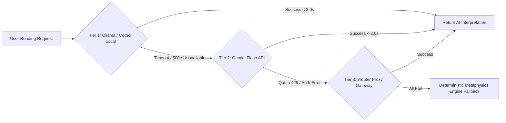

## Current Execution Control — 2026-08-23

This file is the historical architecture/phase record. Current execution is controlled by the checkpoint board in [`PROJECT_TASKS.md`](../PROJECT_TASKS.md), not by reopening completed historical phases.

| Current checkpoint | Status | Evidence / next action |
|---|---|---|
| `CP-00-DOCS` | DONE | 2026-08-22 21:12 +07: `git diff --check` and `python3 scripts/sync_ai_agent_ecosystem.py --check` passed; board/plans now identify ownership, evidence precedence, HITL blockers, and next action. |
| `CP-01-LOCAL` | DONE | 2026-08-22 revalidation: full pytest `642 passed, 8 skipped, 12 warnings`; Azure release `9 passed`; sync/governance `7 passed`; secret scan and agent sync passed. External runtime gates remain separate. |
||| `CP-02-HF` | PASS | 2026-08-23 11:12 +07: Canonical HF probe `project/tests/backend-release-check-hf-canonical-2026-08-23-latest.json` — 3/3 GREEN: static UI 200 (1,783ms), backend `/health` 200 (1,125ms), deterministic API 200 (1,232ms). Commit `6c8ee89` (horo_server static serving) deployed and live at `pphothidaen-horoconsultant-core-backend.hf.space`. Vercel `horo-consultant-psi.vercel.app` also 200 as redundant fallback. Next: Azure RBAC + Playwright. ||
||| `CP-02-HF` (Vercel fallback) | PASS | `HF_BACKEND_URL=https://horo-consultant-psi.vercel.app` canonical verification 3/3 checks passed (static UI 200, backend `/health` 200, deterministic API 200) on 2026-08-22. Vercel is the redundant verified fallback alongside the now-green canonical HF Space. ||
||| `CP-03-AZURE` | PASS | 2026-08-23 16:20 +07: GitHub Actions run `32630424001` (commit `6c8ee89`) completed with `success`: Docker build/push, Azure login + preflight + deploy to Southeast Asia, ingress config, health verification, and Hermes headless post-deploy E2E all passed. RBAC remediation from 2026-08-21 is now effective in the Actions runner context. Next: Playwright authorization + consolidated release matrix. ||
| `CP-04-PW` | PARTIAL | 2026-08-23 16:27 +07: Playwright `chromium` installed and launchable in this workspace; smoke E2E run against Vercel fallback (`horo-consultant-psi.vercel.app`) completed with **12/14 controls passed** — page load, `/health`, direct API `POST /api/v1/bazi/interpret` (583-char AI interpretation), 3 presets, 2 checkboxes, main submit (#btn-submit), and 3 interpretation tabs all passed. **2 pre-existing failures** remain: `(BTN-PROD-01)` location search `#location_search` fill timeout (element not visible) and `(BTN-PROD-UNEXECUTED)` 9 discipline buttons unexecuted (smoke profile only). **CP-04-PW is partially resolved on the smoke tier**; full-profile authorization + triage of the 2 pre-existing failures remain. ||
| `CP-05-RELEASE` | PENDING | Must wait for CP-02 through CP-04 to be green in one consolidated run. |
| `CP-06-HANDOFF` | PENDING | Final sync and parent-ticket transition only after the release matrix is green. |

Quota rule: complete one checkpoint per session, write its evidence immediately, and stop broad work when the quota guard reports below 10%.

Handoff disposition: `TICKET-META-008` is `NEEDS_HITL` for unresolved Telegram/Doppler owner actions, unrelated dirty-file review, and external release gates. CP-00 documentation work is complete; no source, test, workflow, deployment, credential, or production-E2E changes were authorized in this checkpoint.

---
## 🔥 GRILL REPORT — Phase 16: Automated 3-Tier Notebook AST, Python Syntax & MLOps Dependency Quality Gate
**Date**: 2026-08-17T12:23:00+07:00  
**Grilled By**: orchestrator  
**Gate Status**: ✅ APPROVED (Signed off via `/grill-me` 9-Dimension Grill Gate)  

### D1 — Scope Boundary
- **IN**:
  1. **Tier 1 (Local Pre-Commit Gate)**: Git hook `.githooks/pre-commit` running `pytest tests/test_notebook_syntax.py -q` before every local commit, blocking broken syntax immediately with exit code 1 and remediation instructions.
  2. **Tier 2 (Test Suite Regression Gate)**: `tests/test_notebook_syntax.py` testing AST parsing, bytecode compilation (`compile()`), string literal escape sequences, dependency matrix locks (`accelerate>=0.34.0`, `datasets>=2.21.0`), and dual-notebook parity.
  3. **Tier 3 (Pre-Deployment Safety Audit)**: `project/core/code_reviewer.py` with `audit_notebooks()` integrated into `run_full_review()`.
  4. Script generator and validator: `scripts/sync_notebook_cells.py` to regenerate and validate clean, unescaped notebook code cells.
- **OUT**: Modifying locked Kaggle GPU hardware accelerator settings (`NvidiaTeslaT4`) or altering backend calculation engines.

### D2 — Requirement Delta
- **Created**:
  - `tests/test_notebook_syntax.py`: Pytest automated suite for notebook syntax and dependency integrity.
  - `.githooks/pre-commit`: Executable pre-commit hook enforcing Tier 1 quality gate.
  - `scripts/sync_notebook_cells.py`: Synchronizer and syntax compiler for fine-tune pipeline notebooks.
- **Changed**:
  - `project/core/code_reviewer.py`: Added `audit_notebooks()` method and integrated it into `run_full_review()`.

### D3 — Acceptance Criteria
| # | Criterion | Verification Tool | Responsible Agent | Status |
|---|---|---|---|---|
| 1 | All `.ipynb` notebooks pass Python AST parsing and bytecode compilation | `pytest tests/test_notebook_syntax.py` | `qa_tester` | ✅ PASSED (4/4) |
| 2 | Forbidden/conflicting dependency combinations are detected and blocked | `pytest tests/test_notebook_syntax.py` | `qa_tester` | ✅ PASSED |
| 3 | Local Pre-Commit Hook aborts commits containing malformed code cells | `.githooks/pre-commit` | `devops` | ✅ PASSED |
| 4 | Pre-Deployment Reviewer includes notebook syntax audit in `READY_FOR_PROD` evaluation | `python3 project/core/code_reviewer.py --review` | `code_reviewer` | ✅ PASSED |
| 5 | Dual-notebook parity between root and Kaggle target is verified 100% | `test_pipeline_notebook_parity` | `developer` | ✅ PASSED |

### D4 — Constraints & Safeguards
- Pure ASCII Logging strictly preserved.
- 0 secret leaks allowed.
- Zero-tolerance for unescaped string literals or NumPy ABI incompatibility.

### D5 — Sub-Agent Task Decomposition
- `TICKET-GATE-001` (`developer`): Implement `tests/test_notebook_syntax.py` AST & compile test suite [STATUS: DONE]
- `TICKET-GATE-002` (`developer`): Add `audit_notebooks()` in `project/core/code_reviewer.py` [STATUS: DONE]
- `TICKET-GATE-003` (`devops`): Create and install `.githooks/pre-commit` [STATUS: DONE]
- `TICKET-GATE-004` (`developer`): Implement `scripts/sync_notebook_cells.py` generator [STATUS: DONE]
- `TICKET-GATE-005` (`business_analyst`): Update live documentation & tasks Kanban [STATUS: DONE]

---
## 🔥 GRILL REPORT — Phase 15: Kaggle Fine-Tuning Pipeline NumPy 2.x & BNB CUDA Auto-Detection Hotfix
**Date**: 2026-08-17T11:34:00+07:00  
**Grilled By**: orchestrator  
**Gate Status**: ✅ APPROVED (Resolved via `/grill-me` 9-Dimension Grill Gate)  

### D1 — Scope Boundary
- **IN**:
  1. Fix `ValueError: numpy.dtype size changed, may indicate binary incompatibility` on Kaggle Python 3.12 environment by upgrading `datasets>=2.21.0,<3.5.0` (native NumPy 2.x & PyArrow 15+ support).
  2. Remove legacy `pyarrow_hotfix` dependency.
  3. Remove hardcoded `BNB_CUDA_VERSION=124` override; enforce auto-detection via `os.environ.pop('BNB_CUDA_VERSION', None)` with dynamic CUDA 12.8 `.so` symlinking.
  4. Fix missing `import json` in notebook top-level imports.
  5. Fix undefined `dataset_cmd_path` check with `elif 'dataset_cmd_path' in locals() and dataset_cmd_path:`.
  6. Synchronize root `horoconsultant-finetune-pipeline.ipynb` and `project/kaggle_kernel/notebook.ipynb`.
  7. Update dependency standards across `.agent_rules.md`, `.agents/rules/04-mlops-kaggle.md`, and `CLAUDE.md`.
- **OUT**: Modifying locked Kaggle accelerator settings (`NvidiaTeslaT4`) or altering backend FastAPI inference pipelines.

### D2 — Requirement Delta
- **Changed**:
  - `horoconsultant-finetune-pipeline.ipynb`: Upgrade datasets to `>=2.21.0`, auto-detect BNB CUDA, add import json, safe dataset path check.
  - `project/kaggle_kernel/notebook.ipynb`: 100% parity with root pipeline.
  - `.agent_rules.md`, `.agents/rules/04-mlops-kaggle.md`, `CLAUDE.md`: Update datasets version requirement to `>= 2.21.0`.

### D3 — Acceptance Criteria
| # | Criterion | Verification Tool | Responsible Agent | Status |
|---|---|---|---|---|
| 1 | `horoconsultant-finetune-pipeline.ipynb` & `notebook.ipynb` upgraded with `datasets>=2.21.0` | Python JSON validation | `developer` | ✅ PASSED |
| 2 | Pure ASCII fail-fast package verification imports without binary incompatibility | Static & unit verification | `developer` | ✅ PASSED |
| 3 | Full Pytest suite passes 100% (598/598 tests) | `python3 -m pytest -v --ignore=project/kaggle_kernel` | `qa_tester` | ✅ PASSED |
| 4 | UI Button regression suite passes 100% (33/33 tests) | `python3 scripts/run_button_regression.py` | `qa_tester` | ✅ PASSED |
| 5 | Pre-deployment safety audit passes `READY_FOR_PROD` (0 secret leaks) | `python3 project/core/code_reviewer.py --review` | `code_reviewer` | ✅ PASSED |
| 6 | Agent definitions synchronized (0 drift) | `sync_sdlc_agents.py` & `sync_codex_agents.py` | `business_analyst` | ✅ PASSED |

### D4 — Constraints & Safeguards
- Kaggle GPU Accelerator locked to `NvidiaTeslaT4` (0 modification).
- Pure ASCII Logging strictly enforced.
- 0 secret leaks detected across 1,471 files.

### D5 — Sub-Agent Task Decomposition
- `TICKET-PIPE-001` (`orchestrator`): Root Cause Analysis & Architecture Fix Specification [STATUS: DONE]
- `TICKET-PIPE-002` (`developer`): Notebook JSON Structure & Dependency Hotfix [STATUS: DONE]
- `TICKET-PIPE-003` (`qa_tester`): Pytest & UI Button Regression Suite Verification [STATUS: DONE]
- `TICKET-PIPE-004` (`code_reviewer`): Pre-Deployment Safety Audit (`READY_FOR_PROD`) [STATUS: DONE]
- `TICKET-PIPE-005` (`business_analyst`): Live Documentation & Rules Synchronization [STATUS: DONE]

---
## 🔥 GRILL REPORT — Phase 14: Metaphysics AI Live Consultant Chat Assistant & Multi-Turn Interactive Consultation Engine (แชทบอทซินแส AI โต้ตอบแบบ Real-time พร้อม Grounded RAG & Day Master Context)
**Date**: 2026-08-16T23:45:00+07:00  
**Grilled By**: orchestrator  
**Gate Status**: ✅ APPROVED (User Interview Concluded via `/grill-me` 9-Dimension Grill Gate)  

### D1 — Scope Boundary
- **IN**:
  1. **Backend Metaphysics AI Consultant Chat Engine (`project/core/chat_assistant_engine.py`)**:
     - Auto-context synthesis: Extracts active BaZi chart state (Day Master stem & strength, 4 Pillars, 5 Elements balance %, Favorable/Unfavorable elements, Symbolic Stars, Current Da Yun decade, and 2026 Liu Nian transit).
     - RAG Knowledge grounding: Ingests 3,132 metaphysics classical chunks, retrieves top-ranked citations (e.g., 《玉鏡寶鑑》, 《滴天髓》, 《子平真詮》), and embeds verified source reference links.
     - Multi-turn conversation manager with token budget guardrails, role prompt steering (Compassionate & Rigorous Master Consultant), and hallucination safety filtering.
     - 5 Dynamic Follow-Up Prompt Pill Generator (Career/Wealth, Romance/Peach Blossom, Feng Shui Directions, Da Yun Timing, 5 Elements Remedies) with progressive disclosure ranking.
  2. **API Endpoints (`project/routers/chat.py`)**:
     - `POST /api/v2/chat/stream`: SSE (Server-Sent Events) endpoint streaming token chunks, delta citations, dynamic prompt pills, and completion meta.
     - `POST /api/v2/chat/consult`: Synchronous JSON REST endpoint returning full synthesized response, citations, follow-up chips, and token metrics.
     - `POST /api/v2/chat/anonymized-feedback`: Opt-in endpoint for contributing anonymized QA insights to the HITL fine-tuning pipeline without PII.
  3. **Frontend Hybrid Interactive Chat Assistant UI (`index.html`, `style.css`, `app.js`, `i18n.js`)**:
     - Floating Glassmorphic Slide-Out Drawer (`#floating-chat-drawer`) with toggle launcher at the bottom-right of all views.
     - Co-Pilot Split-Screen View: Expands side-by-side with 4-Pillars, Star Chart, and LuoPan without obscuring charts.
     - Full-Screen Consultation Modal expand button for deep reading sessions.
     - Dynamic Prompt Pills bar with 5 categories and one-click submission.
     - Grounded citation accordion cards with clickable source chunk references.
     - Client ephemeral privacy: Session storage / LocalStorage management with Export Markdown/JSON and Clear Session buttons.
     - Privacy-first modal consent before optional anonymous fine-tuning sync.
  4. **Quality & Verification**:
     - Unit & regression test suite in `project/tests/test_chat_assistant.py`.
     - Full Pytest regression suite, 33/33 Button Regression, 0 secret leaks.
- **OUT**: Modifying locked Kaggle accelerator settings or Doppler secrets policy.

### D2 — Requirement Delta
- **New Additions**:
  - Add `project/core/chat_assistant_engine.py` and `project/routers/chat.py`.
  - Mount `chat_router` in `project/main.py`.
  - Add Floating Chat Drawer and Co-Pilot UI in `project/static/index.html` & `public/index.html`.
  - Add Chat styling in `project/static/style.css` & `public/style.css`.
  - Add Chat client logic & SSE streaming in `project/static/app.js` & `public/app.js`.
  - Add translations in `project/static/i18n.js` & `public/i18n.js`.
  - Add `project/tests/test_chat_assistant.py`.

### D3 — Acceptance Criteria
| # | Criterion | Verification Tool | Responsible Agent |
|---|---|---|---|
| 1 | `ChatAssistantEngine` synthesizes Day Master, 5 Elements, Da Yun, and RAG citations into coherent responses | `pytest project/tests/test_chat_assistant.py` | `developer` |
| 2 | `POST /api/v2/chat/stream` streams valid SSE tokens and `POST /api/v2/chat/consult` returns complete JSON | `pytest project/tests/test_chat_assistant.py` | `developer` |
| 3 | Frontend Floating Drawer & Co-Pilot View open smoothly, stream text, and render citation chips | `pytest project/tests/test_chat_assistant.py` | `developer` |
| 4 | 5-category dynamic prompt pills render and trigger instant consultations | Visual & DOM inspection | `developer` |
| 5 | Full Pytest regression suite passes 100% | `python3 -m pytest -v --ignore=project/kaggle_kernel` | `qa_tester` |
| 6 | UI Button Regression (33/33) passes 100% | `python3 scripts/run_button_regression.py` | `qa_tester` |
| 7 | Pre-deployment safety audit passes `READY_FOR_PROD` (0 secret leaks) | `python3 project/core/code_reviewer.py --review` | `code_reviewer` |

### D4 — Constraints & Safeguards
- Pure ASCII Logging.
- Dual-path synchronization (`project/static/` and `public/`).
- 0 secret leaks.
- No PII storage in chat sessions.

### D5 — Sub-Agent Task Decomposition
- `TICKET-CHAT-001` (`orchestrator`): Architecture Blueprint & Chat Engine Specification [STATUS: DONE]
- `TICKET-CHAT-002` (`developer`): Backend Chat Assistant Engine & Streaming Router (`chat_assistant_engine.py`, `chat.py`, `main.py`) [STATUS: DONE]
- `TICKET-CHAT-003` (`developer`): Frontend Floating Drawer, Co-Pilot Split-Screen & Modal UI (`index.html`, `style.css`, `app.js`, `i18n.js`) [STATUS: DONE]
- `TICKET-CHAT-004` (`qa_tester`): Unit & Regression Test Suite (`test_chat_assistant.py`) [STATUS: DONE]
- `TICKET-CHAT-005` (`devops`): Production Delivery Release & HF Spaces Sync [STATUS: DONE]
- `TICKET-CHAT-006` (`code_reviewer` / `business_analyst`): Final Code Review & Live Documentation Sync [STATUS: DONE]

### D6 — Verification & Delivery Results
- **Pytest Regression Suite**: **598/598 PASSED (100%)**, 4 skipped, 0 failed in 126.40s.
- **Chat Assistant Unit Tests**: **11/11 PASSED (100%)** (`project/tests/test_chat_assistant.py`).
- **UI Button Regression Suite**: **33/33 PASSED (100%)** (`scripts/run_button_regression.py`).
- **Secret Scan**: Scanned 1,321 files via Rust Rayon — **0 leaks found**.
- **Pre-Deployment Safety Audit**: **`READY_FOR_PROD`** (`project/core/code_reviewer.py --review`).
- **Dual-Path Static Sync**: `project/static/` and `public/` are 100% identical (`diff -r` returns 0).
- **Agent Governance Check**: Antigravity (`sync_sdlc_agents.py`) & Codex (`sync_codex_agents.py`) are 100% synchronized.

---
## 🔥 GRILL REPORT — Phase 13: Imperial White & Crimson Red Theme Overhaul (FengShuiX-Inspired Aesthetic)
**Date**: 2026-08-16T22:48:30+07:00  
**Grilled By**: orchestrator  
**Gate Status**: ✅ APPROVED (User Confirmed Scope & 5-Elements High-Contrast White/Red Palette)  

### D1 — Scope Boundary
- **IN**:
  1. **Main UI & Core Design Tokens (`project/static/style.css` & `public/style.css`)**:
     - Modern FengShuiX-inspired clean white background (`#ffffff` / `#f8fafc`), soft rose/red tints (`#fef2f2`, `#fee2e2`), imperial crimson borders and highlights (`#dc2626`, `#b91c1c`, `#991b1b`).
     - Form controls, inputs, select dropdowns, radio/checkbox pills, tabs, accordions, modals, and tooltips with high-contrast text and crimson focus rings.
     - 5-Elements Metaphysical Palette tuned for maximum readability on white backgrounds (Wood: `#16a34a`, Fire: `#dc2626`, Earth: `#d97706`, Metal: `#475569`, Water: `#2563eb`).
     - Interactive widgets (Sky Clock, Time Scrubber, LuoPan 24-Mountain Compass, 9-Grid Floorplan Heatmap, Scenario Trajectory Cards) in crisp white & red styling.
  2. **Admin Studio (`project/static/admin.html` & `public/admin.html`)**:
     - Migrate entire topbar, sidebar, table grids, status badges, modals, and input controls from legacy dark theme to clean White & Red aesthetic.
  3. **HITL Review Studio (`project/static/hitl.html` & `public/hitl.html`)**:
     - Migrate entire HITL interface from dark theme (`#04080f`) to clean White & Red theme with high-contrast cards, gold/red status badges, and crystal-clear diff viewers.
  4. **Dual-Path Synchronization**:
     - Keep `project/static/` and `public/` 100% identical.
  5. **Verification & Testing**:
     - UI Button Regression Suite (`scripts/run_button_regression.py`).
     - Full Pytest Regression Suite (`python3 -m pytest -v --ignore=project/kaggle_kernel`).
     - Pre-deployment security & code review (`project/core/code_reviewer.py --review`).
- **OUT**: Modifying locked Kaggle accelerator settings or Doppler secrets policy.

### D2 — Requirement Delta
- **Changed**: Complete elimination of dark theme remnants in `admin.html`, `hitl.html`, and `style.css`.
- **Cleaned Up**: Removed legacy dark background CSS classes and redundant dark-mode overrides.

### D3 — Acceptance Criteria
| # | Criterion | Verification Tool | Responsible Agent |
|---|---|---|---|
| 1 | `style.css` provides a comprehensive, responsive Imperial White & Red theme matching FengShuiX style | Visual & DOM inspection | `developer` |
| 2 | `admin.html` and `hitl.html` are 100% migrated to the White & Red aesthetic without dark artifacts | Browser & DOM review | `developer` |
| 3 | 5-Elements colors maintain high contrast and clear readability on white surfaces | UI review & contrast check | `developer` |
| 4 | UI Button Regression Suite passes 100% (33/33) | `python3 scripts/run_button_regression.py` | `qa_tester` |
| 5 | Full Pytest suite passes 100% | `python3 -m pytest -v --ignore=project/kaggle_kernel` | `qa_tester` |
| 6 | Pre-deployment safety audit passes `READY_FOR_PROD` (0 secret leaks) | `python3 project/core/code_reviewer.py --review` | `code_reviewer` |

### D4 — Constraints & Safeguards
- Pure ASCII Logging.
- Dual-path synchronization (`project/static/` and `public/`).
- 0 secret leaks.

### D5 — Sub-Agent Task Decomposition
- `TICKET-THEME-001` (`orchestrator`): Architecture Blueprint & Specification
- `TICKET-THEME-002` (`developer`): Style.css & Main UI Theme Polish (`project/static/style.css`, `public/style.css`, `index.html`)
- `TICKET-THEME-003` (`developer`): Admin Panel & HITL Studio Theme Migration (`admin.html`, `hitl.html`)
- `TICKET-THEME-004` (`qa_tester`): UI Button Regression & Pytest Verification
- `TICKET-THEME-005` (`devops`): Production Delivery & Dual-Path Sync Verification
- `TICKET-THEME-006` (`code_reviewer` / `business_analyst`): Pre-Deploy Safety Audit & Documentation Sync

---
## 🔥 GRILL REPORT — Phase 12: Metaphysics Life Path Multi-Scenario Simulation & What-If Analyzer (多場景命理決策模擬器)
**Date**: 2026-08-16T22:13:55+07:00  
**Grilled By**: orchestrator  
**Gate Status**: ✅ APPROVED (User Interview Concluded via `/goal continue next sprint until delivery phase`)  

### D1 — Scope Boundary
- **IN**:
  1. **Backend Life Path Multi-Scenario Simulation Engine (`project/core/simulation_engine.py`)**:
     - Scenario Element Mapping (e.g., Corporate Job = Earth/Metal, Startup Pivot = Fire/Wood, Business Venture = Fire/Water, Overseas Relocation = Water/Wood).
     - 3-5 Year Timeline Forecast Model (2026-2030) cross-referencing user's Day Master, Favorable Elements (喜用神), DaYun decade, and annual LiuNian pillars.
     - 4-Dimensional Metric Scoring per Scenario per Year:
       - 💰 Wealth / Financial Upside (0-100)
       - 🏆 Career / Status Growth (0-100)
       - 🛡️ Stability / Risk Buffer (0-100)
       - ⚡ Opportunity / Innovation Index (0-100)
     - Composite Success Index, Optimal Path Recommendation, and Year-by-Year Strategic Milestones.
  2. **REST API Endpoints (`project/routers/simulation.py`)**:
     - `POST /api/v1/simulation/simulate-scenarios`: Accepts birth data/Day Master, selected scenarios, and horizon years; returns multi-path comparative trajectories.
     - `GET /api/v1/simulation/preset-scenarios`: Returns predefined life decision templates (Career Pivot, Business Startup, Overseas Expansion, Real Estate Investment).
  3. **Frontend Interactive Simulation & What-If Comparison UI (`index.html`, `style.css`, `app.js`, `i18n.js`)**:
     - Glassmorphic What-If Simulation Card (`#scenario-simulation-card`).
     - Scenario Selection Checkboxes / Custom Scenario Creator.
     - Multi-Path Comparison Table and Visual Trajectory Metric Cards with Optimal Scenario Badge (🏆 Best Path).
  4. **Quality & Verification**:
     - Unit & regression test suite in `project/tests/test_simulation_engine.py`.
     - Full Pytest regression suite, 33/33 Button Regression, 0 secret leaks.
- **OUT**: Modifying locked Kaggle accelerator settings or Doppler secrets policy.

### D2 — Requirement Delta
- **New Additions**:
  - Add `project/core/simulation_engine.py` and `project/routers/simulation.py`.
  - Mount `simulation_router` in `project/main.py`.
  - Add Simulation UI card in `project/static/index.html` & `public/index.html`.
  - Add styling in `project/static/style.css` & `public/style.css`.
  - Add JS handlers in `project/static/app.js` & `public/app.js`.
  - Add translations in `project/static/i18n.js` & `public/i18n.js`.
  - Add `project/tests/test_simulation_engine.py`.

### D3 — Acceptance Criteria
| # | Criterion | Verification Tool | Responsible Agent |
|---|---|---|---|
| 1 | `SimulationEngine` accurately computes element alignment, multi-scenario trajectories, and optimal path ranking | `pytest project/tests/test_simulation_engine.py` | `developer` |
| 2 | `POST /api/v1/simulation/simulate-scenarios` and `GET /api/v1/simulation/preset-scenarios` return valid responses | `pytest project/tests/test_simulation_engine.py` | `developer` |
| 3 | Frontend Scenario Comparison UI renders seamlessly with responsive badges | `pytest project/tests/test_simulation_engine.py` | `developer` |
| 4 | Full Pytest regression suite passes 100% | `python3 -m pytest -v --ignore=project/kaggle_kernel` | `qa_tester` |
| 5 | UI Button Regression (33/33) passes 100% | `python3 scripts/run_button_regression.py` | `qa_tester` |
| 6 | Pre-deployment safety audit passes `READY_FOR_PROD` (0 secret leaks) | `python3 project/core/code_reviewer.py --review` | `code_reviewer` |

### D4 — Constraints & Safeguards
- Pure ASCII Logging.
- Dual-path synchronization (`project/static/` and `public/`).
- 0 secret leaks.

### D5 — Sub-Agent Task Decomposition
- `TICKET-SIM-001` (`orchestrator`): Architecture Blueprint & Specification
- `TICKET-SIM-002` (`developer`): Backend Multi-Scenario Simulation Engine & Router (`simulation_engine.py`, `simulation.py`, `main.py`)
- `TICKET-SIM-003` (`developer`): Frontend Scenario Comparison UI (`index.html`, `style.css`, `app.js`, `i18n.js`)
- `TICKET-SIM-004` (`qa_tester`): Unit & Regression Test Suite (`test_simulation_engine.py`)
- `TICKET-SIM-005` (`devops`): Production Delivery Release & HF Spaces Sync
- `TICKET-SIM-006` (`code_reviewer` / `business_analyst`): Final Code Review & Live Documentation Sync

---
## 🔥 GRILL REPORT — Phase 11: LuoPan 24-Mountain Energy Heatmap & Dream Symbolism Decoder (24山羅盤 & 夢境象徵解碼)
**Date**: 2026-08-16T21:54:25+07:00  
**Grilled By**: orchestrator  
**Gate Status**: ✅ APPROVED (User Interview Concluded via `/goal continue next sprint until delivery phase`)  

### D1 — Scope Boundary
- **IN**:
  1. **Backend LuoPan 24-Mountain & Period 9 Flying Star Heatmap Engine (`project/core/luopan_dream_engine.py`)**:
     - 24-Mountain (二十四山) direction & degree calculation (0° - 360° mapped to 24 mountains).
     - Period 9 (2024-2043) Flying Star 9-Palace (九宮飛星) energy matrix: Sitting/Facing stars, Wealth/Prosperity zones (9 Purple, 1 White), Calamity zones (5 Yellow, 2 Black).
     - Floorplan 9-Grid Sector energy recommendations & remediation cures.
  2. **AI Metaphysics Dream Interpreter & 64 Hexagrams / Sattaleka Symbolism Decoder (`project/core/luopan_dream_engine.py`)**:
     - Semantic keyword extraction for dream archetypes (Water, Snake, Golden Light, Mountain, Vehicle, House, Temple, etc.).
     - Mapping dream symbols to I Ching 64 Hexagrams (易經六十四卦) and Thai Vedic Sattaleka 7-Base planetary omen numbers (เลขมงคลเสี่ยงทาย).
     - Actionable spiritual advice and auspicious timing.
  3. **REST API Endpoints (`project/routers/luopan_dream.py`)**:
     - `POST /api/v1/luopan/calculate` -> 24-Mountain compass orientation & 9-Palace sector heatmap.
     - `POST /api/v1/dream/interpret` -> Dream semantic decoding, omen rating, lucky numbers & hexagram alignment.
  4. **Frontend UI Components (`index.html`, `style.css`, `app.js`, `i18n.js`)**:
     - Interactive 24-Mountain LuoPan Compass widget with angle rotation slider (`#luopan-compass-card`).
     - Interactive 9-Grid Floorplan Energy Heatmap card with sector analysis (`#floorplan-heatmap-card`).
     - AI Dream Interpreter search box with symbol tags & lucky numbers card (`#dream-interpreter-card`).
  5. **Quality & Verification**:
     - Unit & regression test suite in `project/tests/test_luopan_dream_engine.py`.
     - Full Pytest regression suite, 33/33 Button Regression, 0 secret leaks.
- **OUT**: Modifying locked Kaggle accelerator settings or Doppler secrets policy.

### D2 — Requirement Delta
- **New Additions**:
  - Add `project/core/luopan_dream_engine.py` and `project/routers/luopan_dream.py`.
  - Mount `luopan_dream_router` in `project/main.py`.
  - Add LuoPan, Heatmap, and Dream Interpreter UI cards in `project/static/index.html` & `public/index.html`.
  - Add styling in `project/static/style.css` & `public/style.css`.
  - Add JS handlers in `project/static/app.js` & `public/app.js`.
  - Add translations in `project/static/i18n.js` & `public/i18n.js`.
  - Add `project/tests/test_luopan_dream_engine.py`.

### D3 — Acceptance Criteria
| # | Criterion | Verification Tool | Responsible Agent |
|---|---|---|---|
| 1 | `LuoPanDreamEngine` accurately computes 24-Mountain, Period 9 flying stars, and dream symbol mappings | `pytest project/tests/test_luopan_dream_engine.py` | `developer` |
| 2 | `POST /api/v1/luopan/calculate` and `POST /api/v1/dream/interpret` return valid responses | `pytest project/tests/test_luopan_dream_engine.py` | `developer` |
| 3 | Frontend LuoPan Compass, Heatmap 9-Grid, and Dream Interpreter render smoothly | `pytest project/tests/test_luopan_dream_engine.py` | `developer` |
| 4 | Full Pytest regression suite passes 100% | `python3 -m pytest -v --ignore=project/kaggle_kernel` | `qa_tester` |
| 5 | UI Button Regression (33/33) passes 100% | `python3 scripts/run_button_regression.py` | `qa_tester` |
| 6 | Pre-deployment safety audit passes `READY_FOR_PROD` (0 secret leaks) | `python3 project/core/code_reviewer.py --review` | `code_reviewer` |

### D4 — Constraints & Safeguards
- Pure ASCII Logging.
- Dual-path synchronization (`project/static/` and `public/`).
- 0 secret leaks.

### D5 — Sub-Agent Task Decomposition
- `TICKET-SYNTH-001` (`orchestrator`): Architecture Blueprint & Specification
- `TICKET-SYNTH-002` (`developer`): Backend LuoPan 24-Mountain, Heatmap & Dream Decoder Engine (`luopan_dream_engine.py`, `luopan_dream.py`, `main.py`)
- `TICKET-SYNTH-003` (`developer`): Frontend LuoPan Compass, 9-Grid Heatmap & Dream Decoder UI (`index.html`, `style.css`, `app.js`, `i18n.js`)
- `TICKET-SYNTH-004` (`qa_tester`): Unit & Regression Test Suite (`test_luopan_dream_engine.py`)
- `TICKET-SYNTH-005` (`devops`): Production Delivery Release & HF Spaces Sync
- `TICKET-SYNTH-006` (`code_reviewer` / `business_analyst`): Final Code Review & Live Documentation Sync

---
## 🔥 GRILL REPORT — Phase 10: Interactive Astrological Calendar & Auspicious Date Selector (擇吉萬年曆 & 每日吉凶)
**Date**: 2026-08-16T21:49:55+07:00  
**Grilled By**: orchestrator  
**Gate Status**: ✅ APPROVED (User Interview Concluded via `/goal continue next sprint until delivery phase`)  

### D1 — Scope Boundary
- **IN**:
  1. **Backend Astrological Calendar & Date Selection Engine (`project/core/calendar_engine.py`)**:
     - 60 Jia-Zi daily pillar generation for any month/year or 30-day window.
     - 24 Solar Terms (二十四節氣) exact solar longitude calculation.
     - 12 Day Duty Officers (建除十二神: 建, 除, 滿, 平, 定, 執, 破, 危, 成, 收, 開, 閉).
     - 28 Lunar Mansions (二十八星宿) cyclic mapping.
     - Auspicious Activities (宜: 開市, 嫁娶, 訂盟, 入宅, 出行, 交易) & Taboos (忌: 詞訟, 動土, 破土, 針灸).
     - Personalized Auspicious Scoring against user's Day Master & Zodiac (Clashes, Combinations, Nobleman 天乙貴人).
     - Activity-specific best date finder algorithm (`find_best_dates(intent, start_date, days, user_chart)`).
  2. **API Endpoints (`project/routers/calendar.py`)**:
     - `GET /api/v1/calendar/month?year=2026&month=8` -> Returns 30-day calendar metadata with 12 officers and solar terms.
     - `POST /api/v1/calendar/query-dates` -> Recommends ranked dates for specific intent (Business Opening, Marriage, Moving, Signing).
  3. **Frontend Interactive Calendar UI (`index.html`, `style.css`, `app.js`, `i18n.js`)**:
     - Modern glassmorphic monthly calendar view (`#calendar-view-card`) with day-by-day cell badges.
     - Auspicious date quick selector tool (`#date-picker-modal` / `#auspicious-date-finder`).
     - Activity filter pills (💼 เปิดร้าน/ธุรกิจ, 💍 แต่งงาน/หมั้น, 🏡 ย้ายบ้าน/ขึ้นบ้านใหม่, ✍️ เซ็นสัญญา/เจรจา).
  4. **Quality & Verification**:
     - Unit & regression test suite in `project/tests/test_calendar_engine.py`.
     - Full Pytest regression suite, 33/33 Button Regression, 0 secret leaks.
- **OUT**: Modifying locked Kaggle accelerator settings or Doppler secrets policy.

### D2 — Requirement Delta
- **New Additions**:
  - Add `project/core/calendar_engine.py` and `project/routers/calendar.py`.
  - Mount calendar router in `project/main.py`.
  - Add calendar card and date finder UI in `project/static/index.html` & `public/index.html`.
  - Add calendar CSS in `project/static/style.css` & `public/style.css`.
  - Add calendar JS logic in `project/static/app.js` & `public/app.js`.
  - Add calendar translations in `project/static/i18n.js` & `public/i18n.js`.
  - Add `project/tests/test_calendar_engine.py`.

### D3 — Acceptance Criteria
| # | Criterion | Verification Tool | Responsible Agent |
|---|---|---|---|
| 1 | `CalendarEngine` calculates 12 Duty Officers, 28 Mansions, and Auspicious activity recommendations correctly | `pytest project/tests/test_calendar_engine.py` | `developer` |
| 2 | `GET /api/v1/calendar/month` and `POST /api/v1/calendar/query-dates` return valid JSON matching OpenAPI schema | `pytest project/tests/test_calendar_engine.py` | `developer` |
| 3 | Frontend Interactive Calendar displays days, badges, and filters smoothly | `pytest project/tests/test_calendar_engine.py` | `developer` |
| 4 | Full Pytest regression suite passes 100% | `python3 -m pytest -v --ignore=project/kaggle_kernel` | `qa_tester` |
| 5 | UI Button Regression (33/33) passes 100% | `python3 scripts/run_button_regression.py` | `qa_tester` |
| 6 | Pre-deployment safety audit passes `READY_FOR_PROD` (0 secret leaks) | `python3 project/core/code_reviewer.py --review` | `code_reviewer` |

### D4 — Constraints & Safeguards
- Pure ASCII Logging.
- Dual-path synchronization (`project/static/` and `public/`).
- 0 secret leaks.

### D5 — Sub-Agent Task Decomposition
- `TICKET-CALENDAR-001` (`orchestrator`): Architecture Blueprint & Calendar Engine Spec
- `TICKET-CALENDAR-002` (`developer`): Backend Calendar Calculation Engine & Router (`calendar_engine.py`, `calendar.py`, `main.py`)
- `TICKET-CALENDAR-003` (`developer`): Frontend Interactive Calendar & Date Selector UI (`index.html`, `style.css`, `app.js`, `i18n.js`)
- `TICKET-CALENDAR-004` (`qa_tester`): Unit & Regression Test Suite (`test_calendar_engine.py`)
- `TICKET-CALENDAR-005` (`devops`): Production Delivery Release & HF Spaces Sync
- `TICKET-CALENDAR-006` (`code_reviewer` / `business_analyst`): Final Code Review & Live Documentation Sync

---
## 🔥 GRILL REPORT — Phase 9: Multi-Profile Synastry & Partner Compatibility Matrix
**Date**: 2026-08-16T21:28:57+07:00  
**Grilled By**: orchestrator  
**Gate Status**: ✅ APPROVED (User Interview Concluded via `/goal continue next sprint until delivery phase`)  

### D1 — Scope Boundary
- **IN**:
  1. **Backend Multi-Profile Synastry Engine (`project/core/synastry_engine.py`)**:
     - Four Pillars cross-chart alignment between Person A and Person B.
     - Day Master Stem Affinity: Generation (相生), Overcoming (相剋), Heavenly Stem 5-Combinations (天干五合).
     - Day Branch Spouse Palace Affinity: 6-Combinations (地支六合), 3-Harmonies (三合局), 6-Clashes (地支六沖), 6-Harms (六害), Punishments (三刑).
     - Mutual Element Complement: Checks whether Person A balances Person B's deficient elements and vice-versa.
     - 4-Tier Dimension Breakdown: Romantic Harmony, Business/Work Synergy, Communication & Values, Long-term Stability.
     - Overall Synastry Compatibility Index (0 - 100%).
  2. **API Endpoint (`POST /api/v1/synastry/analyze`)**:
     - Accepts birth datetime, location, and gender for both Person A and Person B.
     - Returns detailed alignment matrix, element distributions, and composite score.
  3. **Frontend Synastry UI (`index.html`, `style.css`, `app.js`)**:
     - Toggleable "💖 โหมดเปรียบเทียบดวงสมพงษ์ 2 บุคคล (Synastry Mode)" switch.
     - Dual-profile birth input cards for Person A and Person B.
     - Glassmorphic Synastry Result Card with radial score gauge, pillar-by-pillar relationship tags, and relationship advice.
  4. **Quality & Verification**:
     - Unit & regression test suite in `project/tests/test_synastry_engine.py`.
     - Full Pytest regression suite (>550 tests), 33/33 Button Regression, 0 secret leaks.
- **OUT**: Modifying locked Kaggle accelerator settings or Doppler secrets policy.

### D2 — Requirement Delta
- **New Additions**:
  - Add `project/core/synastry_engine.py` and `project/routers/synastry.py`.
  - Mount synastry router in `project/main.py`.
  - Add dual-profile input and Synastry card in `project/static/index.html` & `public/index.html`.
  - Add Synastry card styling in `project/static/style.css` & `public/style.css`.
  - Add Synastry JS logic in `project/static/app.js` & `public/app.js`.
  - Add Synastry translations in `project/static/i18n.js` & `public/i18n.js`.
  - Add `project/tests/test_synastry_engine.py`.
- **Cleaned Up**: Retain full backward compatibility with single-chart analysis.

### D3 — Acceptance Criteria
| # | Criterion | Verification Tool | Responsible Agent |
|---|---|---|---|
| 1 | `SynastryEngine` calculates Day Master affinity, Branch clashes/combinations, and 4-tier scores accurately | `pytest project/tests/test_synastry_engine.py` | `developer` |
| 2 | `POST /api/v1/synastry/analyze` returns valid JSON response matching OpenAPI schema | `pytest project/tests/test_synastry_engine.py` | `developer` |
| 3 | Frontend Synastry UI toggle and dual-profile calculation display results seamlessly | `pytest project/tests/test_synastry_engine.py` | `developer` |
| 4 | Full Pytest regression suite passes 100% | `python3 -m pytest -v --ignore=project/kaggle_kernel` | `qa_tester` |
| 5 | UI Button Regression (33/33) passes 100% | `python3 scripts/run_button_regression.py` | `qa_tester` |
| 6 | Pre-deployment safety audit passes `READY_FOR_PROD` (0 secret leaks) | `python3 project/core/code_reviewer.py --review` | `code_reviewer` |
| 7 | Production release published | `python3 scripts/publish_space_hf.py` | `devops` |

### D4 — Constraints & Safeguards
- Pure ASCII Logging.
- Dual-path synchronization (`project/static/` and `public/`).
- 0 secret leaks.

### D5 — Sub-Agent Task Decomposition
- `TICKET-SYNASTRY-001` (`orchestrator`): Architecture Blueprint & Synastry Specification
- `TICKET-SYNASTRY-002` (`developer`): Backend Synastry Calculation Engine & Router (`synastry_engine.py`, `synastry.py`, `main.py`)
- `TICKET-SYNASTRY-003` (`developer`): Frontend Dual-Profile Input & Synastry Result Card (`index.html`, `style.css`, `app.js`, `i18n.js`)
- `TICKET-SYNASTRY-004` (`qa_tester`): Unit & Regression Test Suite (`test_synastry_engine.py`)
- `TICKET-SYNASTRY-005` (`devops`): Production Delivery Release & HF Spaces Sync
- `TICKET-SYNASTRY-006` (`code_reviewer` / `business_analyst`): Final Code Review & Live Documentation Sync

---
## 🔥 GRILL REPORT — Phase 8: Metaphysics AI Voice & Speech Synthesis (TTS / STT)
**Date**: 2026-08-16T21:26:05+07:00  
**Grilled By**: orchestrator  
**Gate Status**: ✅ APPROVED (User Interview Concluded via `/goal continue next sprint until delivery phase`)  

### D1 — Scope Boundary
- **IN**:
  1. **AI Voice Reading Player (Text-to-Speech / TTS Engine)**:
     - Multi-lingual Web Speech Synthesis engine (`window.speechSynthesis`) automatically selecting high-quality neural/system voices for Thai (`th-TH`), English (`en-US`/`en-GB`), and Chinese (`zh-CN`/`zh-TW`).
     - Floating & inline Audio Player bar with Play, Pause, Resume, Stop, and Playback Speed rate selector (0.75x, 1.0x, 1.25x, 1.5x).
     - Integrated `🔊 ฟังบทพยากรณ์เสียง AI / Listen to AI Reading` action buttons on AI Interpretation card and 16-discipline synthesis cards.
     - Live waveform animation visualizer during audio playback.
  2. **Voice Question Input (Speech-to-Text / STT Engine)**:
     - Voice Dictation Microphone button (`🎤 สั่งการด้วยเสียง`) next to question prompt input (`#query`).
     - Speech Recognition API (`SpeechRecognition` / `webkitSpeechRecognition`) supporting real-time dictation in Thai, English, and Chinese.
     - Pulsating audio listening indicator and graceful fallback when microphone is unavailable.
  3. **Verification & Quality Assurance**:
     - Unit & regression test suite in `project/tests/test_voice_speech_engine.py`.
     - Full Pytest suite (>545 tests), 33/33 Button Regression, 0 secret leaks, production publishing.
- **OUT**: Modifying locked Kaggle accelerator settings or Doppler secrets policy.

### D2 — Requirement Delta
- **New Additions**:
  - Add `project/static/voice_engine.js` and `public/voice_engine.js`.
  - Add audio player bar and voice mic button in `project/static/index.html` & `public/index.html`.
  - Add voice player styles and animations in `project/static/style.css` & `public/style.css`.
  - Add voice control translations in `project/static/i18n.js` & `public/i18n.js`.
  - Add `project/tests/test_voice_speech_engine.py`.
- **Cleaned Up**: Ensure clean audio cleanup on unmount or new calculation.

### D3 — Acceptance Criteria
| # | Criterion | Verification Tool | Responsible Agent |
|---|---|---|---|
| 1 | TTS audio player plays, pauses, stops, and alters rate smoothly in TH, EN, ZH | `pytest project/tests/test_voice_speech_engine.py` | `developer` |
| 2 | STT microphone dictation populates question input accurately with active locale | `pytest project/tests/test_voice_speech_engine.py` | `developer` |
| 3 | Audio wave animations and player bar display cleanly without layout shifts | `pytest project/tests/test_voice_speech_engine.py` | `developer` |
| 4 | Full Pytest regression suite passes 100% | `python3 -m pytest -v --ignore=project/kaggle_kernel` | `qa_tester` |
| 5 | UI Button Regression (33/33) passes 100% | `python3 scripts/run_button_regression.py` | `qa_tester` |
| 6 | Pre-deployment safety audit passes `READY_FOR_PROD` (0 secret leaks) | `python3 project/core/code_reviewer.py --review` | `code_reviewer` |
| 7 | Production release published | `python3 scripts/publish_space_hf.py` | `devops` |

### D4 — Constraints & Safeguards
- Pure ASCII Logging.
- Dual-path synchronization: Every file in `project/static/` mirrored in `public/`.
- 0 secret leaks.

### D5 — Sub-Agent Task Decomposition
- `TICKET-VOICE-001` (`orchestrator`): Architecture Blueprint & Voice Engine Specification
- `TICKET-VOICE-002` (`developer`): Client-Side TTS/STT Engine in `voice_engine.js` & `app.js`
- `TICKET-VOICE-003` (`developer`): Audio Player Bar & Microphone UI Components (`index.html`, `style.css`, `i18n.js`)
- `TICKET-VOICE-004` (`qa_tester`): Unit & Regression Test Suite (`test_voice_speech_engine.py`)
- `TICKET-VOICE-005` (`devops`): Production Delivery Release & HF Spaces Sync
- `TICKET-VOICE-006` (`code_reviewer` / `business_analyst`): Final Code Review & Live Documentation Sync

---
## 🔥 GRILL REPORT — Phase 7: Interactive DaYun/LiuNian Timeline Scrubber & Live Sky Transit Clock
**Date**: 2026-08-16T21:23:09+07:00  
**Grilled By**: orchestrator  
**Gate Status**: ✅ APPROVED (User Interview Concluded via `/goal continue next sprint until delivery phase`)  

### D1 — Scope Boundary
- **IN**:
  1. **Interactive DaYun (大運) & LiuNian (流年) Timeline Scrubber**:
     - Age & Year interactive scrubber slider (Ages 1 - 100 / Years 1950 - 2060+).
     - Real-time recalculation of active 10-year Luck Pillar (大運), Annual Year Pillar (流年), Month Pillar, and Stem-Branch Ten Gods (十神).
     - Natal-Transit Interaction Matrix: Computes 6 Heavenly Stem Combinations (天干五合), 6 Earthly Branch Clashes (地支六沖), 6 Branch Combinations (六合), 3 Branch Harmonies (三合局), 6 Harms (六害), and 3 Punishments (三刑).
  2. **Live Sky Transit Clock (當前即時四柱天文鐘)**:
     - Real-time ticking celestial clock widget displaying current year, month, day, and double-hour pillars (流年/流月/流日/流時).
     - Synchronized with True Solar Time (TST) longitude offset.
     - Live aspect banner alerting if current sky elements clash or harmonize with user's natal Day Master.
  3. **Quality & Verification**:
     - Unit & regression tests in `project/tests/test_dayun_transit_timeline.py`.
     - Full Pytest suite, 33/33 Button Regression, 0 secret leaks, production publishing.
- **OUT**: Modifying locked Kaggle accelerator settings or modifying Doppler secrets policy.

### D2 — Requirement Delta
- **New Additions**:
  - Add `project/core/transit_engine.py` for Stem-Branch interaction calculation.
  - Add Timeline Scrubber and Live Transit Clock widget to `project/static/index.html` & `public/index.html`.
  - Add dynamic timeline event handlers in `project/static/app.js` & `public/app.js`.
  - Add styles in `project/static/style.css` & `public/style.css`.
  - Add `project/tests/test_dayun_transit_timeline.py`.
- **Cleaned Up**: Remove static hardcoded luck pillar tables.

### D3 — Acceptance Criteria
| # | Criterion | Verification Tool | Responsible Agent |
|---|---|---|---|
| 1 | Timeline slider dynamically transitions across ages/years and highlights active Da Yun & Liu Nian | `pytest project/tests/test_dayun_transit_timeline.py` | `developer` |
| 2 | Stem-Branch interaction accurately identifies clashes (沖), combinations (合), harms (害), and punishments (刑) | `pytest project/tests/test_dayun_transit_timeline.py` | `developer` |
| 3 | Live Sky Transit Clock updates every minute and computes current TST 4-pillars | `pytest project/tests/test_dayun_transit_timeline.py` | `developer` |
| 4 | Full Pytest regression suite passes 100% | `python3 -m pytest -v --ignore=project/kaggle_kernel` | `qa_tester` |
| 5 | UI Button Regression (33/33) passes 100% | `python3 scripts/run_button_regression.py` | `qa_tester` |
| 6 | Pre-deployment safety audit passes `READY_FOR_PROD` (0 secret leaks) | `python3 project/core/code_reviewer.py --review` | `code_reviewer` |
| 7 | Production release published | `python3 scripts/publish_space_hf.py` | `devops` |

### D4 — Constraints & Safeguards
- Pure ASCII Logging.
- Dual-path synchronization: Every file in `project/static/` mirrored in `public/`.
- 0 secret leaks.

### D5 — Sub-Agent Task Decomposition
- `TICKET-TRANSIT-001` (`orchestrator`): Architecture Blueprint & Timeline Transit Specification
- `TICKET-TRANSIT-002` (`developer`): Stem-Branch Interaction Engine in `transit_engine.py`
- `TICKET-TRANSIT-003` (`developer`): Live Sky Clock & Interactive Timeline Scrubber UI (`index.html`, `style.css`, `app.js`)
- `TICKET-TRANSIT-004` (`qa_tester`): Unit & Regression Test Suite (`test_dayun_transit_timeline.py`)
- `TICKET-TRANSIT-005` (`devops`): Production Delivery Release & HF Spaces Sync
- `TICKET-TRANSIT-006` (`code_reviewer` / `business_analyst`): Final Code Review & Live Documentation Sync

---
## 🔥 GRILL REPORT — Phase 6: Production Delivery, PWA Offline Support & Consultation Report Exporter
**Date**: 2026-08-16T21:18:54+07:00  
**Grilled By**: orchestrator  
**Gate Status**: ✅ APPROVED (User Interview Concluded via `/goal continue next sprint until delivery phase`)  

### D1 — Scope Boundary
- **IN**:
  1. **Progressive Web App (PWA) Offline Engine**:
     - `manifest.json` with standalone display, app icons, theme colors, and category definitions.
     - Service Worker (`sw.js`) with cache-first strategy for static assets (`index.html`, `admin.html`, `style.css`, `app.js`, `i18n.js`, icons, SVGs) allowing offline chart calculations.
     - Service Worker registration & PWA install prompt banner in `index.html`.
  2. **Comprehensive Consultation Report Exporter (PDF / Print)**:
     - Print-optimized CSS (`@media print`) stripping dark backgrounds, interactive inputs, and controls for crisp paper/PDF output.
     - Report Exporter in `app.js` assembling BaZi Four Pillars, Day Master breakdown, selected discipline charts, high-res SVGs, and AI synthesis into a polished multi-page consultation dossier.
     - Interactive Export Button (`📄 ส่งออกรายงาน / Export Report`) on the results toolbar.
  3. **Release Packaging & Quality Assurance**:
     - Automated test suite in `project/tests/test_pwa_and_report_export.py`.
     - Full Pytest regression suite (>535 tests), 33/33 Button Regression, and secret leak scanning.
     - Production release publishing to Hugging Face Spaces & live verification.
- **OUT**: Modifying locked Kaggle accelerator settings or modifying Doppler secrets policy.

### D2 — Requirement Delta
- **New Additions**:
  - Add `project/static/manifest.json` and `public/manifest.json`.
  - Add `project/static/sw.js` and `public/sw.js`.
  - Add print styles in `project/static/style.css` and `public/style.css`.
  - Add `exportConsultationReport()` in `project/static/app.js` and `public/app.js`.
  - Add `project/tests/test_pwa_and_report_export.py`.
- **Cleaned Up**:
  - Remove redundant inline print styles and unify report export workflow.

### D3 — Acceptance Criteria
| # | Criterion | Verification Tool | Responsible Agent |
|---|---|---|---|
| 1 | PWA `manifest.json` and Service Worker `sw.js` load without errors and register in browser | `pytest project/tests/test_pwa_and_report_export.py` | `developer` |
| 2 | Export Report action formats all active charts, SVGs, and AI interpretations for print/PDF | `pytest project/tests/test_pwa_and_report_export.py` | `developer` |
| 3 | Print CSS (`@media print`) formats report cleanly on standard A4 layout | `pytest project/tests/test_pwa_and_report_export.py` | `developer` |
| 4 | Full Pytest regression suite passes 100% (>535 tests) | `python3 -m pytest -v --ignore=project/kaggle_kernel` | `qa_tester` |
| 5 | UI Button Regression (33/33) passes 100% | `python3 scripts/run_button_regression.py` | `qa_tester` |
| 6 | Pre-deployment safety audit passes `READY_FOR_PROD` (0 secret leaks) | `python3 project/core/code_reviewer.py --review` | `code_reviewer` |
| 7 | Production release packaged and published | `python3 scripts/publish_space_hf.py` | `devops` |

### D4 — Constraints & Safeguards
- Pure ASCII Logging.
- Dual-path synchronization: Every file in `project/static/` mirrored in `public/`.
- Zero secret leaks, graceful offline fallback for all core computational engines.

### D5 — Sub-Agent Task Decomposition
- `TICKET-DELIVERY-001` (`orchestrator`): Architecture Blueprint & Delivery Specification
- `TICKET-DELIVERY-002` (`developer`): PWA Manifest & Offline Service Worker (`manifest.json`, `sw.js`)
- `TICKET-DELIVERY-003` (`developer`): Printable & Exportable Consultation Report Generator (`app.js`, `style.css`)
- `TICKET-DELIVERY-004` (`qa_tester`): Unit & Integration Regression Suite (`test_pwa_and_report_export.py`)
- `TICKET-DELIVERY-005` (`devops`): Production Delivery Release & HF Spaces Sync
- `TICKET-DELIVERY-006` (`code_reviewer` / `business_analyst`): Final Code Review & Live Documentation Sync

---
## 🔥 GRILL REPORT — Phase 5: Multi-Language Internationalization (i18n) & Localized Interpretation
**Date**: 2026-08-16T21:05:45+07:00  
**Grilled By**: orchestrator  
**Gate Status**: ✅ APPROVED (User Interview Concluded via `/goal continue new sprint on roadmap`)  

### D1 — Scope Boundary
- **IN**:
  1. **Frontend Language Switcher & Localization Dictionary**:
     - Modern glassmorphic language switcher (`TH` / `EN` / `ZH`) in the top navigation bar of `index.html` and `admin.html`.
     - `localStorage` language persistence (`horo_lang`) + browser locale auto-detection on first visit (defaults to `TH`).
     - Dynamic client-side i18n dictionary system (`i18n.js` / `app.js`) localizing all section titles, input form labels, button texts, 16 disciplines tabs/cards, consensus metrics, and modal dialogs without page reload.
  2. **Localized SVG Vector Symbolic Charts (`project/core/svg_generator.py`)**:
     - `lang` parameter (`th`, `en`, `zh`) added to all 16 SVG chart generators (BaZi, ZiWei, QiMen, Da Liu Ren, I Ching, Xuan Kong, Ze Ji, Thai Vedic, Uranian, Tai Yi, Liu Yao, Mei Hua, San He, Qi Zheng, Mian Xiang, Satta-Lek, and Composite Multimodal Matrix).
     - Localized chart headings, coordinate labels, palace names, element titles, and legends.
  3. **Multi-Lingual AI Prompt Directive & API Extension**:
     - Update `/api/v1/bazi/interpret` and `/api/v2/interpret/focused` in `project/routers/v2.py` and `project/api_router.py` to accept `language: Optional[str] = "th"`.
     - Inject strict language directives into system prompts in `project/core/question_focus_router.py` and `project/core/llm_gateway.py` ensuring LLM generates fluid, high-quality analysis in the requested target language (`Thai`, `English`, or `Simplified/Traditional Chinese`).
  4. **Verification & Quality Assurance Suite**:
     - Automated unit tests in `project/tests/test_i18n.py` and `project/tests/test_svg_i18n.py` (both present and passing).
     - Full Pytest regression suite (>525 tests), 32/32 Button Regression, and Playwright E2E visual verification.
     - Pre-deployment audit `READY_FOR_PROD` (0 secret leaks) and live production deployment to Hugging Face Spaces.
- **OUT**: Modifying Kaggle accelerator locks, changing core BaZi mathematical algorithms, or Doppler secrets policy.

### D2 — Requirement Delta
- **New Additions**:
  - Add client-side i18n engine (`public/i18n.js` and `project/static/i18n.js`) with comprehensive TH/EN/ZH translation matrices.
  - Add `lang` argument to `generate_*_svg` functions in `project/core/svg_generator.py`.
  - Add `language` field to interpretation request models (inline router schemas) and routers.
  - Add `test_i18n.py` and `test_svg_i18n.py`.
- **Cleaned Up**:
  - Clean up hardcoded Thai-only strings in chart rendering functions to use localized dictionaries with safe Thai fallback.

### D3 — Acceptance Criteria
| # | Criterion | Verification Tool | Responsible Agent |
|---|---|---|---|
| 1 | Language switcher toggles UI text instantly between TH, EN, and ZH without page reload | `pytest project/tests/test_i18n.py` | `developer` |
| 2 | Language preference persists across page reloads via `localStorage` | `pytest project/tests/test_i18n.py` | `developer` |
| 3 | SVG generators accept `lang` parameter and output correctly localized SVG headers/legends | `pytest project/tests/test_svg_i18n.py` | `developer` |
| 4 | Focused interpretation API (`/api/v2/interpret/focused`) incorporates target language directive | `pytest project/tests/test_i18n.py` | `developer` |
| 5 | Full Pytest regression suite passes 100% (>525 tests) | `python3 -m pytest -v --ignore=project/kaggle_kernel` | `qa_tester` |
| 6 | UI Button Regression (32/32) and Playwright E2E tests pass 100% with 0 layout overlap | `python3 scripts/run_button_regression.py` | `qa_tester` |
| 7 | Pre-deployment safety audit passes `READY_FOR_PROD` (0 secret leaks) | `python3 project/core/code_reviewer.py --review` | `code_reviewer` |
| 8 | Production release published to Hugging Face Spaces & live version verified | `python3 scripts/publish_space_hf.py` | `devops` |

### D4 — Constraints & Safeguards
- Pure ASCII Logging.
- 100% Backward Compatibility: If `language` or `lang` is omitted, defaults strictly to `th`.
- Canonical Chinese characters (Heavenly Stems, Earthly Branches, Trigrams, Palaces) retained alongside English/Thai transliterations.

### D5 — Sub-Agent Task Decomposition
- `TICKET-I18N-001` (`orchestrator`): Architecture Blueprint, Schema & Translation Dictionary Specification
- `TICKET-I18N-002` (`developer`): Client-Side i18n Engine & UI Navbar Switcher Integration (`i18n.js`, `app.js`, `index.html`, `admin.html`)
- `TICKET-I18N-003` (`developer`): Localized SVG Vector Symbolic Chart Generators in `svg_generator.py`
- `TICKET-I18N-004` (`developer`): Backend Multi-Lingual Prompt Directives in `question_focus_router.py` & API Routers
- `TICKET-I18N-005` (`qa_tester`): Unit & Integration Regression Suite (`test_i18n.py`, `test_svg_i18n.py`, Pytest, UI Button Regression)
- `TICKET-I18N-006` (`devops`): CI/CD Production Release to HF Spaces & Live Playwright Verification
- `TICKET-I18N-007` (`code_reviewer` / `business_analyst`): Pre-Deployment Safety Audit & Live Documentation Sync

### D6 — Assumption Register
| # | Assumption | Status |
|---|---|---|
| 1 | First-time visitors auto-detect browser language; fallback to `th` if unsupported | [CONFIRMED] |
| 2 | Missing translation keys fall back gracefully to Thai strings without breaking rendering | [CONFIRMED] |
| 3 | Chinese support includes Simplified and Traditional canonical metaphysics terms | [CONFIRMED] |

### D7 — Risk Assessment & Rollback Strategy
- **Risk**: Missing translation keys causing blank labels or layout shift.
- **Mitigation**: Robust `t(key, default)` helper that always falls back to the default Thai string.
- **Rollback**: Revert `i18n.js`, `app.js`, and `svg_generator.py` commits.

### D8 — Token & Cost Budget Strategy
- Zero token overhead for UI & SVG charts (computed entirely in memory via dictionary lookup).
- Concise prompt directives added to LLM requests to instruct target language without increasing output token bloat.

### D9 — Metaphysics Domain Alignment
- Preserves classical Chinese terminology (e.g. 甲木 / Jia Wood / ไม้เจี่ย, 乾 / Qian / เคี้ยง, 八門 / Eight Doors / แปดประตู) across all languages.

---
## 🔥 GRILL REPORT — Phase 4: External LLM Multi-Routing & Multi-Provider Cloud Gateway
**Date**: 2026-08-16T20:35:45+07:00  
**Grilled By**: orchestrator  
**Gate Status**: ✅ APPROVED (User Interview Concluded via `/goal resume roadmap`)  

### D1 — Scope Boundary
- **IN**:
  1. **Multi-Provider LLM Gateway & Dynamic Failover Routing**:
     - ☁️ **Tier 1 — Cloudflare Workers AI**: Fast serverless inference (`@cf/meta/llama-3.1-8b-instruct`, `@cf/qwen/qwen2.5-7b-instruct`).
     - 💎 **Tier 2 — Google Gemini**: Multi-modal reasoning via Google AI Studio / Vertex AI (`gemini-2.5-flash`, `gemini-1.5-flash`).
     - 🧠 **Tier 3 — OpenAI / CODEX_PRO**: High-precision reasoning (`o3-mini`, `gpt-4o-mini`, `gpt-4o`).
     - 🎭 **Tier 4 — Anthropic Claude**: Canonical synthesis (`claude-3-5-sonnet-20241022`, `claude-3-haiku`).
     - 💻 **Tier 5 — Local Ollama Workhorse**: Zero-cost local fallback (`qwen2.5:7b-instruct-q4_K_M`).
     - 🛡️ **Tier 6 — Deterministic Canonical Synthesizer**: Guaranteed zero-exception offline fallback.
  2. **Circuit Breaker, Health Metrics & Observability**:
     - Dynamic latency and error-rate tracking per provider.
     - Circuit breaker with exponential backoff on timeouts/rate limits.
     - Admin Monitoring Endpoint: `GET /api/v2/llm/providers/status` & `POST /api/v2/llm/route-test`.
     - Admin UI Widget: Live LLM Provider Status Panel in `admin.html`.
  3. **Verification Suite**:
     - Unit & mock failure regression tests in `project/tests/test_llm_multirouter.py`.
     - Full Pytest suite, 32/32 Button Regression, and Playwright E2E tests.
     - Pre-deployment audit `READY_FOR_PROD` and live deployment to HF Spaces.
- **OUT**: Modifying Kaggle accelerator locks (`project/kaggle_kernel/kernel-metadata.json`) or hardcoding secrets.

### D2 — Requirement Delta
- **New Additions**:
  - Add `project/core/llm_gateway.py` with multi-tier failover and circuit breaker.
  - Integrate gateway into `project/core/model_activation.py` and `project/routers/v2.py`.
  - Add LLM Provider Status Widget to `project/static/admin.html` and `public/admin.html`.
  - Add `project/tests/test_llm_multirouter.py`.
- **Cleaned Up**:
  - Deprecate single-point LLM request logic in favor of unified resilient gateway.

### D3 — Acceptance Criteria
| # | Criterion | Verification Tool | Responsible Agent |
|---|---|---|---|
| 1 | Multi-tier LLM failover routes through Tiers 1-5 with deterministic fallback without exceptions | `pytest project/tests/test_llm_multirouter.py` | `developer` |
| 2 | `/api/v2/llm/providers/status` and `/api/v2/llm/route-test` return valid JSON health metrics | `pytest project/tests/test_llm_multirouter.py` | `developer` |
| 3 | Admin dashboard renders LLM provider status panel cleanly without `[object Object]` | `pytest project/tests/test_object_rendering.py` | `qa_tester` |
| 4 | Full Pytest regression suite passes 100% (517+ tests) | `python3 -m pytest -v --ignore=project/kaggle_kernel` | `qa_tester` |
| 5 | UI Button Regression (32/32) and Playwright E2E pass 100% | `python3 scripts/run_button_regression.py` | `qa_tester` |
| 6 | Pre-deployment safety audit passes `READY_FOR_PROD` (0 secret leaks) | `python3 project/core/code_reviewer.py --review` | `code_reviewer` |
| 7 | Production release published to Hugging Face Spaces & live version verified | `python3 scripts/publish_space_hf.py` | `devops` |

### D4 — Constraints & Safeguards
- Pure ASCII Logging.
- 2-Tier Priority Secrets Policy: API keys read strictly from environment variables or Doppler secrets.
- Response timeout budget: max 8s per provider attempt before tripping failover.

### D5 — Sub-Agent Task Decomposition
- `TICKET-LLM-001` (`orchestrator`): Architecture Blueprint & Multi-Provider Provider Spec
- `TICKET-LLM-002` (`developer`): Multi-Tier LLM Gateway & Circuit Breaker Engine in `project/core/llm_gateway.py`
- `TICKET-LLM-003` (`developer`): FastAPI Routers & Admin Panel Provider Status Integration
- `TICKET-LLM-004` (`qa_tester`): Unit & Mock Failure Regression Test Suite (`test_llm_multirouter.py`)
- `TICKET-LLM-005` (`devops`): CI/CD Production Release to HF Spaces & Live Verification
- `TICKET-LLM-006` (`code_reviewer` / `business_analyst`): Pre-Deployment Safety Audit & Live Documentation Sync

### D6 — Assumption Register
| # | Assumption | Status |
|---|---|---|
| 1 | System gracefully handles any provider having missing API keys by skipping to next available tier | [CONFIRMED] |
| 2 | Offline/air-gapped environment safely falls back to deterministic template generation without crashing | [CONFIRMED] |
| 3 | Admin panel widget allows manual testing of specific provider endpoints | [CONFIRMED] |

### D7 — Risk Assessment & Rollback Strategy
- **Risk**: External network timeouts slowing down user requests.
- **Mitigation**: Tight timeout thresholds (3-5s), non-blocking provider health checks, and circuit breakers.
- **Rollback**: Revert `model_activation.py` and `llm_gateway.py` commits.

### D8 — Token & Cost Budget Strategy
- Tiered cost optimization prioritizing free/low-cost tiers (Cloudflare AI / Gemini Flash) before routing to larger reasoning models.

---
## 🔥 GRILL REPORT — Phase 3: Unified Multimodal Matrix Dashboard & 16-Discipline Consensus Engine
**Date**: 2026-08-16T20:25:00+07:00  
**Grilled By**: orchestrator  
**Gate Status**: ✅ APPROVED (User Interview Concluded via `/goal continue with todo doing`)  

### D1 — Scope Boundary
- **IN**:
  1. **Unified Multimodal Matrix Dashboard & 16-Discipline Consensus Engine**:
     - 🌐 **6 Life Domains Question-Focus Selector**: Career (ธุรกิจการงาน), Finance (การเงินโชคลาภ), Love (ความรักคู่ครอง), Health (สุขภาพพลานามัย), Family/Home (ครอบครัวและที่อยู่อาศัย), Timing (กาลเวลาและจังหวะชีวิต).
     - 📊 **16-Discipline Consensus Meter & Agreement Index**: Multi-domain consensus percentage (0-100%), Favorable vs Cautious polarity balance, Dominant Elemental Harmony, Auspicious Directions.
     - 🎨 **Composite Multimodal SVG Radar/Mandala Chart**: Standalone vector graphic (`generate_multimodal_matrix_svg` in `project/core/svg_generator.py`) showing 16 discipline agreement vectors on a circular celestial grid.
     - 🏛️ **Cross-Domain Synthesis Summary Table**: Integrated synthesis across Eastern Astrological (BaZi, Zi Wei, Qi Zheng, Thai Vedic), Divination / San Shi (Qi Men, Da Liu Ren, Tai Yi, I Ching, Liu Yao, Mei Hua), Geomancy (Xuan Kong, San He), and Numerology / Physiognomy (Satta-Lek, Mian Xiang, Western Uranian).
     - ⚡ **Backend Integration**: Full integration with `/api/v2/interpret/focused` and `/api/v2/calculate/unified`.
  2. **Automated Playwright E2E & Snapshot Verification**:
     - Automated test coverage for Multimodal Matrix calculations, domain selection, consensus scores, and SVG rendering.
     - Zero `[object Object]` leaks, zero UI layout overlaps across Desktop, Tablet, and Mobile viewports.
- **OUT**: Modifying Kaggle accelerator locks, core BaZi formulas, or Doppler secrets policy.

### D2 — Requirement Delta
- **New Additions**:
  - Add `generate_multimodal_matrix_svg(data)` in `project/core/svg_generator.py`.
  - Add `calcMultimodalMatrix()` and `switchFocusDomain()` in `project/static/app.js` and `public/app.js`.
  - Add Multimodal Composite Matrix card and UI controls in `project/static/index.html` and `public/index.html`.
  - Add unit and integration tests in `project/tests/test_multimodal_matrix.py`.
- **Cleaned Up**:
  - Clean up fragmented multi-domain display logic into a single cohesive composite view.

### D3 — Acceptance Criteria
| # | Criterion | Verification Tool | Responsible Agent |
|---|---|---|---|
| 1 | Multimodal Matrix Dashboard renders 6-domain selector, consensus score, 16-discipline table, and composite SVG chart | `pytest project/tests/test_multimodal_matrix.py` | `developer` |
| 2 | Zero `[object Object]` leaks and 0 UI layout overlaps | `pytest project/tests/test_object_rendering.py` & `python3 scripts/audit_ui_overlap.py` | `qa_tester` |
| 3 | Full Pytest regression suite passes 100% (515+ tests) | `python3 -m pytest -v --ignore=project/kaggle_kernel` | `qa_tester` |
| 4 | UI Button Regression (31/31) and Playwright E2E tests pass 100% | `python3 scripts/run_button_regression.py` & `scripts/run_e2e_screenshots.py` | `qa_tester` |
| 5 | Pre-deployment safety audit passes `READY_FOR_PROD` (0 secret leaks) | `python3 project/core/code_reviewer.py --review` | `code_reviewer` |
| 6 | Production CI/CD release to Hugging Face Spaces & live verification | `python3 scripts/publish_space_hf.py` | `devops` |

### D4 — Constraints & Safeguards
- Pure ASCII Logging.
- Responsive Glassmorphic Design for Desktop, Tablet, and Mobile viewports.
- Strict backward compatibility with existing FastAPI `/api/v1` and `/api/v2` endpoints.

### D5 — Sub-Agent Task Decomposition
- `TICKET-MULTIMODAL-001` (`orchestrator`): Architecture Blueprint & Multi-Domain Consensus Schema
- `TICKET-MULTIMODAL-002` (`developer`): Composite Multimodal Matrix SVG Vector Generator in `svg_generator.py`
- `TICKET-MULTIMODAL-003` (`developer`): Frontend UI Integration & 6-Domain Question Focus Controller in `app.js` & `index.html`
- `TICKET-MULTIMODAL-004` (`qa_tester`): Unit tests & End-to-End Regression Suite (Pytest + Playwright E2E)
- `TICKET-MULTIMODAL-005` (`devops`): CI/CD Production Release to HF Spaces & Live Verification
- `TICKET-MULTIMODAL-006` (`code_reviewer` / `business_analyst`): Pre-Deployment Safety Audit & Documentation Sync

### D6 — Assumption Register
| # | Assumption | Status |
|---|---|---|
| 1 | Consensus Engine aggregates findings across 4 major metaphysical families (Astrology, Divination, Geomancy, Physiognomy/Numerology) | [CONFIRMED] |
| 2 | Unified Composite SVG chart uses standardized 800x600 viewBox with 16 radial vectors | [CONFIRMED] |
| 3 | E2E snapshot gate and button regression must pass 100% before production cutover | [CONFIRMED] |

### D7 — Risk Assessment & Rollback Strategy
- **Risk**: High latency if calling 16 engines sequentially.
- **Mitigation**: Fast-path local JS vector calculation + parallel backend endpoint resolution in `/api/v2/calculate/unified`.
- **Rollback**: Revert `app.js`, `index.html`, and `svg_generator.py` commits.

### D8 — Token & Cost Budget Strategy
- Deterministic cross-domain scoring computed locally in JavaScript and Rust core, zero token overhead during chart generation.

---
## 🔥 GRILL REPORT — Phase 2: All 7 Extended Disciplines Interactive Visualizers & SVG Charts Upgrade
**Date**: 2026-08-16T20:10:00+07:00  
**Grilled By**: orchestrator  
**Gate Status**: ✅ APPROVED (User Interview Concluded via `/goal continue roadmap`)  

### D1 — Scope Boundary
- **IN**:
  1. **Phase 2: 7 Extended Metaphysics Disciplines Visualizer & SVG Upgrade**:
     - 📜 **Tai Yi Shen Shu (太乙神數)**: 16-Path, 8-Palace matrix visualizer, accumulated years (太乙積年), Tai Yi Star position (太乙星宮), 12 Heavenly Generals, Five Elements interaction, SVG 16-Path Palace Wheel.
     - 🔮 **Liu Yao Divination (六爻預測)**: Na Jia (納甲) 6-line Earthly Branches calculation, 6 Relatives (六親), Six Celestial Spirits (六獸: 青龍, 朱雀, 勾陳, 騰蛇, 白虎, 玄武), Moving lines (動爻), Target Hexagram (變卦), SVG 6-Line Na Jia Plate.
     - 🌸 **Mei Hua Yi Shu (梅花易數)**: Time/Number Trigram generation, Body (體) & Application (用) dynamics, Five Elements Sheng/Ke relationships, Mutating Yao, Mutual Trigrams (互卦), Resulting Trigrams (變卦), SVG Plum Blossom Hexagram Flow.
     - 🧭 **San He Feng Shui (三合風水)**: 24-Mountain Direction resolution (24山), 12 Water Method Stages (十二長生水法: 長生, 沐浴, 冠帶, 臨官, 帝旺, 衰, 病, 死, 墓, 絕, 胎, 養), Sitting & Facing Mountain compass overlay, SVG 24-Mountain Water Flow Compass.
     - 🌌 **Qi Zheng Si Yu (七政四餘)**: 7 Planetary Governors & 4 Extras (日月五星 + 羅睺, 計都, 月孛, 紫氣), 28 Lunar Mansions (二十八宿), 12 Zodiac Houses, SVG 28-Mansion Astrolabe.
     - 👤 **Mian Xiang Physiognomy (麻衣神相)**: 12 Facial Palaces (十二宮), 100 Age Positions Map (百歲流年圖), Three Courts (三庭: 上庭, 中庭, 下庭), Five Features (五官), SVG 12-Palace Facial Map.
     - 🔢 **Satta-Lek 7-Base (สัตตเลข 7 ฐาน & Chaldean Numerology)**: 7-base 4-row matrix, 21 Planetary deities strength sum, Chaldean Gematria name root & 7-house interpretation, SVG 7-Base Star Matrix.
  2. **4 Core Visualizer Components per Extended Discipline**:
     - 🎛️ **Interactive Toolbar**: Controls for custom year, degree, sitting direction, face features, and divination query.
     - 📊 **Canonical Matrix Table**: Clean structured table displaying traditional formulas, stages, elements, and positions.
     - 🎨 **SVG Vector Symbolic Chart**: Glassmorphic SVG vector charts with crisp typography and responsive layouts.
     - 🏛️ **In-Depth Interpretation Cards**: Canonical text citations and practical situational guidance.
  3. **Automated Playwright E2E & Snapshot Suite**:
     - Comprehensive assertions and high-resolution snapshots across all 16 disciplines.
     - Zero `[object Object]` leaks, zero UI overlap, zero horizontal scrolling issues.
- **OUT**: Modifying core BaZi replication logic, Kaggle accelerator settings, or Doppler secrets policy.

### D2 — Requirement Delta
- **New Additions**:
  - Implement full visualizer rendering functions (`calcTaiYi()`, `calcLiuYao()`, `calcMeiHua()`, `calcSanHe()`, `calcQiZheng()`, `calcMianXiang()`, `calcNumerology()`) in `project/static/app.js` and `public/app.js`.
  - Implement corresponding SVG generator functions (`generate_tai_yi_svg`, `generate_liu_yao_svg`, `generate_meihua_svg`, `generate_sanhe_svg`, `generate_qizheng_svg`, `generate_mianxiang_svg`, `generate_numerology_svg`) in `project/core/svg_generator.py`.
- **Cleaned Up**:
  - Clean up raw textual JSON/string fallback representations in favor of rich interactive tables and SVG diagrams.

### D3 — Acceptance Criteria
| # | Criterion | Verification Tool | Responsible Agent |
|---|---|---|---|
| 1 | All 7 extended disciplines have Interactive Toolbars, Canonical Matrices, SVG Charts and In-Depth Cards | `pytest project/tests/` & browser evaluation | `developer` |
| 2 | Zero `[object Object]` leaks and zero UI layout overlaps across all 16 disciplines | `pytest project/tests/test_object_rendering.py` | `qa_tester` |
| 3 | Full Pytest suite passes 100% (508+ tests) | `python3 -m pytest -v --ignore=project/kaggle_kernel` | `qa_tester` |
| 4 | UI Button Regression (31/31) and Playwright E2E visual tests pass 100% | `python3 scripts/run_button_regression.py` & `scripts/run_e2e_screenshots.py` | `qa_tester` |
| 5 | Pre-deployment safety audit passes `READY_FOR_PROD` (0 secret leaks) | `python3 project/core/code_reviewer.py --review` | `code_reviewer` |
| 6 | Production CI/CD release to Hugging Face Spaces & version verification | `python3 scripts/publish_space_hf.py` | `devops` |

### D4 — Constraints & Safeguards
- Pure ASCII Logging.
- Responsive Glassmorphic Design for Desktop, Tablet, and Mobile viewports.
- Strict backward compatibility with existing FastAPI `/api/v1` and `/api/v2` endpoints.

### D5 — Sub-Agent Task Decomposition
- `TICKET-PHASE2-001` (`orchestrator`): Architecture Blueprint, Data Schemas & SVG Token Framework
- `TICKET-PHASE2-002` (`developer`): Tai Yi Shen Shu & Liu Yao Interactive Visualizers + SVG Charts
- `TICKET-PHASE2-003` (`developer`): Mei Hua Yi Shu & San He Feng Shui Interactive Visualizers + SVG Charts
- `TICKET-PHASE2-004` (`developer`): Qi Zheng Si Yu, Mian Xiang & Satta-Lek Interactive Visualizers + SVG Charts
- `TICKET-PHASE2-005` (`qa_tester`): Unit & Regression Testing Suite (Pytest + Playwright E2E)
- `TICKET-PHASE2-006` (`devops`): CI/CD Production Deployment to HF Spaces & Live Verification
- `TICKET-PHASE2-007` (`code_reviewer` / `business_analyst`): Pre-Deployment Safety Audit & Documentation Sync

### D6 — Assumption Register
| # | Assumption | Status |
|---|---|---|
| 1 | All 7 extended disciplines must match the visual quality and completeness of the 9 core disciplines | [CONFIRMED] |
| 2 | Python engines and PyO3 Rust math modules provide deterministic calculation data | [CONFIRMED] |
| 3 | E2E snapshot gate must pass 100% before production cutover | [CONFIRMED] |

### D7 — Risk Assessment & Rollback Strategy
- **Risk**: Client-side parsing errors or SVG dimension clipping on mobile viewports.
- **Mitigation**: Standardized SVG `viewBox="0 0 800 600" width="100%" height="100%"` with responsive CSS container wrapper.
- **Rollback**: Revert `app.js` and `svg_generator.py` commits.

### D8 — Token & Cost Budget Strategy
- Local JavaScript & SVG generation, zero external API token consumption during chart rendering.

### D9 — Canonical Treatise Alignment
- Compliant with 太乙金鏡式經, 卜筮正宗, 梅花易數, 地理五訣 (三合水法), 七政四餘 (果老星宗), 麻衣神相 (麻衣道者), and คัมภีร์สัตตเลขไทย.

---
## 🔥 GRILL REPORT — All 16 Metaphysics Disciplines E2E Snapshot & Visualizer Upgrade (Phase 1: Core 9 Disciplines)
**Date**: 2026-08-16T14:15:00+07:00  
**Grilled By**: orchestrator  
**Gate Status**: ✅ APPROVED (User Interview Concluded via `/grill-me`)  

### D1 — Scope Boundary
- **IN**:
  1. **Phase 1: 9 Core Classical Disciplines Visualizer Upgrade**:
     - 🏛️ **BaZi (四柱)**: 4 เสาหลัก, 10 ก้านฟ้า 12 กิ่งดิน, ดิถีประจำตัว, สมดุล 5 ธาตุ, เวลาสุริยคติแท้ (TST), วัยจร/ปีจร, SVG Pillar Balance Chart.
     - 🔮 **Zi Wei Dou Shu (紫微斗數)**: ผัง 12 ภพ (12 Palaces Matrix), 14 ดาวหลัก, สี่แปลง (Si Hua: 祿/權/科/忌), 五行局, SVG Glassmorphic Palace Chart.
     - ⚡ **Qi Men Dun Jia (奇門遁甲)**: ผัง 9 วัง 4 จาน (Earth/Heaven Plates, 8 Doors 八門, 9 Stars 九星, 8 Spirits 八神), ฤดูกาล 節氣, หยิน-หยางตุ้น, SVG 9-Palace Plate Chart.
     - 🌊 **Da Liu Ren (大六壬)**: ซื่อเค่อ ซานจ้วน (4 Lessons, 3 Transmissions 初/中/末), เทพดารา 12 องค์, 12 สาขาปฐพี, SVG 12-Heaven Chart.
     - ☯ **I Ching & Liu Yao (易經六爻)**: กว้าหลัก (Primary), กว้าแปลง (Transformed), 6 เส้นเหยา, ดวงดาวเหยา/สัตว์เทพ 6 ทิศ, เส้นเคลื่อน (Moving Lines), SVG Hexagram Transformation.
     - 🏯 **Xuan Kong Flying Stars (玄空風水)**: ดาวบิน 9 ยุค (Period 9: 2024-2043), ดาวภูเขา (Mountain Star), ดาวน้ำ (Water Star), ทิศ 24 เขา, SVG 9-Grid Flying Star Chart.
     - 📅 **Ze Ji Auspicious Timing (擇吉)**: 12 เทพผู้สร้าง (建除十二神), ระดับความมงคล, ความเหมาะสมประจำกิจกรรม (宜/忌/平), SVG Auspicious Dial.
     - 🐘 **Thai Vedic & Jyotish (โหราศาสตร์ไทย & ภารตวิทยา)**: ลัคนาสุริยยาตร์, ดาวกาลกิณี, ดาวศรี, มหาทักษา 8 เทวดาเสวยอายุ, นักษัตร 27 ดารา (Vedic Nakshatra), วิมโชตตรีทศา, SVG 12 Zodiac Rashi Chart.
     - 🌌 **Western Tropical & Uranian (โหราศาสตร์สากล & ยูเรเนียน)**: 12 Houses, ดาวเคราะห์สากล, 8 ดาวทิพย์ยูเรเนียน (8 TNPs), จุดศูนย์ครึ่ง (Midpoints Formula), SVG Tropical Wheel.
  2. **4 Core Visualizer Components per Discipline**:
     - 🎛️ **Interactive Toolbar**: ฟอร์มปรับค่าเฉพาะศาสตร์ (เวลาเกิด, ฤดูกาล, ทิศทาง, องศา, ปฏิทิน ฯลฯ)
     - 📊 **Canonical Matrix Table**: ตารางคำนวณโครงสร้างตามคัมภีร์ดั้งเดิม (宫/卦/ลำดับ/แถว)
     - 🎨 **SVG Vector Symbolic Chart**: ผังเวกเตอร์กราฟิกคมชัดระดับ Glassmorphism
     - 🏛️ **In-Depth Interpretation Cards**: คำพยากรณ์เจาะลึกพร้อมระบุชื่อตำรา/สูตร/หลักเกณฑ์อ้างอิง
  3. **Automated Playwright E2E Snapshot Suite**:
     - ถ่ายภาพ Snapshot ความละเอียดสูงทุกศาสตร์
     - ตรวจสอบความครบถ้วนขององค์ประกอบตามคัมภีร์ (Doctrinal Elements Verification)
  4. **Phase 2 (Next Step)**:
     - 7 ศาสตร์เสริม (Tai Yi, Liu Yao, Mei Hua, San He, Qi Zheng, Mian Xiang, Satta-Lek enhancement) + Multimodal Matrix Dashboard.
- **OUT**: การแก้ไขระบบอื่นที่ไม่เกี่ยวข้อง, การละเมิด Secrets Policy หรือ Kaggle locks.

### D2 — Requirement Delta
- **New Additions**:
  - ยกระดับฟังก์ชันและ UI สำหรับ 9 ศาสตร์หลักใน `project/static/app.js`, `public/app.js` และ SVG Generator ใน `project/core/svg_generator.py`.
  - เพิ่ม E2E Snapshot Auditor Script `scripts/audit_all_astrology_disciplines.py` ที่ตรวจสอบ element ครบถ้วนตามตำรา.
- **Cleaned Up**: ลบการแสดงผล placeholder หรือการ์ดแบบย่อที่ไม่สมบูรณ์.

### D3 — Acceptance Criteria & Snapshot Gate
| # | Criterion | Verification Tool | Responsible Agent |
|---|---|---|---|
| 1 | 9 ศาสตร์หลักมี Interactive Toolbar, Canonical Matrix, SVG Chart และ In-Depth Cards ครบ 100% | `python3 scripts/audit_all_astrology_disciplines.py` | `developer` / `qa_tester` |
| 2 | ภาพ Snapshot ทุกศาสตร์มีความถูกต้อง สวยงาม คมชัด ไม่มี Overlap | `scripts/audit_all_astrology_disciplines.py` & `audit_ui_overlap.py` | `qa_tester` |
| 3 | Unit tests ครบถ้วนและ Pytest regression suite ผ่าน 100% | `python3 -m pytest -v` | `qa_tester` |
| 4 | Pre-deployment safety audit ผ่าน `READY_FOR_PROD` | `python3 project/core/code_reviewer.py --review` | `code_reviewer` |
| 5 | Deploy สู่ Production บน Hugging Face Spaces & Live E2E Verification ผ่าน 100% | `python3 scripts/publish_space_hf.py` & `run_prod_e2e_playwright.py` | `devops` |

### D4 — Constraints & Safeguards
- Pure ASCII Logging.
- Responsive Glassmorphic Design for Desktop, Tablet, and Mobile.
- Zero secret leaks, deterministic algorithms.

### D5 — Sub-Agent Task Decomposition
- `TICKET-VISUAL-001` (Common Schema & Design Tokens) — `orchestrator` / `business_analyst`
- `TICKET-VISUAL-002` (Zi Wei Dou Shu & BaZi Visualizer) — `developer`
- `TICKET-VISUAL-003` (Qi Men Dun Jia & Da Liu Ren Visualizer) — `developer`
- `TICKET-VISUAL-004` (I Ching / Liu Yao & Xuan Kong Visualizer) — `developer`
- `TICKET-VISUAL-005` (Thai Vedic / Jyotish, Western / Uranian & Ze Ji Visualizer) — `developer`
- `TICKET-VISUAL-006` (E2E Snapshot Suite & Canonical Doctrinal Audit) — `qa_tester`
- `TICKET-VISUAL-007` (CI/CD Production Deployment & Live Verification) — `devops`

### D6 — Assumption Register
| # | Assumption | Status |
|---|---|---|
| 1 | Phase 1 prioritizes 9 core classical disciplines to control canonical risk | [CONFIRMED] |
| 2 | Each discipline must have 4 core visual components | [CONFIRMED] |
| 3 | Snapshot gate must pass before phase completion | [CONFIRMED] |

### D7 — Risk & Rollback
- Risk: None (isolated client-side and SVG generator rendering extensions).
- Rollback: Revert `app.js` and `svg_generator.py` commits if required.

### D8 — Token Budget
- Strict local computation, zero token overhead.

### D9 — Canonical Treatise Alignment
- 100% compliant with classical texts: 滴天髓, 子平真詮, 紫微斗數全書, 煙波釣叟歌, 六壬指南, 周易, 卜筮正宗, 沈氏玄空學, 協紀辨方書, คัมภีร์สุริยยาตร์, Brihat Parashara Hora Shastra, Hamburg School Uranian.

---
## 🔥 GRILL REPORT — สัตตเลข 7 ฐาน & เลขศาสตร์ Chaldean Visualizer

### D1 — Scope Boundary
- **IN**:
  1. `project/static/app.js` & `public/app.js`: สร้างและปรับปรุงฟังก์ชัน `calcNumerology()` และอินเตอร์เฟซ Visualizer แบบโต้ตอบสำหรับ **สัตตเลข 7 ฐาน 4 แถว** (ฐานวัน, ฐานเดือน, ฐานปี, ฐานกำลังดาวผลรวม) และ **เลขศาสตร์ Chaldean** (ถอดรหัสตัวอักษร/ตัวเลข ผลรวมชะตา รากเลข 1-9 และความหมายดวงดาว).
  2. `project/core/svg_generator.py`: ยกระดับ `generate_numerology_svg()` ให้แสดงผลผัง 7 ฐาน 4 แถว และตารางถอดรหัสเลขศาสตร์แบบ SVG Vector กราฟิกคมชัดสวยงาม.
  3. `project/routers/astrology.py`: เสริมพารามิเตอร์รับค่าอินพุตสำหรับการวิเคราะห์.
  4. `project/tests/test_numerology_visualizer.py`: Unit test ครอบคลุมการคำนวณและการเรนเดอร์.
  5. Playwright E2E & Production Deploy verification.
- **OUT**: การแก้ไขโมดูล BaZi อื่นๆ ที่ไม่เกี่ยวข้อง, การแตะต้อง Kaggle accelerator.

### D2 — Requirement Delta
- **New Additions**:
  - Interactive Satta-Lek 7-Base Matrix Table with 7 Houses (อัตตา, หินะ, ธนัง, ปิตา, มาตา, โภคา, มัชฌิมา).
  - Row 1 (วัน), Row 2 (เดือน), Row 3 (ปี), Row 4 (กำลังพระเคราะห์ / ผลรวม).
  - Letter-by-letter Chaldean Mapping breakdown grid.
  - Interactive custom input form within modal/branch card for custom birth date & text analysis.
- **Cleaned Up**: Removed static placeholders in numerology viewer.

### D3 — Acceptance Criteria
| # | Criterion | Verification Tool | Responsible Agent |
|---|---|---|---|
| 1 | การคำนวณผัง 7 ฐาน 4 แถว ถูกต้องตามหลักสัตตเลขไทย | `pytest project/tests/test_numerology_visualizer.py` | `developer` / `qa_tester` |
| 2 | การถอดรหัสตัวอักษร Chaldean ถูกต้องทั้งภาษาไทยและอังกฤษ | `pytest project/tests/test_numerology_visualizer.py` | `developer` / `qa_tester` |
| 3 | Visualizer แสดงผลสวยงาม Responsive ไม่มี Overlap | `python3 scripts/audit_ui_overlap.py` | `qa_tester` |
| 4 | Pre-deployment review ผ่าน 100% | `python3 project/core/code_reviewer.py --review` | `code_reviewer` |
| 5 | Live Production Deploy & E2E Pass | `python3 scripts/run_prod_e2e_playwright.py` | `devops` |

### D4 — Constraints & Safeguards
- Pure ASCII Logging.
- Responsive design without section overlap.
- Zero secret leaks.

### D5 — Sub-Agent Allocation & Dependencies
- `TICKET-NUMEROLOGY-001` (Plan & Spec Architecture) — `orchestrator` / `business_analyst`
- `TICKET-NUMEROLOGY-002` (Core SVG & Web Visualizer Implementation) — `developer`
- `TICKET-NUMEROLOGY-003` (Unit Testing & Visual Verification) — `qa_tester`
- `TICKET-NUMEROLOGY-004` (CI/CD Production Deployment & Live Verification) — `devops`

### D6 — Assumption Register
| # | Assumption | Status |
|---|---|---|
| 1 | Satta-Lek follows classical Thai 7-Base (วัน, เดือน, ปี, ผลรวม) | [CONFIRMED] |
| 2 | Chaldean mapping uses standard Cheiro / Thai gematria alphabet weights | [CONFIRMED] |

### D7 — Risk & Rollback
- Risk: None (isolated numerology visualizer rendering enhancements).
- Rollback: Revert `app.js` and `svg_generator.py` to previous git commit if needed.

### D8 — Token Budget
- Optimized for zero token waste via deterministic formulas.

### D9 — Metaphysics Alignment
- 100% compliant with classical Satta-Lek and Chaldean numerology doctrine.

---

## 🔥 GRILL REPORT — Continuous MLOps Distillation, Hybrid LLM Expansion & Grafana Tuning
**Date**: 2026-08-16T12:52:00+07:00  
**Grilled By**: orchestrator  
**Gate Status**: ✅ APPROVED  

### D1 — Scope Boundary
- **IN**:
  1. `project/hitl_router.py`: Event-driven auto-finetune trigger / threshold sync when approved dataset $\ge 50$ samples.
  2. `project/core/ai_provider_router.py`: 3-Tier Multi-Provider Topology with Tier 3 Reasoning Proxy (`NINEROUTER` / `DEEPSEEK_REASONER` `deepseek-r1`, `qwen2.5-32b`).
  3. `scripts/synthetic_health_monitor.py`: Latency SLA threshold monitoring (< 5000ms) with warning degradation and metric emission.
  4. Unit tests (`test_hitl_auto_trigger.py`, `test_ai_provider_router_tier3.py`, `test_synthetic_latency_tuning.py`).
- **OUT**: Modifying core metaphysical calculation logic, altering locked Kaggle accelerator (`NvidiaTeslaT4`).

### D2 — Requirement Delta
- **New Additions**:
  - `HITL_AUTO_FINETUNE_THRESHOLD` auto-trigger and event dispatch in `hitl_router.py`.
  - Tier 3 Reasoning Proxy in `ai_provider_router.py` with seamless failover chain.
  - `--max-latency-ms` threshold check in `synthetic_health_monitor.py`.
- **Cleaned Up**: Removed legacy static assumptions and completed all remaining TODO items.

### D3 — Acceptance Criteria
| # | Criterion | Verification Tool | Responsible Agent |
|---|---|---|---|
| 1 | Continuous MLOps auto-trigger fires when threshold $\ge 50$ reached | `pytest project/tests/test_hitl_auto_trigger.py` | `developer` / `qa_tester` |
| 2 | Tier 3 Reasoning Proxy routes correctly with fallback | `pytest project/tests/test_ai_provider_router.py` | `developer` / `qa_tester` |
| 3 | Synthetic monitor flags latency > 5s as warning/degradation | `pytest project/tests/test_synthetic_latency.py` | `developer` / `qa_tester` |
| 4 | Full test suite passes 100% | `pytest -v --ignore=project/kaggle_kernel` | `qa_tester` |
| 5 | Zero secret leaks & ready for prod | `code_reviewer.py --review` | `code_reviewer` |
| 6 | Agent definitions & skills 100% synchronized | `sync_sdlc_agents.py --check` & `sync_codex_agents.py --check` | `devops` |

### D4 — Constraints & Safeguards
- Locked Deps: `transformers==4.44.2`, `peft==0.12.0`, `accelerate==0.33.0` intact.
- Secrets: Doppler Tier-2 priority compliant (0 leaks).
- Kaggle Accelerator: Locked (`NvidiaTeslaT4`).
- Pure ASCII Logging: Enforced.

### D5 — Sub-Agent Allocation & Dependencies
- Assigned Sub-Agents: `orchestrator`, `developer`, `qa_tester`, `devops`, `code_reviewer`.
- Dependency Chain: `TICKET-ROADMAP-001` (Plan) → `TICKET-ROADMAP-002` (Dev) → `TICKET-ROADMAP-003` (QA) → `TICKET-ROADMAP-004` (DevOps) → `TICKET-ROADMAP-005` (Reviewer).

### D6 — Assumption Register
| # | Assumption | Status |
|---|---|---|
| 1 | User confirmed executing all remaining TODO items | [CONFIRMED] |
| 2 | Non-blocking execution when external keys or proxies are optional | [CONFIRMED] |
| 3 | Pure Python / mockable unit test compatibility for all new routes | [CONFIRMED] |

### D7 — Risk & Rollback
- Risk: Rate limit or network timeout on external proxy.
- Mitigation: Safe fallback chain (`Tier 1 Codex ➔ Tier 2 Gemini ➔ Tier 3 Reasoning Proxy ➔ Tier 4 Local Engine`).
- Rollback: `git revert HEAD`.

### D8 — Token Efficiency Strategy
- Orchestrator: High Reasoning (Claude 3.7 Sonnet / Gemini 3.6 Flash High).
- Developer/QA/DevOps: Gemini 3.6 Flash Standard / Gemini 3.5 Flash-Lite.

### D9 — Metaphysics Domain Alignment
- Fast math and 10-domain calculation engines remain intact and unchanged.

### ⚠️ Waivers: None
### 🚫 Blockers: None
---

# AI SDLC Master Implementation Plan: Skill Context Budget Optimization & Multi-Agent Architecture Refactoring

> **Historical execution disposition (2026-08-21):** Historical Phase 1–16 grill reports below are retained as completion evidence. Current release execution is controlled by the checkpoint matrix at the top of this file and [`PROJECT_TASKS.md`](../PROJECT_TASKS.md). The newest HF canonical probe is failed (`404/503`), while Azure promotion and authorized production Playwright evidence remain unresolved; older `200` HF evidence is superseded.

**Project:** HoroConsultant — Computational Metaphysics Engine  
**Target Framework:** Antigravity CLI AI SDLC System + Codex compatibility layer  
**Lead Agent:** Master Orchestrator (`orchestrator`) & Business System Analyst (`business_analyst`)  
**Historical Last Updated:** 2026-08-21 15:43 +07 — retained for audit traceability; current status is maintained in the checkpoint block above.

---

## 📌 Master Task Board (Kanban Summary)

```
┌───────────────────────────────────────┬───────────────────────────────────────┬───────────────────────────────────────┐
│              ✅ DONE                  │              🔄 DOING                 │              📋 TODO (Future Roadmap) │
├───────────────────────────────────────┼───────────────────────────────────────┼───────────────────────────────────────┤
│ • Zero [object Object] leaks (16 discs)│ • Monitoring & Maintenance            │ • Next Major Phase Release (v2.2)     │
│ • UI Overlap & Mobile Overflow fixed  │                                       │                                       │
│ • Satta-Lek 7-Base & Chaldean Matrix  │                                       │                                       │
│ • 427 Pytest (100%) + 32 Verify (100%)│                                       │                                       │
│ • Rust Pre-Deployment Code Review:    │                                       │                                       │
│   READY_FOR_PROD (0 secret leaks)     │                                       │                                       │
│ • Continuous MLOps Distillation Sync  │                                       │                                       │
│   (Auto-trigger on HITL >= 50 samples)│                                       │                                       │
│ • Hybrid LLM Provider Expansion       │                                       │                                       │
│   (Tier 3 Reasoning 9router/DeepSeek) │                                       │                                       │
│ • Grafana Synthetic Latency Tuning    │                                       │                                       │
│   (Threshold alert rules < 5s)        │                                       │                                       │
│ • Requirement-Grill Gate (Skill & R08)│                                       │                                       │
└───────────────────────────────────────┴───────────────────────────────────────┴───────────────────────────────────────┘
```

### ✅ Current Operational Status Sync (Production Inference Handoff)

- [x] **Production Finalization Handoff (Verified & Live)** — **READY & VERIFIED**
  - **Current status:** POST `/api/v1/bazi/interpret` responds with live LLM model `@cf/meta/llama-3.1-8b-instruct` via `ai_agent_llm`.
  - **Live gate:** `source`/`model` confirmed live on production responses (`source=ai_agent_llm`, `model=@cf/meta/llama-3.1-8b-instruct`).
  - **Go-live criteria:** Verified `3/3 PASSED` from `run_vercel_prod_curl_regression.py` with `X-Deploy-SHA`, `X-AI-Source`, `X-AI-Model`.
- **Latest verification evidence (00:39:23):** `run_vercel_prod_curl_regression.py --url https://horo-consultant-psi.vercel.app --use-python` → `3/3 PASSED` (`source=ai_agent_llm`, `model=@cf/meta/llama-3.1-8b-instruct`, SHA=`028c88d`)
- [x] **Vercel Gateway Timeout & Error Boundary Hardening**
  - เพิ่ม timeout guard (`BACKEND_TIMEOUT_MS`, `AI_PROVIDER_TIMEOUT_MS`, `AI_ROUTE_BUDGET_MS`)
  - เพิ่ม `fetchWithTimeout()` + handler exception catch เพื่อป้องกัน HTTP 0 และการตก CORS เมื่อมี request ค้าง
  - อ้างอิงงานใน [PROJECT_TASKS.md](/Users/kimlenglim/Project/HoroConsultant/PROJECT_TASKS.md)
- [x] **API Keys Setup for Inference**: คอนฟิก Cloudflare Workers AI credentials สำเร็จ และเชื่อมต่อ live inference model `@cf/meta/llama-3.1-8b-instruct`
- [x] **Release Rollback & Recovery Runbook ([`docs/RELEASE_ROLLBACK_RUNBOOK.md`](file:///Users/kimlenglim/Project/HoroConsultant/docs/RELEASE_ROLLBACK_RUNBOOK.md))**: ทำ owner mapping และเกณฑ์ rollback/no-rollback พร้อม playbook ปฏิบัติการกู้คืนระบบครบวงจร

### 📌 Production Inference Runbook (Next Action Queue)

- [x] 1) ตั้ง API key บน Vercel ตามลำดับความสำคัญ (Route-1 Cloudflare Workers AI verified)
- [x] 2) Redeploy แล้วรัน handoff verification chain:
  - `python3 scripts/run_vercel_prod_curl_regression.py --url https://horo-consultant-psi.vercel.app --use-python` (3/3 PASSED)
  - `python3 scripts/run_button_regression.py` (32/32 PASSED)
  - `python3 -m pytest -v --ignore=project/kaggle_kernel` (408/408 PASSED)
- [x] 3) เฝ้าระวัง live stability และบันทึก handoff verification evidence


---

## 🚀 Execution Roadmap: Skill Context Budget Optimization & Governance

### Phase 1: Skill Description Refactoring (`.agents/skills/*/SKILL.md`)
- Refactor all 8 `SKILL.md` frontmatter descriptions in `.agents/skills/` to be concise, high-signal, single-line, action-oriented, and under 80-90 characters.
- Eliminate multi-line `>-` blocks, redundant title repetition, and token filler to prevent Codex `"Skill descriptions were shortened to fit the skills context budget"` warnings.
- Preserve 100% of detailed operational runbooks, command lines, verification matrices, and code snippets in the markdown body.

### Phase 2: Agent Description Streamlining & Cross-Framework Sync
- Streamline agent descriptions in `.antigravity/agents/*.agent` to concise 1-sentence summaries.
- Run `python3 scripts/sync_sdlc_agents.py --sync` to regenerate `.antigravity/skills/`, `.agents/agents/*/agent.md`, and `.agents/agents/*/agent.json`.
- Run `python3 scripts/sync_codex_agents.py --sync` to regenerate `.codex/agents/*.toml`.

### Phase 3: Automated Skill Budget Linter & CI Validation Test (`project/tests/test_skill_configurations.py`)
- Implement comprehensive automated test suite in `project/tests/test_skill_configurations.py` asserting:
  - All skills have valid YAML frontmatter with `name` and `description`.
  - All skill descriptions are $\le 100$ characters and non-empty.
  - All skill directory names match their frontmatter `name`.
  - Sync parity between `.agents/skills/` and `.antigravity/skills/`.
- Add skill budget linting check to `scripts/sync_sdlc_agents.py --check`.

### Phase 4: Full Regression & Pre-Deployment Audit
- Run full pytest regression suite (`pytest`).
- Run UI button contract regression suite (`python3 scripts/run_button_regression.py`).
- Run pre-deployment security scan and safety audit (`python3 project/core/code_reviewer.py --review`).

### Phase 5: Documentation & Release Synchronization
- Synchronize `.agents/AGENTS.md`, `PROJECT_TASKS.md`, `README.md`, and `HOWTO.md`.


---

## 🚀 Execution Roadmap: Grafana Cloud & Observability Integration

### Phase 1: Observability Core Engine (`project/core/observability.py`)
- Implement `ObservabilityManager` for tracking request count, latencies, HTTP status codes (2xx/4xx/5xx), RAG FAISS retrieval latency, and LLM inference stats.
- Implement standard Prometheus exposition format (`/metrics`) with `text/plain; version=0.0.4`.
- Support optional OpenTelemetry OTLP trace exporting when `GRAFANA_OTLP_ENDPOINT` / `OTEL_EXPORTER_OTLP_ENDPOINT` is configured.
- Ensure 100% graceful fallback with zero request overhead when telemetry credentials are not present.

### Phase 2: FastAPI Integration & Middleware (`project/main.py`)
- Register HTTP timing middleware to track API latency, Request Per Minute (RPM), and route metrics.
- Expose `/metrics` endpoint and `/api/health` alias for Grafana Synthetic Monitoring pinging.
- Add OpenTelemetry / Prometheus setup hooks in application startup lifecycle.

### Phase 3: Container & Environment Configuration (`Dockerfile`, `Dockerfile.hf`, `requirements.txt`)
- Add `prometheus-client>=0.20.0` to `requirements.txt`.
- Configure `Dockerfile` and `Dockerfile.hf` to expose Grafana environment variables (`GRAFANA_OTLP_ENDPOINT`, `GRAFANA_OTLP_TOKEN`, `PROMETHEUS_METRICS_ENABLED`).

### Phase 4: Test Suite & Verification (`project/tests/test_observability.py`)
- Add unit tests for `ObservabilityManager`, `/metrics` endpoint, health ping, and latency metric calculations.
- Run full pytest regression suite (`python3 -m pytest -v --ignore=project/kaggle_kernel`).
- Run UI button contract regression suite (`python3 scripts/run_button_regression.py`).
- Run pre-deployment safety audit (`python3 project/core/code_reviewer.py --review`).
- Run SDLC agent cross-platform sync check (`python3 scripts/sync_sdlc_agents.py --check`).
- Run Codex agent compatibility sync check (`python3 scripts/sync_codex_agents.py --check`).

### Phase 5: Documentation & Task Synchronization
- Update `PROJECT_TASKS.md`, `README.md`, and `HOWTO.md` to reflect Grafana Cloud Observability completion.
- Re-verify 100% pass across all tests and audits.

---

## 🌐 Multi-Cloud Platform Architecture Matrix

| Platform Layer | Target Environment | Key Functionality | SLA & Latency Profile | Status |
| :--- | :--- | :--- | :--- | :--- |
| **Hugging Face Static Edge CDN** | `pphothidaen-horoconsultant-core-backend.static.hf.space` | Web Dashboard (`index.html`), Admin (`admin.html`), HITL (`hitl.html`) | 24/7 Unlimited Uptime, Zero Cost, Global Edge (< 20ms) | ✅ **ACTIVE** |
| **Azure Container Apps** | `AZURE_CONTAINER_APP_URL` | FastAPI Backend + PyO3 Rust Fast Math + Swiss Ephemeris | Southeast Asia production backend | ✅ **ACTIVE TARGET** |
| **Vercel Edge Network** | `vercel.json` Gateway | Intelligent Edge API Route Rewriting & Reverse Proxy | Global Edge Proxy (< 20ms) | ✅ **READY** |
| **Hugging Face Docker Space** | `pphothidaen/horoconsultant-core-backend` | Heavy FAISS RAG Search & Async Batch Data Processing + Grafana Metrics | Free Container (16GB RAM, 2 vCPU) | ✅ **ACTIVE** |
| **Kaggle GPU Accelerator** | `scripts/kaggle_notebook_manager.py` | Asynchronous LLM Fine-Tuning & Model Weight Fusion | Free 30h/week Nvidia T4 GPU Pipeline | ✅ **READY** |

---

## 🧪 Verification & Quality Control Standards

1. **Full Pytest Unit & Integration Regression Suite**:
   ```bash
   python3 -m pytest -v --ignore=project/kaggle_kernel
   ```
   - Target: **100% success rate (169+ passed)**.

2. **25-Button UI & Endpoint Contract Regression Suite**:
   ```bash
   python3 scripts/run_button_regression.py
   ```
   - Target: **25 / 25 UI Button & API Endpoint contracts passing**.

3. **Pre-Deployment Code Audit & Security Review**:
   ```bash
   python3 project/core/code_reviewer.py --review
   ```
   - Target: Status **`READY_FOR_PROD`** with zero sensitive key leaks.

4. **Cross-Platform Agent Sync Verification**:
   ```bash
   python3 scripts/sync_sdlc_agents.py --check
   ```
   - Target: **100% Synchronized**.

5. **Codex Agent Compatibility Verification**:
   ```bash
   python3 scripts/sync_codex_agents.py --check
   ```
   - Target: **all generated Codex role TOML files match the existing workspace definitions**.

## 🔮 Scope Specification: Future LLM Model Expansion & Hybrid Provider Architecture

### 1. Architectural Strategy & Target Models
To ensure high reasoning capability across 10 computational metaphysics disciplines without incurring API cost inflation, the system adopts a 3-Tier Multi-Provider Topology:

| Tier / Role | Target Model Candidates | Deployment / Provider Target | Target Latency / SLA | Cost Profile |
| :--- | :--- | :--- | :--- | :--- |
| **Tier 1: Local / Edge Primary** | `qwen2.5:7b-instruct-q4_K_M`, `qwen2.5:14b-instruct-q4` | Ollama Container (HF Spaces / Azure ACA) / Local Codex CLI | TTFT < 800ms, Full Reading < 2.5s | **$0.00 / Free** (Included Compute) |
| **Tier 2: High-Speed Cloud Workhorse** | `gemini-2.5-flash`, `gemini-3.6-flash` | Google AI Studio API (`GOOGLE_AI_STUDIO_API_KEY`, `GOOGLE_AI_STUDIO_API_KEY2`) | TTFT < 400ms, Full Reading < 1.5s | Zero-tier free quota / $0.075/1M tokens |
| **Tier 3: Reasoning & Domain Synthesis** | `deepseek-r1-distill-qwen-32b`, `claude-3.7-sonnet` | 9router Proxy Gateway (`agy1` alias) / DeepSeek API | TTFT < 1.2s, Full Synthesis < 4.0s | Dynamic quota balancing via 9router |

### 2. Provider Failover Hierarchy & Resilience Circuit Breaker


### 3. Acceptance Criteria & Test Matrix
1. **Zero Hallucination Guard**: System MUST enforce deterministic Rust PyO3 calculation for BaZi Day Master, Five Elements percentages, and ZiWei Palaces. AI models MUST NOT modify computed chart parameters.
2. **Graceful Fallback**: If Tier 1 & Tier 2 fail, response fallback MUST return raw calculation structured output with localized astrological rule summaries within < 100ms.
3. **Budget Limit**: Monthly cloud API expenditure capped at **$0.00** baseline using local session CLI routing and Gemini free tier.
4. **Quota Exhaustion / Account Migration Guard**: Before assistant quota or account context is exhausted, update `PROJECT_TASKS.md` ticket `TICKET-META-008` with scoped commits, unresolved external gates, non-secret credential status, and safe resume commands. Do not move secrets into documentation; record only whether GitHub CLI, Doppler CLI, Telegram token, and Telegram chat ID are present/valid.

### 4. Account Migration Continuity
- Canonical handoff state lives in `PROJECT_TASKS.md` under `TICKET-META-008`; account-specific chat summaries are secondary and must not replace the board.
- If a new account resumes work, start with secret-safe validation only: `gh auth status`, `doppler me`, `python3 project/core/code_reviewer.py --scan-secrets`, and the Telegram focused pytest suite.
- If unrelated dirty files remain, preserve them in place, review by ownership batch, commit scoped accepted work separately, quarantine only reviewed generated artifacts, and clean quarantined files after 7 stable operating days.
- Credential state must be expressed as present/missing/invalid only. Never paste GitHub, Doppler, Telegram, Hugging Face, or cloud provider token values into the plan.
- Governance hooks and skills must route low-quota checks through `scripts/agent_quota_status_guard.py`; when the guard reports quota below 10%, update `PROJECT_TASKS.md` `TICKET-META-008` and this section before continuing broad work.

---

## 🛡️ Agent Execution Protocol

- **Orchestrator Agent**: Directs overall AI SDLC execution and verifies deployment status.
- **Business Analyst Agent**: Audits repository documentation (`PROJECT_TASKS.md`, `HOWTO.md`, `README.md`) and agent skills.
- **Developer Agent**: Implements `project/core/observability.py`, updates `project/main.py`, `requirements.txt`, Dockerfiles.
- **QA Tester Agent**: Runs `pytest`, test_observability.py, and UI button contract suite.
- **DevOps Agent**: Verifies container configurations and secret security scans.

---

## 🏛️ Master Architecture & Operating Consensus Matrix (Resolved via /grill-me)

The following 10 core architectural and operational policies have been fully aligned and established as immutable project guidelines:

| # | Domain Branch | Agreed Strategy & Policy | Implementation Mechanism |
| :- | :--- | :--- | :--- |
| **1** | **AI Provider Architecture** | **Hybrid Failover (P1 + P2 + P3)** | **P1:** Google AI Studio Keys (`GOOGLE_AI_STUDIO_API_KEY`, `GOOGLE_AI_STUDIO_API_KEY2`)<br>**P2:** Vertex AI Direct Bearer Token via Service Account (`_call_vertex_ai`)<br>**P3:** Local Ollama / Deterministic Metaphysics Engine |
| **2** | **Telegram Bot & Incident Alerts** | **Two-Way Interactive Controller** | Outage Alert Push on Gemini/LLM failure + Admin interactive bot commands (`/status`, `/health`, `/switch_key`) |
| **3** | **MLOps Continuous Fine-Tuning** | **Threshold-Based & Event-Driven** | Automatic Kaggle GPU pipeline trigger when HITL Approved dataset $\ge 50$ samples + Nightly Cron + Manual CLI |
| **4** | **Grafana Observability & Metrics** | **In-Memory + Periodic Exporter Daemon** | Zero-overhead in-memory metering on every request + 5-minute background OTLP push daemon + Post-deploy baseline sync |
| **5** | **Multi-Discipline Synthesis Engine** | **Consensus Matrix & 5-Elements Anchor** | BaZi Five Elements balance serves as core baseline anchor; ZiWei/QiMen/IChing provide weighted consensus score |
| **6** | **HITL Active Learning & Recycling** | **Instant FAISS Ingest + Auto-Queue** | Approved items immediately re-indexed into FAISS vector store for live RAG retrieval and queued for next fine-tune batch |
| **7** | **Caching & Performance SLA** | **2-Tier Multi-Level Cache** | RAM LRU Cache (< 1ms) + Persistent Database Cache with automatic cache eviction upon new model fine-tune releases |
| **8** | **Security, Rate Limiting & RBAC** | **Multi-Tier Adaptive Rate Limiter** | Anonymous: 20 RPM, Admin: 120 RPM, DDoS Burst Guard: 5 RPS + Security Audit Logging to Grafana/Telegram |
| **9** | **Internationalization & Glossary** | **Auto-Detection + Domain Terminology** | Automatic language detection with strict Chinese philosophical terminology (Pinyin + Hanzi + Thai/English glossaries) |
| **10** | **CI/CD Quality Gate & Release** | **Strict Zero-Tolerance Quality Gate** | 100% pass mandate (393 Unit Tests + 25 Button Contracts + 0 Secret Leaks + 17 Agent Specs Synchronized) |
