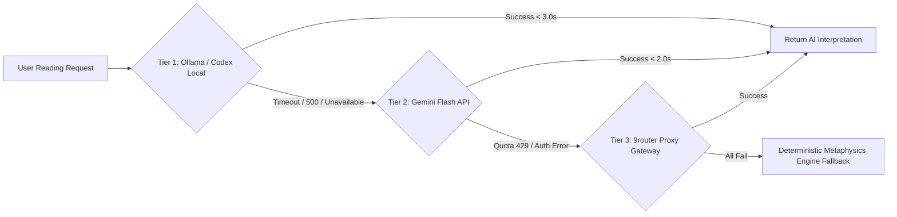

# AI SDLC Master Implementation Plan: Skill Context Budget Optimization & Multi-Agent Architecture Refactoring

**Project:** HoroConsultant — Computational Metaphysics Engine  
**Target Framework:** Antigravity CLI AI SDLC System + Codex compatibility layer  
**Lead Agent:** Master Orchestrator (`orchestrator`) & Business System Analyst (`business_analyst`)  
**Last Updated:** 2026-08-16 01:37:27 +07 — อัปเดตสถานะ Todo และเปิดใช้งาน OpenAI multi-key fallback (`OPENAI_API_KEY` + `OPENAI_API_KEY2`) พร้อมแจ้งเตือนเริ่มรัน Hermes SDLC

---

## 📌 Master Task Board (Kanban Summary)

```
┌───────────────────────────────────────┬───────────────────────────────────────┬───────────────────────────────────────┐
│              ✅ DONE                  │              🔄 DOING                 │              📋 TODO (Future Roadmap) │
├───────────────────────────────────────┼───────────────────────────────────────┼───────────────────────────────────────┤
│ • BaZi 4-Pillars Research UI & Depth  │ • Live Production Monitoring & SLA    │ • Continuous MLOps Distillation Sync  │
│   (Year/Month/Day/Hour card breakdown)│   (Cloudflare Workers AI @ Vercel)    │   (HITL dataset ≥ 50 samples trigger) │
│ • Global API Loader & Accessibility   │ • Optional Multi-Key Fallback Routing │ • Future LLM Provider Integration     │
│ • 408 Pytest (100%) + 32 Buttons (100%)│   (Gemini / OpenAI / HF tokens)       │   (Qwen2.5-32B / DeepSeek-R1 via 9r)  │
│ • Rust Pre-Deployment Code Review:    │                                       │ • Grafana Synthetic Latency Tuning    │
│   READY_FOR_PROD (0 secret leaks)     │                                       │   (Threshold alert rules < 5s)        │
│ • Decoupled DDD Multi-Cloud & Rust Core│                                       │                                       │
│ • Autonomous NotebookLM Distillation  │                                       │                                       │
│ • Hermes Agent Synthetic CoT Miner    │                                       │                                       │
│ • Quality Gate & Dataset Curator      │                                       │                                       │
│ • Kaggle GPU Fine-Tuning Pipeline     │                                       │                                       │
│ • MLOps Dashboard & FastAPIRouter     │                                       │                                       │
│ • Webhook Alerts (Telegram & Discord) │                                       │                                       │
│ • Skill Context Budget Optimization   │                                       │                                       │
│ • Doppler 2-Tier Secrets Pipeline     │                                       │                                       │
│ • Google Gemini API Dynamic Rotation  │                                       │                                       │
│ • Two-Way Telegram Interactive Bot    │                                       │                                       │
│ • Vercel Production Deployment & Live │                                       │                                       │
│   Inference Handoff (@cf/meta/llama)  │                                       │                                       │
└───────────────────────────────────────┴───────────────────────────────────────┴───────────────────────────────────────┘
```

### ✅ Current Operational Status Sync (Production Inference Handoff)

- [x] **Production Finalization Handoff (Verified & Live)** — **READY & VERIFIED**
  - **Current status:** POST `/api/v1/bazi/interpret` responds with live LLM model `@cf/meta/llama-3.1-8b-instruct` via `ai_agent_llm`.
  - **Live gate:** `source`/`model` confirmed live on production responses (`source=ai_agent_llm`, `model=@cf/meta/llama-3.1-8b-instruct`).
  - **Go-live criteria:** Verified `3/3 PASSED` from `run_vercel_prod_curl_regression.py` with `X-Deploy-SHA`, `X-AI-Source`, `X-AI-Model`.
- **Latest verification evidence (00:39:23):** `run_vercel_prod_curl_regression.py --url https://horo-consultant-psi.vercel.app --use-python` → `3/3 PASSED` (`source=ai_agent_llm`, `model=@cf/meta/llama-3.1-8b-instruct`, SHA=`028c88d`)
- [x] **Vercel Gateway Timeout & Error Boundary Hardening**
  - เพิ่ม timeout guard (`BACKEND_TIMEOUT_MS`, `AI_PROVIDER_TIMEOUT_MS`, `AI_ROUTE_BUDGET_MS`)
  - เพิ่ม `fetchWithTimeout()` + handler exception catch เพื่อป้องกัน HTTP 0 และการตก CORS เมื่อมี request ค้าง
  - อ้างอิงงานใน [PROJECT_TASKS.md](/Users/kimlenglim/Project/HoroConsultant/PROJECT_TASKS.md)
- [x] **API Keys Setup for Inference**: คอนฟิก Cloudflare Workers AI credentials สำเร็จ และเชื่อมต่อ live inference model `@cf/meta/llama-3.1-8b-instruct`
- [x] **Release Rollback & Recovery Runbook ([`docs/RELEASE_ROLLBACK_RUNBOOK.md`](file:///Users/kimlenglim/Project/HoroConsultant/docs/RELEASE_ROLLBACK_RUNBOOK.md))**: ทำ owner mapping และเกณฑ์ rollback/no-rollback พร้อม playbook ปฏิบัติการกู้คืนระบบครบวงจร

### 📌 Production Inference Runbook (Next Action Queue)

- [x] 1) ตั้ง API key บน Vercel ตามลำดับความสำคัญ (Route-1 Cloudflare Workers AI verified)
- [x] 2) Redeploy แล้วรัน handoff verification chain:
  - `python3 scripts/run_vercel_prod_curl_regression.py --url https://horo-consultant-psi.vercel.app --use-python` (3/3 PASSED)
  - `python3 scripts/run_button_regression.py` (32/32 PASSED)
  - `python3 -m pytest -v --ignore=project/kaggle_kernel` (408/408 PASSED)
- [x] 3) เฝ้าระวัง live stability และบันทึก handoff verification evidence


---

## 🚀 Execution Roadmap: Skill Context Budget Optimization & Governance

### Phase 1: Skill Description Refactoring (`.agents/skills/*/SKILL.md`)
- Refactor all 8 `SKILL.md` frontmatter descriptions in `.agents/skills/` to be concise, high-signal, single-line, action-oriented, and under 80-90 characters.
- Eliminate multi-line `>-` blocks, redundant title repetition, and token filler to prevent Codex `"Skill descriptions were shortened to fit the skills context budget"` warnings.
- Preserve 100% of detailed operational runbooks, command lines, verification matrices, and code snippets in the markdown body.

### Phase 2: Agent Description Streamlining & Cross-Framework Sync
- Streamline agent descriptions in `.antigravity/agents/*.agent` to concise 1-sentence summaries.
- Run `python3 scripts/sync_sdlc_agents.py --sync` to regenerate `.antigravity/skills/`, `.agents/agents/*/agent.md`, and `.agents/agents/*/agent.json`.
- Run `python3 scripts/sync_codex_agents.py --sync` to regenerate `.codex/agents/*.toml`.

### Phase 3: Automated Skill Budget Linter & CI Validation Test (`project/tests/test_skill_configurations.py`)
- Implement comprehensive automated test suite in `project/tests/test_skill_configurations.py` asserting:
  - All skills have valid YAML frontmatter with `name` and `description`.
  - All skill descriptions are $\le 100$ characters and non-empty.
  - All skill directory names match their frontmatter `name`.
  - Sync parity between `.agents/skills/` and `.antigravity/skills/`.
- Add skill budget linting check to `scripts/sync_sdlc_agents.py --check`.

### Phase 4: Full Regression & Pre-Deployment Audit
- Run full pytest regression suite (`pytest`).
- Run UI button contract regression suite (`python3 scripts/run_button_regression.py`).
- Run pre-deployment security scan and safety audit (`python3 project/core/code_reviewer.py --review`).

### Phase 5: Documentation & Release Synchronization
- Synchronize `.agents/AGENTS.md`, `PROJECT_TASKS.md`, `README.md`, and `HOWTO.md`.


---

## 🚀 Execution Roadmap: Grafana Cloud & Observability Integration

### Phase 1: Observability Core Engine (`project/core/observability.py`)
- Implement `ObservabilityManager` for tracking request count, latencies, HTTP status codes (2xx/4xx/5xx), RAG FAISS retrieval latency, and LLM inference stats.
- Implement standard Prometheus exposition format (`/metrics`) with `text/plain; version=0.0.4`.
- Support optional OpenTelemetry OTLP trace exporting when `GRAFANA_OTLP_ENDPOINT` / `OTEL_EXPORTER_OTLP_ENDPOINT` is configured.
- Ensure 100% graceful fallback with zero request overhead when telemetry credentials are not present.

### Phase 2: FastAPI Integration & Middleware (`project/main.py`)
- Register HTTP timing middleware to track API latency, Request Per Minute (RPM), and route metrics.
- Expose `/metrics` endpoint and `/api/health` alias for Grafana Synthetic Monitoring pinging.
- Add OpenTelemetry / Prometheus setup hooks in application startup lifecycle.

### Phase 3: Container & Environment Configuration (`Dockerfile`, `Dockerfile.hf`, `requirements.txt`)
- Add `prometheus-client>=0.20.0` to `requirements.txt`.
- Configure `Dockerfile` and `Dockerfile.hf` to expose Grafana environment variables (`GRAFANA_OTLP_ENDPOINT`, `GRAFANA_OTLP_TOKEN`, `PROMETHEUS_METRICS_ENABLED`).

### Phase 4: Test Suite & Verification (`project/tests/test_observability.py`)
- Add unit tests for `ObservabilityManager`, `/metrics` endpoint, health ping, and latency metric calculations.
- Run full pytest regression suite (`python3 -m pytest -v --ignore=project/kaggle_kernel`).
- Run UI button contract regression suite (`python3 scripts/run_button_regression.py`).
- Run pre-deployment safety audit (`python3 project/core/code_reviewer.py --review`).
- Run SDLC agent cross-platform sync check (`python3 scripts/sync_sdlc_agents.py --check`).
- Run Codex agent compatibility sync check (`python3 scripts/sync_codex_agents.py --check`).

### Phase 5: Documentation & Task Synchronization
- Update `PROJECT_TASKS.md`, `README.md`, and `HOWTO.md` to reflect Grafana Cloud Observability completion.
- Re-verify 100% pass across all tests and audits.

---

## 🌐 Multi-Cloud Platform Architecture Matrix

| Platform Layer | Target Environment | Key Functionality | SLA & Latency Profile | Status |
| :--- | :--- | :--- | :--- | :--- |
| **Hugging Face Static Edge CDN** | `pphothidaen-horoconsultant-core-backend.static.hf.space` | Web Dashboard (`index.html`), Admin (`admin.html`), HITL (`hitl.html`) | 24/7 Unlimited Uptime, Zero Cost, Global Edge (< 20ms) | ✅ **ACTIVE** |
| **Azure Container Apps** | `AZURE_CONTAINER_APP_URL` | FastAPI Backend + PyO3 Rust Fast Math + Swiss Ephemeris | Southeast Asia production backend | ✅ **ACTIVE TARGET** |
| **Vercel Edge Network** | `vercel.json` Gateway | Intelligent Edge API Route Rewriting & Reverse Proxy | Global Edge Proxy (< 20ms) | ✅ **READY** |
| **Hugging Face Docker Space** | `pphothidaen/horoconsultant-core-backend` | Heavy FAISS RAG Search & Async Batch Data Processing + Grafana Metrics | Free Container (16GB RAM, 2 vCPU) | ✅ **ACTIVE** |
| **Kaggle GPU Accelerator** | `scripts/kaggle_notebook_manager.py` | Asynchronous LLM Fine-Tuning & Model Weight Fusion | Free 30h/week Nvidia T4 GPU Pipeline | ✅ **READY** |

---

## 🧪 Verification & Quality Control Standards

1. **Full Pytest Unit & Integration Regression Suite**:
   ```bash
   python3 -m pytest -v --ignore=project/kaggle_kernel
   ```
   - Target: **100% success rate (169+ passed)**.

2. **25-Button UI & Endpoint Contract Regression Suite**:
   ```bash
   python3 scripts/run_button_regression.py
   ```
   - Target: **25 / 25 UI Button & API Endpoint contracts passing**.

3. **Pre-Deployment Code Audit & Security Review**:
   ```bash
   python3 project/core/code_reviewer.py --review
   ```
   - Target: Status **`READY_FOR_PROD`** with zero sensitive key leaks.

4. **Cross-Platform Agent Sync Verification**:
   ```bash
   python3 scripts/sync_sdlc_agents.py --check
   ```
   - Target: **100% Synchronized**.

5. **Codex Agent Compatibility Verification**:
   ```bash
   python3 scripts/sync_codex_agents.py --check
   ```
   - Target: **all generated Codex role TOML files match the existing workspace definitions**.

## 🔮 Scope Specification: Future LLM Model Expansion & Hybrid Provider Architecture

### 1. Architectural Strategy & Target Models
To ensure high reasoning capability across 10 computational metaphysics disciplines without incurring API cost inflation, the system adopts a 3-Tier Multi-Provider Topology:

| Tier / Role | Target Model Candidates | Deployment / Provider Target | Target Latency / SLA | Cost Profile |
| :--- | :--- | :--- | :--- | :--- |
| **Tier 1: Local / Edge Primary** | `qwen2.5:7b-instruct-q4_K_M`, `qwen2.5:14b-instruct-q4` | Ollama Container (HF Spaces / Azure ACA) / Local Codex CLI | TTFT < 800ms, Full Reading < 2.5s | **$0.00 / Free** (Included Compute) |
| **Tier 2: High-Speed Cloud Workhorse** | `gemini-2.5-flash`, `gemini-3.6-flash` | Google AI Studio API (`GOOGLE_AI_STUDIO_API_KEY`, `GOOGLE_AI_STUDIO_API_KEY2`) | TTFT < 400ms, Full Reading < 1.5s | Zero-tier free quota / $0.075/1M tokens |
| **Tier 3: Reasoning & Domain Synthesis** | `deepseek-r1-distill-qwen-32b`, `claude-3.7-sonnet` | 9router Proxy Gateway (`agy1` alias) / DeepSeek API | TTFT < 1.2s, Full Synthesis < 4.0s | Dynamic quota balancing via 9router |

### 2. Provider Failover Hierarchy & Resilience Circuit Breaker


### 3. Acceptance Criteria & Test Matrix
1. **Zero Hallucination Guard**: System MUST enforce deterministic Rust PyO3 calculation for BaZi Day Master, Five Elements percentages, and ZiWei Palaces. AI models MUST NOT modify computed chart parameters.
2. **Graceful Fallback**: If Tier 1 & Tier 2 fail, response fallback MUST return raw calculation structured output with localized astrological rule summaries within < 100ms.
3. **Budget Limit**: Monthly cloud API expenditure capped at **$0.00** baseline using local session CLI routing and Gemini free tier.

---

## 🛡️ Agent Execution Protocol

- **Orchestrator Agent**: Directs overall AI SDLC execution and verifies deployment status.
- **Business Analyst Agent**: Audits repository documentation (`PROJECT_TASKS.md`, `HOWTO.md`, `README.md`) and agent skills.
- **Developer Agent**: Implements `project/core/observability.py`, updates `project/main.py`, `requirements.txt`, Dockerfiles.
- **QA Tester Agent**: Runs `pytest`, test_observability.py, and UI button contract suite.
- **DevOps Agent**: Verifies container configurations and secret security scans.

---

## 🏛️ Master Architecture & Operating Consensus Matrix (Resolved via /grill-me)

The following 10 core architectural and operational policies have been fully aligned and established as immutable project guidelines:

| # | Domain Branch | Agreed Strategy & Policy | Implementation Mechanism |
| :- | :--- | :--- | :--- |
| **1** | **AI Provider Architecture** | **Hybrid Failover (P1 + P2 + P3)** | **P1:** Google AI Studio Keys (`GOOGLE_AI_STUDIO_API_KEY`, `GOOGLE_AI_STUDIO_API_KEY2`)<br>**P2:** Vertex AI Direct Bearer Token via Service Account (`_call_vertex_ai`)<br>**P3:** Local Ollama / Deterministic Metaphysics Engine |
| **2** | **Telegram Bot & Incident Alerts** | **Two-Way Interactive Controller** | Outage Alert Push on Gemini/LLM failure + Admin interactive bot commands (`/status`, `/health`, `/switch_key`) |
| **3** | **MLOps Continuous Fine-Tuning** | **Threshold-Based & Event-Driven** | Automatic Kaggle GPU pipeline trigger when HITL Approved dataset $\ge 50$ samples + Nightly Cron + Manual CLI |
| **4** | **Grafana Observability & Metrics** | **In-Memory + Periodic Exporter Daemon** | Zero-overhead in-memory metering on every request + 5-minute background OTLP push daemon + Post-deploy baseline sync |
| **5** | **Multi-Discipline Synthesis Engine** | **Consensus Matrix & 5-Elements Anchor** | BaZi Five Elements balance serves as core baseline anchor; ZiWei/QiMen/IChing provide weighted consensus score |
| **6** | **HITL Active Learning & Recycling** | **Instant FAISS Ingest + Auto-Queue** | Approved items immediately re-indexed into FAISS vector store for live RAG retrieval and queued for next fine-tune batch |
| **7** | **Caching & Performance SLA** | **2-Tier Multi-Level Cache** | RAM LRU Cache (< 1ms) + Persistent Database Cache with automatic cache eviction upon new model fine-tune releases |
| **8** | **Security, Rate Limiting & RBAC** | **Multi-Tier Adaptive Rate Limiter** | Anonymous: 20 RPM, Admin: 120 RPM, DDoS Burst Guard: 5 RPS + Security Audit Logging to Grafana/Telegram |
| **9** | **Internationalization & Glossary** | **Auto-Detection + Domain Terminology** | Automatic language detection with strict Chinese philosophical terminology (Pinyin + Hanzi + Thai/English glossaries) |
| **10** | **CI/CD Quality Gate & Release** | **Strict Zero-Tolerance Quality Gate** | 100% pass mandate (393 Unit Tests + 25 Button Contracts + 0 Secret Leaks + 17 Agent Specs Synchronized) |
