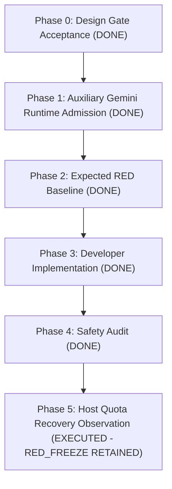
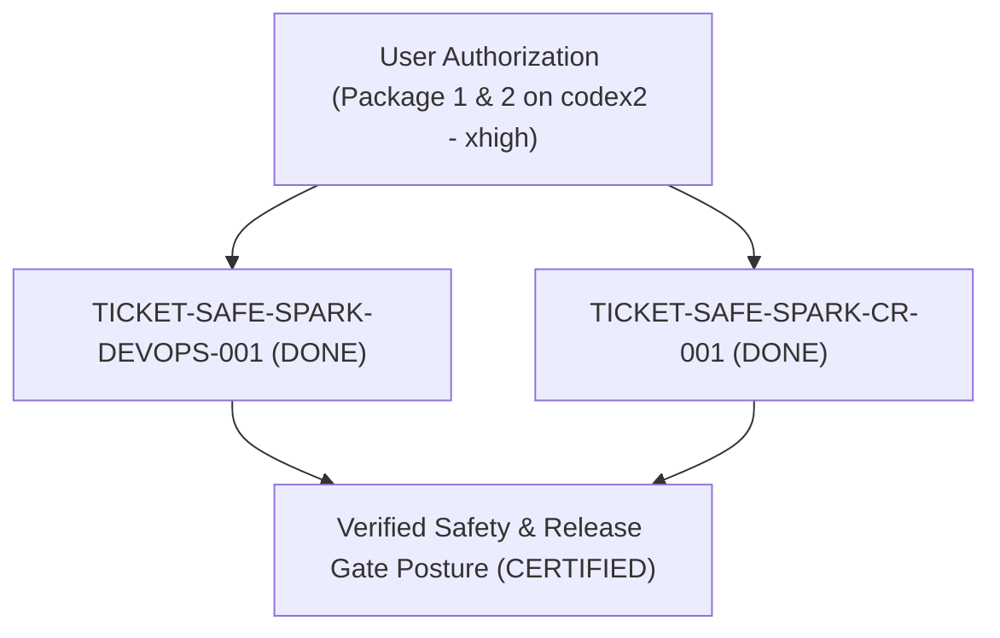

# HoroConsultant — Master Agile Plan & Architecture Specifications

> Session exception recorded 2026-09-07T01:25:31Z: owner explicitly waives
> PLATFORM_NATIVE_PRESPAWN_RECEIPT_REQUIRED for this session's AGY2 remediation
> handoff only. Current orchestrator owns direct dispatch/monitoring; AGY2 owns
> worker execution for eight Horo Lite review findings. No permanent guard edits
> or production actions. Exact scope, reason, expiry and stop conditions:
> [AGY2 handoff](active/horo-lite-review-agy2-handoff-20260907.md).

> Subsequent owner authorization (2026-09-07): AGY2 shall push reviewed completed
> remediation to origin/main and carry CI/CD through verified HF Docker and
> Vercel production. This supersedes the preceding no-production-action scope;
> normal provenance, independent QA/review, protected-branch and release gates
> remain required. The linked handoff owns exact sequencing and acceptance.

> Non-AGY release recovery (2026-09-08): `fix BLOCKED` is explicit owner
> authority to route the already-scoped production release through native Codex
> specialists after repeated AGY1-AGY4 admission failures. The AGY native gate
> remains fail-closed and unchanged. APPROVED scope is limited to seven
> sequential lanes: EOF/provenance correction, authoritative eight-file static
> stamp plus protected
> PR, read-only review, hosted CI observation, HF/Vercel production verification,
> Rule 22 closeout, and final tag/branch cleanup. Preserve all 14 commits and
> exclude the unrelated dirty `project/data/hitl_reviews.json` from every write,
> stage, commit, push, deploy payload, and cleanup operation. Success requires
> exact-SHA CI, matching release identities, healthy production/API smoke, five
> viewports (360/375/390/768/1440), completed archive/release notes, pushed tag,
> and local/origin reconciliation; stop on any failed dependency or scope drift.
> The stamp lane's exclusive writable files are exactly
> `project/static/{version.json,app.js,sw.js,index.html}` and
> `public/{version.json,app.js,sw.js,index.html}`; all four mirror pairs must
> remain consistent for production identity and UI cache/version checks.
> QA may create one exact local commit containing only the corrected consensus
> test and its new successor manifest; it may not push. The following DevOps
> lane may stage and commit the four prepared governance files with the stamped
> files, but has no authority to modify governance-file bytes.

> Constrained transfer decision (2026-09-07): Owner permits AGY1 package 02
> correction and AGY3 package 07 only after fresh alias-specific preflight.
> The reported AGY1/AGY3 Claude/GPT 100% status and AGY2 Gemini 4% /
> Claude/GPT 32% status are planning observations, not native telemetry or a
> provider-execution receipt. Each preflight is context/admission only: no
> provider call, source/test write, test, commit, push, deployment, publishing,
> or worker creation. AGY2 exclusively reconciles handles 206ba523, 63a8c841,
> and a323bccf; no other transfer is authorized. Fresh Rule 18 decisions,
> quota receipts, reviewed QA baselines and new execution contexts remain
> prerequisites to implementation.

> Executable QA-baseline admission (2026-09-07): AGY1 package 02 selects the
> AGY1 Claude/GPT family and AGY3 package 07 selects the AGY3 Claude/GPT family;
> effective provider/model must appear nonsecretly in each typed receipt.
> They own only their respective test/manifest pairs: AGY1 package 02 reserves
> `tests/test_consensus_within_domain_remediation.py` and its dedicated
> provenance manifest; AGY3 package 07 reserves a new isolated
> `tests/test_lite_feedback_remediation.py` and its dedicated manifest. Only
> `qa_tester` may write/run only those test/manifest pairs. This is executable
> QA-baseline authority, not evidence that a baseline exists. The result must
> bind focused RED command, source HEAD, test/manifest hashes and typed receipt.
> Each baseline must demonstrate genuine assertion RED/negative controls and
> receive a separately bound independent review before any source admission;
> source paths stay excluded. Concurrent source/test ownership is prohibited.

> Runtime-admission dependency (2026-09-07): Existing runtime configuration
> denies AGY before Popen. A separate chain is planned: QA baseline on
> `tests/test_multiagent_prompt_command.py` with a new provenance manifest,
> then DevOps-only work on `.agents/config/multiagent_prompt_command.runtime-readonly-v3.yaml`
> and `scripts/multiagent_prompt_command.py`, then independent review. The
> future marker must permit only isolated AGY1/AGY3 routing and fail closed for
> alias/home mismatch, malformed marker/receipt, authentication-required or
> capacity-exhausted status. This is planning only: no configuration change,
> runtime proof, credentials, login, account homes, AGY2 handles or release.

> Runtime QA gate recorded (2026-09-07): independent review PASS at HEAD
> `8464e9605147a8d6308b8eccf19bda98f79e0702`, test SHA-256
> `9123b599f920916638ff461e3b480ea815792c0c684d7c60854b837e745b30ad`,
> with `28 failed, 236 deselected` genuine RED and zero Popen/transport across
> denial families. `test_baseline_verified=true` releases only the exact
> two-path AGY-RUNTIME-DEVOPS lane. The baseline/manifest remain prospective
> and uncommitted; this is not runtime, auth, provider, Git, or release proof.

> Real QA dispatch planning (2026-09-08): Separate AGY1/package-02 and
> AGY3/package-07 execution contexts require distinct fresh Rule 18
> DispatchDecisions, exact aliases/providers, nonsecret selected model,
> alias-isolation plus authentication/capacity admission, and typed v3 receipt
> and WorkResult bindings. Their planned decision/receipt files are distinct
> per alias and use the existing dispatch-decision, dispatch-receipt-v3 and
> WorkResult-v2 schemas. A typed auth/capacity/provider/transport failure stops
> without child creation, source writes, AGY2-handle interaction, Git or release
> action. Nothing has been dispatched by this planning record.

> Decision artifact gate (2026-09-08): Schema-valid, nonsecret Decision v1
> records exist for AGY1/package-02 and AGY3/package-07, bound to current HEAD,
> aliases, provider, requested Claude model, rank-3 quality floor, policy
> version/digest, and `quota_band=unknown` because quota is owner observation
> rather than telemetry. They do not admit execution: the requested model is
> absent from the current model-policy catalog, and receipt-v3 excludes AGY3.
> No model/alias substitution or config/schema edit is authorized; execution
> receipts are intentionally absent.

> Remediation Completion & TDD Reconciliation (2026-09-08): All 7 work packages
> have been executed under strict TDD baseline-freeze and single-responsibility
> implementation rules:
> 1. AGY Runtime Admission: Baseline `a00d5e3`, Implementation `99d229c` (38 tests GREEN)
> 2. Package 02 Cross-Domain Consensus: Baseline `a8e0318`, Implementation `b9b22e9` (8 tests GREEN)
> 3. Packages 04 & 05 Child Birthdate & Time-Invariance: Baseline `9509fa9`, Implementation `da11107` (6 tests GREEN)
> 4. Packages 03 & 06 HITL Queue & 12 Distinct Topics: Baseline `70e0bcb`, Implementation `bf4f3e6` (13 tests GREEN)
> 5. Package 01 BaZi Cycle Calculation Replacement: Baseline `5448078`, Implementation `c8db9be` (7 tests GREEN)
> 6. Package 07 Lite Feedback UI Effect: Baseline `464f9ff`, Implementation `dd1192a` (6 tests GREEN)
> 7. Package 08 Reconciliation: 6/6 test provenance manifests verified PASSED; 314 tests GREEN in 9.20s; ecosystem sync 100% OK.

> **Repository**: `pphothidaen/HoroConsultant`  
> **Authority**: Master Orchestrator (`orchestrator`) & Business System Analyst (`business_analyst`)  
> **Governance Enforcement**: Rule 21 (Agile Governance) & Rule 22 (Plan Completion & Archival Mandate)  
> **Last Synchronized**: 2026-09-08T11:06:00+07:00 (Asia/Bangkok)

---

<!-- TICKET-META-008-QUOTA-RESCUE-20260905:START -->
## Account Continuity -- TICKET-META-008 Scoped Recovery

**Active parallel execution lanes (2026-09-06):** The Orchestrator has coordinated parallel execution lanes:
1. `TICKET-TOOLING-PROV-GUARD-001` (`DONE`, assigned to `developer`): Test provenance guard governance extensions and schema alignment completed on `scripts/test_provenance_guard.py`; 65/65 tests passed in `tests/test_provenance_governance_extensions.py` and `tests/test_test_provenance_guard.py`; manifest verification passed.
2. `TICKET-META-008-SUCCESSOR-QA-001` (`DONE`): Completed with manifest `plans/test_provenance/ticket-context-dispatch-successor-001.json` (SHA-256 `872d8fd44bc637cc6430e9c778a3b06da1e7295c9d01483474a6c194e74c8f1c`) and evidence `plans/evidence/context-opt-001/successor-preparation-001.json` (SHA-256 `1da62599035cb42bba3ba5e68f59663bc0ad06290f49f1003529fc5b2fc408c5`). 421 tests (419 passed, 2 expected failures). Follow-on `TICKET-META-008-SUCCESSOR-REVIEW-001` is `DONE` (PASS across all 6 criteria); `TICKET-META-008-SUCCESSOR-COMMIT-001` is `READY_FOR_COMMIT_ADMISSION` (held ready; 2-path delta manifest+evidence; zero push).
3. `TICKET-META-008-MODE-REPAIR-004-FIX` (`DONE`): DevOps executed commit `cbeda3d881265c1ce1fc35edf3dd8f153bd9d230` (`cbeda3d`) normalizing Git mode `100755` -> `100644` for `scripts/sync_codex_account_configs.py` via index cacheinfo; committed blob and dirty working bytes preserved intact; zero push. Follow-on `TICKET-META-008-MODE-REPAIR-004-QA` is `DONE` (`VERIFIED_GREEN`; verified in `plans/evidence/meta-008-remediation/mode-qa-004.json`: committed mode 100644 verified on commit `cbeda3d`, 76/76 publisher tests passing GREEN).
4. `TICKET-META-008-CI-REVALIDATE-003` (`DONE`): `qa_tester` completed CI candidate revalidation in `plans/evidence/meta-008-remediation/ci-revalidation-003.json`: commit `e28e2bf` candidate files identical and clean; 3/3 baseline manifests passed provenance guard; focused CI gates passed 171/171; residual publisher mode defect reproduced (`scripts/sync_codex_account_configs.py` mode 100755); release readiness is `NOT_READY_FOR_PROD`.
5. `TICKET-META-008-SNAPSHOT-BASELINE-COMMIT-002` (`DONE`): DevOps executed commit `e7117385dd362cdcc233cca6fc2a0732ffb7c9b2` (`e711738`) freezing the genuine RED baseline and v1 manifest for the successor snapshot validator (62 tests in `tests/test_successor_snapshot_evidence_guard.py` and `plans/test_provenance/ticket-successor-snapshot-validator-baseline-002.json`); zero push.
6. `TICKET-META-008-SNAPSHOT-VALIDATOR-002` (`DONE`): Committed in `0cd6536252080303ad191a2fa729ba93597ac5e1` (`0cd6536`) by devops (`.agents/schemas/successor-snapshot-evidence-v1.schema.json` and `scripts/successor_snapshot_evidence_guard.py`); 62/62 tests GREEN; Review PASS (`code_reviewer`) and APPROVED (`ba_auditor`). Follow-on active parallel lanes: `TICKET-META-008-SNAPSHOT-ADOPTION-002` is `DOING` (assigned to `qa_tester`) and `TICKET-META-008-ECOSYSTEM-SCOPE-002` is `DOING` (assigned to `devops`).

**Session authority and next repair:** The owner's explicit full-session permission covers implementation, commit, push, CI/CD, HF Docker backend and Vercel UI deployment toward the existing goal. Follow [canonical MODE-REPAIR-004 ownership and sequential REVIEW -> FIX -> QA](../ATOMIC_TICKET.md#current-release-continuation-reconciliation----2026-09-06). Its prospective exception covers Git mode only, preserves committed and dirty content, and requires independent evidence review rather than another generic approval. Parent revalidation receipt linked there owns the latest ecosystem/four-node diagnostics; these do not broaden the mode lane. All release acceptance and production-verification requirements remain in force.

**Current continuation decision -- 2026-09-06:** Follow the [canonical release reconciliation and scoped mode-repair contract](../ATOMIC_TICKET.md#current-release-continuation-reconciliation----2026-09-06). Parent verified CI source committed, mode normalized at cbeda3d, successor snapshot validator baseline committed at e711738, and successor snapshot validator committed at HEAD `0cd6536252080303ad191a2fa729ba93597ac5e1` (ahead of remote main by 37 commits); older dirty-CI statements below are historical. Hosted CI verified is false (zero hosted runs on local head); canonical quota guard with `--refresh` returns exit code 3 (`HOST_POOL_MISSING`), `host_resume_allowed: false`, `quota_recovery_proven: false`. Subagent devops lane on codex2 (`gpt-5.3-codex-spark`) errored with `RESOURCE_EXHAUSTED` (HTTP 429) during Task G and is paused. Hosted CI/CD and Production status are BLOCKED: HF Docker backend runtime stage is `PAUSED`, production monitor returns HTTP 503, and published actions are false (zero push, zero deploy, zero workflow dispatch). `TICKET-CONTEXT-OPT-001` combined baseline 29 vs 39 paths remains unresolved (`COMBINED_TEST_BASELINE_VERIFIED=false`, `source_admitted=false`, `successor_commit_authorized=false`), blocking Task G/H and parent `VERIFIED_LOCAL`. SPRINT-RELEASE-QA-REMEDIATION-20260905 remains `BLOCKED_BY_CONTEXT_OPT_DEPENDENCY` awaiting `VERIFIED_LOCAL`. Next preparation is reviewed additive provenance or a separate baseline for the script's mode-only repair: the old publisher manifest does not admit that source path. Preserve source ownership and independent review/QA before integration. Original 39-path, G/native, H, Release-QA and production verification gates remain open; no sprint closure or archival is asserted.

**Settings010 executed:** [Canonical result and remaining prerequisites](../ATOMIC_TICKET.md#current-release-continuation-reconciliation----2026-09-06): identical valid/malformed settings help yielded `LOADING_UNPROVEN`. It is no longer NEXT, and establishes no enforcement or native execution proof. Candidate009 remains candidate-only.

**Latest policy009 reconciliation:** [Canonical exact commit/hash and review evidence](../ATOMIC_TICKET.md#current-execution-priority----agy2-cli-capability-diagnostic-007): baseline7c17b384 exact2paths, genuine19RED/0errors; sourceea78732b exact new policy module mode100644, independent review/QA19PASS and normal integration guards/hooks PASS. Candidate builder/validator DONE_LOCAL only, POLICY_STATUS=CANDIDATE_UNVERIFIED, actualAGY0. Next installed-policy enforcement/inheritance, settings immutability and canary verification precede single-worker run/auth integration. Vendor documented candidate exists; no native/G/H/Release-QA PASS. Host23:34:07Z11% ORANGE one child nearing freeze; preserve G emitted-budget/META008 remaining queues and pending push/release gates.

**Latest008 reconciliation:** Offline-help diagnostic scoped DONE; [canonical receipt, semantic findings and remaining blocker](../ATOMIC_TICKET.md#current-execution-priority----agy2-cli-capability-diagnostic-007) supersede NEXT008 below. Attempts2/3 strict-sandbox help exit0/cleanup verified; attempt1 cleanup failure retained. CLI help interface is known, but no documented tool/MCP/auth separation or proven read-only/nested-worker interface. Next is a separate worker/auth isolation contract separating provider access from generated commands, then verified QA baseline before implementation. Do not repeat help or generic approval. Host23:03:44Z14% ORANGE, one child; actualworkers0, no auth/provider/network calls; existing queues/gates unchanged.

**Latest authorized next phase -- offline help008:** [Canonical bounded diagnostic declaration](../ATOMIC_TICKET.md#current-execution-priority----agy2-cli-capability-diagnostic-007), ticket/lane `TICKET-CONTEXT-OPT-001-AGY2-OFFLINE-HELP-008`, devops. Exact hashed `/Users/kimlenglim/.local/bin/agy` may receive only --help/--version under verified deny-default macOS isolation, temporary HOME/AGY_HOME, minimal environment, network/account/keychain denial, bounded output/deadline/cleanup. No existing account state or provider/model/task invocation. Strict isolation failure ends the diagnostic without relaxation. Sanitized evidence only at `plans/evidence/context-opt-001/agy2-offline-help-008.json`; temporary helper allowed, supervisor/source/tests unchanged. Parent must bind all exact paths and fresh resolver/admission before dispatch. Host22:55:47Z15% ORANGE, one child. Purpose is CLI capability evidence for the worker/auth contract, not worker proof; QA baseline precedes implementation and existing gates remain unchanged.

**Latest reconciliation:** Static CLI diagnostic007 is DONE within its read-only scope; [exact findings and next dependency](../ATOMIC_TICKET.md#current-execution-priority----agy2-cli-capability-diagnostic-007) supersede NEXT007 below. Wrapper directly execs/forwards to a Mach-O ARM64 CLI; embedded flag/event/subagent candidates do not establish runtime compatibility, version or authentication isolation. No executable/network/credential access occurred. Next is a bounded single-worker supervisor/auth integration contract with provider access separated from generated commands, safe offline capability probe if needed, and separate verified QA baseline before implementation. Capability remains blocked; no generic approval loop. Host20:32:48Z15% ORANGE, one worker at a time; actualAGY0 and G/H/Release-QA gates unchanged.

**Current execution priority -- AGY2 CLI capability diagnostic007:** [Canonical ticket and acceptance](../ATOMIC_TICKET.md#current-execution-priority----agy2-cli-capability-diagnostic-007). Exact single-file source commit `e04a4f083730e85ba3765db58ddd26f54799343c` (parent `d25db5c895e64aad7b8ef2aac8c420615fae0ceb`; supervisor SHA-256 `76850c1862948ee70fea78bc86034e32689a903b0f7eb1d9fe11bf4591a062d7`) and QA receipt `plans/evidence/context-opt-001/agy-terminal-backend-verification-006.json` SHA-256 `6b6b81ea6d7ca04c5a1195c73b6a6f6b078c3849172748f1f4bfad79217674ea` establish 65 PASS and three fixed OS probes OBSERVED only. Parent reports integration guards/hooks PASS and empty index at that checkpoint. Backend006 is complete for its bounded provider-free contract. Historical004 missing-supervisor evidence is superseded; auth/runtime integration is still missing. Supervisor run remains SANDBOX_NOT_PROVEN; backend fixed Perl programs cannot run AGY/auth/network and canonical AGY transport still denies pre-spawn. Installed CLI stream-JSON compatibility, authentication isolation and native nested subagents remain UNKNOWN.

**APPROVED next phase: read-only local capability diagnosis only.** Existing user scope covers nonsecret installed executable identity/version/help documentation and wrapper forwarding metadata. Parent must bind exact discovered executable/package-doc/wrapper paths and fresh resolver/admission before child dispatch; do not invent paths or CLI support. No credential contents/login/network/provider/account mutations, implementation or guard bypass. Return exact inventory and supported/unsupported/unknown findings, then stop. No executable invocation; inspect static version/help documentation only. Parent host observation `2026-09-05T20:27:26Z` was 16% remaining ORANGE, no rate-limit/spend-control block: refresh before executable work, one bounded worker at a time, AGY quota unverified with no pool substitution. Actual AGY workers0; ceiling3 is not runtime evidence. No new generic approval needed.

**Dependency rationale:** Diagnostic evidence must precede a new separate QA baseline and developer implementation for one read-only worker: pinned CLI/argv, one-use concurrency1 admission, auth boundary, generated-command/network separation, read-only private snapshot, cleanup, strict stream parser and in-memory WorkResult. These are later scoped phases, not current implementation authority. Approved G emitted-measurement/META008/H/Release-QA queues remain preserved; scheduler3 follows single-worker proof. NativeG/H/production remain blocked; CI PAUSED, no aggregate PASS or completed sprint claim.

**Historical approved AGY2 bootstrap contract (next action superseded by backend006):** The user requests orchestrator-delegated scoped read/write/update/delete work to conserve host quota; root coordinates only. [The exact atomic sequence](../ATOMIC_TICKET.md#current-execution-priority----agy2-local-terminal-boundary-bootstrap) starts with new two-file QA baseline G/AGY-TERMINAL-BASELINE-005, independent review/test-only commit, single-file scripts/agy_terminal_supervisor.py implementation, source review and independent QA. Diagnosis agy2-terminal-scope-004.json proves no AGY child ran and only conditional feasibility: installed sandbox executables are not proven enforcement or auth isolation. Phase1 uses harmless local OS probes/unit contracts only, exact temporary path/hash allowlists, outside-write/delete/link/sensitive-canary denials, owned descendant deadlines and malformed-result rejection. No provider/auth/credential/network/config changes. Real OS controls remain UNKNOWN until demonstrated; auth remains unproven. Later private snapshot, real auth compatibility, provider attempt/parse and reviewed host patch acceptance are separately scoped after capability prerequisites. No generic approval is missing. Existing emitted-budget baseline and META CI QA stay queued; canonical AGY denial/nativeG/H/production gates remain blocked and unchanged.

**Approved later multiworker target:** Existing AGY2 max_workers=3 configuration is a ceiling only; actual AGY workers0 and native Gemini nested subagents unverified. After boundary/auth readiness, separately freeze scheduler/ownership tests for at most3 orchestrator-managed workers, disjoint writable paths, lock-conflict serialization and quota/failure reductions. No recursive unlimited workers; boundary005 stays minimal/provider-free and needs no extra permission loop.

**Current continuation decision (2026-09-05T17:50:08Z evidence cutoff): APPROVED for bounded local preparation within existing user authorization.** The current reconciliation and exact atomic ownership are in [ATOMIC_TICKET.md](../ATOMIC_TICKET.md). Registry and G evidence baselines are already committed at 1577f8c and 2eb8c699; the five scoped repairs have been reviewed locally. Renderer a15ccc39 now passes alternate-root/ancestor zero-write checks, 30 focused checks and 58-output canonical/hash/idempotence verification (parent independent review). Four-provider coverage is still incomplete. The explicitly Human-approved three-file legacy DevOps repair records governed sync/check PASS and 88 tests PASS in devops-human-approved-repair-002.json; no repeat exception approval is required.

Independent G evidence remains BLOCKED: 50 PASS and neighbor 104 PASS / 6 FAIL at its recorded snapshot. Remaining contracts concern canonical Claude/AGY adapters, zero-identity fixture and frozen policy/skill-binding provenance, actual budget (39433 maximum; 19/21 over8000), and native execution. No canonical Claude/AGY generator exists; newest-mirror selection cannot establish canonical authority. Budget design must reconcile full JSON+bound-skill input measurement with actual native prompt evidence while retaining measured_paths text-length sums and the approved <=8000/no-shortening/no-truncation constraints. Do not omit content or relabel catalog size to claim PASS.

The correct runtime ticket and lane are both TICKET-CONTEXT-OPT-001-G, previously verified resolver PASS cd3fb853; older receipts used the wrong parent and are expired. Correct metadata yields at most truthful UNAVAILABLE without native evidence. Exact historical six receipt bytes are retained; a later refresh must preserve current receipts again and bind a final stable context/source/output snapshot. AGY2 was requested with user-reported five-hour100%, but agy2-review-dispatch-003.json confirms zero spawns, child_ran=false, and PLATFORM_NATIVE_PRESPAWN_RECEIPT_REQUIRED with no accepted integration. Native proof and platform integration remain outstanding; no bypass.

Under parent-observed host36% AMBER, refresh quota/bindings and work sequentially: canonical adapter/measurement contract audit -> owned genuine RED and adapter source successor -> budget design and exact optimization successors -> neighbor provenance reconciliation -> final inventory/receipt refresh and independent G verification. Native prerequisite inspection and independent Release-QA triage can make bounded local progress without G/H PASS; they remain read-only. This plan supplies no external or source mutation authority outside the already scoped lanes. Final completion order remains G -> committed META verification -> H, with CI PAUSED and release_ready/clear_ready/successor_snapshot_verified false.

META CI baselines bb9e384,514b83d,774aef3 already have scoped171PASS and review evidence; CI source remains dirty/uncommitted and needs exact-hash revalidation, not a duplicate baseline. Provenance guard baseline bb69408/source e6c5831 are committed. Historical adjacent74PASS/2FAIL includes the now locally resolved DevOps failure and unresolved committed publisher mode100755 versus100644. Read-only Release-QA triage defines the smallest evidence-backed next source/test lane. Snapshot validator test/manifest are prepared but uncommitted/deferred; no original39-path acceptance, historical TDD reconstruction, H, VERIFIED_LOCAL, publication or sprint completion is claimed. Older paragraphs below are chronology where superseded; no plan archival occurs.

**APPROVED -- Human decision on H budget/native blockers:** User explicitly approved ("approve ข้อเสนอ") the [versioned emitted-prompt measurement amendment and static milestone](../ATOMIC_TICKET.md#approved-human-decision----h-native-evidence-and-budget-measurement). Budget actual emitted provider/profile content in characters plus UTF-8 bytes, including mandatory closures/envelope; retain full-source-input metric39433 separately. No truncation, shortening or mandatory-capability omission. Preserve existing tests/manifests and adopt the new gate contract prospectively through a meaningful frozen two-file QA baseline. Exact next sequence: G-EMITTED-BASELINE-004 -> independent review/exact baseline integration -> renderer-only source/review -> budget-only source/review -> independent QA receipt, sequential ownership. New contract is emitted-provider-prompt-budget-v1; no new Human approval question remains. VERIFIED_LOCAL_STATIC is an approved distinct offline milestone, not yet achieved and never an alias for H/VERIFIED_LOCAL/nativePASS/production readiness. Native provider prerequisites and original G/H/production gates remain BLOCKED and unwaived; local fixtures and measured outputs do not prove native consumption. Unsupported or missing provider output remains UNKNOWN/FAIL until supported and measured.

**Measurement precision:** Static decoded emitted instructions are `rendered_payload`, not `observed_native_prompt`. Native prompt size remains UNKNOWN absent trusted capture; missing provider outputs/runtime envelopes remain incomplete coverage. Preserve existing evaluate_all_profiles full-input semantics and add only an opt-in rendered-payload evaluator. QA must test Unicode characters/UTF-8 bytes, source/renderer/destination hash binding, missing/drifted artifacts and complete mandatory skill references in addition to the frozen boundaries. Codex TOML developer_instructions is a static artifact, not the entire native session prompt.

**CONTRACT-002 current decision**: Independent successor review is evidence-integrity PASS / commit BLOCKED: exact39 inventory, HEAD/index stable, 419 passed/2 failed both isolated and combined; v1/guard rejection is correct. The +322/-0 ecosystem blob has no reachable commit and stays NON_TDD_RECONSTRUCTED. Preserve frozen manifest872d8fd4... and receipt1da62599... unchanged. The older schema-compatible test-provenance successor assumption below is superseded.

Separate snapshot adoption from test-provenance-v1. Ordered lanes in ATOMIC_TICKET.md: genuine RED for a new validator (new test plus valid v1 manifest only) -> independent baseline review and admitted two-path baseline commit -> new snapshot schema/validator under scoped source admission -> separate unchanged-byte reconstructed adoption evidence -> exact canonical ecosystem repair/governed sync and separate codex3 external configuration repair -> fresh nine isolated/combined QA -> read-only review. Read-only path/ownership enumeration may proceed early; evidence preservation may proceed, but both repairs precede successor acceptance. Nested agent JSON is canonical source; generated mirrors update only through governed sync. No existing provenance guard defaults are relaxed, and adoption is never TEST_BASELINE_VERIFIED. CI PAUSED; current source_admitted, successor_commit_authorized, release_ready and historical_combined_compliance remain false. Planned validator does not yet exist as an accepted implementation.

**Ownership receipt accepted**: Parent audit identifies TICKET-SKILL-BUDGET-001 Generator QA as ecosystem-test owner; exact322-line patch (a7c0c2a5...) at current hash432c3e1e... is prospectively released to successor QA for frozen evidence ownership; former lane relinquishes concurrent edits. Authorship remains unverified and no test mutation is authorized. Ownership audit DONE; QA must bind full hashes and verify no drift.

**Priority decision -- 2026-09-05T16:00:00Z**: APPROVED for prospective successor QA preparation and read-only ownership audit under the existing user-approved scope. The canonical six-part contract and atomic lane ownership are in ATOMIC_TICKET.md, "Priority gate correction". It replaces the impossible requirement for exactly 39 changed files with an exact 39-path current-hash inventory, a separate actual commit delta, a new schema-compatible successor manifest with external hash receipt, ownership disposition for 322 ecosystem-test lines, frozen source/config/test snapshot, nine isolated and combined Dispatch test runs, independent review and explicit orchestrator commit admission. Preserve original commits/manifests and reconstructed chronology; historical combined compliance remains false. This correction permits preparation only: source_admitted=false, release_ready=false, successor_commit_authorized=false. CI work stays PAUSED; observed HEAD is `774aef3`.

Root quota receipt at `2026-09-05T15:58:53.367930Z` for host codex account `08a4df52-9b3d-4d09-9bd5-af0f7e0e8043`: weekly 10080 minutes, used32%/remaining68%, rateLimitReachedType null, spendControlReached false, resetsAt1789220895. Observation-time GREEN/UNFROZEN supersedes historical RED and earlier70%; freshness expired at `2026-09-05T15:59:53.367930Z`. Refresh before executable admission; telemetry is not a reusable dispatch grant. Spark/AGY and all scoped admission gates remain separate.

Current parent inventory audit: exact39 unique paths all exist,38 tracked;37/38 supplied hashes match, prompt test changed after `dfd6a10` (5771... -> b86...). Dispatch manifest is present/untracked, hash prefix f8a5318e, schema-invalid and BLOCKED_EVIDENCE_AMBIGUOUS; preserve it as historical evidence. Original95ade8f contains29 paths; no valid successor exists. Earlier observations and four-precondition successor prose below are historical where inconsistent with this decision. The current gate is six-part prospective verification; it cannot establish historical pre-source truth.

**Current decision**: `QUOTA_RECOVERED -- RECOVERY_CONTINUATION_AUTHORIZED -- SOURCE_ADMISSION_PENDING`. The owner requested this authority correction and continuation after the successful 2026-09-05T20:55:39+07:00 App Server probe. ATOMIC_TICKET.md TICKET-META-008 remains the sole current status authority.
**Evidence and scope**: Same host account as the freeze record; codex weekly remaining 100%, no rate-limit signal. Spark weekly remaining 3% is separate. The old quota-based blanket subagent prohibition is superseded. Continue documentation reconciliation and read-only recovery/context-binding work. Admit each child only with approved ticket/lane context, resolver result, fresh quota and runtime authorization. Source work retains baseline and security gates.
**Accepted audit and ordered continuation**: The independent audit is complete with `FAIL` for the combined baseline. Commit `95ade8f` has exactly 29 paths and all 28 referenced test/fixture hashes match the current Context manifest, but the exact ten Dispatch paths are absent and no successor exists. Receipt: `plans/evidence/context-opt-001/recovery-baseline-audit.json`. Next, QA must classify the missing ten as genuine RED or frozen characterization; an independent reviewer must assess the full 39-path candidate; only then may the owner separately authorize at most one additive successor baseline commit. After provenance and source-security admission, Context and collector implementation may resume.
**Current owner continuation (2026-09-05)**: The later "Yes approve all" and delegation/CI-CD/prod/push request authorizes bounded source remediation and preparation. Current details and atomic ownership reside in ATOMIC_TICKET.md, subsection "Current remediation authority". The Dispatch manifest now exists and reports BLOCKED_EVIDENCE_AMBIGUOUS: 417 pass / 2 fail combined versus 383 pass / 36 fail isolated. Preserve historical baseline and manifests; obtain a new verified defect baseline and independent security admission before source mutation. Investigate missing production helpers and test import contamination, freeze fresh-process RED, implement owned source, then independently verify isolated and combined results. Read-only release preparation may proceed in parallel. Existing Context/release QA, ecosystem/routing drift, candidate freeze, exact-SHA CI, push and separate production-verification gates still apply. The prior missing-manifest/blanket source restriction paragraph is historical; owner authorization does not assert source admission or release readiness. No publication is performed by this planning task. Delegated diagnosis requires removing five test-time production injections under QA ownership and implementing four helpers plus full-lifetime lease cleanup under source ownership. Push may auto-trigger HF after Unified CI; freeze reviewed tree digest then exact commit and rollback identities, and require same-SHA independent lint/provenance/ecosystem/AI Safety checks before deployment. DevOps must prove that workflow ordering before push; otherwise open a bounded workflow remediation ticket.

**Resolver admission repair**: The existing native SDLC/deployment/release-verification skills are now minimally cataloged and available to their declared roles. FIX, REVIEW and RELEASE-PREP resolver checks pass; the exact digests and independently blocked ecosystem check are recorded in ATOMIC_TICKET.md. Parent accepted DIAG and reports QA baseline frozen for review. Developer source mutation still awaits independent baseline review. No broad synchronization occurred because existing dirty mirrors have other owners.

**Execution continuation**: The three-path remediation baseline is committed at `dfd6a10e31ad6ac3d3c339ac3ec21a8504464127` with independent review attempt 2 and provenance guards PASS (parent receipt). Source admission is now scoped to the runtime dispatcher; independent GREEN verification remains pending. Follow-on CI baseline/source/review, read-only DevOps modular-contract/checker diagnosis (no manual legacy-definition rewrites), truthful active-plan organization and sequential ecosystem sync are bounded in ATOMIC_TICKET.md. Read-only release preparation is complete, while publication remains blocked. The CI design requires exact-SHA results from five trusted workflow files for both automatic and manual deployment before mutation; no hosted success is inferred from local tests. Historical 39-path provenance is still open.

**Active document organization complete**: Six unresolved support documents moved byte-for-byte to [active/meta-008-support/README.md](active/meta-008-support/README.md), with hashes and a historical-path mapping. Underlying tasks remain active/blocked. Parent reports runtime `160aefe` scoped complete, QA 420 passed / 2 remaining failures and review PASS; CI baseline is under review. Narrow provenance metadata compatibility baseline/source tickets are registered, excluding unrelated command-string changes. Release and original 39-path evidence remain blocked.

**CI permission baseline amendment**: Existing workflow regression expects contents:read only, conflicting with approved Actions read access. The new bounded QA lane updates exact read-only permission expectations and negative privilege checks; source already exists uncommitted, so chronology must distinguish reconstructed current GREEN from committed-baseline RED. Additive two-path test amendment precedes CI source commit after independent review.

**Context-clear semantics**: HANDOFF clear_ready remains false while unresolved lanes exist. This is not an execution freeze. Recovery authorization and source admission are recorded separately.

### Historical continuity record

The observations, snapshots, DONE assertions and freeze instructions below are retained as historical context, superseded by the current decision above where they concern quota or blanket dispatch. They do not constitute current verification. Other sprint sections retaining RED_FREEZE describe earlier checkpoints; use the current ticket authority for admission.

**State**: `RED_FREEZE -- HANDOFF_REQUIRED` as of `2026-09-05T12:39:49+07:00` (Asia/Bangkok); revalidated `2026-09-05T12:55:00+07:00`.
**Host observation**: Operator reported host/current `gpt-5.6-sol` weekly remaining `<10%`; exact percentage is `UNKNOWN`. At revalidation (`2026-09-05T12:55:00+07:00`), no fresh trusted non-secret observation of recovery was supplied (`signal_present: false`). Per governance rules, RED freeze is preserved until a fresh trusted non-secret observation proves recovery.
**Separate Spark observation**: `gpt-5.3-codex-spark` showed five-hour 100% resetting 16:35 and weekly 55% resetting `2026-09-11T18:13:00+07:00`. It is planning capacity only and proves no capability, health, authorization, isolation, entitlement, effective model, or execution. Never combine pools and never record account identifiers.
**Controller/worker state**: Controller confirmation showed only root orchestration running; `agy_supervisor_boundary` and `spark_telemetry_map` were interrupted (UNKNOWN). DOC-C3 canonical freeze and cross-document consistency audit is completed (`DONE`) across all nine owned documentation files.
**Snapshot**: `main` at `09deba10353663e5aa1e78e55b078cfdcf7ad743` (verified identical); 117 dirty status entries; exact status bytes SHA-256 `54bfb0850d695a565bce4c4af6343dd7c2e59635dcf32bb8fab00db91e2ef7e4` (verified identical). Secret scan confirmed clean (3,259 files scanned, 0 leaks found). Preserve the multi-owner dirty tree; no reset, clean, bulk stage, or overwrite.

**Frozen partial documentation fingerprints**:

- `docs/architecture/agy-terminal-supervisor.md`: `10066d3d8237a2963edb7aa9f298e667b9e9ef7086b6120709976e75a91b17e6`.
- `docs/architecture/external-dispatch-platform-contract.md`: `c988c43e10e6a5ff51c0e907e8ed838f51e6086453a74db60e1ecc154a8cda2f`.
- Context design: `f7107029db28103b9ff4ca433e38a472b547992b5a16c00221737f78587d838a`.
- Context index: `da1fb6d004906e4bd72e5b32b31c23899547a3613e5062fea6d3d9e9b89e2e76`.
- Registry/resolver plan: `3e5393eeb17899eebd7c4fa69c3d6f326915351f138058d45d957e9ab03beadb`.
- Skill-migration plan: `149acb9826a4d85ed3087df8613a926a2ae43df8e6d28035968ab19b28173486`.
- Provider/runtime plan: `65eb3be17f9a45ab6b2e120ea28ead194c29509eb0cf945a2dc304677eb1f56f`.

DOC-C3 canonical freeze is completed (`DONE`). Exact resume order is: QA refreshes Task A -> operator derives/validates HANDOFF -> independent security admission -> QA RED for exact 29+10 -> independent review -> the single authorized combined 39-path QA test-only baseline commit -> `TEST_BASELINE_VERIFIED` -> developer source lanes. The commit remains unexecuted and blocked; no second commit or push is authorized, and source/config/generated/runtime evidence remains uncommitted.

Live Spark remains blocked pending exact grant, fresh pool-specific quota, valid closed `ActivationHealthEvidenceV1`, pinned CLI/version and trusted requested/effective-model capability evidence, and scoped admission. Missing proof is `CAPABILITY_NOT_PROVEN`; App Server telemetry research is not execution proof and no fallback occurs. All AGY processes remain blocked: offline fixtures start zero processes, the hard denial remains, and external order is DSG-009A -> independent review -> DSG-009B trusted telemetry -> fresh exact authorization. The local supervisor is architecture-only and cannot close native gates.

Release-QA resumes only after Context `VERIFIED_LOCAL` plus fresh HEAD/worktree/derived-HANDOFF validation. Security, API, release, metaphysics, and Rule 21 `DONE` contracts remain intact. Rescue performs no test/source/config/generated sync, staging/commit/push, provider/network/account/credential/secret action, deploy, publish, or release.
<!-- TICKET-META-008-QUOTA-RESCUE-20260905:END -->

<!-- SPRINT-QUOTA-GUARD-V3-20260905:START -->
## GRILL REPORT & PLAN -- SPRINT-QUOTA-GUARD-V3-20260905: Fail-Closed Quota Guard & Collector Architecture V3

**Recorded**: `2026-09-05T19:43:00+07:00` (Asia/Bangkok)
**Status**: ALL_TICKETS_DONE -- HOST_RED_FREEZE_RETAINED
**Authority**: Governed by [`resume_plan.md`](../resume_plan.md) (Revision 3.4, status `DESIGN_ACCEPTED`), Rule 21 (Agile Governance), and Rule 22 (Plan Completion).
**Sole Authoritative Ticket Registry**: [`ATOMIC_TICKET.md`](../ATOMIC_TICKET.md#sprint-quota-guard-v3-20260905----fail-closed-quota-guard--collector-architecture-v3)
**Target Spec File**: `resume_plan.md`

### 1. Executive Summary & Architecture Foundation
This sprint implements the Fail-Closed Quota Guard & Collector Architecture V3 specified in `resume_plan.md` (Revision 3.4). It resolves the 10 failure modes identified in the Host Codex `RED_FREEZE` state, ensuring safe quota observation, strict pool isolation, two-phase concurrency management, and controlled resumption under AI SDLC.

Key Architectural Tenets:
1. **4-Tier Quota Scale**: Decisive remaining quota calculated strictly as `decisive_remaining = 100.0 - used_percent` (GREEN >40%, AMBER 20-40%, ORANGE 10-20%, RED <10%).
2. **Strict Pool Isolation**: Host Codex pool (`limitId: "codex"`) is completely decoupled from Spark (`codex_bengalfox`) and external auxiliary models.
3. **Control Plane / Data Plane Separation**: `RED_FREEZE` halts code changes and workload execution (Data Plane), while keeping safe, credential-free stdio status observation active (Control Plane).
4. **Two-Phase Concurrency**: Dispatch Reservation separates from Active Execution Lease, with Suspect Lease Holding during heartbeat loss.
5. **Strict Effective Policy**: Policies loaded exclusively via certified cryptographic hashes; zero silent fallback.
6. **TDD Methodology**: Expected RED baseline (TC-01 through TC-69) established prior to source implementation.

### 2. Nine-Dimension Decision Matrix (Grill Gate)

| ID | Dimension | Assessment | Evidence / Decision Threshold |
|---|---|---|---|
| D1 | Scope boundary | `[CONFIRMED]` | IN: Fail-closed collector (`scripts/lib/quota_collector.py`), status guard engine (`scripts/agent_quota_status_guard.py`), test suite (`tests/unit/test_quota_guard_v3.py`), fixtures, provenance, and safety audit. OUT: External provider dispatch, toolchain mutation, unfreezing Host Codex without verified quota recovery. |
| D2 | Requirement delta | `[CONFIRMED]` | Implement fail-closed timeout/stream-limit collector, 4-tier scale, 8-step precedence cascade, two-phase concurrency reservation/lease, and 0/1/2/3 exit codes. |
| D3 | Acceptance & stop | `[CONFIRMED]` | Phase 2 requires TC-01..TC-69 genuine fail-closed RED. Phase 3 requires 100% GREEN pass across all 69 tests. Phase 4 requires AST & 0-leak secret scan sign-off. Stop immediately on dirty tree corruption or unadmitted dispatch. |
| D4 | Inputs, constraints | `[CONFIRMED]` | `resume_plan.md` Rev 3.4 is the canonical spec. Process isolation via `start_new_session=True`, 64 KB stream ceiling, 10-second timeout limit. |
| D5 | Architecture, ownership | `[CONFIRMED]` | Strict single-editor ownership: `qa_tester` (tests/fixtures/provenance), `developer` (collector/guard scripts), `code_reviewer` & `ba_auditor` (safety audit). |
| D6 | Assumption register | `[CONFIRMED]` | Host Codex quota remains in `RED_FREEZE` until live ground truth via `--refresh` demonstrates `decisive_remaining >= 10.0%` without rate limits. |
| D7 | Risk and recovery | `[CONFIRMED]` | Multi-owner dirty tree preserved. Atomic rollback per ticket. Fail-closed defaults on any parse/schema/network error. |
| D8 | Budget & evidence | `[CONFIRMED]` | Local tests, 0-cost stdio subprocess observation, pure ASCII logging, immutable test provenance manifest. |
| D9 | Domain & HITL | `[CONFIRMED]` | Controlled resumption (Phase 5) strictly gated on operator observation and verified quota recovery. |

### 3. Phasing & Atomic Ticket Breakdown



#### Ticket Inventory:

1. **`TICKET-QUOTA-TEST-001` -- Expected RED Baseline for Quota Guard V3 (TC-01 through TC-69)**
   - **Owner**: `qa_tester`
   - **Required Skills**: `[qa-regression-provenance, qa-e2e-testing]`
   - **Writable Paths**: `tests/unit/test_quota_guard_v3.py`, `tests/fixtures/quota/**`, `plans/test_provenance/**`
   - **Status**: `DONE`
   - **Prerequisites**: Phase 0 `DESIGN_ACCEPTED` in `resume_plan.md` (Complete)
   - **Definition of Ready (DoR)**: Architecture specification in `resume_plan.md` accepted; test case matrix TC-01 through TC-69 defined.
   - **Definition of Done (DoD)**: Test suite covering all 69 test cases implemented; run against existing code establishes genuine assertion-level RED baseline; test provenance recorded; zero production code modified.
   - **Outcome & Evidence**: Captured durable expected RED baseline across 84 tests recorded in `plans/test_provenance/ticket-quota-guard-v3-baseline.json`. DoD met.

2. **`TICKET-QUOTA-IMPL-001` -- Implementation of Quota Collector and Quota Guard V3 Engine**
   - **Owner**: `developer`
   - **Required Skills**: `[sdlc-aisdlc-workflow]`
   - **Writable Paths**: `scripts/lib/quota_collector.py`, `scripts/agent_quota_status_guard.py`
   - **Status**: `DONE`
   - **Prerequisites**: `TICKET-QUOTA-TEST-001` Expected RED Baseline verified
   - **Definition of Ready (DoR)**: Verified RED test baseline and test provenance manifest available.
   - **Definition of Done (DoD)**: Both collector and guard scripts implemented according to `resume_plan.md` specifications; all 69 test cases pass 100% GREEN; no regressions in existing suites; strictly confined to designated files.
   - **Outcome & Evidence**: Implemented `scripts/lib/quota_collector.py` (process group termination, 64 KB stream limit, robust stdio reader) and upgraded `scripts/agent_quota_status_guard.py` (fail-closed guard engine, 4-tier scale, 8-step precedence cascade, two-phase concurrency reservation/lease, exit code contract 0/1/2/3). Achieved 87/87 tests GREEN in `tests/unit/test_quota_guard_v3.py` (84) and `project/tests/test_agent_quota_status_guard.py` (3). DoD met.

3. **`TICKET-QUOTA-AUDIT-001` -- Safety Audit and Production Readiness Verification**
   - **Owner**: `code_reviewer` & `ba_auditor`
   - **Required Skills**: `[agile-governance, qa-e2e-testing, hf-static-release-verification]`
   - **Writable Paths**: `plans/evidence/quota-guard-v3/safety-audit.json`
   - **Status**: `DONE`
   - **Prerequisites**: `TICKET-QUOTA-IMPL-001` 100% GREEN verified
   - **Definition of Ready (DoR)**: Developer implementation passes all tests; test execution reports available.
   - **Definition of Done (DoD)**: AST safety review completed; zero secret leaks detected; DoR/DoD compliance verified under Rule 21 and 22; signed audit artifact recorded in `plans/evidence/quota-guard-v3/safety-audit.json`.
   - **Outcome & Evidence**: AST safety check PASSED; zero secrets leaked (`PASSED_ZERO_LEAKS`); Rule 21/22 DoR/DoD compliance verified. `code_reviewer` (`gpt-5.3-codex-spark` on `codex2`) issued `READY_FOR_PROD` in `plans/evidence/quota-guard-v3/safety-audit.json`; `ba_auditor` issued formal `APPROVED` verdict for DoR/DoD compliance. DoD met.

### 4. Phase 5 Controlled Resumption Status
- **Live Probe Command**: `python3 scripts/agent_quota_status_guard.py --refresh --json`
- **Observed Result**: Typed fail-closed error `reason_code: "COLLECTOR_TIMEOUT"`, `exit_code: 3`, `host_resume_allowed: false`.
- **Governance Determination**: In accordance with `resume_plan.md` Revision 3.4 Sections 6 & 7, Host Codex strictly remains in `RED_FREEZE` (recovery not proven; zero unfreezing without verified recovery; data plane remains frozen).
<!-- SPRINT-QUOTA-GUARD-V3-20260905:END -->

<!-- SPRINT-SPARK-SAFETY-20260905:START -->
## GRILL REPORT & PLAN -- SPRINT-SPARK-SAFETY-20260905: Spark Safety Lanes (DevOps & Code Reviewer)

**Recorded**: `2026-09-05T20:25:00+07:00` (Asia/Bangkok)
**Status**: ALL_TICKETS_DONE -- SAFETY_POSTURE_CERTIFIED
**Authority**: Explicit operator/user authorization for Package 1 (DevOps Safety) and Package 2 (Code Reviewer Safety) with `gpt-5.3-codex-spark` (`xhigh` reasoning effort on alias `codex2`). Governed by Rule 21 (Agile Governance), Rule 22 (Plan Completion), and 6-Lane Architecture.
**Sole Authoritative Ticket Registry**: [`ATOMIC_TICKET.md`](../ATOMIC_TICKET.md#sprint-spark-safety-20260905----spark-safety-lanes-devops--code-reviewer)
**Model & Execution Target**: `gpt-5.3-codex-spark` on dedicated Spark pool / alias `codex2`, reasoning effort `xhigh`.

### 1. Executive Summary & Objective
This sprint executes the user-authorized Package 1 (DevOps Safety) and Package 2 (Code Reviewer Safety) using `gpt-5.3-codex-spark` on alias `codex2` with `xhigh` reasoning effort. It hardens release gate posture, rollback integrity, pre-deployment checklists, zero-secret-leak scan protocols, AST safety analysis, and gate governance without touching or unfreezing Host Codex data plane.

### 2. Nine-Dimension Decision Matrix (Grill Gate)

| ID | Dimension | Assessment | Evidence / Decision Threshold |
|---|---|---|---|
| D1 | Scope boundary | [CONFIRMED] | IN: Release gate hardening, rollback pre-checks, pre-deployment checklists, AST code analysis verification, code reviewer safety tooling. OUT: Feature modifications, public API mutations, production deployments, unfreezing Host Codex data plane. |
| D2 | Requirement delta | [CONFIRMED] | Add automated AST safety checks, zero-leak secret scan protocols, formal READY_FOR_PROD gate verification, and deployment rollback integrity pre-checks. |
| D3 | Acceptance & stop | [CONFIRMED] | Disjoint writable paths enforced. Pure ASCII output. Stop immediately on any secret leak, test regression, or attempt to modify business logic. |
| D4 | Inputs, constraints | [CONFIRMED] | Model `gpt-5.3-codex-spark` on alias `codex2` with `xhigh` effort. Disjoint file ownership between devops and code_reviewer. |
| D5 | Architecture, ownership | [CONFIRMED] | Strict single-editor ownership: `devops` owns `.agents/AGENTS.md`, `.agents/agents/devops/*`, `docs/architecture/external-dispatch-platform-contract.md`, `HANDOFF.md`; `code_reviewer` owns `.agents/agents/code_reviewer/*`, `project/core/code_reviewer.py`, `project/core/` audit docs. |
| D6 | Assumption register | [CONFIRMED] | Spark pool (`codex_bengalfox`) is utilized for safety governance tooling; Host Codex pool (`limitId: "codex"`) strictly remains in RED_FREEZE. |
| D7 | Risk and recovery | [CONFIRMED] | Multi-owner dirty tree preserved. Atomic rollback per ticket. Disjoint paths prevent collision. |
| D8 | Budget & evidence | [CONFIRMED] | Spark planning/safety budget allocated; pure ASCII logging; zero secret leaks; durable audit evidence recorded. |
| D9 | Domain & HITL | [CONFIRMED] | Metaphysics domain untouched; production deployment requires separate HITL sign-off. |

### 3. Execution Lanes & Atomic Ticket Breakdown



#### Ticket Inventory:

1. **`TICKET-SAFE-SPARK-DEVOPS-001` -- DevOps Safety & Release Gate Lane**
   - **Role**: `devops`
   - **Model**: `gpt-5.3-codex-spark` (`xhigh` on `codex2`)
   - **Phase**: `release`
   - **Bound Skills**: `[devops-deployment, hf-static-release-verification]`
   - **Writable Paths**: `.agents/AGENTS.md`, `.agents/agents/devops/*`, `docs/architecture/external-dispatch-platform-contract.md`, `HANDOFF.md`
   - **Status**: `DONE`
   - **Definition of Ready (DoR)**: User authorization for Package 1 on codex2 confirmed; writable paths assigned; bound skills verified.
   - **Definition of Done (DoD)**: Release gate posture and rollback pre-checks codified; deployment evidence protocol established; platform contract updated; pure ASCII logging; one-editor path isolation preserved.
   - **Outcome & Evidence**: Release gate posture and rollback pre-checks codified, `release_gate_protocol.md` created, `HANDOFF.md` updated (`HandoffSnapshotV1` valid, 14729 bytes), zero secret leaks, 113 tests passed. DoD met.

2. **`TICKET-SAFE-SPARK-CR-001` -- Code Reviewer Pre-Deployment Safety Lane**
   - **Role**: `code_reviewer`
   - **Model**: `gpt-5.3-codex-spark` (`xhigh` on `codex2`)
   - **Phase**: `qa` / `review`
   - **Bound Skills**: `[qa-e2e-testing, hf-static-release-verification]`
   - **Writable Paths**: `.agents/agents/code_reviewer/*`, `project/core/code_reviewer.py`, `project/core/` audit docs
   - **Status**: `DONE`
   - **Definition of Ready (DoR)**: User authorization for Package 2 on codex2 confirmed; writable paths assigned; bound skills verified.
   - **Definition of Done (DoD)**: Pre-deployment safety review checklist, zero-secret-leak scan protocols, and AST code analysis verification implemented; READY_FOR_PROD gate governance established; pure ASCII logging; one-editor path isolation preserved.
   - **Outcome & Evidence**: 5-gate pre-deployment safety checklist created, `project/core/code_reviewer.py` hardened with `audit_python_ast()`, zero secret leaks, 118 tests passed, READY_FOR_PROD gate governance verified. DoD met.

### 4. Sprint Completion & Safety Posture Certification
- Package 1 (DevOps) completed and verified with 113 passing tests, valid `HandoffSnapshotV1` (14729 bytes), and codified release gate protocol.
- Package 2 (Code Reviewer) completed and verified with 118 passing tests, AST analysis validation via `audit_python_ast()`, and zero secret leaks.
- Safety Posture: CERTIFIED. Host Codex data plane remains strictly frozen under `RED_FREEZE`.
<!-- SPRINT-SPARK-SAFETY-20260905:END -->

<!-- RELEASE-QA-REMEDIATION-20260905:START -->
## GRILL REPORT -- SPRINT-RELEASE-QA-REMEDIATION-20260905: Aggregate Release QA Remediation

**Recorded**: 2026-09-05 (Asia/Bangkok)
**Status**: `BLOCKED_BY_CONTEXT_OPT_DEPENDENCY`
**Owner approval**: "approve all"
**Authorized next phase**: Written design review and atomic read-only failure triage. Execution is `BLOCKED_BY_CONTEXT_OPT_DEPENDENCY` awaiting `TICKET-CONTEXT-OPT-001` `VERIFIED_LOCAL`. Local source remediation begins only through evidence-backed successor tickets. Toolchain installation, secret/provider actions, commit/push, deployment, publication, and metaphysics behavior changes remain separately gated.

**Request**: Resolve newly discovered deterministic repository QA failures without weakening authoritative contracts, then re-enter the existing serial release workflow only after independent full verification.

**Dependency hold (2026-09-05)**: Owner-approved `TICKET-CONTEXT-OPT-001` now precedes renewed release-QA execution. `TICKET-CONTEXT-OPT-001` combined baseline 29 vs 39 paths remains unresolved (`COMBINED_TEST_BASELINE_VERIFIED=false`, `source_admitted=false`, `successor_commit_authorized=false`) and Task G devops lane on codex2 (`gpt-5.3-codex-spark`) is paused on `RESOURCE_EXHAUSTED` (HTTP 429). SPRINT-RELEASE-QA-REMEDIATION-20260905 remains `BLOCKED_BY_CONTEXT_OPT_DEPENDENCY` awaiting `VERIFIED_LOCAL`. After that ticket reaches non-release `VERIFIED_LOCAL`, release-QA owners must first freshly revalidate the current HEAD/worktree and derived `HANDOFF.md` read-only, discard interrupted results as UNKNOWN, and then resume only the existing read-only audit DAG. Release inventory/source remediation and Rule 21 `DONE`, release notes, tag, push, clean-tree, deployment, and production evidence remain separately blocked. This continuation is not complete.

**Context evidence**: `AGENTS.md`; `.agents/rules/02-testing-standards.md`, `08-grill-gate-enforcement.md`, `13-ai-agent-ecosystem-sync.md`, `16-hf-static-release-verification.md`, `19-agy-capacity-governance.md`, `21-agile-governance.md`, `22-plan-completion-and-release-notes.md`, `24-red-blue-team-and-selective-testing.md`, and `25-dual-ba-and-parallel-execution-lanes.md`; current `ATOMIC_TICKET.md`; current failure cache; relevant full-capacity, UI-mirror, gateway, ecosystem, and Swift broker tests; and Git provenance.

| ID | Evidence state | Decision |
|---|---|---|
| D1 Scope boundary | `[CONFIRMED]` | IN: local diagnosis, provenance/test repair, source/config repair, canonical generated sync, and verification. OUT: toolchain installation, secrets/providers, commit/push/deploy/publish, assertion weakening, target substitution, and unapproved metaphysics changes. |
| D2 Requirement delta | `[CONFIRMED]` | Repair reproducible deterministic failures from the full preflight; add no feature or public interface. |
| D3 Acceptance and stop | `[CONFIRMED]` | Focused RED/GREEN and neighbour tests per cluster; final collected suite exit 0, ecosystem check, and secret scan before release advancement. Stop on contract conflict, environment-only dependency, domain change, scope collision, or external action. |
| D4 Inputs/dependencies | `[AUTO]` / `[CONFIRMED]` | Full-run result, last-failed cache, source/tests/plans, and Git history are available. Matching Swift compiler/SDK is not; installation remains gated. |
| D5 Architecture/ownership | `[CONFIRMED]` | Sequential work in the dirty shared tree; exact one-editor path ownership; separate QA/provenance and source lanes; no subagent dispatch. |
| D6 Assumptions | `[AUTO]` / `[CONFIRMED]` | Reproduce cached failures; preserve authoritative production/security contracts; treat four-account AGY evidence as the candidate authority; establish UI canonical direction from provenance. |
| D7 Risk/recovery | `[CONFIRMED]` | Preserve user edits and immutable baselines; use path-scoped patches and reversals; never hand-edit generated outputs or hide blockers. |
| D8 Budget/evidence | `[AUTO]` | Local deterministic tests, fail-fast/last-failed triage, focused suites, trimmed ASCII receipts, then one full run. |
| D9 Domain/HITL | `[CONFIRMED]` | Domain failures are diagnosis-only. Any metaphysics source or golden-vector change requires separate owner/HITL approval. |

**Acceptance matrix**

| Criterion | Verification | Stop threshold |
|---|---|---|
| Current failure truth is established | Re-run cached nodes fail-fast; record exact classification and fingerprints | Any cached result is treated as current without reproduction |
| Corrections preserve contracts | Immutable/negative-control evidence plus focused and neighbouring suites | Assertion/security/domain weakening or unresolved authority |
| Generated parity is trustworthy | Canonical sync command followed by `--check` when applicable | Manual generated edit or nonzero check |
| Release preflight is green | Current full pytest exit 0, secret scan, and release QA/reviewer receipts | Any failure, error, missing evidence, or environment blocker |

**Risks and recovery**: Contract drift, dirty-tree overwrite, generated-source inversion, false-green environment handling, and domain-output mutation fail closed. Recovery is limited to remediation-owned hunks or canonical regeneration; no destructive Git operation or history rewrite is allowed.

**Waivers**: NONE.
**Blockers**: NONE for design and read-only triage. Swift/toolchain and any metaphysics behavior change remain explicit downstream blockers requiring separate approval.
**Next question**: NONE.
**Canonical intake**: [`plans/intake/sprint_release_qa_remediation_20260905.md`](intake/sprint_release_qa_remediation_20260905.md)
**Design specification**: [`docs/superpowers/specs/2026-09-05-release-qa-remediation-design.md`](../docs/superpowers/specs/2026-09-05-release-qa-remediation-design.md)
**Triage implementation plan**: [`docs/superpowers/plans/2026-09-05-release-qa-remediation-triage.md`](../docs/superpowers/plans/2026-09-05-release-qa-remediation-triage.md)
<!-- RELEASE-QA-REMEDIATION-20260905:END -->

<!-- CONTEXT-OPT-001-20260905:START -->
## GRILL REPORT -- TICKET-CONTEXT-OPT-001: Atomic Dynamic Cross-Provider Context

**Recorded**: `2026-09-05` (Asia/Bangkok)
**Status**: `RECOVERY_BASELINE_AUDIT_FAILED -- COMBINED_TEST_BASELINE_VERIFIED_FALSE -- SOURCE_ADMISSION_PENDING -- TASK_G_PAUSED_429`
**Owner approval**: "approve"; full permission to the root orchestrator for the approved planning, delegation, bounded local implementation/testing/review, repository-local cross-provider sync, and subsequent release-QA resumption workflow.
**Authorized next phase**: Documentation handoff of the failed audit to QA characterization and independent review only. The prior 29-path commit and implementation artifacts remain preserved evidence, but combined verification, source admission, Task G/H continuation, parent `VERIFIED_LOCAL`, release QA, push, and deployment remain blocked. Subagent devops lane on codex2 (`gpt-5.3-codex-spark`) errored with `RESOURCE_EXHAUSTED` (HTTP 429) during Task G and is paused; combined baseline 29 vs 39 paths remains unresolved (`COMBINED_TEST_BASELINE_VERIFIED=false`, `source_admitted=false`, `successor_commit_authorized=false`).
**Admission checkpoint**: Recovery receipt `plans/evidence/context-opt-001/recovery-baseline-audit.json` supersedes the combined-gate interpretation of the prior Task A/C claims. Current Context manifest SHA-256 `67e0cc49fa27c027f7bd009a5f6e8adde23330b360b89c50564f4b2395a981cb` names 28 files whose hashes all match; commit `95ade8f` adds that manifest for 29 total paths. It omits all ten Dispatch paths. The manifest's verified/provisional language, `source_admission=false`, and `supersedes=null` cannot prove the combined contract. The earlier `9ffbb06e...` digest is draft-era identity. No successor commit exists and no test was run during reconciliation.

**Successor rationale**: The historical no-second-commit restriction is preserved for the original authority. TICKET-META-008 prospectively allows at most one separately authorized additive successor only after exact ten-path RED/characterization evidence, full 39-path inventory, independent review, and explicit current authorization. Until then: `successor_commit_authorized=false`, `combined_test_baseline_verified=false`, `source_admitted=false`.
**Independent auxiliary observations**: historical values codex1 five-hour 96%, agy1 five-hour 96%, and agy2 weekly 75.21%/five-hour 100% remain separate and are superseded for admission by the current RED host signal. The separate Spark observation in TICKET-META-008 is also planning-only. None proves auth, isolation, capability, executability, health, or execution; no reservation or dispatch remains admitted.

**Request**: Implement Corrected Approach B: lean discovery with dynamic depth, a canonical closed-world Horo skill registry/resolver, provider-native one-way rendering, fail-closed profile activation, provider context probes, and minimal Rule 14 skill splits without weakening mandatory contracts.

**Context evidence and authority**: `AGENTS.md`; canonical ticket/plan/spec/four context plans; `HANDOFF.md` as derived state only; Rules 03, 05, 06, 08, 10, 13, 14, 16–21, 24, and 25; bound skills; corrected QA handoff; SDD reports 10 and 11 as correction inputs. Reports 4 and 7, plus report 9 directions to `TICKET-META-008` or unsafe quota summary, are `SUPERSEDED/HISTORICAL INPUT ONLY` and cannot define bootstrap/reviewer/registry/alias/quota/frozen-test expectations.

| ID | Evidence state | Decision |
|---|---|---|
| D1 Scope boundary | `[CONFIRMED]` | IN: registry/schema, one code-fixed `ApprovedTicketContextV1` plus `EvidenceRefV1`, union resolver, eight focused skills plus three routers, role bindings, one-way repository render/sync, manifest, credential-free OS-no-network local context probes, governance/docs, independent review, and this ticket's exact 29-path portion in the one QA-owned combined test/eval-fixture/provenance commit. OUT: every other commit, push/tag/deploy/publish/release, secrets, destructive Git, account/plugin/cache/provider job, application behavior, alias/capacity consolidation. |
| D2 Requirement delta | `[CONFIRMED]` | Replace broad startup/role skill exposure and convention-only loading with an exact four-skill root bootstrap, ticket-bound Horo closed world, additive mandatory closures, and semantically verified provider outputs. |
| D3 Acceptance and stop | `[CONFIRMED]` | B1-B7/containment RED, the one authorized committed baseline, focused/neighbor GREEN, <=8000 with zero warning/truncation, complete deterministic manifest, pure checks, exact profile rejection, three fresh local probe PASS receipts, static Antigravity parity, docs and independent receipts. Terminal target is `VERIFIED_LOCAL`, never DONE/release. |
| D4 Inputs/dependencies | `[CONFIRMED]` | Exactly one local QA-owned test/eval-fixture/provenance baseline commit is authorized after assertion-level RED and independent review. It contains exactly 39 paths: the exact 29-path context portion plus the exact 10-path dispatch portion. No second or other commit and no push is authorized. Every source/config/generated/runtime-evidence change remains uncommitted. This gate is `qa-e2e-testing`, not Rule 21; `VERIFIED_LOCAL` never satisfies Rule 21 `DONE`. |
| D5 Architecture/ownership | `[CONFIRMED]` | QA owns the exact 29 baseline paths and separate pressure receipt; developer owns D/F exact files; BSA owns E1; Lead BA owns canonical governance/docs/ticket/plan then operator derives HANDOFF; DevOps owns manifest targets/six G receipts; H has one exact receipt per owner. All source lanes are sequential behind baseline verification. |
| D6 Assumptions | `[CONFIRMED]` | Closed world applies only to `horo_skill`; optional plugin request fields are rejected. Superpowers is a pinned provider plugin; browser family is runtime tool. Codex/Claude/AGY require fresh local probe PASS; Antigravity is static parity only. Aliases remain historical/fail-closed. |
| D7 Risk/recovery | `[AUTO]` / `[CONFIRMED]` | Risks: lost mandatory skill, renderer source inversion, check mutation, path escape, false runtime/profile claim, catalog expansion, dirty-tree collision. Recovery: stop, preserve owned diffs, restore only manifest-listed generated bytes from canonical sources, and derive complete handoff; never reset or delete caches. |
| D8 Budget/evidence | `[CONFIRMED]` | Host is 27% AMBER; codex1=96% five-hour, agy1=96% five-hour, and agy2=75.21% weekly/100% five-hour are separate owner observations. Never aggregate or infer execution. Every bounded dispatch requires local alias/config isolation validation, receipt binding, and fresh pool-specific recheck. Provider-backed skill-pressure sampling remains unauthorized. At <=20% use at most one lane plus snapshot; <10%/429/usageLimitExceeded/ambiguous signal freezes and derives handoff. Unsafe summary is never quota proof. |
| D9 Domain/HITL | `[CONFIRMED]` | `source_domain=metaphysical-domain-engine` applies to its skill split. Preserve deterministic tool grounding; conflict/low-consensus/boundary-hour/force-review/training requires `required_human_review=True`, passing scope audit, and recorded owner sign-off. No calculation/training/API behavior changes. |

**Architecture decision**:

- Closed-world registry: `.agents/config/scope_skill_registry.v1.json`; normative rules and skill bodies remain canonical in their existing `.agents` paths.
- Approved authority: exactly `.agents/context/tickets/TICKET-CONTEXT-OPT-001.v1.json`; resolver selects by `ticket_id+lane_id` from a code-fixed root. A caller can narrow action/path/Horo subsets, never broaden; argv-derived actions and strict EvidenceRef ticket/domain/revision/freshness/digest/owner bindings are mandatory. No plugin request field.
- Approved-context authority rejects unmanifested, caller-selected, wrong-fixed-path, wrong-ticket/lane, stale, linked, nonregular, escaped, and digest-mismatched records before launch. It does not reject solely because the correct D-owned manifest-bound record is Git-untracked; Git state is neither authority nor execution evidence. Required tests are `test_approved_context_is_code_fixed_manifest_bound_and_not_caller_selected` and `test_git_tracking_state_is_not_authority_or_execution_evidence`.
- Namespaces: `horo_skill`, `provider_plugin`, `runtime_tool` are disjoint. Root Horo bootstrap is exactly `requirement-grill-gate`, `agile-governance`, `orchestrator-delegation`, `anti-cognitive-decay`; `bsa-doc-skill-management` is BA-role-only.
- Resolver: union role + phase + action + every touched path + every broad-to-narrow ancestor + dependencies + mandatory closures. Local scopes strengthen only.
- Canonical identity: duplicate/non-finite/non-NFC rejection; compact sorted `ensure_ascii=True`, `allow_nan=False` JSON without newline; exact five spec domain prefixes; raw artifacts hash bytes; manifest excludes itself and self-digests its unsigned payload.
- Render: canonical-to-Codex/Claude/AGY/Antigravity only; schemas/registry/context/selected roles-skills-rules/generator-imports/generated outputs in the exact manifest; race-safe atomic writes; no mtime authority; pure ecosystem check never launches probes or writes.
- Profile/probe: only local Codex `debug prompt-input`, strict `/0/content/0/text`, minimal stripped environment and OS no-network. ProviderContextProbeV1 fields are closed; Codex/Claude/AGY runtime PASS required, Antigravity static parity only.
- Skill split: QA -> two focused skills; color -> three; metaphysics -> three. Three legacy names become workflow-free compatibility routers with a tested sunset. No other split.
- Frozen context baseline: eight test modules + eleven literal fixtures + nine immutable `tests/fixtures/context_profiles/evals/<skill>.json` expectation fixtures + provenance = 29 paths. The nine real `.agents/skills/<skill>/evals/evals.json` files are E1 source/manifest inputs and must exact-match the fixtures; tests reject missing/extra/reordered/weakened cases, and fixtures cannot authorize skills. Required RED includes `test_combined_baseline_paths_are_all_guard_classified_as_tests_or_manifests`, `test_each_skill_eval_matches_its_frozen_test_fixture_exactly`, and `test_eval_fixture_cannot_authorize_or_enable_a_skill`.

**Atomic dependency sequence**:

1. DOC-C3 (`business_analyst`): freeze the canonical ticket, plan, spec, four context plans, and two architecture contracts; no source/test/HANDOFF mutation. [`DONE`]
2. `001-A` (`qa_tester`, `DONE`): create and validate current `DRAFT_RED_NOT_COMMITTED` (SHA-256 `9ffbb06ef8b3a254f474385c6ec8a4cc2b6bbe778d49df939d9d760c87239f6e`).
3. Continuity operator (`DONE`): derive and validate `HANDOFF.md` from the frozen canonical ticket/plan and current A.
4. Independent reviewer (`DONE`): `code_reviewer` audited Task A manifest, authority hashes, and 39-path partition, issuing `ADMITTED` for Task B contract.
5. `001-B` (`qa_tester`, `DONE`): complete 98-test RED packet across 8 test modules (78 genuine assertion-level RED failures, 20 frozen characterization passes); durable offline pressure receipt SHA-256 `01d9d3ea4f90e76e49af4ecef6105695d6962ec23b1ba88b62ab0be11f1bff0a` in `plans/evidence/context-opt-001/skill-pressure-red.json`; provider calls unexecuted/offline baseline preserved.
6. `001-C` (`code_reviewer` -> `qa_tester` -> `code_reviewer`, `DONE`): verified baseline commit `95ade8f02f8f6e4c1b8d1a8bf0f84ae830f7f0c1` anchored in git history (parent `09deba10353663e5aa1e78e55b078cfdcf7ad743`), `TEST_BASELINE_VERIFIED` issued by `code_reviewer`. Exact 29 baseline paths committed, 0 non-test/source files, 0 push.
   - `TICKET-TOOLING-PROV-GUARD-001` (`developer`, `sdlc-aisdlc-workflow`, `DONE`): developer aligned `scripts/test_provenance_guard.py` for manifest governance extensions and expectation fixtures without weakening fail-closed non-test guard, unblocking baseline commit execution (65/65 tests passed).
7. `001-D` (`developer`, `DONE`): developer implemented registry, three schemas, approved context, and resolver across 6 owned paths (all 32 tests passed GREEN).
8. `001-E1` (`business_analyst`, `DONE`): eight skills, routers, exact role/binding migration (completed by `business_analyst`, 8 focused skills created, real evals aligned, all eval exact-match tests passed GREEN).
9. `001-E2` (Lead BA, `DONE`, then operator): Rules 17/20/21, orchestration skill, README/HOWTO, Skill Budget ownership status, ticket/plan then derived HANDOFF (completed by `lead_ba`, Rules 17/20/21 aligned, non-release VERIFIED_LOCAL defined, README/HOWTO updated, all governance assertions passed GREEN).
10. `001-F` (`developer`, `DONE`): ten exact scripts; created renderer, codex role adapter, and runtime probe; updated ecosystem sync scripts and guards; all 41 unit/contract/probe tests passed GREEN.
11. `001-G` (`devops`, `PAUSED_RESOURCE_EXHAUSTED_429`): subagent devops lane on codex2 (`gpt-5.3-codex-spark`) errored with `RESOURCE_EXHAUSTED` (HTTP 429); execution paused. Combined baseline 29 vs 39 paths remains unresolved (`COMBINED_TEST_BASELINE_VERIFIED=false`, `source_admitted=false`, `successor_commit_authorized=false`), blocking Task G/H and parent `VERIFIED_LOCAL`. Output generation on hold.
12. `001-H` (`qa_tester` -> `code_reviewer` -> `ba_auditor`): exact `qa-verdict.json`, `code-review-verdict.json`, `ba-audit-verdict.json`.
13. Lead BA may set `VERIFIED_LOCAL`; existing release-QA read-only audits resume only after fresh worktree/handoff validation. No DONE/release unlock.

**Acceptance matrix**:

| Criterion | Verification | Owner | Stop threshold |
|---|---|---|---|
| Test-first provenance | Eight RED modules, eleven literal fixtures, nine immutable eval expectation fixtures, provenance = 29 context paths; ten dispatch paths; separate digest-bound pressure receipt; B1-B7 and containment failures; one authorized 39-path baseline commit predates source | QA + reviewer | Contract review absent, provider-backed pressure run, deterministic prep without fresh AMBER reassessment, source/fixture mismatch, syntax/fixture error, hash drift, unauthorized/uncommitted baseline, reconstructed evidence |
| Lean exact context | Root contains exactly four approved Horo skills; role/phase/action/path union loads only allowed bodies | QA | Extra/missing Horo skill, global BSA skill, role mismatch |
| Mandatory closure | Executable positive/negative matrices for security, API, release, metaphysics | QA + reviewer | Missing member, caller pass flag accepted, reviewer gets deployment |
| Provider parity | One-way manifest binds all canonical inputs/imports/artifacts; same-buffer/race-safe atomic writes; normalized equality; pure check | Developer + DevOps + QA | mtime/mirror authority, unsafe link/type/race, extra/missing/stale artifact, check launch/write |
| Runtime/profile | Approved ticket/lane, argv-derived action, local debug-only Codex exit 64, strict prompt node/inventory, exact ProviderContextProbeV1 | DevOps + QA | caller broadens, injection/env/network leak, silent fallback, unbound skill, unavailable/unknown as PASS, Antigravity runtime claim |
| Budget | Root/base/focused/compatibility catalog/body/total measured <=8000; zero shortening/truncation | DevOps + QA | missing/nonnumeric/overage/warning/truncation or capability omission |
| Lifecycle/boundary | No unauthorized commit; exactly one QA-owned combined baseline commit is authorized after review, with this ticket contributing exactly its 29-path portion. `VERIFIED_LOCAL` is not DONE/release. No other commit and no push/tag/deploy/publish/secrets/destructive Git/external account/application change. | Reviewer + BA auditor | Any excluded action, false DONE/release, or weakened Rule 21 closure |

**Quota/handoff**: At <=40%, reassess before each bounded lane; <=20%, one lane and snapshot before material action; <10%, HTTP 429, `usageLimitExceeded`, UNKNOWN before high-cost work, or contradictory signal freezes broad work. Update this canonical ticket and plan first, then derive `HANDOFF.md` with objective, HEAD/worktree, every task state, decisions/constraints, plan paths, commands/results, failures/risks, next safe action, ownership/skill bindings, and non-secret quota evidence. `clear_ready=false` while any lane is unresolved.

**Risks and recovery**: Preserve the dirty tree and one-editor ownership. Never treat generated files, cached models, prompt renders, aliases, or old probes as execution proof. Roll back only ticket-owned, manifest-listed generated bytes from canonical sources; source repair requires its own reviewed evidence. No provider-local binding matrix is allowed.

**Waivers**: NONE. Exactly one local QA-owned test/eval-fixture/provenance baseline commit is authorized after assertion-level RED and independent review. It contains exactly 39 paths: the exact 29-path context portion plus the exact 10-path dispatch portion. No second or other commit and no push is authorized. Every source/config/generated/runtime-evidence change remains uncommitted.
**Blockers**: Tasks A, B, C, and D are `DONE`; baseline commit `95ade8f02f8f6e4c1b8d1a8bf0f84ae830f7f0c1` verified by `code_reviewer` (`TEST_BASELINE_VERIFIED`). Task D implemented across 6 owned paths with 32 GREEN tests. Task E1 is `DOING` (`business_analyst`) and Task E2 is `DOING` (`lead_ba`). Post-D requires fresh metaphysics scope audit before skill edits in E1. Task 19 resolved only F's source ownership collision: Skill Budget 002 remains `BLOCKED_NONREPRODUCIBLE / VERIFIED_LOCAL_CODE_CONTRACT / LIVE_CONFIG_DRIFT`, and codex3 config remediation is a separate sequential operational lane. Quota is 27% AMBER, so every bounded dispatch/pressure sample/long task needs fresh reassessment; provider/account job dispatch remains excluded. Local verification cannot become DONE/release.
**Next question**: NONE while Tasks E1 and E2 are in progress.
**Canonical ticket**: [`TICKET-CONTEXT-OPT-001`](../ATOMIC_TICKET.md#ticket-context-opt-001----atomic-dynamic-cross-provider-context)
**Design and implementation plans**: [`design`](../docs/superpowers/specs/2026-09-05-atomic-dynamic-cross-provider-context-design.md), [`index`](../docs/superpowers/plans/2026-09-05-atomic-dynamic-cross-provider-context.md), [`registry`](../docs/superpowers/plans/2026-09-05-atomic-dynamic-cross-provider-context-registry-resolver.md), [`skills`](../docs/superpowers/plans/2026-09-05-atomic-dynamic-cross-provider-context-skill-migration.md), [`provider/runtime`](../docs/superpowers/plans/2026-09-05-atomic-dynamic-cross-provider-context-provider-runtime.md).
<!-- CONTEXT-OPT-001-20260905:END -->

<!-- DISPATCH-ACTIVATION-001-20260905:START -->
## GRILL REPORT -- TICKET-DISPATCH-ACTIVATION-001: Durable Offload Activation and Project Spark Adapter

**Recorded**: `2026-09-05` (Asia/Bangkok)
**Gate**: `BLOCKED_BY_TICKET_META_008_RED_FREEZE`. DOC-C3 canonical freeze is complete (`DONE`); explorer discovery bytes are preserved; source/config/test/generated/runtime mutation remains dependency-blocked.
**Canonical ticket**: [`TICKET-DISPATCH-ACTIVATION-001`](../ATOMIC_TICKET.md#ticket-dispatch-activation-001----durable-offload-activation-and-project-spark-adapter)

| Dimension | Decision |
|---|---|
| Scope | In: durable per-ticket/attempt/alias approval ledger; TTL/replay/atomic consume; evidence-backed activation and health; exact-model Spark project adapter after CLI proof; cross-provider one-way sync/check. Out: system-owned `spawn_agent` model whitelist, platform hook implementation, closing/bypassing DSG-009A/B, credentials/login/secrets, provider/account mutation, broad activation OPEN, silent fallback, release/deploy/publish. |
| Inputs | Task 12 codex1 attempt 2, Task 13 agy1 attempt 2, Task 14 agy2 attempt 1, Task 15 read-only path/function map, the exact runtime/model-policy/dispatcher/scheduler/schemas/tests, and fresh independent quota observations. Admission-failure artifacts are not ExecutionReceipts or WorkResults. |
| Success / stop | `VERIFIED_LOCAL_CODEX_ADAPTER` only after the exact baseline predates source, ledger and evidence-derived state pass adversarial tests, exact Spark identity/no-fallback is proven, sync/check and full regression pass, and QA/security/BA receipts agree. This never claims every alias unblocked. Stop on stale/missing grant, health, capability, native receipt, unexpected generated path, ownership collision, secret/credential need, excluded action, or quota threshold. |

**Current evidence decision**:

- All three requested offload attempts were pre-spawn blocked; no child/provider/fallback ran.
- Local decision and sandbox/plan validation does not overcome missing durable stores/grants, ordinary activation `CLOSED`, unproven provider/account health, or AGY's `PLATFORM_NATIVE_PRESPAWN_RECEIPT_REQUIRED` denial.
- Exact `ProbeClaim`, `ApprovalGrant`, consume store, and bound session are absent. The plan must never synthesize them or infer them from the broad authorization.
- Task A of the context ticket is stale/incomplete according to the newest gate evidence. Context B remains blocked until hashes are refreshed and independent security review accepts the corrected contract.
- Exact authorities are `.superpowers/sdd/2026-09-05-codex-remote-plugin-budget/task-12-codex1-security-gate.md`, `task-12-codex1-execution-receipt.json`, `task-13-agy1-qa-gate.md`, `task-13-agy1-execution-receipt.json`, `task-14-agy2-parity-gate.md`, `task-14-agy2-execution-receipt.json`, `task-15-dispatch-config-map.md` (SHA-256 `9f9c96ff22199a979f5faa474de2b04ec3e4fd0ab0e4654fdb5319a4bd4a9c25`), and `task-16-spark-adapter-spike.md` (SHA-256 `56dc6b95e3be8d54b4c81d4d151d01f164ad4626ea654fe50927b71cc9364f38`) beneath the same directory.

**Architecture decision**:

1. Preserve ordinary activation `CLOSED`. An exact attempt may proceed only through a fresh, content-bound, one-use approval path.
2. Add closed `RuntimeAdmissionV1` under a code-fixed owner-only state root and address it by safe admission ID, never an arbitrary caller path. Its closed fields are `schema_version`, `artifact_type`, `admission_id`, `ticket`, `attempt_id`, `alias`, `provider`, `role`, `phase`, `route_sha256`, `decision_sha256`, `scheduling_snapshot_sha256`, `runtime_config_sha256`, `health_evidence_sha256`, `session_id`, `issued_at`, `expires_at`, `max_uses`, and `revoked`. Require `artifact_type=RuntimeAdmission`, `max_uses=1`, current session, and expiry no more than 120 seconds after issue.
3. Bind the runtime-admission digest into the existing four-store claim/grant/consume/receipt chain together with policy, command/objective/ownership and store identities. Atomic consume precedes provider spawn; replay, cross-binding, expiry and crash ambiguity fail closed with retained anchors. Preserve `0700` directories, `0600` files, `O_NOFOLLOW`, `O_EXCL`, retained descriptors, `flock`, `fsync`, and post-consume burn; do not add a public claim/store-path override.
4. Scheduler eligibility consumes fresh sanitized health evidence; configuration never hard-codes health or globally OPEN execution.
5. Use `scripts/multiagent_prompt_command.py` as the project adapter. Spark is exact `gpt-5.3-codex-spark`; preserve Codex/high/rank-3, roles `devops`/`code_reviewer`, phases `qa`/`review`/`release`/`operations`, and policy fallback order 4, but this exact route never falls back. The system-owned collaboration-model whitelist remains immutable and out of repository scope.
6. Keep AGY's hard denial and DSG-009A/B intact. `_validate_transport_provider_binding` is the effective pre-decision/preauthorization/pre-ledger/pre-Popen guard; `runtime.provider_execution_denials` is declarative only. Repository code can validate a future native receipt but cannot invent or replace it.
7. Cross-provider output remains canonical-to-generated. `--check` is read-only; any nonempty predicted write set must be enumerated path-by-path in the canonical ticket before sync. A standalone runtime admission does not trigger generated-agent rewrites.

### Frozen files and interfaces

| Responsibility | Exact paths / interfaces |
|---|---|
| Dispatcher, preauthorization and adapter | `scripts/multiagent_prompt_command.py`: `validate_dispatch_decision`, `resolve_route`, `build_invocation`, `_parse_codex_result`, `_execute_invocation_locked`, `validate_execution_receipt`, and existing retained-store/consume helpers |
| Activation and health eligibility | `scripts/multiagent_ticket_scheduler.py`; `.agents/config/multiagent_prompt_command.runtime-readonly-v3.yaml` |
| Spark policy | `.agents/config/multiagent_model_policy.yaml`; existing Spark policy fingerprint tests in `tests/test_multiagent_prompt_command.py` |
| Schemas | Create `.agents/schemas/multiagent-runtime-admission-v1.schema.json` and `.agents/schemas/multiagent-activation-health-evidence-v1.schema.json`; modify only where RED requires binding: `.agents/schemas/multiagent-probe-claim-v1.schema.json`; `.agents/schemas/multiagent-probe-approval-v1.schema.json`; `.agents/schemas/multiagent-approval-consume-receipt-v1.schema.json`; `.agents/schemas/multiagent-dispatch-receipt-v3.schema.json`; keep `.agents/schemas/multiagent-work-result-v2.schema.json` read-only |
| QA baseline | `tests/test_multiagent_prompt_command.py`; `tests/test_multiagent_probe_approval.py`; `tests/test_multiagent_receipt_schema.py`; `tests/test_multiagent_receipt_v3_schema.py`; `tests/test_agy_bucket_admission_guard.py`; `tests/test_multiagent_bootstrap_dispatch.py`; `tests/test_spark_model_governance.py`; `project/tests/test_ai_agent_ecosystem_sync.py`; `project/tests/test_developer_routing_contract.py`; `plans/test_provenance/ticket-dispatch-activation-001.json` |
| Runtime evidence | `plans/evidence/dispatch-activation-001/activation-health.json`; `plans/evidence/dispatch-activation-001/spark-cli-capability.json`; `plans/evidence/dispatch-activation-001/qa-verdict.json`; `plans/evidence/dispatch-activation-001/security-verdict.json`; `plans/evidence/dispatch-activation-001/dod-audit.json` |
| Pure sync/check discovery | `scripts/sync_ai_agent_ecosystem.py`; `scripts/sync_sdlc_agents.py`; `scripts/sync_codex_agents.py`; `scripts/sync_claude_agy_parity.py`; `scripts/sync_codex_account_configs.py` |

**Execution DAG**:

1. `001-A` (read-only explorer maps -> Lead BA acceptance, `DONE -- READ_ONLY`): task 15 froze activation/ledger boundaries at SHA-256 `9f9c96ff22199a979f5faa474de2b04ec3e4fd0ab0e4654fdb5319a4bd4a9c25`; task 16 froze Spark partial-static support and platform boundary at SHA-256 `56dc6b95e3be8d54b4c81d4d151d01f164ad4626ea654fe50927b71cc9364f38`.
2. `TICKET-CONTEXT-OPT-001-A`, `B`, and `C` are `DONE` (`TEST_BASELINE_VERIFIED` issued for baseline commit `95ade8f02f8f6e4c1b8d1a8bf0f84ae830f7f0c1`); Task D is `DOING`.
3. `001-B` (`qa_tester`, blocked): write RED only in the ten frozen dispatch paths for missing/stale/mismatched grants and health, TTL/replay/cross-binding/concurrent consume/crash recovery, AGY denial, no fallback, and all eight Spark gaps below. Reviewer verifies RED.
4. QA creates the one exact 39-path combined baseline commit containing the context 29 paths plus these ten paths; reviewer records `TEST_BASELINE_VERIFIED`. No second commit or push.
5. `001-C` (`developer`, blocked): implement closed `RuntimeAdmissionV1` resolution and digest binding through the existing four-store ledger in the dispatcher and exact schemas; tests stay immutable.
6. `001-D1` (`developer`, blocked): implement evidence-derived scheduler activation/health in the scheduler and runtime config; ordinary activation stays CLOSED.
7. `001-D2` (`devops`, blocked): only after an exact owner-issued grant, write the sanitized `activation-health.json`; current authority starts no provider process and missing proof remains UNKNOWN/BLOCKED.
8. `001-E1` (QA/reviewer, blocked): only after an exact owner-issued grant, write `spark-cli-capability.json` proving pinned CLI/version and exact Spark structured capability. Policy/help/argv/quota/exit-zero alone do not pass; current authority starts no provider process.
9. `001-E2` (config owner then dispatcher owner, blocked): only after D2 and E1 PASS identify one proven governed Codex alias, add explicit `devops`/`code_reviewer` Spark/high read-only routes in the runtime config, and change generic adapter/policy code only for an observed RED gap. No implementation/planning/default/Gemini route or fallback.
10. `001-F` (`devops`, blocked): run pure ecosystem check; if drift is predicted, return the exact output paths/hashes for Lead BA admission before any sync. Then perform only the admitted one-way local sync and re-check.
11. `001-G` (QA -> reviewer -> BA auditor, blocked): focused/full/adversarial tests and exact evidence receipts; unanimous local verdict only.
12. `001-AGY` (future platform/runtime -> trusted verifier, `BLOCKED_EXTERNAL_DSG_009A_009B`): deliver DSG-009A then DSG-009B; until then keep the effective code denial and declarative YAML denial unchanged. It is not a repository execution lane.
13. `001-PLATFORM-SPARK` (platform owner, `BLOCKED_EXTERNAL_PLATFORM_OWNER`): add exact Spark to the system `spawn_agent` model enum and return native selected-model evidence. Repository mocks/config/cache cannot close it.

**ActivationHealthEvidenceV1**: Task C owns `.agents/schemas/multiagent-activation-health-evidence-v1.schema.json`. Its closed fields are exactly `schema_version`, `artifact_type`, `evidence_id`, `ticket`, `attempt_id`, `admission_id`, `alias`, `provider`, `session_id`, `source_kind`, `source_identity_sha256`, `result`, `reason_code`, `issued_at`, `expires_at`, `owner_role`, `reviewer_role`, and `sanitized_evidence_sha256`. `result` is `PASS|UNKNOWN|BLOCKED`, but only `PASS` is eligible. Require TTL <=120 seconds, distinct owner/reviewer, a bounded same-buffer canonical load from the code-fixed owner-only source with symlink/hardlink/nonregular/escape/race protection, and `source_kind=provider_native_health_receipt|platform_native_health_receipt`. Reject quota/config/help/cache/argv/exit/context-probe/claim/grant/prose as health evidence. Bind the health digest into `RuntimeAdmissionV1`; cross-bind the admission digest with policy, command, objective, ownership, route, decision, scheduling snapshot, runtime config, claim, grant, consume, receipt, and all four store identities. Ordinary activation stays globally CLOSED; current authority supplies no eligible observation.

**Required health RED**: `test_activation_health_evidence_v1_is_closed_same_buffer_digest_bound_and_fresh`; `test_config_quota_help_cache_argv_exit_and_owner_claim_are_not_health_evidence`; `test_runtime_admission_health_mismatch_blocks_before_consume_and_popen`; `test_scoped_admission_does_not_open_other_attempt_alias_or_global_runtime`; `test_runtime_admission_cross_binds_all_four_store_identities`; `test_missing_unknown_blocked_stale_future_self_reviewed_or_replayed_health_has_zero_starts`.

**Task-16 Spark RED gaps**:

1. Exact runtime `devops` and `code_reviewer` Spark/high read-only routes; reject default/global/Gemini fallback.
2. Exact `codex exec` read-only Spark argv and WorkResult v2 output schema.
3. Receipt model/effort/alias/provider equality; reject requested-versus-effective mismatch or fallback output.
4. Unavailable, exhausted or unhealthy selected route starts zero substitutes.
5. Preserve rank-3 floor; reject planning, implementation and every unauthorized role/phase/effort.
6. CLI help, model cache, legacy role metadata and user quota observations cannot satisfy platform, activation, health, entitlement or receipt gates.
7. Historical `final_message_cardinality` rejection remains non-success and non-reusable evidence.
8. Platform-owned acceptance proves exact Spark in the `spawn_agent` model enum plus native selected-model evidence; no repository mock can pass it.

**RED requirements**: Exact negative cases cover missing/expired/not-yet-valid/malformed/non-NFC/duplicate-key/nonfinite artifacts; symlink/hardlink/nonregular/path traversal/oversize/race/store-identity change; ticket/attempt/alias/provider/role/phase/policy/command/objective/ownership/session mismatch; replay before/after restart; two-consumer contention; crash before and after durable anchor; stale/contradictory/future health; global OPEN/hard-coded healthy rejection; AGY denial precedence; platform-whitelist non-claim; Spark unauthorized role/phase/effort, requested/effective mismatch, parser ambiguity, exit-zero without valid result, and every silent fallback path.

**Verification commands**: Task B freezes exact node IDs before execution. Later gates run those focused nodes, neighboring dispatcher/scheduler suites, `python3 -m pytest -q`, `python3 scripts/sync_ai_agent_ecosystem.py --check`, `git diff --check`, and a sanitized secret scan limited to ticket-owned diffs. No provider-backed command is admitted merely by appearing here.

**Rollback and recovery**: Hash and snapshot only the owned bytes immediately before mutation; recheck device/inode/size/mtime/hash before atomic replacement. On failure, stop issuing grants, retain consume/tombstone anchors, let unconsumed grants expire, and restore only owned bytes from reviewed snapshots. Never delete ledger history, reset/clean the shared worktree, reverse-sync from generated outputs, or use fallback. Re-run focused tests and pure sync check; record UNKNOWN/BLOCKED rather than force health or activation.

**Quota checkpoints**: Pools remain independent: host 27%, host Spark 100% resetting 16:26 (capability observation only), codex1 96%, agy1 96%, agy2 100% five-hour/75.21% weekly. Recheck the selected pool at every phase boundary and before bounded/long work. At <=20%, use one lane and snapshot first; at <10%, 429, `usageLimitExceeded`, missing/contradictory evidence, or exhausted selected pool, freeze and update the canonical ticket/plan before deriving HANDOFF. Never aggregate pools or infer health/execution.

**Commit and external boundary**: Exactly one local QA-owned test/eval-fixture/provenance baseline commit is authorized after assertion-level RED and independent review. It contains exactly 39 paths: the exact 29-path context portion plus the exact 10-path dispatch portion. No second or other commit and no push is authorized. Every source/config/generated/runtime-evidence change remains uncommitted. No secret/login/credential mutation, provider/account mutation, deploy, publish, tag, destructive Git, or hard-coded OPEN/health. DSG-009A/B and the system-owned whitelist remain blocked/out of scope.

**Next action**: Refresh context Task A hashes and obtain the security re-review. Do not admit RED, source, config, sync, provider, or runtime-state mutation before those gates.
<!-- DISPATCH-ACTIVATION-001-20260905:END -->

<!-- EXTERNAL-DISPATCH-WORKAROUND-20260905:START -->
## Approved external-dispatch workaround additions -- 2026-09-05

**Gate**: `APPROVED -- INDEPENDENT_OFFLINE_ADDITIONS_ONLY`. The owner's approved plan and “Implement the plan” resolve scope, inputs and acceptance for new characterization tests, supervisor design and platform handoff documentation. Existing activation source/test/config dependencies remain unchanged; no waiver, live grant or platform receipt is inferred.

- QA owns only new `tests/test_external_dispatch_contracts.py` and optional `tests/fixtures/external_dispatch/*`, bound to `qa-e2e-testing` and `agile-governance`. Characterize AGY denial before admission/consume/spawn with zero preauthorization/ledger effects; synthetic/local/forged receipt non-authority; and synthetic Spark Route/read-only argv, role/phase/effort restrictions and parser final conflicts. No provider/subprocess runs; green characterization is not source baseline approval. Keep the exact 39-path combined baseline untouched; defects requiring existing source edits stop at a recorded finding.
- Lead BA owns canonical ticket/plan, minimal README/HOWTO links and [supervisor design](../docs/architecture/agy-terminal-supervisor.md) plus [platform evidence contract](../docs/architecture/external-dispatch-platform-contract.md), bound to `bsa-doc-skill-management` and `agile-governance`. Supervisor delivery is a design specification, not executable AGY routing.
- Reviewer then BA auditor independently assess the frozen offline candidate, tests and boundary claims. Target `VERIFIED_OFFLINE`; native Spark whitelist and DSG-009A/B remain `BLOCKED`. The canonical atomic tickets are `TICKET-DISPATCH-WORKAROUND-001-{AGY-CONTRACT,SUPERVISOR-DESIGN,PLATFORM-CONTRACT,REVIEW}` in `ATOMIC_TICKET.md`.
- Spark implementation remains on the existing dependency chain: corrected Context security acceptance, reviewed exact combined baseline and `TEST_BASELINE_VERIFIED`, durable admission, trusted fresh health, exact grant and effective-model capability proof, then explicit read-only safety routes and independent verification. Offline tests or model catalog/help output cannot satisfy live gates.

**Project Spark adapter contract**: use the existing governed dispatcher and a pinned Codex executable with literal `codex exec` argv. The exact proposed route is `gpt-5.3-codex-spark`, effort `high`, rank 3, roles `devops|code_reviewer`, phases `qa|review|release|operations`, enforced read-only sandbox, and no fallback. Parse bounded JSONL into WorkResult v2 and privately cross-check final-output consistency before streams are elided. A distinct capability artifact binds executable/version, alias, ticket/attempt/session, requested/effective model and effort, trusted telemetry source, and digest. Without trusted effective-model telemetry, return `CAPABILITY_NOT_PROVEN`; App Server `model/list`/`model/rerouted` research cannot prove execution or authorize a route change. `VERIFIED_OFFLINE`, `VERIFIED_LOCAL_CODEX_ADAPTER`, and native platform whitelist acceptance remain separate outcomes.

**Local AGY supervisor design**: [the design](../docs/architecture/agy-terminal-supervisor.md) admits no executable route. It defines a bounded closed request, existing-ledger one-use consume before one owned process, pinned literal argv/process group, concurrency one, enforced sandbox, no retry/fallback, three evidence levels, sanitized metadata/digests with raw streams validated only in memory, and `LocalSupervisorReceiptV1` distinct from platform receipts and WorkResult v2. Same-OS-principal forgery remains a limitation. The proposed 300-second/no-retry lifecycle conflicts with Rule 11 natural-exit-only and requires independent Rule 11/17/18 plus denial-boundary review before implementation. Later simulated AGY fixtures start zero AGY processes; DSG-009A, independent review, DSG-009B, and fresh exact authorization remain ordered external blockers documented in the [platform contract](../docs/architecture/external-dispatch-platform-contract.md).

**Stop / recovery**: No source or frozen-test mutation, grant generation, provider process, account mutation, policy revision, native hook simulation as proof, commit, push or release in these additions. Preserve existing dirty edits. If verification finds a gap, record it without weakening the activation or platform boundary. No completed-sprint archival is due while those milestones remain blocked.
<!-- EXTERNAL-DISPATCH-WORKAROUND-20260905:END -->

<!-- SKILL-BUDGET-001-20260905:START -->
## GRILL REPORT -- TICKET-SKILL-BUDGET-001: Remote-Curated Skill Context Budget Remediation

**Recorded**: `2026-09-05` (Asia/Bangkok)
**Status**: `BLOCKED_NONREPRODUCIBLE / VERIFIED_LOCAL_CODE_CONTRACT / LIVE_CONFIG_DRIFT`; not `DONE` or release complete.
**Current ownership gate**: Task 19 at SHA-256 `52c191c36b42a8cfefd047e24924fdce34789164896c75a6f1611e4e9c163276` releases exclusive future ownership of `scripts/sync_codex_account_configs.py` to Context F at 23,004 bytes, SHA-256 `4d37513698a48f400e71e0e113c69e073aa9c74e6b2479494c89e76758aaee79`, blob `9d9e9f0f4988a9f58063082b259836b8cb114d96`. Skill Budget 002 retains no concurrent write authority. Any codex3 config remediation is a separate sequential operational lane; no account sync overlaps Context F.
**Authorized completed phase**: The owner authorized bounded implementation and local account-config synchronization. Cache deletion, provider dispatch, secret operations, release, publishing, commit, and push remain excluded; the worktree is intentionally dirty.
**Canonical-input and generator correction (verified)**: `.agents/agents/prediction_validator/agent.json` uses unsuffixed `bazi-calculator` and `rag-search`. Python `sync_sdlc_agents.py` now treats nested `.agents/agents/*/agent.json` as canonical; Antigravity/Codex/loose outputs are generated from it and cannot overwrite it. The focused generator contract and final ecosystem/account/SDLC checks passed; the final receipt identifies its ecosystem result as a read-only refresh.
**Canonical runtime preservation and containment (verified)**: `developer.thinking=true`, `orchestrator.thinking=true`, and `ui_visual_tester.fallback_agent="qa_tester"` are retained through generated outputs. The implemented identifier rule is lowercase safe slug `^[a-z0-9_-]+$` (letters, digits, `_`, `-`, including leading digits); resolved-root containment is authoritative. Unsafe `name` or `fallback_agent` values fail before any output path is used.
**Current evidence**: 44/44 focused implementation tests pass. Three fresh read-only `--check --budget` runs exit 1: default/codex1/codex2 pass at 2,182 characters with zero truncation; codex3 has eight newly discovered non-superpowers plugins missing disabled registrations. The historical 10:04 [`devops-live-budget.json`](evidence/skill-budget-001/devops-live-budget.json) is not current live-green evidence, and the exact outer warning/root cause remains nonreproducible.

| ID | Dimension | Evidence state | Decision |
|---|---|---|---|
| D1 | Scope boundary | `[CONFIRMED]` | Clean active registrations only: dynamically discover and default-disable every remote-curated plugin except `superpowers`; derive reusable role profiles containing only canonical Horo skills from `.agents/agents/*/agent.json` and `.agents/skills/*/SKILL.md`. Preserve browser/chrome/computer-use/unified-computer-use and role-bound Horo skills; do not delete caches or sources. Optional remote-curated plugins require a separate explicit new-session launch-time override or future capability profile, not a role profile. |
| D2 | Requirement delta | `[VERIFIED]` | Discovery-driven policy replaced the duplicated binding authority and fail-closed measurement now rejects command/parsing/skills-block failure rather than mapping it to `(0, 0)`. |
| D3 | Acceptance/stop | `[VERIFIED]` | default, codex1, codex2, and codex3 each measure `2182 <=8000` prompt chars with `truncated_skills=0` and no shortened-description warning; missing/error/unmeasured data fails nonzero. Local work is complete; lifecycle awaits owner review, not release. |
| D4 | Inputs/dependencies | `[VERIFIED]` | Focused QA, canonical agent/skill inputs, local account configs, authorized local-only work, and green ecosystem/account/SDLC checks completed. The final ecosystem receipt is a read-only refresh, not a new synchronization claim. No secrets or network inputs were used. |
| D5 | Architecture/ownership | `[VERIFIED]` | Developer, QA, DevOps, and read-only reviewer completed their sequential lanes without overlapping edits. |
| D6 | Assumptions | `[CONFIRMED]` | Every discovered remote-curated plugin except `superpowers` is unused by the default prompt. Canonical agent `tools` bindings identify profile-required Horo skills; browser/UI tools are required/preserved. |
| D7 | Risk/recovery | `[CONFIRMED]` | Policy blast radius spans four local account configs. Use idempotent exact-entry edits, local backup/restore, and fail-closed validation; never delete caches. |
| D8 | Budget/evidence | `[VERIFIED]` | Receipt records 82 focused tests, compilation of three updated Python modules, all-four-account live measurements, green ecosystem/account/SDLC checks, and no shortening warning; pure ASCII logs. |
| D9 | Domain/HITL | `[NOT-APPLICABLE]` | No metaphysical-domain-engine change. `[CONFIRMED]` HITL permits local account-config synchronization only. |

**Acceptance matrix**

| Criterion | Verification | Owner | Failure threshold |
|---|---|---|---|
| Targeted cleanup | PASS — tests discover remote-curated cache/config entries, disable all except `superpowers`, and retain browser/chrome/computer-use/unified-computer-use plus role-bound canonical skills. | QA | A discovered non-superpowers remote-curated plugin stays enabled, or any preserved capability is disabled. |
| Canonical profiles | PASS — profiles derive from `.agents/agents/*/agent.json` `tools` and `.agents/skills/*/SKILL.md`, with canonical Horo-only bindings and no duplicated binding authority. | QA | A profile differs from its canonical binding, contains a remote-curated plugin, a source is missing, or `LANE_PROFILES` remains authoritative. |
| Canonical input hygiene | PASS — JSON parses and `prediction_validator.tools` uses `bazi-calculator` and `rag-search`, both backed by canonical skill sources. | Business analyst | Invalid JSON, a `.skill` suffix, or a missing canonical source. |
| Generator authority | PASS — stale-mirror fixture proves `sync_sdlc_agents.py` reads nested canonical JSON and never overwrites it; generated Antigravity/Codex output reflects it. | Generator QA, then developer | Canonical JSON changes during sync, output derives from stale Antigravity, or focused test fails. |
| Generator safety | PASS — default Python check rejects stale output regardless of Rust, validates required fields/types, preserves check-only immutability, rejects missing canonical skills, and matches loose output to canonical JSON. | Generator QA, then developer | Rust false green, invalid/missing field, pre-write mutation, missing-skills pass, or loose-output drift. |
| Runtime preservation and containment | PASS — generated Antigravity/loose outputs preserve the three runtime values; `name` and present `fallback_agent` use `^[a-z0-9_-]+$` with resolved-root containment authoritative before path use. | Generator QA, then developer | Optional-field loss/default substitution, invalid identifier, path escape, or any write before validation. |
| No false green | PASS — tests simulate command error, invalid JSON, no skills block, missing account config, over-budget, truncation, and the shortened-description warning. | QA | Validation exit/result is success for any simulation. |
| Live budget | PASS — `--check --budget` reports all expected aliases at 2182 chars, no truncation, and no warning. | DevOps | Any alias absent, unmeasured, `>8000`, nonzero truncation, or warning. |
| Non-destructive boundary | PASS — read-only review confirmed no cache/source deletion or unauthorized action. | Reviewer | Cache/source deletion or unauthorized action appears. |

**DispatchDecision v1**: `schema_version=v1; ticket=TICKET-SKILL-BUDGET-001; phase=planning; scope_rank=2; complexity_rank=2; risk_rank=2; ambiguity_rank=1; evidence_burden_rank=2; quota_band=GREEN; work_mode=native_subagent_planning; selected_alias=codex1 (reserved bounded execution alias; do not claim terminal dispatch); selected_model=gpt-5.6-terra; selected_effort=high; rationale=multi-file configuration policy with external account-config blast radius; policy_version=rule18-v1; planning_to_medium_confirmed=true; hitl_approved=true for local account-config sync only.`

**Blockers**: The outer warning/root cause remains nonreproducible and codex3 has live configuration drift. Context F's pinned source ownership is released; account remediation remains separately blocked pending its own sequential authorization.
**Completed verification gate**: The receipt records exit `0` for ecosystem `--check`, account `--check --budget`, and SDLC `--check`; its ecosystem status is `not_run_read_only_refresh`, so no new `--sync` completion is claimed.
**Generator sequence**: Generator QA -> developer -> independent QA -> DevOps verification completed in order. The receipt distinguishes all-account budget success from generator-authority evidence.
**Safe generator command verified**: `python3 scripts/sync_sdlc_agents.py --check --use-python`; the Python canonical implementation is authoritative for status. The final receipt does not claim a new generator sync.
**Next question**: `NONE`.
<!-- SKILL-BUDGET-001-20260905:END -->

<!-- HORO-V3-INFOGRAPHIC-20260904:START -->
## GRILL REPORT -- SPRINT-HORO-V3-INFOGRAPHIC-20260904: Horo Lite Unified Consensus Reading & Mobile Infographic Synthesis

**Task ID**: `TICKET-HORO-LITE-PLAN-001`
**Recorded**: `2026-09-04T15:18:27+07:00` (Asia/Bangkok)
**Status**: `APPROVED`
**Requirement-change authority**: Owner prompt command dated `2026-09-04`.
**Authorized current phase**: READY_FOR_OWNER_REVIEW (Ticket decomposition & HITL gate complete. Implementation strictly paused).
**Canonical Ticket Registry**: See [`ATOMIC_TICKET.md`](../ATOMIC_TICKET.md#sprint-sprint-horo-v3-infographic-20260904----horo-lite-unified-consensus-reading--mobile-infographic-synthesis) for active ticket status, exclusive ownership, and acceptance criteria.
**Canonical Intake Report**: See [`plans/intake/sprint_horo_v3_infographic_migration.md`](intake/sprint_horo_v3_infographic_migration.md) for 9-dimension grill assessment and HITL scope audit evidence.
**Implementation Plan**: See [`docs/superpowers/plans/2026-09-04-horo-lite-consensus-reading.md`](../docs/superpowers/plans/2026-09-04-horo-lite-consensus-reading.md) for TDD steps, failing/passing tests, and verification matrix.

### Scope and Decision Record

**IN**:
1. New **Horo Lite** user experience hosted at `/lite` (`public/lite.html`), presenting 12 topic-based result modules and intuitive single-action form.
2. Permanent preservation of existing Advanced Dashboard at `/index.html`.
3. Shared calculation engines (`project/core/`) and unified API contract (`/api/v3/unified-reading`) reusing Horo v3.0 consensus with zero logic duplication in Lite frontend.
4. Auditable Deterministic-First Annual Timing Engine (`target_year` parameter) combining Thai Suriyayart natal/transits as primary source with BaZi Liu Yue and multi-tradition consensus arbitration.
5. Ethically bounded **Past Pattern Calibration**: 3–5 deterministic candidate cycles (education, work shift, relocation, financial pressure) in age/year ranges with user feedback choices ("ตรง", "ตรงบางส่วน", "ไม่ตรง", "จำไม่ได้") used solely to personalize future explanation emphasis without altering calculations or claiming false "accuracy percentages". Explicit consent required before persistence.
6. 12 Monthly Roadmap cards rendering Career, Finance, and Love scores (1–10) with traceable reasons.
7. Multi-Format 1-Click Mobile Exporter: Full Vertical PNG, 1080×1920 9:16 Story PNG, Copyable Social Text, and Print/PDF with privacy toggles (birth data hidden by default in social exports).
8. Mandatory fail-closed HITL routing when `consensus_score < 0.75`, tradition conflicts occur, `force_human_review=true`, or uncertain birth-time exceeds valid factors.
9. Comprehensive test provenance baseline (`tests/test_horo_lite_unified_reading.py`), multi-viewport visual audits at 360px, 375px, 390px, 768px, 1440px, and 0-leak secret scan.

**OUT**:
- Duplicating calculation or scoring logic in Lite frontend JavaScript.
- Mutating standalone single-tradition calculators or legacy database tables.
- Inventing or altering scores, dates, or astrological facts via generative AI.
- High-certainty predictions on sensitive past/future trauma (death, illness, crime, pregnancy).
- False precision when birth hour is unknown.
- Promoting `/lite` to root default `/` prior to full gate sign-off.
- Deploying or publishing without explicit owner authorization.

### Nine-Dimension Decision Matrix

| ID | Dimension | Severity | Assessment Status | Evidence / Decision Threshold |
|---|---|---|---|---|
| D1 | Scope boundary | CRITICAL | `[CONFIRMED]` | Bounded to Horo Lite (`/lite`), shared backend engines, 12 topic modules, Past Pattern Calibration, and 4-way export. |
| D2 | Requirement delta | HIGH | `[CONFIRMED]` | Auditable deterministic-first annual timing with Thai Suriyayart primary + BaZi Liu Yue + Horo v3.0 consensus. LLM translates approved copy only. |
| D3 | Acceptance & stop | CRITICAL | `[CONFIRMED]` | 12 topics render; calibration feedback functions; 12 months with Career/Finance/Love scores; 1080×1920 Story PNG exported; 360/375/390px clean. |
| D4 | Inputs, constraints | HIGH | `[CONFIRMED]` | Standard birth inputs, pure deterministic calculations (<5ms client, <50ms core), pure client canvas rasterizer. |
| D5 | Architecture, ownership | HIGH | `[CONFIRMED]` | Strict single-editor resource boundaries: `lead_ba` (plans), `developer_core` (core), `developer_api` (routers), `ux_ui_designer` (public UI), `qa_tester` (tests). |
| D6 | Assumption register | CRITICAL | `[CONFIRMED]` | Thai Suriyayart transits and BaZi 60-JiaZi monthly cycle are canonical. Calibration feedback modifies future tone only. |
| D7 | Risk and recovery | HIGH | `[CONFIRMED]` | Advanced dashboard untouched at `/index.html`. Client-side fallback ensures continuous availability. Atomic rollback per ticket. |
| D8 | Budget & evidence | HIGH | `[CONFIRMED]` | Deterministic calculations, zero-cost pipeline for copy transformation, immutable test provenance manifest, 0 secret leaks. |
| D9 | Metaphysics & HITL | CRITICAL | `[CONFIRMED]` | Verified passing `GET /hitl/scope-audit?source_domain=metaphysical-domain-engine` (`status=200 OK`, `pass_gate_check=true`). Mandatory HITL triggers enforced. |

### Dependency Graph

```text
Phase A: TICKET-HLITE-001 (Schema & Compatibility Contracts)
   |
   +--> Phase B: TICKET-HLITE-002 (Deterministic Annual Timing & Past Pattern Engine)
   |       |
   |       +--> Phase C: TICKET-HLITE-003 (Horo v3.0 Consensus & HITL Integration)
   |       |       |
   |       |       +--> Phase D: TICKET-HLITE-004 (Unified Reading API Router & Copy Transformer)
   |       |               |
   |       +---------------+--> Phase E: TICKET-HLITE-005 (Horo Lite Form & Single-Action Flow)
   |                               |
   |                               +--> Phase F: TICKET-HLITE-006 (12 Topic-Based Result UI)
   |                               |       |
   |                               |       +--> Phase G: TICKET-HLITE-007 (Past Pattern Interaction & Consent)
   |                               |       |
   |                               +-------+--> Phase H: TICKET-HLITE-008 (Multi-Format Mobile Exporter Suite)
   |                                               |
   |                                               +--> Phase I: TICKET-HLITE-009 (Accessibility, Privacy & Error Recovery)
   |                                               |
   \-----------------------------------------------+--> Phase J: TICKET-HLITE-010 (Contract & Regression Suite)
                                                           |
                                                           +--> Phase K: TICKET-HLITE-011 (Multi-Viewport Visual Audit)
                                                           |
                                                           +--> Phase L: TICKET-HLITE-012 (Security Review & Release Verification)
```
<!-- HORO-V3-INFOGRAPHIC-20260904:END -->

<!-- PREVENTION-HYGIENE-20260904:START -->
## GRILL REPORT -- SPRINT-PREVENTION-HYGIENE-20260904: Lessons Learned Ingestion, Keychain Isolation Protocol & Automated Git Hygiene

**Recorded**: `2026-09-04T12:18:57+07:00` (Asia/Bangkok)
**Status**: `APPROVED`
**Requirement-change authority**: Owner instruction dated `2026-09-04` approving Sprint `SPRINT-PREVENTION-HYGIENE-20260904`.
**Authorized current phase**: SPRINT-PREVENTION-HYGIENE-20260904 100% DONE -- CERTIFIED_COMPLETE.

### Scope and Decision Record

**IN**:
1. Ingestion of Lesson 22 (macOS Isolated Account Keychain Provisioning & Silent Non-Interactive Unlock Protocol) into `.agents/LESSONS_LEARNED.md`.
2. Ingestion of Lesson 23 (Automated Post-Merge Local Branch Pruning & Git Hygiene Protocol) into `.agents/LESSONS_LEARNED.md`.
3. Automated Git Hygiene Local Branch Pruning utility (`scripts/git_hygiene_pruner.py`) and regression test suite (`tests/test_git_hygiene.py`) to safely prune local branches merged into `origin/main`.
4. Automated Keychain Isolation Health Check utility (`scripts/verify_keychain_isolation.sh`) and tests (`tests/test_keychain_isolation.py`) verifying multi-account keychain isolation (`agy1..4`) with zero GUI popups.
5. End-to-end regression verification, Rayon parallel secret scan (0 leaks across repo).
6. Documentation update in `ReleaseNotes.md` and governance tracking in `ATOMIC_TICKET.md` and `plans/plan.md`.
7. Enforcing strict Definition of Done (DoD): zero uncommitted or unpushed files in local worktree ("nothing in local", 100% clean), git sync to `origin/main`.

**OUT**:
- Mutating production runtime metaphysics engine, BaZi calculations, or API contracts.
- Deleting unmerged branches, active checked-out branches, or protected branches (`main`, `master`).
- Introducing non-ASCII characters or interactive GUI prompts.

### Nine-Dimension Decision Matrix

| ID | Result and evidence state | Decision / stop threshold |
|---|---|---|
| D1 Scope boundary | [CONFIRMED] Scope strictly bounded to Lessons Learned ingestion, git branch pruning automation, keychain validation tooling, secret scan, and git remote sync. | Any drift into production runtime metaphysics or API routes is rejected. |
| D2 Requirement delta | [CONFIRMED] Prevents local worktree branch accumulation after PR merges and verifies zero macOS keychain popup regressions. | Full compliance with Rule 9, Rule 21, and Rule 22. |
| D3 Acceptance and stop | [CONFIRMED] Lessons 22 and 23 registered, pruner and keychain verification utilities implemented and tested (100% pass rate), 0 secret leaks, clean git status at origin/main. | Fail closed if safety guards fail or branch pruning is unsafe. |
| D4 Inputs, constraints, dependencies | [AUTO] Inputs: Owner instruction dated 2026-09-04, Rule 21, Rule 22. Strict DAG: PREV-001 -> (PREV-002 \|\| PREV-003) -> PREV-004. | Stop immediately if dependency order is violated. |
| D5 Architecture, ownership, handoff | [CONFIRMED] Single-editor file ownership strictly enforced. PREV-001 owned by business_analyst, PREV-002 by developer, PREV-003 by qa_tester/devops, PREV-004 by devops/qa_tester. | Zero concurrent writes to the same resource. |
| D6 Assumption register | [CONFIRMED] Automated branch pruning safely inspects ancestor status relative to origin/main. Keychain isolation relies on local $HOME login.keychain-db symlinks. | If branches have unmerged commits, pruner must skip and alert safely. |
| D7 Risk and recovery | [AUTO] Risks: Inadvertent local branch deletion. Recovery: Protected branch filters (main, master), merge-base ancestor checks, non-destructive defaults. | Halt immediately if protected branch deletion is attempted. |
| D8 Budget and evidence strategy | [AUTO] Pure ASCII logging, 0 secret leaks via Rayon parallel scanner, 100% test pass rate, immutable verification evidence. | Stop immediately if secret scan finds leaks or non-ASCII characters appear. |
| D9 Domain and HITL | [NOT-APPLICABLE] No domain metaphysics changes. [CONFIRMED] Owner instruction dated 2026-09-04 provides explicit authority. Remote git sync adheres to DoD. | External git push and release notes updates retain strict verification. |

### Dependency Graph

```text
TICKET-PREV-001 (DONE: Sprint Registration, GRILL Matrix & Lessons Learned Ingestion)
  |--> TICKET-PREV-002 (DONE: Automated Git Hygiene Local Branch Pruner & Tests)
  |--> TICKET-PREV-003 (DONE: Automated Keychain Isolation Validation Utility & Tests)
         \--> TICKET-PREV-004 (DONE: Safety Audit, Secret Scan, Zero Residue & Remote Git Sync)
```

### Technical Specification -- Prevention & Hygiene Architecture

#### 1. Lesson 22: macOS Isolated Account Keychain Architecture Specification
- **Target**: Multi-account Antigravity CLI executions (`agy1`, `agy2`, `agy3`, `agy4`).
- **Mechanism**:
  - Each account directory `/Users/kimlenglim/.ai-accounts/agy/accountX/Library/Keychains/` contains a symlink `login.keychain-db -> agyX.keychain-db`.
  - Wrapper scripts silently unlock `${_ACCOUNT_HOME}/Library/Keychains/login.keychain-db` with empty password (`security unlock-keychain -p "" ... 2>/dev/null || true`) prior to CLI invocation.
  - System canonical default keychain is preserved at `/Users/kimlenglim/Library/Keychains/login.keychain-db`.
  - Result: Eliminates GUI alert popups entirely while maintaining clean account isolation.

#### 2. Lesson 23: Automated Post-Merge Local Branch Pruning Specification
- **Target**: Local git workspace repository maintenance (`scripts/git_hygiene_pruner.py`).
- **Mechanism**:
  - Query local branches and evaluate their merge status against `refs/remotes/origin/main` (using `git merge-base --is-ancestor refs/heads/<branch> refs/remotes/origin/main`).
  - Strict protection: Never delete `main`, `master`, or currently checked-out branch.
  - Deletion command uses safe deletion (`git branch -d <branch>`).
  - Non-destructive dry-run mode (`--dry-run`) supported by default for safety checks.
  - Test suite `tests/test_git_hygiene.py` validates ancestor detection, protected branch immunity, and error handling.

#### 3. Automated Keychain Health Check Specification
- **Target**: `scripts/verify_keychain_isolation.sh` and `tests/test_keychain_isolation.py`.
- **Mechanism**:
  - Inspect all account directories (`account1` through `account4`).
  - Verify `login.keychain-db` presence and valid symlink targets.
  - Test non-interactive unlock command and assert zero error codes.
  - Confirm `security default-keychain` outputs canonical `/Users/kimlenglim/Library/Keychains/login.keychain-db`.
  - Verify pure ASCII output and zero GUI popup triggers.

#### 4. QA Verification & Definition of Done Gate (TICKET-PREV-004)
- **Verification**:
  - Run full test suite (`pytest tests/test_git_hygiene.py tests/test_keychain_isolation.py`).
  - Run Rayon parallel secret scan (0 leaks).
  - Update `ReleaseNotes.md`.
  - Ensure zero uncommitted or unpushed files in local worktree ("nothing in local", 100% clean).
  - Push commits and tags to `origin/main`.

<!-- PREVENTION-HYGIENE-20260904:END -->

---

<!-- KEYCHAIN-PURGE-20260904:START -->
## GRILL REPORT -- SPRINT-KEYCHAIN-PURGE-20260904: macOS Keychain Isolation Restoration & Wrapper Sanitization

**Recorded**: `2026-09-04T10:48:34+07:00` (Asia/Bangkok)
**Status**: `APPROVED`
**Requirement-change authority**: Owner instruction dated `2026-09-04` approving Sprint `SPRINT-KEYCHAIN-PURGE-20260904`.
**Authorized current phase**: ALL 4 TICKETS DONE (TICKET-PURGE-001, PURGE-002, PURGE-003, PURGE-004 100% DONE) -- SPRINT COMPLETE (Tagged v1.4.1-prod).

### Scope and Decision Record

**IN**:
1. Root cause resolution of persistent macOS alert popup 'A keychain cannot be found to store "antigravity."':
   - Antigravity CLI and macOS libsecurity look for '$HOME/Library/Keychains/login.keychain-db' by default when resolving user domain credential storage.
   - In wrapper scripts agy1..4, HOME is exported to '/Users/kimlenglim/.ai-accounts/agy/accountX'.
   - In each account directory '/Users/kimlenglim/.ai-accounts/agy/accountX/Library/Keychains/', the keychain was named 'agyX.keychain-db' (or missing login.keychain-db), so macOS cannot locate the default 'login.keychain-db' within that $HOME context, triggering the GUI modal dialog.
   - The fix requires creating/linking 'login.keychain-db' in each account's 'Library/Keychains/' directory pointing to the account keychain, ensuring it is unlocked non-interactively with empty password, while preserving the system's canonical default keychain at '/Users/kimlenglim/Library/Keychains/login.keychain-db'.
2. Wrapper script sanitization (`/Users/kimlenglim/.local/bin/agy1` through `agy4`):
   - Configure clean environment isolation (`HOME` and `AGY_HOME` export).
   - Ensure account-isolated keychain is unlocked non-interactively with empty password prior to CLI invocation.
   - Prevent scripts from altering system-wide default keychain pointers or triggering interactive GUI prompts.
3. Account keychain provisioning and canonical system default keychain preservation:
   - Create symlink or provision `login.keychain-db` in each `/Users/kimlenglim/.ai-accounts/agy/account*/Library/Keychains/` pointing to the account keychain.
   - Preserve canonical system default keychain at `/Users/kimlenglim/Library/Keychains/login.keychain-db`.
   - Restore canonical user keychain search list via `security list-keychains -d user -s /Users/kimlenglim/Library/Keychains/login.keychain-db /Library/Keychains/System.keychain`.
4. Full regression verification: execute `agy1..4` CLI commands without triggering macOS security dialog popups.
5. Rayon parallel secret scan (0 leaks across repo).
6. Documentation update in `ReleaseNotes.md` and governance tracking in `ATOMIC_TICKET.md` and `plans/plan.md`.
7. Enforcing strict Definition of Done (DoD): zero uncommitted or unpushed files in local worktree ("nothing in local", 100% clean), git sync to `origin/main`.

**OUT**:
- Modifying production runtime metaphysics calculations, BaZi formulas, or FastAPI endpoints.
- Deleting or altering user passwords/certificates within `/Users/kimlenglim/Library/Keychains/login.keychain-db`.
- Introducing interactive sudo prompts or breaking non-interactive CI/CD flows.

### Nine-Dimension Decision Matrix

| ID | Result and evidence state | Decision / stop threshold |
|---|---|---|
| D1 Scope boundary | [CONFIRMED] Scope strictly bounded to macOS account keychain bridging (`login.keychain-db`), wrapper script sanitization (`agy1..4`), canonical default keychain preservation, secret scan, and git remote sync. | Any drift into production runtime metaphysics or API routes is rejected. |
| D2 Requirement delta | [CONFIRMED] Eliminates recurring macOS GUI security alert popup 'A keychain cannot be found to store "antigravity."' caused by missing $HOME/Library/Keychains/login.keychain-db lookup in isolated account contexts. | Full compliance with Rule 17, Rule 21, and Rule 22. |
| D3 Acceptance and stop | [CONFIRMED] Account keychains bridged/linked to `login.keychain-db` and unlocked with empty password, wrapper scripts sanitized, `security default-keychain` preserved at canonical `login.keychain-db`, 0 popups on execution, 0 secret leaks, clean git status at `origin/main`. | Fail closed if default keychain cannot be restored or popups persist. |
| D4 Inputs, constraints, dependencies | [AUTO] Inputs: Owner instruction dated 2026-09-04, macOS security framework CLI (`security`), wrapper scripts `/Users/kimlenglim/.local/bin/agy1..4`. Sequential DAG: PURGE-001 -> PURGE-002 -> PURGE-003 -> PURGE-004. | Stop immediately if dependency order is violated. |
| D5 Architecture, ownership, handoff | [CONFIRMED] Single-editor file ownership strictly enforced. PURGE-001 owned by `business_analyst`, PURGE-002 by `developer`, PURGE-003 by `devops`, PURGE-004 by `qa_tester`/`devops`. | Zero concurrent writes to the same resource. |
| D6 Assumption register | [CONFIRMED] Antigravity CLI expects `$HOME/Library/Keychains/login.keychain-db`. Bridging account keychains to `login.keychain-db` resolves lookup failures without altering system default keychain context. | If credentials require persistence, credentials store in the account-isolated `login.keychain-db` without polluting host credentials. |
| D7 Risk and recovery | [AUTO] Risks: Accidental mutation or corruption of primary `login.keychain-db`. Recovery: Primary login keychain is preserved intact at `/Users/kimlenglim/Library/Keychains/login.keychain-db`; account-specific isolation remains inside `.ai-accounts`. | Halt immediately if primary `login.keychain-db` is not accessible. |
| D8 Budget and evidence strategy | [AUTO] Pure ASCII logging, 0 secret leaks via Rayon parallel scanner, 100% test pass rate, immutable verification evidence. | Stop immediately if secret scan finds leaks or non-ASCII characters appear. |
| D9 Domain and HITL | [NOT-APPLICABLE] No domain metaphysics changes. [CONFIRMED] Owner instruction dated 2026-09-04 provides explicit authority. Remote git sync adheres to DoD. | External git push and release notes updates retain strict verification. |

### Dependency Graph

```text
TICKET-PURGE-001 (DONE: Sprint Registration, RCA & Architecture Specifications)
  |--> TICKET-PURGE-002 (DONE: Wrapper Script Sanitization & Non-Interactive Unlock)
         |--> TICKET-PURGE-003 (DONE: Account Keychain Provisioning & Canonical Default Re-Anchor)
                |--> TICKET-PURGE-004 (DONE: Regression Verification, Secret Scan, Zero Residue & Remote Git Sync)
```

### Technical Specification -- macOS Keychain Architecture & Wrapper Sanitization

#### 1. Root Cause Analysis
- **Problem**: When running `agy1`, `agy2`, `agy3`, or `agy4`, macOS periodically prompts a blocking UI modal dialog:
  `A keychain cannot be found to store "antigravity."`
- **Root Cause**:
  1. Antigravity CLI and macOS `libsecurity` look for `$HOME/Library/Keychains/login.keychain-db` by default when resolving user domain credential storage.
  2. In wrapper scripts `agy1..4`, `HOME` is exported to `/Users/kimlenglim/.ai-accounts/agy/accountX`.
  3. In each account directory `/Users/kimlenglim/.ai-accounts/agy/accountX/Library/Keychains/`, the keychain was named `agyX.keychain-db` (or `login.keychain-db` was missing), so macOS cannot locate the default `login.keychain-db` within that `$HOME` context, triggering the GUI modal dialog.
  4. The fix requires creating/linking `login.keychain-db` in each account's `Library/Keychains/` directory pointing to the account keychain, ensuring it is unlocked non-interactively with empty password, while preserving the system's canonical default keychain at `/Users/kimlenglim/Library/Keychains/login.keychain-db`.

#### 2. Architecture Specification: Wrapper Script Sanitization & Non-Interactive Unlock (TICKET-PURGE-002)
- **Target Files**: `/Users/kimlenglim/.local/bin/agy1`, `/Users/kimlenglim/.local/bin/agy2`, `/Users/kimlenglim/.local/bin/agy3`, `/Users/kimlenglim/.local/bin/agy4`.
- **Changes**:
  - Configure clean environment isolation (`HOME` and `AGY_HOME` export):
    ```bash
    #!/usr/bin/env bash
    _ACCOUNT_HOME="/Users/kimlenglim/.ai-accounts/agy/accountX"
    export HOME="${_ACCOUNT_HOME}"
    export AGY_HOME="${_ACCOUNT_HOME}"
    # Non-interactively unlock account-isolated keychain if present
    if [ -f "${_ACCOUNT_HOME}/Library/Keychains/login.keychain-db" ]; then
        security unlock-keychain -p "" "${_ACCOUNT_HOME}/Library/Keychains/login.keychain-db" 2>/dev/null || true
    fi
    exec /Users/kimlenglim/.local/bin/agy "$@"
    ```
  - Ensure executable permissions (`chmod +x`) are preserved.
  - Zero interactive GUI popups or system default keychain hijacking.

#### 3. Architecture Specification: Account Keychain Provisioning & Default Re-Anchor (TICKET-PURGE-003)
- **Target Environment**: `/Users/kimlenglim/.ai-accounts/agy/account*/Library/Keychains/` and macOS User Keychain Subsystem.
- **Operations**:
  1. For each account (`account1`..`account4`), ensure `login.keychain-db` exists and points to the account keychain:
     ```bash
     cd /Users/kimlenglim/.ai-accounts/agy/accountX/Library/Keychains/
     ln -sf agyX.keychain-db login.keychain-db
     ```
  2. Ensure the account keychain is unlocked with empty password non-interactively:
     ```bash
     security unlock-keychain -p "" /Users/kimlenglim/.ai-accounts/agy/accountX/Library/Keychains/login.keychain-db
     ```
  3. Re-anchor canonical system default keychain:
     ```bash
     security default-keychain -s /Users/kimlenglim/Library/Keychains/login.keychain-db
     ```
  4. Restore canonical user keychain search list:
     ```bash
     security list-keychains -d user -s /Users/kimlenglim/Library/Keychains/login.keychain-db /Library/Keychains/System.keychain
     ```
  5. Validate via `security default-keychain` and verify resolving `$HOME/Library/Keychains/login.keychain-db` succeeds for each account context.

#### 4. Architecture Specification: QA Verification & DoD Gate (TICKET-PURGE-004)
- **Verification**:
  - Test run `agy1 --version`, `agy2 --version`, `agy3 --version`, `agy4 --version`.
  - Confirm zero dialog popups and zero keychain lookup errors.
  - Run Rayon parallel secret scan to ensure 0 credentials or secrets are leaked.
  - Update `ReleaseNotes.md` with Sprint resolution details.
  - Verify worktree is 100% clean ("nothing in local") and push commits/tags to `origin/main`.

<!-- KEYCHAIN-PURGE-20260904:END -->

---

<!-- RECONCILIATION-20260904:START -->
## GRILL REPORT -- SPRINT-PLAN-RECONCILIATION-20260904: Governance Documentation Reconciliation & Rule 22 Compliance

**Recorded**: `2026-09-04T10:15:00+07:00` (Asia/Bangkok)
**Status**: `APPROVED`
**Requirement-change authority**: Owner instruction dated `2026-09-04` approving Sprint `SPRINT-PLAN-RECONCILIATION-20260904` and governance documentation reconciliation.
**Authorized current phase**: ALL 3 TICKETS DONE (TICKET-RECON-001, 002, 003 100% DONE) -- SPRINT COMPLETE.

### Scope and Decision Record

**IN**:
1. Documentation reconciliation across `plans/plan.md`, `ATOMIC_TICKET.md`, and `ReleaseNotes.md`.
2. Reconcile statuses in `plans/plan.md`:
   - `SPRINT-CONCURRENCY-DOD-20260904`: Update current phase to 'ALL 4 TICKETS DONE (CONCURRENCY-001 through 004 100% DONE) -- SPRINT COMPLETE.' and update dependency graph to show all 4 tickets DONE.
   - `GOV-ROADMAP-20260904`: Update current phase to 'ALL 5 TICKETS DONE (TICKET-GOV-025 through 029 100% DONE) -- PROGRAM COMPLETE.' and update dependency graph to show all 5 tickets DONE.
3. Update `ReleaseNotes.md` for `v1.4.0-prod`:
   - Update Sprint Verdict to 'CERTIFIED_COMPLETE (Sprint SPRINT-CONCURRENCY-DOD-20260904, 4/4 Tickets 100% DONE, Tagged v1.4.0-prod)'.
   - Update Verification Matrix lines for Secret scan, Test suite, and Worktree cleanliness from 'STAGED' to 'PASSED'.
   - Update Milestone Rollup table: CONCURRENCY-002, 003, 004 to 'DONE', Total to '4 / 4 Complete (100% DONE)' and 'CERTIFIED_COMPLETE'.
4. In `scripts/test_provenance_guard.py`:
   - Add 'ReleaseNotes.md' to `DOC_FILES` set.
5. Ecosystem parity check verification (`python3 scripts/sync_ai_agent_ecosystem.py --check`) passing 16/16.
6. Pure ASCII enforcement across all edited files.

**OUT**:
- Mutating production runtime business logic, API routers, or metaphysics calculation core.
- Allowing unpushed files or local residues upon ticket completion.

### Nine-Dimension Decision Matrix

| ID | Result and evidence state | Decision / stop threshold |
|---|---|---|
| D1 Scope boundary | [CONFIRMED] Scope strictly bounded to governance documentation reconciliation, Rule 22 compliance, and provenance test allowlist update. | Any modification to runtime metaphysics or API contracts is rejected. |
| D2 Requirement delta | [CONFIRMED] Resolves status drift across plan.md, ATOMIC_TICKET.md, and ReleaseNotes.md. Protects ReleaseNotes.md under test provenance guard. | Full compliance with Rule 14, Rule 21, and Rule 22. |
| D3 Acceptance and stop | [CONFIRMED] Sprint declared in ATOMIC_TICKET.md and plans/plan.md, ReleaseNotes.md updated, test_provenance_guard.py updated, ecosystem check passes 16/16. | Fail closed on missing sections, secret leaks, or non-ASCII characters. |
| D4 Inputs, constraints, dependencies | [AUTO] Inputs: Owner instruction dated 2026-09-04, Rule 21, Rule 22. Strict sequential DAG: RECON-001 -> RECON-002 -> RECON-003. | Stop if ticket order or dependencies are violated. |
| D5 Architecture, ownership, handoff | [CONFIRMED] Single-editor file ownership enforced. TICKET-RECON-001 owned by business_analyst. TICKET-RECON-002 by code_reviewer, TICKET-RECON-003 by devops. | Zero concurrent writes to the same resource. |
| D6 Assumption register | [CONFIRMED] Synchronizing status across plan.md and ReleaseNotes.md eliminates audit confusion and ensures complete traceability to git tags. | All historical release claims must be backed by evidence receipts. |
| D7 Risk and recovery | [AUTO] Risks: Broken provenance checks, regression in sync scripts. Recovery: Automated ecosystem sync validation and provenance guard tests. | Fail closed and revert candidate edits if any check fails. |
| D8 Budget and evidence strategy | [AUTO] Pure ASCII logging, 0 secret leaks, 16/16 ecosystem parity checks passing, pytest suite passing. | Stop immediately on test failure or secret leak. |
| D9 Domain and HITL | [NOT-APPLICABLE] No domain metaphysics changes. [CONFIRMED] Owner instruction dated 2026-09-04 provides explicit authority. | Git commit and push retain strict verification. |

### Dependency Graph

```text
TICKET-RECON-001 (DONE: Governance Doc Reconciliation & Rule 22 Compliance)
  |--> TICKET-RECON-002 (DONE: Safety Audit, Secret Scan & Test Verification)
         |--> TICKET-RECON-003 (DONE: Worktree Cleanliness & Remote Git Sync)
```

<!-- RECONCILIATION-20260904:END -->

---

<!-- CONCURRENCY-DOD-20260904:START -->
## GRILL REPORT -- SPRINT-CONCURRENCY-DOD-20260904: Multi-Agent Concurrency Architecture & Strict Definition of Done Mandate

**Recorded**: `2026-09-04T09:35:00+07:00` (Asia/Bangkok)
**Status**: `APPROVED`
**Requirement-change authority**: Owner instruction dated `2026-09-04` approving Sprint `SPRINT-CONCURRENCY-DOD-20260904` and Multi-Agent Concurrency Architecture.
**Authorized current phase**: ALL 4 TICKETS DONE (CONCURRENCY-001 through 004 100% DONE) -- SPRINT COMPLETE.

### Scope and Decision Record

**IN**:
1. Dual-BA architecture codification (Rule 25: `ba_intake`, `lead_ba`, `ba_auditor`).
2. Maximum 3 parallel execution lanes (`developer_api`, `developer_core`, `qa_tester`) enforcing single-editor resource ownership and strict path disjointness.
3. Total capacity ceiling established at 6 concurrent lanes across the ecosystem.
4. Strict Definition of Done (DoD) Mandate codified in Rule 21 and Rule 22:
   - 100% green tests & zero secret leaks (Rayon parallel scanner).
   - Release notes compiled and published referencing deliverables.
   - Git release tag referencing `ReleaseNotes.md`.
   - All commits and tags pushed to `origin/main`.
   - Zero uncommitted or unpushed files left in local worktree ("nothing in local", 100% clean).
5. Multi-agent specs for `ba_intake` and `ba_auditor`, platform configurations, ecosystem parity sync.
6. Pre-release safety audit, Rayon secret scan (0 leaks), test suite verification.
7. Release tagging `v1.4.0-prod`, push to `origin/main`, zero local residue verification.

**OUT**:
- Mutating production runtime business logic or metaphysics formulas outside governance specs.
- Allowing overlapping file write paths between concurrent lanes.
- Retaining any uncommitted or unpushed artifacts in the local workspace upon release completion.

### Nine-Dimension Decision Matrix

| ID | Result and evidence state | Decision / stop threshold |
|---|---|---|
| D1 Scope boundary | [CONFIRMED] Scope strictly bounded to Multi-Agent Concurrency governance (Rule 25), strict DoD codification (Rules 21 & 22), agent specifications, pre-release audits, and release publishing. | Divergence into unrelated business features or runtime changes is rejected. |
| D2 Requirement delta | [CONFIRMED] Establishes formal Dual-BA architecture, 3 parallel execution lanes (capacity ceiling: 6), and elevates DoD with the "nothing in local" push-and-tag mandate. | Full compliance with Rule 14 (<80 lines), Rule 17, and Rule 21. |
| D3 Acceptance and stop | [CONFIRMED] Rule 25 authored (<80 lines), Rules 21 & 22 updated, Sprint declared in `ATOMIC_TICKET.md` and `plans/plan.md`, `ReleaseNotes.md` updated with `v1.4.0-prod` section. Downstream tickets staged. | Fail closed on secret leaks, test failures, or dirty local worktree. |
| D4 Inputs, constraints, dependencies | [AUTO] Inputs: Owner mandate dated 2026-09-04, Rule 14, Rule 17, Rule 21, Rule 22. Strict sequential-to-parallel DAG: Ticket 001 leads -> Ticket 002 (agent specs) -> Ticket 003 (audit) -> Ticket 004 (release/push). | Stop if dependencies are bypassed or violated. |
| D5 Architecture, ownership, handoff | [CONFIRMED] Single-editor file ownership strictly enforced. Ticket 001 owned by `business_analyst`. Ticket 002 by `developer`, Ticket 003 by `code_reviewer`, Ticket 004 by `devops`. | Zero concurrent writes to the same resource. |
| D6 Assumption register | [CONFIRMED] Path-disjoint parallel execution prevents race conditions across `developer_api`, `developer_core`, and `qa_tester`. Strict DoD ensures origin/main always reflects the true certified state. | Any path collision immediately halts execution to sequential mode. |
| D7 Risk and recovery | [AUTO] Risks: Resource collision during concurrency, unpushed residue. Recovery: Rule 25 fail-closed path disjointness check; DoD mandate prevents sign-off until `git status` is 100% clean and pushed to `origin/main`. | Rollback via git commit revert if pre-release audit fails. |
| D8 Budget and evidence strategy | [AUTO] Pure ASCII logging, 0 secret leaks via Rayon scan, 100% test pass rate, immutable pre-release audit receipts. | Stop immediately on secret leak detection or failed tests. |
| D9 Domain and HITL | [NOT-APPLICABLE] No domain metaphysics changes. [CONFIRMED] Owner instruction dated 2026-09-04 provides explicit authority. Remote git tag and push remain strictly validated. | Production release tagging and push to remote adhere to DoD. |

### Dependency Graph

```text
TICKET-CONCURRENCY-001 (DONE: Dual-BA Architecture & Strict DoD Governance)
  |--> TICKET-CONCURRENCY-002 (DONE: Agent Specs & Ecosystem Sync)
         |--> TICKET-CONCURRENCY-003 (DONE: Pre-Release Audit & Secret Scan)
                |--> TICKET-CONCURRENCY-004 (DONE: Release Tagging & Remote Push)
```

<!-- CONCURRENCY-DOD-20260904:END -->

---

<!-- DOC-ATOMIC-20260904:START -->
## GRILL REPORT -- DOC-ATOMIC-20260904: Atomic Ticket Registry Migration & Legacy Task File Consolidation

**Recorded**: `2026-09-04T09:10:00+07:00` (Asia/Bangkok)
**Status**: `APPROVED`
**Requirement-change authority**: Owner instruction dated `2026-09-04` approving Sprint `DOC-ATOMIC-20260904` / `TICKET-DOC-ATOMIC-001` and Option 1: Full Migration to `ATOMIC_TICKET.md`.
**Authorized current phase**: ALL 1 TICKETS DONE (`TICKET-DOC-ATOMIC-001 DONE`) -- SPRINT COMPLETE.

### Scope and Decision Record

**IN**:
1. Unified `ATOMIC_TICKET.md` established as the sole authoritative atomic ticket registry, status board, and operational handoff.
2. Pre-migration legacy files (`project_tickets.md`, `PROJECT_TASKS.md`, and `atomic_tasks.md`) safely archived into `plans/archive/2026-09-04-task-file-consolidation/`.
3. Complete clean-up / retirement of `project_tickets.md`, `PROJECT_TASKS.md`, and `atomic_tasks.md` from repository root per owner instruction.
4. Update all scripts, hooks, and configs (`agent_quota_status_guard.py`, `context_handoff.py`, `agentic_pipeline.sh`, `update_docs.py`, `auto_deploy_all.sh`, `hermes_sdlc_runner.sh`, `atomic_tdd_guard.py`, `context_handoff_v1.json`).
5. Update all governance documents (`AGENTS.md`, `.agents/AGENTS.md`, `ATOMIC_TICKET.md`, `HANDOFF.md`, `HOWTO.md`, `README.md`, `plans/plan.md`).
6. Addition of `ATOMIC_TICKET.md` to `DOC_FILES` in `scripts/test_provenance_guard.py`.
7. Ecosystem parity verification and zero-secret scanning validation.

**OUT**:
- Modifying production runtime APIs or business logic outside documentation governance.
- Breaking backwards compatibility for existing archived references.

### Nine-Dimension Decision Matrix

| ID | Result and evidence state | Decision / stop threshold |
|---|---|---|
| D1 Scope boundary | [CONFIRMED] Scope strictly bounded to documentation registry refactoring, legacy pointer archival and removal, script/hook updates, and test provenance guard allowlist update. | Any deviation into production runtime code is rejected. |
| D2 Requirement delta | [CONFIRMED] Full migration to `ATOMIC_TICKET.md` as sole authoritative registry; `atomic_tasks.md` retired per Option 1. | Adheres to Rule 21, Rule 22, and Rule 24. |
| D3 Acceptance and stop | [CONFIRMED] Unified `ATOMIC_TICKET.md` established, pre-migration snapshots archived, legacy root files cleaned up, scripts/hooks updated, all checks passing. | Stop if ecosystem parity fails or secret scan reports leaks. |
| D4 Inputs, constraints, dependencies | [AUTO] Inputs: `atomic_tasks.md`, `project_tickets.md`, `PROJECT_TASKS.md`. Zero external dependencies. | Immediate execution by `business_analyst`. |
| D5 Architecture, ownership, handoff | [CONFIRMED] Owned solely by `business_analyst`. Single-editor file ownership strictly enforced. | No concurrent editor collisions. |
| D6 Assumption register | [CONFIRMED] `ATOMIC_TICKET.md` replaces legacy task pointers; snapshots safely preserved in archive. | Full archives preserved in `plans/archive/2026-09-04-task-file-consolidation/`. |
| D7 Risk and recovery | [AUTO] Risks: Broken references. Recovery: Full pre-migration archives preserved in `plans/archive/2026-09-04-task-file-consolidation/`. | Rollback available from pre-migration snapshots. |
| D8 Budget and evidence strategy | [AUTO] Pure ASCII verification, 0 secret leaks, 16/16 ecosystem parity checks passing. | Fail closed on any check failure. |
| D9 Domain and HITL | [NOT-APPLICABLE] No domain metaphysics changes. [CONFIRMED] Owner instruction dated 2026-09-04 provides explicit authority. | Documentation governance only. |

<!-- DOC-ATOMIC-20260904:END -->

---

<!-- QUOTA-SWAP-ROADMAP-20260904:START -->
## GRILL REPORT -- QUOTA-SWAP-ROADMAP-20260904: Smart Quota Swapping & Seamless Handoff System

**Recorded**: `2026-09-04T01:30:00+07:00` (Asia/Bangkok)
**Status**: `APPROVED`
**Requirement-change authority**: Owner instruction dated `2026-09-04` explicitly approving the technical specification and roadmap for Program `QUOTA-SWAP-ROADMAP-20260904`.
**Authorized current phase**: ALL 6 TICKETS DONE (`TICKET-QUOTA-001 DONE`; `TICKET-QUOTA-002 DONE`; `TICKET-QUOTA-003 DONE`; `TICKET-QUOTA-004 DONE`; `TICKET-QUOTA-005 DONE`; `TICKET-QUOTA-006 DONE`) -- PROGRAM COMPLETE.

### Scope and Decision Record

**IN**:
1. **Quota Cooldown Registry & Time-To-Reset (TTR) Calculation Engine**:
   - Centralized, thread-safe registry tracking cooldown states per account/provider (`codex1`, `codex2`, `codex3`, `agy1`, `agy2`, `gemini_flash`, `gemini_pro`, `cloudflare_ai`, `huggingface_router`).
   - Dynamic TTR calculation logic using monotonic clock deltas (`max(0.0, reset_timestamp - current_time)`).
   - State transition machine: `NORMAL` -> `OPEN` (tripped) -> `HALF_OPEN` (probe pending) -> `NORMAL` (recovered) or back to `OPEN` (backoff).
2. **Event-Driven Cooldown Wakeup & Notice**:
   - Zero-polling reactive architecture using scheduled timers/events (`schedule` tool / cron hooks / timer triggers).
   - Automatic `COOLDOWN_EXPIRED` event publication to Orchestrator and Provider Routers when TTR reaches zero.
   - Non-blocking active canary micro-probe during `HALF_OPEN` state prior to full workload restoration.
3. **3-Phase Seamless Handoff Protocol**:
   - Phase 1: Pre-Swap Freeze (detect Tier 4 exhaustion, freeze subagent execution, serialize immutable `StateCapsule` with branch, diff hash, cognitive summary, residual tasks, and update `HANDOFF.md` Rescue Queue).
   - Phase 2: Hot-Swap Bootstrap (select healthiest available auxiliary account via cascade, bootstrap new subagent with injected capsule, verify workspace cleanliness, resume seamlessly).
   - Phase 3: Return Wakeup (event-driven notice upon primary account recovery, non-interruptive completion of active subtasks, graceful handback to primary account).
4. **Host Account Preservation Invariant (Rule 17)**:
   - Absolute protection of Orchestrator host account (the master brain session).
   - Host account is strictly reserved for coordination, monitoring, receipt auditing, and HITL; never used for child implementation worker lanes.
   - Auxiliary accounts (`codex2`, `codex3`, `agy2`, etc.) are consumed first; host account is preserved as the LAST to exhaust.
   - Fail-closed stop threshold when host account drops below 10% quota.
5. **QA Simulation & Verification**:
   - Multi-agent quota exhaustion and hot-swap simulation test suite.
   - Automated proof of zero context loss and zero secret leakage.

**OUT**:
- Implementation mutation of files outside owned tickets.
- Any modification or weakening of Rule 17 Host Account Preservation.
- Unreviewed production deployments or secret mutations.
- Polling-based busy-wait loops during cooldown periods.

### Nine-Dimension Decision Matrix

| ID | Result and evidence state | Decision / stop threshold |
|---|---|---|
| D1 Scope boundary | [CONFIRMED] Scope strictly bounded to Quota Cooldown Registry, TTR engine, event-driven wakeup, 3-phase handoff protocol, and Rule 17 invariant. | Any diversion into unreviewed production deployments, external credentials, or core BaZi metaphysical formulas is rejected. |
| D2 Requirement delta | [CONFIRMED] Formalizes intelligent multi-account quota rotation, eliminating 429 downtime and context loss during agent transitions. | Adheres to existing Rule 17, Rule 18, and Rule 21 while introducing dynamic TTR and state capsules. |
| D3 Acceptance and stop | [CONFIRMED] Persist GRILL report and architecture spec in `plans/plan.md`, register 6 atomic tickets in `ATOMIC_TICKET.md` with explicit specialist and skill assignments. | Stop on missing ticket attributes, non-ASCII characters, or overlapping file write ownership. |
| D4 Inputs, constraints, dependencies | [AUTO] Inputs: Rule 17 (`.agents/rules/17-multi-account-agent-orchestration.md`), `scripts/codex_quota_workaround.py`, `project/core/ai_provider_router.py`. | Strict DAG: TICKET-QUOTA-001 leads; TICKET-QUOTA-002, 003, 004 are concurrent/READY; TICKET-QUOTA-005 QA follows; TICKET-QUOTA-006 finalizes. |
| D5 Architecture, ownership, handoff | [CONFIRMED] Single-editor file ownership enforced per ticket. TICKET-QUOTA-001 owned by `business_analyst` (`plans/plan.md`, `ATOMIC_TICKET.md`). Downstream tickets assigned to specialized roles. | No concurrent multi-writer collisions. Handoffs require verified receipts. |
| D6 Assumption register | [CONFIRMED] State capsules prevent cognitive context loss during account failover. Dynamic TTR avoids premature requests and minimizes rate limit penalties. | If state serialization fails, fail closed and dump plain text rescue instructions to `HANDOFF.md`. |
| D7 Risk and recovery | [AUTO] Risks: Race conditions during account swapping, stale cooldown timers, dirty git tree on failover. Recovery: Pre-swap git diff verification, Canary probe before admission, pure ASCII fallback logging. | If a worker fails to bootstrap from capsule, escalate immediately to `NEEDS_HITL`. |
| D8 Budget and evidence strategy | [AUTO] Minimal token consumption via zero-polling architecture, ephemeral micro-canary probes (< 100 tokens), zero secret leaks, pure ASCII evidence logs. | Stop on token burn spikes, secret detection, or unbounded test retries. |
| D9 Domain and HITL | [NOT-APPLICABLE] No domain metaphysics changes. [CONFIRMED] Owner instruction dated 2026-09-04 provides explicit authority for QUOTA-SWAP-ROADMAP-20260904. | Critical production credentials and external git pushes retain strict HITL gates. |

### Dependency Graph

```text
TICKET-QUOTA-001 (DONE: Planning & Spec Decomposition)
  |--> TICKET-QUOTA-002 (DONE: Quota Cooldown Registry & TTR Engine)
  |--> TICKET-QUOTA-003 (DONE: Smart Hot-Swap Failover Cascade)
  |--> TICKET-QUOTA-004 (DONE: Seamless Handoff State Capsule Protocol)
        \            |            /
         v           v           v
    TICKET-QUOTA-005 (DONE: QA Simulation & Cooldown Test Suite)
                     |
                     v
    TICKET-QUOTA-006 (DONE: Safety Audit, Docs Sync & PR Release)
```

### Technical Specification -- Smart Quota Swapping & Seamless Handoff Architecture

#### 1. Quota Cooldown Registry & Time-To-Reset (TTR) Calculation Engine

- **Registry State Schema**:
  The registry tracks operational state across all multi-account worker aliases (`codex1`, `codex2`, `codex3`, `agy1`, `agy2`) and API gateways (`gemini_flash`, `gemini_pro`, `cloudflare_ai`, `huggingface_router`):
  * `account_id`: Unique account or route identifier.
  * `provider`: Underlying provider (`codex`, `agy`, `gemini`, `cloudflare`, `hf`).
  * `cooldown_active`: Boolean flag indicating whether account is quarantined.
  * `tripped_at`: Monotonic timestamp and ISO 8601 UTC timestamp of trip event.
  * `cooldown_seconds`: Base cooldown duration (default 60s for transient 429, dynamically scaling up to 3600s for hard tier exhaustion).
  * `reset_timestamp`: Projected Unix epoch when rate limit window refreshes (parsed from provider response headers or calculated from rolling window).
  * `ttr_seconds`: Dynamically calculated Time-To-Reset in seconds.
  * `concurrency_limit`: Allowed concurrent dispatches based on active quota tier (Tier 1: 3, Tier 2: 2, Tier 3: 1, Tier 4: 0).
  * `trip_reason`: Classification (`HTTP_429_RATE_LIMIT`, `USAGE_LIMIT_EXCEEDED`, `TOKEN_BURN_EXHAUSTION`, `MICRO_CANARY_FAILURE`).

- **Dynamic TTR Calculation Engine**:
  * Dual-clock design: uses `time.monotonic()` for interval calculation within a running process to eliminate wall-clock drift, and `time.time()` for cross-process shared state persistence.
  * Formula:
    ```text
    TTR(account) = max(0.0, account.reset_timestamp - current_utc_time())
    ```
  * State Machine Transitions:
    - `NORMAL` -> `OPEN`: Triggered by HTTP 429, `usageLimitExceeded`, or Tier 4 classification. Cooldown active, concurrency set to 0.
    - `OPEN` -> `HALF_OPEN`: Occurs automatically when `TTR == 0.0`. Canary probe is dispatched.
    - `HALF_OPEN` -> `NORMAL`: Canary probe succeeds. Cooldown cleared, full concurrency restored.
    - `HALF_OPEN` -> `OPEN`: Canary probe fails. Cooldown extended via exponential backoff (`min(cooldown_seconds * 2, 3600)`), TTR recalculated.

- **Storage & Synchronization**:
  * Thread-safe memory cache with atomic file serialization (`project/core/quota_registry.json` or `.gemini/quota_registry.json`).
  * Non-blocking atomic writes via temp file replacement (`os.replace`).

#### 2. Event-Driven Cooldown Wakeup & Notice

- **Zero-Polling Reactive Wakeup Principle**:
  * Agents and orchestrators MUST NOT run sleep/poll loops. Busy polling wastes execution tokens and violates Anti-Cognitive-Decay governance.
  * Cooldown timers are registered with scheduled timer/cron primitives (`schedule` tool or OS async timer tasks).
  * Timer condition: `TimerCondition="any"` or sender-bound condition to allow early cancellation if alternate recovery occurs.

- **Event Lifecycle**:
  1. On circuit trip, TTR engine computes duration and schedules a one-shot wakeup event for `DurationSeconds=int(ttr_seconds)`.
  2. When timer expires, an event notification `COOLDOWN_EXPIRED(account_id)` is published to the agent control plane.
  3. The account state shifts to `HALF_OPEN`.
  4. An Ephemeral Micro-Canary Probe (`scripts/codex_quota_workaround.py --mode probe --alias <account_id>`) executes:
     - Ephemeral, read-only ping with minimal token footprint (< 50 tokens).
     - Timeout bounded at 10 seconds.
  5. If probe returns `PASS`, the registry emits `[OK] Account <account_id> restored to active pool`, setting `cooldown_active=False`.
  6. If probe returns `RATE_LIMITED` or `FAIL`, backoff is applied, and the next wakeup timer is registered.

#### 3. 3-Phase Seamless Handoff Protocol

A robust protocol ensuring zero context loss and zero lost work during quota exhaustion events:

- **Phase 1: Pre-Swap Freeze**:
  * Trigger: Detection of Tier 4 exhaustion (HTTP 429, `usageLimitExceeded`, or token burn rate exhaustion).
  * Steps:
    1. Immediately pause active subagent dispatch on the exhausted account.
    2. Collect and serialize execution context into an atomic `StateCapsule` object:
       - `capsule_id`: Deterministic identifier `CAPSULE-<timestamp>-<ticket_id>`.
       - `ticket_id`: Active ticket identifier.
       - `source_account`: Alias of the exhausted account.
       - `git_branch`: Current git branch name and current HEAD commit hash.
       - `modified_files`: List of all tracked files modified in current session.
       - `diff_sha256`: Pure ASCII SHA-256 hash of `git diff`.
       - `cognitive_memory_summary`: Concise summary of accomplished steps, current hypothesis, and pending decisions.
       - `remaining_subtasks`: Ordered list of uncompleted tasks from `ATOMIC_TICKET.md`.
    3. Persist `StateCapsule` to `plans/evidence/quota_capsules/<capsule_id>.json`.
    4. Append rescue record to `HANDOFF.md` Rescue Queue.
    5. Log `[OK] Pre-swap freeze complete for ticket <ticket_id> (Capsule: <capsule_id>)`.

- **Phase 2: Hot-Swap Bootstrap**:
  * Steps:
    1. Hot-Swap Failover Cascade inspects the Quota Cooldown Registry.
    2. Queries all registered accounts, filtering out accounts where `cooldown_active == True`.
    3. Excludes the Orchestrator host account in accordance with Rule 17.
    4. Selects the healthiest candidate account with lowest 1-hour token consumption (`tokens_1h` IDLE or LOW).
    5. Spawns/dispatches child worker on the selected auxiliary account, injecting `StateCapsule`.
    6. New worker verifies workspace cleanliness (`git status`), parses memory summary, and resumes execution at exact checkpoint.
    7. Log `[OK] Hot-swap bootstrap succeeded: transferred <ticket_id> from <src_account> to <dest_account>`.

- **Phase 3: Return Wakeup**:
  * Steps:
    1. When primary account completes cooldown and passes the Canary probe, registry emits `PRIMARY_ACCOUNT_RESTORED`.
    2. Non-interruptive handback: Active subagent executing on the failover account completes its immediate atomic step.
    3. Subsequent subagent dispatches transition back to the primary account.
    4. Archive completed `StateCapsule` to historical evidence.
    5. Log `[OK] Return wakeup complete: active worker routing restored to primary account`.

#### 4. Host Account Preservation Invariant (Rule 17)

- **Core Preservation Mandate**:
  * Under Rule 17 (Multi-Account Dispatch and Orchestrator-Only Control), the current host session represents the master brain orchestrator.
  * The Orchestrator session coordinates child workers, monitors task queues, audits evidence receipts, handles HITL escalations, and ensures agile compliance.
  * **Mandate**: The Orchestrator's host account MUST be preserved as the **LAST to be exhausted**.

- **Enforcement Rules**:
  1. **Zero Implementation Quota Burn on Host**: The host account must NEVER be used to run heavy compilation, automated test suites, iterative code generation, or subagent worker tasks.
  2. **Auxiliary Worker Priority**: All worker tickets (`TICKET-QUOTA-002`, `003`, `004`, `005`, `006`) must be dispatched to auxiliary accounts (`codex2`, `codex3`, `agy2`, etc.) before considering host resources.
  3. **Hard Stop Floor**: If the host account's remaining quota drops below 10% (Tier 4 threshold):
     - All multi-agent dispatches are immediately suspended.
     - Working state is dumped to `HANDOFF.md`.
     - System transitions to `NEEDS_HITL` to protect master coordination integrity.
  4. **Single-Editor Isolation**: Auxiliary workers cannot modify orchestrator-owned governance files (`plans/plan.md`, `ATOMIC_TICKET.md`), preserving clear organizational boundaries.

<!-- QUOTA-SWAP-ROADMAP-20260904:END -->

---

<!-- GOV-ROADMAP-20260904:START -->
## GRILL REPORT -- GOV-ROADMAP-20260904: Architectural Roadmap (Rule 24, Subdirectory Scoped AGENTS.md Context Chunking & Ecosystem Parity)

**Recorded**: `2026-09-04T01:05:00+07:00` (Asia/Bangkok)
**Status**: `APPROVED`
**Requirement-change authority**: Owner instruction dated `2026-09-04` explicitly approving the architectural roadmap for Program `GOV-ROADMAP-20260904`.
**Authorized current phase**: ALL 5 TICKETS DONE (TICKET-GOV-025 through 029 100% DONE) -- PROGRAM COMPLETE.

### Scope and Decision Record

**IN**:
1. **Rule 24 Codification & TIA Selective Testing Matrix**:
   - Adversarial Dual-Team architecture:
     - Blue Team (The Builders): `developer`, `devops`, `business_analyst`, `orchestrator`, `ux_ui_designer` with Analytical & Critical Thinking mindset (First Principles, Modular Architecture, Contract-Driven, Clean Code).
     - Red Team (The Adversaries / Auditors): `qa_tester`, `code_reviewer`, `ui_visual_tester`, `prediction_validator` with Inversion Thinking mindset ("Assume code is broken until proven otherwise", find edge cases, surrogate crashes, secret leaks).
   - 4-Tier Testing Paths:
     1. Atomic Path: micro calculation formulas, Julian Day, BaZi 4-Pillars, PyO3 Math Core.
     2. System Path: system compatibility, API Gateways, FAISS RAG, Multi-Provider Router Failover.
     3. Smoke Path: rapid critical readiness (/health gate, Cloudflare Worker proxy < 5s).
     4. Happy Path: complete user flow, Playwright E2E UI Button Regression, Five Elements Themes.
   - Test Impact Analysis (TIA) Selective Testing Matrix:
     - Docs / Rules Only: `python3 scripts/sync_ai_agent_ecosystem.py --check` only (< 3s).
     - UI / CSS Only: `python3 scripts/run_button_regression.py` only (< 20s).
     - Rust Core Only: `cargo test` and BaZi Unit tests only (< 15s).
     - API Routers Only: Gateway contract tests only (< 20s).
     - Pre-Release / PR to main: Full regression on CI.
     - Fail-Fast flags: `pytest -x` (stop on first failure) and `--lf` (rerun only failed tests) during bug fixing.
   - Normative rule artifacts:
     - `.agents/rules/24-red-blue-team-and-selective-testing.md` (length <= 80 lines).
     - `.claude/rules/selective-testing-and-red-blue.md` (length <= 40 lines).
     - Parity sync to `.agy/rules/`.
   - Update `project/core/code_reviewer.py` or selective runner to support `--selective` / TIA mode.
2. **5 Subdirectory Scoped AGENTS.md Context Chunking**:
   - Create 5 scoped context files (length <= 30-50 lines per file):
     1. `rust_core/AGENTS.md`: PyO3 FFI Boundary, Rayon Parallelism, Zero Panic.
     2. `project/core/AGENTS.md`: BaZi Math, True Solar Time, Canonical Texts (Di Tian Sui, Zi Ping Zhen Quan), HITL Routing.
     3. `project/routers/AGENTS.md`: FastAPI Endpoints, OpenAPI Golden Snapshots, Zero-Cost AI Multi-Router.
     4. `project/static/AGENTS.md`: Five Elements CSS Palette, WCAG 2.1 AA Contrast, 5 Canonical Viewports.
     5. `scripts/AGENTS.md`: DevOps Hygiene, Pure ASCII Logging, 2-Tier Secrets, Fail-Closed Release.
   - Hierarchy and precedence: Root Universal Safeguards > Subdirectory Scoped Rules (scoped rules cannot relax core safeguards or secret leak protections).
   - Ecosystem Parity and Validation:
     - Update `scripts/sync_ai_agent_ecosystem.py` to enforce existence and validation of these 5 files.
3. **Ecosystem Parity & Quality Gates**:
   - Synchronize across Claude, AGY, and Codex agent configs.
   - Enforce Pure ASCII logging and 100% test pass rate.

**OUT**:
- Direct mutation of files outside owned tickets.
- Unreviewed production releases, credential changes, or external mutations.
- Weakening of Root Universal Safeguards or secret leak protections.

### Nine-Dimension Decision Matrix

| ID | Result and evidence state | Decision / stop threshold |
|---|---|---|
| D1 Scope boundary | `[CONFIRMED]` Scope strictly covers Rule 24 (Red/Blue team, 4-tier test paths, TIA matrix), 5 Subdirectory Scoped AGENTS.md files, and ecosystem parity verification. | Any expansion into unrelated features, unreviewed production deployments, or credential modifications is rejected. |
| D2 Requirement delta | `[CONFIRMED]` Formalizes the upcoming architectural roadmap from `HANDOFF.md` into active governance under Program `GOV-ROADMAP-20260904` with 5 atomic tickets. | Retains existing TDD lifecycle and capacity controls while optimizing verification through TIA and chunked context. |
| D3 Acceptance and stop | `[CONFIRMED]` Persist GRILL report and architecture spec in `plans/plan.md`, register 5 atomic tickets in `ATOMIC_TICKET.md` with explicit specialist and skill assignments. | Stop on any syntax error, missing ticket metadata, non-ASCII characters, or unowned file mutation. |
| D4 Inputs, constraints, dependencies | `[AUTO]` Inputs: `HANDOFF.md` roadmap sections, existing rules (Rule 1, Rule 11, Rule 21, Rule 22), ecosystem sync scripts. | Tickets follow strict dependency graph: `GOV-025` leads planning, followed by parallel `GOV-026` & `GOV-027`, then `GOV-028` QA audit, then `GOV-029` safety & release gate. |
| D5 Architecture, ownership, handoff | `[CONFIRMED]` Single-editor file ownership per ticket. `TICKET-GOV-025` owned by `business_analyst` (`plans/plan.md`, `ATOMIC_TICKET.md`). Downstream tickets assigned to specific specialists with required skills. | No overlapping file edits across concurrent tickets. Hand-offs must be serial and verified. |
| D6 Assumption register | `[CONFIRMED]` Subdirectory `AGENTS.md` reduces token context by 70-85% for localized agent tasks. TIA reduces test execution from 8-9 min to < 30s for focused changes. | If TIA misses regressions, fallback to full CI suite on PR/pre-release. Root safeguards always take precedence. |
| D7 Risk and recovery | `[AUTO]` Risks: Context fragmentation, rule drift, skipped tests on breaking changes. Recovery: Fail-closed fallback to root rules, mandatory full CI regression on release/PR, pure ASCII logging. | If a test fails under TIA or parity breaks, revert candidate commit and block release. |
| D8 Budget and evidence strategy | `[AUTO]` Token-efficient context chunking, minimal execution time via TIA, zero secret leaks, pure ASCII evidence logs. | Stop on secret leaks, missing evidence receipts, or unbounded test runs. |
| D9 Domain and HITL | `[NOT-APPLICABLE]` No metaphysical calculation formula changes. `[CONFIRMED]` Owner HITL approval confirmed by explicit instruction for Program `GOV-ROADMAP-20260904`. | Production deployment and secret actions retain separate HITL checkpoints. |

### Dependency Graph

```text
TICKET-GOV-025 (DONE: Spec & Planning Lead)
  |--> TICKET-GOV-026 (DONE: Rule 24 & TIA Selective Testing Matrix)
  |--> TICKET-GOV-027 (DONE: Subdirectory Scoped AGENTS.md Chunking)
        \            /
         v          v
   TICKET-GOV-028 (DONE: Red Team Inversion QA Audit)
         |
         v
   TICKET-GOV-029 (DONE: Pre-Deploy Safety & Release Gate)
```

<!-- GOV-ROADMAP-20260904:END -->

---

<!-- TDD-GOV-BSA-001:START -->
## GRILL REPORT -- TDD-GOV-BSA-001: Mandatory Atomic TDD Lifecycle Gate

**Recorded**: `2026-09-03` (owner instruction)
**Status**: `APPROVED`
**Requirement-change authority**: The owner instruction dated `2026-09-03` explicitly requires a mandatory atomic TDD lifecycle: verified test-only baseline before source work, independent QA before DONE, and immutable baseline correction only through a recorded requirement change plus independently reviewed supersession.
**Authorized current phase**: the owner-approved `TDD-GOV-BSA-021`
requirement-change record in `ATOMIC_TICKET.md` and this plan only. After that
two-file commit, `TDD-GOV-QA-022` test-only sequence-4 baseline work is the
only authorized next phase.

### Scope and decision record

**IN**: a fail-closed governance rule, read-only pre-tool hook, governance documentation, skill instructions, ecosystem synchronization, baseline and negative tests, independent post-development QA, final review, and only then integration to `release/provenance-remediation-20260903`.

**OUT**: implementation in this ticket; test/hook/rule/skill changes in this ticket; push, deployment, release, secret or credential actions, and all other external mutations.

| Dimension | Decision / measurable evidence |
|---|---|
| Lifecycle | Each ticket must progress `TODO -> READY -> DOING -> DONE`; dependency or evidence failure is `BLOCKED`/`NEEDS_HITL`, never a bypass. No source `DOING` until the current QA baseline is committed and `TEST_BASELINE_VERIFIED` and its current independent review returns `PASS`. After REVIEW-018 blocked sequence 3, only QA-022 sequence 4 plus REVIEW-023 can satisfy this gate. |
| QA baseline | QA-010, QA-017, and QA-019 are immutable retained sequence-1/2/3 history and cannot admit source. QA-022 must add exactly one v4 test and one closed sequence-4 provenance manifest. It binds the clean BSA-021 parent, the new test hash, exact RED command/fingerprint, sequence-4 permitted future implementation paths, ownership, and the sequence-3 supersession reason. A provenance/history guard must verify it. |
| Frozen tests | Baseline tests, manifest, SHA, hashes, RED/negative receipt, and original evidence cannot change. Source commits must descend from it and carry `Test-Baseline: <baseline SHA>`. Mixed source/test history, a missing trailer, or hash drift is a fail-closed negative case. |
| Requirement-change exception | A new recorded owner requirement change is the only authority to open a QA-owned correction/superseding baseline. It preserves old SHA/reason and captures new hashes plus fresh RED/negative proof. Independent review must pass before source resumes; the original baseline is never rewritten. |
| DEV-025 delivery | Implement rule and read-only pre-tool hook, governance docs and relevant skills, execute required ecosystem sync, incorporate Google AI Studio 3-lane quota orchestration governance, and cover source-before-baseline, mixed commit, frozen-test tamper, trailer drift, and unreviewed supersession negative cases. Freeze the candidate for QA; DEV-025 cannot become `DONE` before QA-030 `PASS`. |
| Independent verification | QA-030 independently verifies a frozen DEV-025 candidate before DEV-025 `DONE`: focused/applicable regression, provenance/history, hook negatives, documentation/skill behavior, and ecosystem `--check`, yielding a candidate- and baseline-bound `PASS`/`FAIL`. REVIEW-040 independently checks safety/governance and a rollback reference. |
| Integration | Only after QA-030 `PASS` and REVIEW-040 `PASS` may INTEGRATE-050 integrate the exact reviewed candidate into `release/provenance-remediation-20260903`. No push/deploy/secrets are authorized by this plan. |

### Dependencies and admission

```text
BSA-001 DONE
  -> QA-010 sequence-1 baseline -> TEST_BASELINE_VERIFIED (retained)
  -> REVIEW-015 independent verdict FAIL (all source blocked)
  -> BSA-016 owner-approved requirement-change record DONE
  -> QA-017 sequence-2 baseline retained; self-audit BLOCKED
  -> BSA-019 owner-approved manifest-tamper correction DONE
  -> QA-019 sequence-3 baseline retained; TEST_BASELINE_VERIFIED
  -> REVIEW-018 independent verdict FAIL (FROZEN_SUITE_CONTRACT_UNSATISFIABLE)
  -> BSA-021 owner-approved sequence-4 supersession and AI Studio quota governance DONE
  -> QA-022 test-only sequence-4 superseding baseline -> TEST_BASELINE_VERIFIED
  -> REVIEW-023 independent sequence-4 PASS
  -> DEV-025 source/governance implementation (candidate freeze; still DOING)
  -> QA-030 independent post-development PASS -> DEV-025 DONE
  -> REVIEW-040 independent final PASS
  -> INTEGRATE-050 provider-release remediation branch only
```

`TDD-GOV-DEV-025` is not `READY` until QA-022 is
`TEST_BASELINE_VERIFIED` and REVIEW-023 returns `PASS`; none of the retained
sequences can admit it. It is never `DOING` before both gates. Normal
one-editor, exact-path, capacity, and evidence admission remain mandatory. The
task board is the canonical status authority.

### Risks, recovery, and stop condition

- **Risks**: retrospective or mixed-history TDD claims, mutable tests tailored to implementation, cross-sequence requirement contradictions, bypassable local-hook claims, source-before-baseline work, quota starvation, key leakage, and integration without independent verdicts.
- **Recovery**: preserve immutable evidence; fail closed; return the affected ticket to `BLOCKED`. For a genuinely changed requirement, record new owner authority and create a separate QA-owned, independently reviewed superseding baseline instead of editing history.
- **Waivers**: `NONE`.
- **Current-ticket stop**: commit only these two planning documents. Do not implement or execute the future rule, hook, tests, skills, sync, integration, or external action.

### Historical GRILL REPORT -- TDD-GOV-BSA-016: Sequence-2 Baseline Correction

This approved sequence-2 decision is retained as audit history. Its current
admission instruction is superseded after QA-017 self-audit and later reviews;
none of its frozen identities or acceptance coverage is weakened.

**Request**: record the owner's `2026-09-03` approval of a requirement change
after REVIEW-015 failed, preserve sequence-1 history unchanged, and authorize
only a QA-owned test-only superseding baseline that corrects the independent
review gaps before any implementation resumes.

**Status**: `APPROVED`
**Authorized next phase**: `TDD-GOV-QA-017` test-only sequence-2 baseline.
**Waivers**: `NONE`.
**Blockers**: DEV and every later ticket remain blocked until superseding baselines are
verified and independent review returns `PASS`.

#### Nine-dimension decision matrix

| ID | Result and evidence state | Decision / stop threshold |
|---|---|---|
| D1 Scope boundary | `[CONFIRMED]` IN is the two-document authority record followed by one separately owned QA test/manifest pair correcting only REVIEW-015 gaps. OUT is any change now to tests, manifests, rules, hooks, skills, source, generated files, runtime, branches outside this worktree, remotes, secrets, push, deploy, or other external system. | Stop BSA-016 on any path beyond `ATOMIC_TICKET.md` and `plans/plan.md`. After its commit, only QA-017 may start. |
| D2 Requirement delta | `[CONFIRMED]` The owner answered `อนุมัติ` after the explicit proposal to preserve the old baseline and create a new test-only superseding baseline limited to review findings. | Sequence 1 remains structurally verified but rejected as DEV authority; sequence 2 must be new history, not an edit or relabel. |
| D3 Acceptance and stop | `[CONFIRMED]` BSA-016 records exact SHAs/hashes, gaps, ownership, receipts, dependencies, allowlist, and stop gates in exactly two files. QA-017 must create deterministic dynamic positive/negative tests and a closed sequence-2 manifest, then pass provenance and independent REVIEW-018. | Any baseline drift, static/string-only substitute, permanent-denial-only implementation target, unbound receipt, extra path, nondeterministic RED, or review FAIL stops all source work. |
| D4 Inputs, constraints, dependencies | `[AUTO]` Inputs are sequence-1 commit `b38d5077057c3852a7e2e21af37376567231f810`, test hash `ce7b2c1c5e0428188dc456438bfa3df6e4bb237df92c94c3e5648947f1c86642`, its closed manifest, the read-only REVIEW-015 result, current registries/adapters, and the existing conflict marker. `[CONFIRMED]` Owner approval is available. | QA-017 depends on BSA-016 DONE; REVIEW-018 depends on QA-017 verified; DEV depends on REVIEW PASS. Credentials/network/production are neither inputs nor authorized dependencies. |
| D5 Architecture, ownership, handoff | `[CONFIRMED]` BSA owns only the two plans; QA-017 owns only the new v2 test and manifest; REVIEW-018 owns only its repository receipt; developer owns only the manifest allowlist after review; QA-030 and REVIEW-040 own separate receipt paths; integration remains serial. | One editor per path. Shared state/governance paths are reserved only when the predecessor has reached its terminal gate. |
| D6 Assumption register | `[CONFIRMED]` A provenance-valid baseline can still be contract-insufficient; a caller claim is untrusted; valid admission must be repository-backed and generic; current Codex project hooks expose no native PreToolUse interception and must not be represented as one. `[NOT-APPLICABLE]` No metaphysics behavior is involved. | Conflicting platform evidence or a newly required path reopens the requirement gate; no silent allowlist or protocol expansion. |
| D7 Risk and recovery | `[AUTO]` Risks are a deny-all implementation passing weak tests, mismatched trailer acceptance, unreviewed supersession, hard-coded ticket admission, fictitious runtime registration, stale mirrors, and the syntax-invalid existing capacity hook. | Recovery preserves both immutable baselines and receipts, blocks descendants, and seeks new owner authority for any further correction. Never rewrite Git evidence. |
| D8 Budget and evidence strategy | `[AUTO]` Evidence is bounded to exact Git SHAs, SHA-256 values, commands, exit codes, failure fingerprints, registry/protocol fixtures, parity output, and ASCII-safe receipts. | No token, credential, provider, or secret value is read or stored. Stop on unbounded logs or unverifiable runtime claims. |
| D9 Domain and HITL | `[NOT-APPLICABLE]` No astrological calculation, metaphysical source, prediction, training data, or domain conflict changes. `[CONFIRMED]` Owner HITL is satisfied only for this baseline correction. | Push/deploy/release and any further requirement change retain separate authority gates. |

#### Immutable history and correction contract

Sequence 1 is retained exactly:

- baseline commit: `b38d5077057c3852a7e2e21af37376567231f810`;
- parent: `932d1de8974a7f8b9fb7b29cbb4457dc2639891e`;
- frozen test: `tests/test_atomic_tdd_lifecycle_governance.py` with SHA-256
  `ce7b2c1c5e0428188dc456438bfa3df6e4bb237df92c94c3e5648947f1c86642`;
- frozen manifest:
  `plans/test_provenance/ticket-tdd-gov-qa-010-baseline.json`;
- REVIEW-015 conclusion: ancestry, exact two-file scope, hash, and provenance
  passed, but contract sufficiency failed. This is not a source-admission PASS.

QA-017 added:

- `tests/test_atomic_tdd_lifecycle_governance_v2.py`;
- `plans/test_provenance/ticket-tdd-gov-qa-017-baseline.json`.

The manifest used `schema_version: test-provenance-v1`, `sequence: 2`,
`supersedes: b38d5077057c3852a7e2e21af37376567231f810`, a non-null correction reason
binding the `2026-09-03` owner approval and REVIEW-015, the BSA-016 commit as
its parent, new test hashes, exact RED argv/exit/fingerprint, QA/reviewer roles,
and the future-path allowlist in `ATOMIC_TICKET.md`.

#### Sequence-2 behavioral test matrix

| Contract | Required dynamic proof | Fail-closed result |
|---|---|---|
| Generic valid admission | Build a temporary Git repository with an arbitrary (not hard-coded TDD-GOV) source ticket in the admitted lifecycle state, closed baseline manifest, exact descendant/trailer, allowed target path, requirement-change record when applicable, and independently bound PASS receipt. Invoke the real core/adapters and prove one mutation is allowed. | A deny-all implementation cannot pass. Missing repository evidence denies even when caller booleans claim success. |
| Lifecycle/state | Exercise at least TODO, READY/transition, DOING, BLOCKED, NEEDS_HITL, and DONE using repository-backed fixtures and exact dependency receipts. | Source mutation is admitted only in the policy-defined reviewed state; direct skips and stale/conflicting state deny. |
| Git provenance | Create source-before-baseline, mixed test/source, frozen-test tamper, missing-trailer, and different-full-SHA trailer histories. | Each is rejected with a distinct stable result code, including exact missing versus mismatch errors. |
| Supersession | Exercise sequence 2 with and without a recorded owner requirement change, `supersedes` ancestry/correction reason, and an independent PASS receipt bound to the candidate baseline and manifest hash. | Unapproved or unreviewed supersession denies; valid fully bound supersession participates in the positive admission case. |
| Runtime protocols | Parse registries and invoke actual adapters. Claude deny output uses `hookSpecificOutput.hookEventName=PreToolUse` and `permissionDecision`; AGY consumes its nested `toolCall.args` event and emits decision JSON with deny exit semantics. Legacy registry shape is parsed, not substring-matched. | Missing/duplicate matcher, malformed event, adapter/core disagreement, or unsupported protocol denies. Codex has no fabricated PreToolUse registration; Codex enforcement remains dispatch/CI/provenance based. |
| Mirror and sync | Compare canonical skill content to `.antigravity/skills` mirrors, Claude/AGY rule parity, and deterministic outputs from `sync_ai_agent_ecosystem.py`, `sync_claude_agy_parity.py`, and `sync_sdlc_agents.py`. | Drift, unlisted generated output, or direct generated-file editing fails. |
| Existing hook blocker | Parse `.agents/hooks/full_capacity_guard.py` before runtime registry claims and require conflict-free syntax in the implementation candidate. | The existing conflict marker blocks DEV completion until resolved in its explicitly allowed path and covered by regression. |

#### Receipts, source admission, and downstream stop conditions

REVIEW-018 created receipt `plans/evidence/tdd-governance/tdd-gov-review-018.json`
at `e940d07...` and recorded `FAIL` due to the cross-sequence Codex contradiction.

### Historical GRILL REPORT -- TDD-GOV-BSA-019: Sequence-3 Manifest-Tamper Correction

This approved sequence-3 decision is retained as audit history. Its current
admission instruction was blocked by REVIEW-018 due to the cross-sequence
contradiction in Codex registry assertions; its artifacts remain immutable.

**Request**: record the owner's explicit `approve` after QA-017 self-audit
blocked sequence 2, preserve sequences 1 and 2 unchanged, and authorize only a
new QA-owned test-only baseline that adds the missing dynamic frozen-manifest-
tamper case while retaining all v2 and REVIEW-015 coverage.

**Status**: `APPROVED`
**Authorized next phase**: `TDD-GOV-QA-019` sequence-3 test-only baseline.
**Waivers**: `NONE`.
**Blockers**: REVIEW-018, DEV-020, QA-030, REVIEW-040, and INTEGRATE-050 remained
blocked until sequence 3 was verified.

| ID | Evidence state and decision | Measurable acceptance / stop |
|---|---|---|
| D1 Scope | `[CONFIRMED]` BSA-019 changes only the two governance documents. QA-019 may add only `tests/test_atomic_tdd_lifecycle_governance_v3.py` and `plans/test_provenance/ticket-tdd-gov-qa-019-baseline.json`. | Stop on any edit to old tests/manifests, implementation, rule, hook, skill, config, generated output, other worktree/branch, remote, secret, deploy, or external system. |
| D2 Delta | `[CONFIRMED]` The owner explicitly approved sequence 3 solely for the missing dynamic frozen-manifest-tamper proof discovered by QA-017 self-audit. All v2 and REVIEW-015 cases remain requirements. | No general rewrite, new product behavior, weakened prior assertion, or retrospective relabel is authorized. |
| D3 Acceptance | `[CONFIRMED]` Sequence 3 must have a closed sequence-3 manifest, deterministic RED/fingerprint, dynamic post-baseline manifest mutation with otherwise valid admission evidence, stable fail-closed error, v2 suite execution, provenance PASS, then independent REVIEW-018. | GREEN-at-creation, missing v2 run, string-only assertion, nondeterminism, unbound receipt, extra path, or any old hash drift blocks source. |
| D4 Inputs/dependencies | `[AUTO]` Inputs are owner `approve`, QA-017 self-audit, retained SHAs/hashes, immutable v2 coverage, provenance tooling, and the existing future implementation allowlist. | QA-019 depends on BSA-019; REVIEW-018 depends on QA-019; DEV depends on both. Credentials, network, and production are not inputs. |
| D5 Ownership/handoff | `[CONFIRMED]` BSA owns two docs; QA owns the two new baseline paths; REVIEW-018 keeps its existing single receipt path; later DEV/QA/review/integration ownership remains serial and unchanged. | Any ownership overlap or premature successor activity stops the program. |
| D6 Assumptions | `[CONFIRMED]` REVIEW-018 never ran against sequence 2 and no receipt exists, so it may review sequence 3 without rewriting review history. New QA artifacts are baseline paths and need not enter `allowed_source_paths`. | Conflicting evidence reopens the gate; no inferred path or protocol expansion. |
| D7 Risk/recovery | `[AUTO]` Main risk is a guard that protects test hashes but accepts a changed frozen manifest. Recovery is to retain all baseline histories, block descendants, and require new owner authority for any further correction. | Never amend, squash, delete, or edit a frozen baseline or receipt. |
| D8 Evidence | `[AUTO]` Evidence is limited to full Git SHAs, SHA-256 values, exact argv/exit/fingerprint, dynamic disposable-Git outcomes, provenance output, and ASCII-safe receipts. | Stop on secrets or unsupported runtime/release claims. |
| D9 Domain/HITL | `[NOT-APPLICABLE]` No metaphysical behavior is changed. `[CONFIRMED]` Owner HITL covers only this narrow correction. | Push/deploy/release and further requirement changes remain separately gated. |

#### Frozen identity and sequence-3 contract

Sequence 1 remains commit
`b38d5077057c3852a7e2e21af37376567231f810`, with frozen test hash
`ce7b2c1c5e0428188dc456438bfa3df6e4bb237df92c94c3e5648947f1c86642`
and frozen manifest hash
`f161308ce0edbec280989cee25f3715ae82b2767fd90fe55fe012a85475ad963`.

Sequence 2 remains commit
`441a7ed3bddb27110b219df0ee1ffd58e3e547e5`, with frozen v2 test hash
`8ba0d5a89b3b3053f7532ae2623265777ac29de5baa0c783b8ef91d8d36f1dd7`
and frozen manifest hash
`cffa10368b8bc2968c031cc1f78d383cc8dab15ee7af10cc151a068aff9f2899`.

Sequence 3 remains commit
`5ca05d879ca85cf6687772ad9ad7f3ad9fd78928`, with frozen v3 test hash
`c6d05b2cf37a065ff2aa896a24c2d3c154f0748d1c61664d66bd4c20c232672c`
and frozen manifest hash
`b5b29de7909e6ec6f29f33c3ffb4fe098f225ababbb6b50f868fe9f4d5ed8148`.

REVIEW-018 executed against sequence 3 and failed closed with verdict `FAIL`
and finding `FROZEN_SUITE_CONTRACT_UNSATISFIABLE` at commit `e940d07...`
(`plans/evidence/tdd-governance/tdd-gov-review-018.json`), blocking DEV-020.

### GRILL REPORT -- TDD-GOV-BSA-021: Sequence-4 TDD Supersession and Google AI Studio 3-Lane Quota Governance

**Request**: record the owner's explicit requirement change approval after independent
`REVIEW-018` blocked sequence 3 with `FROZEN_SUITE_CONTRACT_UNSATISFIABLE`, preserve
sequences 1, 2, and 3 unchanged in immutable history, resolve the contradiction
between v1 and v2/v3 regarding `.codex/hooks.json`, retain all v2 contracts and v3
dynamic manifest-tamper tests, embed the Google AI Studio 3-lane quota orchestration
governance, and authorize only a new QA-owned sequence-4 test-only superseding baseline.

**Status**: `APPROVED`
**Authorized next phase**: `TDD-GOV-QA-022` sequence-4 test-only baseline.
**Waivers**: `NONE`.
**Blockers**: REVIEW-023, DEV-025, QA-030, REVIEW-040, and INTEGRATE-050 remain
blocked until sequence 4 is verified and the dependency chain passes.

| ID | Evidence state and decision | Measurable acceptance / stop |
|---|---|---|
| D1 Scope boundary | `[CONFIRMED]` BSA-021 changes only the two governance documents. QA-022 may add only `tests/test_atomic_tdd_lifecycle_governance_v4.py` and `plans/test_provenance/ticket-tdd-gov-qa-022-baseline.json`. OUT is any change to old tests/manifests, implementation, rule, hook, skill, config, generated output, other worktree/branch, remote, secret, deploy, or external system. | Stop BSA-021 on any path beyond `ATOMIC_TICKET.md` and `plans/plan.md`. After this commit, only QA-022 may start. |
| D2 Requirement delta | `[CONFIRMED]` The owner explicitly approved a Requirement Change to create a sequence-4 test-only superseding baseline resolving the Codex registry contradiction, retaining all v2 contracts and v3 dynamic manifest-tamper tests, and embedding Google AI Studio 3-lane quota orchestration governance. | Sequences 1, 2, and 3 remain immutable history; sequence 4 is a new superseding baseline, never an edit or relabel of prior commits. |
| D3 Acceptance and stop | `[CONFIRMED]` Sequence 4 must have a closed sequence-4 manifest, deterministic RED/fingerprint, dynamic resolution of Codex registry contradiction (asserting no fake PreToolUse registration in `.codex/hooks.json`), all v2 positive/negative/lifecycle contracts, v3 dynamic manifest-tamper proof, provenance PASS, then independent REVIEW-023 PASS. | GREEN-at-creation, unresolved contradiction, nondeterminism, unbound receipt, extra path, or any old hash drift blocks source. |
| D4 Inputs, constraints, dependencies | `[AUTO]` Inputs are owner approval, REVIEW-018 failure receipt (`plans/evidence/tdd-governance/tdd-gov-review-018.json`), retained SHAs/hashes for seq 1, 2, 3, v2/v3 test contracts, AI Studio quota governance requirements, provenance tooling, and sequence-4 allowlist. | QA-022 depends on BSA-021; REVIEW-023 depends on QA-022; DEV-025 depends on both. Credentials, network, and production are not inputs. |
| D5 Architecture, ownership, handoff | `[CONFIRMED]` BSA owns only the two docs; QA owns the two new baseline paths; REVIEW-023 owns only `plans/evidence/tdd-governance/tdd-gov-review-023.json`; developer owns only sequence-4 allowlist after review; QA-030 and REVIEW-040 own separate receipt paths; integration remains serial. | Strict single-editor file ownership per atomic ticket. Any overlap or premature activity halts and escalates. |
| D6 Assumption register | `[CONFIRMED]` Codex has no native PreToolUse interception; `.codex/hooks.json` must not declare a fake PreToolUse interception hook, resolving the v1 vs v2 contradiction. AI Studio 3 lanes are granted read, write, update, execute bounded strictly by the atomic ticket and single-editor file ownership assigned by orchestrator. Ambiguity/overlap halts and escalates to orchestrator. Model is Gemini 3.7 Flash with dynamic effort per ticket. Secret isolation: 0 compromised keys in repo, 3 uncompromised keys in `.env`. | Conflicting evidence reopens the gate; no inferred path or protocol expansion. |
| D7 Risk and recovery | `[AUTO]` Risks include cross-sequence contradiction re-emergence, quota starvation, key leakage, unauthorized cross-ticket writes. Recovery preserves all four baseline histories and receipts, enforces strict single-editor boundaries and zero repo secrets, blocks descendants on any failure, and seeks new owner authority if requirements change. | Never amend, squash, delete, or edit a frozen baseline or receipt. |
| D8 Budget and evidence strategy | `[AUTO]` Google AI Studio 3 lanes (`GOOGLE_AI_STUDIO_API_KEY`, `GOOGLE_AI_STUDIO_API_KEY2`, `GOOGLE_AI_STUDIO_API_KEY3`) dispatched via direct Google API with separate keys. Model: Gemini 3.7 Flash with dynamic effort specified by orchestrator. Evidence is bounded to Git SHAs, SHA-256 hashes, commands, exit codes, fingerprints, and ASCII-safe receipts. Zero key material logged or stored. | Stop on secrets or unsupported runtime/release claims. |
| D9 Domain and HITL | `[NOT-APPLICABLE]` No astrological calculation or metaphysical domain engine behavior changed. `[CONFIRMED]` Owner HITL is confirmed for sequence-4 supersession and AI Studio quota orchestration governance. | Push/deploy/release and secret operations remain separate HITL gates. |

#### Frozen identity and sequence-4 contract

Sequence 1 remains commit
`b38d5077057c3852a7e2e21af37376567231f810`, with frozen test hash
`ce7b2c1c5e0428188dc456438bfa3df6e4bb237df92c94c3e5648947f1c86642`
and frozen manifest hash
`f161308ce0edbec280989cee25f3715ae82b2767fd90fe55fe012a85475ad963`.

Sequence 2 remains commit
`441a7ed3bddb27110b219df0ee1ffd58e3e547e5`, with frozen v2 test hash
`8ba0d5a89b3b3053f7532ae2623265777ac29de5baa0c783b8ef91d8d36f1dd7`
and frozen manifest hash
`cffa10368b8bc2968c031cc1f78d383cc8dab15ee7af10cc151a068aff9f2899`.

Sequence 3 remains commit
`5ca05d879ca85cf6687772ad9ad7f3ad9fd78928`, with frozen v3 test hash
`c6d05b2cf37a065ff2aa896a24c2d3c154f0748d1c61664d66bd4c20c232672c`
and frozen manifest hash
`b5b29de7909e6ec6f29f33c3ffb4fe098f225ababbb6b50f868fe9f4d5ed8148`.

REVIEW-018 receipt remains committed at `e940d07...` in
`plans/evidence/tdd-governance/tdd-gov-review-018.json`, recording verdict `FAIL`
with finding `FROZEN_SUITE_CONTRACT_UNSATISFIABLE`.

QA-022 must add only the two declared v4 paths:
- `tests/test_atomic_tdd_lifecycle_governance_v4.py`
- `plans/test_provenance/ticket-tdd-gov-qa-022-baseline.json`

Its manifest must contain:
- `schema_version: test-provenance-v1`
- `sequence: 4`
- `supersedes: 5ca05d879ca85cf6687772ad9ad7f3ad9fd78928`
- `baseline_parent: <BSA-021 commit SHA>`
- QA/reviewer roles (`qa_tester` / `code_reviewer`)
- New v4 test hash
- Exact fresh RED evidence
- Non-null correction reason binding the owner's `2026-09-03` requirement change approval,
  REVIEW-018 failure resolution, and Google AI Studio 3-lane quota orchestration governance
- `allowed_source_paths` exactly matching the sequence-4 list recorded in `ATOMIC_TICKET.md`

#### Sequence-4 behavioral requirements

The v4 test suite must:
1. **Resolve Codex Registry Contradiction**: Enforce that `.codex/hooks.json` honestly
   reflects Codex's lack of native PreToolUse interception, forbidding fake hook
   registration while satisfying repo-backed governance.
2. **Retain All v2 Contracts**: Generic repository-backed admission, positive admission
   fixture, lifecycle state transitions, commit separation, missing/mismatched trailers,
   approved/unapproved supersession, Claude/AGY native deny protocols, mirror parity,
   and syntax-clean full capacity guard.
3. **Retain v3 Dynamic Manifest-Tamper Rejection**: Dynamically commit a changed frozen
   provenance manifest after its baseline and require fail-closed rejection.
4. **AI Studio 3-Lane Quota Orchestration Governance**:
   - 3 Google AI Studio lanes (`GOOGLE_AI_STUDIO_API_KEY`, `GOOGLE_AI_STUDIO_API_KEY2`,
     `GOOGLE_AI_STUDIO_API_KEY3`).
   - Current account acts as orchestrator conductor.
   - 3 Google AI Studio lanes are granted read, write, update, execute permissions
     strictly bounded by the atomic ticket and single-editor file ownership assigned
     by the orchestrator.
   - Any ambiguity, overlap, or requirement decision must halt and ask orchestrator to
     decide (no duplicate/conflicting work).
   - Model: Gemini 3.7 Flash, with effort dynamically specified by orchestrator per
     atomic ticket/task.
   - Non-disclosing secret isolation: 0 compromised keys in repo, 3 distinct uncompromised
     keys in `.env` dispatched via direct Google API with separate keys.

After QA-022 provenance verification, independent REVIEW-023 writes only
`plans/evidence/tdd-governance/tdd-gov-review-023.json`. It binds BSA-021 and
all four baseline SHAs/manifest hashes, v4 command outcomes, Codex contradiction
resolution, dynamic manifest-tamper evidence, reviewer identity, and explicit
verdict; its commit descends from sequence 4 and carries `Test-Baseline: <sequence-4 SHA>`.
Only PASS admits DEV-025. QA-030 and REVIEW-040 keep their existing receipt paths
and must bind sequence 4. Integration remains limited to the existing provider
remediation branch gate; no push, deploy, secret, or external action is authorized.

**BSA-021 stop condition**: commit exactly `ATOMIC_TICKET.md` and
`plans/plan.md`, verify whitespace and frozen hashes, leave a clean worktree,
then stop without creating QA-022 artifacts or beginning implementation.

<!-- TDD-GOV-BSA-001:END -->

<!-- ADMIN-REMED-BSA-015:START -->
## GRILL REPORT -- ADMIN-REMED-BSA-015: Privileged Admin Action Scope and Superseding Baseline

**Recorded**: `2026-09-01T13:25:21+07:00` (Asia/Bangkok)
**Status**: `APPROVED`
**Authorized current phase**: ALL 5 TICKETS DONE (`ADMIN-REMED-BSA-015 DONE`, `ADMIN-REMED-QA-025 DONE`, `ADMIN-REMED-DEV-035 DONE`, `ADMIN-REMED-REVIEW-045 DONE`, `ADMIN-REMED-OPS-055 DONE`) -- PROGRAM COMPLETE.
**Request**: Persist the owner-approved privileged Admin ingress boundary, classify the prior candidate lineage truthfully, and hand off an exact test-only superseding baseline before any new source lane can be admitted.

### Context evidence

- `[CONFIRMED]` The owner approved the exact IN/OUT route boundary below and creation of a new baseline. UI controls for excluded write actions must not be removed or hidden in this governance ticket; their future UX treatment is separate scope.
- `[AUTO]` Git metadata identifies prior candidate lineage `d95783eeff26e85874477146db2ccb0a61d24ce8 -> d11b8f30cdf969a87b0efa1c02325ec04f05bd1a -> 5b261c532c4ea59246d23f095f605ddb22da354c`. The intermediate source commit `d11b8f3` has no `Test-Baseline:` trailer; only the later `5b261c5` commit carries `Test-Baseline: d95783eeff26e85874477146db2ccb0a61d24ce8`.
- `[AUTO]` The existing baseline assets are `tests/admin_production_ingress_contract.test.mjs` and `plans/test_provenance/ticket-admin-remed-qa-001-baseline.json`. They predate this narrower owner decision and therefore remain historical evidence rather than the authorized baseline for new source work.
- `[AUTO]` The pre-existing worktree changes shown by `git status --short` are outside `plans/plan.md` and `ATOMIC_TICKET.md`; this ticket does not claim or modify them.

### Nine-dimension matrix

| ID | Result | Evidence state | Decision / remaining issue |
|---|---|---|---|
| D1 Scope boundary | Allow only the authenticated Admin reads/downloads and the single Google credential-verification POST enumerated below; all listed mutations and every other `/admin/*` or `/hitl/*` path remain fail-closed. | `[CONFIRMED]` | Resolved. No UI-control removal/hiding, source, test, manifest, runtime, external, deployment, push, release, or secret action occurs in BSA-015. |
| D2 Requirement delta | Supersede the broader prior ingress baseline with an explicit least-privilege allowlist. Reclassify `d95783e -> d11b8f3 -> 5b261c5` as `NON_TDD_RECONSTRUCTED` because the intermediate source commit lacks the required trailer. | `[CONFIRMED]` / `[AUTO]` | Resolved. Prior artifacts remain immutable historical evidence and cannot satisfy the new source gate. |
| D3 Acceptance and stop conditions | QA-025 must create exactly one new test contract and one new manifest, prove RED plus negative/fail-closed behavior for the approved boundary, and earn `TEST_BASELINE_VERIFIED` without source changes. | `[CONFIRMED]` | Resolved. Stop on path drift, source mutation, missing provenance/trailer controls, secret output, or any ambiguous route admission. |
| D4 Inputs, constraints, and dependencies | Inputs are the owner-approved route matrix, historical commit metadata, existing baseline assets, a clean immutable QA parent, and provenance tooling. QA-025 is the mandatory dependency for all new source/review/ops tickets. | `[CONFIRMED]` / `[AUTO]` | Resolved. Deployment credentials, tokens, secret values, production access, and external writes are neither inputs nor authorized dependencies. |
| D5 Architecture, ownership, and handoff | BSA-015 owns only this plan and `ATOMIC_TICKET.md`; QA-025 owns only its new test and manifest; downstream developer/reviewer/ops tickets remain blocked in strict serial order. | `[CONFIRMED]` | Resolved. One-editor ownership is explicit; no downstream lane may treat the prior baseline as admission evidence. |
| D6 Assumption register | Owner authority and route intent are confirmed. `:source_id` is a path parameter; gray-zone read coverage includes the supported `answered` query forms while preserving the same GET path. Existing UI controls remain present pending separate UX scope. | `[CONFIRMED]` | No pending material assumption. No permission is inferred for implementation or release. |
| D7 Risk and recovery | Risks are accidental privileged-write exposure, wildcard admission, false TDD provenance, UI scope creep, and status inflation. Recovery is documentation-only: retain historical records, block downstream tickets, and amend this decision only with a new owner-approved scope record. | `[CONFIRMED]` / `[AUTO]` | Resolved. Any uncertain path fails closed and returns the affected ticket to `BLOCKED`. |
| D8 Budget and evidence strategy | DispatchDecision v1: phase `governance-scope`; ranks scope=3, complexity=2, risk=3, ambiguity=1, evidence=3; floor and selected intent `codex1/gpt-5.6-sol/high`; quota constrained/Tier 2 Amber; `WRITE_GOVERNANCE`; policy v1; `root-medium=true`; HITL=true from current owner approval. | `[CONFIRMED]` | Native route intent is not provider/runtime proof. Evidence is bounded to route names, hashes, paths, provenance state, and ASCII-safe results; never secret material. |
| D9 Domain and HITL check | No metaphysical calculation, interpretation, canonical-source choice, or `metaphysical-domain-engine` behavior changes. Current owner approval resolves the privileged-action scope decision. | `[NOT-APPLICABLE]` / `[CONFIRMED]` | No metaphysical scope audit is required. Separate HITL approval remains mandatory for any later push/deploy/release or secret operation. |

### Approved privileged route contract

**IN -- authenticated operation required for Admin dashboard operation**

| Method | Exact path | Boundary |
|---|---|---|
| `GET` | `/admin/auth/config` | Read authentication configuration only. |
| `POST` | `/admin/auth/google` | Google credential verification only; no mock-email request or fallback path. |
| `GET` | `/admin/catalog/summary` | Read summary only. |
| `GET` | `/admin/catalog` | Read catalog only. |
| `GET` | `/admin/catalog/source/:source_id` | Read one path-parameter-selected catalog source only. |
| `GET` | `/admin/grayzone` | Read gray-zone data, including supported `answered` query forms; query use does not widen the path or method. |
| `GET` | `/admin/finetune/status` | Read status only. |
| `GET` | `/admin/finetune/download` | Authenticated download only. |
| `GET` | `/admin/finetune/download-grayzone` | Authenticated gray-zone download only. |
| `GET` | `/admin/provider-pools` | Read provider-pool status only. |
| `GET` | `/hitl/stats` | Read HITL statistics only. |

**OUT -- must remain fail-closed**

- `POST /admin/grayzone/answer`
- `DELETE /admin/grayzone/answer`
- `POST /admin/finetune/export-grayzone`
- `POST /admin/finetune/merge`
- `POST /admin/finetune/trigger`
- Every other `/admin/*` or `/hitl/*` method/path, including wildcard, alias, prefix-confusion, and method-substitution admissions.
- Removing or hiding the corresponding UI controls in BSA-015 or QA-025. Future disabled-state, explanation, or removal UX requires a separately approved scope decision.

### Provenance decision and dependency graph

- The prior `d95783e -> d11b8f3 -> 5b261c5` candidate is `NON_TDD_RECONSTRUCTED` and blocked as admission evidence. `d11b8f3` is a source commit between the baseline and later candidate but lacks the exact `Test-Baseline: d95783eeff26e85874477146db2ccb0a61d24ce8` trailer. A trailer added only to `5b261c5` cannot repair that chain retrospectively.
- The old test/manifest may be referenced for history, but neither may be relabeled `TEST_BASELINE_VERIFIED` for this approved scope.

```text
ADMIN-REMED-BSA-015 (DONE: approved governance scope only)
  -> ADMIN-REMED-QA-025 (DONE: TEST_BASELINE_VERIFIED; manifest ticket-admin-remed-qa-025-scope-baseline.json)
  -> ADMIN-REMED-DEV-035 (DONE: implementation complete with exact rewrites and token auth)
  -> ADMIN-REMED-REVIEW-045 (DONE: review verified 0/0/0/0 findings, test suites passed, 0 leaks)
  -> ADMIN-REMED-OPS-055 (DONE: production deployment verified; receipt plans/evidence/admin-remed-001/ops-055.json;
                          candidate commit 6ba69c49838a05ce48b2b95042f2eb1ea3fe771c verified)
```

### Ticket Acceptance and Completion Matrix

| Ticket | Scope & Role | Acceptance Requirement | Evidence Receipt | Status |
|---|---|---|---|:---:|
| `ADMIN-REMED-BSA-015` | Scope Delta & Planning (`business_analyst`) | Exact 11 IN routes allowlist, fail-closed OUT matrix, D1-D9 grill, DAG | `plans/plan.md`, `ATOMIC_TICKET.md` | DONE |
| `ADMIN-REMED-QA-025` | Ingress Scope Contract Test Baseline (`qa_tester`) | RED test baseline for 11 IN routes, negative controls, immutable manifest | `tests/admin_production_ingress_scope_contract.test.mjs`, `plans/test_provenance/ticket-admin-remed-qa-025-scope-baseline.json` | DONE |
| `ADMIN-REMED-DEV-035` | Route Allowlist & Wildcard Elimination (`developer`) | Exact rewrites in `vercel.json` & `api/index.js`, token auth, preserved UI controls | Candidate commit `6ba69c49838a05ce48b2b95042f2eb1ea3fe771c` (`Test-Baseline: 90856ba86480b1fdc268b31b83e9a8767c845c0f`) | DONE |
| `ADMIN-REMED-REVIEW-045` | Safety Audit & Independent Review (`code_reviewer`) | 0/0/0/0 findings, 4/4 ingress tests, 8/8 CORS tests, 0 leaks, ecosystem sync | `plans/evidence/admin-remed-001/review-qa-025.json` | DONE |
| `ADMIN-REMED-OPS-055` | Production Deployment & Gate Verification (`devops`) | Candidate deployment verification, Docker dry-run, rollback revisions | `plans/evidence/admin-remed-001/ops-055.json` | DONE |

### QA-025 acceptance and stop contract

| Criterion | Required evidence | Stop threshold |
|---|---|---|
| Test-only ownership | New `tests/admin_production_ingress_scope_contract.test.mjs` and new `plans/test_provenance/ticket-admin-remed-qa-025-baseline.json` only; manifest names QA-025 and supersedes the old baseline without rewriting it. | Stop on any source, existing test/manifest, config, generated, runtime, worktree, remote, or external-system mutation. |
| Exact positive allowlist | Tests enumerate every IN method/path above, treat `:source_id` as a bounded segment, and cover supported `/admin/grayzone?answered=...` query forms. Google POST proves credential verification only and explicitly rejects any mock-email mode. | Stop if an IN path is omitted, broadened, or admitted without the required authentication contract. |
| Exact negative/fail-closed matrix | Tests enumerate the five named OUT mutations and representative method substitution, wildcard, alias, prefix-confusion, unknown `/admin/*`, and unknown `/hitl/*` cases; expected behavior has no backend forwarding or privileged response. | Stop if any excluded or unenumerated privileged path is forwarded/admitted, or if tests achieve coverage by hiding/removing UI controls. |
| Honest RED and negative evidence | From the clean parent, focused test execution returns the manifest-declared RED exit/fingerprint for the intended missing source behavior; a bounded negative-control run proves the test detects route widening or auth weakening. | Stop on GREEN-at-creation without an explained test-first failure, nondeterministic fingerprint, missing negative control, or evidence captured against a dirty/unbound parent. |
| Closed provenance | Manifest binds parent SHA, test SHA-256, command, expected exit, failure fingerprint, allowed future source paths, roles, and superseded artifact. The immutable test-only baseline commit passes the repository provenance guard and is recorded as `TEST_BASELINE_VERIFIED`. | Stop on hash/ancestry/path drift, co-committed source, schema/guard failure, or missing immutable baseline SHA. |
| Downstream trailer enforcement | QA handoff states that every later source commit in the candidate lineage must carry exact `Test-Baseline: <QA-025 immutable baseline SHA>` provenance and must descend from that baseline. | Stop/reclassify the candidate `NON_TDD_RECONSTRUCTED` if any intervening source commit lacks or mismatches the trailer. |

### Risks, recovery, waivers, blockers, and current stop

- **Waivers**: `NONE`.
- **Blockers**: None. All tickets (BSA-015, QA-025, DEV-035, REVIEW-045, OPS-055) are verified and DONE. Production deployment receipt recorded in `plans/evidence/admin-remed-001/ops-055.json` for candidate commit `6ba69c49838a05ce48b2b95042f2eb1ea3fe771c` with 0 secret leaks across 6,232 files, 4/4 ingress contract tests passed, 8/8 CORS tests passed, Docker dry-run passed, and ecosystem sync 16/16 passed.
- **Recovery**: preserve the old lineage as historical `NON_TDD_RECONSTRUCTED`; do not edit it into compliance.
- **Current-ticket acceptance**: this record and the matching atomic handoff are the authoritative registry; all nine dimensions carry evidence states; scope, dependencies, assumptions, acceptance, and stop conditions are verified; all tickets in Scope Delta ADMIN-REMED-BSA-015 are 100% DONE.
- **Current-ticket stop condition**: Program complete. Close out and publish release notes per Rule 21 and Rule 22.

<!-- ADMIN-REMED-BSA-015:END -->

<!-- ADMIN-REMED-PLAN-001:START -->
## GRILL REPORT -- ADMIN-REMED-PLAN-001: Production Admin Data-Path Remediation

> **Superseded execution baseline**: `ADMIN-REMED-BSA-015` narrows privileged route admission and requires `ADMIN-REMED-QA-025=TEST_BASELINE_VERIFIED`. This older plan remains historical context and cannot admit source, review, or operations work.

**Recorded**: `2026-09-01T00:45:00+07:00` (Asia/Bangkok)
**Status**: `APPROVED`
**Authorized next phase**: `QA production-contract baseline only`, followed strictly by the dependency graph below.
**Request**: Restore the production Admin panel so its authorized data reads and rendered states work through every required production service.

### Context evidence

- `[CONFIRMED]` Scope is **production only**. Source, test, configuration, and deployment work is authorized only through the tickets below; no unrelated admin redesign, new session platform, secret rotation, publishing outside the remediation deploy, or metaphysical behavior change is in scope.
- `[CONFIRMED]` Production evidence: Vercel serves `admin.html` with HTTP `200`, but Vercel returns `404` for `/admin/*`; the Vercel gateway rejects the Admin API route. Direct HF core reads return `200` except `/admin/provider-pools`, which is absent from that deployed backend. Therefore document availability is not evidence that Admin data availability works.
- `[AUTO]` `public/admin.html` calls `/admin/catalog/summary`, `/admin/grayzone`, `/admin/finetune/status`, `/admin/catalog`, source detail, write actions, and auth routes. `project/admin_router.py` declares the Admin router and provider-pools route, while the deployed provider-pools absence must be treated as an independently verified production drift until corrected.
- `[AUTO]` `public/admin.html` and `project/static/admin.html` are divergent Admin static mirrors. `project/main.py` includes `admin_router`; this is route-registration evidence only, not Vercel gateway or deployed-backend proof.
- `[CONFIRMED]` Design constraint: every protected Admin data route must verify a Google ID token server-side and enforce the existing allowed-email policy. The implementation must not add a secret, session, or identity-platform dependency.

### Nine-dimension matrix

| ID | Result | Evidence state | Decision / remaining issue |
|---|---|---|---|
| D1 Scope boundary | Restore production Admin static-to-gateway-to-HF reads and authorized rendering for catalog, summary, gray-zone, fine-tune status, and provider pools. Reconcile the two Admin static mirrors. | `[CONFIRMED]` | Exclude new Admin features, unrelated API changes, client-only authorization, secret/session-system additions, and non-production release work. |
| D2 Requirement delta | The Vercel Admin API path must route to the deployed HF backend; the deployed backend must contain the provider-pools contract; the browser must send a verifiable Google ID token; the backend must reject missing, invalid, or unauthorized tokens. | `[CONFIRMED]` / `[AUTO]` | No static fallback or public data-route bypass is acceptable. |
| D3 Acceptance and stop conditions | The acceptance matrix binds pre-change production failure receipt, source/config regression, review, an exact deployed candidate, and post-deploy browser/API E2E. | `[CONFIRMED]` | Stop and retain evidence on any 404/5xx, wrong release identity, mirror drift, unauthenticated 2xx, invalid-token acceptance, unauthorized-email acceptance, or failed required Admin panel state. |
| D4 Inputs, constraints, dependencies | Requires the current Vercel and HF production targets, existing Google token-verification configuration and allowed-email policy, a deployable candidate, and browser-capable authorized test identity. | `[CONFIRMED]` | No secret inspection or creation belongs in this plan. A missing pre-existing token-verification input blocks deployment rather than permitting weaker auth. |
| D5 Architecture, ownership, handoff | Browser -> Vercel static Admin -> same-origin `/admin/*` gateway rewrite -> HF Docker Admin router. QA owns baseline/E2E evidence; one developer owns bound source/config paths; reviewer is read-only; DevOps owns remote deployment; BSA owns only plan/board. | `[CONFIRMED]` | Serial gates prevent test/source/config/deploy ownership collisions. |
| D6 Assumption register | Existing allowed-email policy and deployable Google ID-token verification are available without a new credential or session service. Direct HF `200` evidence is read-only diagnosis, not authorization to expose data routes. | `[CONFIRMED]` | If either implementation inspection disproves the supplied assumption, halt source/deploy and escalate; do not substitute email/mock/client-side fallback. |
| D7 Risk and recovery | Risks: proxy points to wrong backend, mirror mismatch, release drift, token verification defect, or data exposure. Recovery: preserve receipts; rollback only the exact Vercel/HF deployment to its recorded prior revision; keep protected routes fail-closed. | `[AUTO]` / `[CONFIRMED]` | No production mutation proceeds without an exact target and rollback revision. |
| D8 Budget and evidence strategy | DispatchDecision v1: ranks `3/3/3/1/3`; floor `gpt-5.6-sol/xhigh` planning exception; selected `codex1`; Tier 1 Green; `WRITE_GOVERNANCE`; `root-medium=true`; HITL approved; receipt binding required. | `[CONFIRMED]` | Receipts record URLs/path class, status, candidate SHA/revision, command/result, and redacted identity outcome only--never token material. |
| D9 Domain and HITL check | No metaphysical interpretation/calculation or source-domain decision changes. Production deployment remains a separately receipt-bound HITL execution checkpoint. | `[NOT-APPLICABLE]` | No metaphysical-domain HITL audit; normal deployment authority remains mandatory. |

### Target design and ordered execution

```text
Authorized Admin browser
  -> Vercel static admin.html (canonical mirror parity)
  -> same-origin /admin/* rewrite (no 404 gateway rejection)
  -> HF Docker Admin router (deployed provider-pools included)
  -> server-side Google ID-token verification + existing allowed-email policy
  -> permitted Admin data/rendered panels
```

```text
ADMIN-REMED-PLAN-001 (DONE: governance)
  -> ADMIN-REMED-QA-010 (frozen production baseline)
  -> ADMIN-REMED-DEV-020 (single source/config change set)
  -> ADMIN-REMED-REVIEW-030 (independent review)
  -> ADMIN-REMED-OPS-040 (receipt-bound Vercel/HF deployment)
  -> ADMIN-REMED-QA-050 (post-deploy authorized browser/API E2E)
  -> ADMIN-REMED-BSA-060 (truthful closure only)
```

### Acceptance matrix

| Criterion | Verification / stop threshold | Owner |
|---|---|---|
| Failure baseline is frozen across all required Admin services | Read-only receipts demonstrate current Vercel `admin.html` response, each Vercel `/admin/*` result, direct-HF comparison, provider-pools condition, static-mirror digests, and no secret/token output. Stop on unbound target or incomplete route inventory. | `qa_tester` |
| Corrected source/config preserves mirror and protected-route contracts | Focused automated tests prove both mirror files are byte-equivalent or generated from one canonical source; gateway rewrite covers the Admin inventory; backend routes require a valid Google ID token and existing allowed email; missing/invalid/unauthorized requests never receive data. Stop on client fallback, mock-login production path, or any failing test. | `developer` |
| Candidate is independently safe | Read-only review verifies exact path ownership, auth fail-closed behavior, route inventory, mirror parity, deploy manifest, and rollback identity. Stop on any data exposure, unreviewed path, or receipt gap. | `code_reviewer` |
| Production candidate is exact and reversible | DevOps deploys only the reviewed candidate to the declared Vercel and HF targets, records both resulting revisions, and retains the prior revisions. Stop/rollback on failed health, route, or identity check. | `devops` |
| Authorized Admin works end-to-end and remains protected | Post-deploy browser/API E2E receives valid authorized data/rendered states for catalog, summary, gray-zone, fine-tune status, and provider pools; unauthorized, malformed, and absent-token attempts are denied; Vercel route results bind to the deployed HF revision. Stop on any failed required panel or security assertion. | `qa_tester` |

### Risks, recovery, waivers, and closure

- **Recovery**: never turn Admin data routes public to recover availability. On a failed deploy/E2E check, preserve the receipt, roll back only the recorded Vercel/HF revisions, and return the affected ticket to `BLOCKED`.
- **Waivers**: `NONE`.
- **Blockers**: `NONE` for planning. `QA-010` must first prove the live route inventory; `OPS-040` may not deploy if its target, candidate revision, server-side token verification, or rollback revision is unbound.
- **Stop condition for this ticket**: this BSA activity is done when this bounded plan and the atomic tickets are persisted. It does not claim the production outage is fixed.

<!-- ADMIN-REMED-PLAN-001:END -->

<!-- GHA-20260901-BSA-001:START -->
## GRILL REPORT -- GHA-20260901-BSA-001: GitHub Actions Ruff F821 Repair

**Recorded**: `2026-09-01T00:17:08+07:00` (Asia/Bangkok)
**Status**: `APPROVED`
**Authorized next phase**: `QA baseline only` -- capture the red lint provenance before any source mutation.
**Request**: Repair the `main` GitHub Actions failure on SHA `f9f8048` (run `33418206471`): Ruff `F821`, undefined name `HybridRouter`, at `project/mcp_server.py:130`.

### Context evidence

- `[AUTO]` Local checkout is `main` at `f9f80487a5f01a176ce7c16d3f1657e2c8908e16` (`git rev-parse`, 2026-09-01); worktree was clean before this governance edit.
- `[AUTO]` `project/mcp_server.py:130` declares `def _get_router() -> "HybridRouter":`; the lazy local import and construction occur at lines 133-134. `HybridRouter` is defined in `project/api_router.py:554`.
- `[AUTO]` `.github/workflows/ci.yml:146` runs `ruff check project/ tests/ --select E9,F63,F7,F82 --exclude project/kaggle_kernel`.
- `[CONFIRMED]` Current-session owner authority covers the scoped repair lifecycle, including the later closure/archive action. The present BSA task is limited to `plans/plan.md` and `PROJECT_TASKS.md`; no source, test, workflow, archive, release-note, GitHub, secret, commit, push, deploy, or publish mutation is authorized in this intake action.

### Nine-dimension matrix

| ID | Result | Evidence state | Decision / remaining issue |
|---|---|---|---|
| D1 Scope boundary | Repair the cited Ruff `F821` in `project/mcp_server.py`; record and govern the repair sprint. Exclude unrelated lint debt and all workflow changes. | `[CONFIRMED]` | Resolved. Stable interfaces: MCP lazy router behavior and public module attributes. |
| D2 Requirement delta | Remove the undefined-name lint finding without masking it or broadening lint exclusions. | `[AUTO]` | Resolved; implementation technique is deliberately constrained by behavior, not prescribed. |
| D3 Acceptance and stop conditions | Baseline, focused lint, regression, independent review, main CI, and closure evidence are measurable below. | `[CONFIRMED]` | Resolved. Stop current BSA task after only the two owned documentation files change. |
| D4 Inputs, constraints, dependencies | Required: bound SHA/run/failure, local source context, CI Ruff command, QA provenance before mutation, and normal capacity/lease admission at dispatch. | `[AUTO]` / `[CONFIRMED]` | Resolved. No credentials or external system access required for intake. |
| D5 Architecture, ownership, handoff | QA owns baseline evidence; developer owns only `project/mcp_server.py`; DevOps owns CI/push verification; reviewer is read-only; BSA owns closure documents. | `[CONFIRMED]` | Resolved; serial dependency graph prevents concurrent ownership collisions. |
| D6 Assumption register | GitHub-run diagnosis, owner authority, and required branch are confirmed. The source repair must preserve lazy initialization and must not be a blanket suppression. | `[CONFIRMED]` | No pending material assumption. |
| D7 Risk and recovery | Risks: behavior/circular-import regression, wrong SHA/run, lint suppression, or a red post-push CI. Recovery: revert only the bound source commit, return to the recorded baseline, and halt on any failed gate. | `[AUTO]` | Resolved; no rollback action is performed in this phase. |
| D8 Budget and evidence strategy | DispatchDecision v1: scope=2, complexity=2, risk=2, ambiguity=1, evidence=2; floor `gpt-5.6-terra/high`; selected `codex2`; quota Tier 1 Green; `WRITE_GOVERNANCE`; policy v1. | `[CONFIRMED]` | Resolved. Evidence is bounded to SHA/run IDs, commands, exit status, and ASCII-tagged receipts; no secrets. |
| D9 Domain and HITL check | No metaphysical calculation, interpretation, source-domain conflict, or low-consensus decision is changed. `metaphysical-domain-engine` is out of scope. | `[NOT-APPLICABLE]` | No domain HITL audit required. Current-session owner approval is recorded for the scoped repair lifecycle. |

### Scope, assumptions, acceptance, and stop condition

**IN**: a minimal, behavior-preserving source repair for the cited F821; QA baseline and regression evidence; independent review; main-branch CI/push verification; then Rule 22 closure, archive, and `ReleaseNotes.md` synchronization.
**OUT**: unrelated code/test/workflow changes, lint-rule weakening or `# noqa` masking, GitHub configuration changes, credential/secret handling, deployment/publishing, and all metaphysical-domain behavior.
**Assumptions**: none pending. The cited GitHub failure and the owner-provided run/SHA are the baseline; any conflicting fresh evidence reopens D2/D3/D7 and halts progression.

| Acceptance criterion | Verification / stop threshold | Owner |
|---|---|---|
| Frozen red baseline names the exact F821, path, line, SHA, and CI-equivalent command | The receipt binds `f9f8048`, `33418206471`, and `project/mcp_server.py:130`; stop if mismatch. | `qa_tester` |
| Repair removes F821 without suppression, workflow edits, or lazy-router behavior loss | CI-equivalent Ruff command exits 0; focused MCP/router regression passes; stop on any failure or changed excluded file. | `developer` |
| Candidate is independently safe and reviewable | Independent reviewer returns PASS on diff, scope, rollback, and receipt completeness; stop on any unresolved risk. | `code_reviewer` |
| Main verification is tied to the repaired commit | Authorized push is followed by a green GitHub Actions run on `main` for that exact commit; stop on wrong branch, stale run, or red run. | `devops` |
| Sprint closure is truthful | Every sprint ticket is independently verified `DONE`; then archive the completed planning artifact and update `ReleaseNotes.md`; stop before closure if any ticket is not DONE. | `business_analyst` |

### Risks, recovery, waivers, and blockers

- **Recovery**: on a source or CI failure, revert only the repair commit after preserving its SHA and receipts; do not touch workflow configuration or unrelated files.
- **Waivers**: `NONE`.
- **Blockers**: `NONE` for intake. Dispatch remains fail-closed on normal capacity/lease admission and the QA baseline receipt.
- **Next question**: `NONE`.

### Approved scope expansion -- AI Safety Audit and Production Synthetic Monitoring

**Recorded**: `2026-09-01T00:17:08+07:00` (Asia/Bangkok)
**Gate**: `APPROVED FOR READ-ONLY TRIAGE ONLY`
**New evidence**: AI Safety Audit run `33418206430` and Unified CI run `33418206373` on `f9f8048` identify 10 unique pytest failures across seven logical groups: quota-handoff markers (2), RAG chunk baseline (1), context-handoff wording (1), distillation timestamp (1), HF manual-gradient digest (1), AGY capacity contract expectations (3), and CI-only `project/tests/test_local_release_runner_contract.py::test_non_release_hermes_qa_and_sync_orchestration_remains_callable` (1; expected `['CALL pytest', 'CALL tee']`, actual `['', 'CALL pytest']`). Production Synthetic Monitoring run `33418604094` diagnosis found a forbidden legacy `commit` field/version `1.0.0.93f51cf` from HF immutable revision `90cb95cb...`; Vercel matches.

| Workstream | Scope and evidence | Authorized phase | Hard stop |
|---|---|---|---|
| `GHA-20260901-AISAFETY` | Read-only, one-ticket-per-logical-group triage that binds every failing node ID, actual/expected value, candidate owner/path, and `f9f8048`; then frozen-baseline QA/source correction lanes. | Seven independent read-only triage tickets only. | No test expectation, fixture, source, skill/rule, generated-agent, workflow, or release change before triage completes and a frozen correction map is reviewed. |
| `GHA-20260901-SYNTHMON` | Diagnosis is DONE: HF serves a forbidden legacy commit/version from immutable revision `90cb95cb...`; Vercel matches. | `NEEDS_HITL` remediation planning only. | No deploy, publish, remote mutation, or release claim until green CI, `PRIOR_TREE_UNAVAILABLE` resolution, candidate manifest/receipt, exact HF target, rollback revision, and current-session authorization are bound. |

**Expanded acceptance**: Every AI Safety triage receipt must account for all 10 failures and preserve the pre-correction output. Corrections require a frozen baseline, exact-path one-editor assignment, independent review, and an exact-SHA green CI run. Synthetic Monitoring diagnosis is complete; remediation remains `NEEDS_HITL` until green CI, `PRIOR_TREE_UNAVAILABLE` resolution, candidate manifest/receipt, exact HF target, rollback revision, and current-session authorization are bound. Vercel remains untouched.

**Expanded risks and recovery**: Treat a passing HTTP status as insufficient release identity evidence. Preserve failed remote and test receipts; on any incorrect correction, revert only its bound commit and retain the original baseline. No archive is authorized by this scope expansion.

<!-- GHA-20260901-BSA-001:END -->

<!-- AGILE-GOVERNANCE-SYNC-MRMAP:START -->
## Agile Governance & Task Board Status Sync (GOV-SYNC-MRMAP-001)

**Recorded**: `2026-08-31T23:20:00+07:00` (Asia/Bangkok)  
**Editor**: `business_analyst` (agy4)  
**Gate**: `COMPLETED / SEALED`  
**Current Active Sprint**: Sprint SPRINT-METAPHYSICS-ROADMAP-001 (Five-Branch Metaphysics Roadmap & Computational Core across Steps 1-4)  
**Sprint Authority**: [`plans/archive/2026-08-31-metaphysics-roadmap/metaphysics_learning_roadmap.md`](plans/archive/2026-08-31-metaphysics-roadmap/metaphysics_learning_roadmap.md)  
**Active Milestones**: Sprint Sealed (All Steps 1-4 Completed)  
**Status Note**: All 16 tickets (`MRMAP-S1-010` through `MRMAP-S4-040`) are 100% DONE. Sprint SPRINT-METAPHYSICS-ROADMAP-001 is COMPLETED and sealed at 2026-08-31T23:30:00+07:00.  

### Synchronized Ticket Status Transitions (Sprint SPRINT-METAPHYSICS-ROADMAP-001 Final Seal)

| Ticket | Previous | New | Owner | Evidence |
|---|---|---|---|---|
| `MRMAP-S1-010` | `DONE` | `DONE` | `domain_master` | `scripts/ocr_pdf_gemini.py`, `project/rag/obsidian_vault/` |
| `MRMAP-S1-020` | `DONE` | `DONE` | `developer` | `project/rag/ingest_vault.py` |
| `MRMAP-S1-030` | `DONE` | `DONE` | `developer` | `project/rag/vector_store.py` |
| `MRMAP-S1-040` | `DONE` | `DONE` | `qa_tester` | `project/tests/test_ingest_vault.py` |
| `MRMAP-S2-010` | `DONE` | `DONE` | `developer` | `project/core/tai_yi_engine.py`, `project/core/liu_ren_engine.py`, `project/core/qi_men_engine.py` |
| `MRMAP-S2-020` | `DONE` | `DONE` | `developer` | `project/core/bazi_engine.py`, `project/core/zi_wei_engine.py`, `project/core/qi_zheng_engine.py` |
| `MRMAP-S2-030` | `DONE` | `DONE` | `developer` | `project/core/iching_engine.py`, `project/core/liu_yao_engine.py`, `project/core/mei_hua_engine.py`, `project/core/xuan_kong_engine.py`, `project/core/san_he_engine.py`, `project/core/mian_xiang_engine.py` |
| `MRMAP-S2-040` | `DONE` | `DONE` | `developer` | `project/core/ze_ji_engine.py`, `project/core/thai_vedic_engine.py`, `project/core/western_uranian_engine.py`, `project/core/numerology_engine.py` |
| `MRMAP-S3-010` | `DONE` | `DONE` | `developer` | `project/rag/dataset_builder.py`, `project/rag/jsonl_exporter.py` |
| `MRMAP-S3-020` | `DONE` | `DONE` | `domain_master` | `project/data/synthetic_corpus_generator.py`, `project/data/sharegpt_dataset.jsonl` |
| `MRMAP-S3-030` | `DONE` | `DONE` | `developer` | `project/rag/external_finetune.py`, `project/data/sharegpt_dataset.jsonl` |
| `MRMAP-S3-040` | `DONE` | `DONE` | `devops` | `scripts/kaggle_notebook_manager.py`, `scripts/post_train_fuse.py` |
| `MRMAP-S4-010` | `DONE` | `DONE` | `developer` | `project/mcp_server.py`, `project/schemas/mcp_tools_v1.py` |
| `MRMAP-S4-020` | `DONE` | `DONE` | `developer` | `project/mcp_server.py`, `project/tests/test_e2e_mcp_svg.py` |
| `MRMAP-S4-030` | `DONE` | `DONE` | `developer` | `project/core/svg_generator.py`, `project/core/chart_bundler.py`, `project/static/css/glassmorphism_charts.css` |
| `MRMAP-S4-040` | `DONE` | `DONE` | `developer` | `project/static/js/chart_modal.js`, `project/tests/test_button_regression.py` |

---

<!-- AGILE-GOVERNANCE-SYNC-MRMAP:END -->

<!-- AGILE-GOVERNANCE-SYNC-META3:START -->
## Agile Governance & Task Board Status Sync (GOV-SYNC-META3-003)

**Recorded**: `2026-08-31T22:17:30+07:00` (Asia/Bangkok)  
**Editor**: `business_analyst` (agy2)  
**Gate**: `APPROVED`  
**Current Active Sprint**: Sprint META-PLAN-003 (MCP Full 16-Discipline Server Integration, Metaphysics Fine-Tuning Dataset Pipeline, and Glassmorphism Visual Endpoints across Milestones M0-M5)  
**Sprint Authority**: [`plans/archive/2026-08-31-meta-plan-003/meta_plan_003_mcp_dataset_integration_spec.md`](plans/archive/2026-08-31-meta-plan-003/meta_plan_003_mcp_dataset_integration_spec.md)  
**Active Milestones**: Sprint Sealed (All Milestones M0-M5 Completed)  
**Status Note**: All 24 tickets (`META3-M0-010` through `META3-M5-040`) are 100% DONE. Sprint META-PLAN-003 is COMPLETED and sealed at 2026-08-31T23:00:00+07:00.  

### Synchronized Ticket Status Transitions (Sprint META-PLAN-003 Wave 2 Admission)

| Ticket | Previous | New | Owner | Evidence |
|---|---|---|---|---|
| `META3-M0-010` | `DONE` | `DONE` | `business_analyst` | `plans/archive/2026-08-31-meta-plan-003/meta_plan_003_mcp_dataset_integration_spec.md` |
| `META3-M0-020` | `DONE` | `DONE` | `qa_tester` | `plans/evidence/meta_plan_003/m0_baseline_report.json` |
| `META3-M0-030` | `DONE` | `DONE` | `developer` | `project/schemas/mcp_tools_v1.py` |
| `META3-M0-040` | `DONE` | `DONE` | `code_reviewer` | `plans/evidence/meta_plan_003/m0_security_pre_impl.json` |
| `META3-M1-010` | `DONE` | `DONE` | `developer` | `plans/evidence/meta_plan_003/m1_mcp_report.json` |
| `META3-M1-020` | `DONE` | `DONE` | `developer` | `plans/evidence/meta_plan_003/m1_mcp_report.json` |
| `META3-M1-030` | `DONE` | `DONE` | `developer` | `plans/evidence/meta_plan_003/m1_mcp_report.json` |
| `META3-M1-040` | `DONE` | `DONE` | `developer` | `plans/evidence/meta_plan_003/m1_mcp_report.json` |
| `META3-M2-010` | `DONE` | `DONE` | `domain_master` | `plans/evidence/meta_plan_003/m2_dataset_pipeline_report.json` |
| `META3-M2-020` | `DONE` | `DONE` | `developer` | `plans/evidence/meta_plan_003/m2_dataset_pipeline_report.json` |
| `META3-M2-030` | `DONE` | `DONE` | `developer` | `plans/evidence/meta_plan_003/m2_dataset_pipeline_report.json` |
| `META3-M2-040` | `DONE` | `DONE` | `qa_tester` | `plans/evidence/meta_plan_003/m2_dataset_pipeline_report.json` |
| `META3-M3-010` | `DONE` | `DONE` | `developer` | `plans/evidence/meta_plan_003/m3_visual_endpoints_report.json` |
| `META3-M3-020` | `DONE` | `DONE` | `developer` | `plans/evidence/meta_plan_003/m3_visual_endpoints_report.json` |
| `META3-M3-030` | `DONE` | `DONE` | `developer` | `plans/evidence/meta_plan_003/m3_visual_endpoints_report.json` |
| `META3-M3-040` | `DONE` | `DONE` | `developer` | `plans/evidence/meta_plan_003/m3_visual_endpoints_report.json` |
| `META3-M4-010` | `DONE` | `DONE` | `qa_tester` | `plans/evidence/meta_plan_003/m4_test_planes_report.json` |
| `META3-M4-020` | `DONE` | `DONE` | `qa_tester` | `plans/evidence/meta_plan_003/m4_test_planes_report.json` |
| `META3-M4-030` | `DONE` | `DONE` | `qa_tester` | `plans/evidence/meta_plan_003/m4_test_planes_report.json` |
| `META3-M4-040` | `DONE` | `DONE` | `qa_tester` | `plans/evidence/meta_plan_003/m4_integration_e2e_report.json` |
| `META3-M5-010` | `DONE` | `DONE` | `code_reviewer` | `plans/evidence/meta_plan_003/m5_sprint_seal_report.json` |
| `META3-M5-020` | `DONE` | `DONE` | `business_analyst` | `plans/evidence/meta_plan_003/m5_sprint_seal_report.json` |
| `META3-M5-030` | `DONE` | `DONE` | `devops` | `plans/evidence/meta_plan_003/m5_sprint_seal_report.json` |
| `META3-M5-040` | `DONE` | `DONE` | `orchestrator` | `plans/evidence/meta_plan_003/m5_sprint_seal_report.json` |

---

<!-- AGILE-GOVERNANCE-SYNC-META3:END -->

<!-- AGILE-GOVERNANCE-SYNC-META2:START -->
## Agile Governance & Task Board Status Sync (GOV-SYNC-META2-002)

**Recorded**: `2026-08-31T22:00:00+07:00` (Asia/Bangkok)  
**Editor**: `business_analyst` (agy4)  
**Gate**: `COMPLETED / SEALED`  
**Current Active Sprint**: Sprint META-PLAN-002 (Milestones M0-M5 all 24 tickets 100% DONE & SEALED)  
**Sprint Authority**: [`plans/archive/2026-08-31-meta-plan-002/meta_plan_002_metaphysics_deepening_spec.md`](plans/archive/2026-08-31-meta-plan-002/meta_plan_002_metaphysics_deepening_spec.md)  
**Active Milestone**: Sprint Sealed (All Milestones M0-M5 Completed)  
**Status Note**: All 24 tickets (`META2-M0-010` through `META2-M5-040`) are `DONE`. Sprint META-PLAN-002 is 100% DONE & SEALED with comprehensive test verification (133/133 unit tests pass), 6-domain benchmark alignment (100% pass rate, 100/100 score), 18 responsive dynamic SVG visualizers, 0 secret leaks across 1,967 files, and 100% AI agent ecosystem parity.  

### Synchronized Ticket Status Transitions (Sprint META-PLAN-002 Final Seal)

| Ticket | Previous | New | Owner | Evidence |
|---|---|---|---|---|
| `META2-M0-010` | `DONE` | `DONE` | `business_analyst` | `plans/archive/2026-08-31-meta-plan-002/meta_plan_002_metaphysics_deepening_spec.md` |
| `META2-M0-020` | `READY` | `DONE` | `qa_tester` | `plans/evidence/meta_plan_002/m0_baseline_report.json` |
| `META2-M0-030` | `READY` | `DONE` | `developer` | `plans/evidence/meta_plan_002/m0_baseline_report.json` |
| `META2-M0-040` | `READY` | `DONE` | `code_reviewer` | `plans/evidence/meta_plan_002/m0_baseline_report.json` |
| `META2-M1-010` | `BLOCKED` | `DONE` | `developer` | `plans/evidence/meta_plan_002/m1_engines_report.json` |
| `META2-M1-020` | `BLOCKED` | `DONE` | `developer` | `plans/evidence/meta_plan_002/m1_engines_report.json` |
| `META2-M1-030` | `BLOCKED` | `DONE` | `developer` | `plans/evidence/meta_plan_002/m1_engines_report.json` |
| `META2-M1-040` | `BLOCKED` | `DONE` | `developer` | `plans/evidence/meta_plan_002/m1_engines_report.json` |
| `META2-M2-010` | `BLOCKED` | `DONE` | `domain_master` | `plans/evidence/meta_plan_002/m2_benchmark_report.json` |
| `META2-M2-020` | `BLOCKED` | `DONE` | `developer` | `plans/evidence/meta_plan_002/m2_benchmark_report.json` |
| `META2-M2-030` | `BLOCKED` | `DONE` | `developer` | `plans/evidence/meta_plan_002/m2_benchmark_report.json` |
| `META2-M2-040` | `BLOCKED` | `DONE` | `qa_tester` | `plans/evidence/meta_plan_002/m2_benchmark_report.json` |
| `META2-M3-010` | `BLOCKED` | `DONE` | `developer` | `plans/evidence/meta_plan_002/m3_svg_visualizers_report.json` |
| `META2-M3-020` | `BLOCKED` | `DONE` | `developer` | `plans/evidence/meta_plan_002/m3_svg_visualizers_report.json` |
| `META2-M3-030` | `BLOCKED` | `DONE` | `developer` | `plans/evidence/meta_plan_002/m3_svg_visualizers_report.json` |
| `META2-M3-040` | `BLOCKED` | `DONE` | `developer` | `plans/evidence/meta_plan_002/m3_svg_visualizers_report.json` |
| `META2-M4-010` | `BLOCKED` | `DONE` | `qa_tester` | `plans/evidence/meta_plan_002/m4_test_planes_report.json` |
| `META2-M4-020` | `BLOCKED` | `DONE` | `qa_tester` | `plans/evidence/meta_plan_002/m4_test_planes_report.json` |
| `META2-M4-030` | `BLOCKED` | `DONE` | `qa_tester` | `plans/evidence/meta_plan_002/m4_test_planes_report.json` |
| `META2-M4-040` | `BLOCKED` | `DONE` | `qa_tester` | `plans/evidence/meta_plan_002/m4_test_planes_report.json` |
| `META2-M5-010` | `BLOCKED` | `DONE` | `code_reviewer` | `plans/evidence/meta_plan_002/m5_sprint_seal_report.json` |
| `META2-M5-020` | `BLOCKED` | `DONE` | `business_analyst` | `plans/evidence/meta_plan_002/m5_sprint_seal_report.json` |
| `META2-M5-030` | `BLOCKED` | `DONE` | `devops` | `plans/evidence/meta_plan_002/m5_sprint_seal_report.json` |
| `META2-M5-040` | `BLOCKED` | `DONE` | `orchestrator` | `plans/evidence/meta_plan_002/m5_sprint_seal_report.json` |

---

<!-- AGILE-GOVERNANCE-SYNC-META2:END -->

<!-- AGILE-GOVERNANCE-SYNC-20260831:START -->
## Agile Governance & Task Board Status Sync (GOV-SYNC-009)

**Recorded**: `2026-08-31T21:36:08+07:00` (Asia/Bangkok)  
**Editor**: `business_analyst` (agy4)  
**Gate**: `APPROVED`  
**Current Active Sprint**: Sprint BROKER-PLAN-001 (Milestones B0-B6 all 29 tickets 100% DONE & SEALED), IDQ Operational (AUTH-02 SEALED & COMPLETED), Context Handoff v1 (CORE/ADAPTERS/POLICY/SYNC/QA/REVIEW DONE, INTEGRATION HOLD)  
**B6 Status Note**: Milestone B6 tickets (`BRK-B6-010`, `BRK-B6-020`, `BRK-B6-030`) are now `DONE`. Sprint BROKER-PLAN-001 is 100% DONE & SEALED. All 29 tickets are recorded as DONE with evidence references.  

### Synchronized Ticket Status Transitions (Wave 4C Completions: B6 Capacity Certification, Rollback, Closure)

| Ticket | Previous | New | Owner | Evidence |
|---|---|---|---|---|
| `BRK-B5-030` | `READY` | `DONE` | `agy_circuit_operator` | `b5-agy-circuit.json` |
| `BRK-B5-050` | `BLOCKED` | `DONE` | `agy1_admission_operator` | `b5-agy1-admission.json` |
| `BRK-B5-060` | `BLOCKED` | `DONE` | `agy2_admission_operator` | `b5-agy2-admission.json` |
| `BRK-B5-070` | `BLOCKED` | `DONE` | `agy3_admission_operator` | `b5-agy3-admission.json` |
| `BRK-B5-075` | `BLOCKED` | `DONE` | `agy4_admission_operator` | `b5-agy4-admission.json` |
| `BRK-B5-080A` | `BLOCKED` | `DONE` | `codex1_admission_operator` | `b5-codex1-admission.json` |
| `BRK-B5-080B` | `BLOCKED` | `DONE` | `codex2_admission_operator` | `b5-codex2-admission.json` |
| `BRK-B5-080C` | `BLOCKED` | `DONE` | `codex3_admission_operator` | `b5-codex3-admission.json` |
| `BRK-B6-010` | `READY` | `DONE` | `broker_qa_tester` | `b6-capacity-certification.json` |
| `BRK-B6-020` | `READY` | `DONE` | `broker_qa_tester` | `b6-rollback-drill.json` |
| `BRK-B6-030` | `READY` | `DONE` | `business_analyst` | `b6-sprint-closure.json` |

---

<!-- AGILE-GOVERNANCE-SYNC-20260831:END -->

## 🏛️ Master Architecture Specifications & System Topology

### 1. 🔮 Classical Metaphysics Computational Core (16 Disciplines)
The HoroConsultant engine implements deterministic mathematical modeling across 16 classical systems in pure Python with Rust PyO3 acceleration:
- **San Shi (三式)**:
  - `TaiYiEngine`: 16-path celestial star palaces, 9-palace matrix, epoch cycle boundaries (`project/core/tai_yi_engine.py`).
  - `LiuRenEngine`: 4 lessons (四課), 3 transmissions (初傳/中傳/末傳), 12 heavenly generals, noble spirit day/night rules (`project/core/liu_ren_engine.py`).
  - `QiMenEngine`: 24 solar terms, Yang/Yin Dun 1-9 Ju, 9 palaces, 8 doors, 9 stars, 8 deities (`project/core/qi_men_engine.py`).
- **Ming Xue (命學)**:
  - `BaZiEngine`: True Solar Time calculation ($TST = LMT + EoT$), midnight Zi hour early/late split, Lichun solar term boundaries, Ten Gods, Hidden Stems, Da Yun luck cycles (`project/core/bazi_engine.py`).
  - `ZiWeiEngine`: 12 Palaces, Ming/Shen Gong, 5 Element Bureaus, 14 Major Stars, 4 Si Hua transformations (`project/core/zi_wei_engine.py`).
  - `QiZhengSiYuEngine`: 7 governors, 4 shadow stars (Rahu, Ketu, Yuebei, Ziqi), 28 lunar mansions, Swiss Ephemeris (`project/core/qi_zheng_engine.py`).
- **Pu Shi (卜筮)**:
  - `IChingEngine`: Full 64 Hexagram lookup, dynamic moving lines 6/7/8/9, all-moving and all-static transitions (`project/core/iching_engine.py`).
  - `LiuYaoEngine`: Na Jia 6-line branch assignment, Shi/Ying line placement, Five Relatives (五親), Six Spirits (六神) (`project/core/liu_yao_engine.py`).
  - `MeiHuaEngine`: Ti/Yong 5-element dynamics, mutual (互卦) and transformed (變卦) hexagrams (`project/core/mei_hua_engine.py`).
- **Xiang Xue & Ze Ji (相學 / 擇吉)**:
  - `XuanKongEngine`: Period 9 (2024–2043), 24 mountains, sitting/facing star matrices, compass boundary angle wrapping (`project/core/xuan_kong_engine.py`).
  - `SanHeEngine`: 12 Life Stages Water Method (長生十二宮水法), 3 harmonies (`project/core/san_he_engine.py`).
  - `ZeJiEngine`: Imperial Calendar Date Selection, 12 Duty Officers (建除十二神), Year/Month Breaker clash detection (`project/core/ze_ji_engine.py`).
  - `MianXiangEngine`: 5-element face shapes, 12 facial palaces, 100-year age fortune flow (`project/core/mian_xiang_engine.py`).
- **Extended Astrologies & Numerology**:
  - `ThaiVedicEngine`: 12-Rashi Lagna, 8 Maha Thaksa Sri/Kalakini, 27 Nakshatras, Vimshottari Dasha (`project/core/thai_vedic_engine.py`).
  - `WesternUranianEngine`: Tropical planetary positions, 8 Uranian TNPs, midpoint formula $A+B-C$ (`project/core/western_uranian_engine.py`).
  - `NumerologyEngine`: Satta-Lek 7-Base 4-row matrix, Chaldean scoring (`project/core/numerology_engine.py`).

### 2. 🔌 Model Context Protocol (MCP) Server Architecture
The MCP Server (`project/mcp_server.py`) provides stdio JSON-RPC 2.0 transport conforming to MCP Specification 2024-11-05:
- **36-Tool Registry**:
  - 16 Calculation Engine Tools (`calculate_bazi`, `calculate_ziwei`, `calculate_qimen`, `calculate_liuren`, `calculate_taiyi`, `calculate_iching`, `calculate_liuyao`, `calculate_meihua`, `calculate_xuankong`, `calculate_sanhe`, `calculate_zeji`, `calculate_mianxiang`, `calculate_thaivedic`, `calculate_western_uranian`, `calculate_numerology`, `calculate_qizheng`).
  - 18 Dynamic SVG Visualizer Tools (`render_bazi_svg`, `render_ziwei_svg`, etc.).
  - Question Router Tool (`route_metaphysics_question`).
  - Multi-Agent Consensus Debate Tool (`debate_metaphysics_consensus`).
- **FastMCP Protocol Bridge**: Schema auto-generation, Pydantic type safety, and zero-overhead JSON-RPC dispatch.

### 3. 📚 Metaphysics Fine-Tuning Dataset & RAG Architecture
- **Obsidian Vault & FAISS Vector Store**: 11 classical Chinese treatises ingested, parsed, chunked, and indexed with semantic retrieval (`project/rag/vector_store.py`).
- **1,050-Dialogue ShareGPT Corpus**: Multi-turn consultation dialogues covering 16 disciplines × 6 domains (`Career`, `Wealth`, `Love`, `Health`, `Timing`, `Remediation`) with classical treatise citations (`project/data/sharegpt_dataset.jsonl`).
- **Format Exporters**: Automated export to ShareGPT, MLX, Unsloth, and Kaggle notebook training pipelines (`project/rag/external_finetune.py`, `scripts/kaggle_notebook_manager.py`).

### 4. 🎨 Glassmorphism Visual Rendering System
- **Dynamic SVG Generator**: 18 dynamic SVG visualizers (`project/core/svg_generator.py`) delivering high-DPI, XML-escaped responsive chart cards.
- **Glassmorphism CSS Design System**: Dark-mode Five Elements color tokens, glass cards, tooltips, responsive breakpoints (`project/static/css/glassmorphism_charts.css`).
- **Chart Bundler & Multi-Format Exporter**: Export API supporting SVG, PNG, and PDF outputs (`project/core/chart_bundler.py`).
- **Interactive Frontend Modal**: Pan/zoom viewer, tabbed 16-discipline navigation, keyboard shortcuts (`project/static/js/chart_modal.js`).

### 5. 🛡️ Agile Governance & Multi-Account Broker Architecture
- **Rule 21 (Agile Governance)**: Fail-closed capacity admission, 3 active lanes per alias ceiling, one-editor-per-file concurrency guard (`.agents/rules/21-agile-governance.md`).
- **Rule 22 (Plan Completion & Archival Mandate)**: Mandatory archival of completed plans, `/plans/` directory cleanliness, and `ReleaseNotes.md` synchronization (`.agents/rules/22-plan-completion-and-release-notes.md`).
- **macOS Keychain Account Broker**: Swift keychain bridge with Python wrapper (`scripts/ai_account_keychain_broker.swift`, `scripts/agent_broker_wrapper.py`).

---

## 🗄️ Comprehensive Archived Plans Directory Index

All completed sprint specifications, historical GRILL reports, and task boards have achieved zero-active state and are archived per Rule 22:

| Sprint / Release | Archive Directory | Archived Planning Documents |
|---|---|---|
| **Metaphysics Roadmap** | [`plans/archive/2026-08-31-metaphysics-roadmap/`](plans/archive/2026-08-31-metaphysics-roadmap/) | [`metaphysics_learning_roadmap.md`](plans/archive/2026-08-31-metaphysics-roadmap/metaphysics_learning_roadmap.md) |
| **META-PLAN-003** | [`plans/archive/2026-08-31-meta-plan-003/`](plans/archive/2026-08-31-meta-plan-003/) | [`meta_plan_003_mcp_dataset_integration_spec.md`](plans/archive/2026-08-31-meta-plan-003/meta_plan_003_mcp_dataset_integration_spec.md) |
| **META-PLAN-002** | [`plans/archive/2026-08-31-meta-plan-002/`](plans/archive/2026-08-31-meta-plan-002/) | [`meta_plan_002_metaphysics_deepening_spec.md`](plans/archive/2026-08-31-meta-plan-002/meta_plan_002_metaphysics_deepening_spec.md)<br>[`question_forecast_alignment_spec.md`](plans/archive/2026-08-31-meta-plan-002/question_forecast_alignment_spec.md) |
| **BROKER-PLAN-001** | [`plans/archive/2026-08-31-broker-plan-001/`](plans/archive/2026-08-31-broker-plan-001/) | [`broker_atomic_tickets_20260831.md`](plans/archive/2026-08-31-broker-plan-001/broker_atomic_tickets_20260831.md)<br>[`account_broker_installation_runbook_20260831.md`](plans/archive/2026-08-31-broker-plan-001/account_broker_installation_runbook_20260831.md) |
| **Release v1.3.0** | [`plans/archive/2026-08-31-release-v1.3.0/`](plans/archive/2026-08-31-release-v1.3.0/) | [`release_atomic_tickets_20260831.md`](plans/archive/2026-08-31-release-v1.3.0/release_atomic_tickets_20260831.md)<br>[`release_atomic_ticket_audit_20260831.md`](plans/archive/2026-08-31-release-v1.3.0/release_atomic_ticket_audit_20260831.md)<br>[`agile_governance_refactor_spec_20260831.md`](plans/archive/2026-08-31-release-v1.3.0/agile_governance_refactor_spec_20260831.md)<br>[`native_lane_capacity_loadtest_20260831.md`](plans/archive/2026-08-31-release-v1.3.0/native_lane_capacity_loadtest_20260831.md)<br>[`RESTART_HANDOFF.md`](plans/archive/2026-08-31-release-v1.3.0/RESTART_HANDOFF.md)<br>[`todo_tasks_plan.md`](plans/archive/2026-08-31-release-v1.3.0/todo_tasks_plan.md) |
| **Historical Archive** | [`plans/archive/2026-08-31-historical-plans/`](plans/archive/2026-08-31-historical-plans/) | [`historical_plans_archive.md`](plans/archive/2026-08-31-historical-plans/historical_plans_archive.md)<br>[`historical_tasks_archive.md`](plans/archive/2026-08-31-historical-plans/historical_tasks_archive.md) |
