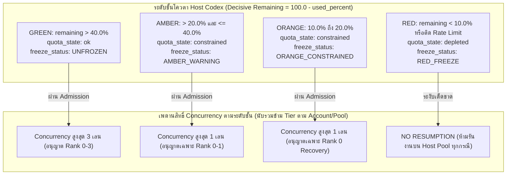
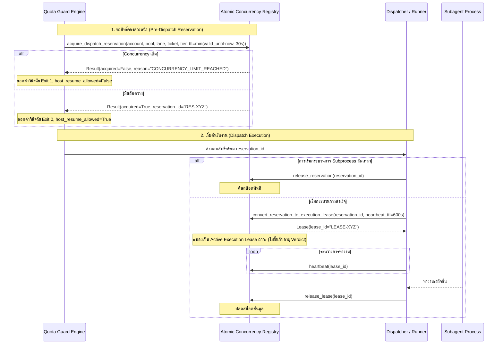
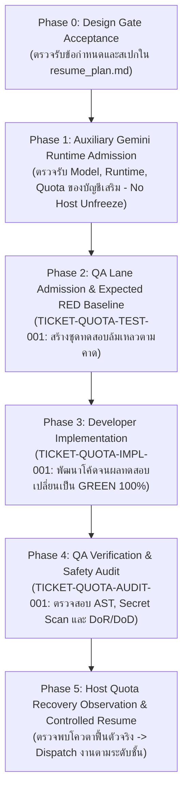

# สถาปัตยกรรม ข้อกำหนด และแผนการกู้คืนระบบตรวจวัดโควตา (Revision 3.4)
## Fail-Closed Quota Guard & Collector Architecture, Specification, and Resume Plan

> **สถานะเอกสาร (Document Status):** `DESIGN_ACCEPTED` *(เอกสารข้อกำหนดเชิงสถาปัตยกรรมและแผนงานกู้คืนระบบฉบับสมบูรณ์ การเริ่มต้น Implementation ต้องเป็นไปตามลำดับขั้นของ Gate ที่ระบุในเอกสารนี้)*
> **ไฟล์เป้าหมาย (Target File):** `resume_plan.md`
> **สถานะการระงับของระบบปัจจุบัน (Host Freeze Status):** `RED_FREEZE` *(อ้างอิง **ผลการตรวจวัดที่รายงานไว้ (Reported Observation Data)** ของ App Server บัญชี `prolite`, Host Codex weekly pool ใช้งาน 100%, โควตาคงเหลือ 0.0%, ติดสถานะ `rate_limit_reached`, กำหนดเวลารีเซ็ต 2026-09-11T18:14:56+07:00 ไม่ใช่ผลสดสำหรับรอบปัจจุบัน)*
> **โมเดลเป้าหมายการประมวลผล (Target Model Label):** `gemini3.8flash` พร้อมระดับการคิด (Reasoning Level) `high` *(ประกาศเป็นเจตจำนงการกำหนดเส้นทางงานสถาปัตยกรรม ซึ่งต้องผ่านการตรวจสอบยืนยันสิทธิ์และการรับเข้า [Admission] จริงในระบบรันไทม์ ห้ามทำการสำรองหรือถอยกลับเงียบๆ [No Silent Fallback])*

---

## 1. บทสรุปผู้บริหารและหลักการพื้นฐาน (Executive Summary & Core Principles)

เอกสารฉบับนี้กำหนดสถาปัตยกรรม ข้อกำหนดทางเทคนิค และแผนการดำเนินงานสำหรับการพัฒนาระบบตรวจวัดและป้องกันโควตาแบบปลอดภัยขั้นสูงสุด (Fail-Closed Quota Guard & Collector) เพื่อรองรับการทำงานร่วมกันระหว่างโฮสต์หลัก (Host Codex) และระบบประมวลผลเสริม (Auxiliary Gemini Runtime) ภายใต้มาตรฐาน AI SDLC

### หลักการสำคัญ 6 ประการ:
1. **ระบบระดับชั้นโควตา 4 ระดับ (4-Tier Scale)**: แบ่งระดับความพร้อมตามเปอร์เซ็นต์โควตาคงเหลือที่คำนวณอย่างเด็ดขาด (`decisive_remaining = 100.0 - used_percent`)
2. **การแยกพูลเด็ดขาด (Pool Isolation)**: พูล Host Codex (`limitId: "codex"`) ถูกแยกออกจากการตัดสินใจของ Spark Pool (`codex_bengalfox`) และโมเดลภายนอกโดยสิ้นเชิง
3. **การแยก Control Plane ออกจาก Data Plane**: สภาวะ `RED_FREEZE` ระงับเฉพาะงานประมวลผลและการแก้ไขโค้ด (Data Plane) แต่คงสิทธิ์การตรวจวัดสถานะโควตาผ่านช่องทางควบคุม (Control Plane) เพื่อให้ระบบสามารถตรวจจับการฟื้นตัวได้
4. **การบริหารสิทธิ์ Concurrency สองระยะ (Two-Phase Concurrency)**: แยกสิทธิ์การจองก่อนเริ่มงาน (`Dispatch Reservation`) ออกจากสิทธิ์ระหว่างการทำงานจริง (`Active Execution Lease`) พร้อมการคงสล็อตเมื่อสัญญาณชีพขาดหาย (`Suspect Lease Holding`)
5. **การตรวจสอบนโยบายแบบเข้มงวด (Strict Effective Policy)**: โหลดคอนฟิกนโยบายทั้งหมดผ่าน Hash ที่ได้รับการรับรอง ปราศจากค่าเริ่มต้นซ่อนเร้น (Zero Silent Fallbacks)
6. **การพัฒนาแบบ TDD (Test-Driven Development)**: เริ่มต้นจากชุดทดสอบล้มเหลวตามคาด (Expected RED Baseline) ก่อนส่งมอบให้ Developer พัฒนาจนผ่าน 100% (GREEN)

---

## 2. นโยบายระดับชั้นโควตาและการจำกัดสิทธิ์ (4-Tier Quota Scale & Concurrency Policy)



### รายละเอียดระดับชั้นโควตา:
- **GREEN (`decisive_remaining > 40.0%`)**:
  - `quota_state`: `"ok"`, `freeze_status`: `"UNFROZEN"`
  - อนุญาต Concurrency รวมสูงสุด 3 เลนงาน ครอบคลุมตั๋วงาน Rank 0 ถึง Rank 3
- **AMBER (`20.0% < decisive_remaining <= 40.0%`)**:
  - `quota_state`: `"constrained"`, `freeze_status`: `"AMBER_WARNING"`
  - อนุญาต Concurrency สูงสุด 1 เลนงาน จำกัดเฉพาะตั๋วงาน Rank 0 (อ่าน/ตรวจวัด) และ Rank 1 (งานพัฒนาไฟล์เดี่ยวแบบย้อนกลับได้ง่าย)
- **ORANGE (`10.0% <= decisive_remaining <= 20.0%`)**:
  - `quota_state`: `"constrained"`, `freeze_status`: `"ORANGE_CONSTRAINED"`
  - อนุญาต Concurrency สูงสุด 1 เลนงาน จำกัดเฉพาะตั๋วงานกู้คืนระบบฉุกเฉินระดับ Rank 0 (Recovery Lane) เท่านั้น ห้ามรันงานพัฒนาโค้ดใหม่
- **RED (`decisive_remaining < 10.0%` หรือมีสัญญาณ `rate_limit_reached`)**:
  - `quota_state`: `"depleted"`, `freeze_status`: `"RED_FREEZE"`
  - ระงับการประมวลผลบน Host Codex Pool โดยสมบูรณ์ (`host_resume_allowed = false`)

---

## 3. ลำดับความสำคัญของข้อผิดพลาดและรหัสจบการทำงาน (Precedence Hierarchy & Exit Codes)

เมื่อเกิดข้อผิดพลาดขึ้นในระบบ การตัดสินใจเลือก `reason_code` หลักและการกำหนด `exit_code` จะเป็นไปตาม **ลำดับความสำคัญเด็ดขาด 8 ขั้น (Precedence Ranks 1 ถึง 8)**:

```
[Rank 1] ข้อผิดพลาดด้าน Collector / Transport / Parsing / Provenance (Exit 3)
         └── COLLECTOR_TIMEOUT, COLLECTOR_AUTH_FAILURE, PAYLOAD_NOT_OBJECT, PROVENANCE_CONTEXT_INVALID
[Rank 2] ข้อผิดพลาดความไม่ตรงกันของบัญชีสามฝ่าย (Identity Mismatch) (Exit 3)
         └── AUTHENTICATED_ACCOUNT_MISMATCH -> PAYLOAD_ACCOUNT_MISMATCH -> ACCOUNT_IDENTITY_MISMATCH
[Rank 3] ข้อผิดพลาดไวยากรณ์โครงสร้างข้อมูล (Structural Schema Validation) (Exit 3)
         └── SCHEMA_VALIDATION_FAILED, ACCOUNT_UUID_MALFORMED
[Rank 4] ข้อผิดพลาดด้านความสดและค่าตัวเลขของหน้าต่างเวลา (Freshness & Semantic Windows) (Exit 3)
         └── TIMESTAMP_IN_FUTURE, OBSERVATION_STALE, HOST_WEEKLY_WINDOW_MISSING, WINDOW_MATH_INCONSISTENT
[Rank 5] ข้อผิดพลาดด้านนโยบายที่รับรอง (Policy Admission Failures) (Exit 2)
         └── POLICY_NOT_APPROVED, POLICY_MALFORMED
[Rank 6] โควตาหมดหรือติดสัญญาณจำกัดอัตรา (Quota Depletion - เมื่อ Policy ผ่าน) (Exit 1)
         └── RATE_LIMIT_ACTIVE, QUOTA_DEPLETED
[Rank 7] ข้อจำกัด Concurrency และ Rank ของตั๋วงาน (Concurrency & Rank Ceilings) (Exit 1)
         └── CONCURRENCY_LIMIT_REACHED, LANE_RANK_DISALLOWED_IN_AMBER, LANE_NOT_ALLOWED_IN_ORANGE
[Rank 8] ข้อผิดพลาดด้านการรับเข้า เอกสาร และสิทธิ์อนุมัติ (Admission & Authorization) (Exit 2)
         └── SOURCE_ADMISSION_FAILED, CANONICAL_HANDOFF_INVALID, LANE_READINESS_FAILED,
             OPERATOR_AUTHORIZATION_INVALID, OPERATOR_AUTHORIZATION_EXPIRED, ADMISSION_EVIDENCE_EXPIRED,
             VERDICT_LIFETIME_EXPIRED, WORKTREE_DIGEST_MISMATCH, SIMULATION_VERDICT_REJECTED
```

### ตารางรหัสจบการทำงานตายตัว (Definitive EXIT_CODE_MAP)

```python
EXIT_CODE_MAP = {
    # Exit Code 1: Quota Exhausted, Rate Limit, หรือ Concurrency / Rank เกินพิกัด
    "QUOTA_DEPLETED": 1,
    "RATE_LIMIT_ACTIVE": 1,
    "CONCURRENCY_LIMIT_REACHED": 1,
    "LANE_RANK_DISALLOWED_IN_AMBER": 1,
    "LANE_NOT_ALLOWED_IN_ORANGE": 1,
    "HOST_QUOTA_INSUFFICIENT": 1,

    # Exit Code 2: การรับเข้าไม่ผ่าน, นโยบายไม่รับรอง, เอกสารผิดพลาด, สิทธิ์หมดอายุ
    "POLICY_NOT_APPROVED": 2,
    "POLICY_MALFORMED": 2,
    "SOURCE_ADMISSION_FAILED": 2,
    "CANONICAL_HANDOFF_INVALID": 2,
    "LANE_READINESS_FAILED": 2,
    "OPERATOR_AUTHORIZATION_MISSING": 2,
    "OPERATOR_AUTHORIZATION_INVALID": 2,
    "OPERATOR_AUTHORIZATION_EXPIRED": 2,
    "OPERATOR_AUTHORIZATION_REVOKED": 2,
    "OPERATOR_AUTHORIZATION_SCOPE_MISMATCH": 2,
    "ADMISSION_EVIDENCE_MISSING": 2,
    "ADMISSION_EVIDENCE_INVALID": 2,
    "ADMISSION_EVIDENCE_EXPIRED": 2,
    "VERDICT_LIFETIME_EXPIRED": 2,
    "WORKTREE_DIGEST_MISSING": 2,
    "WORKTREE_DIGEST_INVALID": 2,
    "WORKTREE_DIGEST_MISMATCH": 2,
    "TICKET_ID_MISSING": 2,
    "TICKET_ID_INVALID": 2,
    "LANE_ID_MISSING": 2,
    "LANE_ID_INVALID": 2,
    "ASSIGNED_ROLE_MISSING": 2,
    "ASSIGNED_ROLE_INVALID": 2,
    "LANE_RANK_INVALID": 2,
    "SIMULATION_VERDICT_REJECTED": 2,

    # Exit Code 3: ข้อผิดพลาดทางเทคนิค, โครงสร้างเสียหาย, Identity ผิดพลาด, ข้อมูลดิบผิดรูป
    "PAYLOAD_NOT_OBJECT": 3,
    "PAYLOAD_DECODE_ERROR": 3,
    "PROVENANCE_CONTEXT_INVALID": 3,
    "AUTHENTICATED_ACCOUNT_MISMATCH": 3,
    "PAYLOAD_ACCOUNT_MISMATCH": 3,
    "ACCOUNT_IDENTITY_MISMATCH": 3,
    "ACCOUNT_UUID_MALFORMED": 3,
    "HOST_LIMIT_ID_MISMATCH": 3,
    "HOST_POOL_MISSING": 3,
    "HOST_WINDOWS_EMPTY": 3,
    "HOST_WEEKLY_WINDOW_MISSING": 3,
    "HOST_WEEKLY_WINDOW_DUPLICATE": 3,
    "SCHEMA_VALIDATION_FAILED": 3,
    "TIMESTAMP_MALFORMED": 3,
    "TIMESTAMP_IN_FUTURE": 3,
    "OBSERVATION_STALE": 3,
    "COLLECTOR_TIMEOUT": 3,
    "COLLECTOR_AUTH_FAILURE": 3,
    "COLLECTOR_TRANSPORT_ERROR": 3,
    "COLLECTOR_INVALID_RESPONSE": 3,
    "COLLECTOR_OVERSIZED_RESPONSE": 3,
    "COLLECTOR_PROCESS_SPAWN_ERROR": 3,
    "REGISTRY_UNAVAILABLE": 3,
    "REGISTRY_TIMEOUT": 3,
    "REGISTRY_INVALID_RESULT": 3,
    "INTERNAL_EVALUATION_ERROR": 3,
}
```

---

## 4. สัญญาการควบคุม Concurrency: Reservation สู่ Execution Lease



### สัญญาระดับสถาปัตยกรรม (Concurrency Rules):
1. **การรวม Concurrency ข้าม Tier (Cross-Tier Aggregation)**: นับจำนวนรวมตาม `(account_id, pool_id)`: `total_active = active_leases + active_reservations`
2. **การคงสล็อตเมื่อขาด Heartbeat (Suspect Holding)**: เมื่อ Heartbeat ขาดหาย Lease จะเป็น `suspect` แต่ยังคงนับครองสล็อตต่อไป จนกว่าจะมีกระบวนการยืนยันว่า Process ยุติแล้วจริง เพื่อป้องกัน Race Condition
3. **การป้องกันเมื่อ Tier ลดระดับ (Tier Downgrade Protection)**: หากโควตาลดลงจน Active Jobs เกินเพดานใหม่ ระบบจะบล็อกงานใหม่เท่านั้น ห้ามฆ่างานเดิมที่กำลังรันอยู่

---

## 5. ข้อกำหนดสกีมาคำวินิจฉัยสิทธิ์ฉบับสมบูรณ์ (`QuotaGuardVerdictV3.3`)

สกีมารองรับค่า `null` ในทุกฟิลด์ของเส้นทางข้อผิดพลาด พร้อมโครงสร้างการตรวจสอบย้อนกลับ:

```json
{
  "$schema": "https://json-schema.org/draft/2020-12/schema",
  "title": "QuotaGuardVerdictV3_3",
  "type": "object",
  "required": [
    "schema_version", "evaluated_at", "valid_until", "target_account", "limit_id",
    "observation_ref", "policy_version", "policy_hash", "policy_admission_status",
    "operator_authorization_ref", "lane_binding", "verdict_kind", "quota_state",
    "tier", "freeze_status", "source_admitted", "source_admission_status",
    "handoff_valid", "handoff_status", "quota_recovery_proven", "lane_readiness",
    "operator_authorization", "reason_code", "admission_blockers", "diagnostics",
    "host_resume_allowed", "exit_code"
  ],
  "additionalProperties": false,
  "properties": {
    "schema_version": { "type": "string", "const": "QuotaGuardVerdictV3.3" },
    "evaluated_at": { "type": "string", "format": "date-time" },
    "valid_until": { "type": "string", "format": "date-time" },
    "target_account": { "type": ["string", "null"], "pattern": "^[0-9a-f]{8}-[0-9a-f]{4}-[0-9a-f]{4}-[0-9a-f]{4}-[0-9a-f]{12}$" },
    "limit_id": { "type": "string", "const": "codex" },
    "observation_ref": { "type": ["string", "null"], "pattern": "^[a-f0-9]{64}$" },
    "policy_version": { "type": "string" },
    "policy_hash": { "type": ["string", "null"], "pattern": "^[a-f0-9]{64}$" },
    "policy_admission_status": { "type": "string", "enum": ["APPROVED", "PENDING_AUTHORIZATION", "REJECTED", "MALFORMED"] },
    "operator_authorization_ref": { "type": ["string", "null"] },
    "lane_binding": {
      "type": "object",
      "required": ["ticket_id", "lane_id", "assigned_role", "lane_rank", "target_worktree_digest"],
      "additionalProperties": false,
      "properties": {
        "ticket_id": { "type": ["string", "null"], "pattern": "^TICKET-[A-Z0-9_-]+$" },
        "lane_id": { "type": ["string", "null"], "pattern": "^[a-zA-Z0-9_.-]+$" },
        "assigned_role": {
          "type": ["string", "null"],
          "enum": [null, "orchestrator", "lead_ba", "ba_intake", "ba_auditor", "developer", "developer_api", "developer_core", "qa_tester", "code_reviewer", "devops", "ux_ui_designer", "ui_visual_tester"]
        },
        "lane_rank": { "type": ["integer", "null"], "minimum": 0, "maximum": 3 },
        "target_worktree_digest": { "type": ["string", "null"], "pattern": "^[a-f0-9]{64}$" }
      }
    },
    "verdict_kind": { "type": "string", "enum": ["production", "simulation"] },
    "quota_state": { "type": "string", "enum": ["ok", "constrained", "depleted", "unknown"] },
    "tier": { "type": "string", "enum": ["GREEN", "AMBER", "ORANGE", "RED", "UNKNOWN"] },
    "freeze_status": { "type": "string", "enum": ["UNFROZEN", "AMBER_WARNING", "ORANGE_CONSTRAINED", "RED_FREEZE", "UNKNOWN_FREEZE"] },
    "source_admitted": { "type": ["boolean", "null"] },
    "source_admission_status": { "type": "string", "enum": ["admitted", "rejected", "not_evaluated"] },
    "handoff_valid": { "type": ["boolean", "null"] },
    "handoff_status": { "type": "string", "enum": ["valid", "invalid", "not_evaluated"] },
    "quota_recovery_proven": { "type": "boolean" },
    "lane_readiness": { "type": "boolean" },
    "operator_authorization": { "type": "boolean" },
    "reason_code": { "type": "string" },
    "admission_blockers": { "type": "array", "items": { "type": "string" } },
    "diagnostics": {
      "type": "object",
      "required": ["decisive_remaining_percent", "validation_errors", "concurrency_state", "last_known_quota_state"],
      "additionalProperties": true,
      "properties": {
        "decisive_remaining_percent": { "type": ["number", "null"] },
        "validation_errors": { "type": "array", "items": { "type": "string" } },
        "concurrency_state": {
          "type": ["object", "null"],
          "required": ["active_count", "max_allowed", "reservation_id"],
          "additionalProperties": false,
          "properties": {
            "active_count": { "type": ["integer", "null"] },
            "max_allowed": { "type": ["integer", "null"] },
            "reservation_id": { "type": ["string", "null"] }
          }
        },
        "last_known_quota_state": { "type": ["string", "null"] },
        "error_details": { "type": "object", "additionalProperties": true }
      }
    },
    "host_resume_allowed": { "type": "boolean" },
    "exit_code": { "type": "integer", "enum": [0, 1, 2, 3] }
  }
}
```

---

## 6. ข้อกำหนดการตรวจรับรวมเพื่อเริ่มงาน (Unified Acceptance Invariants)

```text
Production admission succeeds only when:
- measurement and provenance are valid, trusted, and fresh;
- effective policy is approved, complete, and hash-bound;
- all required admission evidence is valid and unexpired;
- account/pool/ticket/lane/worktree/authorization bindings match;
- tier permits the lane;
- a valid single-use reservation is acquired.

At dispatch:
- revalidate expiry, revocation, bindings, and reservation;
- atomically consume reservation into an execution lease;
- begin worker execution only after that transition succeeds.

Invariant:
production --refresh exit_code == 0
iff host_resume_allowed == true.

Every denied outcome has a typed reason.
Every unexpected failure denies dispatch.
```

---

## 7. แผนการดำเนินงานกู้คืนระบบแบบเป็นขั้นตอน (Step-by-Step Resume Plan)



### รายละเอียดการดำเนินงานแต่ละระยะ:

### ระยะที่ 0: การตรวจรับ Design Gate (Phase 0: Design Gate Acceptance)
- **เงื่อนไข (DoR)**: เอกสาร `resume_plan.md` ครอบคลุมการปิดข้อบกพร่องทั้ง 10 จุดอย่างสมบูรณ์
- **ผลลัพธ์ (Deliverable)**: สถานะเอกสารเปลี่ยนเป็น `DESIGN_ACCEPTED` โดย Operator

### ระยะที่ 1: การตรวจรับบัญชีและรันไทม์ Gemini เสริม (Phase 1: Auxiliary Gemini Admission)
- **วัตถุประสงค์**: เพื่อให้มีรันไทม์ที่พร้อมปฏิบัติงานสำหรับตั๋วงานที่มอบหมายให้ Gemini โดยไม่ต้องรอโควตาของ Host Codex
- **ข้อกำหนดความปลอดภัย**:
  - ยืนยันรหัสโมเดล `gemini-3.8-flash` พร้อมระดับการคิด `high` ผ่านช่องทางที่เป็นทางการ
  - ตรวจวัดโควตาคงเหลือของบัญชี Gemini แยกต่างหาก
  - **กฎเหล็ก**: ห้ามนำผลตรวจรับของ Gemini ไปใช้ปลดสถานะ `RED_FREEZE` ของ Host Codex โดยเด็ดขาด

### ระยะที่ 2: การสร้างชุดทดสอบและบันทึก RED Baseline (Phase 2: QA Expected RED Baseline)
- **ตั๋วงาน**: `TICKET-QUOTA-TEST-001`
- **ผู้รับผิดชอบ**: `qa_tester` (ผูกมัดทักษะ `qa-regression-provenance`, `qa-e2e-testing`)
- **ขอบเขตไฟล์**: `tests/unit/test_quota_guard_v3.py`, `tests/fixtures/quota/**`, `plans/test_provenance/**`
- **ผลลัพธ์**: รันชุดทดสอบ TC-01 ถึง TC-69 บนโค้ดปัจจุบัน ได้ผลลัพธ์ล้มเหลวตามที่คาดการณ์ไว้ (Expected RED) และบันทึกเป็นหลักฐานอ้างอิง

### ระยะที่ 3: การพัฒนาโมดูลตัวดึงข้อมูลและ Guard Script (Phase 3: Implementation)
- **ตั๋วงาน**: `TICKET-QUOTA-IMPL-001`
- **ผู้รับผิดชอบ**: `developer` (ผูกมัดทักษะ `sdlc-aisdlc-workflow`)
- **ขอบเขตไฟล์**: `scripts/lib/quota_collector.py`, `scripts/agent_quota_status_guard.py`
- **ข้อกำหนดทางเทคนิค**:
  - พัฒนา `quota_collector.py` พร้อมระบบจัดการ Process Group และ Stream limit 64 KB
  - พัฒนา `agent_quota_status_guard.py` ให้รองรับคำสั่ง `--refresh`, ระบบ Precedence 8 ขั้น และการแมป Exit Code
  - ขับเคลื่อนจนชุดทดสอบ TC-01 ถึง TC-69 เปลี่ยนเป็น **GREEN ครบ 100%**

### ระยะที่ 4: การตรวจสอบความปลอดภัยและการตรวจรับ (Phase 4: Verification & Safety Audit)
- **ตั๋วงาน**: `TICKET-QUOTA-AUDIT-001`
- **ผู้รับผิดชอบ**: `code_reviewer` และ `ba_auditor`
- **กิจกรรม**:
  - สแกนความลับและตรวจสอบความปลอดภัยของ AST (Zero Secrets Leaked)
  - ตรวจสอบความสอดคล้องของ DoR และ DoD ตาม Agile Governance
  - ออกคำวินิจฉัยรับรองความพร้อมระดับ Production

### ระยะที่ 5: การสังเกตการณ์โควตาโฮสต์และการปลดล็อกตามลำดับ (Phase 5: Controlled Resumption)
- **กิจกรรม**:
  - ตรวจวัดสถานะโควตาของ Host Codex ผ่านคำสั่งที่ได้รับอนุญาต (`python3 scripts/agent_quota_status_guard.py --refresh`)
  - เมื่อตรวจพบหลักฐานการฟื้นตัวจริง (`decisive_remaining >= 10.0%` และไม่มีสัญญาณ Rate Limit) ปรับระดับชั้นจาก RED เป็น ORANGE, AMBER หรือ GREEN ตามความเป็นจริง
  - ทำการ Dispatch งานที่ค้างอยู่ตามเพดาน Concurrency และ Rank ของระดับชั้นนั้นๆ อย่างปลอดภัย

---

## 8. ตารางชุดกรณีทดสอบรวมฉบับสมบูรณ์ (Consolidated Test Baseline: TC-01 ถึง TC-69)

| กลุ่มการทดสอบ | รหัสทดสอบ | เงื่อนไขการจำลองและอินพุต | ผลลัพธ์ที่คาดหมาย (Expected Outcome) | Exit Code |
| :--- | :--- | :--- | :--- | :--- |
| **Policy** | **TC-52** | Policy มีสถานะ `PENDING_AUTHORIZATION` | `reason_code: "POLICY_NOT_APPROVED"`, ไม่ประเมิน Tier | **2** |
| | **TC-55** | Policy ขาดคีย์ `max_concurrency_green` | `reason_code: "POLICY_MALFORMED"`, ไม่ประเมิน Tier | **2** |
| | **TC-60** | Policy มีค่า TTL เป็น NaN หรือติดลบ | `reason_code: "POLICY_MALFORMED"`, คืน Exit 2 | **2** |
| | **TC-61** | Concurrency ใน Policy เป็นเศษส่วน `1.5` | `reason_code: "POLICY_MALFORMED"`, คืน Exit 2 | **2** |
| | **TC-62** | Thresholds ใน Policy เรียงสลับลำดับ | `reason_code: "POLICY_MALFORMED"`, คืน Exit 2 | **2** |
| **Lifetime** | **TC-46** | `obs_age = 59s`, evidence เหลือ 100s | `valid_until = now + 1s`, ทำงานได้ถ้าทันเวลา | 0 (ถ้าผ่านครบ) |
| | **TC-53** | `evidence_expires_at <= now` | `reason_code: "ADMISSION_EVIDENCE_EXPIRED"` | **2** |
| | **TC-63** | Verdict เหลืออายุ 0.5 วินาที (`ttl = 0.5s`) | ส่ง Float เข้า Registry สำเร็จ หรือติด `VERDICT_LIFETIME_EXPIRED` | 0 หรือ 2 |
| | **TC-64** | Auth Token ถูก Revoke ก่อน Dispatch | Dispatcher ปฏิเสธ -> `OPERATOR_AUTHORIZATION_REVOKED` | **2** |
| **Reservation** | **TC-45** | ร้องขอ 2 คำขอแย่ง 1 สล็อตใน AMBER | งานแรกได้ reservation (0), งานที่สองติด `CONCURRENCY_LIMIT_REACHED` | **1** |
| | **TC-65** | คำขอซ้ำ (Duplicate Request ID) | คืนสิทธิ์เดิมแบบ Idempotent ห้ามจองสล็อตเพิ่ม | 0 |
| | **TC-66** | Registry เกิด Timeout ระหว่างจองสล็อต | ตัดจบ Fail-Closed -> `reason: "REGISTRY_UNAVAILABLE"` | **3** |
| **Execution Lease**| **TC-54**| แปลงเป็น Lease สำเร็จแล้ว Verdict หมดอายุ | Active Lease ยังคงอยู่ งานไม่หลุดจาก Concurrency Count | N/A |
| | **TC-67** | Subprocess Spawn ล้มเหลว | Runner สั่ง `release_reservation()` สล็อตคืนพูลทันที | N/A |
| | **TC-68** | Heartbeat ของ Worker ขาดหาย | Lease เปลี่ยนเป็น `suspect` สล็อตยังถูกถือครอง | N/A |
| **Output / Error**| **TC-49A**| Duration ใน Window 1 เป็น String `"invalid"` | ติดที่ด่าน Schema ทันที -> `SCHEMA_VALIDATION_FAILED` | **3** |
| | **TC-49B**| Window 1: 50+45=95%, Window 2: 20+70=90% | โครงสร้างผ่าน แต่สะสม Semantic Errors ทั้ง 2 ตัวลง `validation_errors[]` | **3** |
| | **TC-56** | ส่ง `lane_rank = 9` (หลุดช่วง [0, 3]) | ใน Verdict ถูก Sanitize เป็น `null` และติด `LANE_RANK_INVALID` | **2** |
| | **TC-57** | ส่ง Worktree Digest `"abc"` | ใน Verdict ถูก Sanitize เป็น `null` และติด `WORKTREE_DIGEST_INVALID` | **2** |
| | **TC-69** | Payload ขาเข้าเป็น String หรือ List แทน Dict | ดักจับด้วย `isinstance` -> `PAYLOAD_NOT_OBJECT` | **3** |
| **Consistency** | **TC-41** | `expected == auth` แต่ `payload != expected` | `reason_code: "PAYLOAD_ACCOUNT_MISMATCH"` | **3** |
| | **TC-58** | Quota หมด ร่วมกับ Source Admission ไม่ผ่าน | Quota Precedence ชนะ -> `reason_code: "QUOTA_DEPLETED"` | **1** |
| | **TC-59** | Context ขาดหาย หรือระบุไม่ชัดเจน | `verdict_kind: "simulation"`, `recovery_proven: false` | **3** |

---

## 9. ข้อมูลกำกับเอกสารและขอบเขตความปลอดภัย (Document Metadata & Guardrails)

```yaml
document_metadata:
  title: "Fail-Closed Quota Guard & Collector Architecture, Specification, and Resume Plan (Revision 3.4)"
  revision: 3.4
  file_path: "resume_plan.md"
  timestamp: "2026-09-05T19:40:00+07:00"
  status: "DESIGN_ACCEPTED"
  active_freeze: "RED_FREEZE"
  reported_observation:
    account_id: "08a4df52-9b3d-4d09-9bd5-af0f7e0e8043"
    weekly_pool_remaining: 0.0
    rate_limit: "rate_limit_reached"
    resets_at: "2026-09-11T18:14:56+07:00"
  target_model:
    label: "gemini3.8flash"
    reasoning_level: "high"
    runtime_verification_required: true
    silent_fallback_permitted: false
  governance:
    owner: "orchestrator"
    authoritative_docs:
      ticket_registry: "ATOMIC_TICKET.md"
      implementation_plan: "plans/plan.md"
      handoff_snapshot: "HANDOFF.md (Derived)"
```
